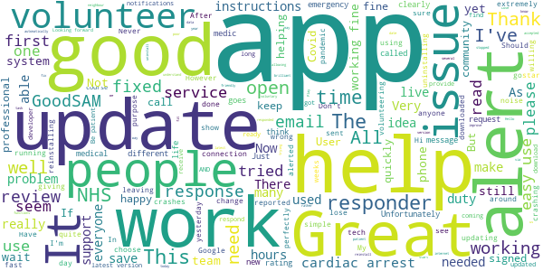
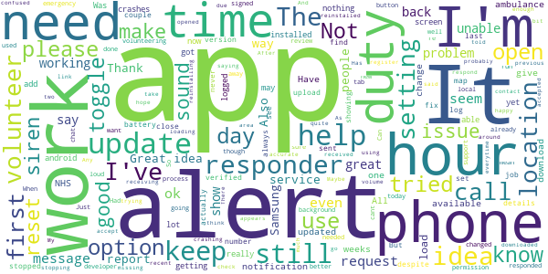
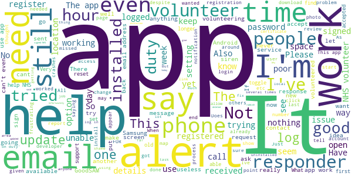

# GoodSAM Responder
App version ``12.6``

Analyzed with [covid-apps-observer](http://github.com/covid-apps-observer) project, version ``0.1``

## App overview
| | |
|-------------------------|-------------------------| 
| **Name**&nbsp;&nbsp;&nbsp;&nbsp;&nbsp;&nbsp;&nbsp;&nbsp;&nbsp;&nbsp;&nbsp;&nbsp;&nbsp;&nbsp;&nbsp;&nbsp;&nbsp;&nbsp;&nbsp;&nbsp;&nbsp;&nbsp;&nbsp;&nbsp;&nbsp;&nbsp;&nbsp;&nbsp;&nbsp;&nbsp;&nbsp;&nbsp;&nbsp;&nbsp;&nbsp;&nbsp;&nbsp;&nbsp;&nbsp;&nbsp;  | GoodSAM Responder |
| **Unique identifier** | com.goodsam.responder |
| **Link to Google Play** | [https://play.google.com/store/apps/details?id=com.goodsam.responder](https://play.google.com/store/apps/details?id=com.goodsam.responder) |
| **Summary**  | GoodSAM connects those with specific skill sets to those in need. |
| **Privacy policy** | [https://goodsamapp.org/dataprotection](https://goodsamapp.org/dataprotection) |
| **Latest version** | 12.6 |
| **Last update** | 2020-12-27 15:45:40 |
| **Recent changes** | Fixing the bug which was causing the app to crash when uploading a photo affecting some android phones. |
| **Installs**  | 100,000+ |
| **Category** | Health & Fitness |
| **First release** | Apr 21, 2014 |
| **Size**  | 55M |
| **Supported Android version**  | 4.1 and up |

### Description
> The GoodSAM Responder App is a professional deployment system used by Emergency Services around the world.
 GoodSAM provides a range of solutions connecting those with specific skill sets to those in need, for example:
 -       GoodSAM Cardiac – This system is used by ambulance services to alert those trained in resuscitation (e.g. off duty paramedics, nurses, doctors, police and fire staff) to those nearby who are likely to be in cardiac arrest. This system has saved many lives around the world.
 -       GoodSAM Volunteer Response – GoodSAM is a platform used by organisations such as the Royal Voluntary Service and British Red Cross.
 -       GoodSAM Pro – This is a professional dispatch system for community first responders and the emergency services.
 The App utilises the latest in location technology and has many advanced features including a built in “radio” (Buzz) function so you can communicate with surrounding colleagues.
 The GoodSAM platform has saved hundreds of lives and helped many thousands of people around the world. If you can help your community, please download the App and register under your parent organisation (or get your parent organisation on board if they are not on!).
 Visit www.goodsamapp.org for more information
 Please download the App and join our global community.

### User interface
The developers of the app provide the following screenshots in the Google play store.
| | | |
|:-------------------------:|:-------------------------:|:-------------------------:|
 |   |   |   | 
 |   |   |   | 
 |   |  

## Development team
In the following we report the main information provided by the development team in the Google play store.

| | |
|-------------------------|-------------------------|
| **Developer**  | GoodSAM LTD |
| **Website**  | [http://www.goodsamapp.org/](http://www.goodsamapp.org/) |
| **Email** | info@goodsamapp.org |
| **Physical address**  | - |
| **Other developed apps**  | [https://play.google.com/store/apps/developer?id=GoodSAM+LTD](https://play.google.com/store/apps/developer?id=GoodSAM+LTD) |

## Android support

| | |
|-------------------------|-------------------------|
| **Declared target Android version**  | Android10, version 10 (API level 29) |
| **Effective target Android version**  | Android10, version 10 (API level 29) |
| **Minimum supported Android version**  | Jelly Bean, version 4.1.x (API level 16) |
| **Maximum target Android version**  | - |

The larger the difference between the minimum and maximum supported Android versions, the better. A larger difference means a wider audience. For example, old phones have a very low Android version, so a high minimum supported Android version means that the app cannot be used by users with old phones, thus leading to accessibility problems. 

## Requested permissions

In the following we report the complete list of the permissions requested by the app. 

| **Permission** | **Protection level** | **Description** | 
|-------------------------|-------------------------|-------------------------|
 **android.permission ACCESS_BACKGROUND_LOCATION** | :warning:**Dangerous** | Allows an app to access location in the background. 
 **android.permission ACCESS_COARSE_LOCATION** | :warning:**Dangerous** | Allows an app to access approximate location. 
 **android.permission ACCESS_FINE_LOCATION** | :warning:**Dangerous** | Allows an app to access precise location. 
 **android.permission ACCESS_NETWORK_STATE** | Normal | Allows applications to access information about networks. 
 **android.permission CAMERA** | :warning:**Dangerous** | Required to be able to access the camera device. 
 **android.permission FLASHLIGHT** | - | - 
 **android.permission GET_ACCOUNTS** | :warning:**Dangerous** | Allows access to the list of accounts in the Accounts Service. 
 **android.permission INTERNET** | Normal | Allows applications to open network sockets. 
 **android.permission MODIFY_AUDIO_SETTINGS** | Normal | Allows an application to modify global audio settings. 
 **android.permission READ_CONTACTS** | :warning:**Dangerous** | Allows an application to read the user's contacts data. 
 **android.permission READ_EXTERNAL_STORAGE** | :warning:**Dangerous** | Allows an application to read from external storage. 
 **android.permission READ_OWNER_DATA** | - | - 
 **android.permission RECEIVE_BOOT_COMPLETED** | Normal | Allows an application to receive the Intent.ACTION_BOOT_COMPLETED that is broadcast after the system finishes booting. 
 **android.permission RECORD_AUDIO** | :warning:**Dangerous** | Allows an application to record audio. 
 **android.permission REQUEST_IGNORE_BATTERY_OPTIMIZATIONS** | Normal | Permission an application must hold in order to use Settings.ACTION_REQUEST_IGNORE_BATTERY_OPTIMIZATIONS. 
 **android.permission USE_CREDENTIALS** | - | - 
 **android.permission VIBRATE** | Normal | Allows access to the vibrator. 
 **android.permission WAKE_LOCK** | Normal | Allows using PowerManager WakeLocks to keep processor from sleeping or screen from dimming. 
 **android.permission WRITE_EXTERNAL_STORAGE** | :warning:**Dangerous** | Allows an application to write to external storage. 
 **com.goodsam.responder.permission C2D_MESSAGE** | - | - 
 **com.goodsam.responder.permission MAPS_RECEIVE** | - | - 
 **com.google.android.c2dm.permission RECEIVE** | - | - 
 **com.google.android.finsky.permission BIND_GET_INSTALL_REFERRER_SERVICE** | - | - 
 **com.google.android.gms.permission ACTIVITY_RECOGNITION** | - | - 
 **com.google.android.providers.gsf.permission READ_GSERVICES** | - | - 

## Mentioned servers

| **Server** | **Registrant** | **Registrant country** | **Creation date** | 
|-------------------------|-------------------------|-------------------------|-------------------------|
 | facebook.com | Facebook, Inc. | :us: US | 1997-03-29 05:00:00 |
 | google.com | Google LLC | :us: US | 1997-09-15 04:00:00 |
 | goodsam.co.uk | - | - | 2013-07-27 00:00:00 |
 | goodsamapp.org | Registrant State/Province: | GB | 2014-03-17 22:10:28 |
 | linkedin.com | LinkedIn Corporation | :us: US | 2002-11-02 15:38:11 |
 | googlesyndication.com | Google LLC | :us: US | 2003-01-21 06:17:24 |
 | googleapis.com | Google LLC | :us: US | 2005-01-25 17:52:26 |
 | app-measurement.com | Google LLC | :us: US | 2015-06-19 20:13:31 |
 | googleadservices.com | Google LLC | :us: US | 2003-06-19 16:34:53 |

## Security analysis 

Below we report the main security warnings raised by our execution of the [Androwarn](https://github.com/maaaaz/androwarn) security analysis tool.

**Telephony identifiers leakage**
> - This application reads the numeric name (MCC+MNC) of current registered operator 
> - This application reads the operator name 

**Connection interfaces exfiltration**
> - This application reads details about the currently active data network 
> - This application tries to find out if the currently active data network is metered 

**Audio video eavesdropping**
> - This application records audio from the 'MIC' source  

**Suspicious connection establishment**
> - This application opens a Socket and connects it to the remote address '' on the 'N/A' port  
> - This application opens a Socket and connects it to the remote address 'Ljava/lang/StringBuilder;->toString()Ljava/lang/String;' on the 'N/A' port  
> - This application opens a Socket and connects it to the remote address 'Ljava/net/Proxy;->type()Ljava/net/Proxy$Type;' on the 'N/A' port  
> - This application opens a Socket and connects it to the remote address 'Lorg/apache/http/HttpHost;->getPort()I' on the 'Lorg/apache/http/HttpHost;->getPort()I' port  
> - This application opens a Socket and connects it to the remote address 'timeout' on the 'N/A' port  

**Code execution**
> - This application loads a native library 
> - This application executes a UNIX command 

## User ratings and reviews

Below we provide information about how end users are reacting to the app in terms of ratings and reviews in the Google Play store.

### Ratings

The GoodSAM Responder app has been installed by more than **100000** times. At this time, **1213** rated the app and its average score is **2.717742**. Below we show the distribution of the ratings across the usual star-based rating of Google Play

:star::star::star::star::star:: 254

:star::star::star::star:: 117

:star::star::star:: 225

:star::star:: 264

:star:: 353

### Reviews 

#### 5-star reviews

> Yay ! Now can change the alert sound, both I, my neighbour and my neighbour's dog are happy :-)  :date: __2020-12-21 15:15:22__

> Great App, functions well. Alot of people moaning about the noise but they need to understand it was originally set up to alert responders like myself to a cardiac arrest and that this happens infrequently and needs to be loud and out there to make sure it alerts us! I have responded using it and it was very good and I know of several responders that use it well.  :date: __2020-12-16 10:23:43__

> Helping in times like these is vital. User friendly precise and professional.  :date: __2020-09-20 17:43:57__

> Always freeze accept button when I am assigned for task...don't know what's happening...  :date: __2020-09-14 15:21:40__

> A service that provides help for people in need. Very professional and friendly service that's was needed during the Covid 19 pandemic but still provides essential services through out the year.  :date: __2020-09-04 21:29:15__

> Works well! Love being a Responder  :date: __2020-08-26 13:45:55__

> Never had a problem with this app. Very straight forward and they are keen to improve it as it gets used more and more.  :date: __2020-06-19 13:17:18__

> Never had an issue with the app. I use the OHCA responder as not signed up for the NHS voluntary scheme. One glitch I do need help with. I cannot upload photo or position if a community defib. Have tried on 2 phones. Both have location and tags unlocked. But no joy. Any ideas. For those below who are not happy with the app. Keep trying. Be patient. This app has saved lives around the world. It was a steep climb for the design team to go from out of hospital cardiac arrest to what it is now  :date: __2020-06-12 12:32:12__

> Easy to use and extremely useful.  :date: __2020-06-08 21:45:43__

> Very easy to use and works as it should.  :date: __2020-06-03 18:05:29__

#### 4-star reviews

> Swift reply  :date: __2020-12-30 22:08:38__

> As others have reported since last week I have not been receiving the sound alerts and the app is now version 12.5 - I can choose the sound on the"me" page but even the simulated alert doesn't produce a sound. I have missed several alerts including a patient transport. I now have tested the push notification and this worked, so will wait to see what happens when I get a real alert. Thanks for the quick response.  :date: __2020-12-27 12:30:16__

> Good support, very worthwhile and satisfying role in the community.  :date: __2020-12-27 00:45:31__

> Since recent update, siren won't play when simulating a test. Volume is up full, setting is active to play siren even on silent, all app permissions are same prior to update. Don't know if it will work if turnout is real?  :date: __2020-12-24 11:11:53__

> App won't let me register. Freezes with a spinning wheel icon after filling in the form  :date: __2020-12-19 03:03:10__

> Appreciate your helpful response - sadly my area is not on the list but I noticed the link for registering my interest in case it is added in the future. Thank you and all the best  :date: __2020-10-08 19:52:04__

> Please give us a volume control for that dreadful siren  :date: __2020-09-26 15:13:11__

> Well after not bothering to log on much over the summer due to never being called on, I received an email saying more people were needing help. Plus I felt I should do something to say thank you for early access to the Track and Trace app. I logged on half an hour ago and just had my first call! She's already received help from a neighbour but was very grateful for the call.  :date: __2020-09-25 11:51:16__

> The app work good. But the notification siren (which I am not able to change) puts me off. Think about a loud siren in the middle of a restaurant, quite house/work place. Ability to choose between a couple of notification tones/ringtones will be of great help. Thanks  :date: __2020-08-20 12:13:07__

> Seems to work fine, gives plenty of information. Has been disappointing the number of requests that have come through though. Maybe it is a good thing and very few locals need support during the Pandemic.  :date: __2020-07-01 14:54:44__

#### 3-star reviews

> UPDATE! Since couple of bug fixes - slightly improved, but my 'On Duty Hours' only increase when marked "off duty" on the toggles. Still unable to load AED's.  :date: __2020-12-31 12:02:28__

> I am missing calls because there is no sound alert !!!  :date: __2020-12-26 17:32:36__

> Since the new update the Responder app defined alert sound does not work. Instead it uses the standard system alert sound. I sent a test notification from the website as suggested but the loud alert sound does not work.  :date: __2020-12-23 13:35:56__

> I also can't get the sirens to work. All settings are as before.  :date: __2020-12-22 20:41:26__

> Not enough room to write in here what needs addressing as it's limited to 500 letters and spaces I'd barely touched the surface on what needs sorting and ran out of space, but there isn't enough information or user functionality in the app we need a lot more communication options in app with a more detailed description to assist with dealing with failed calls not being answered by the people that are in need plus a lot of other options and also an in app guidance and helpcentre  :date: __2020-12-10 11:08:18__

> Like others have said, I have an issue with the siren. I am a petsitter and it terrifies some of the cats I am visiting. I did ring and complain about this. I ended up turning it off the weeks. I have just turned it back on. Two alerts I accepted. First I keep ringing so dropped the job. Another had already arranged for someone to take him shopping. Now I have just got back the alert I dropped earlier and still no answer. The alerts are not reliable.  :date: __2020-11-28 18:46:36__

> Good app but siren way too loud, it's driving my neighbour mad ! Apart from that, as others say here, 90% of people I ring have no idea why I rang, or how or why somebody put them on list. That needs addressing . On top of that some of the alerts are days old ,their prescription or shopping done days ago.Im becoming a bit disheartened wasting my time every day. I'm more than happy to run around for folks but less happy with wasted calls  :date: __2020-11-19 16:11:24__

> Doesn't work. I try to register using my St John certificate and the swirl of doom just spins foreverrrrrrrr; by which I mean 20 minutes over WiFi. Was able to register via the Web then log in to the app. But app registration just did not work.  :date: __2020-11-17 22:19:48__

> I've responded a couple of times to find that the chat request was for the previous day and had been dealt with? Embarrassing and unnecessary and the siren is excruciating why not a special phone sound kinder on the ears  :date: __2020-11-03 13:24:23__

> The app is ok however this Sunday I received 6 requests in quick succession. All bar one needed no help, and most requests I get end up being no help needed. My main criticism of the app is that once an alert comes in it sets my notification volume to max. I don't want or need to be notified each time normal messages come in which is why it is set to mute. Please can you make sure the app doesn't change my notification settings  :date: __2020-10-09 21:17:20__

#### 2-star reviews

> Location update not working in the background (Android 11, Samsung S20), always getting alerts for emergencies 25mi away. It seems Android 11 isn't allowing an app anymore to ask for permanent background location permissions at point of installation. You have to go in the android apps settings and activate it manually.  :date: __2021-01-03 10:50:40__

> STILL UNABLE, to upload photos of new AEDs locations to the GoodSAM app this is after installing the latest version available. When trying to use a photo taken with a google pixel phone with all location accesses switch on, the GoodSAM app still says to use a picture with location services switched on. In the past, I've replied via email to yourselves about this issue, uploaded bug reports sent pictures and still awaiting your reply. The GoodSAM app still won't sync up with android auto.  :date: __2021-01-01 15:38:33__

> I haven't had contact for over s week and when i go into app says wrong email address !also no siren before that and missed several requests. Not contacted very often. Sometimes people dont need any help.  :date: __2020-12-30 19:12:30__

> When I access the map it get stuck and no response on the screen so can't escape. I have to uninstall and reinstall. This is on the samsung A40  :date: __2020-12-29 14:54:52__

> I have the same problem as previous reviewer ie no sound on Goodsam notifications. I've gone to the website and sent myself a push notification. I now get the standard Samsung notification sound rather than the very distinctive Goodsam loud SIREN. How do I get back to the siren?  :date: __2020-12-23 13:08:55__

> Since last weeks update I no longer receive an audio alert, just visual alert. I have had 6 alerts and missed a couple because of no siren. I have reinstalled the app, re booted the phone and tried it on another Sony and a Samsung. The same problem occurs. Really need a fix to ensure I don't miss any more alerts.  :date: __2020-12-23 11:56:05__

> App is ok but no way to check back on previous messages. I responded to a call from a gentleman who needed shopping tomorrow. I agreed to do it and then toggled the app to show "responded" as soon as I've done that then previous messages dissappear and I now no longer have address or contact details to sort this out tomorrow!!  :date: __2020-11-28 18:00:32__

> My app ppears that it doesn't work I havent had any alerts, and I can't change my organisation  :date: __2020-11-25 21:44:29__

> The alerts work for a few weeks then the siren stop and I'm not notified of an alert. It just says in comma you missed an alert. So frustrating.  :date: __2020-11-18 11:27:38__

> Very poor for something so important. Clumsy, bad layout, adding an AED is broken. Come on, this app is IMPORTANT. Sort it out. (Reply to developer - Yes I have checked both of those settings and it still doesn't work. No reply to 4 emails requesting help either)  :date: __2020-11-17 19:39:03__

#### 1-star reviews

> Lack of clear instructions for new users. Lack of clarity as to what to do when alerted. No facility to indicate failure to contact helpee. Ear splitting siren alert. Responder photo spuriously rotated by 90 degrees. Poor graphics on responder der map - much too large. Code of conduct is incorrect for repurposed usage of the app and assumes physical attendance - also requires acknowledgement to a statement I cannot comply with to use app.  :date: __2021-01-03 11:37:38__

> Absolute rubbish! Can't even register it keeps saying an email has been sent when I didn't even put my email address in anywhere and there is nothing in my emails including my spam, so I deleted the app and re installed it, tried again with an email address this time and it says you already have an account and to go to email to accept. But there is NO EMAIL! So frustrating!  :date: __2021-01-01 20:11:44__

> So complicated and unnecessary to use  :date: __2020-12-30 14:24:01__

> Signed up for volunteering i get a notification for help when I click on accept the app goes blurry in the background and the connection just swirls and freezes ive checked permissions and location permissions in settings they are all on.Ive got a Samsung s10 the app works on my sons phone which is the s8 dont understand why its not working on my phone.  :date: __2020-12-29 18:06:21__

> I am still not getting audio alerts on my app, which is essentail for what I use it for  :date: __2020-12-29 00:45:00__

> 2701 hours on duty and not a single request  :date: __2020-12-28 22:50:16__

> I previously commented that the siren alert no longer worked meaning I had missed several requests. The sound now works when I change the notification sound but still doesn't go off when I simulate an alert. Still a 1 star review until this basic function is fixed.  :date: __2020-12-28 18:25:42__

> The app needs to be more accurate, location tech needs updating and also needs some other updates and upgrades, it isn't showing i have a defib when I have uploaded it numerous times and it has been accepted on both apps please fix immediately/asap  :date: __2020-12-27 01:13:08__

> Since it updated I have missed two calls because it no longer rings but just dings. The siren was much easier to catch. May have to stop being a volunteer if I can't catch the calls in time.  :date: __2020-12-25 19:24:13__

> Worked fine for quite some time and yet now, no requests are coming through and nobody knows why. Have reinstalled etc but no joy. Constantly failing, and no reasoning for it, have emailed you but no response, so I can't help people who need support.  :date: __2020-12-17 19:46:06__

