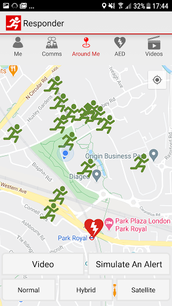
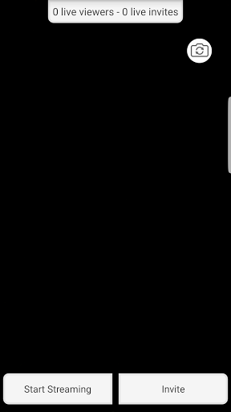

# GoodSAM Responder
App version ``13.1``

Analyzed with [covid-apps-observer](http://github.com/covid-apps-observer) project, version ``0.1``

## App overview
| | |
|-------------------------|-------------------------| 
| **Name**&nbsp;&nbsp;&nbsp;&nbsp;&nbsp;&nbsp;&nbsp;&nbsp;&nbsp;&nbsp;&nbsp;&nbsp;&nbsp;&nbsp;&nbsp;&nbsp;&nbsp;&nbsp;&nbsp;&nbsp;&nbsp;&nbsp;&nbsp;&nbsp;&nbsp;&nbsp;&nbsp;&nbsp;&nbsp;&nbsp;&nbsp;&nbsp;&nbsp;&nbsp;&nbsp;&nbsp;&nbsp;&nbsp;&nbsp;&nbsp;  | GoodSAM Responder |
| **Unique identifier** | com.goodsam.responder |
| **Link to Google Play** | [https://play.google.com/store/apps/details?id=com.goodsam.responder](https://play.google.com/store/apps/details?id=com.goodsam.responder) |
| **Summary**  | GoodSAM connects those with specific skill sets to those in need. |
| **Privacy policy** | [https://www.goodsamapp.org/dataprotectionhtml](https://www.goodsamapp.org/dataprotectionhtml) |
| **Latest version** | 13.1 |
| **Last update** | 2021-01-19 18:19:30 |
| **Recent changes** | Fixing a bug for Android 5.0 (2014) which was causing the screen to sometimes freeze. |
| **Installs**  | 100,000+ |
| **Category** | Health & Fitness |
| **First release** | Apr 21, 2014 |
| **Size**  | 55M |
| **Supported Android version**  | 4.1 and up |

### Description
> The GoodSAM Responder App is a professional deployment system used by Emergency Services around the world.
 GoodSAM provides a range of solutions connecting those with specific skill sets to those in need, for example:
 -       GoodSAM Cardiac – This system is used by ambulance services to alert those trained in resuscitation (e.g. off duty paramedics, nurses, doctors, police and fire staff) to those nearby who are likely to be in cardiac arrest. This system has saved many lives around the world.
 -       GoodSAM Volunteer Response – GoodSAM is a platform used by organisations such as the Royal Voluntary Service and British Red Cross.
 -       GoodSAM Pro – This is a professional dispatch system for community first responders and the emergency services.
 The App utilises the latest in location technology and has many advanced features including a built in “radio” (Buzz) function so you can communicate with surrounding colleagues.
 The GoodSAM platform has saved hundreds of lives and helped many thousands of people around the world. If you can help your community, please download the App and register under your parent organisation (or get your parent organisation on board if they are not on!).
 Visit www.goodsamapp.org for more information
 Please download the App and join our global community.

### User interface
The developers of the app provide the following screenshots in the Google play store.
| | | |
|:-------------------------:|:-------------------------:|:-------------------------:|
 |   |   |   | 
 |   |   |   | 
 |   |  

## Development team
In the following we report the main information provided by the development team in the Google play store.

| | |
|-------------------------|-------------------------|
| **Developer**  | GoodSAM LTD |
| **Website**  | [http://www.goodsamapp.org/](http://www.goodsamapp.org/) |
| **Email** | info@goodsamapp.org |
| **Physical address**  | - |
| **Other developed apps**  | [https://play.google.com/store/apps/developer?id=GoodSAM+LTD](https://play.google.com/store/apps/developer?id=GoodSAM+LTD) |

## Android support

| | |
|-------------------------|-------------------------|
| **Declared target Android version**  | - |
| **Effective target Android version**  | - |
| **Minimum supported Android version**  | Jelly Bean, version 4.1.x (API level 16) |
| **Maximum target Android version**  | - |

The larger the difference between the minimum and maximum supported Android versions, the better. A larger difference means a wider audience. For example, old phones have a very low Android version, so a high minimum supported Android version means that the app cannot be used by users with old phones, thus leading to accessibility problems. 

## Requested permissions

In the following we report the complete list of the permissions requested by the app. 

| **Permission** | **Protection level** | **Description** | 
|-------------------------|-------------------------|-------------------------|
 **android.permission ACCESS_BACKGROUND_LOCATION** | :warning:**Dangerous** | Allows an app to access location in the background. 
 **android.permission ACCESS_COARSE_LOCATION** | :warning:**Dangerous** | Allows an app to access approximate location. 
 **android.permission ACCESS_FINE_LOCATION** | :warning:**Dangerous** | Allows an app to access precise location. 
 **android.permission ACCESS_NETWORK_STATE** | Normal | Allows applications to access information about networks. 
 **android.permission CALL_PHONE** | :warning:**Dangerous** | Allows an application to initiate a phone call without going through the Dialer user interface for the user to confirm the call. 
 **android.permission CAMERA** | :warning:**Dangerous** | Required to be able to access the camera device. 
 **android.permission FLASHLIGHT** | - | - 
 **android.permission GET_ACCOUNTS** | :warning:**Dangerous** | Allows access to the list of accounts in the Accounts Service. 
 **android.permission INTERNET** | Normal | Allows applications to open network sockets. 
 **android.permission MODIFY_AUDIO_SETTINGS** | Normal | Allows an application to modify global audio settings. 
 **android.permission READ_CONTACTS** | :warning:**Dangerous** | Allows an application to read the user's contacts data. 
 **android.permission READ_EXTERNAL_STORAGE** | :warning:**Dangerous** | Allows an application to read from external storage. 
 **android.permission READ_OWNER_DATA** | - | - 
 **android.permission RECEIVE_BOOT_COMPLETED** | Normal | Allows an application to receive the Intent.ACTION_BOOT_COMPLETED that is broadcast after the system finishes booting. 
 **android.permission RECORD_AUDIO** | :warning:**Dangerous** | Allows an application to record audio. 
 **android.permission REQUEST_IGNORE_BATTERY_OPTIMIZATIONS** | Normal | Permission an application must hold in order to use Settings.ACTION_REQUEST_IGNORE_BATTERY_OPTIMIZATIONS. 
 **android.permission USE_CREDENTIALS** | - | - 
 **android.permission VIBRATE** | Normal | Allows access to the vibrator. 
 **android.permission WAKE_LOCK** | Normal | Allows using PowerManager WakeLocks to keep processor from sleeping or screen from dimming. 
 **android.permission WRITE_EXTERNAL_STORAGE** | :warning:**Dangerous** | Allows an application to write to external storage. 
 **com.goodsam.responder.permission C2D_MESSAGE** | - | - 
 **com.goodsam.responder.permission MAPS_RECEIVE** | - | - 
 **com.google.android.c2dm.permission RECEIVE** | - | - 
 **com.google.android.finsky.permission BIND_GET_INSTALL_REFERRER_SERVICE** | - | - 
 **com.google.android.gms.permission ACTIVITY_RECOGNITION** | - | - 
 **com.google.android.providers.gsf.permission READ_GSERVICES** | - | - 

## Mentioned servers

| **Server** | **Registrant** | **Registrant country** | **Creation date** | 
|-------------------------|-------------------------|-------------------------|-------------------------|
 | adobe.com | Adobe Inc. | :us: US | 1986-11-17 05:00:00 |
 | facebook.com | Facebook, Inc. | :us: US | 1997-03-29 05:00:00 |
 | google.com | Google LLC | :us: US | 1997-09-15 04:00:00 |
 | goodsam.co.uk | - | - | 2013-07-27 00:00:00 |
 | goodsamapp.org | Registrant State/Province: | GB | 2014-03-17 22:10:28 |
 | linkedin.com | LinkedIn Corporation | :us: US | 2002-11-02 15:38:11 |
 | googlesyndication.com | Google LLC | :us: US | 2003-01-21 06:17:24 |
 | googleapis.com | Google LLC | :us: US | 2005-01-25 17:52:26 |
 | app-measurement.com | Google LLC | :us: US | 2015-06-19 20:13:31 |
 | googleadservices.com | Google LLC | :us: US | 2003-06-19 16:34:53 |

## Security analysis 

Below we report the main security warnings raised by our execution of the [Androwarn](https://github.com/maaaaz/androwarn) security analysis tool.

**Telephony identifiers leakage**
> - This application reads the numeric name (MCC+MNC) of current registered operator 
> - This application reads the operator name 

**Connection interfaces exfiltration**
> - This application reads details about the currently active data network 
> - This application tries to find out if the currently active data network is metered 

**Telephony services abuse**
> - This application makes phone calls 

**Audio video eavesdropping**
> - This application records audio from the 'MIC' source  

**Suspicious connection establishment**
> - This application opens a Socket and connects it to the remote address '' on the 'N/A' port  
> - This application opens a Socket and connects it to the remote address 'Ljava/lang/StringBuilder;->toString()Ljava/lang/String;' on the 'N/A' port  
> - This application opens a Socket and connects it to the remote address 'Ljava/net/Proxy;->type()Ljava/net/Proxy$Type;' on the 'N/A' port  
> - This application opens a Socket and connects it to the remote address 'Lorg/apache/http/HttpHost;->getPort()I' on the 'Lorg/apache/http/HttpHost;->getPort()I' port  
> - This application opens a Socket and connects it to the remote address 'timeout' on the 'N/A' port  

**Code execution**
> - This application loads a native library 
> - This application executes a UNIX command 

## User ratings and reviews

Below we provide information about how end users are reacting to the app in terms of ratings and reviews in the Google Play store.

### Ratings

The GoodSAM Responder app has been installed by more than **100000** times. At this time, **1280** rated the app and its average score is **2.3828125**. Below we show the distribution of the ratings across the usual star-based rating of Google Play

:star::star::star::star::star:: 160

:star::star::star::star:: 140

:star::star::star:: 210

:star::star:: 290

:star:: 480

### Reviews 

#### 5-star reviews

> Hi my app isn't working, I'm not getting any sound when simulating an alert and only just realised. I could of missed so many calls because of this it's not fair  :date: __2021-01-16 03:04:47__

> Edit: Thank you for clarifying and the quick response, that is working now! The app is not sending me notifications, I have been sent tasks but are missing them (even though I have been using my phone at the time the message is sent) because the app isn't sending my phone notifications. I have tried uninstalling and reinstalling a few times now and have checked notification and location permissions are allowed...  :date: __2021-01-13 21:43:42__

> Excellent link to people who need support. Easy to manage App.  :date: __2021-01-13 17:15:05__

> Yay ! Now can change the alert sound, both I, my neighbour and my neighbour's dog are happy :-)  :date: __2020-12-21 15:15:22__

> Great App, functions well. Alot of people moaning about the noise but they need to understand it was originally set up to alert responders like myself to a cardiac arrest and that this happens infrequently and needs to be loud and out there to make sure it alerts us! I have responded using it and it was very good and I know of several responders that use it well.  :date: __2020-12-16 10:23:43__

> Helping in times like these is vital. User friendly precise and professional.  :date: __2020-09-20 17:43:57__

> Always freeze accept button when I am assigned for task...don't know what's happening...  :date: __2020-09-14 15:21:40__

> A service that provides help for people in need. Very professional and friendly service that's was needed during the Covid 19 pandemic but still provides essential services through out the year.  :date: __2020-09-04 21:29:15__

> Works well! Love being a Responder  :date: __2020-08-26 13:45:55__

> Never had a problem with this app. Very straight forward and they are keen to improve it as it gets used more and more.  :date: __2020-06-19 13:17:18__

#### 4-star reviews

> The app works ok most of the time. One problem I get is the location side, I've had to reject quite a few alerts that have been 12 miles away even though my app is set at 5 miles.  :date: __2021-01-23 09:57:46__

> The App need an audible alert when scheduled tasks appear. I have missed opportunities to volunteer due to this. Steve. NHS/RVS Volunteer.  :date: __2021-01-20 16:16:50__

> The issue I had experienced has been resolved. Now, the app is up and running on my phone as it should. Thank you 👍  :date: __2021-01-15 16:06:29__

> I just updated as there should be a new task tab for vaccination steward volunteers. I see nothing different  :date: __2021-01-14 18:39:42__

> Version 12.8 on Android 10: looks like notifications may have been fixed, although now when I receive a task I get a "double ding" where my notification sound plays twice, almost over the top of itself. Still, this is better than silence. Some tasks still do not say what type of help is required until the "accept" button is clicked. UPDATE: forgot I had the "bypass silent" option on, was the only way I could receive alerts in prev. version. Yes, if off, I get one "ding" now as expected - thnx!  :date: __2021-01-13 12:48:32__

> Update: issue now fixed with a distance slider on the 'me' tab, the app now works fine. ----- I am being inundated with requests that are far outside of the area I can reasonably travel. In the last 10 minutes I have had 31 requests to help, but all 5km-10km away. I have double checked that the app knows my location via the emailed link. I can't spend all day rejecting 3 requests a minute until I find one that is in a reasonable cycle/foot radius of my location.  :date: __2021-01-11 18:50:43__

> Early experience so far is fine. Though when I select 'find a route' in simulation mode Uber opens rather than Google maps. Any ideas on how to correct this?  :date: __2021-01-06 19:02:09__

> Excellent and very easy to use. However there is more way to return to the information page after you have accepted the task.  :date: __2021-01-04 18:59:08__

> Swift reply  :date: __2020-12-30 22:08:38__

> As others have reported since last week I have not been receiving the sound alerts and the app is now version 12.5 - I can choose the sound on the"me" page but even the simulated alert doesn't produce a sound. I have missed several alerts including a patient transport. I now have tested the push notification and this worked, so will wait to see what happens when I get a real alert. Thanks for the quick response.  :date: __2020-12-27 12:30:16__

#### 3-star reviews

> This app work fine on my phone, but my husband cannot get it to work on his Galaxy Alpha. The screen displays 'please log in' but there is nowhere to do so, and you cannot exit from the app. He really wants to volunteer.  :date: __2021-01-21 11:00:36__

> I have just been cleared and invited to join. I have lost my password and unable to retrieve it. What should I do?  :date: __2021-01-17 12:09:30__

> NHS have advised that app has been modified to allow selection of the distance you are willing to accept a task but I cannot find this feature. Also I don't have a "tasks" tab, still showing the "comms" tab. Edward  :date: __2021-01-15 20:08:06__

> I don't know how to change my settings, as requested, and don't know how you would know my preferred distances (for being a steward at vaccination centres). Incidentally, I'd find it easier if messages referred to miles not kilometres, as that's what we use in this country!  :date: __2021-01-15 00:28:17__

> I'm registered on my laptop all ok but have downloaded the app on my mobile and it won't accept my same login/password!?  :date: __2021-01-14 13:00:31__

> The distance slider doesnt work properly. If I slide it to 25km, I go to another section of the app then come back to the distance and it has reset to a random distance. If I change it again, do something else and come back, the distance has reset to another random number. Quite infuriating and means it is not possible to set yourself as available in the correct radius. Samsung S8.  :date: __2021-01-13 21:25:17__

> Since December when I was allowed to change alert tone. Or had a choice to change if I so wished. I do not get visit alert icon on screen ???? I have checked my phone settings and haven't disabled anything. I still get alert icons for all other messages and emails ??????  :date: __2021-01-07 15:14:33__

> Been a Responder since first lockdown. Since the option to turn off the 'far too loud' original siren was added I've barely received any notifications (sound or pop up). But 10 Messages state that I failed to respond to an alerts since New Year's Eve! I did respond to two other alerts where the clients did not require assistance, but these actions aren't recorded even though I tagged them as "no assistance required". It doesn't appear to me that the App is working correctly.  :date: __2021-01-07 11:27:24__

> I have just installed the app, having been accepted as a Royal Volunteer Service volunteer. When I tried to simulate an alert just now, it could not locate me on the world map, even though I had turned on 'show me on the map'. There seems to be no other way of telling the app where I am. Please advise what I should do. Thanks,  :date: __2021-01-04 15:49:31__

> UPDATE! Since couple of bug fixes - slightly improved, but my 'On Duty Hours' only increase when marked "off duty" on the toggles. Still unable to load AED's.  :date: __2020-12-31 12:02:28__

#### 2-star reviews

> Check everything probably 5 times, location always on, notifications on, everything possible is on still not getting notifications. Any advice? Version Android 11  :date: __2021-01-22 18:14:11__

> Taking forever to register to the point I have given up  :date: __2021-01-21 17:21:42__

> Upon installation, I can't seem to get past the initial introduction pages. The button at the bottom which says "Ask for permissions" does nothing when tapped. I've checked the permissions that the app has been granted in the application manager, and it has everything it needs. Phone is a Samsung J3 running Android 5.1.1.  :date: __2021-01-19 18:10:27__

> Despite all my phone settings being correct I get no sound when simulating an alert and despite my location being on full it shows me in the Atlantic Ocean off the coast of Africa when I'm in the south of England  :date: __2021-01-19 17:51:38__

> Simple to download but when opened it always shows a world map and no means of logging in PB  :date: __2021-01-19 15:59:39__

> I didn't find it very easy to install the app. It wouldn't work on my Android Tablet, so I did it on my phone but then it asked me to "simulate an alert" on my laptop as there would be no sound on my phone while the app was switched on. Then I disovered that I couldn't login on my laptop with my email and password because it seems I already have an account which I must have created when I registered as a volunteer early last year and which I had forgotten about, as I was never asked to volunteer. I am confused now about what to do and have spent nearly an hour trying to sort this out. I just want to help.  :date: __2021-01-12 12:18:21__

> I have changed my phone and number. Went on to the suggested site to change the details and verified. I now have no location map nor able to simulate an alarm. I assume its not working. Tried to phone the help line for 4 hours, no answer. Usually take 5-10 calls a day but non received since. Please make it simpler.  :date: __2021-01-11 14:18:19__

> Update: Thanks for your quick response. Although your suggestions didn't resolve the problem, they did nudge me to check elsewhere on the app. When it became possible to choose a notification other than Siren before xmas, I chose Default and that's where the problem is. I just did Push Notifications having selected Siren, then Pager, I got full notifications from both. I hope this helps you and others who have had simular problems. This is a question rather than a review. Why since the app was upgraded on the 2nd Jan 21 does my phone no longer get notifications? I do get the requests, but won't know unless I open the app and check messages/coms. The app notification screen has notifcations as On. Allow Dot Notifications is On. Under Categories The message is This app has not posted any notifications. A Push Notification Test did get received in Messages, but sadly no alerts. My phone is a Moto G5S using Oreio 8.0. There will be no more upgrades from Motorola.  :date: __2021-01-08 19:49:53__

> I used to get push notifications but don't anymore, I click on the app and there is a task waiting for me! I have checked all of my settings and they are fine, its just suddenly stopped working and I only see tasks when I open the app. I have tried sending a test notification but it didn't work and I have gone through all settings but can't see why it doesn't work.  :date: __2021-01-07 20:00:58__

> I think this app is poorly designed and poorly tested. I ended up turning it off. Shame because it's a good idea. There's overly loud alerts, and when you do get a notification there's no detail to decide whether to accept a task. Sometimes you get messages from the managers which can't be accessed.  :date: __2021-01-06 00:59:20__

#### 1-star reviews

> Trying to register but can't get past the initial set up page. I put that im goodsam and its asking for my credentials document. I put in any old thing and then got the wheel of doom. Ridiculous !  :date: __2021-01-22 23:48:14__

> trying to download app but keep getting error code 403 please help.  :date: __2021-01-22 19:28:19__

> I can't get past sign in so frustrating 😫 I can't get into app at all  :date: __2021-01-22 13:34:14__

> I have tried to complete registration on this app 5 times but can't get pass occupation not sure what to do next will call team tomorrow  :date: __2021-01-21 20:21:27__

> I have a OnePlus 6t and Samsung Galaxy Tab 5Se, both running Android 10. The app isn't compatible with either of them. Both these devices are fairly popular. Can you please update the app and make it compatible, please?  :date: __2021-01-21 18:55:00__

> Unfortunately this app has not notified me of alerts for many months. No audio to alerts. I have reinstalled the app, kept it updated but nothing has fixed the fault and I see many others reporting the exact same fault for many months also. I have emailed the developers repeatedly but never had a reply?  :date: __2021-01-20 12:22:34__

> Have you stopped doing check in and chat during vaccination programme. Only had 2 calls in January. Have just installed updated app. My husband has had no notifications for months.  :date: __2021-01-20 10:29:45__

> Impossible to get account deleted once signed up. Zero response from anyone at GoodSAM or RVS.  :date: __2021-01-20 03:49:08__

> I have registered as a volunteer and downloaded the app and it closes as soon as I open it. I have uninstalled and reinstalled over 10 times and my phone is running Android 10 so should be compatible. Sorry I have just checked I am running Android 9, the app crashes within seconds of opening, I get a message on screen saying that the app has stopped running.  :date: __2021-01-19 10:59:54__

> Not at all clear and easy to use?  :date: __2021-01-19 09:15:03__

