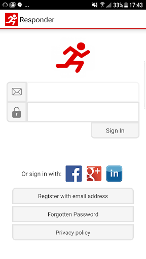
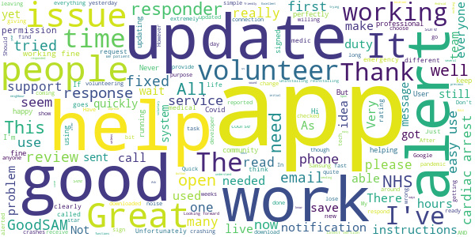

# GoodSAM Responder
App version ``13.3``

Analyzed with [covid-apps-observer](http://github.com/covid-apps-observer) project, version ``0.1``

## App overview
| | |
|-------------------------|-------------------------| 
| **Name**&nbsp;&nbsp;&nbsp;&nbsp;&nbsp;&nbsp;&nbsp;&nbsp;&nbsp;&nbsp;&nbsp;&nbsp;&nbsp;&nbsp;&nbsp;&nbsp;&nbsp;&nbsp;&nbsp;&nbsp;&nbsp;&nbsp;&nbsp;&nbsp;&nbsp;&nbsp;&nbsp;&nbsp;&nbsp;&nbsp;&nbsp;&nbsp;&nbsp;&nbsp;&nbsp;&nbsp;&nbsp;&nbsp;&nbsp;&nbsp;  | GoodSAM Responder |
| **Unique identifier** | com.goodsam.responder |
| **Link to Google Play** | [https://play.google.com/store/apps/details?id=com.goodsam.responder](https://play.google.com/store/apps/details?id=com.goodsam.responder) |
| **Summary**  | GoodSAM connects those with specific skill sets to those in need. |
| **Privacy policy** | [https://www.goodsamapp.org/dataprotectionhtml](https://www.goodsamapp.org/dataprotectionhtml) |
| **Latest version** | 13.3 |
| **Last update** | 2021-01-24 21:38:47 |
| **Recent changes** | Updating the app to pull the latest code of conduct from the server and make it specific to each organisation on the platform. |
| **Installs**  | 100,000+ |
| **Category** | Health & Fitness |
| **First release** | Apr 21, 2014 |
| **Size**  | 55M |
| **Supported Android version**  | 4.1 and up |

### Description
> The GoodSAM Responder App is a professional deployment system used by Emergency Services around the world.
 GoodSAM provides a range of solutions connecting those with specific skill sets to those in need, for example:
 -       GoodSAM Cardiac – This system is used by ambulance services to alert those trained in resuscitation (e.g. off duty paramedics, nurses, doctors, police and fire staff) to those nearby who are likely to be in cardiac arrest. This system has saved many lives around the world.
 -       GoodSAM Volunteer Response – GoodSAM is a platform used by organisations such as the Royal Voluntary Service and British Red Cross.
 -       GoodSAM Pro – This is a professional dispatch system for community first responders and the emergency services.
 The App utilises the latest in location technology and has many advanced features including a built in “radio” (Buzz) function so you can communicate with surrounding colleagues.
 The GoodSAM platform has saved hundreds of lives and helped many thousands of people around the world. If you can help your community, please download the App and register under your parent organisation (or get your parent organisation on board if they are not on!).
 Visit www.goodsamapp.org for more information
 Please download the App and join our global community.

### User interface
The developers of the app provide the following screenshots in the Google play store.
| | | |
|:-------------------------:|:-------------------------:|:-------------------------:|
 |   |   |   | 
 |   |   |   | 
 |   |  

## Development team
In the following we report the main information provided by the development team in the Google play store.

| | |
|-------------------------|-------------------------|
| **Developer**  | GoodSAM LTD |
| **Website**  | [http://www.goodsamapp.org/](http://www.goodsamapp.org/) |
| **Email** | info@goodsamapp.org |
| **Physical address**  | - |
| **Other developed apps**  | [https://play.google.com/store/apps/developer?id=GoodSAM+LTD](https://play.google.com/store/apps/developer?id=GoodSAM+LTD) |

## Android support

| | |
|-------------------------|-------------------------|
| **Declared target Android version**  | - |
| **Effective target Android version**  | - |
| **Minimum supported Android version**  | Jelly Bean, version 4.1.x (API level 16) |
| **Maximum target Android version**  | - |

The larger the difference between the minimum and maximum supported Android versions, the better. A larger difference means a wider audience. For example, old phones have a very low Android version, so a high minimum supported Android version means that the app cannot be used by users with old phones, thus leading to accessibility problems. 

## Requested permissions

In the following we report the complete list of the permissions requested by the app. 

| **Permission** | **Protection level** | **Description** | 
|-------------------------|-------------------------|-------------------------|
 **android.permission ACCESS_BACKGROUND_LOCATION** | :warning:**Dangerous** | Allows an app to access location in the background. 
 **android.permission ACCESS_COARSE_LOCATION** | :warning:**Dangerous** | Allows an app to access approximate location. 
 **android.permission ACCESS_FINE_LOCATION** | :warning:**Dangerous** | Allows an app to access precise location. 
 **android.permission ACCESS_NETWORK_STATE** | Normal | Allows applications to access information about networks. 
 **android.permission CALL_PHONE** | :warning:**Dangerous** | Allows an application to initiate a phone call without going through the Dialer user interface for the user to confirm the call. 
 **android.permission CAMERA** | :warning:**Dangerous** | Required to be able to access the camera device. 
 **android.permission FLASHLIGHT** | - | - 
 **android.permission GET_ACCOUNTS** | :warning:**Dangerous** | Allows access to the list of accounts in the Accounts Service. 
 **android.permission INTERNET** | Normal | Allows applications to open network sockets. 
 **android.permission MODIFY_AUDIO_SETTINGS** | Normal | Allows an application to modify global audio settings. 
 **android.permission READ_CONTACTS** | :warning:**Dangerous** | Allows an application to read the user's contacts data. 
 **android.permission READ_EXTERNAL_STORAGE** | :warning:**Dangerous** | Allows an application to read from external storage. 
 **android.permission READ_OWNER_DATA** | - | - 
 **android.permission RECEIVE_BOOT_COMPLETED** | Normal | Allows an application to receive the Intent.ACTION_BOOT_COMPLETED that is broadcast after the system finishes booting. 
 **android.permission RECORD_AUDIO** | :warning:**Dangerous** | Allows an application to record audio. 
 **android.permission REQUEST_IGNORE_BATTERY_OPTIMIZATIONS** | Normal | Permission an application must hold in order to use Settings.ACTION_REQUEST_IGNORE_BATTERY_OPTIMIZATIONS. 
 **android.permission USE_CREDENTIALS** | - | - 
 **android.permission VIBRATE** | Normal | Allows access to the vibrator. 
 **android.permission WAKE_LOCK** | Normal | Allows using PowerManager WakeLocks to keep processor from sleeping or screen from dimming. 
 **android.permission WRITE_EXTERNAL_STORAGE** | :warning:**Dangerous** | Allows an application to write to external storage. 
 **com.goodsam.responder.permission C2D_MESSAGE** | - | - 
 **com.goodsam.responder.permission MAPS_RECEIVE** | - | - 
 **com.google.android.c2dm.permission RECEIVE** | - | - 
 **com.google.android.finsky.permission BIND_GET_INSTALL_REFERRER_SERVICE** | - | - 
 **com.google.android.gms.permission ACTIVITY_RECOGNITION** | - | - 
 **com.google.android.providers.gsf.permission READ_GSERVICES** | - | - 

## Mentioned servers

| **Server** | **Registrant** | **Registrant country** | **Creation date** | 
|-------------------------|-------------------------|-------------------------|-------------------------|
 | adobe.com | Adobe Inc. | :us: US | 1986-11-17 05:00:00 |
 | facebook.com | Facebook, Inc. | :us: US | 1997-03-29 05:00:00 |
 | google.com | Google LLC | :us: US | 1997-09-15 04:00:00 |
 | goodsam.co.uk | - | - | 2013-07-27 00:00:00 |
 | goodsamapp.org | Registrant State/Province: | GB | 2014-03-17 22:10:28 |
 | linkedin.com | LinkedIn Corporation | :us: US | 2002-11-02 15:38:11 |
 | googlesyndication.com | Google LLC | :us: US | 2003-01-21 06:17:24 |
 | googleapis.com | Google LLC | :us: US | 2005-01-25 17:52:26 |
 | app-measurement.com | Google LLC | :us: US | 2015-06-19 20:13:31 |
 | googleadservices.com | Google LLC | :us: US | 2003-06-19 16:34:53 |

## Security analysis 

Below we report the main security warnings raised by our execution of the [Androwarn](https://github.com/maaaaz/androwarn) security analysis tool.

**Telephony identifiers leakage**
> - This application reads the numeric name (MCC+MNC) of current registered operator 
> - This application reads the operator name 

**Connection interfaces exfiltration**
> - This application reads details about the currently active data network 
> - This application tries to find out if the currently active data network is metered 

**Telephony services abuse**
> - This application makes phone calls 

**Audio video eavesdropping**
> - This application records audio from the 'MIC' source  

**Suspicious connection establishment**
> - This application opens a Socket and connects it to the remote address '' on the 'N/A' port  
> - This application opens a Socket and connects it to the remote address 'Ljava/lang/StringBuilder;->toString()Ljava/lang/String;' on the 'N/A' port  
> - This application opens a Socket and connects it to the remote address 'Ljava/net/Proxy;->type()Ljava/net/Proxy$Type;' on the 'N/A' port  
> - This application opens a Socket and connects it to the remote address 'Lorg/apache/http/HttpHost;->getPort()I' on the 'Lorg/apache/http/HttpHost;->getPort()I' port  
> - This application opens a Socket and connects it to the remote address 'timeout' on the 'N/A' port  

**Code execution**
> - This application loads a native library 
> - This application executes a UNIX command 

## User ratings and reviews

Below we provide information about how end users are reacting to the app in terms of ratings and reviews in the Google Play store.

### Ratings

The GoodSAM Responder app has been installed by more than **100000** times. At this time, **1290** rated the app and its average score is **2.4651163**. Below we show the distribution of the ratings across the usual star-based rating of Google Play

:star::star::star::star::star:: 190

:star::star::star::star:: 130

:star::star::star:: 230

:star::star:: 280

:star:: 460

### Reviews 

#### 5-star reviews

> Upon installation, I can't seem to get past the initial introduction pages. The button at the bottom which says "Ask for permissions" does nothing when tapped. I've checked the permissions that the app has been granted in the application manager, and it has everything it needs. Phone is a Samsung J3 running Android 5.1.1. Update: Thanks to the team for updating this so quickly. All working perfectly now!  :date: __2021-02-03 10:32:29__

> Never leaves me alone. Works really well. Dare not sign on unless I've got a good bit of time to offer because I can easily get the next call before I've got home from the previous.  :date: __2021-01-27 18:54:23__

> Hi my app isn't working, I'm not getting any sound when simulating an alert and only just realised. I could of missed so many calls because of this it's not fair  :date: __2021-01-16 03:04:47__

> Edit: Thank you for clarifying and the quick response, that is working now! The app is not sending me notifications, I have been sent tasks but are missing them (even though I have been using my phone at the time the message is sent) because the app isn't sending my phone notifications. I have tried uninstalling and reinstalling a few times now and have checked notification and location permissions are allowed...  :date: __2021-01-13 21:43:42__

> Excellent link to people who need support. Easy to manage App.  :date: __2021-01-13 17:15:05__

> Yay ! Now can change the alert sound, both I, my neighbour and my neighbour's dog are happy :-)  :date: __2020-12-21 15:15:22__

> Great App, functions well. Alot of people moaning about the noise but they need to understand it was originally set up to alert responders like myself to a cardiac arrest and that this happens infrequently and needs to be loud and out there to make sure it alerts us! I have responded using it and it was very good and I know of several responders that use it well.  :date: __2020-12-16 10:23:43__

> Helping in times like these is vital. User friendly precise and professional.  :date: __2020-09-20 17:43:57__

> Always freeze accept button when I am assigned for task...don't know what's happening...  :date: __2020-09-14 15:21:40__

> A service that provides help for people in need. Very professional and friendly service that's was needed during the Covid 19 pandemic but still provides essential services through out the year.  :date: __2020-09-04 21:29:15__

#### 4-star reviews

> I got my Hi Vis jackets but im still waiting for a shift as a Vaccine Steward through the app, im not sure if you need the Duty button on or off for it but im looking forward to it.  :date: __2021-02-12 16:45:42__

> Sometimes I wonder if anyone knows that I have logged on "duty" to the controllers. I have logged on for a mere 180 hours and in that time I have had just four "shouts" three of which didn't pick up and the fourth just needed a "chat. How do I know, that you know, that I am here ready to go? Many thanks Alan Hobbs  :date: __2021-02-11 20:30:35__

> The app works ok most of the time. One problem I get is the location side, I've had to reject quite a few alerts that have been 12 miles away even though my app is set at 5 miles.  :date: __2021-01-23 09:57:46__

> The App need an audible alert when scheduled tasks appear. I have missed opportunities to volunteer due to this. Steve. NHS/RVS Volunteer.  :date: __2021-01-20 16:16:50__

> The issue I had experienced has been resolved. Now, the app is up and running on my phone as it should. Thank you 👍  :date: __2021-01-15 16:06:29__

> I just updated as there should be a new task tab for vaccination steward volunteers. I see nothing different  :date: __2021-01-14 18:39:42__

> Version 12.8 on Android 10: looks like notifications may have been fixed, although now when I receive a task I get a "double ding" where my notification sound plays twice, almost over the top of itself. Still, this is better than silence. Some tasks still do not say what type of help is required until the "accept" button is clicked. UPDATE: forgot I had the "bypass silent" option on, was the only way I could receive alerts in prev. version. Yes, if off, I get one "ding" now as expected - thnx!  :date: __2021-01-13 12:48:32__

> Update: issue now fixed with a distance slider on the 'me' tab, the app now works fine. ----- I am being inundated with requests that are far outside of the area I can reasonably travel. In the last 10 minutes I have had 31 requests to help, but all 5km-10km away. I have double checked that the app knows my location via the emailed link. I can't spend all day rejecting 3 requests a minute until I find one that is in a reasonable cycle/foot radius of my location.  :date: __2021-01-11 18:50:43__

> Early experience so far is fine. Though when I select 'find a route' in simulation mode Uber opens rather than Google maps. Any ideas on how to correct this?  :date: __2021-01-06 19:02:09__

> Excellent and very easy to use. However there is more way to return to the information page after you have accepted the task.  :date: __2021-01-04 18:59:08__

#### 3-star reviews

> This app worked very well with my previous Android 10. Since upgrading my phone to a new Android 10, I stopped getting sound notifications. I followed your FAQs, allowed all permissions, but I still don't get them as sound alert. I used to have a sound notification for a simulated task, but I don't get it now. Can you help please as I may miss request if I don't look on the screen...  :date: __2021-02-11 11:50:54__

> Always crashes for no apparent reason. Had no alerts in thousands of hours. Crash report sent  :date: __2021-01-29 09:28:59__

> The app tells me my certificate/ID is out of date but when I log onto the website it states it's valid until next year. Please help!  :date: __2021-01-29 07:30:57__

> As a volunteer, can I request an option that allows volunteers to log in the app that someone isn't picking up their phone despite 3 attempts by 3 other responders? I can see i'm the 4th responder. It would be useful to have a 'tried to contact but no response' action without having to call the 0800 number each time.  :date: __2021-01-26 17:50:15__

> Can the app not give basic details on the alert as hard to know if can adequately deal with the situation? Also I assume the alert goes to everyone locally until someone responds...I hope so as I didn't get sound on notification so no idea what time it came through?  :date: __2021-01-23 14:50:50__

> This app work fine on my phone, but my husband cannot get it to work on his Galaxy Alpha. The screen displays 'please log in' but there is nowhere to do so, and you cannot exit from the app. He really wants to volunteer.  :date: __2021-01-21 11:00:36__

> I have just been cleared and invited to join. I have lost my password and unable to retrieve it. What should I do?  :date: __2021-01-17 12:09:30__

> NHS have advised that app has been modified to allow selection of the distance you are willing to accept a task but I cannot find this feature. Also I don't have a "tasks" tab, still showing the "comms" tab. Edward  :date: __2021-01-15 20:08:06__

> I don't know how to change my settings, as requested, and don't know how you would know my preferred distances (for being a steward at vaccination centres). Incidentally, I'd find it easier if messages referred to miles not kilometres, as that's what we use in this country!  :date: __2021-01-15 00:28:17__

> I'm registered on my laptop all ok but have downloaded the app on my mobile and it won't accept my same login/password!?  :date: __2021-01-14 13:00:31__

#### 2-star reviews

> Appears not to work properly not count the amount of time responder on duty and rearly get alerts. Not a good app development interaction.  :date: __2021-02-11 14:11:12__

> Keeps crashing.  :date: __2021-02-09 14:17:56__

> 1. I uninstalled the Goodsam app from my Android v10 tablet as the Task tab didn't show like on the smartphone. I was planning to reinstall to fix this bug. Now it says my tablet isn't compatible. WHY!!? It seems perverse to withdraw the tablet version. It was useful if my wife borrowed the phone. 2. I am signed up as a stewarding volunteer. It would help if you could add an alert when a task comes in. This could be the siren already in place. But as the "tasks" are less urgent an email would suffice.  :date: __2021-02-04 20:16:22__

> 02/02/21 STILL UNABLE to upload photos of new AEDs locations to the GoodSAM app this is after installing the latest version available. When trying to use a photo taken with a google pixel phone with all location accesses switch on, the GoodSAM app still says to use a picture with location services switched on. In the past, I've replied via email to yourselves about this issue, uploaded bug reports sent pictures and still awaiting your reply.  :date: __2021-02-03 15:04:48__

> Buggy, clunky UI. Clicking on 'Show details' of a booked task closes the app every time. The details can only be seen by restarting the app. No way to go back to the homepage without clicking back through every page of the 'tasks' section. Can't copy text, eg task addresses. User unfriendly.  :date: __2021-02-02 18:22:40__

> Difficult to use efficiently  :date: __2021-01-29 10:37:31__

> Check everything probably 5 times, location always on, notifications on, everything possible is on still not getting notifications. Any advice? Version Android 11  :date: __2021-01-22 18:14:11__

> Taking forever to register to the point I have given up  :date: __2021-01-21 17:21:42__

> Despite all my phone settings being correct I get no sound when simulating an alert and despite my location being on full it shows me in the Atlantic Ocean off the coast of Africa when I'm in the south of England  :date: __2021-01-19 17:51:38__

> Simple to download but when opened it always shows a world map and no means of logging in PB  :date: __2021-01-19 15:59:39__

#### 1-star reviews

> The installation is clunky. If there's anything going to stop somewhere using an app, that'll be it. (I test and write software as a profession.) It's hard to scroll the page without hitting a selector (such as the country). The image crop allows only a square and could not set to the width of my driver's license, so part of the license was cut off. After several attemps of that, I was forced to select Work ID instead of Drivers License. And please fully capitalise countries' names!  :date: __2021-02-13 00:16:26__

> It doesn't make sense how to volunteer as a steward this way.  :date: __2021-02-11 07:39:10__

> Jobs are too far away or clients do not need help  :date: __2021-02-01 19:58:44__

> I spent nearly an hour calling people before someone actually needed assistance. Not very good use of my time. After spending 5 hours on this app, I only physically helped 2 people. The database seem to have far too many people in it who doesn't need immediate assistance and tends to like pushing you more and more inwards towards the city centre rather than in just your local area. So far, quite disappointed in this app.  :date: __2021-01-30 16:40:56__

> Over 500 hours of volunteering, not been called on once. Reported the problem, told to uninstall and reinstall. Did that a few times, still not working. Reported the problem verbally on a couple of occasions as well as by email, to no avail. How much money and time have the NHS wasted on this app? Please tell me if this app is working.  :date: __2021-01-25 19:47:47__

> Trying to register but can't get past the initial set up page. I put that im goodsam and its asking for my credentials document. I put in any old thing and then got the wheel of doom. Ridiculous !  :date: __2021-01-22 23:48:14__

> trying to download app but keep getting error code 403 please help.  :date: __2021-01-22 19:28:19__

> I have tried to complete registration on this app 5 times but can't get pass occupation not sure what to do next will call team tomorrow  :date: __2021-01-21 20:21:27__

> I have a OnePlus 6t and Samsung Galaxy Tab 5Se, both running Android 10. The app isn't compatible with either of them. Both these devices are fairly popular. Can you please update the app and make it compatible, please?  :date: __2021-01-21 18:55:00__

> Unfortunately this app has not notified me of alerts for many months. No audio to alerts. I have reinstalled the app, kept it updated but nothing has fixed the fault and I see many others reporting the exact same fault for many months also. I have emailed the developers repeatedly but never had a reply?  :date: __2021-01-20 12:22:34__

