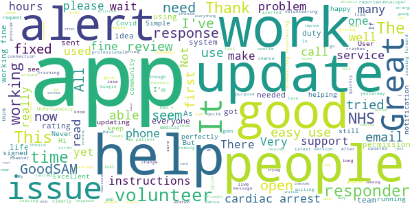
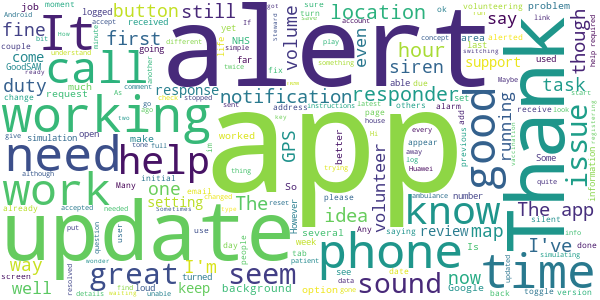
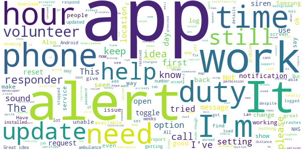
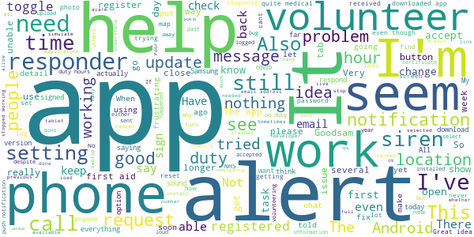
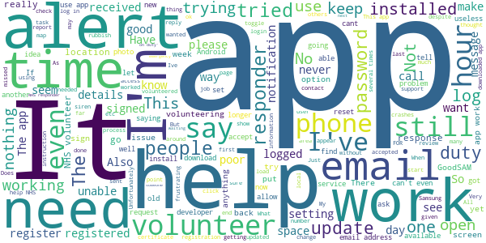

# GoodSAM Responder
App version ``13.9``

Analyzed with [covid-apps-observer](http://github.com/covid-apps-observer) project, version ``0.1``

## App overview
| | |
|-------------------------|-------------------------| 
| **Name**&nbsp;&nbsp;&nbsp;&nbsp;&nbsp;&nbsp;&nbsp;&nbsp;&nbsp;&nbsp;&nbsp;&nbsp;&nbsp;&nbsp;&nbsp;&nbsp;&nbsp;&nbsp;&nbsp;&nbsp;&nbsp;&nbsp;&nbsp;&nbsp;&nbsp;&nbsp;&nbsp;&nbsp;&nbsp;&nbsp;&nbsp;&nbsp;&nbsp;&nbsp;&nbsp;&nbsp;&nbsp;&nbsp;&nbsp;&nbsp;  | GoodSAM Responder |
| **Unique identifier** | com.goodsam.responder |
| **Link to Google Play** | [https://play.google.com/store/apps/details?id=com.goodsam.responder](https://play.google.com/store/apps/details?id=com.goodsam.responder) |
| **Summary**  | GoodSAM connects those with specific skill sets to those in need. |
| **Privacy policy** | [https://www.goodsamapp.org/dataprotectionhtml](https://www.goodsamapp.org/dataprotectionhtml) |
| **Latest version** | 13.9 |
| **Last update** | 2021-03-13 23:46:58 |
| **Recent changes** | - Internal improvements to streaming features for organisations utilising the video streaming capabilities. |
| **Installs**  | 100,000+ |
| **Category** | Health & Fitness |
| **First release** | Apr 21, 2014 |
| **Size**  | 57M |
| **Supported Android version**  | 4.1 and up |

### Description
> The GoodSAM Responder App is a professional deployment system used by Emergency Services around the world.
 GoodSAM provides a range of solutions connecting those with specific skill sets to those in need, for example:
 -       GoodSAM Cardiac – This system is used by ambulance services to alert those trained in resuscitation (e.g. off duty paramedics, nurses, doctors, police and fire staff) to those nearby who are likely to be in cardiac arrest. This system has saved many lives around the world.
 -       GoodSAM Volunteer Response – GoodSAM is a platform used by organisations such as the Royal Voluntary Service and British Red Cross.
 -       GoodSAM Pro – This is a professional dispatch system for community first responders and the emergency services.
 The App utilises the latest in location technology and has many advanced features including a built in “radio” (Buzz) function so you can communicate with surrounding colleagues.
 The GoodSAM platform has saved hundreds of lives and helped many thousands of people around the world. If you can help your community, please download the App and register under your parent organisation (or get your parent organisation on board if they are not on!).
 Visit www.goodsamapp.org for more information
 Please download the App and join our global community.

### User interface
The developers of the app provide the following screenshots in the Google play store.
| | | |
|:-------------------------:|:-------------------------:|:-------------------------:|
 |   |   |   | 
 |   |   |   | 
 |   |  

## Development team
In the following we report the main information provided by the development team in the Google play store.

| | |
|-------------------------|-------------------------|
| **Developer**  | GoodSAM LTD |
| **Website**  | [http://www.goodsamapp.org/](http://www.goodsamapp.org/) |
| **Email** | info@goodsamapp.org |
| **Physical address**  | - |
| **Other developed apps**  | [https://play.google.com/store/apps/developer?id=GoodSAM+LTD](https://play.google.com/store/apps/developer?id=GoodSAM+LTD) |

## Android support

| | |
|-------------------------|-------------------------|
| **Declared target Android version**  | - |
| **Effective target Android version**  | - |
| **Minimum supported Android version**  | Jelly Bean, version 4.1.x (API level 16) |
| **Maximum target Android version**  | - |

The larger the difference between the minimum and maximum supported Android versions, the better. A larger difference means a wider audience. For example, old phones have a very low Android version, so a high minimum supported Android version means that the app cannot be used by users with old phones, thus leading to accessibility problems. 

## Requested permissions

In the following we report the complete list of the permissions requested by the app. 

| **Permission** | **Protection level** | **Description** | 
|-------------------------|-------------------------|-------------------------|
 **android.permission ACCESS_BACKGROUND_LOCATION** | :warning:**Dangerous** | Allows an app to access location in the background. 
 **android.permission ACCESS_COARSE_LOCATION** | :warning:**Dangerous** | Allows an app to access approximate location. 
 **android.permission ACCESS_FINE_LOCATION** | :warning:**Dangerous** | Allows an app to access precise location. 
 **android.permission ACCESS_NETWORK_STATE** | Normal | Allows applications to access information about networks. 
 **android.permission CALL_PHONE** | :warning:**Dangerous** | Allows an application to initiate a phone call without going through the Dialer user interface for the user to confirm the call. 
 **android.permission CAMERA** | :warning:**Dangerous** | Required to be able to access the camera device. 
 **android.permission FLASHLIGHT** | - | - 
 **android.permission GET_ACCOUNTS** | :warning:**Dangerous** | Allows access to the list of accounts in the Accounts Service. 
 **android.permission INTERNET** | Normal | Allows applications to open network sockets. 
 **android.permission MODIFY_AUDIO_SETTINGS** | Normal | Allows an application to modify global audio settings. 
 **android.permission READ_CONTACTS** | :warning:**Dangerous** | Allows an application to read the user's contacts data. 
 **android.permission READ_EXTERNAL_STORAGE** | :warning:**Dangerous** | Allows an application to read from external storage. 
 **android.permission READ_OWNER_DATA** | - | - 
 **android.permission RECEIVE_BOOT_COMPLETED** | Normal | Allows an application to receive the Intent.ACTION_BOOT_COMPLETED that is broadcast after the system finishes booting. 
 **android.permission RECORD_AUDIO** | :warning:**Dangerous** | Allows an application to record audio. 
 **android.permission REQUEST_IGNORE_BATTERY_OPTIMIZATIONS** | Normal | Permission an application must hold in order to use Settings.ACTION_REQUEST_IGNORE_BATTERY_OPTIMIZATIONS. 
 **android.permission USE_CREDENTIALS** | - | - 
 **android.permission VIBRATE** | Normal | Allows access to the vibrator. 
 **android.permission WAKE_LOCK** | Normal | Allows using PowerManager WakeLocks to keep processor from sleeping or screen from dimming. 
 **android.permission WRITE_EXTERNAL_STORAGE** | :warning:**Dangerous** | Allows an application to write to external storage. 
 **com.goodsam.responder.permission C2D_MESSAGE** | - | - 
 **com.goodsam.responder.permission MAPS_RECEIVE** | - | - 
 **com.google.android.c2dm.permission RECEIVE** | - | - 
 **com.google.android.finsky.permission BIND_GET_INSTALL_REFERRER_SERVICE** | - | - 
 **com.google.android.gms.permission ACTIVITY_RECOGNITION** | - | - 
 **com.google.android.providers.gsf.permission READ_GSERVICES** | - | - 

## Mentioned servers

| **Server** | **Registrant** | **Registrant country** | **Creation date** | 
|-------------------------|-------------------------|-------------------------|-------------------------|
 | adobe.com | Adobe Inc. | :us: US | 1986-11-17 05:00:00 |
 | facebook.com | Facebook, Inc. | :us: US | 1997-03-29 05:00:00 |
 | google.com | Google LLC | :us: US | 1997-09-15 04:00:00 |
 | goodsam.co.uk | - | - | 2013-07-27 00:00:00 |
 | goodsamapp.org | Registrant State/Province: | GB | 2014-03-17 22:10:28 |
 | linkedin.com | LinkedIn Corporation | :us: US | 2002-11-02 15:38:11 |
 | googlesyndication.com | Google LLC | :us: US | 2003-01-21 06:17:24 |
 | googleapis.com | Google LLC | :us: US | 2005-01-25 17:52:26 |
 | app-measurement.com | Google LLC | :us: US | 2015-06-19 20:13:31 |
 | googleadservices.com | Google LLC | :us: US | 2003-06-19 16:34:53 |

## Security analysis 

Below we report the main security warnings raised by our execution of the [Androwarn](https://github.com/maaaaz/androwarn) security analysis tool.

**Telephony identifiers leakage**
> - This application reads the numeric name (MCC+MNC) of current registered operator 
> - This application reads the operator name 

**Connection interfaces exfiltration**
> - This application reads details about the currently active data network 
> - This application tries to find out if the currently active data network is metered 

**Telephony services abuse**
> - This application makes phone calls 

**Audio video eavesdropping**
> - This application records audio from the 'MIC' source  

**Suspicious connection establishment**
> - This application opens a Socket and connects it to the remote address '' on the 'N/A' port  
> - This application opens a Socket and connects it to the remote address 'Ljava/lang/StringBuilder;->toString()Ljava/lang/String;' on the 'N/A' port  
> - This application opens a Socket and connects it to the remote address 'Ljava/net/Proxy;->type()Ljava/net/Proxy$Type;' on the 'N/A' port  
> - This application opens a Socket and connects it to the remote address 'Lorg/apache/http/HttpHost;->getPort()I' on the 'Lorg/apache/http/HttpHost;->getPort()I' port  
> - This application opens a Socket and connects it to the remote address 'timeout' on the 'N/A' port  

**Code execution**
> - This application loads a native library 
> - This application executes a UNIX command 

## User ratings and reviews

Below we provide information about how end users are reacting to the app in terms of ratings and reviews in the Google Play store.

### Ratings

The GoodSAM Responder app has been installed by more than **100000** times. At this time, **1345** rated the app and its average score is **2.6888888**. Below we show the distribution of the ratings across the usual star-based rating of Google Play

:star::star::star::star::star:: 279

:star::star::star::star:: 179

:star::star::star:: 199

:star::star:: 219

:star:: 469

### Reviews 

#### 5-star reviews

> Not going to leave a rating yet, I want to wait and see if my issue gets resolved and that this actually works first. Issue: No Email received!! Now that everything is sorted, the app works fine for me.  :date: __2021-03-24 05:33:31__

> Excellent & is developed continuously.  :date: __2021-03-08 15:15:54__

> Seems to work fine no issues  :date: __2021-02-26 21:44:53__

> Simple and easy to use  :date: __2021-02-26 19:23:53__

> Excellent  :date: __2021-02-26 17:11:58__

> Great app  :date: __2021-02-15 18:48:28__

> Upon installation, I can't seem to get past the initial introduction pages. The button at the bottom which says "Ask for permissions" does nothing when tapped. I've checked the permissions that the app has been granted in the application manager, and it has everything it needs. Phone is a Samsung J3 running Android 5.1.1. Update: Thanks to the team for updating this so quickly. All working perfectly now!  :date: __2021-02-03 10:32:29__

> Never leaves me alone. Works really well. Dare not sign on unless I've got a good bit of time to offer because I can easily get the next call before I've got home from the previous.  :date: __2021-01-27 18:54:23__

> Hi my app isn't working, I'm not getting any sound when simulating an alert and only just realised. I could of missed so many calls because of this it's not fair  :date: __2021-01-16 03:04:47__

> Edit: Thank you for clarifying and the quick response, that is working now! The app is not sending me notifications, I have been sent tasks but are missing them (even though I have been using my phone at the time the message is sent) because the app isn't sending my phone notifications. I have tried uninstalling and reinstalling a few times now and have checked notification and location permissions are allowed...  :date: __2021-01-13 21:43:42__

#### 4-star reviews

> Fundamentally sound but as a NHS volunteer responder there are two key niggles which could be addressed to make life much easier: 1. Unable to copy phone numbers from alerts to paste into the phone app, which means switching back and forth to type it manually. Can you make the number a link to dial directly or at least let it be copied to the clipboard? 2. Can't accept more than one task at a time so it's not possible to do them in one trip or make another call when the first isn't answered.  :date: __2021-03-24 06:05:24__

> Since the update, this is a good app. I still haven't had a volunteering alert for the vaccination centres yet, here's hoping!  :date: __2021-02-27 17:01:46__

> Seems to run well. Had no alerts yet since registering  :date: __2021-02-26 05:17:37__

> I got my Hi Vis jackets but im still waiting for a shift as a Vaccine Steward through the app, im not sure if you need the Duty button on or off for it but im looking forward to it.  :date: __2021-02-12 16:45:42__

> Sometimes I wonder if anyone knows that I have logged on "duty" to the controllers. I have logged on for a mere 180 hours and in that time I have had just four "shouts" three of which didn't pick up and the fourth just needed a "chat. How do I know, that you know, that I am here ready to go? Many thanks Alan Hobbs  :date: __2021-02-11 20:30:35__

> The app works ok most of the time. One problem I get is the location side, I've had to reject quite a few alerts that have been 12 miles away even though my app is set at 5 miles.  :date: __2021-01-23 09:57:46__

> The App need an audible alert when scheduled tasks appear. I have missed opportunities to volunteer due to this. Steve. NHS/RVS Volunteer.  :date: __2021-01-20 16:16:50__

> The issue I had experienced has been resolved. Now, the app is up and running on my phone as it should. Thank you 👍  :date: __2021-01-15 16:06:29__

> I just updated as there should be a new task tab for vaccination steward volunteers. I see nothing different  :date: __2021-01-14 18:39:42__

> Version 12.8 on Android 10: looks like notifications may have been fixed, although now when I receive a task I get a "double ding" where my notification sound plays twice, almost over the top of itself. Still, this is better than silence. Some tasks still do not say what type of help is required until the "accept" button is clicked. UPDATE: forgot I had the "bypass silent" option on, was the only way I could receive alerts in prev. version. Yes, if off, I get one "ding" now as expected - thnx!  :date: __2021-01-13 12:48:32__

#### 3-star reviews

> Good Idea. But after 814 hours on duty there is no task.  :date: __2021-03-19 19:01:12__

> Cant find a decent burger .... ppppfffffff  :date: __2021-03-12 14:29:29__

> Have not received actual work in months. Lots of alerts about people safeguarding but when called no action required. Also I'm supposed to be a driver but haven't seen a driver call since I initially registered.  :date: __2021-02-26 18:26:17__

> This app worked very well with my previous Android 10. Since upgrading my phone to a new Android 10, I stopped getting sound notifications. I followed your FAQs, allowed all permissions, but I still don't get them as sound alert. I used to have a sound notification for a simulated task, but I don't get it now. Can you help please as I may miss request if I don't look on the screen...  :date: __2021-02-11 11:50:54__

> Always crashes for no apparent reason. Had no alerts in thousands of hours. Crash report sent  :date: __2021-01-29 09:28:59__

> The app tells me my certificate/ID is out of date but when I log onto the website it states it's valid until next year. Please help!  :date: __2021-01-29 07:30:57__

> As a volunteer, can I request an option that allows volunteers to log in the app that someone isn't picking up their phone despite 3 attempts by 3 other responders? I can see i'm the 4th responder. It would be useful to have a 'tried to contact but no response' action without having to call the 0800 number each time.  :date: __2021-01-26 17:50:15__

> Can the app not give basic details on the alert as hard to know if can adequately deal with the situation? Also I assume the alert goes to everyone locally until someone responds...I hope so as I didn't get sound on notification so no idea what time it came through?  :date: __2021-01-23 14:50:50__

> This app work fine on my phone, but my husband cannot get it to work on his Galaxy Alpha. The screen displays 'please log in' but there is nowhere to do so, and you cannot exit from the app. He really wants to volunteer.  :date: __2021-01-21 11:00:36__

> I have just been cleared and invited to join. I have lost my password and unable to retrieve it. What should I do?  :date: __2021-01-17 12:09:30__

#### 2-star reviews

> 28/02/21 V 13.7 Now able to upload photo of new AED locations, it's only taken a year.  :date: __2021-02-28 15:41:31__

> Rubbish - waiting 5 weeks now no shifts nothing??? Frustrating 😞  :date: __2021-02-26 18:12:54__

> Patchy  :date: __2021-02-26 16:59:05__

> Mine looks nothing like the simulation pictures, nothing ever in my tasks  :date: __2021-02-23 09:28:11__

> Poor  :date: __2021-02-19 18:51:16__

> Appears not to work properly not count the amount of time responder on duty and rearly get alerts. Not a good app development interaction.  :date: __2021-02-11 14:11:12__

> Keeps crashing.  :date: __2021-02-09 14:17:56__

> 1. I uninstalled the Goodsam app from my Android v10 tablet as the Task tab didn't show like on the smartphone. I was planning to reinstall to fix this bug. Now it says my tablet isn't compatible. WHY!!? It seems perverse to withdraw the tablet version. It was useful if my wife borrowed the phone. 2. I am signed up as a stewarding volunteer. It would help if you could add an alert when a task comes in. This could be the siren already in place. But as the "tasks" are less urgent an email would suffice.  :date: __2021-02-04 20:16:22__

> Buggy, clunky UI. Clicking on 'Show details' of a booked task closes the app every time. The details can only be seen by restarting the app. No way to go back to the homepage without clicking back through every page of the 'tasks' section. Can't copy text, eg task addresses. User unfriendly.  :date: __2021-02-02 18:22:40__

> Difficult to use efficiently  :date: __2021-01-29 10:37:31__

#### 1-star reviews

> I've been logged in for over 1000 hours and never had a notification, even though I have all notification settings turned on. I've just gone into messages to find loads saying I've not responded to a request. How can I respond if the app isn't notifying me?  :date: __2021-03-28 09:16:49__

> Load of rubbish. Was told by emergency Doctor from other side of my Borough to sign up to get a volunteer to collect my prescription. App wouldn't even let me state I was in the UK when registering. Tried several times. Give up. Response to developers: I was told to register by a gp to find a volunteer to collect a prescription/medication last night The App would not let me put the UK as my country! I am already registered with NHS First Responders. I get a call every couple of weeks.  :date: __2021-03-26 11:43:35__

> After update app no longer opens. Re installed works once and then does not open again. Now unable to access to log on  :date: __2021-03-24 12:12:46__

> Even though I have turned on notifications and location but the crash when ever I click on tasks.  :date: __2021-03-20 10:06:46__

> When ever I click on future tasks it turns off so I am unable to check or book any task  :date: __2021-03-19 23:36:28__

> I sign on and then think it'll send notification but it hasn't been so someone sends a request I haven't received it so goes to the next responder I'll make sure I have it loaded more often now  :date: __2021-03-12 19:36:31__

> I still haven't had a Volunteering alert for the Vaccination Centre in my area where I live, patiently waiting!  :date: __2021-03-02 15:26:33__

> Never had any notification since April 2020 to end Feb 2021. Hours clock up but not heard anything. Don't think it works.  :date: __2021-02-26 17:48:54__

> This app won't let me download at all I have a Samsung A20E.  :date: __2021-02-24 13:22:40__

> Wow, OK, so the developer response to reviews that calls out a forced square crop on the licence says "take a photo of your licence and the table it is sitting on, so you can crop a combination of the license and the background it to a square". See Richard M's review below as an example. Yet the photo of the AED allows for any size and shape crop. So the developers have figured out how to allow an any size crop for selecting one photo, but don't want to apply that to another? I'm betting that the reason I can't save my AED location is because the app doesn't just select a photo, it selects and forces a crop, and in cropping it, it probably loses the location data that is in the Exif information that I have confirmed is embedded in the original photo.  :date: __2021-02-18 07:00:49__

