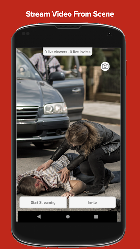
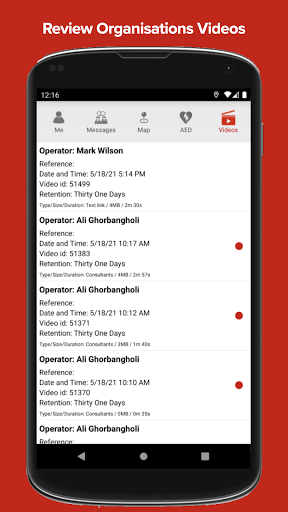
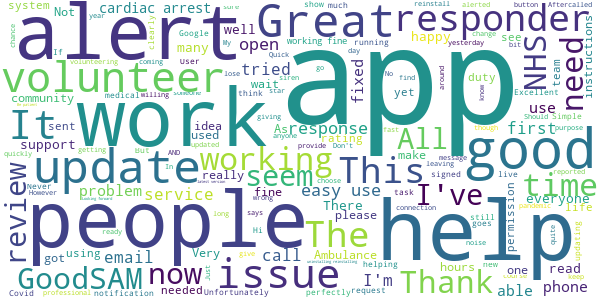
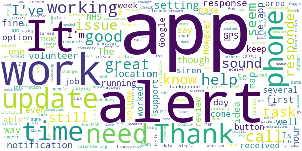
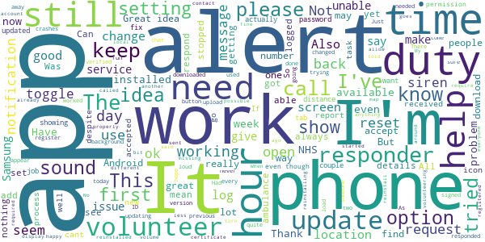
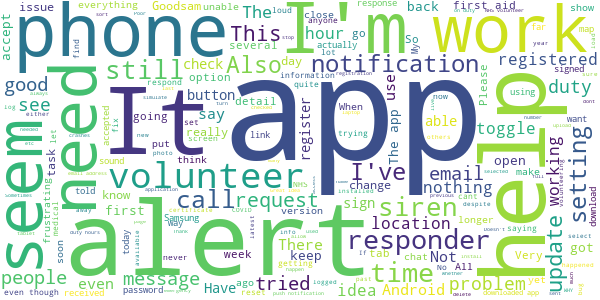
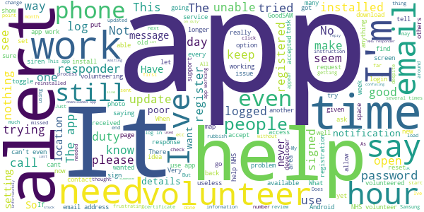

# GoodSAM Responder
App version ``15.0``

Analyzed with [covid-apps-observer](http://github.com/covid-apps-observer) project, version ``0.1``

## App overview
| | |
|-------------------------|-------------------------| 
| **Name**&nbsp;&nbsp;&nbsp;&nbsp;&nbsp;&nbsp;&nbsp;&nbsp;&nbsp;&nbsp;&nbsp;&nbsp;&nbsp;&nbsp;&nbsp;&nbsp;&nbsp;&nbsp;&nbsp;&nbsp;&nbsp;&nbsp;&nbsp;&nbsp;&nbsp;&nbsp;&nbsp;&nbsp;&nbsp;&nbsp;&nbsp;&nbsp;&nbsp;&nbsp;&nbsp;&nbsp;&nbsp;&nbsp;&nbsp;&nbsp;  | GoodSAM Responder |
| **Unique identifier** | com.goodsam.responder |
| **Link to Google Play** | [https://play.google.com/store/apps/details?id=com.goodsam.responder](https://play.google.com/store/apps/details?id=com.goodsam.responder) |
| **Summary**  | GoodSAM connects those with specific skill sets to those in need. |
| **Privacy policy** | [https://www.goodsamapp.org/dataprotectionhtml](https://www.goodsamapp.org/dataprotectionhtml) |
| **Latest version** | 15.0 |
| **Last update** | 2021-07-01 23:18:03 |
| **Recent changes** | - Fixing the &quot;multiple file upload&quot; for organisations using the GoodSAMs direct upload feature. |
| **Installs**  | 100,000+ |
| **Category** | Health & Fitness |
| **First release** | Apr 21, 2014 |
| **Size**  | 58M |
| **Supported Android version**  | 4.1 and up |

### Description
> The GoodSAM Responder App is a professional deployment system used by Emergency Services around the world.
 GoodSAM provides a range of solutions connecting those with specific skill sets to those in need, for example:
 -       GoodSAM Cardiac – This system is used by ambulance services to alert those trained in resuscitation (e.g. off duty paramedics, nurses, doctors, police and fire staff) to those nearby who are likely to be in cardiac arrest. This system has saved many lives around the world.
 -       GoodSAM Volunteer Response – GoodSAM is a platform used by organisations such as the Royal Voluntary Service and British Red Cross.
 -       GoodSAM Pro – This is a professional dispatch system for community first responders and the emergency services.
 The App utilises the latest in location technology and has many advanced features including a built in “radio” (Buzz) function so you can communicate with surrounding colleagues.
 The GoodSAM platform has saved hundreds of lives and helped many thousands of people around the world. If you can help your community, please download the App and register under your parent organisation (or get your parent organisation on board if they are not on!).
 Visit www.goodsamapp.org for more information
 Please download the App and join our global community.

### User interface
The developers of the app provide the following screenshots in the Google play store.
| | | |
|:-------------------------:|:-------------------------:|:-------------------------:|
 |   |   |   | 
 |   |   |   | 
 |  

## Development team
In the following we report the main information provided by the development team in the Google play store.

| | |
|-------------------------|-------------------------|
| **Developer**  | GoodSAM LTD |
| **Website**  | [http://www.goodsamapp.org/](http://www.goodsamapp.org/) |
| **Email** | info@goodsamapp.org |
| **Physical address**  | - |
| **Other developed apps**  | [https://play.google.com/store/apps/developer?id=GoodSAM+LTD](https://play.google.com/store/apps/developer?id=GoodSAM+LTD) |

## Android support

| | |
|-------------------------|-------------------------|
| **Declared target Android version**  | - |
| **Effective target Android version**  | - |
| **Minimum supported Android version**  | Jelly Bean, version 4.1.x (API level 16) |
| **Maximum target Android version**  | - |

The larger the difference between the minimum and maximum supported Android versions, the better. A larger difference means a wider audience. For example, old phones have a very low Android version, so a high minimum supported Android version means that the app cannot be used by users with old phones, thus leading to accessibility problems. 

## Requested permissions

In the following we report the complete list of the permissions requested by the app. 

| **Permission** | **Protection level** | **Description** | 
|-------------------------|-------------------------|-------------------------|
 **android.permission ACCESS_BACKGROUND_LOCATION** | :warning:**Dangerous** | Allows an app to access location in the background. 
 **android.permission ACCESS_COARSE_LOCATION** | :warning:**Dangerous** | Allows an app to access approximate location. 
 **android.permission ACCESS_FINE_LOCATION** | :warning:**Dangerous** | Allows an app to access precise location. 
 **android.permission ACCESS_NETWORK_STATE** | Normal | Allows applications to access information about networks. 
 **android.permission CALL_PHONE** | :warning:**Dangerous** | Allows an application to initiate a phone call without going through the Dialer user interface for the user to confirm the call. 
 **android.permission CAMERA** | :warning:**Dangerous** | Required to be able to access the camera device. 
 **android.permission FLASHLIGHT** | - | - 
 **android.permission FOREGROUND_SERVICE** | Normal | Allows a regular application to use Service.startForeground. 
 **android.permission GET_ACCOUNTS** | :warning:**Dangerous** | Allows access to the list of accounts in the Accounts Service. 
 **android.permission INTERNET** | Normal | Allows applications to open network sockets. 
 **android.permission MODIFY_AUDIO_SETTINGS** | Normal | Allows an application to modify global audio settings. 
 **android.permission READ_CONTACTS** | :warning:**Dangerous** | Allows an application to read the user's contacts data. 
 **android.permission READ_EXTERNAL_STORAGE** | :warning:**Dangerous** | Allows an application to read from external storage. 
 **android.permission READ_OWNER_DATA** | - | - 
 **android.permission RECEIVE_BOOT_COMPLETED** | Normal | Allows an application to receive the Intent.ACTION_BOOT_COMPLETED that is broadcast after the system finishes booting. 
 **android.permission RECORD_AUDIO** | :warning:**Dangerous** | Allows an application to record audio. 
 **android.permission REQUEST_IGNORE_BATTERY_OPTIMIZATIONS** | Normal | Permission an application must hold in order to use Settings.ACTION_REQUEST_IGNORE_BATTERY_OPTIMIZATIONS. 
 **android.permission USE_CREDENTIALS** | - | - 
 **android.permission VIBRATE** | Normal | Allows access to the vibrator. 
 **android.permission WAKE_LOCK** | Normal | Allows using PowerManager WakeLocks to keep processor from sleeping or screen from dimming. 
 **android.permission WRITE_EXTERNAL_STORAGE** | :warning:**Dangerous** | Allows an application to write to external storage. 
 **com.goodsam.responder.permission C2D_MESSAGE** | - | - 
 **com.goodsam.responder.permission MAPS_RECEIVE** | - | - 
 **com.google.android.c2dm.permission RECEIVE** | - | - 
 **com.google.android.finsky.permission BIND_GET_INSTALL_REFERRER_SERVICE** | - | - 
 **com.google.android.gms.permission ACTIVITY_RECOGNITION** | - | - 
 **com.google.android.providers.gsf.permission READ_GSERVICES** | - | - 

## Mentioned servers

| **Server** | **Registrant** | **Registrant country** | **Creation date** | 
|-------------------------|-------------------------|-------------------------|-------------------------|
 | adobe.com | Adobe Inc. | :us: US | 1986-11-17 05:00:00 |
 | facebook.com | Facebook, Inc. | :us: US | 1997-03-29 05:00:00 |
 | google.com | Google LLC | :us: US | 1997-09-15 04:00:00 |
 | goodsam.co.uk | - | - | 2013-07-27 00:00:00 |
 | goodsamapp.org | Registrant State/Province: | GB | 2014-03-17 22:10:28 |
 | linkedin.com | LinkedIn Corporation | :us: US | 2002-11-02 15:38:11 |
 | googlesyndication.com | Google LLC | :us: US | 2003-01-21 06:17:24 |
 | googleapis.com | Google LLC | :us: US | 2005-01-25 17:52:26 |
 | googleadservices.com | Google LLC | :us: US | 2003-06-19 16:34:53 |
 | app-measurement.com | Google LLC | :us: US | 2015-06-19 20:13:31 |

## Security analysis 

Below we report the main security warnings raised by our execution of the [Androwarn](https://github.com/maaaaz/androwarn) security analysis tool.

**Telephony identifiers leakage**
> - This application reads the MCC+MNC of the provider of the SIM 
> - This application reads the numeric name (MCC+MNC) of current registered operator 
> - This application reads the operator name 

**Connection interfaces exfiltration**
> - This application reads details about the currently active data network 
> - This application tries to find out if the currently active data network is metered 

**Telephony services abuse**
> - This application makes phone calls 

**Audio video eavesdropping**
> - This application records audio from the 'MIC' source  

**Suspicious connection establishment**
> - This application opens a Socket and connects it to the remote address '' on the 'N/A' port  
> - This application opens a Socket and connects it to the remote address 'Ljava/lang/StringBuilder;->toString()Ljava/lang/String;' on the 'N/A' port  
> - This application opens a Socket and connects it to the remote address 'Ljava/net/Proxy;->type()Ljava/net/Proxy$Type;' on the 'N/A' port  
> - This application opens a Socket and connects it to the remote address 'Lorg/apache/http/HttpHost;->getPort()I' on the 'Lorg/apache/http/HttpHost;->getPort()I' port  
> - This application opens a Socket and connects it to the remote address 'timeout' on the 'N/A' port  

**Code execution**
> - This application loads a native library 
> - This application executes a UNIX command 

## User ratings and reviews

Below we provide information about how end users are reacting to the app in terms of ratings and reviews in the Google Play store.

### Ratings

The GoodSAM Responder app has been installed by more than **100000** times. At this time, **1390** rated the app and its average score is **3.1510792**. Below we show the distribution of the ratings across the usual star-based rating of Google Play

:star::star::star::star::star:: 430

:star::star::star::star:: 240

:star::star::star:: 180

:star::star:: 190

:star:: 350

### Reviews 

#### 5-star reviews

> Great app! Got a couple alerts recently and the ambulance service is always happy to see help!  :date: __2021-06-26 18:22:22__

> I'm updating my review as all seems to have settled down now, although it took a while. I'm getting more and more tasks now, so it shows how much people need the support. I'm more than happy to be a volunteer, and I get as much out of it as the people I'm ringing and checking up on!  :date: __2021-06-18 21:15:25__

> As a GoodSAM 'verified responder' (St John Ambulance), the Responder app has been an amazing community tool for assisting East Midlands Ambulance Service with cardiac arrests and other similar incidents. Ambulance crews have all been happy for assistance during these calls. - Working together, this is a lifesaving app. I did notice that prior to being a verified responder for St John that if you just have a first aid certificate, it's very unlikely that you'll get a call out, but this is down to the policy of your local ambulance provider and not the app.  :date: __2021-06-05 12:26:07__

> Great app everyone should be on it  :date: __2021-06-04 12:00:12__

> Great idea the only problem k have at the moment is there's no buttons when I'm running a simulation  :date: __2021-05-20 20:18:20__

> Easy to use  :date: __2021-05-11 09:28:33__

> I recieved a alert and was 1st on the scene to help out someone in the community. Everybody needs this app.  :date: __2021-05-07 15:02:12__

> Good  :date: __2021-05-03 08:23:04__

> How do I reinstall this app on my new phone? I The app on Google play just says installed. frustrated.  :date: __2021-04-23 20:54:42__

> Goodsam app  :date: __2021-04-07 21:41:29__

#### 4-star reviews

> Not sure who can help me but I am getting alarms about community task but there is some issue with app. It is just showing running logo but so not let me accept or reject task.  :date: __2021-06-17 13:36:49__

> Finally getting tasks. Whatever you did to fix the problem, thanks.  :date: __2021-06-13 12:11:47__

> Well designed and simple. Great work. For future tasks I would love to save a filter on date, or day of week. I would be more likely to find a steward shift I can attend.  :date: __2021-06-02 15:01:30__

> Can we have a filter option by day of the week or time under future tasks, please? Sometimes with more than several hundreds on that list it is very difficult to find the relevant ones for VSS roles. Many thanks.  :date: __2021-05-21 10:00:55__

> Works for me. However, it would be nice to be able to list future tasks differently or offer sort by options.  :date: __2021-05-14 17:42:33__

> I've registered to volunteer at vaccination sites, received an email saying that they have noticed I hadn't taken up any opportunity, well that's because I haven't received any! Still receiving check in and chat and community response but nothing else.  :date: __2021-05-07 19:54:30__

> Please allow filtering of future tasks by day  :date: __2021-05-04 11:55:54__

> Fundamentally sound but as a NHS volunteer responder there are two key niggles which could be addressed to make life much easier: 1. Unable to copy phone numbers from alerts to paste into the phone app, which means switching back and forth to type it manually. Can you make the number a link to dial directly or at least let it be copied to the clipboard? 2. Can't accept more than one task at a time so it's not possible to do them in one trip or make another call when the first isn't answered.  :date: __2021-03-24 06:05:24__

> Since the update, this is a good app. I still haven't had a volunteering alert for the vaccination centres yet, here's hoping!  :date: __2021-02-27 17:01:46__

> Seems to run well. Had no alerts yet since registering  :date: __2021-02-26 05:17:37__

#### 3-star reviews

> App was working really well for me until about a week ago. Suddenly started eating data and won't display the part of my profile that allows me to go on and off duty. I have tried updating and reinstalling but still isn't working properly.  :date: __2021-06-05 23:34:06__

> It's hanging. Neither accept nor reject is possible. Update. I installed on a different phone and exactly the same problem exists on that. Therefore it's my account that is locked, not the app. How can I get my account working again? Uninstalled and restarted but the uninstall process is incomplete as when I reinstall and open it goes immediately to the same hanging task screen. I've Uninstalled it as its unuseable for me now.  :date: __2021-05-26 14:07:57__

> Don't like the icon always on display when on duty. It just adds unnecessary clutter to phone screen and more importantly means I'm less likely to spot an alert which is what the icon always meant. Please change this back or at least give users the option to switch off.  :date: __2021-05-26 10:28:34__

> Since updating the app today to show on duty icon is on not been able to accept calls / help even though being alerted  :date: __2021-05-24 15:48:36__

> Good Idea. But after 814 hours on duty there is no task.  :date: __2021-03-19 19:01:12__

> Cant find a decent burger .... ppppfffffff  :date: __2021-03-12 14:29:29__

> Have not received actual work in months. Lots of alerts about people safeguarding but when called no action required. Also I'm supposed to be a driver but haven't seen a driver call since I initially registered.  :date: __2021-02-26 18:26:17__

> This app worked very well with my previous Android 10. Since upgrading my phone to a new Android 10, I stopped getting sound notifications. I followed your FAQs, allowed all permissions, but I still don't get them as sound alert. I used to have a sound notification for a simulated task, but I don't get it now. Can you help please as I may miss request if I don't look on the screen...  :date: __2021-02-11 11:50:54__

> Always crashes for no apparent reason. Had no alerts in thousands of hours. Crash report sent  :date: __2021-01-29 09:28:59__

> The app tells me my certificate/ID is out of date but when I log onto the website it states it's valid until next year. Please help!  :date: __2021-01-29 07:30:57__

#### 2-star reviews

> Latest version deletes tasks I've accepted from 'future tasks' so map and contact information aren't available. D'Oh! UPDATE- thanks for your response, but no- I received a chat notification under Messages *confirming* that I’d accepted the shift.  :date: __2021-07-03 21:45:00__

> Uses phenomenal amount of battery power...and not insignificant in it's data use.  :date: __2021-06-20 02:28:29__

> The app is not loading the page my details is fully. Only showing my name, verifying organisation and expiry date. I cannot get the rest the page to load. I need access to this to be able adjust the notification alter by turning off the siren when I am going into a meeting at work. Please help..  :date: __2021-05-17 12:22:14__

> Tried to register right now. Filled in my details and upon pressing the register button got the notification: "Couldn't send the registration link to the email provided. Is the email correct?" Yes, it is correct, because I used the "Passwort forgotten" button that send me a resetting link to the same email. Now I can't go through registration, since the registration link never reached my inbox but apparently the email did, because "this email is in use". 🙄 Will give more stars later.  :date: __2021-05-12 07:04:09__

> Registered to be a responder last year, still awaiting acceptance  :date: __2021-05-06 18:02:57__

> The notification alerts are limited to: 1.embarrasingly loud & protracted. 2. irritating as hell 3. difficult to hear The app itself works reasonably well but, having tried everything I can think of, I simply can't get it to remember my password I.e. no apparent option including via phone settings. All other apps give option to retain on installation. Tiresome logging in, therefore, which at times can be for remorseless alerts for assistance throughout the day. So, very poorly designed.  :date: __2021-05-03 09:01:42__

> Unable to use the app and therefore unable to continue currently as a volunteer.. The app fails when I click the "future tasks" tab. All other tabs work. The app worked on my previous Motorola G6, but does not work on my existing Motorola G6. Have been installing and uninstalling the app for the past 3 days, since I started using my new phone. Help, please. Thanks!  :date: __2021-04-13 12:42:01__

> Rubbish - waiting 5 weeks now no shifts nothing??? Frustrating 😞  :date: __2021-02-26 18:12:54__

> Patchy  :date: __2021-02-26 16:59:05__

> Mine looks nothing like the simulation pictures, nothing ever in my tasks  :date: __2021-02-23 09:28:11__

#### 1-star reviews

> Don't get me wrong here, I use this app to volunteer to assist in vaccination shifts. However lately, you have vaccination centres and pharmacists located in the same area when your volunteering to do these shifts. Wouldn't it have been a better idea to have one area for centres and a separate one for pharmacists. Having all of them in the same area, not only makes this app confusing. It also makes it hard to find out the venues where you volunteer at.  :date: __2021-07-01 15:01:05__

> Very buggy with locations and 2nd alerts for the same event.  :date: __2021-07-01 07:50:17__

> Not happy. This month the app used nearly all my data so had to remove it from my phone. Have just reinstalled it for next month.  :date: __2021-06-26 00:07:07__

> App not working properly for me any more. Says the GoodSAM Responder is running. I'm unable to accept any tasks. Another message: We are trying to obtain your location. Please make sure your location services are enabled and our App has access to them. I have uninstalled and reinstalled the App, but made no difference.  :date: __2021-06-22 12:18:04__

> Uses mobile data like it's going out of fashion. 2 6 hour shift's and I have used 80 percent of my monthly allocation. Update - thanks for the feedback. It used 460mb in 2 weeks and I was off wi-fi for 15 hours in that time. I've had to turn mobile data off until my next month starts as I've used up my allocation, so will let you know if it's improved in July.  :date: __2021-06-14 20:43:06__

> I don't receive any volunteer marshall opportunities which is frustrating to do Your response would make sense if I wasn't in the same household who has their phone pinging with opportunities all day ..  :date: __2021-06-05 20:45:54__

> Been stuck on the loading screen for 4 days now...  :date: __2021-05-27 18:40:24__

> Doesn't pick up shifts within 25. Only when I'm in a big city and not from home base! Even though I live closer to the shifts being offered! Live in Skelton (North East Yorkshire). Don't get anything at all even for shifts at Redcar - though can see shifs at Redcar when I'm in Middlesbrough!  :date: __2021-05-19 17:05:11__

> Attempted to register as a registered responder and 4 weeks later still waiting for it to be reviewed/approved. Nil other way to contact them.  :date: __2021-04-28 02:32:18__

> I've been logged in for over 1000 hours and never had a notification, even though I have all notification settings turned on. I've just gone into messages to find loads saying I've not responded to a request. How can I respond if the app isn't notifying me?  :date: __2021-03-28 09:16:49__

