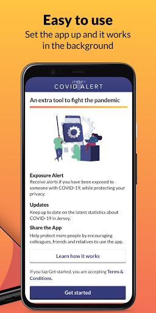
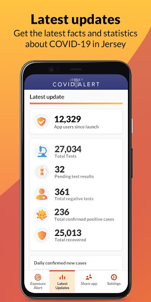
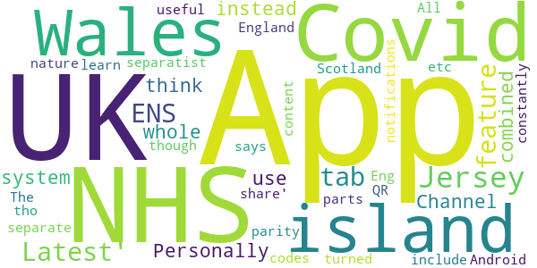
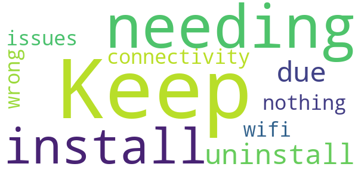
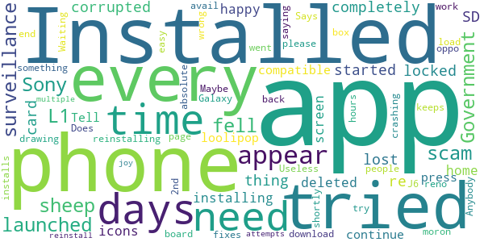

# Jersey COVID Alert
App version ``1.0.3``

Analyzed with [covid-apps-observer](http://github.com/covid-apps-observer) project, version ``0.1``

## App overview
| | |
|-------------------------|-------------------------| 
| **Name**&nbsp;&nbsp;&nbsp;&nbsp;&nbsp;&nbsp;&nbsp;&nbsp;&nbsp;&nbsp;&nbsp;&nbsp;&nbsp;&nbsp;&nbsp;&nbsp;&nbsp;&nbsp;&nbsp;&nbsp;&nbsp;&nbsp;&nbsp;&nbsp;&nbsp;&nbsp;&nbsp;&nbsp;&nbsp;&nbsp;&nbsp;&nbsp;&nbsp;&nbsp;&nbsp;&nbsp;&nbsp;&nbsp;&nbsp;&nbsp;  | Jersey COVID Alert |
| **Unique identifier** | com.governmentofjersey.jerseycovidalert |
| **Link to Google Play** | [https://play.google.com/store/apps/details?id=com.governmentofjersey.jerseycovidalert](https://play.google.com/store/apps/details?id=com.governmentofjersey.jerseycovidalert) |
| **Summary**  | Jersey&#39;s COVID-19 contact tracing app |
| **Privacy policy** | [https://covidalert.gov.je/pages/privacy-notice.aspx](https://covidalert.gov.je/pages/privacy-notice.aspx) |
| **Latest version** | 1.0.3 |
| **Last update** | 2020-11-16 18:29:22 |
| **Recent changes** | Updated statistics, miscellaneous bug fixes and tweaks. |
| **Installs**  | 10,000+ |
| **Category** | Medical |
| **First release** | Oct 8, 2020 |
| **Size**  | 108M |
| **Supported Android version**  | 6.0 and up |

### Description
> This is the official digital contact tracing and exposure notification application provided by Public Health, Government of Jersey for visitors and citizens on the island of Jersey.
 By using the app you can help prevent and contain outbreaks of COVID-19. 
 The app will warn you with an Exposure Alert if you have been near someone who has recently been diagnosed with COVID-19.  If you choose, you can ask the Contact Tracing Team to call you for specific advice and support if you get an Exposure Alert.  
 If you are diagnosed with COVID-19, the app lets you anonymously warn people you were near to before you became aware that you were infectious. Only people with a confirmed case of COVID-19 can do this with the support of the Contact Tracing Team.
 Your privacy is protected:
 •        No personal information needed to sign up
 •        The app does not record your location and does not use GPS. 
 •        The app is built with strong privacy protection. 
 •        Use of the app is always voluntary. 
 •        The app will ask your permission to share any data. 
 •        The app can be uninstalled at any time. 
 •        It is extremely unlikely that you could be identified by other users while using the app. 
 Developed on behalf of Public Health (JHA) by Digital Health (HCS) and Digital Jersey.

### User interface
The developers of the app provide the following screenshots in the Google play store.
| | | |
|:-------------------------:|:-------------------------:|:-------------------------:|
 |   |   |   | 
 |   |  

## Development team
In the following we report the main information provided by the development team in the Google play store.

| | |
|-------------------------|-------------------------|
| **Developer**  | Government of Jersey |
| **Website**  | [http://covidalert.gov.je](http://covidalert.gov.je) |
| **Email** | covidalert@gov.je |
| **Physical address**  | [Digital Health, 4 Edward Place, The Parade, St. Helier, Jersey JE2 3QP](https://www.google.com/maps/search/Digital%20Health,%204%20Edward%20Place,%20The%20Parade,%20St.%20Helier,%20Jersey%20JE2%203QP) (Google Maps) |
| **Other developed apps**  | [https://play.google.com/store/apps/developer?id=5014249503765258721](https://play.google.com/store/apps/developer?id=5014249503765258721) |

## Android support

| | |
|-------------------------|-------------------------|
| **Declared target Android version**  | Android10, version 10 (API level 29) |
| **Effective target Android version**  | Android10, version 10 (API level 29) |
| **Minimum supported Android version**  | Marshmallow, version 6.0 (API level 23) |
| **Maximum target Android version**  | - |

The larger the difference between the minimum and maximum supported Android versions, the better. A larger difference means a wider audience. For example, old phones have a very low Android version, so a high minimum supported Android version means that the app cannot be used by users with old phones, thus leading to accessibility problems. 

## Requested permissions

In the following we report the complete list of the permissions requested by the app. 

| **Permission** | **Protection level** | **Description** | 
|-------------------------|-------------------------|-------------------------|
 **android.permission ACCESS_NETWORK_STATE** | Normal | Allows applications to access information about networks. 
 **android.permission ACCESS_WIFI_STATE** | Normal | Allows applications to access information about Wi-Fi networks. 
 **android.permission BLUETOOTH** | Normal | Allows applications to connect to paired bluetooth devices. 
 **android.permission FOREGROUND_SERVICE** | Normal | Allows a regular application to use Service.startForeground. 
 **android.permission INTERNET** | Normal | Allows applications to open network sockets. 
 **android.permission RECEIVE_BOOT_COMPLETED** | Normal | Allows an application to receive the Intent.ACTION_BOOT_COMPLETED that is broadcast after the system finishes booting. 
 **android.permission VIBRATE** | Normal | Allows access to the vibrator. 

## Mentioned servers

| **Server** | **Registrant** | **Registrant country** | **Creation date** | 
|-------------------------|-------------------------|-------------------------|-------------------------|
 | android.com | Google LLC | :us: US | 1997-06-23 04:00:00 |
 | google.com | Google LLC | :us: US | 1997-09-15 04:00:00 |
 | expo.io | See PrivacyGuardian.org | :us: US | 2011-05-01 21:26:50 |

## Security analysis 

Below we report the main security warnings raised by our execution of the [Androwarn](https://github.com/maaaaz/androwarn) security analysis tool.

**Telephony identifiers leakage**
> - This application reads the numeric name (MCC+MNC) of current registered operator 
> - This application reads the operator name 

**Connection interfaces exfiltration**
> - This application reads details about the currently active data network 
> - This application tries to find out if the currently active data network is metered 

**Suspicious connection establishment**
> - This application opens a Socket and connects it to the remote address '' on the 'N/A' port  
> - This application opens a Socket and connects it to the remote address 'Ljava/lang/StringBuilder;->toString()Ljava/lang/String;' on the ': connect, resolve' port  
> - This application opens a Socket and connects it to the remote address 'Ljava/lang/StringBuilder;->toString()Ljava/lang/String;' on the 'N/A' port  
> - This application opens a Socket and connects it to the remote address 'Ljava/net/Proxy;->type()Ljava/net/Proxy$Type;' on the 'N/A' port  
> - This application opens a Socket and connects it to the remote address 'timeout' on the 'N/A' port  

**Pim data leakage**
> - This application accesses data stored in the clipboard 

**Code execution**
> - This application loads a native library 
> - This application executes a UNIX command 

## User ratings and reviews

Below we provide information about how end users are reacting to the app in terms of ratings and reviews in the Google Play store.

### Ratings

The Jersey COVID Alert app has been installed by more than **10000** times. At this time, **31** rated the app and its average score is **2.967742**. Below we show the distribution of the ratings across the usual star-based rating of Google Play

:star::star::star::star::star:: 12

:star::star::star::star:: 2

:star::star::star:: 3

:star::star:: 1

:star:: 13

### Reviews 

#### 5-star reviews

> The layout is simplistic and it is working fine for me 🙂  :date: __2020-10-19 16:19:39__

> Good information  :date: __2020-10-17 22:05:35__

#### 4-star reviews

> Constantly getting "cannot contact server" error message. Edit The fixed version does now work. Easy to use. Now a 4 star app (can't give 5 stars until I've met someone with covid!,)  :date: __2020-10-15 18:20:59__

> Says no Internet connection the whole time. Update has fixed issues  :date: __2020-10-14 21:31:16__

#### 3-star reviews

> Personally I think the Channel Islands as a whole should use a combined system instead of separatist nature. I also don't get why NHS Scotland app separate from the NHS Covid-19 England & Wales App though both parts of the UK and same island. The Jersey App 'Latest' & 'share' tabs content is useful and all the UK Covid ENS apps should include the feature. All UK ENS Apps should feature parity on NHS Eng&Wales App - QR codes etc tho Jersey 'Latest' tab all the UK Covid apps could learn from!  :date: __2020-11-14 21:29:22__

> App constantly says the notifications are turned off but they are on Android  :date: __2020-11-04 16:25:20__

#### 2-star reviews

> Keep needing to install/uninstall due to connectivity issues but nothing wrong with my wifi.  :date: __2020-11-18 08:43:30__

#### 1-star reviews

> Government surveillance scam, sheep fell for it!  :date: __2020-11-21 05:22:03__

> Installed the app on my Sony L1, launched the app and it completely locked the phone up, I re started the phone and it had corrupted my SD card so every thing on there is lost and needs re-installing, It deleted icons from my home screen so I am not happy with it  :date: __2020-11-05 11:42:01__

> not compatible with loolipop 5.1  :date: __2020-10-18 19:55:41__

> Tell you to press continue and just times out, tried reinstalling and all other easy fixes to no avail  :date: __2020-10-16 13:18:41__

> I have tried to load this app for 2 days now and every time a box appears saying "something went wrong our end, please try again" . Maybe the IT people need to back to the drawing board!!  :date: __2020-10-16 12:54:52__

> Does now work with oppo reno 2. App keeps crashing after 2nd page.  :date: __2020-10-16 12:32:23__

> Waiting for the app to download. 4 Days!!!!!!. Useless!!.  :date: __2020-10-16 12:29:24__

> Anybody who installs this is an absolute moron!  :date: __2020-10-16 12:22:08__

> Says installed on my Galaxy J6 and app will appear shortly but after 24 hours and multiple attempts to reinstall no joy  :date: __2020-10-16 12:12:52__

