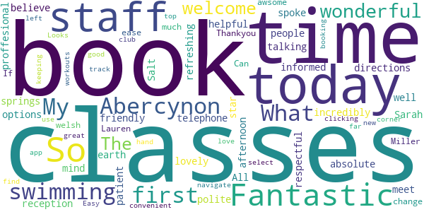
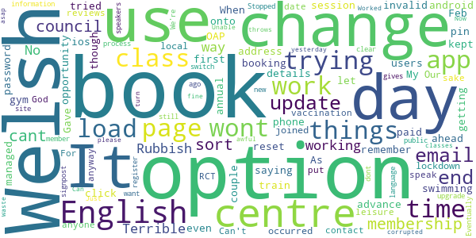

# Leisure for Life
App version ``4.74``

Analyzed with [covid-apps-observer](http://github.com/covid-apps-observer) project, version ``0.1``

## App overview
| | |
|-------------------------|-------------------------| 
| **Name**&nbsp;&nbsp;&nbsp;&nbsp;&nbsp;&nbsp;&nbsp;&nbsp;&nbsp;&nbsp;&nbsp;&nbsp;&nbsp;&nbsp;&nbsp;&nbsp;&nbsp;&nbsp;&nbsp;&nbsp;&nbsp;&nbsp;&nbsp;&nbsp;&nbsp;&nbsp;&nbsp;&nbsp;&nbsp;&nbsp;&nbsp;&nbsp;&nbsp;&nbsp;&nbsp;&nbsp;&nbsp;&nbsp;&nbsp;&nbsp;  | Leisure for Life |
| **Unique identifier** | com.innovatise.rctcbc |
| **Link to Google Play** | [https://play.google.com/store/apps/details?id=com.innovatise.rctcbc](https://play.google.com/store/apps/details?id=com.innovatise.rctcbc) |
| **Summary**  | Access all Rhondda Cynon Taf Leisure Centres from just one App |
| **Privacy policy** | [http://www.rctcbc.gov.uk/leisure](http://www.rctcbc.gov.uk/leisure) |
| **Latest version** | 4.74 |
| **Last update** | 2021-03-01 04:20:41 |
| **Recent changes** | Thanks for using our app! To make our app better for you, we bring updates to the App Store regularly. Updates will include new features, fixes and performance improvements. |
| **Installs**  | 5,000+ |
| **Category** | Health & Fitness |
| **First release** | Dec 1, 2017 |
| **Size**  | 37M |
| **Supported Android version**  | 5.1 and up |

### Description
> With the Rhondda Cynon Taf Council Leisure for Life  app you always have your facility in your pocket with quick and easy access to book your favourite fitness classes and activities. Get up-to-date information, news, fitness class timetables, public swim timetables, offers, events and receive push notifications for important news.
 FITNESS CLASS TIMETABLES
 Get real-time access to your centre’s timetable for classes, including times, fitness instructors and class description.
 FITNESS CLASS BOOKINGS
 Check availability, make a booking, amend a booking and cancel a booking – all on the move!
 PUBLIC SWIM TIMETABLES
 Get real-time access to your centre’s timetable for public swim sessions.
 CENTRE INFORMATION
 Find out about our opening times and facilities.
 NEWS AND PUSH NOTIFICATIONS
 Instantly get notified of centre news and events direct to your phone. With our app, you’ll immediately know when there are new events or classes, ensuring that you’ll never miss a thing.
 OFFERS
 Get push notifications for new offers so you always know about special promotions.
 MEMBERSHIPS AND ONLINE JOINING
 View our different types of membership to find the one which best suits you and join online.
 CONTACT US
 Easily contact us with leisure centre telephone numbers and email addresses or view directions and maps.
 SHARE THROUGH FACEBOOK, TWITTER AND EMAIL
 Share fitness classes, news, centre information and offers with your friends and family at the touch of a button.
 CENTRES INCLUDED
 Rhondda Leisure Centre, Tonyrefail Leisure centre, Llantrisant Leisure Centre, Hawthorn Leisure Centre, Abercynon Leisure Centre, Sobells Leisure centre, Rhondda Fach Leisure Centre, Bronwydd Pool
 ................................
 CYMRAEG
 Drwy lawrlwytho ap Hamdden am Oes Cyngor Rhondda Cynon Taf, bydd modd cadw'r cyfleuster yn eich poced a chadw lle mewn dosbarth ffitrwydd neu ar gyfer gweithgareddau'n gyflym ac yn hawdd. Byddwch chi'n derbyn y wybodaeth a'r newyddion diweddaraf, amserlenni dosbarthiadau ffitrwydd, amserlenni nofio cyhoeddus, cynigion, achlysuron. Bydd modd i chi hefyd dewis derbyn hysbysiadau ynglŷn â newyddion pwysig.
 AMSERLEN Y DOSBARTHIADAU CADW'N HEINI
 Bydd gyda chi fynediad at amserlenni dosbarthiadau'r ganolfan, gan gynnwys amseroedd, hyfforddwyr y dosbarth a disgrifiad o'r dosbarth.
 CADW LLE MEWN DOSBARTH FFITRWYDD
 Bydd modd i chi wirio argaeledd, trefnu gweithgaredd, newid gweithgaredd neu ganslo gweithgaredd - ar eich ffôn!
 AMSERLEN NOFIO CYHOEDDUS
 Bydd gyda chi mynediad at amserlenni sesiynau nofio cyhoeddus eich canolfan.
 GWYBODAETH AM Y GANOLFAN
 Dysgwch ragor am oriau agor a chyfleusterau'r ganolfan.
 NEWYDDION A HYSBYSIADAU
 Cewch chi hysbysebion ynglŷn â newyddion ac achlysuron y ganolfan ar eich ffôn Bydd yr ap yn sicrhau eich bod chi'n cael gwybod pa achlysuron a dosbarthiadau newydd sydd ar gael ar unwaith. Fyddwch chi ddim yn colli allan! 
 CYNIGION
 Byddwch chi'n derbyn hysbysiadau ynglŷn â chynigion newydd fel eich bod chi'n ymwybodol o hyrwyddiadau arbennig.
 AELODAETH AC YMUNO AR-LEIN
 Cymerwch gipolwg ar y mathau gwahanol o aelodaeth sydd ar gael, a dewiswch yr un sydd orau gennych chi. Ymunwch ar-lein!
 MANYLION CYSWLLT  
 Mae'n hawdd cysylltu â ni drwy'r ap. Mae rhifau ffôn a chyfeiriadau e-bost wedi'u nodi, neu mae modd cael cyfeiriadau drwy ddefnyddio'r map.
 RHANNWCH WYBODAETH AR FACEBOOK, TWITTER AC E-BOST
 Rhannwch wybodaeth am ddosbarth ffitrwydd, newyddion, gwybodaeth am y ganolfan a chynigion gyda'ch teulu a'ch ffrindiau wrth bwyso botwm.

### User interface
The developers of the app provide the following screenshots in the Google play store.
| | | |
|:-------------------------:|:-------------------------:|:-------------------------:|
 |   |   |   | 
 |   |  

## Development team
In the following we report the main information provided by the development team in the Google play store.

| | |
|-------------------------|-------------------------|
| **Developer**  | Innovatise GmbH |
| **Website**  | [http://www.rctcbc.gov.uk/leisure](http://www.rctcbc.gov.uk/leisure) |
| **Email** | leisuremembership@rctcbc.gov.uk |
| **Physical address**  | - |
| **Other developed apps**  | [https://play.google.com/store/apps/developer?id=Innovatise+GmbH](https://play.google.com/store/apps/developer?id=Innovatise+GmbH) |

## Android support

| | |
|-------------------------|-------------------------|
| **Declared target Android version**  | Pie, version 9 (API level 28) |
| **Effective target Android version**  | Pie, version 9 (API level 28) |
| **Minimum supported Android version**  | Lollipop, version 5.0 (API level 21) |
| **Maximum target Android version**  | - |

The larger the difference between the minimum and maximum supported Android versions, the better. A larger difference means a wider audience. For example, old phones have a very low Android version, so a high minimum supported Android version means that the app cannot be used by users with old phones, thus leading to accessibility problems. 

## Requested permissions

In the following we report the complete list of the permissions requested by the app. 

| **Permission** | **Protection level** | **Description** | 
|-------------------------|-------------------------|-------------------------|
 **android.permission ACCESS_COARSE_LOCATION** | :warning:**Dangerous** | Allows an app to access approximate location. 
 **android.permission ACCESS_FINE_LOCATION** | :warning:**Dangerous** | Allows an app to access precise location. 
 **android.permission ACCESS_NETWORK_STATE** | Normal | Allows applications to access information about networks. 
 **android.permission ACCESS_WIFI_STATE** | Normal | Allows applications to access information about Wi-Fi networks. 
 **android.permission AUTHENTICATE_ACCOUNTS** | - | - 
 **android.permission BLUETOOTH** | Normal | Allows applications to connect to paired bluetooth devices. 
 **android.permission BLUETOOTH_ADMIN** | Normal | Allows applications to discover and pair bluetooth devices. 
 **android.permission CAMERA** | :warning:**Dangerous** | Required to be able to access the camera device. 
 **android.permission GET_ACCOUNTS** | :warning:**Dangerous** | Allows access to the list of accounts in the Accounts Service. 
 **android.permission INTERNET** | Normal | Allows applications to open network sockets. 
 **android.permission MANAGE_ACCOUNTS** | - | - 
 **android.permission READ_PHONE_STATE** | :warning:**Dangerous** | Allows read only access to phone state, including the phone number of the device, current cellular network information, the status of any ongoing calls, and a list of any PhoneAccounts registered on the device. 
 **android.permission RECEIVE_BOOT_COMPLETED** | Normal | Allows an application to receive the Intent.ACTION_BOOT_COMPLETED that is broadcast after the system finishes booting. 
 **android.permission VIBRATE** | Normal | Allows access to the vibrator. 
 **android.permission WAKE_LOCK** | Normal | Allows using PowerManager WakeLocks to keep processor from sleeping or screen from dimming. 
 **android.permission WRITE_EXTERNAL_STORAGE** | :warning:**Dangerous** | Allows an application to write to external storage. 
 **com.google.android.c2dm.permission RECEIVE** | - | - 
 **com.google.android.finsky.permission BIND_GET_INSTALL_REFERRER_SERVICE** | - | - 
 **com.google.android.providers.gsf.permission READ_GSERVICES** | - | - 

## Mentioned servers

| **Server** | **Registrant** | **Registrant country** | **Creation date** | 
|-------------------------|-------------------------|-------------------------|-------------------------|
 | google.com | Google LLC | :us: US | 1997-09-15 04:00:00 |
 | myfitapp.de | - | - | - |
 | microsoft.com | Microsoft Corporation | :us: US | 1991-05-02 04:00:00 |
 | googlesyndication.com | Google LLC | :us: US | 2003-01-21 06:17:24 |
 | googleapis.com | Google LLC | :us: US | 2005-01-25 17:52:26 |
 | app-measurement.com | Google LLC | :us: US | 2015-06-19 20:13:31 |

## Security analysis 

Below we report the main security warnings raised by our execution of the [Androwarn](https://github.com/maaaaz/androwarn) security analysis tool.

**Telephony identifiers leakage**
> - This application reads the ISO country code equivalent for the SIM provider's country code 
> - This application reads the ISO country code equivalent of the current registered operator's MCC (Mobile Country Code) 
> - This application reads the MCC+MNC of the provider of the SIM 
> - This application reads the Service Provider Name (SPN) 
> - This application reads the constant indicating the state of the device SIM card 
> - This application reads the device phone type value 
> - This application reads the numeric name (MCC+MNC) of current registered operator 
> - This application reads the operator name 
> - This application reads the radio technology (network type) currently in use on the device for data transmission 
> - This application reads the unique device ID, i.e the IMEI for GSM and the MEID or ESN for CDMA phones 

**Connection interfaces exfiltration**
> - This application reads details about the currently active data network 
> - This application tries to find out if the currently active data network is metered 

**Telephony services abuse**
> - This application makes phone calls 

**Suspicious connection establishment**
> - This application opens a Socket and connects it to the remote address '' on the 'N/A' port  
> - This application opens a Socket and connects it to the remote address 'Ljava/lang/StringBuilder;->toString()Ljava/lang/String;' on the 'N/A' port  
> - This application opens a Socket and connects it to the remote address 'Ljava/net/Proxy;->type()Ljava/net/Proxy$Type;' on the 'N/A' port  
> - This application opens a Socket and connects it to the remote address 'timeout' on the 'N/A' port  

**Code execution**
> - This application loads a native library 
> - This application loads a native library: 'jniPdfium' 
> - This application loads a native library: 'modft2' 
> - This application loads a native library: 'modpdfium' 
> - This application loads a native library: 'modpng' 

## User ratings and reviews

Below we provide information about how end users are reacting to the app in terms of ratings and reviews in the Google Play store.

### Ratings

The Leisure for Life app has been installed by more than **5000** times. At this time, **34** rated the app and its average score is **3.0294118**. Below we show the distribution of the ratings across the usual star-based rating of Google Play

:star::star::star::star::star:: 14

:star::star::star::star:: 1

:star::star::star:: 4

:star::star:: 2

:star:: 13

### Reviews 

#### 5-star reviews

> Fantastic  :date: __2020-12-20 19:56:08__

> awsome  :date: __2019-05-07 17:19:15__

> Can book all my classes with ease now . If in welsh change by clicking top 
left hand corner and select new club with. +  :date: __2018-08-01 10:43:48__

> I use it to book classes and find out times  :date: __2018-04-27 19:56:40__

> So far, so good! Looks great. Easy to navigate and book with!  :date: __2017-12-11 22:50:58__

> Fantastic app so convenient for booking classes and keeping track of my workouts love it 👍  :date: __2017-12-07 14:30:54__

#### 4-star reviews

> Teething problems. As it was in welsh but how to sort below If you go to the APP and in the left hand corner there is a menu tab 'three lines'.   Then click the 'my clubs' tab. Then click + in the right hand corner. Then you should be able to see all pages or club names in both English and in Welsh. Select one in your language prefrence  :date: __2020-10-08 15:34:33__

#### 3-star reviews

> When it works it's really good...it's really hit and miss though! It either sits on a loading page for ages or tells you there's a jellybean error 🤔 fix these annoying glitches and it would be brilliant.  :date: __2020-09-15 20:05:15__

> It's basically like a mobile version of the website. No support for NFC  :date: __2017-12-13 08:35:18__

#### 2-star reviews

> Having to keep uninstalling and reinstalling in the hopes that it may work. Sometimes I can book gym sessions, often I cant. Such a shame as the app seems to have a lot of potential.  :date: __2020-08-18 18:07:59__

> Was OK until updated. Now cannot book a class within half an hour of it starting. Various classes don't show up, just received an update that boot camp classes are available to book and upon checking they do not show. Should be able to swipe in with phone but no availability to do this so it means queueing at the entrance before you can go to the class.  :date: __2019-05-25 16:05:53__

#### 1-star reviews

> Stopped working for upgrade days ago and still not working!  :date: __2020-10-17 16:51:28__

> No option to book as just public I dont want a membership  :date: __2020-10-17 05:45:37__

> No option for this is English?! We're not all Welsh speakers!  :date: __2020-09-28 11:03:54__

> Terrible just terrible only gives Welsh language with no option to switch no clear signpost to register as a new member. Eventually get to the end of the process and it's corrupted and throws you all the way out Rubbish. Waste of time  :date: __2020-09-24 18:33:43__

> Just awful  :date: __2020-09-02 09:42:44__

> Worked fine until yesterday's update. Now I cant book classes. Can you sort it asap  :date: __2020-08-17 20:51:35__

> Unable to book a class....rubbish  :date: __2020-08-11 00:04:20__

> It's all in Welsh is there an option to change it to english  :date: __2018-07-25 13:25:31__

> it's all in welsh ....how do you turn on English?  :date: __2018-07-10 11:39:19__

> It's all in Welsh is there a way to change this please?  :date: __2018-06-21 01:01:46__

