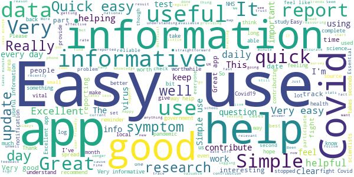
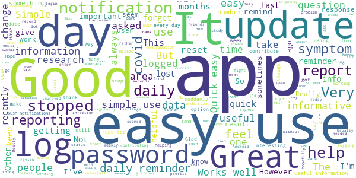
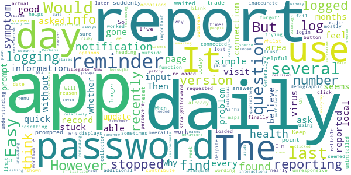
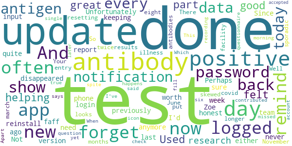
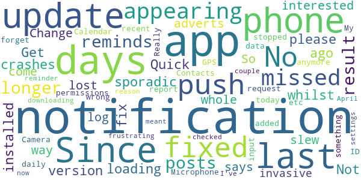

# COVID Symptom Study
App version ``2.0.1``

Analyzed with [covid-apps-observer](http://github.com/covid-apps-observer) project, version ``0.1``

## App overview
| | |
|-------------------------|-------------------------| 
| **Name**&nbsp;&nbsp;&nbsp;&nbsp;&nbsp;&nbsp;&nbsp;&nbsp;&nbsp;&nbsp;&nbsp;&nbsp;&nbsp;&nbsp;&nbsp;&nbsp;&nbsp;&nbsp;&nbsp;&nbsp;&nbsp;&nbsp;&nbsp;&nbsp;&nbsp;&nbsp;&nbsp;&nbsp;&nbsp;&nbsp;&nbsp;&nbsp;&nbsp;&nbsp;&nbsp;&nbsp;&nbsp;&nbsp;&nbsp;&nbsp;  | COVID Symptom Study |
| **Unique identifier** | com.joinzoe.covid_zoe |
| **Link to Google Play** | [https://play.google.com/store/apps/details?id=com.joinzoe.covid_zoe](https://play.google.com/store/apps/details?id=com.joinzoe.covid_zoe) |
| **Summary**  | Help slow COVID-19 by self-reporting your symptoms daily, even if you feel well. |
| **Privacy policy** | [https://predict.study/covid-privacy-notice/](https://predict.study/covid-privacy-notice/) |
| **Latest version** | 2.0.1 |
| **Last update** | 2020-11-18 19:41:33 |
| **Recent changes** | Fixed push notification |
| **Installs**  | 1,000,000+ |
| **Category** | Health & Fitness |
| **First release** | Mar 20, 2020 |
| **Size**  | 35M |
| **Supported Android version**  | 5.0 and up |

### Description
> Take 1 minute each day and help fight the spread of COVID-19 in your community
 * Report your health daily even if you feel well
 * Get a daily estimate of COVID in your area
 * Help slow the outbreak near you
 Join millions of people supporting scientists at Stanford University, Harvard University, Massachusetts General Hospital, and King's College London to help fight coronavirus by identifying:
 * How fast the virus is spreading in your area
 * High-risk areas in the US
 * Who is most at risk, by better understanding symptoms linked to underlying health conditions
 You will contribute to advance research on COVID-19 in partnership with leading health researchers globally like TwinsUK, one of the most clinically detailed studies in the world.
 This app (formerly known as the Covid Symptom Tracker) allows you to help others, but does not give health advice. If you need health advice please visit the CDC website at: [https://www.cdc.gov/coronavirus/2019-ncov/index.html](https://www.cdc.gov/coronavirus/2019-ncov/index.html)
 This app has been designed for everyone to report their status not just those who are ill.
 It was designed by doctors and scientists at King's College London, Guys and St Thomas’ Hospitals and Zoe Global Limited, a health technology company.
 In the US the app is being used by the Nurses' Health Study to identify symptoms in active healthcare workers who are treating people with COVID across the country and risking their own health to help us.
 In response to recommendations by Stand Up To Cancer (SU2C), the app also includes questions for cancer patients and survivors, such as if they are living with cancer, what type of cancer and what treatment they are receiving.
 If you would like to help out in this difficult time, then you can. Download the app and share daily your own status, even if you are well. With your help we can understand much better the situation across the nation, how the disease presents itself to different people, and how it progresses.
 This is a new virus which the world has never seen before. There are a wide range of symptoms, which differ between people. With your help we can understand better how the disease presents itself depending upon individual factors such as health and age.
 No information you share will be used for commercial purposes.
 There are two parts to the app:
 HEALTH INFORMATION
 You will be asked to share some general information, such as your age and some health details, such as whether you have certain diseases.
 SYMPTOM TRACKING
 We will ask you every day to let us know how you feel, so you can share your symptoms. We will also ask whether you have visited the hospital, what treatment you received there, and whether you have been tested for COVID-19 (Coronavirus).

### User interface
The developers of the app provide the following screenshots in the Google play store.
| | | |
|:-------------------------:|:-------------------------:|:-------------------------:|
 |   |   |   | 
 |   |   |   | 
 |   |  

## Development team
In the following we report the main information provided by the development team in the Google play store.

| | |
|-------------------------|-------------------------|
| **Developer**  | Zoe Global Limited |
| **Website**  | [http://covid.joinzoe.com/](http://covid.joinzoe.com/) |
| **Email** | covid@joinzoe.com |
| **Physical address**  | [164 Westminster Bridge Road London SE1 7RW United Kingdom](https://www.google.com/maps/search/164%20Westminster%20Bridge%20Road%20London%20SE1%207RW%20United%20Kingdom) (Google Maps) |
| **Other developed apps**  | [https://play.google.com/store/apps/developer?id=Zoe+Global+Limited](https://play.google.com/store/apps/developer?id=Zoe+Global+Limited) |

## Android support

| | |
|-------------------------|-------------------------|
| **Declared target Android version**  | Android10, version 10 (API level 29) |
| **Effective target Android version**  | Android10, version 10 (API level 29) |
| **Minimum supported Android version**  | Lollipop, version 5.0 (API level 21) |
| **Maximum target Android version**  | - |

The larger the difference between the minimum and maximum supported Android versions, the better. A larger difference means a wider audience. For example, old phones have a very low Android version, so a high minimum supported Android version means that the app cannot be used by users with old phones, thus leading to accessibility problems. 

## Requested permissions

In the following we report the complete list of the permissions requested by the app. 

| **Permission** | **Protection level** | **Description** | 
|-------------------------|-------------------------|-------------------------|
 **android.permission ACCESS_BACKGROUND_LOCATION** | :warning:**Dangerous** | Allows an app to access location in the background. 
 **android.permission ACCESS_COARSE_LOCATION** | :warning:**Dangerous** | Allows an app to access approximate location. 
 **android.permission ACCESS_FINE_LOCATION** | :warning:**Dangerous** | Allows an app to access precise location. 
 **android.permission ACCESS_NETWORK_STATE** | Normal | Allows applications to access information about networks. 
 **android.permission CAMERA** | :warning:**Dangerous** | Required to be able to access the camera device. 
 **android.permission FOREGROUND_SERVICE** | Normal | Allows a regular application to use Service.startForeground. 
 **android.permission INTERNET** | Normal | Allows applications to open network sockets. 
 **android.permission MANAGE_DOCUMENTS** | Undefined | Allows an application to manage access to documents, usually as part of a document picker. 
 **android.permission MODIFY_AUDIO_SETTINGS** | Normal | Allows an application to modify global audio settings. 
 **android.permission READ_APP_BADGE** | - | - 
 **android.permission READ_CALENDAR** | :warning:**Dangerous** | Allows an application to read the user's calendar data. 
 **android.permission READ_CONTACTS** | :warning:**Dangerous** | Allows an application to read the user's contacts data. 
 **android.permission READ_EXTERNAL_STORAGE** | :warning:**Dangerous** | Allows an application to read from external storage. 
 **android.permission READ_INTERNAL_STORAGE** | - | - 
 **android.permission READ_PHONE_STATE** | :warning:**Dangerous** | Allows read only access to phone state, including the phone number of the device, current cellular network information, the status of any ongoing calls, and a list of any PhoneAccounts registered on the device. 
 **android.permission RECEIVE_BOOT_COMPLETED** | Normal | Allows an application to receive the Intent.ACTION_BOOT_COMPLETED that is broadcast after the system finishes booting. 
 **android.permission RECORD_AUDIO** | :warning:**Dangerous** | Allows an application to record audio. 
 **android.permission SYSTEM_ALERT_WINDOW** | Signature - preinstalled - appop - pre23 - development | Allows an app to create windows using the type WindowManager.LayoutParams.TYPE_APPLICATION_OVERLAY, shown on top of all other apps. 
 **android.permission USE_FINGERPRINT** | Normal | This constant was deprecated in API level 28. Applications should request USE_BIOMETRIC instead 
 **android.permission VIBRATE** | Normal | Allows access to the vibrator. 
 **android.permission WAKE_LOCK** | Normal | Allows using PowerManager WakeLocks to keep processor from sleeping or screen from dimming. 
 **android.permission WRITE_CALENDAR** | :warning:**Dangerous** | Allows an application to write the user's calendar data. 
 **android.permission WRITE_EXTERNAL_STORAGE** | :warning:**Dangerous** | Allows an application to write to external storage. 
 **android.permission WRITE_SETTINGS** | Signature - preinstalled - appop - pre23 | Allows an application to read or write the system settings. 
 **com.anddoes.launcher.permission UPDATE_COUNT** | - | - 
 **com.google.android.c2dm.permission RECEIVE** | - | - 
 **com.google.android.finsky.permission BIND_GET_INSTALL_REFERRER_SERVICE** | - | - 
 **com.google.android.gms.permission ACTIVITY_RECOGNITION** | - | - 
 **com.google.android.providers.gsf.permission READ_GSERVICES** | - | - 
 **com.htc.launcher.permission READ_SETTINGS** | - | - 
 **com.htc.launcher.permission UPDATE_SHORTCUT** | - | - 
 **com.huawei.android.launcher.permission CHANGE_BADGE** | - | - 
 **com.huawei.android.launcher.permission READ_SETTINGS** | - | - 
 **com.huawei.android.launcher.permission WRITE_SETTINGS** | - | - 
 **com.majeur.launcher.permission UPDATE_BADGE** | - | - 
 **com.oppo.launcher.permission READ_SETTINGS** | - | - 
 **com.oppo.launcher.permission WRITE_SETTINGS** | - | - 
 **com.sec.android.provider.badge.permission READ** | - | - 
 **com.sec.android.provider.badge.permission WRITE** | - | - 
 **com.sonyericsson.home.permission BROADCAST_BADGE** | - | - 
 **com.sonymobile.home.permission PROVIDER_INSERT_BADGE** | - | - 
 **me.everything.badger.permission BADGE_COUNT_READ** | - | - 
 **me.everything.badger.permission BADGE_COUNT_WRITE** | - | - 

## Mentioned servers

| **Server** | **Registrant** | **Registrant country** | **Creation date** | 
|-------------------------|-------------------------|-------------------------|-------------------------|
 | amplitude.com | Amplitude | :us: US | 1996-05-09 04:00:00 |
 | android.com | Google LLC | :us: US | 1997-06-23 04:00:00 |
 | google.com | Google LLC | :us: US | 1997-09-15 04:00:00 |
 | microsoft.com | Microsoft Corporation | :us: US | 1991-05-02 04:00:00 |
 | googleapis.com | Google LLC | :us: US | 2005-01-25 17:52:26 |
 | cloudfront.net | Amazon.com, Inc. | :us: US | 2008-04-25 18:25:49 |
 | expo.io | See PrivacyGuardian.org | :us: US | 2011-05-01 21:26:50 |

## Security analysis 

Below we report the main security warnings raised by our execution of the [Androwarn](https://github.com/maaaaz/androwarn) security analysis tool.

**Telephony identifiers leakage**
> - This application reads the ISO country code equivalent of the current registered operator's MCC (Mobile Country Code) 
> - This application reads the device phone type value 
> - This application reads the numeric name (MCC+MNC) of current registered operator 
> - This application reads the operator name 

**Location lookup**
> - This application reads location information from all available providers (WiFi, GPS etc.) 

**Connection interfaces exfiltration**
> - This application reads details about the currently active data network 
> - This application tries to find out if the currently active data network is metered 

**Suspicious connection establishment**
> - This application opens a Socket and connects it to the remote address '' on the 'N/A' port  
> - This application opens a Socket and connects it to the remote address 'Ljava/lang/StringBuilder;->toString()Ljava/lang/String;' on the ': connect, resolve' port  
> - This application opens a Socket and connects it to the remote address 'Ljava/lang/StringBuilder;->toString()Ljava/lang/String;' on the 'N/A' port  
> - This application opens a Socket and connects it to the remote address 'Ljava/net/Proxy;->type()Ljava/net/Proxy$Type;' on the 'N/A' port  
> - This application opens a Socket and connects it to the remote address 'timeout' on the 'N/A' port  

**Pim data leakage**
> - This application accesses data stored in the clipboard 

**Code execution**
> - This application loads a native library 
> - This application executes a UNIX command 

## User ratings and reviews

Below we provide information about how end users are reacting to the app in terms of ratings and reviews in the Google Play store.

### Ratings

The COVID Symptom Study app has been installed by more than **1000000** times. At this time, **127925** rated the app and its average score is **4.763717**. Below we show the distribution of the ratings across the usual star-based rating of Google Play

:star::star::star::star::star:: 101229

:star::star::star::star:: 23980

:star::star::star:: 2170

:star::star:: 283

:star:: 263

### Reviews 

#### 5-star reviews

> I concur with other users that as a guide to what is happening in my area and the information given this is useful. However, my reminders stopped 7 days ago and I have just had to restart with new password etc.  :date: __2020-11-23 10:50:43__

> Easy to use, quick, and doesn't crash.  :date: __2020-11-23 10:46:34__

> Really good regular app on local & national Covid-19 stats & information. Easy to use & quick to give feedback.  :date: __2020-11-23 10:33:53__

> Easy to use and picks up on symptoms early, as well as informative.  :date: __2020-11-23 10:30:15__

> Easy to use. I want to help researchers  :date: __2020-11-23 10:28:07__

> Works a treat.  :date: __2020-11-23 10:19:10__

> Great source of information. And comfort.  :date: __2020-11-23 10:18:57__

> Pretty effortless for a worthwhile cause.  :date: __2020-11-23 10:12:07__

> Easy to use and helpful information.  :date: __2020-11-23 10:08:50__

> Very good  :date: __2020-11-23 10:02:32__

#### 4-star reviews

> Easy and quick to report each day. Good to keep in touch with the situation in my area and with Tim Spectre's weekly review.  :date: __2020-11-23 10:38:46__

> Glad to help.  :date: __2020-11-23 10:37:36__

> Annoying that I cant change profile details. Also it disconnected me so had to reinstall find/create new log in  :date: __2020-11-23 10:35:23__

> Originally very quick and simple to use. It is now more complex with the use of logins. It has also stopped asking about activity rates.  :date: __2020-11-23 10:07:46__

> Great app, simple to use and very interesting to have local area data. It helps me make sense of the news.  :date: __2020-11-23 10:05:56__

> Usually works well, with occasional glitches.  :date: __2020-11-23 09:50:27__

> Very easy to use app. Good for updates about the results. Glad to be helping the science and understanding of this disease. When I first joined this study all I was asked was whether I'd had a fever and cough. I might have had this in February. Glad to see that the list of symptoms and the detailed questions are much improved.  :date: __2020-11-23 09:39:49__

> Not sure why but this app has stopped sending daily reminders, so I've gone from entering daily to it being 3 or 4 days before I think about it. But it's a great idea and handy tool.  :date: __2020-11-23 09:34:48__

> Easy to use.  :date: __2020-11-23 09:05:12__

> Worthwhile and informative  :date: __2020-11-23 08:21:26__

#### 3-star reviews

> The app is quick and simple to use but sometimes seems to fail to record daily input and displays an inaccurate "last report" date. On the occasions that additional information is requested the wording of questions limit input from those outside the demographic options.  :date: __2020-11-23 10:01:31__

> The app 'forgot' me for a while and resetting the password was not as straightforward as it should be. The 'login' function seemed unresponsive at several points. But overall it feels like a good way to contribute to the understanding of where this virus is heading, so I have stuck with it.  :date: __2020-11-22 20:16:46__

> It helps me feel connected but I'm not sure how  :date: __2020-11-22 13:43:07__

> Easy and quick to use. Now mostly warns if there is no connection. However if connection is later lost whilst reporting symptoms, this is not reported. \*\*\*\* Version number shown on menu screen is stuck at 1.0.0, actual version is now 2.0.1 \*\*\*\*  :date: __2020-11-22 10:56:13__

> This app has worked well and I have reported most days for several months without a problem. But in the last week, there have been problems logging in, being asked for a password when it already should have it. Then the last few days, the page has loaded to report and then gone blank before I am able to click the report button. I have uninstalled and reloaded the page several times and finally, was able to log in. Will persevere because I trust this app and believe it is worthwhile.  :date: __2020-11-22 10:44:20__

> Generally good and important info collector - however daily reminder to do is not reliable and for some reason had to log in again recently despite using it nearly every day.  :date: __2020-11-22 10:13:24__

> When trying to find the outbreak numbers in my area I find the maps are inadequate, very few names of boroughs, and illegible but can't zoom in sufficiently.  :date: __2020-11-22 00:34:22__

> Doesn't always record my daily visit, then needed logging in again.  :date: __2020-11-21 22:15:01__

> I think you should be asking about daily interactions and mask wearing, visits to places and relatively risky behaviors. I think you should be including political affiliation and source of respondents news about covid. Perhaps you should ask about their religion and whether they gather in church groups, whether they abide by local quarantine restrictions.  :date: __2020-11-21 19:26:32__

> Following a recent app update the push notifications have stopped so I have to remember to update daily  :date: __2020-11-21 16:36:28__

#### 2-star reviews

> Used to be great and I felt good to be part of helping research. Unfortunately, about a week ago the app disappeared from my phone and I had to reinstall and login which I'd never done previously. And now, this new version doesn't remind me to report either so I quite often forget. Perhaps the Zoe team don't need my input anymore? Not too sure if it's worth keeping to be honest.  :date: __2020-11-22 20:16:18__

> Since last update I was logged out (and had to faff about resetting password) and then logged back in. Now I no longer get any notifications to remind me to update. Well done for the update and my entry is so sporadic now as I often forget to update.  :date: __2020-11-22 15:15:17__

> There is no facility to show that I had an antibody test not an antigen test which was positive. So now your data looks like I had covid twice. I had it in march with no test. I had positive antibody test in June and a positive antibody test eight months after the illness in November. Your results will be skewed of the data of antibodies and antigen tests is put in the same question  :date: __2020-11-21 11:48:54__

> I fill in the questionnaire every morning, the icon shows that I've done it today, yet later I get a notification and when I check in the app it says I haven't done it, so I do it again. This happens every single day. Apart from today, when it said i hadn't contributed for six days. Which is not true.  :date: __2020-11-21 00:29:29__

> When I missed out recording a day I could not get back into my account in spite of having an accepted new password.  :date: __2020-11-20 18:49:46__

#### 1-star reviews

> No longer reminds me at all, as a result my posts are sporadic. Get it fixed.  :date: __2020-11-22 19:36:32__

> Since the last version installed 2 days ago app crashes whilst loading. Quick fix please.  :date: __2020-11-22 00:59:22__

> Not interested in adverts - this app has lost its way.  :date: __2020-11-21 22:36:49__

> Change log says only "fixed push notifications". So how come there is a whole slew of invasive permissions added with this update? Phone ID, GPS, Contacts, Calendar, Microphone, Camera etc?  :date: __2020-11-21 15:30:19__

> Since the recent update, the daily notification to report has stopped. My phone notifications are on and the app notifications are also on.  :date: __2020-11-20 22:04:34__

> No request to update today.....something wrong with app?  :date: __2020-11-20 19:18:03__

> Push notifications are not appearing anymore (last 6 days) so I forget to input my data. Really frustrating as the reminder meant I had missed only a couple of days since downloading the app in April. I have missed 4 out of the last 6 days now. I've checked my phone settings and there's no reason the notifications aren't appearing.  :date: __2020-11-20 15:50:52__

