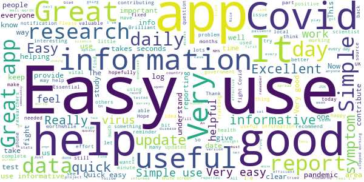
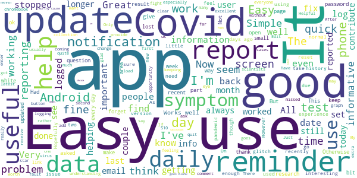
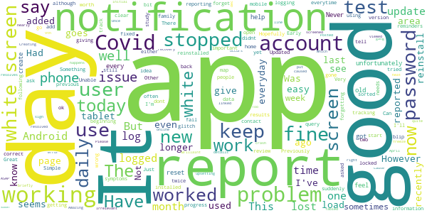
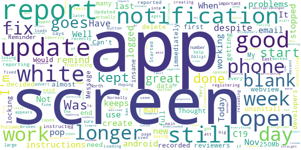
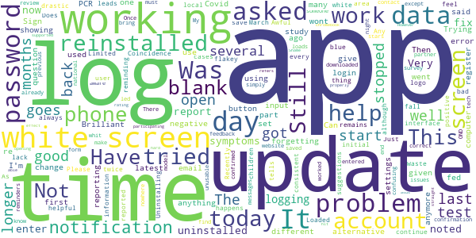

# COVID Symptom Study
App version ``2.1.0``

Analyzed with [covid-apps-observer](http://github.com/covid-apps-observer) project, version ``0.1``

## App overview
| | |
|-------------------------|-------------------------| 
| **Name**&nbsp;&nbsp;&nbsp;&nbsp;&nbsp;&nbsp;&nbsp;&nbsp;&nbsp;&nbsp;&nbsp;&nbsp;&nbsp;&nbsp;&nbsp;&nbsp;&nbsp;&nbsp;&nbsp;&nbsp;&nbsp;&nbsp;&nbsp;&nbsp;&nbsp;&nbsp;&nbsp;&nbsp;&nbsp;&nbsp;&nbsp;&nbsp;&nbsp;&nbsp;&nbsp;&nbsp;&nbsp;&nbsp;&nbsp;&nbsp;  | COVID Symptom Study |
| **Unique identifier** | com.joinzoe.covid_zoe |
| **Link to Google Play** | [https://play.google.com/store/apps/details?id=com.joinzoe.covid_zoe](https://play.google.com/store/apps/details?id=com.joinzoe.covid_zoe) |
| **Summary**  | Help slow COVID-19 by self-reporting your symptoms daily, even if you feel well. |
| **Privacy policy** | [https://predict.study/covid-privacy-notice/](https://predict.study/covid-privacy-notice/) |
| **Latest version** | 2.1.0 |
| **Last update** | 2020-12-08 17:17:26 |
| **Recent changes** | New branded sharing of maps and trendlines New Parental Dashboards for School Bubbles Improved scales on UK Trendline |
| **Installs**  | 1,000,000+ |
| **Category** | Health & Fitness |
| **First release** | Mar 20, 2020 |
| **Size**  | 35M |
| **Supported Android version**  | 5.0 and up |

### Description
> Take 1 minute each day and help fight the spread of COVID-19 in your community
 * Report your health daily even if you feel well
 * Get a daily estimate of COVID in your area
 * Help slow the outbreak near you
 Join millions of people supporting scientists at Stanford University, Harvard University, Massachusetts General Hospital, and King's College London to help fight coronavirus by identifying:
 * How fast the virus is spreading in your area
 * High-risk areas in the US
 * Who is most at risk, by better understanding symptoms linked to underlying health conditions
 You will contribute to advance research on COVID-19 in partnership with leading health researchers globally like TwinsUK, one of the most clinically detailed studies in the world.
 This app (formerly known as the Covid Symptom Tracker) allows you to help others, but does not give health advice. If you need health advice please visit the CDC website at: [https://www.cdc.gov/coronavirus/2019-ncov/index.html](https://www.cdc.gov/coronavirus/2019-ncov/index.html)
 This app has been designed for everyone to report their status not just those who are ill.
 It was designed by doctors and scientists at King's College London, Guys and St Thomas’ Hospitals and Zoe Global Limited, a health technology company.
 In the US the app is being used by the Nurses' Health Study to identify symptoms in active healthcare workers who are treating people with COVID across the country and risking their own health to help us.
 In response to recommendations by Stand Up To Cancer (SU2C), the app also includes questions for cancer patients and survivors, such as if they are living with cancer, what type of cancer and what treatment they are receiving.
 If you would like to help out in this difficult time, then you can. Download the app and share daily your own status, even if you are well. With your help we can understand much better the situation across the nation, how the disease presents itself to different people, and how it progresses.
 This is a new virus which the world has never seen before. There are a wide range of symptoms, which differ between people. With your help we can understand better how the disease presents itself depending upon individual factors such as health and age.
 No information you share will be used for commercial purposes.
 There are two parts to the app:
 HEALTH INFORMATION
 You will be asked to share some general information, such as your age and some health details, such as whether you have certain diseases.
 SYMPTOM TRACKING
 We will ask you every day to let us know how you feel, so you can share your symptoms. We will also ask whether you have visited the hospital, what treatment you received there, and whether you have been tested for COVID-19 (Coronavirus).

### User interface
The developers of the app provide the following screenshots in the Google play store.
| | | |
|:-------------------------:|:-------------------------:|:-------------------------:|
 |   |   |   | 
 |   |   |   | 
 |   |  

## Development team
In the following we report the main information provided by the development team in the Google play store.

| | |
|-------------------------|-------------------------|
| **Developer**  | Zoe Global Limited |
| **Website**  | [http://covid.joinzoe.com/](http://covid.joinzoe.com/) |
| **Email** | covid@joinzoe.com |
| **Physical address**  | [164 Westminster Bridge Road London SE1 7RW United Kingdom](https://www.google.com/maps/search/164%20Westminster%20Bridge%20Road%20London%20SE1%207RW%20United%20Kingdom) (Google Maps) |
| **Other developed apps**  | [https://play.google.com/store/apps/developer?id=Zoe+Global+Limited](https://play.google.com/store/apps/developer?id=Zoe+Global+Limited) |

## Android support

| | |
|-------------------------|-------------------------|
| **Declared target Android version**  | Android10, version 10 (API level 29) |
| **Effective target Android version**  | Android10, version 10 (API level 29) |
| **Minimum supported Android version**  | Lollipop, version 5.0 (API level 21) |
| **Maximum target Android version**  | - |

The larger the difference between the minimum and maximum supported Android versions, the better. A larger difference means a wider audience. For example, old phones have a very low Android version, so a high minimum supported Android version means that the app cannot be used by users with old phones, thus leading to accessibility problems. 

## Requested permissions

In the following we report the complete list of the permissions requested by the app. 

| **Permission** | **Protection level** | **Description** | 
|-------------------------|-------------------------|-------------------------|
 **android.permission ACCESS_BACKGROUND_LOCATION** | :warning:**Dangerous** | Allows an app to access location in the background. 
 **android.permission ACCESS_COARSE_LOCATION** | :warning:**Dangerous** | Allows an app to access approximate location. 
 **android.permission ACCESS_FINE_LOCATION** | :warning:**Dangerous** | Allows an app to access precise location. 
 **android.permission ACCESS_NETWORK_STATE** | Normal | Allows applications to access information about networks. 
 **android.permission ACCESS_WIFI_STATE** | Normal | Allows applications to access information about Wi-Fi networks. 
 **android.permission FOREGROUND_SERVICE** | Normal | Allows a regular application to use Service.startForeground. 
 **android.permission INTERNET** | Normal | Allows applications to open network sockets. 
 **android.permission READ_APP_BADGE** | - | - 
 **android.permission READ_EXTERNAL_STORAGE** | :warning:**Dangerous** | Allows an application to read from external storage. 
 **android.permission RECEIVE_BOOT_COMPLETED** | Normal | Allows an application to receive the Intent.ACTION_BOOT_COMPLETED that is broadcast after the system finishes booting. 
 **android.permission WAKE_LOCK** | Normal | Allows using PowerManager WakeLocks to keep processor from sleeping or screen from dimming. 
 **android.permission WRITE_EXTERNAL_STORAGE** | :warning:**Dangerous** | Allows an application to write to external storage. 
 **com.anddoes.launcher.permission UPDATE_COUNT** | - | - 
 **com.google.android.c2dm.permission RECEIVE** | - | - 
 **com.google.android.finsky.permission BIND_GET_INSTALL_REFERRER_SERVICE** | - | - 
 **com.google.android.gms.permission ACTIVITY_RECOGNITION** | - | - 
 **com.google.android.providers.gsf.permission READ_GSERVICES** | - | - 
 **com.htc.launcher.permission READ_SETTINGS** | - | - 
 **com.htc.launcher.permission UPDATE_SHORTCUT** | - | - 
 **com.huawei.android.launcher.permission CHANGE_BADGE** | - | - 
 **com.huawei.android.launcher.permission READ_SETTINGS** | - | - 
 **com.huawei.android.launcher.permission WRITE_SETTINGS** | - | - 
 **com.majeur.launcher.permission UPDATE_BADGE** | - | - 
 **com.oppo.launcher.permission READ_SETTINGS** | - | - 
 **com.oppo.launcher.permission WRITE_SETTINGS** | - | - 
 **com.sec.android.provider.badge.permission READ** | - | - 
 **com.sec.android.provider.badge.permission WRITE** | - | - 
 **com.sonyericsson.home.permission BROADCAST_BADGE** | - | - 
 **com.sonymobile.home.permission PROVIDER_INSERT_BADGE** | - | - 
 **me.everything.badger.permission BADGE_COUNT_READ** | - | - 
 **me.everything.badger.permission BADGE_COUNT_WRITE** | - | - 

## Mentioned servers

| **Server** | **Registrant** | **Registrant country** | **Creation date** | 
|-------------------------|-------------------------|-------------------------|-------------------------|
 | amplitude.com | Amplitude | :us: US | 1996-05-09 04:00:00 |
 | android.com | Google LLC | :us: US | 1997-06-23 04:00:00 |
 | google.com | Google LLC | :us: US | 1997-09-15 04:00:00 |
 | microsoft.com | Microsoft Corporation | :us: US | 1991-05-02 04:00:00 |
 | googleapis.com | Google LLC | :us: US | 2005-01-25 17:52:26 |
 | cloudfront.net | Amazon.com, Inc. | :us: US | 2008-04-25 18:25:49 |
 | expo.io | See PrivacyGuardian.org | :us: US | 2011-05-01 21:26:50 |

## Security analysis 

Below we report the main security warnings raised by our execution of the [Androwarn](https://github.com/maaaaz/androwarn) security analysis tool.

**Telephony identifiers leakage**
> - This application reads the ISO country code equivalent of the current registered operator's MCC (Mobile Country Code) 
> - This application reads the device phone type value 
> - This application reads the numeric name (MCC+MNC) of current registered operator 
> - This application reads the operator name 

**Location lookup**
> - This application reads location information from all available providers (WiFi, GPS etc.) 

**Connection interfaces exfiltration**
> - This application reads details about the currently active data network 
> - This application tries to find out if the currently active data network is metered 

**Suspicious connection establishment**
> - This application opens a Socket and connects it to the remote address '' on the 'N/A' port  
> - This application opens a Socket and connects it to the remote address 'Ljava/lang/StringBuilder;->toString()Ljava/lang/String;' on the ': connect, resolve' port  
> - This application opens a Socket and connects it to the remote address 'Ljava/lang/StringBuilder;->toString()Ljava/lang/String;' on the 'N/A' port  
> - This application opens a Socket and connects it to the remote address 'Ljava/net/Proxy;->type()Ljava/net/Proxy$Type;' on the 'N/A' port  
> - This application opens a Socket and connects it to the remote address 'timeout' on the 'N/A' port  

**Pim data leakage**
> - This application accesses data stored in the clipboard 

**Code execution**
> - This application loads a native library 
> - This application executes a UNIX command 

## User ratings and reviews

Below we provide information about how end users are reacting to the app in terms of ratings and reviews in the Google Play store.

### Ratings

The COVID Symptom Study app has been installed by more than **1000000** times. At this time, **131942** rated the app and its average score is **4.7407274**. Below we show the distribution of the ratings across the usual star-based rating of Google Play

:star::star::star::star::star:: 102963

:star::star::star::star:: 25329

:star::star::star:: 2628

:star::star:: 468

:star:: 554

### Reviews 

#### 5-star reviews

> Easy to use and seems relevant to the public good  :date: __2020-12-13 17:55:04__

> Great app for people who wants to report  :date: __2020-12-13 15:14:57__

> Easy to use  :date: __2020-12-13 15:14:07__

> Seems to work fine and it's all for a good purpose.  :date: __2020-12-13 14:54:47__

> Ive reported via this app for many months- until today 12/12/20. Now it launches and quickly switches to a white screen and has to be closed because it's showing no controls. Tried clear data and reinstall. NEXT DAY. It's working again following update. Must have been a glitch in update process.  :date: __2020-12-13 12:50:28__

> Easy  :date: __2020-12-13 12:50:25__

> Great 👌  :date: __2020-12-13 12:50:12__

> Gives a more trustworthy picture than SAGE  :date: __2020-12-13 12:50:00__

> I have found this app to be very useful during the pandemic  :date: __2020-12-13 12:43:53__

> Simple to use the app and hopefully it will help in the fight against Covid 19  :date: __2020-12-13 12:40:38__

#### 4-star reviews

> Very easy to use but I've had some issues downloading it since updates. A very worthy cause! Do it!  :date: __2020-12-13 18:57:46__

> Absolutely fine and happy to take part BUT I accidentally tapped the "I've had a vaccination" choice (my fault) and I can't find a means of reversing that. As a result I am taken down the post vaccination experience reporting process, so I just have to bale out.  :date: __2020-12-13 14:52:52__

> Have been doing this app daily since March 2020. It is Quick and easy to use. Just updated (13th Dec)as wasnt getting the daily reminder on android  :date: __2020-12-13 10:17:34__

> I used it for months every day reporting until some time this fall when it stopped coming each day.  :date: __2020-12-13 01:29:08__

> Always works. Easy to use.  :date: __2020-12-13 00:59:03__

> Good for gathering Covid-19 data as not enough known about possible sufferers outside hospitals. Tests only done there on admission at the moment in UK. UDATE: It's now opening and going to white screen today 12.12.2020. On Galaxy S10+ and iPhone XR. What's happening?  :date: __2020-12-12 14:01:50__

> Easy to use  :date: __2020-12-12 12:22:57__

> App starts up with the date it was last used. Only way to update it to today is to force quit via Android and then reopen. Could be distorting stats? No feedback option in-app. Edit: now won't open at all. Worthy cause, flaky software. Edit: now works fine. 9/12/2020.  :date: __2020-12-12 12:00:52__

> Quick and easy to use  :date: __2020-12-12 11:42:05__

> Easy and quick to use. Now mostly warns if there is no connection. However if connection is later lost whilst reporting symptoms, this is not reported. Graphs of All, Month, Week don't show any data.  :date: __2020-12-12 10:49:22__

#### 3-star reviews

> Brillaint app however the app hasn't worked for the last two days loads to the c-19 screen then white screens which is upsetting g as I've been logging in nearly everyday since April. Hopefully it will be resolved soon!.  :date: __2020-12-13 11:16:16__

> Amazing app until the fabled white screen error. Which is linked to your user account. Irrelevant which phone you sign in on, that user area once "white screened" will also cause the same issue and freeze the app to a white screen. Creating a new account briefly resolves, until the same issue occurs, which seems to be once I have viewed the heat map of my area and then the screen goes white. Once an account is "white screen locked" there is no recovery! Please correct this issue ASAP!  :date: __2020-12-13 08:48:13__

> Worked fine until today. Now just get a white screen  :date: __2020-12-12 20:19:22__

> Phone stopped working so put app on my tablet. Reported 2 days ago from phone but when I used app today on tablet, says last reported 11 days ago!!!  :date: __2020-12-10 18:34:42__

> Daily notifications have stopped. Too easy to forget to do it. Something's not quite right gang.  :date: __2020-12-10 17:31:14__

> Posted details while off line and they were not added when back online.  :date: __2020-12-10 08:34:16__

> Previously it worked well. However on the 9th dec an update has caused it to crash after the initial page to a white page on my tablet where previously it was fine. I'll reinstall and see what happens. 10\12\20. I reinstalled,cleared cache, behaved exactly the same I'm sorry to say. I have logged in since March for two people.  :date: __2020-12-10 08:15:48__

> It's been working fine, although the same questions asked over and over for a while now. But it's now not letting me get on the app. It starts to load but then goes blank  :date: __2020-12-10 06:04:16__

> This app is brilliant. Great to be part of an important study while simultaneously tracking the progress of Covid in my area. Early technical glitches now gone.  :date: __2020-12-08 08:53:46__

> The app is easy to use. We have a family mobile for out and about. Disappointingly it does not tell you the venue / date of contact with an individual exhibiting Covid symptoms so as for us to know who in the family was in contact (including children).  :date: __2020-12-07 18:55:52__

#### 2-star reviews

> Thought it was good to start with then before the end of the first week just kept locking up. Would open and then almost immediately just white screen out so have now decided to delete in from my phone.  :date: __2020-12-13 18:59:28__

> Message to developers: 250Mb for this app is insane. My phone is full and I need to uninstall some apps. Can't this all be done with a webview?  :date: __2020-12-13 14:39:23__

> Was a great app, but like so many other reviewers, I'm no longer getting notifications despite being logged in, so no data is recorded.  :date: __2020-12-13 07:35:54__

> Reminder notifications still don't work.  :date: __2020-12-12 21:42:07__

> Have been reporting since the very start but every day it says I haven't reported . Updated it as instructed and it said I hadn't logged on for 16 days! Started again to remind me to report when I have. Very frustrating. I'm in the North East where number of cases are large and so important that I report . Followed instructions after notification of problems re app but still reminds me to report about 1 hr after me having done so. Not sure if they are actually registering my reports!  :date: __2020-12-11 10:56:06__

> Recent update appears to have broken the app. Now loads a blank screen. Hoping for a fix soon.  :date: __2020-12-04 18:41:57__

> The notifications no longer work after the last android update.. got the email saying you'd fixed it but it still doesn't work for me...help.  :date: __2020-12-03 22:30:24__

> Normally great but keeps creating when it's opened this week  :date: __2020-12-03 12:34:00__

> Good until recently now I seem to for ever uninstalling and reloading as it keeps losing my identity.  :date: __2020-12-02 20:14:01__

> It's stopped working for me in the last few days. I now get the big "C19" screen, then a "C19 Loading.." screen, then the main page pops up with the "Report Today, Even if you're Well" button but then about 1s later, the screen just goes white. If feels like an advert is about to pop up but no. I can no longer use the app because of this.  :date: __2020-12-01 13:02:37__

#### 1-star reviews

> I have been logging symptoms, or lack of, for myself and 2 children since March. Just as I noted a drastic fall in cases in my local area I have also noted I cannot log into the app. Coincidence? As I open the app I get the initial blue screen and logo, and then a white screen which remains. I have uninstalled and reinstalled the app twice now, but the same thing happens. I would like to continue to enter my data as I feel it is helpful. Any suggestions about how to fix this problem?  :date: __2020-12-13 12:12:40__

> Awful app. Very bad user interface. Limited information. Waste of time. Uninstalling!!  :date: __2020-12-11 14:05:21__

> Recently it has stopped reminding me every day to report, which leads to me forgetting about it. Please fix so that I can be consistent with reporting again.  :date: __2020-12-10 18:06:00__

> Good to help with the study but app is flakey. Does not always save the data. Loaded app today and tells me it's 3 days since I reported although I did each day! It would be good to get a positive confirmation that data entered has been confirmed as saved. Update. Still same problems but after update last night it is unusable as when it loads you end up with a whit screen!  :date: __2020-12-09 11:22:59__

> Sign up form led to an error. Then tried a different password and it said I already had an account, so must have worked the first time. Then went to login and the login button simply doesn't work. My partner downloaded and tried too (different model phone) got the same error messages and when logging in it then said she had no account? Very confusing.  :date: __2020-12-09 01:04:21__

> Was 5 stars but it stopped showing reminders and my settings are correct. There's nowhere to give feedback about the app or how to contact someone for tech issues in the app or on the website. I don't know how else to make them aware of a problem except to change my review to a negative one.  :date: __2020-12-07 14:19:06__

> Once I had input a previous test which was negative as part of the OND national Covid survey I couldn't find where/how to input my bring well with no symptoms today.  :date: __2020-12-05 21:41:49__

> Brilliant app, supported it from the start. However now only gives me a white screen when i log on. Have reinstalled to no effect Shame . I have now given up and am no longer participating  :date: __2020-12-05 11:00:25__

> This rating only refers to today. On opening the app I get a white blank screen and can't do anything.  :date: __2020-12-04 15:54:59__

> I do not get notifications anymore  :date: __2020-12-03 19:23:48__

