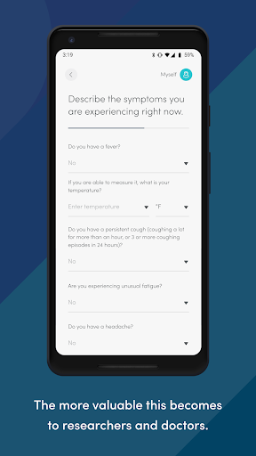
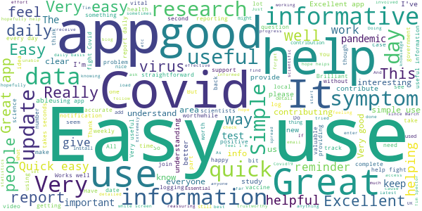
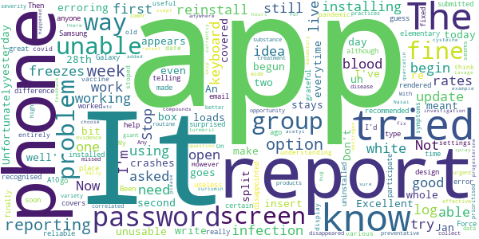

# COVID Symptom Study
App version ``2.2.0``

Analyzed with [covid-apps-observer](http://github.com/covid-apps-observer) project, version ``0.1``

## App overview
| | |
|-------------------------|-------------------------| 
| **Name**&nbsp;&nbsp;&nbsp;&nbsp;&nbsp;&nbsp;&nbsp;&nbsp;&nbsp;&nbsp;&nbsp;&nbsp;&nbsp;&nbsp;&nbsp;&nbsp;&nbsp;&nbsp;&nbsp;&nbsp;&nbsp;&nbsp;&nbsp;&nbsp;&nbsp;&nbsp;&nbsp;&nbsp;&nbsp;&nbsp;&nbsp;&nbsp;&nbsp;&nbsp;&nbsp;&nbsp;&nbsp;&nbsp;&nbsp;&nbsp;  | COVID Symptom Study |
| **Unique identifier** | com.joinzoe.covid_zoe |
| **Link to Google Play** | [https://play.google.com/store/apps/details?id=com.joinzoe.covid_zoe](https://play.google.com/store/apps/details?id=com.joinzoe.covid_zoe) |
| **Summary**  | Help slow COVID-19 by self-reporting your symptoms daily, even if you feel well. |
| **Privacy policy** | [https://predict.study/covid-privacy-notice/](https://predict.study/covid-privacy-notice/) |
| **Latest version** | 2.2.0 |
| **Last update** | 2020-12-18 12:42:28 |
| **Recent changes** | Diet study results for participating users. UI fixes. |
| **Installs**  | 1,000,000+ |
| **Category** | Health & Fitness |
| **First release** | Mar 20, 2020 |
| **Size**  | 36M |
| **Supported Android version**  | 5.0 and up |

### Description
> Take 1 minute each day and help fight the spread of COVID-19 in your community
 * Report your health daily even if you feel well
 * Get a daily estimate of COVID in your area
 * Help slow the outbreak near you
 Join millions of people supporting scientists at Stanford University, Harvard University, Massachusetts General Hospital, and King's College London to help fight coronavirus by identifying:
 * How fast the virus is spreading in your area
 * High-risk areas in the US
 * Who is most at risk, by better understanding symptoms linked to underlying health conditions
 You will contribute to advance research on COVID-19 in partnership with leading health researchers globally like TwinsUK, one of the most clinically detailed studies in the world.
 This app (formerly known as the Covid Symptom Tracker) allows you to help others, but does not give health advice. If you need health advice please visit the CDC website at: [https://www.cdc.gov/coronavirus/2019-ncov/index.html](https://www.cdc.gov/coronavirus/2019-ncov/index.html)
 This app has been designed for everyone to report their status not just those who are ill.
 It was designed by doctors and scientists at King's College London, Guys and St Thomas’ Hospitals and Zoe Global Limited, a health technology company.
 In the US the app is being used by the Nurses' Health Study to identify symptoms in active healthcare workers who are treating people with COVID across the country and risking their own health to help us.
 In response to recommendations by Stand Up To Cancer (SU2C), the app also includes questions for cancer patients and survivors, such as if they are living with cancer, what type of cancer and what treatment they are receiving.
 If you would like to help out in this difficult time, then you can. Download the app and share daily your own status, even if you are well. With your help we can understand much better the situation across the nation, how the disease presents itself to different people, and how it progresses.
 This is a new virus which the world has never seen before. There are a wide range of symptoms, which differ between people. With your help we can understand better how the disease presents itself depending upon individual factors such as health and age.
 No information you share will be used for commercial purposes.
 There are two parts to the app:
 HEALTH INFORMATION
 You will be asked to share some general information, such as your age and some health details, such as whether you have certain diseases.
 SYMPTOM TRACKING
 We will ask you every day to let us know how you feel, so you can share your symptoms. We will also ask whether you have visited the hospital, what treatment you received there, and whether you have been tested for COVID-19 (Coronavirus).

### User interface
The developers of the app provide the following screenshots in the Google play store.
| | | |
|:-------------------------:|:-------------------------:|:-------------------------:|
 |   |   |   | 
 |   |   |   | 
 |   |  

## Development team
In the following we report the main information provided by the development team in the Google play store.

| | |
|-------------------------|-------------------------|
| **Developer**  | Zoe Global Limited |
| **Website**  | [http://covid.joinzoe.com/](http://covid.joinzoe.com/) |
| **Email** | covid@joinzoe.com |
| **Physical address**  | [164 Westminster Bridge Road London SE1 7RW United Kingdom](https://www.google.com/maps/search/164%20Westminster%20Bridge%20Road%20London%20SE1%207RW%20United%20Kingdom) (Google Maps) |
| **Other developed apps**  | [https://play.google.com/store/apps/developer?id=Zoe+Global+Limited](https://play.google.com/store/apps/developer?id=Zoe+Global+Limited) |

## Android support

| | |
|-------------------------|-------------------------|
| **Declared target Android version**  | Android10, version 10 (API level 29) |
| **Effective target Android version**  | Android10, version 10 (API level 29) |
| **Minimum supported Android version**  | Lollipop, version 5.0 (API level 21) |
| **Maximum target Android version**  | - |

The larger the difference between the minimum and maximum supported Android versions, the better. A larger difference means a wider audience. For example, old phones have a very low Android version, so a high minimum supported Android version means that the app cannot be used by users with old phones, thus leading to accessibility problems. 

## Requested permissions

In the following we report the complete list of the permissions requested by the app. 

| **Permission** | **Protection level** | **Description** | 
|-------------------------|-------------------------|-------------------------|
 **android.permission ACCESS_BACKGROUND_LOCATION** | :warning:**Dangerous** | Allows an app to access location in the background. 
 **android.permission ACCESS_COARSE_LOCATION** | :warning:**Dangerous** | Allows an app to access approximate location. 
 **android.permission ACCESS_FINE_LOCATION** | :warning:**Dangerous** | Allows an app to access precise location. 
 **android.permission ACCESS_NETWORK_STATE** | Normal | Allows applications to access information about networks. 
 **android.permission ACCESS_WIFI_STATE** | Normal | Allows applications to access information about Wi-Fi networks. 
 **android.permission FOREGROUND_SERVICE** | Normal | Allows a regular application to use Service.startForeground. 
 **android.permission INTERNET** | Normal | Allows applications to open network sockets. 
 **android.permission READ_APP_BADGE** | - | - 
 **android.permission READ_EXTERNAL_STORAGE** | :warning:**Dangerous** | Allows an application to read from external storage. 
 **android.permission RECEIVE_BOOT_COMPLETED** | Normal | Allows an application to receive the Intent.ACTION_BOOT_COMPLETED that is broadcast after the system finishes booting. 
 **android.permission WAKE_LOCK** | Normal | Allows using PowerManager WakeLocks to keep processor from sleeping or screen from dimming. 
 **android.permission WRITE_EXTERNAL_STORAGE** | :warning:**Dangerous** | Allows an application to write to external storage. 
 **com.anddoes.launcher.permission UPDATE_COUNT** | - | - 
 **com.google.android.c2dm.permission RECEIVE** | - | - 
 **com.google.android.finsky.permission BIND_GET_INSTALL_REFERRER_SERVICE** | - | - 
 **com.google.android.gms.permission ACTIVITY_RECOGNITION** | - | - 
 **com.google.android.providers.gsf.permission READ_GSERVICES** | - | - 
 **com.htc.launcher.permission READ_SETTINGS** | - | - 
 **com.htc.launcher.permission UPDATE_SHORTCUT** | - | - 
 **com.huawei.android.launcher.permission CHANGE_BADGE** | - | - 
 **com.huawei.android.launcher.permission READ_SETTINGS** | - | - 
 **com.huawei.android.launcher.permission WRITE_SETTINGS** | - | - 
 **com.majeur.launcher.permission UPDATE_BADGE** | - | - 
 **com.oppo.launcher.permission READ_SETTINGS** | - | - 
 **com.oppo.launcher.permission WRITE_SETTINGS** | - | - 
 **com.sec.android.provider.badge.permission READ** | - | - 
 **com.sec.android.provider.badge.permission WRITE** | - | - 
 **com.sonyericsson.home.permission BROADCAST_BADGE** | - | - 
 **com.sonymobile.home.permission PROVIDER_INSERT_BADGE** | - | - 
 **me.everything.badger.permission BADGE_COUNT_READ** | - | - 
 **me.everything.badger.permission BADGE_COUNT_WRITE** | - | - 

## Mentioned servers

| **Server** | **Registrant** | **Registrant country** | **Creation date** | 
|-------------------------|-------------------------|-------------------------|-------------------------|
 | amplitude.com | Amplitude | :us: US | 1996-05-09 04:00:00 |
 | android.com | Google LLC | :us: US | 1997-06-23 04:00:00 |
 | google.com | Google LLC | :us: US | 1997-09-15 04:00:00 |
 | microsoft.com | Microsoft Corporation | :us: US | 1991-05-02 04:00:00 |
 | googleapis.com | Google LLC | :us: US | 2005-01-25 17:52:26 |
 | cloudfront.net | Amazon.com, Inc. | :us: US | 2008-04-25 18:25:49 |
 | expo.io | See PrivacyGuardian.org | :us: US | 2011-05-01 21:26:50 |

## Security analysis 

Below we report the main security warnings raised by our execution of the [Androwarn](https://github.com/maaaaz/androwarn) security analysis tool.

**Telephony identifiers leakage**
> - This application reads the ISO country code equivalent of the current registered operator's MCC (Mobile Country Code) 
> - This application reads the device phone type value 
> - This application reads the numeric name (MCC+MNC) of current registered operator 
> - This application reads the operator name 

**Location lookup**
> - This application reads location information from all available providers (WiFi, GPS etc.) 

**Connection interfaces exfiltration**
> - This application reads details about the currently active data network 
> - This application tries to find out if the currently active data network is metered 

**Suspicious connection establishment**
> - This application opens a Socket and connects it to the remote address '' on the 'N/A' port  
> - This application opens a Socket and connects it to the remote address 'Ljava/lang/StringBuilder;->toString()Ljava/lang/String;' on the ': connect, resolve' port  
> - This application opens a Socket and connects it to the remote address 'Ljava/lang/StringBuilder;->toString()Ljava/lang/String;' on the 'N/A' port  
> - This application opens a Socket and connects it to the remote address 'Ljava/net/Proxy;->type()Ljava/net/Proxy$Type;' on the 'N/A' port  
> - This application opens a Socket and connects it to the remote address 'timeout' on the 'N/A' port  

**Pim data leakage**
> - This application accesses data stored in the clipboard 

**Code execution**
> - This application loads a native library 
> - This application executes a UNIX command 

## User ratings and reviews

Below we provide information about how end users are reacting to the app in terms of ratings and reviews in the Google Play store.

### Ratings

The COVID Symptom Study app has been installed by more than **1000000** times. At this time, **132542** rated the app and its average score is **4.7363367**. Below we show the distribution of the ratings across the usual star-based rating of Google Play

:star::star::star::star::star:: 103238

:star::star::star::star:: 25450

:star::star::star:: 2710

:star::star:: 503

:star:: 641

### Reviews 

#### 5-star reviews

> Very easy to use and helpful for COVID If you say you feel unwell they also refer you for a test with NHS  :date: __2020-12-28 12:15:23__

> Great App  :date: __2020-12-28 12:13:27__

> It's very helpful to know what is happening with the cases in my local area  :date: __2020-12-28 12:12:08__

> Innovative way to help track the spread and effects of Covid 19  :date: __2020-12-28 11:51:04__

> Excellent much better than that Rubbish app Serco wrote for the NHS  :date: __2020-12-28 11:47:58__

> Easy as, and very insightful  :date: __2020-12-28 08:07:32__

> Easy to use seems worthwhile  :date: __2020-12-27 22:05:29__

> Best Covid app  :date: __2020-12-27 20:03:31__

> A vital tool. I have more confidence in the science behind this than anything the government have come up with so far.  :date: __2020-12-27 19:35:10__

> Very quick and easy to report symptoms  :date: __2020-12-27 18:23:11__

#### 4-star reviews

> Great app, helping to identify early. It reminds you every day to report back on your situation which will hopefully lead to early detection by digital means rather than pure physical testing  :date: __2020-12-28 11:48:04__

> Unable to add a further test. Restarted phone, restarted app, but still claims that I need to 'please scroll up to fill in missing details or correct'. There is nothing to fill in or correct! I have previously added 6 tests without a problem. Is this an issue with the recent update? Otherwise, happily logging my (absence of, so far) symptoms on a daily basis...  :date: __2020-12-28 11:40:38__

> Efficient and regularly updated, the app is clear and easy to navigate.  :date: __2020-12-28 10:13:48__

> Simple, helping the fight against COVID  :date: __2020-12-28 09:18:43__

> Great project 👍  :date: __2020-12-27 19:37:28__

> Uninstalled etc but Ive been unable to add new test for last two days - I've filled in the fields and just asks me to add missing data or correct.... Now based on symptoms been asked to take a test by the app... App issue or user error?  :date: __2020-12-27 18:53:01__

> Reminders have disappeared  :date: __2020-12-27 17:14:24__

> Logging in isn't straightforward  :date: __2020-12-27 16:09:02__

> Has worked well for the most part but have been unable to report the result of an antibody test: I fill out all the sections and it says there's missing information and I can't submit, I have to just say I haven't had a test.  :date: __2020-12-27 13:30:49__

> Update 27/12/20 Aside from a short term reminder issue in November, the app has been working well, but there's currently a glitch with test reporting so my data has been incomplete since 23rd December. Original Review Spring 2021: Good to feel you are making a contribution, however small, by using this. Like the daily reminder, & link to the website for more information on the study etc.  :date: __2020-12-27 13:02:18__

#### 3-star reviews

> I can't input my latest test - the app tells me to correct the information but it is correct and nothing is missing  :date: __2020-12-28 10:39:59__

> I've been logging daily since the app launched, but since the update I no longer get daily reminders and so often go days without remembering to log - apparently to be a known fault but have been unable to resolve.  :date: __2020-12-28 00:25:43__

> It is confusing with the one which does identify you, track and trace and all that I do not want  :date: __2020-12-27 22:21:46__

> It's a must to keep on top of the virus. It won't let me log my test 😭  :date: __2020-12-27 11:42:59__

> This app was great, I could log all my tests (regular tests from work) but as of yesterday I've just been getting a white screen? Uninstalled and installed again but still the same..disappointing. Update: I can get back on again, but unable to scroll down my tests to update results :/ Update:sorted now. 26/12: now unable to add test since 23/12 keeps telling me to scroll up to fill in missing details..no details missing  :date: __2020-12-26 12:13:22__

> Will no longer let me input test results  :date: __2020-12-26 11:42:48__

> Good but too many clicks every day! Wheres the 'I'm fine' shortcut? Also data must be skewed, only very cautious people would bother with this app.  :date: __2020-12-25 14:22:02__

> This morning when I select "this list is correct" for previous tests, it immediately goes on to ask me whether I have any issues with the vaccination site I have not had a vaccination and did not indicate that I have.  :date: __2020-12-25 08:42:34__

> Excellent idea and I really want to help but it does seem a bit buggy. Currently can't log a Covid test as it keeps telling me I haven't filled in all the fields - I have!! Also reminders keep turning themselves off.  :date: __2020-12-24 21:15:38__

> I can't use the app anymore. After logging in the app displays only a white screen. Have tried uninstalling and reinstalling, the same.  :date: __2020-12-24 15:22:49__

#### 2-star reviews

> I have not been able to add a new test since the 23rd December, whilst we have had Covid in the household. I have emailed to highlight the issue but I still cannot add my test, nor can my husband.  :date: __2020-12-27 12:48:02__

> All, Month and Week graphs stopped working some time ago and the developer has not fixed them or responded to email.  :date: __2020-12-27 12:12:45__

> Great to assist in the fight against covid !!  :date: __2020-12-26 11:46:56__

> Easy to use. But won't let me add a covid test....  :date: __2020-12-25 12:55:09__

> No longer working. Just get a blank white screen. Cleared data, reinstalled .. same  :date: __2020-12-25 10:18:59__

> Latest update means app does not work. Needs to be resolved quickly. Easy to use and gives up to date estimates in my area.  :date: __2020-12-23 09:22:25__

> Today 22/12/2020 Says server down. logged out logged back in now it doesn't recognise my login details. Sums up this year doesn't it one minute things are looking on the up and getting better then boom heading towards another national lockdown ..... Update has logged me out says my password doesn't work needs a forgot password link have had to stop contributing . KEEP WASHING THOSE HANDS STAY SAFE Update : Developers have been quick to address the issue of forget password button . 5 stars  :date: __2020-12-22 17:53:24__

> Utterly butterly gutted. The app has stopped its daily prompting.  :date: __2020-12-17 14:23:42__

> Easy and may help in the future. It has now stopped working totally reinstated it, not working White screen then nothing, a shame because it was good.  :date: __2020-12-15 22:14:38__

> Not been getting push notifications for a good couple of weeks, so rarely report now, whereas before I did it every day.  :date: __2020-12-15 16:46:24__

#### 1-star reviews

> COVID data for my region is out of alignment with PHE and worryingly the app shows a fall of ~500 from last week and PHE showing a rise of 158 (~39%). True the figures shown widely disagree but the trends should be consistent. The app appears to be making the area looking better than national statistics suggest. Is there a way to get the app to show both?  :date: __2020-12-28 08:12:31__

> HELP! I've been logging every day but today after the 'splash' screen I just get an empty white screen and I can't do anything. Tried killing the app and restarting, uninstalling and re-installing but still no luck.  :date: __2020-12-24 12:11:50__

> Won't let me enter previous Covid test info so can't use app. Obviously bug in it or an issue with my One Plus 6 phone??  :date: __2020-12-23 19:09:33__

> Was working great. But since your latest update, all I get is a blank screen when I log on  :date: __2020-12-23 11:32:00__

> As another user says I am getting the white screen every time I try to log in - only from today, but as I have logged in every day and I am sure others do the same and probably now have the same problem..,. Please help us to help you  :date: __2020-12-23 10:27:42__

> Accidentally clicked that I had a covid vaccine in the app when I haven't and can't find a way to remove it. This is stopping me from report my symptoms without first reporting vaccine symptoms, which I'm not going to do. Please introduce a way to remove this.  :date: __2020-12-21 07:45:29__

> Sort out the issues or else I won't be bothered and will delete the app  :date: __2020-12-20 11:14:34__

> I recently updated the app and now it will not load. Great before, quick and easy to log your health! But now I am faced with a white screen instead.  :date: __2020-12-20 10:36:05__

> Worked ok until 19th December when it just showed a blank screen after loading. Same after updating. Shame but this type of app must be 100% reliable to be useful. Uninstalling  :date: __2020-12-20 08:20:34__

> I have no trouble sharing anonymized data, but personal traceable data is right out.  :date: __2020-12-20 05:57:39__

