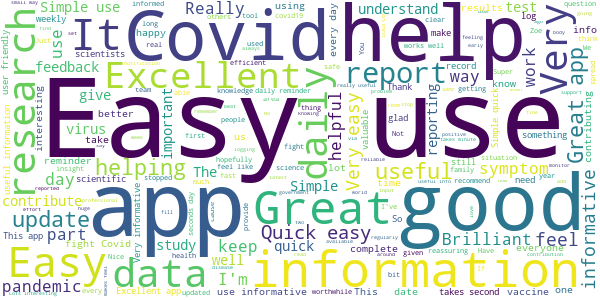
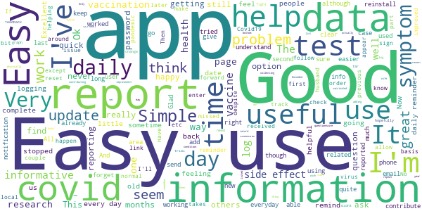
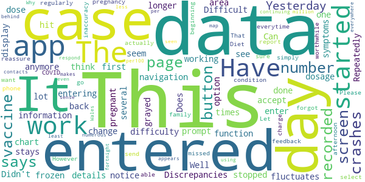
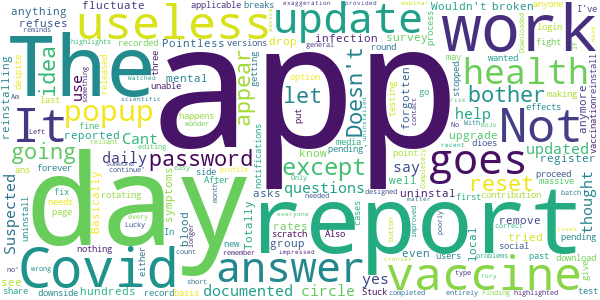

# COVID Symptom Study
App version ``2.4.0``

Analyzed with [covid-apps-observer](http://github.com/covid-apps-observer) project, version ``0.1``

## App overview
| | |
|-------------------------|-------------------------| 
| **Name**&nbsp;&nbsp;&nbsp;&nbsp;&nbsp;&nbsp;&nbsp;&nbsp;&nbsp;&nbsp;&nbsp;&nbsp;&nbsp;&nbsp;&nbsp;&nbsp;&nbsp;&nbsp;&nbsp;&nbsp;&nbsp;&nbsp;&nbsp;&nbsp;&nbsp;&nbsp;&nbsp;&nbsp;&nbsp;&nbsp;&nbsp;&nbsp;&nbsp;&nbsp;&nbsp;&nbsp;&nbsp;&nbsp;&nbsp;&nbsp;  | COVID Symptom Study |
| **Unique identifier** | com.joinzoe.covid_zoe |
| **Link to Google Play** | [https://play.google.com/store/apps/details?id=com.joinzoe.covid_zoe](https://play.google.com/store/apps/details?id=com.joinzoe.covid_zoe) |
| **Summary**  | Help slow COVID-19 by self-reporting your symptoms daily, even if you feel well. |
| **Privacy policy** | [https://predict.study/covid-privacy-notice/](https://predict.study/covid-privacy-notice/) |
| **Latest version** | 2.4.0 |
| **Last update** | 2021-02-08 21:04:34 |
| **Recent changes** | Security upgrade and bug fixes.  |
| **Installs**  | 1,000,000+ |
| **Category** | Health & Fitness |
| **First release** | Mar 20, 2020 |
| **Size**  | 37M |
| **Supported Android version**  | 5.0 and up |

### Description
> Take 1 minute each day and help fight the spread of COVID-19 in your community
 * Report your health daily even if you feel well
 * Get a daily estimate of COVID in your area
 * Help slow the outbreak near you
 Join millions of people supporting scientists at Stanford University, Harvard University, Massachusetts General Hospital, and King's College London to help fight coronavirus by identifying:
 * How fast the virus is spreading in your area
 * High-risk areas in the US
 * Who is most at risk, by better understanding symptoms linked to underlying health conditions
 You will contribute to advance research on COVID-19 in partnership with leading health researchers globally like TwinsUK, one of the most clinically detailed studies in the world.
 This app (formerly known as the Covid Symptom Tracker) allows you to help others, but does not give health advice. If you need health advice please visit the CDC website at: [https://www.cdc.gov/coronavirus/2019-ncov/index.html](https://www.cdc.gov/coronavirus/2019-ncov/index.html)
 This app has been designed for everyone to report their status not just those who are ill.
 It was designed by doctors and scientists at King's College London, Guys and St Thomas’ Hospitals and Zoe Global Limited, a health technology company.
 In the US the app is being used by the Nurses' Health Study to identify symptoms in active healthcare workers who are treating people with COVID across the country and risking their own health to help us.
 In response to recommendations by Stand Up To Cancer (SU2C), the app also includes questions for cancer patients and survivors, such as if they are living with cancer, what type of cancer and what treatment they are receiving.
 If you would like to help out in this difficult time, then you can. Download the app and share daily your own status, even if you are well. With your help we can understand much better the situation across the nation, how the disease presents itself to different people, and how it progresses.
 This is a new virus which the world has never seen before. There are a wide range of symptoms, which differ between people. With your help we can understand better how the disease presents itself depending upon individual factors such as health and age.
 No information you share will be used for commercial purposes.
 There are two parts to the app:
 HEALTH INFORMATION
 You will be asked to share some general information, such as your age and some health details, such as whether you have certain diseases.
 SYMPTOM TRACKING
 We will ask you every day to let us know how you feel, so you can share your symptoms. We will also ask whether you have visited the hospital, what treatment you received there, and whether you have been tested for COVID-19 (Coronavirus).

### User interface
The developers of the app provide the following screenshots in the Google play store.
| | | |
|:-------------------------:|:-------------------------:|:-------------------------:|
 |   |   |   | 
 |   |   |   | 
 |   |  

## Development team
In the following we report the main information provided by the development team in the Google play store.

| | |
|-------------------------|-------------------------|
| **Developer**  | Zoe Global Limited |
| **Website**  | [http://covid.joinzoe.com/](http://covid.joinzoe.com/) |
| **Email** | covid@joinzoe.com |
| **Physical address**  | [164 Westminster Bridge Road London SE1 7RW United Kingdom](https://www.google.com/maps/search/164%20Westminster%20Bridge%20Road%20London%20SE1%207RW%20United%20Kingdom) (Google Maps) |
| **Other developed apps**  | [https://play.google.com/store/apps/developer?id=Zoe+Global+Limited](https://play.google.com/store/apps/developer?id=Zoe+Global+Limited) |

## Android support

| | |
|-------------------------|-------------------------|
| **Declared target Android version**  | Android10, version 10 (API level 29) |
| **Effective target Android version**  | Android10, version 10 (API level 29) |
| **Minimum supported Android version**  | Lollipop, version 5.0 (API level 21) |
| **Maximum target Android version**  | - |

The larger the difference between the minimum and maximum supported Android versions, the better. A larger difference means a wider audience. For example, old phones have a very low Android version, so a high minimum supported Android version means that the app cannot be used by users with old phones, thus leading to accessibility problems. 

## Requested permissions

In the following we report the complete list of the permissions requested by the app. 

| **Permission** | **Protection level** | **Description** | 
|-------------------------|-------------------------|-------------------------|
 **android.permission ACCESS_NETWORK_STATE** | Normal | Allows applications to access information about networks. 
 **android.permission ACCESS_WIFI_STATE** | Normal | Allows applications to access information about Wi-Fi networks. 
 **android.permission INTERNET** | Normal | Allows applications to open network sockets. 
 **android.permission READ_APP_BADGE** | - | - 
 **android.permission READ_EXTERNAL_STORAGE** | :warning:**Dangerous** | Allows an application to read from external storage. 
 **android.permission RECEIVE_BOOT_COMPLETED** | Normal | Allows an application to receive the Intent.ACTION_BOOT_COMPLETED that is broadcast after the system finishes booting. 
 **android.permission WAKE_LOCK** | Normal | Allows using PowerManager WakeLocks to keep processor from sleeping or screen from dimming. 
 **android.permission WRITE_EXTERNAL_STORAGE** | :warning:**Dangerous** | Allows an application to write to external storage. 
 **com.anddoes.launcher.permission UPDATE_COUNT** | - | - 
 **com.google.android.c2dm.permission RECEIVE** | - | - 
 **com.google.android.finsky.permission BIND_GET_INSTALL_REFERRER_SERVICE** | - | - 
 **com.htc.launcher.permission READ_SETTINGS** | - | - 
 **com.htc.launcher.permission UPDATE_SHORTCUT** | - | - 
 **com.huawei.android.launcher.permission CHANGE_BADGE** | - | - 
 **com.huawei.android.launcher.permission READ_SETTINGS** | - | - 
 **com.huawei.android.launcher.permission WRITE_SETTINGS** | - | - 
 **com.majeur.launcher.permission UPDATE_BADGE** | - | - 
 **com.oppo.launcher.permission READ_SETTINGS** | - | - 
 **com.oppo.launcher.permission WRITE_SETTINGS** | - | - 
 **com.sec.android.provider.badge.permission READ** | - | - 
 **com.sec.android.provider.badge.permission WRITE** | - | - 
 **com.sonyericsson.home.permission BROADCAST_BADGE** | - | - 
 **com.sonymobile.home.permission PROVIDER_INSERT_BADGE** | - | - 
 **me.everything.badger.permission BADGE_COUNT_READ** | - | - 
 **me.everything.badger.permission BADGE_COUNT_WRITE** | - | - 

## Mentioned servers

| **Server** | **Registrant** | **Registrant country** | **Creation date** | 
|-------------------------|-------------------------|-------------------------|-------------------------|
 | amplitude.com | Amplitude | :us: US | 1996-05-09 04:00:00 |
 | android.com | Google LLC | :us: US | 1997-06-23 04:00:00 |
 | google.com | Google LLC | :us: US | 1997-09-15 04:00:00 |
 | microsoft.com | Microsoft Corporation | :us: US | 1991-05-02 04:00:00 |
 | googleapis.com | Google LLC | :us: US | 2005-01-25 17:52:26 |
 | cloudfront.net | Amazon.com, Inc. | :us: US | 2008-04-25 18:25:49 |
 | expo.io | See PrivacyGuardian.org | :us: US | 2011-05-01 21:26:50 |

## Security analysis 

Below we report the main security warnings raised by our execution of the [Androwarn](https://github.com/maaaaz/androwarn) security analysis tool.

**Telephony identifiers leakage**
> - This application reads the ISO country code equivalent of the current registered operator's MCC (Mobile Country Code) 
> - This application reads the device phone type value 
> - This application reads the numeric name (MCC+MNC) of current registered operator 
> - This application reads the operator name 

**Location lookup**
> - This application reads location information from all available providers (WiFi, GPS etc.) 

**Connection interfaces exfiltration**
> - This application reads details about the currently active data network 
> - This application tries to find out if the currently active data network is metered 

**Suspicious connection establishment**
> - This application opens a Socket and connects it to the remote address '' on the 'N/A' port  
> - This application opens a Socket and connects it to the remote address 'Ljava/lang/StringBuilder;->toString()Ljava/lang/String;' on the ': connect, resolve' port  
> - This application opens a Socket and connects it to the remote address 'Ljava/lang/StringBuilder;->toString()Ljava/lang/String;' on the 'N/A' port  
> - This application opens a Socket and connects it to the remote address 'Ljava/net/Proxy;->type()Ljava/net/Proxy$Type;' on the 'N/A' port  
> - This application opens a Socket and connects it to the remote address 'timeout' on the 'N/A' port  

**Pim data leakage**
> - This application accesses data stored in the clipboard 

**Code execution**
> - This application loads a native library 
> - This application loads a native library: 'log' 
> - This application loads a native library: 'sentry' 
> - This application loads a native library: 'sentry-android' 
> - This application executes a UNIX command 

## User ratings and reviews

Below we provide information about how end users are reacting to the app in terms of ratings and reviews in the Google Play store.

### Ratings

The COVID Symptom Study app has been installed by more than **1000000** times. At this time, **137120** rated the app and its average score is **4.7255664**. Below we show the distribution of the ratings across the usual star-based rating of Google Play

:star::star::star::star::star:: 107021

:star::star::star::star:: 25316

:star::star::star:: 3021

:star::star:: 781

:star:: 981

### Reviews 

#### 5-star reviews

> So far very good  :date: __2021-04-12 10:32:40__

> Easy to use, has given useful information that has fit through the noise and often unclear and misinterpreted science in the media. And assisting science to help us.  :date: __2021-04-12 10:10:32__

> Easy to use. Do informative.  :date: __2021-04-12 00:44:20__

> Easy to use and I feel I may be contributing in a small way to the research into covid.  :date: __2021-04-11 21:42:58__

> Better than nothing! The feedback is reassuring that it is worth participating.  :date: __2021-04-11 21:35:41__

> It has helped me to keep up with what is going on and I can see how I am helping with the project  :date: __2021-04-11 15:22:10__

> Easy and straight forward to use, personally having to do lateral flow tests twice a week, so logging them here gives me a easy to reach record. Keeps you updated on the research conducted regarding covid19.  :date: __2021-04-11 14:29:53__

> Great app. Pleased to help.  :date: __2021-04-11 12:48:34__

> Straightforward & informative  :date: __2021-04-11 12:29:48__

> Great work?  :date: __2021-04-11 11:33:08__

#### 4-star reviews

> Good simple app doing a superb job in data collection  :date: __2021-04-11 23:29:58__

> After using the app since last May, since yesterday I am unable to log in. Have tried reinstalling the app bit still unable to log in or change my password.  :date: __2021-04-11 13:04:07__

> I have used this app for a year without any issues. Since yesterday I am logged out, unable to log in. Reinstalled app and tried to Chang's password with no success  :date: __2021-04-11 11:44:29__

> One or two elements of the UI are crude. Eh since I report for two people each day why do I go right back to the start after the first one?  :date: __2021-04-11 09:30:55__

> Happy to contribute. Easy enough  :date: __2021-04-10 22:04:46__

> Easy to install and use even for a 70 year old.  :date: __2021-04-10 11:57:11__

> Fairly easy to navigate, although the words in the boxes are hard to read.  :date: __2021-04-10 11:32:41__

> Easy to use  :date: __2021-04-10 09:19:43__

> No problem  :date: __2021-04-10 07:47:53__

> Uncomplicated, informative and very easy to use.  :date: __2021-04-08 23:50:46__

#### 3-star reviews

> Is there any point in competing this anymore? The information on there hasn't been updated in months, and you haven't updated to include adding vaccination details.  :date: __2021-04-09 17:37:49__

> My app on Android will not allow me to add another person as it is for USA only  :date: __2021-04-07 08:29:39__

> I'm torn between providing data and potentially contributing to a casedemic  :date: __2021-04-06 23:18:28__

> Just wish they would add walk in community test centres to their locations options. Many towns now have them and we've had since before Christmas but i have to manually type in each time as the nearest other option is drive through.  :date: __2021-04-04 14:24:34__

> The year is not displayed when I enter dates, so I am not sure it gets the year correct. Whenever I edit the date, it defaults to 2021.  :date: __2021-04-01 17:52:30__

> Sometimes difficult to navigate. I would have stopped using, but I am a part of a long term health study.  :date: __2021-03-31 16:06:50__

> Reminds me to report daily AFTER reporting  :date: __2021-03-31 12:22:30__

> This is good for reporting. The additional feedback is helpful.  :date: __2021-03-23 21:06:10__

> This was a great app but since Feb update I have had problems, I'm either kicked off, can't sign in, or the app fails to open. Please fix it. I can't be bothered reinstalling it every day!  :date: __2021-03-23 16:07:10__

> Always worked well up until I wanted to enter first vaccination. App will not accept data do am then unable to enter symptoms or lack of them 🤷  :date: __2021-03-22 21:26:24__

#### 2-star reviews

> Suddenly asking me to login each time and now not recognizing my account aftrr reinstalling.  :date: __2021-04-09 17:53:00__

> Clunky, on a daily basis you need to update your profiles, yet they are only available by scrolling right to the bottom of the home screen, which you have to do again and again for EVERY profile, no thought put into how this is used daily.  :date: __2021-03-31 15:40:49__

> Diet insights are a waste of time. This insight would be valid if it reviewed my original diet, but the whole score is simply based on whether your diet has changed, not what it is. This lack of research makes you wonder about the rest of the app.  :date: __2021-03-28 10:08:01__

> Hello! DOES ANYONE INVOLVED WITH THIS APP CARE THAT THE APP DOESN'T RECORD MY DATA? YOU HAVEN'T RESPONDED TO ANY OF MY EMAILS. PLEASE reassure me that my data is actually being recorded. The app says I haven't entered any for 5 days. I have missed a day as I forgot to charge my phone, but I entered data Yesterday afternoon. This inaccuracy has been there from the beginning. I want to be sure it is worthwhile continuing.  :date: __2021-03-22 02:43:15__

> So many questions daily. It got tedious.  :date: __2021-03-17 01:42:12__

> Good for up to date info. I'm unable to log my vaccination, told to ensure I have latest updates etc. so even reinstalled app to ensure this, but still can't. Disappointing  :date: __2021-03-10 12:56:37__

> I had a lateral test turns out to be positive and a lab test turns out negative, does this app help me what I need to do next NO. Use the lab tests use the track and trace app. More accurate.  :date: __2021-03-10 09:54:30__

> Cannot find where I put my daily health check in  :date: __2021-03-08 12:31:19__

> It seems to make up local cases numbers on the fly. My area hasn't seen more than 6900 cases since the start of the pandemic, yet apparently, according to the app we've had nearly 15k... Something's amiss here  :date: __2021-03-07 10:44:34__

> Has been great until today, then froze. Rebooted phone and 95 days of data lost. Including all inputs on jabs and dates.  :date: __2021-03-06 11:02:38__

#### 1-star reviews

> Poor. Connection Difficult always to log in .  :date: __2021-04-09 12:28:45__

> I had this app a while ago, uninstalled it but forgot to review it. Fairly poor interface but also I'd question the value of the data gathered and how it can be of real value.  :date: __2021-04-07 03:02:39__

> Apparently I'm supposed to be able to log my vaccine on here. Still have not worked out how. Can ask other people log their vaccine, but no idea how to log my own. Very frustrating. I've checked I've got the latest version, I'm pretty tech savvy but still no idea. Given up.  :date: __2021-04-06 08:49:24__

> 547 MB of storage used!? This should be such a simple little app!  :date: __2021-04-04 15:00:35__

> Still a blank white space where the graphs should be: there were no issues for a long time, then suddenly one day they vanished! All you see is the covid case figure, 'Dec-Mar' on the horizontal axis & 'Share the graph', nothing else: you can't share what you can't see. No explanation given. Ditto for the UK map: that's become invisible too. I contacted Zoe a good while back, they acknowledged the problem...but nothing. It is a good app, but I do wish they would take the trouble to sort it out.  :date: __2021-04-01 11:56:57__

> Hasn't asked me for update for months. Not sure why it stopped giving me notifications. Using latest (android) version and notifications not blocked on phone  :date: __2021-03-28 13:42:39__

> Easy to use. Pleased to be able to help this study. Update March 21 It's lost about 3.5 months of my data. No advice yet on if I need to re-enter vaccine, tests, etc. so currently not logging anything. Frustrating.  :date: __2021-03-27 17:44:40__

> Now wont start  :date: __2021-03-23 18:19:01__

> Sadly, went pear-shaped during installation: created account, without username or details. Emailed developer; no response. Have uninstalled. 1 star for a good idea.  :date: __2021-03-19 15:46:51__

> only asks how you feel "today" and you can not say about retro-active days (like day after jab last week!) That makes it absolutely pointless for gathering essential data. Only had a dead arm feeling next day, like I was punched in arm.  :date: __2021-03-18 02:57:57__

