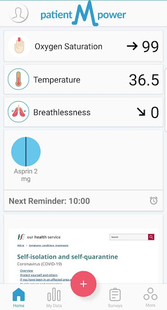
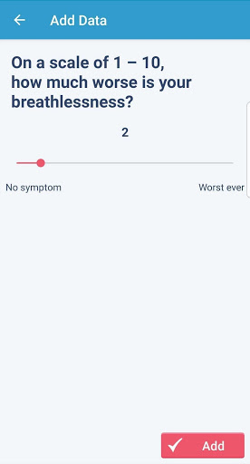
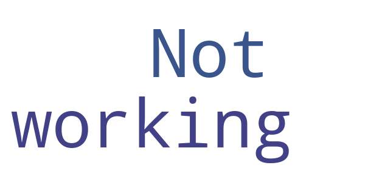

# patientMpower for COVID-19
App version ``covid-19-1.6.0``

Analyzed with [covid-apps-observer](http://github.com/covid-apps-observer) project, version ``0.1``

## App overview
| | |
|-------------------------|-------------------------| 
| **Name**                                          | patientMpower for COVID-19 |
| **Unique identifier** | com.maithu.transplantbuddy.covid19 |
| **Link to Google Play** | [https://play.google.com/store/apps/details?id=com.maithu.transplantbuddy.covid19](https://play.google.com/store/apps/details?id=com.maithu.transplantbuddy.covid19) |
| **Summary**  | patientMpower COVID-19 Patient Management app |
| **Privacy policy** | [https://info.patientmpower.com/covid19-privacy-policy](https://info.patientmpower.com/covid19-privacy-policy) |
| **Latest version** | covid-19-1.6.0 |
| **Last update** | 2021-02-09 17:41:31 |
| **Recent changes** | Our support email and phone number are now visible in the app. |
| **Installs**  | 1,000+ |
| **Category** | Health & Fitness |
| **First release** | Mar 15, 2020 |
| **Size**  | 64M |
| **Supported Android version**  | 4.3 and up |

### Description
> The patientMpower for COVID-19 app is for people in the Republic of Ireland who have been enrolled in the COVID-19 remote monitoring programme by a healthcare professional. 
 The patientMpower for COVID-19 app will allow you to monitor your COVID-19 symptoms and  health information such as your oxygen levels and temperature whilst you are in self-isolation. This information will be shared confidentially with trained personnel at dedicated monitoring centres. They will be able to see your information immediately. Monitoring will enable healthcare professionals to assess if you are recovering well whilst in isolation or if you need additional support (e.g. extra treatments at home or if you need to go to hospital). 
 It is recommended that you consent to using location services after downloading this app. If you don’t want to consent to sharing your location you can continue to use the app. The location information will be de-identified and used for research into COVID-19. 
 KEY FEATURES
  - Monitors your oxygen saturation (using a device called a pulse oximeter), which is important to track to ensure you are recovering from COVID-19
  - Tracks your symptoms including breathlessness
  - Records details of relevant underlying conditions and your existing medications
  - Anonymised location monitoring, to help us understand trends of COVID-19 across Ireland and plan resources to best deliver healthcare
  - Confidential health data viewable in real time by healthcare professionals at monitoring centres
 patientMpower are an Irish digital health company who are experienced in providing home monitoring  platforms for people with lung conditions. If you need help installing the app or need any technical support please email support@patientMpower.com. 
 IMPORTANT: This app cannot provide medical intervention in the event of an emergency. If you experience a rapid worsening of symptoms or severe breathing difficulties please contact 999 or 112. 
 Privacy policy:
 https://info.patientmpower.com/covid19-privacy-policy

### User interface
The developers of the app provide the following screenshots in the Google play store.
| | | |
|:-------------------------:|:-------------------------:|:-------------------------:|
 |   |   |   | 
 |   |   |   | 
 |  

## Development team
In the following we report the main information provided by the development team in the Google play store.

| | |
|-------------------------|-------------------------|
| **Developer**  | patientMpower |
| **Website**  | [https://info.patientmpower.com/](https://info.patientmpower.com/) |
| **Email** | info+covid-19@patientmpower.com |
| **Physical address**  | [The Digital Depot Thomas St Dublin D08 TCV4 Ireland](https://www.google.com/maps/search/The%20Digital%20Depot%20Thomas%20St%20Dublin%20D08%20TCV4%20Ireland) (Google Maps) |
| **Other developed apps**  | [https://play.google.com/store/apps/developer?id=patientMpower](https://play.google.com/store/apps/developer?id=patientMpower) |

## Android support

| | |
|-------------------------|-------------------------|
| **Declared target Android version**  | Android10, version 10 (API level 29) |
| **Effective target Android version**  | Android10, version 10 (API level 29) |
| **Minimum supported Android version**  | Jelly Bean, version 4.3.x (API level 18) |
| **Maximum target Android version**  | - |

The larger the difference between the minimum and maximum supported Android versions, the better. A larger difference means a wider audience. For example, old phones have a very low Android version, so a high minimum supported Android version means that the app cannot be used by users with old phones, thus leading to accessibility problems. 

## Requested permissions

In the following we report the complete list of the permissions requested by the app. 

| **Permission** | **Protection level** | **Description** | 
|-------------------------|-------------------------|-------------------------|
 **android.permission ACCESS_COARSE_LOCATION** | :warning:**Dangerous** | Allows an app to access approximate location. 
 **android.permission ACCESS_FINE_LOCATION** | :warning:**Dangerous** | Allows an app to access precise location. 
 **android.permission ACCESS_NETWORK_STATE** | Normal | Allows applications to access information about networks. 
 **android.permission BLUETOOTH** | Normal | Allows applications to connect to paired bluetooth devices. 
 **android.permission BLUETOOTH_ADMIN** | Normal | Allows applications to discover and pair bluetooth devices. 
 **android.permission CAMERA** | :warning:**Dangerous** | Required to be able to access the camera device. 
 **android.permission INTERNET** | Normal | Allows applications to open network sockets. 
 **android.permission READ_EXTERNAL_STORAGE** | :warning:**Dangerous** | Allows an application to read from external storage. 
 **android.permission RECEIVE_BOOT_COMPLETED** | Normal | Allows an application to receive the Intent.ACTION_BOOT_COMPLETED that is broadcast after the system finishes booting. 
 **android.permission VIBRATE** | Normal | Allows access to the vibrator. 
 **android.permission WAKE_LOCK** | Normal | Allows using PowerManager WakeLocks to keep processor from sleeping or screen from dimming. 
 **android.permission WRITE_EXTERNAL_STORAGE** | :warning:**Dangerous** | Allows an application to write to external storage. 
 **com.amazon.device.messaging.permission RECEIVE** | - | - 
 **com.google.android.c2dm.permission RECEIVE** | - | - 
 **com.google.android.finsky.permission BIND_GET_INSTALL_REFERRER_SERVICE** | - | - 
 **com.maithu.transplantbuddy.covid19.permission C2D_MESSAGE** | - | - 
 **com.maithu.transplantbuddy.covid19.permission RECEIVE_ADM_MESSAGE** | - | - 

## Mentioned servers

| **Server** | **Registrant** | **Registrant country** | **Creation date** | 
|-------------------------|-------------------------|-------------------------|-------------------------|
 | googlesyndication.com | Google LLC | :us: US | 2003-01-21 06:17:24 |
 | google.com | Google LLC | :us: US | 1997-09-15 04:00:00 |
 | facebook.com | Facebook, Inc. | :us: US | 1997-03-29 05:00:00 |
 | megsupporttools.com | Registrant State/Province: N/A | IE | 2017-03-07 18:37:51 |
 | patientmpower.com | Patient Buddy | IE | 2016-04-06 17:01:49 |
 | app-measurement.com | Google LLC | :us: US | 2015-06-19 20:13:31 |
 | googleapis.com | Google LLC | :us: US | 2005-01-25 17:52:26 |
 | googleapis.com | Google LLC | :us: US | 2005-01-25 17:52:26 |
 | waqi.info | Contact Privacy Inc. Customer 0147459724 | :canada: CA | 2013-01-28 13:36:34 |
 | mixpanel.com | WhoisGuard, Inc. | PA | 2007-03-13 02:23:00 |
 | urbanairship.com | DNStination Inc. | :us: US | 2009-04-14 06:34:46 |
 | vimeo.com | Vimeo, Inc. | :us: US | 2004-12-15 08:38:55 |
 | crashlytics.com | Google LLC | :us: US | 2011-01-21 15:30:40 |
 | twitter.com | Twitter, Inc. | :us: US | 2000-01-21 16:28:17 |
 | intercomcdn.com | Whois Privacy Service | :us: US | 2013-04-25 22:04:57 |
 | wistia.net | Wistia | :us: US | 2008-09-02 18:42:09 |
 | youtube.com | Google LLC | :us: US | 2005-02-15 05:13:12 |
 | wistia.com | Wistia | :us: US | 2007-03-18 21:58:55 |
 | intercom.io | Intercom Ops | IE | 2011-08-15 11:52:53 |
 | googleadservices.com | Google LLC | :us: US | 2003-06-19 16:34:53 |

## Security analysis 

Below we report the main security warnings raised by our execution of the [Androwarn](https://github.com/maaaaz/androwarn) security analysis tool.

**Telephony identifiers leakage**
> - This application reads the numeric name (MCC+MNC) of current registered operator 
> - This application reads the operator name 
> - This application reads the radio technology (network type) currently in use on the device for data transmission 
> - This application reads the unique device ID, i.e the IMEI for GSM and the MEID or ESN for CDMA phones 

**Location lookup**
> - This application reads location information from all available providers (WiFi, GPS etc.) 

**Connection interfaces exfiltration**
> - This application reads details about the currently active data network 
> - This application tries to find out if the currently active data network is metered 

**Telephony services abuse**
> - This application makes phone calls 

**Suspicious connection establishment**
> - This application opens a Socket and connects it to the remote address '' on the 'N/A' port  
> - This application opens a Socket and connects it to the remote address 'Ljava/lang/StringBuilder;->toString()Ljava/lang/String;' on the 'N/A' port  
> - This application opens a Socket and connects it to the remote address 'Ljava/net/Proxy;->type()Ljava/net/Proxy$Type;' on the 'N/A' port  
> - This application opens a Socket and connects it to the remote address 'timeout' on the 'N/A' port  

**Pim data leakage**
> - This application accesses data stored in the clipboard 

**Code execution**
> - This application loads a native library: 'Ljava/lang/String;->valueOf(Ljava/lang/Object;)Ljava/lang/String;' 
> - This application loads a native library: 'jniPdfium' 
> - This application loads a native library: 'modft2' 
> - This application loads a native library: 'modpdfium' 
> - This application loads a native library: 'modpng' 
> - This application executes a UNIX command containing this argument: 'uname -a' 

## User ratings and reviews

Below we provide information about how end users are reacting to the app in terms of ratings and reviews in the Google Play store.

### Ratings

The patientMpower for COVID-19 app has been installed by more than **1000** times. At this time, **-** rated the app and its average score is **0.0**. Below we show the distribution of the ratings across the usual star-based rating of Google Play

:star::star::star::star::star:: 0

:star::star::star::star:: 0

:star::star::star:: 0

:star::star:: 0

:star:: 0

### Reviews 

#### 5-star reviews

No recent reviews available with 5 stars.

#### 4-star reviews

No recent reviews available with 4 stars.

#### 3-star reviews

No recent reviews available with 3 stars.

#### 2-star reviews

No recent reviews available with 2 stars.

#### 1-star reviews

> Not working  :date: __2020-06-09 23:02:07__

