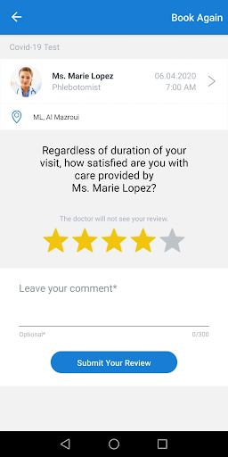
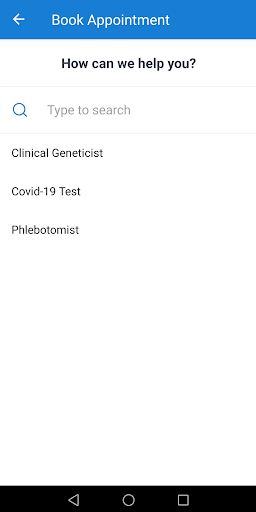
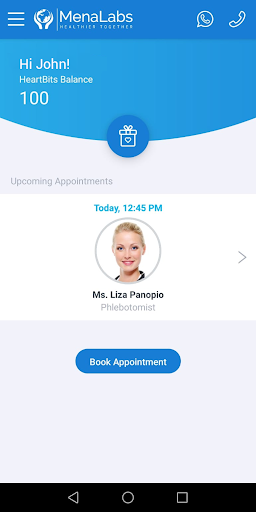
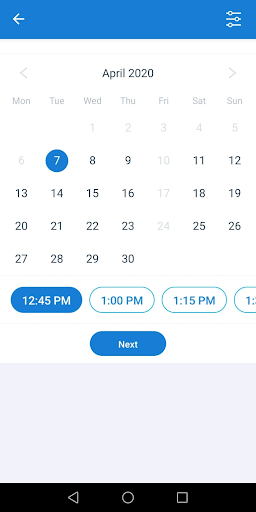

# MenaLabs
App version ``1.1.4``

Analyzed with [covid-apps-observer](http://github.com/covid-apps-observer) project, version ``0.1``

## App overview
| | |
|-------------------------|-------------------------| 
| **Name**&nbsp;&nbsp;&nbsp;&nbsp;&nbsp;&nbsp;&nbsp;&nbsp;&nbsp;&nbsp;&nbsp;&nbsp;&nbsp;&nbsp;&nbsp;&nbsp;&nbsp;&nbsp;&nbsp;&nbsp;&nbsp;&nbsp;&nbsp;&nbsp;&nbsp;&nbsp;&nbsp;&nbsp;&nbsp;&nbsp;&nbsp;&nbsp;&nbsp;&nbsp;&nbsp;&nbsp;&nbsp;&nbsp;&nbsp;&nbsp;  | MenaLabs |
| **Unique identifier** | com.menalabs.app |
| **Link to Google Play** | [https://play.google.com/store/apps/details?id=com.menalabs.app](https://play.google.com/store/apps/details?id=com.menalabs.app) |
| **Summary**  | Find a specialist or medical test and book a visit at MenaLabs laboratories |
| **Privacy policy** | [https://www.heartbits.me/privacy-policy/](https://www.heartbits.me/privacy-policy/) |
| **Latest version** | 1.1.4 |
| **Last update** | 2020-09-24 10:56:00 |
| **Recent changes** | Visual improvements |
| **Installs**  | 500+ |
| **Category** | Medical |
| **First release** | Apr 18, 2020 |
| **Size**  | 11M |
| **Supported Android version**  | 4.1 and up |

### Description
> Manage your health mobile way. Find a specialists or medical test and make an appointment at MenaLabs laboratories.
 MenaLabs mobile application allows making appointments in MenaLabs laboratories with specialists of your need and ordering specialty tests. The application brings also loyalty program for MenaLabs customers.
 A transparent interface and intuitive navigation allow:
 *) user registration
 *) presentation of a health care provider
 *) presentation of specialists and their profiles
 *) mechanism to book, reschedule and cancel appointments with specialists
 *) notification reminder about an incoming visit
 *) visit satisfaction feedback collection
 *) presentation of history of visits
 *) laboratory result delivery to the patient
 *) mechanism of loyalty points collection
 *) presentation of rewards to be redeemed using the collected loyalty points

### User interface
The developers of the app provide the following screenshots in the Google play store.
| | | |
|:-------------------------:|:-------------------------:|:-------------------------:|
 |   |   |   | 
 |   |  

## Development team
In the following we report the main information provided by the development team in the Google play store.

| | |
|-------------------------|-------------------------|
| **Developer**  | Menalabs |
| **Website**  | [https://www.menalabs.com/](https://www.menalabs.com/) |
| **Email** | support@heartbits.me |
| **Physical address**  | - |
| **Other developed apps**  | [https://play.google.com/store/apps/developer?id=Menalabs](https://play.google.com/store/apps/developer?id=Menalabs) |

## Android support

| | |
|-------------------------|-------------------------|
| **Declared target Android version**  | Android10, version 10 (API level 29) |
| **Effective target Android version**  | Android10, version 10 (API level 29) |
| **Minimum supported Android version**  | Jelly Bean, version 4.1.x (API level 16) |
| **Maximum target Android version**  | - |

The larger the difference between the minimum and maximum supported Android versions, the better. A larger difference means a wider audience. For example, old phones have a very low Android version, so a high minimum supported Android version means that the app cannot be used by users with old phones, thus leading to accessibility problems. 

## Requested permissions

In the following we report the complete list of the permissions requested by the app. 

| **Permission** | **Protection level** | **Description** | 
|-------------------------|-------------------------|-------------------------|
 **android.permission ACCESS_COARSE_LOCATION** | :warning:**Dangerous** | Allows an app to access approximate location. 
 **android.permission ACCESS_NETWORK_STATE** | Normal | Allows applications to access information about networks. 
 **android.permission ACCESS_WIFI_STATE** | Normal | Allows applications to access information about Wi-Fi networks. 
 **android.permission INTERNET** | Normal | Allows applications to open network sockets. 
 **android.permission RECEIVE_BOOT_COMPLETED** | Normal | Allows an application to receive the Intent.ACTION_BOOT_COMPLETED that is broadcast after the system finishes booting. 
 **android.permission VIBRATE** | Normal | Allows access to the vibrator. 
 **android.permission WAKE_LOCK** | Normal | Allows using PowerManager WakeLocks to keep processor from sleeping or screen from dimming. 
 **com.google.android.c2dm.permission RECEIVE** | - | - 
 **com.google.android.finsky.permission BIND_GET_INSTALL_REFERRER_SERVICE** | - | - 

## Mentioned servers

| **Server** | **Registrant** | **Registrant country** | **Creation date** | 
|-------------------------|-------------------------|-------------------------|-------------------------|
 | android.com | Google LLC | :us: US | 1997-06-23 04:00:00 |
 | googlesyndication.com | Google LLC | :us: US | 2003-01-21 06:17:24 |
 | google.com | Google LLC | :us: US | 1997-09-15 04:00:00 |
 | app-measurement.com | Google LLC | :us: US | 2015-06-19 20:13:31 |
 | googleapis.com | Google LLC | :us: US | 2005-01-25 17:52:26 |
 | googleadservices.com | Google LLC | :us: US | 2003-06-19 16:34:53 |

## Security analysis 

Below we report the main security warnings raised by our execution of the [Androwarn](https://github.com/maaaaz/androwarn) security analysis tool.

**Telephony identifiers leakage**
> - This application reads the numeric name (MCC+MNC) of current registered operator 
> - This application reads the operator name 
> - This application reads the phone number string for line 1, for example, the MSISDN for a GSM phone 

**Location lookup**
> - This application reads location information from all available providers (WiFi, GPS etc.) 

**Connection interfaces exfiltration**
> - This application reads details about the currently active data network 
> - This application tries to find out if the currently active data network is metered 

**Suspicious connection establishment**
> - This application opens a Socket and connects it to the remote address '' on the 'N/A' port  
> - This application opens a Socket and connects it to the remote address 'Ljava/lang/StringBuilder;->toString()Ljava/lang/String;' on the ': connect, resolve' port  
> - This application opens a Socket and connects it to the remote address 'Ljava/lang/StringBuilder;->toString()Ljava/lang/String;' on the 'N/A' port  
> - This application opens a Socket and connects it to the remote address 'Ljava/net/Proxy;->type()Ljava/net/Proxy$Type;' on the 'N/A' port  
> - This application opens a Socket and connects it to the remote address 'timeout' on the 'N/A' port  

**Pim data leakage**
> - This application accesses data stored in the clipboard 

**Code execution**
> - This application loads a native library 
> - This application executes a UNIX command containing this argument: '2' 

## User ratings and reviews

Below we provide information about how end users are reacting to the app in terms of ratings and reviews in the Google Play store.

### Ratings

The MenaLabs app has been installed by more than **500** times. At this time, **30** rated the app and its average score is **4.866667**. Below we show the distribution of the ratings across the usual star-based rating of Google Play

:star::star::star::star::star:: 29

:star::star::star::star:: 0

:star::star::star:: 0

:star::star:: 0

:star:: 1

### Reviews 

#### 5-star reviews

> Fast and reliable service  :date: __2020-09-09 06:53:21__

> Exceptional services,easy to navigate  :date: __2020-08-20 17:49:31__

> Easy to use. 👏  :date: __2020-08-17 10:39:33__

> Great staff and fast and efficient service.  :date: __2020-08-17 10:25:23__

> So educative and a friendly place of work  :date: __2020-08-16 10:46:45__

> Appoinment are so easy..staff are expert and professionals. excellent Apps Keep it up👍👍👍👍👍  :date: __2020-08-15 13:41:12__

> Fast and Reliable results.  :date: __2020-08-15 12:26:50__

> They provide ultimate quality service  :date: __2020-08-15 12:06:56__

> Easy to book an appointment and very reliable  :date: __2020-08-15 11:51:16__

> Easy to navigate app, very responsive. 5 star to this!  :date: __2020-08-15 11:50:51__

#### 4-star reviews

No recent reviews available with 4 stars.

#### 3-star reviews

No recent reviews available with 3 stars.

#### 2-star reviews

No recent reviews available with 2 stars.

#### 1-star reviews

> OTP didnt come forever  :date: __2021-04-11 13:13:51__

> Covid pcr test not available in Dubai  :date: __2021-03-08 18:39:40__

