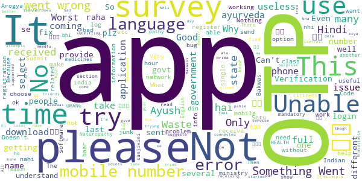

# Ayush Sanjivani
App version ``1.0.9``

Analyzed with [covid-apps-observer](http://github.com/covid-apps-observer) project, version ``0.1``

## App overview
| | |
|-------------------------|-------------------------| 
| **Name**&nbsp;&nbsp;&nbsp;&nbsp;&nbsp;&nbsp;&nbsp;&nbsp;&nbsp;&nbsp;&nbsp;&nbsp;&nbsp;&nbsp;&nbsp;&nbsp;&nbsp;&nbsp;&nbsp;&nbsp;&nbsp;&nbsp;&nbsp;&nbsp;&nbsp;&nbsp;&nbsp;&nbsp;&nbsp;&nbsp;&nbsp;&nbsp;&nbsp;&nbsp;&nbsp;&nbsp;&nbsp;&nbsp;&nbsp;&nbsp;  | Ayush Sanjivani |
| **Unique identifier** | com.negd.ayushfeedback |
| **Link to Google Play** | [https://play.google.com/store/apps/details?id=com.negd.ayushfeedback](https://play.google.com/store/apps/details?id=com.negd.ayushfeedback) |
| **Summary**  | For analysing the use of AYUSH interventions for immunity in COVID 19 situation. |
| **Privacy policy** | [https://test2.ncog.gov.in/Ayush_Sanjivani_Privacy/privacy-policy-page/privay-policy.html](https://test2.ncog.gov.in/Ayush_Sanjivani_Privacy/privacy-policy-page/privay-policy.html) |
| **Latest version** | 1.0.9 |
| **Last update** | 2020-11-16 13:45:04 |
| **Recent changes** | - Bug fixes and optimizations |
| **Installs**  | 500,000+ |
| **Category** | Health & Fitness |
| **First release** | Apr 24, 2020 |
| **Size**  | 4.8M |
| **Supported Android version**  | 4.4 and up |

### Description
> The Ministry of AYUSH presents the “Ayush Sanjivani” mobile application for understanding the measures adopted by public for enhancing immunity and keeping themselves healthy in the difficult COVID-19 situation. The app is designed as a simple but effective mechanism of electronic documentation for studying population behaviour. Response of the public to the advisories issued by the AYUSH Ministry on immunity enhancement will be an important area of examination. In addition, provision is also made for recording other measures (if any) propagated by AYUSH practitioners and adopted by general public for immunity enhancement and disease prevention. Data collected through this app will be analyzed to find out usage of AYUSH interventions and its efficacy in maintaining health by enhancing immunity.
 This app is at the centre of a massive exercise to study specific health seeking behaviours of the public in which the Central Research Councils of AYUSH, the National Institutes of AYUSH, numerous AYUSH educational institutions and state governments bodies collaborate. The Ministry has a target sample size of 1 million people for this study, making it one of the largest in any discipline of medicine. All those who volunteer to furnish information through this app will be making a significant contribution to the study of public health in the country.
 Data collected will be analyzed and will be useful for the AYUSH systems, and will establish their viability as health-assuring practices globally. This would also add momentum to the growth of the AYUSH Sector.

### User interface
The developers of the app provide the following screenshots in the Google play store.
| | | |
|:-------------------------:|:-------------------------:|:-------------------------:|
 |   |   |   | 
 |   |   |   | 
 |   |  

## Development team
In the following we report the main information provided by the development team in the Google play store.

| | |
|-------------------------|-------------------------|
| **Developer**  | Ministry of AYUSH |
| **Website**  | [https://www.ayush.gov.in/](https://www.ayush.gov.in/) |
| **Email** | ayush.sanjivani@digitalindia.gov.in |
| **Physical address**  | - |
| **Other developed apps**  | [https://play.google.com/store/apps/developer?id=Ministry+of+AYUSH](https://play.google.com/store/apps/developer?id=Ministry+of+AYUSH) |

## Android support

| | |
|-------------------------|-------------------------|
| **Declared target Android version**  | Android10, version 10 (API level 29) |
| **Effective target Android version**  | Android10, version 10 (API level 29) |
| **Minimum supported Android version**  | KitKat, version 4.4 - 4.4.4 (API level 19) |
| **Maximum target Android version**  | - |

The larger the difference between the minimum and maximum supported Android versions, the better. A larger difference means a wider audience. For example, old phones have a very low Android version, so a high minimum supported Android version means that the app cannot be used by users with old phones, thus leading to accessibility problems. 

## Requested permissions

In the following we report the complete list of the permissions requested by the app. 

| **Permission** | **Protection level** | **Description** | 
|-------------------------|-------------------------|-------------------------|
 **android.permission ACCESS_NETWORK_STATE** | Normal | Allows applications to access information about networks. 
 **android.permission INTERNET** | Normal | Allows applications to open network sockets. 
 **android.permission WAKE_LOCK** | Normal | Allows using PowerManager WakeLocks to keep processor from sleeping or screen from dimming. 
 **com.google.android.c2dm.permission RECEIVE** | - | - 

## Mentioned servers

| **Server** | **Registrant** | **Registrant country** | **Creation date** | 
|-------------------------|-------------------------|-------------------------|-------------------------|
 | google.com | Google LLC | :us: US | 1997-09-15 04:00:00 |
 | facebook.com | Facebook, Inc. | :us: US | 1997-03-29 05:00:00 |
 | googleapis.com | Google LLC | :us: US | 2005-01-25 17:52:26 |

## Security analysis 

Below we report the main security warnings raised by our execution of the [Androwarn](https://github.com/maaaaz/androwarn) security analysis tool.

**Connection interfaces exfiltration**
> - This application reads details about the currently active data network 
> - This application tries to find out if the currently active data network is metered 

**Telephony services abuse**
> - This application makes phone calls 

**Suspicious connection establishment**
> - This application opens a Socket and connects it to the remote address '' on the 'N/A' port  
> - This application opens a Socket and connects it to the remote address 'Ljava/lang/StringBuilder;->toString()Ljava/lang/String;' on the 'N/A' port  
> - This application opens a Socket and connects it to the remote address 'Ljava/net/Proxy;->type()Ljava/net/Proxy$Type;' on the 'N/A' port  
> - This application opens a Socket and connects it to the remote address 'timeout' on the 'N/A' port  

## User ratings and reviews

Below we provide information about how end users are reacting to the app in terms of ratings and reviews in the Google Play store.

### Ratings

The Ayush Sanjivani app has been installed by more than **500000** times. At this time, **2241** rated the app and its average score is **3.9267242**. Below we show the distribution of the ratings across the usual star-based rating of Google Play

:star::star::star::star::star:: 1344

:star::star::star::star:: 299

:star::star::star:: 106

:star::star:: 77

:star:: 415

### Reviews 

#### 5-star reviews

> मै अपने मोबाइल पर otp नहीं प्राप्त कर पा रहा हूं,,क्यों?  :date: __2021-04-22 07:37:41__

> Useful app for all  :date: __2021-04-07 10:57:22__

> Good  :date: __2021-01-30 15:30:51__

> Very useful  :date: __2020-12-28 11:20:24__

> Good knowledgeable app  :date: __2020-11-24 15:28:15__

> Otp to bhejo  :date: __2020-11-24 15:01:06__

> Very good  :date: __2020-10-17 14:28:14__

> Nice  :date: __2020-10-12 19:37:32__

> Too good  :date: __2020-10-08 19:43:41__

> Excellent  :date: __2020-09-29 05:46:40__

#### 4-star reviews

> Not getting OTP on any number  :date: __2021-04-17 18:27:40__

> Provide general basic ayuervedic medicine tips for more general diseases  :date: __2020-10-19 19:29:10__

> Nice app for immune system improvement  :date: __2020-08-24 17:23:46__

> Best  :date: __2020-08-22 15:42:21__

> Not too useful  :date: __2020-08-21 22:01:41__

> I had new to this app and shall find out results after use.  :date: __2020-08-10 20:27:59__

> Good  :date: __2020-08-10 18:34:52__

> Nice app  :date: __2020-07-14 07:24:21__

> Ok  :date: __2020-07-11 18:18:24__

> Very helpful  :date: __2020-07-04 13:54:42__

#### 3-star reviews

> Fair  :date: __2020-07-18 19:00:04__

> Problem ke hisab se uska ilaj batane ke liye bhi option dijiye Jab kisi ko koi problem hoga to us option me jake check karega kya chij use kare ki problem thik ho jaye Tab jyada log Aayurved par dhyan denge.  :date: __2020-07-02 10:20:19__

> Good  :date: __2020-06-28 14:13:38__

> "Something went wrong " What is this pls solve  :date: __2020-06-21 06:27:48__

> It's very helpful for us  :date: __2020-06-20 03:00:22__

> Good pahal by csc  :date: __2020-06-18 13:05:46__

> Good  :date: __2020-06-18 09:06:21__

> Good  :date: __2020-06-13 08:42:18__

> Good But some Issues..  :date: __2020-06-11 03:19:58__

> BeSt  :date: __2020-06-10 07:56:36__

#### 2-star reviews

> I am not recieving OTP on my mobile number.  :date: __2020-11-14 22:14:07__

> Never got any appointment from doctor  :date: __2020-08-27 07:43:48__

> Good  :date: __2020-07-30 12:40:56__

> நான் சென்னை தாம்பரத்திலுள்ள சித்தா மருத்துவமனை சென்றிருந்தபோது இந்த appக்கு டவுன்லோடு பண்ணிக்கோங்க னு சொன்னாங்க.நானும் டவுன்லோடு பண்ணினால் ஆங்கிலம் & ஹிந்தியை தவிர வேறு மொழியில்லை.சரி பரவாயில்லை வேறு ஏதாவது உறுபடியா இருக்கும்னு பார்த்தா அதுவும் இல்லை .. என்னை பொறுத்தவரை இது not in use..  :date: __2020-07-25 16:21:02__

> I think something fishy on this app development  :date: __2020-07-01 08:05:18__

> After filling up all the information in getting pop up like something went wrong  :date: __2020-06-18 09:04:30__

> It's nice  :date: __2020-06-13 08:36:21__

> Not very useful  :date: __2020-06-13 04:24:14__

> I thought it will include some more content like yoga exercises about herbal medicine it just for a survey😒😒  :date: __2020-06-05 18:24:30__

> Very good app but I need my language in tamil. Thank you.  :date: __2020-06-05 16:03:39__

#### 1-star reviews

> Unable to login due to OTP, plz fix this issue.  :date: __2021-05-01 12:02:35__

> Otp not received.  :date: __2021-05-01 03:45:41__

> Doesn't send OTP. Doesn't get started.  :date: __2021-04-29 18:10:04__

> I do not get the OTP of this app, I tried many times, did not log in  :date: __2021-04-29 17:27:08__

> It's a junk app. No OTP received after several try.  :date: __2021-04-27 14:20:10__

> Otp nhi ata hai  :date: __2021-04-27 08:02:20__

> Worst  :date: __2021-04-25 16:58:55__

> OTP ?not coming  :date: __2021-04-22 19:30:07__

> I tred several time to login but OTP not received.  :date: __2021-04-21 00:25:55__

> Otp service is not working  :date: __2021-04-17 16:55:28__

