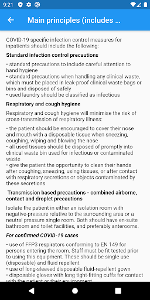

# LTH Guidelines
App version ``1.1.0``

Analyzed with [covid-apps-observer](http://github.com/covid-apps-observer) project, version ``0.1``

## App overview
| | |
|-------------------------|-------------------------| 
| **Name**&nbsp;&nbsp;&nbsp;&nbsp;&nbsp;&nbsp;&nbsp;&nbsp;&nbsp;&nbsp;&nbsp;&nbsp;&nbsp;&nbsp;&nbsp;&nbsp;&nbsp;&nbsp;&nbsp;&nbsp;&nbsp;&nbsp;&nbsp;&nbsp;&nbsp;&nbsp;&nbsp;&nbsp;&nbsp;&nbsp;&nbsp;&nbsp;&nbsp;&nbsp;&nbsp;&nbsp;&nbsp;&nbsp;&nbsp;&nbsp;  | LTH Guidelines |
| **Unique identifier** | com.nhs.lth.guidelines |
| **Link to Google Play** | [https://play.google.com/store/apps/details?id=com.nhs.lth.guidelines](https://play.google.com/store/apps/details?id=com.nhs.lth.guidelines) |
| **Summary**  | Hospital guidelines for health care professionals. |
| **Privacy policy** | [-](-) |
| **Latest version** | 1.1.0 |
| **Last update** | 2020-03-15 19:51:54 |
| **Recent changes** | Links can be opened from description page |
| **Installs**  | 500+ |
| **Category** | Medical |
| **First release** | Mar 13, 2020 |
| **Size**  | 7.0M |
| **Supported Android version**  | 4.1 and up |

### Description
> This app provides hospital guidelines for healthcare professions. This app replicates guidelines published elsewhere, such as on www.gov.uk by Public Health England and provides guidance on current practice allowing safe and effective assessment, placement, testing and management of patients. Guidelines are regularly reviewed in line with updates from Public Health England and other sources.

### User interface
The developers of the app provide the following screenshots in the Google play store.
| | | |
|:-------------------------:|:-------------------------:|:-------------------------:|
 |   |   |   | 

## Development team
In the following we report the main information provided by the development team in the Google play store.

| | |
|-------------------------|-------------------------|
| **Developer**  | Lancashire Teaching Hospitals NHS Foundation Trust |
| **Website**  | [https://www.lancsteachinghospitals.nhs.uk/](https://www.lancsteachinghospitals.nhs.uk/) |
| **Email** | webmaster@lthtr.nhs.uk |
| **Physical address**  | [Lancashire Teaching Hospitals Royal Preston Hospital Sharoe Green Lane Fulwood Preston PR2 2JU](https://www.google.com/maps/search/Lancashire%20Teaching%20Hospitals%20Royal%20Preston%20Hospital%20Sharoe%20Green%20Lane%20Fulwood%20Preston%20PR2%202JU) (Google Maps) |
| **Other developed apps**  | [https://play.google.com/store/apps/developer?id=Lancashire+Teaching+Hospitals+NHS+Foundation+Trust](https://play.google.com/store/apps/developer?id=Lancashire+Teaching+Hospitals+NHS+Foundation+Trust) |

## Android support

| | |
|-------------------------|-------------------------|
| **Declared target Android version**  | Pie, version 9 (API level 28) |
| **Effective target Android version**  | Pie, version 9 (API level 28) |
| **Minimum supported Android version**  | Jelly Bean, version 4.1.x (API level 16) |
| **Maximum target Android version**  | - |

The larger the difference between the minimum and maximum supported Android versions, the better. A larger difference means a wider audience. For example, old phones have a very low Android version, so a high minimum supported Android version means that the app cannot be used by users with old phones, thus leading to accessibility problems. 

## Requested permissions

In the following we report the complete list of the permissions requested by the app. 

| **Permission** | **Protection level** | **Description** | 
|-------------------------|-------------------------|-------------------------|
 **android.permission ACCESS_NETWORK_STATE** | Normal | Allows applications to access information about networks. 
 **android.permission ACCESS_WIFI_STATE** | Normal | Allows applications to access information about Wi-Fi networks. 
 **android.permission INTERNET** | Normal | Allows applications to open network sockets. 
 **android.permission WAKE_LOCK** | Normal | Allows using PowerManager WakeLocks to keep processor from sleeping or screen from dimming. 
 **com.google.android.c2dm.permission RECEIVE** | - | - 
 **com.google.android.finsky.permission BIND_GET_INSTALL_REFERRER_SERVICE** | - | - 

## Mentioned servers

| **Server** | **Registrant** | **Registrant country** | **Creation date** | 
|-------------------------|-------------------------|-------------------------|-------------------------|
 | googlesyndication.com | Google LLC | :us: US | 2003-01-21 06:17:24 |
 | google.com | Google LLC | :us: US | 1997-09-15 04:00:00 |
 | app-measurement.com | Google LLC | :us: US | 2015-06-19 20:13:31 |
 | googleadservices.com | Google LLC | :us: US | 2003-06-19 16:34:53 |

## Security analysis 

Below we report the main security warnings raised by our execution of the [Androwarn](https://github.com/maaaaz/androwarn) security analysis tool.

**Connection interfaces exfiltration**
> - This application reads details about the currently active data network 

**Pim data leakage**
> - This application accesses data stored in the clipboard 

**Code execution**
> - This application loads a native library: 'flutter' 

## User ratings and reviews

Below we provide information about how end users are reacting to the app in terms of ratings and reviews in the Google Play store.

### Ratings

The LTH Guidelines app has been installed by more than **500** times. At this time, **-** rated the app and its average score is **0.0**. Below we show the distribution of the ratings across the usual star-based rating of Google Play

:star::star::star::star::star:: 0

:star::star::star::star:: 0

:star::star::star:: 0

:star::star:: 0

:star:: 0

### Reviews 

#### 5-star reviews

No recent reviews available with 5 stars.

#### 4-star reviews

No recent reviews available with 4 stars.

#### 3-star reviews

No recent reviews available with 3 stars.

#### 2-star reviews

No recent reviews available with 2 stars.

#### 1-star reviews

No recent reviews available with 1 stars.
