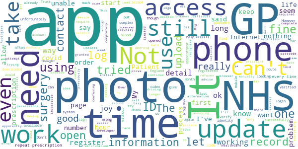
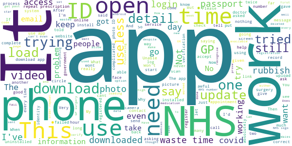

# NHS App
App version ``1.41.3``

Analyzed with [covid-apps-observer](http://github.com/covid-apps-observer) project, version ``0.1``

## App overview
| | |
|-------------------------|-------------------------| 
| **Name**&nbsp;&nbsp;&nbsp;&nbsp;&nbsp;&nbsp;&nbsp;&nbsp;&nbsp;&nbsp;&nbsp;&nbsp;&nbsp;&nbsp;&nbsp;&nbsp;&nbsp;&nbsp;&nbsp;&nbsp;&nbsp;&nbsp;&nbsp;&nbsp;&nbsp;&nbsp;&nbsp;&nbsp;&nbsp;&nbsp;&nbsp;&nbsp;&nbsp;&nbsp;&nbsp;&nbsp;&nbsp;&nbsp;&nbsp;&nbsp;  | NHS App |
| **Unique identifier** | com.nhs.online.nhsonline |
| **Link to Google Play** | [https://play.google.com/store/apps/details?id=com.nhs.online.nhsonline](https://play.google.com/store/apps/details?id=com.nhs.online.nhsonline) |
| **Summary**  | Access NHS services in England |
| **Privacy policy** | [https://www.nhs.uk/using-the-nhs/nhs-services/the-nhs-app/privacy/](https://www.nhs.uk/using-the-nhs/nhs-services/the-nhs-app/privacy/) |
| **Latest version** | 1.41.3 |
| **Last update** | 2020-11-16 08:40:22 |
| **Recent changes** | Improvements:  • We have added more information about what to do next when you order a repeat prescription • We have fixed some accessibility issues • You can now view the app in landscape mode • We have renamed &quot;Health record&quot; to &quot;Your health&quot; • Bug fixes, and various performance, stability and accessibility enhancements |
| **Installs**  | 1,000,000+ |
| **Category** | Medical |
| **First release** | Dec 31, 2018 |
| **Size**  | 58M |
| **Supported Android version**  | 5.0 and up |

### Description
> <b>This is not the NHS COVID-19 app. To download the NHS COVID-19 contact tracing app, go to covid19.nhs.uk</b>
 Owned and run by the NHS, the NHS App is a simple and secure way to access a range of NHS services on your smartphone or tablet.
 To use the NHS App you must be aged 13 and over and registered with a GP surgery in England.
 You can also access NHS App services from the browser on your desktop or laptop computer. Go to www.nhs.uk/app
 Use the NHS App to:
 •	get advice about coronavirus
 •	order your repeat prescriptions
 •	book and manage appointments at your GP surgery
 •	get health information and advice
 •	view your health record securely
 •	register your organ donation decision
 •	find out how the NHS uses your data
 If your GP surgery or hospital offers other services in the NHS App, you may be able to:
 •	message your GP surgery, doctor or health professional online
 •	consult a GP or health professional through an online form and get a reply
 •	access health services on behalf of someone you care for
 •	view your hospital and other healthcare appointments
 •	view useful links your doctor or health professional has shared with you
 •	view and manage your care plans
 Get advice about coronavirus 
 ---------------------------------------
 Get information about coronavirus and find out what to do if you think you have it.
 Order repeat prescriptions 
 -----------------------------------
 See your available medicines, request a new repeat prescription and choose a pharmacy for your prescriptions to be sent to.
 Book appointments
 --------------------------
 Search for, book and cancel appointments at your GP surgery. See details of your upcoming and past appointments.
 Get health advice
 -----------------------------
 Search trusted NHS information and advice on hundreds of conditions and treatments. You can also answer questions to get instant advice or medical help near you. 
 View your health record
 ----------------------------------
 Securely access your GP health record, to see information like your allergies and your current and past medicines. If your GP surgery has given you access to your detailed medical record, you can also see information like test results and details of your consultations. 
 Register your organ donation decision
 --------------------------------------------------
 Choose to donate some or all of your organs and check your registered decision.
 Find out how the NHS uses your data
 -------------------------------------------------
 Choose if data from your health records is shared for research and planning.
 Keeping your data secure
 ---------------------------------
 After you download the app, you will need to set up an NHS login and prove who you are. The app then securely connects to information from your GP surgery. 
 If your Android device supports fingerprint detection, you can use it to log in to the NHS App each time, instead of using a password and security code.

### User interface
The developers of the app provide the following screenshots in the Google play store.
| | | |
|:-------------------------:|:-------------------------:|:-------------------------:|
 |   |   |   | 
 |   |   |   | 
 |   |   |   | 
 |   |   |   | 
 |   |   |   | 
 |   |   |   | 

## Development team
In the following we report the main information provided by the development team in the Google play store.

| | |
|-------------------------|-------------------------|
| **Developer**  | NHS Digital |
| **Website**  | [https://www.nhs.uk/using-the-nhs/nhs-services/the-nhs-app/help/](https://www.nhs.uk/using-the-nhs/nhs-services/the-nhs-app/help/) |
| **Email** | nhsapp@nhs.net |
| **Physical address**  | - |
| **Other developed apps**  | [https://play.google.com/store/apps/developer?id=NHS+Digital](https://play.google.com/store/apps/developer?id=NHS+Digital) |

## Android support

| | |
|-------------------------|-------------------------|
| **Declared target Android version**  | Android10, version 10 (API level 29) |
| **Effective target Android version**  | Android10, version 10 (API level 29) |
| **Minimum supported Android version**  | Lollipop, version 5.0 (API level 21) |
| **Maximum target Android version**  | - |

The larger the difference between the minimum and maximum supported Android versions, the better. A larger difference means a wider audience. For example, old phones have a very low Android version, so a high minimum supported Android version means that the app cannot be used by users with old phones, thus leading to accessibility problems. 

## Requested permissions

In the following we report the complete list of the permissions requested by the app. 

| **Permission** | **Protection level** | **Description** | 
|-------------------------|-------------------------|-------------------------|
 **android.permission ACCESS_FINE_LOCATION** | :warning:**Dangerous** | Allows an app to access precise location. 
 **android.permission ACCESS_NETWORK_STATE** | Normal | Allows applications to access information about networks. 
 **android.permission CAMERA** | :warning:**Dangerous** | Required to be able to access the camera device. 
 **android.permission INTERNET** | Normal | Allows applications to open network sockets. 
 **android.permission MODIFY_AUDIO_SETTINGS** | Normal | Allows an application to modify global audio settings. 
 **android.permission NFC** | Normal | Allows applications to perform I/O operations over NFC. 
 **android.permission READ_EXTERNAL_STORAGE** | :warning:**Dangerous** | Allows an application to read from external storage. 
 **android.permission READ_PHONE_STATE** | :warning:**Dangerous** | Allows read only access to phone state, including the phone number of the device, current cellular network information, the status of any ongoing calls, and a list of any PhoneAccounts registered on the device. 
 **android.permission RECORD_AUDIO** | :warning:**Dangerous** | Allows an application to record audio. 
 **android.permission USE_FINGERPRINT** | Normal | This constant was deprecated in API level 28. Applications should request USE_BIOMETRIC instead 
 **android.permission WAKE_LOCK** | Normal | Allows using PowerManager WakeLocks to keep processor from sleeping or screen from dimming. 
 **android.permission WRITE_EXTERNAL_STORAGE** | :warning:**Dangerous** | Allows an application to write to external storage. 
 **com.google.android.c2dm.permission RECEIVE** | - | - 
 **com.google.android.finsky.permission BIND_GET_INSTALL_REFERRER_SERVICE** | - | - 
 **org.fidoalliance.uaf.permissions FIDO_CLIENT** | - | - 

## Mentioned servers

| **Server** | **Registrant** | **Registrant country** | **Creation date** | 
|-------------------------|-------------------------|-------------------------|-------------------------|
 | googlesyndication.com | Google LLC | :us: US | 2003-01-21 06:17:24 |
 | google.com | Google LLC | :us: US | 1997-09-15 04:00:00 |
 | app-measurement.com | Google LLC | :us: US | 2015-06-19 20:13:31 |

## Security analysis 

Below we report the main security warnings raised by our execution of the [Androwarn](https://github.com/maaaaz/androwarn) security analysis tool.

**Connection interfaces exfiltration**
> - This application reads details about the currently active data network 

**Telephony services abuse**
> - This application makes phone calls 

**Suspicious connection establishment**
> - This application opens a Socket and connects it to the remote address '; port is out of range' on the 'N/A' port  
> - This application opens a Socket and connects it to the remote address 'Lc/b/a/a/a;->w(Ljava/lang/String;)Ljava/lang/StringBuilder;' on the 'N/A' port  
> - This application opens a Socket and connects it to the remote address 'Ljava/net/Proxy;->type()Ljava/net/Proxy$Type;' on the 'N/A' port  
> - This application opens a Socket and connects it to the remote address 'timeout' on the 'N/A' port  

**Code execution**
> - This application loads a native library: 'DocumentCropper' 
> - This application loads a native library: 'Integrity' 
> - This application loads a native library: 'Liveness' 
> - This application loads a native library: 'Ocr' 
> - This application loads a native library: 'Preflight' 
> - This application loads a native library: 'Quality' 
> - This application loads a native library: 'gnustl_shared' 
> - This application loads a native library: 'lept' 
> - This application loads a native library: 'opencv_java3' 
> - This application loads a native library: 'tensorflow_inference' 
> - This application loads a native library: 'tensorflow_jni' 
> - This application loads a native library: 'tess' 

## User ratings and reviews

Below we provide information about how end users are reacting to the app in terms of ratings and reviews in the Google Play store.

### Ratings

The NHS App app has been installed by more than **1000000** times. At this time, **5323** rated the app and its average score is **3.2267659**. Below we show the distribution of the ratings across the usual star-based rating of Google Play

:star::star::star::star::star:: 2296

:star::star::star::star:: 593

:star::star::star:: 287

:star::star:: 316

:star:: 1831

### Reviews 

#### 5-star reviews

> Great APP which any idiot can use me included plus it also saves a lot of time either visiting or phoning Doctors especially when your really busy....5 STARS⭐⭐⭐⭐⭐  :date: __2020-11-21 15:55:48__

> I have had no problems as yet with the and hoping not to either I love the app I can order my meds I can send messages to my chemist make appointments so so good get my history on the urgent dont need for gp to write anything it is all there  :date: __2020-11-20 03:24:04__

> Just so easy to re-order my medicine. The Best app ! I registered while in Spain with a poor Internet connection - I followed the instructions. Just took a little patience.  :date: __2020-11-19 14:45:12__

> Thanks for the prompt advice. My mishtake. Works well 👍  :date: __2020-11-19 13:01:23__

> Good1  :date: __2020-11-18 15:25:36__

> Had no problems...easy registered....It would be great within the app...if your chosen pharmacy, could let you know when your items are ready to pick up. The pharmacy we go to have released their app, similar to Patient Access, with the difference being...the new app lets you know when meds are ready....would be perfect if it was all under one umbrella, without the need to download so many apps 😊  :date: __2020-11-18 14:54:15__

> Much easier than doctors web site  :date: __2020-11-17 20:42:14__

> Very good useful app.  :date: __2020-11-17 19:23:26__

> A really good app - once you've got through the initial setup and proved identity etc, just uses the fingerprint scanner on the phone to log in, and you can order your repeate prescription, look back at your medical notes etc. The functionality is there to book appointments but my GP surgery seems to have turned that off (but that's not the fault of the app).  :date: __2020-11-17 17:42:11__

> Excellent!!  :date: __2020-11-17 12:40:59__

#### 4-star reviews

> Was hoping that this app would be useful (I've not given up and hope that I receive a response to this review). I have installed the app, entered my details, confirmed my email address and entered the code following that. I then come to the page asking me to accept the conditions of use but the page (apart from the heading) is blank and I cannot get any further than that. I tried going back to the previous page but the app closed. I successfully logged in to the app again but stuck same spot.  :date: __2020-11-21 03:04:58__

> Great app for ordering repeat prescriptions, not tried to book appointment as yet.  :date: __2020-11-20 18:38:40__

> Easy to use, shame the historic medical history has to be answered every time you need to contact your GP  :date: __2020-11-20 09:28:33__

> Second time lucky, first time I installed the app, I got the unresponsive white screen others are reporting. So I uninstalled it and reinstalled the app and all seems fine now, the proving of my identity worked fine too.  :date: __2020-11-18 22:19:44__

> I didn't seem to have the same difficulty putting in my I d and personal details as everyone else seems to have. Using app I can see my prescription and my allergy, cannot book an appointment due to Co vid. Was hoping to view test results, but still waiting for gp surgery 4 weeks on. Helpful for ordering repeat prescription.  :date: __2020-11-18 11:24:54__

> Access your medical records and order repeat prescription.  :date: __2020-11-18 10:40:19__

> Easy to oparate.  :date: __2020-11-17 23:45:48__

> I've received an alert to say I have to self isolate as I have been in close contact with someone, but I haven't, last week I went to the doctors (who I called and are okay), a fish & chip shop to collect food, I wear gloves and touch nothing, & I popped into the co-op, in all cases I was not close to anyone, why have I been sent the message ?? Edit.... thank you for your note, sorry, I will contact the website you have suggested 😊  :date: __2020-11-17 22:06:03__

> App works absolutely fine for me. Uploaded all information using android phone. Requires NHS checks / approval based on id submission which is understandable given the personal data you'll be able to view. Having 10 digit NHS number to hand probably helps with ease of registration. With the app itself I like what I see.  :date: __2020-11-14 10:05:36__

> 2nd Update.. No issues installing the app and verifying my details. Able to order repeat prescriptions without issue. Unable to book/view/manage appointments which the NHS help desk advise me is due to my surgery disabling the function and not the app. In summary, everything working as it should it seems. Any problems reported are looked into and answered within a couple of days. Happy so far, will be happier when I'm able to book and view appointments. Thanks NHS for your efforts.  :date: __2020-11-03 11:31:17__

#### 3-star reviews

> NHS admin efficiency  :date: __2020-11-20 21:34:44__

> Just ran an update. When I try to "Continue with NHS login", I just get a blank white page that goes nowhere. Updated review. Completely uninstalled app and reinstalled. This worked. Can login again. Upgraded the rating a couple of stars but can't give it more as it didn't work straight after the upgrade. I had used the app to describe symptoms and got a doctor call back within 36 hours from my local surgery. Was easy to use and resulted in a prescription that I could collect within hours.  :date: __2020-11-16 21:42:18__

> Could not book Doctors appointment on app  :date: __2020-11-15 20:07:19__

> Confusing and unhelpful  :date: __2020-11-14 10:41:01__

> Good  :date: __2020-11-05 14:40:37__

> Not a bad app.  :date: __2020-11-02 19:50:50__

> Appears to work  :date: __2020-10-30 17:43:00__

> Good app but missing a notification centre  :date: __2020-10-29 21:36:45__

> Removed it. Doesn't do anything. Live ruraly and work in a huge office and business park with nobody around. Everyone is Covid kosher following best practice. Had Covid in Jan. This app is several months too late.  :date: __2020-10-27 22:27:47__

> Not sure about this app as could not get in touch with my doctor even though they told me to get this app but will give it another try  :date: __2020-10-26 17:09:05__

#### 2-star reviews

> Unhappy being forced to accept cookies, even if you choose not to have certain cookies the app will not allow you to continue without agreeing to accept all of them  :date: __2020-11-20 12:13:49__

> Can't open app  :date: __2020-11-18 17:25:17__

> Latest update will not update. Any guidance on how to make it update would be most welcome. N.B. opened the app and found it was still working, therefore that is not the problem.  :date: __2020-11-18 13:39:21__

> Over sensenitive. Alerted me 3 hours before self isolation was due to be over. Status had apparently really?! No not yet. Has now though finally.  :date: __2020-11-18 08:36:18__

> Easy enough to put on your phone. Big problem I have for the last 2hrs had Internet connection error 😠  :date: __2020-11-16 19:01:39__

> My initial review of this was far from flattering. Would NOT allow me to register using passport and video upload. Seems to be a common problem judging by other comments. Avoid this by using the alternative route and get your GP surgery to provide passcodes etc. Having finaly managed to register using these data, the App seems fine but it was a very stressful experience.  :date: __2020-11-16 13:26:32__

> I been for day so how can I have been around some one who got it not very good at all  :date: __2020-11-11 15:12:07__

> Can't register without a mobile phone. Developer needs to be more objective. Not everyone can afford or want a mobile device  :date: __2020-11-09 09:29:19__

> App needs constant updates and often crashes.  :date: __2020-11-06 15:52:28__

> Can down but not open the app  :date: __2020-11-04 18:05:59__

#### 1-star reviews

> When you try to enter the app just buffers and buffers. Have tried to load many times. Same problem  :date: __2020-11-22 03:30:34__

> Unable to log in. Choose camcorder??  :date: __2020-11-21 23:03:16__

> This app asks for excessive personal information including photo I'd. Yet still wants more before you can use the simple functions. Don't bother with it!  :date: __2020-11-21 16:55:27__

> in accurate and mis reports  :date: __2020-11-20 18:53:28__

> Why is everything with the NHS so bad? Huawei Mate 20 Pro - doesn't trigger the camera to verify my identity, so the app is completely useless. Do some basic testing!  :date: __2020-11-20 17:58:13__

> App will not let me order prescription or view appointments total waste of time. Was told to uninstall and redo. Still the same.  :date: __2020-11-20 11:59:37__

> It's NHS, enough said really. Absolutely terrible app don't waste you time with this garbage.  :date: __2020-11-19 18:30:12__

> Doesn't work. Tried on my wife's phone, got as far as trying to type in the 6 digit security code, typing doesn't work, just blank. Tried on my phone, 6 digit security code not received despite several tries.  :date: __2020-11-19 15:51:21__

> Tried 20+ videos saying 4 numbers, same result "there is a problem with your video" No advice on what the problem is or how to rectify Lost the will and gave up  :date: __2020-11-19 13:29:43__

> Poor. I have been trying to log into this site for a while. Sadly no joy. I giving up.  :date: __2020-11-19 13:22:27__

