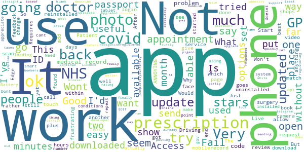

# NHS App
App version ``1.41.3``

Analyzed with [covid-apps-observer](http://github.com/covid-apps-observer) project, version ``0.1``

## App overview
| | |
|-------------------------|-------------------------| 
| **Name**&nbsp;&nbsp;&nbsp;&nbsp;&nbsp;&nbsp;&nbsp;&nbsp;&nbsp;&nbsp;&nbsp;&nbsp;&nbsp;&nbsp;&nbsp;&nbsp;&nbsp;&nbsp;&nbsp;&nbsp;&nbsp;&nbsp;&nbsp;&nbsp;&nbsp;&nbsp;&nbsp;&nbsp;&nbsp;&nbsp;&nbsp;&nbsp;&nbsp;&nbsp;&nbsp;&nbsp;&nbsp;&nbsp;&nbsp;&nbsp;  | NHS App |
| **Unique identifier** | com.nhs.online.nhsonline |
| **Link to Google Play** | [https://play.google.com/store/apps/details?id=com.nhs.online.nhsonline](https://play.google.com/store/apps/details?id=com.nhs.online.nhsonline) |
| **Summary**  | Access NHS services in England |
| **Privacy policy** | [https://www.nhs.uk/using-the-nhs/nhs-services/the-nhs-app/privacy/](https://www.nhs.uk/using-the-nhs/nhs-services/the-nhs-app/privacy/) |
| **Latest version** | 1.41.3 |
| **Last update** | 2020-11-16 08:40:22 |
| **Recent changes** | Improvements:  • We have added more information about what to do next when you order a repeat prescription • We have fixed some accessibility issues • You can now view the app in landscape mode • We have renamed &quot;Health record&quot; to &quot;Your health&quot; • Bug fixes, and various performance, stability and accessibility enhancements |
| **Installs**  | 1,000,000+ |
| **Category** | Medical |
| **First release** | Dec 31, 2018 |
| **Size**  | 58M |
| **Supported Android version**  | 5.0 and up |

### Description
> <b>This is not the NHS COVID-19 app. To download the NHS COVID-19 contact tracing app, go to covid19.nhs.uk</b>
 Owned and run by the NHS, the NHS App is a simple and secure way to access a range of NHS services on your smartphone or tablet.
 To use the NHS App you must be aged 13 and over and registered with a GP surgery in England.
 You can also access NHS App services from the browser on your desktop or laptop computer. Go to www.nhs.uk/app
 Use the NHS App to:
 •	get advice about coronavirus
 •	order your repeat prescriptions
 •	book and manage appointments at your GP surgery
 •	get health information and advice
 •	view your health record securely
 •	register your organ donation decision
 •	find out how the NHS uses your data
 If your GP surgery or hospital offers other services in the NHS App, you may be able to:
 •	message your GP surgery, doctor or health professional online
 •	consult a GP or health professional through an online form and get a reply
 •	access health services on behalf of someone you care for
 •	view your hospital and other healthcare appointments
 •	view useful links your doctor or health professional has shared with you
 •	view and manage your care plans
 Get advice about coronavirus 
 ---------------------------------------
 Get information about coronavirus and find out what to do if you think you have it.
 Order repeat prescriptions 
 -----------------------------------
 See your available medicines, request a new repeat prescription and choose a pharmacy for your prescriptions to be sent to.
 Book appointments
 --------------------------
 Search for, book and cancel appointments at your GP surgery. See details of your upcoming and past appointments.
 Get health advice
 -----------------------------
 Search trusted NHS information and advice on hundreds of conditions and treatments. You can also answer questions to get instant advice or medical help near you. 
 View your health record
 ----------------------------------
 Securely access your GP health record, to see information like your allergies and your current and past medicines. If your GP surgery has given you access to your detailed medical record, you can also see information like test results and details of your consultations. 
 Register your organ donation decision
 --------------------------------------------------
 Choose to donate some or all of your organs and check your registered decision.
 Find out how the NHS uses your data
 -------------------------------------------------
 Choose if data from your health records is shared for research and planning.
 Keeping your data secure
 ---------------------------------
 After you download the app, you will need to set up an NHS login and prove who you are. The app then securely connects to information from your GP surgery. 
 If your Android device supports fingerprint detection, you can use it to log in to the NHS App each time, instead of using a password and security code.

### User interface
The developers of the app provide the following screenshots in the Google play store.
| | | |
|:-------------------------:|:-------------------------:|:-------------------------:|
 |   |   |   | 
 |   |   |   | 
 |   |   |   | 
 |   |   |   | 
 |   |   |   | 
 |   |   |   | 

## Development team
In the following we report the main information provided by the development team in the Google play store.

| | |
|-------------------------|-------------------------|
| **Developer**  | NHS Digital |
| **Website**  | [https://www.nhs.uk/using-the-nhs/nhs-services/the-nhs-app/help/](https://www.nhs.uk/using-the-nhs/nhs-services/the-nhs-app/help/) |
| **Email** | nhsapp@nhs.net |
| **Physical address**  | - |
| **Other developed apps**  | [https://play.google.com/store/apps/developer?id=NHS+Digital](https://play.google.com/store/apps/developer?id=NHS+Digital) |

## Android support

| | |
|-------------------------|-------------------------|
| **Declared target Android version**  | Android10, version 10 (API level 29) |
| **Effective target Android version**  | Android10, version 10 (API level 29) |
| **Minimum supported Android version**  | Lollipop, version 5.0 (API level 21) |
| **Maximum target Android version**  | - |

The larger the difference between the minimum and maximum supported Android versions, the better. A larger difference means a wider audience. For example, old phones have a very low Android version, so a high minimum supported Android version means that the app cannot be used by users with old phones, thus leading to accessibility problems. 

## Requested permissions

In the following we report the complete list of the permissions requested by the app. 

| **Permission** | **Protection level** | **Description** | 
|-------------------------|-------------------------|-------------------------|
 **android.permission ACCESS_FINE_LOCATION** | :warning:**Dangerous** | Allows an app to access precise location. 
 **android.permission ACCESS_NETWORK_STATE** | Normal | Allows applications to access information about networks. 
 **android.permission CAMERA** | :warning:**Dangerous** | Required to be able to access the camera device. 
 **android.permission INTERNET** | Normal | Allows applications to open network sockets. 
 **android.permission MODIFY_AUDIO_SETTINGS** | Normal | Allows an application to modify global audio settings. 
 **android.permission NFC** | Normal | Allows applications to perform I/O operations over NFC. 
 **android.permission READ_EXTERNAL_STORAGE** | :warning:**Dangerous** | Allows an application to read from external storage. 
 **android.permission READ_PHONE_STATE** | :warning:**Dangerous** | Allows read only access to phone state, including the phone number of the device, current cellular network information, the status of any ongoing calls, and a list of any PhoneAccounts registered on the device. 
 **android.permission RECORD_AUDIO** | :warning:**Dangerous** | Allows an application to record audio. 
 **android.permission USE_FINGERPRINT** | Normal | This constant was deprecated in API level 28. Applications should request USE_BIOMETRIC instead 
 **android.permission WAKE_LOCK** | Normal | Allows using PowerManager WakeLocks to keep processor from sleeping or screen from dimming. 
 **android.permission WRITE_EXTERNAL_STORAGE** | :warning:**Dangerous** | Allows an application to write to external storage. 
 **com.google.android.c2dm.permission RECEIVE** | - | - 
 **com.google.android.finsky.permission BIND_GET_INSTALL_REFERRER_SERVICE** | - | - 
 **org.fidoalliance.uaf.permissions FIDO_CLIENT** | - | - 

## Mentioned servers

| **Server** | **Registrant** | **Registrant country** | **Creation date** | 
|-------------------------|-------------------------|-------------------------|-------------------------|
 | googlesyndication.com | Google LLC | :us: US | 2003-01-21 06:17:24 |
 | google.com | Google LLC | :us: US | 1997-09-15 04:00:00 |
 | app-measurement.com | Google LLC | :us: US | 2015-06-19 20:13:31 |

## Security analysis 

Below we report the main security warnings raised by our execution of the [Androwarn](https://github.com/maaaaz/androwarn) security analysis tool.

**Connection interfaces exfiltration**
> - This application reads details about the currently active data network 

**Telephony services abuse**
> - This application makes phone calls 

**Suspicious connection establishment**
> - This application opens a Socket and connects it to the remote address '; port is out of range' on the 'N/A' port  
> - This application opens a Socket and connects it to the remote address 'Lc/b/a/a/a;->w(Ljava/lang/String;)Ljava/lang/StringBuilder;' on the 'N/A' port  
> - This application opens a Socket and connects it to the remote address 'Ljava/net/Proxy;->type()Ljava/net/Proxy$Type;' on the 'N/A' port  
> - This application opens a Socket and connects it to the remote address 'timeout' on the 'N/A' port  

**Code execution**
> - This application loads a native library: 'DocumentCropper' 
> - This application loads a native library: 'Integrity' 
> - This application loads a native library: 'Liveness' 
> - This application loads a native library: 'Ocr' 
> - This application loads a native library: 'Preflight' 
> - This application loads a native library: 'Quality' 
> - This application loads a native library: 'gnustl_shared' 
> - This application loads a native library: 'lept' 
> - This application loads a native library: 'opencv_java3' 
> - This application loads a native library: 'tensorflow_inference' 
> - This application loads a native library: 'tensorflow_jni' 
> - This application loads a native library: 'tess' 

## User ratings and reviews

Below we provide information about how end users are reacting to the app in terms of ratings and reviews in the Google Play store.

### Ratings

The NHS App app has been installed by more than **1000000** times. At this time, **5323** rated the app and its average score is **3.2267659**. Below we show the distribution of the ratings across the usual star-based rating of Google Play

:star::star::star::star::star:: 2296

:star::star::star::star:: 593

:star::star::star:: 287

:star::star:: 316

:star:: 1831

### Reviews 

#### 5-star reviews

> Quick and easy to use. Access the app anytime of the day. Great for ordering repeat prescriptions.  :date: __2020-12-05 12:02:06__

> Works well  :date: __2020-12-05 09:29:25__

> Very good to see your conditions  :date: __2020-12-04 23:11:31__

> Cant fault it. Helps when needing time of can show work appointments on here .  :date: __2020-12-04 14:18:38__

> Fast and efficient  :date: __2020-12-04 10:50:15__

> Very useful app to communicate with your GP  :date: __2020-12-04 01:29:53__

> Was very easy to do  :date: __2020-12-03 19:54:39__

> Wow just got this working after 2 months of trying 👍  :date: __2020-12-02 23:02:37__

> Very good all you need to know and bettar than reciptionest whom don't care and dosen't kmow your problem also saveing your time❤👍  :date: __2020-12-02 14:45:23__

> Shows error ref ID 7007.This is NOT Anywhere on the site ! Meant to show NILSTARS🤔  :date: __2020-12-01 16:26:44__

#### 4-star reviews

> So far, this app had proved reliable. As long as you have the correct registration details to hand, it's straight forward to set up and I have successfully requested and received a repeat prescription. Future reliability yet to be decided.  :date: __2020-12-04 17:04:27__

> Easy to use  :date: __2020-12-02 04:57:07__

> Couldn't find anyway to select a notification sound of my choice. Needs the ability to select a different notification sound other than the default. With so many notifications from social media, texts, emails etc, it needs a differentiating notification. Many of my other apps make use of the built in ring tones and sounds. There is no reason why this app shouldn't do the same.  :date: __2020-12-01 23:39:41__

> Issue with accepting conditions of use now resolved. Now able to access the app with no problem 🙂👍  :date: __2020-11-23 13:49:56__

> Great app for ordering repeat prescriptions, not tried to book appointment as yet.  :date: __2020-11-20 18:38:40__

> Easy to use, shame the historic medical history has to be answered every time you need to contact your GP  :date: __2020-11-20 09:28:33__

> Second time lucky, first time I installed the app, I got the unresponsive white screen others are reporting. So I uninstalled it and reinstalled the app and all seems fine now, the proving of my identity worked fine too.  :date: __2020-11-18 22:19:44__

> I didn't seem to have the same difficulty putting in my I d and personal details as everyone else seems to have. Using app I can see my prescription and my allergy, cannot book an appointment due to Co vid. Was hoping to view test results, but still waiting for gp surgery 4 weeks on. Helpful for ordering repeat prescription.  :date: __2020-11-18 11:24:54__

> Access your medical records and order repeat prescription.  :date: __2020-11-18 10:40:19__

> Easy to oparate.  :date: __2020-11-17 23:45:48__

#### 3-star reviews

> Easeof navigation and records  :date: __2020-12-04 23:38:44__

> Rubbish Won't let me prove my identity. Uploaded photos of Driving Licence and Passport. But doesn't like my video of the four numbers. Won't work with Microsoft Edge plus camera nor from my mobile phone. I already have the covid app and I try and support the NHS as best I can. But surely my taxes pay for better than this?? :( EDIT finally registered usin an old browser. At least developer responded quickly. 😀  :date: __2020-11-30 12:05:58__

> I can only partly review the app because my surgery are not currently registering people for their online service so I can't really use the app. Very frustrating as the other options are driving to my doctors and posting a request or sending in a request by post. Which with covid being a thing seems absolutely bonkers. I may as well send a telegram or carrier pigeon.  :date: __2020-11-25 11:28:05__

> Just ran an update. When I try to "Continue with NHS login", I just get a blank white page that goes nowhere. Updated review. Completely uninstalled app and reinstalled. This worked. Can login again. Upgraded the rating a couple of stars but can't give it more as it didn't work straight after the upgrade. I had used the app to describe symptoms and got a doctor call back within 36 hours from my local surgery. Was easy to use and resulted in a prescription that I could collect within hours.  :date: __2020-11-16 21:42:18__

> Could not book Doctors appointment on app  :date: __2020-11-15 20:07:19__

> Confusing and unhelpful  :date: __2020-11-14 10:41:01__

> Good  :date: __2020-11-05 14:40:37__

> Not a bad app.  :date: __2020-11-02 19:50:50__

> Appears to work  :date: __2020-10-30 17:43:00__

> Good app but missing a notification centre  :date: __2020-10-29 21:36:45__

#### 2-star reviews

> Still can't organise a repeat prescription on this app really annoying 👎  :date: __2020-12-04 10:24:14__

> Basic software! temperamental - it crashes often, which is rather annoying. Reflects how bad the healthcare system is, unfortunately. We expect much, much more & we should be getting it!! The app is nothing special, no features to help patients be informed & take action regarding our own health. My advice is to avoid the app. Use ya Internet browser to access your records via systmonline (sign up required). "C'mon developers where's ya spunk? Whats soo hard? (not me...) Get with the program!"  :date: __2020-12-03 11:31:34__

> Cannot even get onto the app. I need to provide evidence that I am who I say am, and when I upload documents it just closes and logs me out.  :date: __2020-12-01 23:16:24__

> Not good. Won't let me order a repeat prescription as it says I have no medication available. I have 5 medications permanently on prescription!  :date: __2020-11-28 22:14:00__

> Really buggy, on trying to upload any evidance whether photo or from gallery, the app forgets what its doint and gos back to login page.  :date: __2020-11-25 08:46:10__

> Unhappy being forced to accept cookies, even if you choose not to have certain cookies the app will not allow you to continue without agreeing to accept all of them  :date: __2020-11-20 12:13:49__

> Can't open app  :date: __2020-11-18 17:25:17__

> Latest update will not update. Any guidance on how to make it update would be most welcome. N.B. opened the app and found it was still working, therefore that is not the problem.  :date: __2020-11-18 13:39:21__

> Over sensenitive. Alerted me 3 hours before self isolation was due to be over. Status had apparently really?! No not yet. Has now though finally.  :date: __2020-11-18 08:36:18__

> Easy enough to put on your phone. Big problem I have for the last 2hrs had Internet connection error 😠  :date: __2020-11-16 19:01:39__

#### 1-star reviews

> Would not download.  :date: __2020-12-05 16:29:52__

> Downloads fine but just buffers when I try to open it. Uninstalled and reinstalled 5 times over 2 weeks. No joy.  :date: __2020-12-04 18:03:32__

> Much like the rest of the NHS this app isn't there for me when I actually need something from it. When I upload a picture of my license to confirm my identity, it gets to 100% and then says there's a technical problem and to tey again where it will fail every attempt.  :date: __2020-12-04 17:45:13__

> Not only am I unable to login using the CORRECT details there is absolutely no way of even contacting support with a problem just an absolutely useless website with no help on it at all add a online support option for the love of God  :date: __2020-12-04 14:53:43__

> Absolute rubbish, I've now had two goes and failed each time saying I don't have an Internet connection when I know I have a perfect one. Won't try a third time.  :date: __2020-12-04 14:27:03__

> Have tried to log in won't except my password  :date: __2020-12-04 11:13:39__

> Every time i go to use it, i have to download another update or it wont work. The least convenient app  :date: __2020-12-04 00:10:11__

> Can't get app  :date: __2020-12-03 22:32:06__

> Have been trying 2 days to update this app to order my prescription but it won't go past pending  :date: __2020-12-03 15:52:28__

> Fails every single time..  :date: __2020-12-03 15:41:01__

