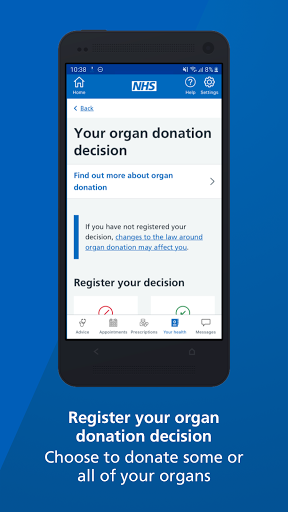
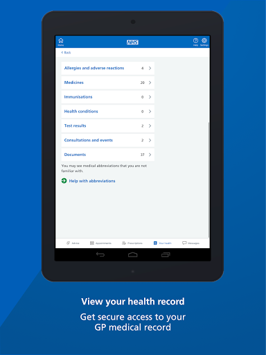
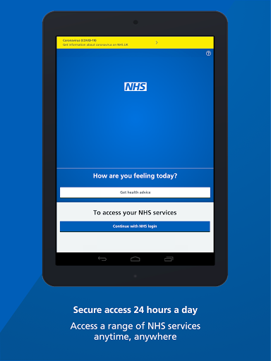
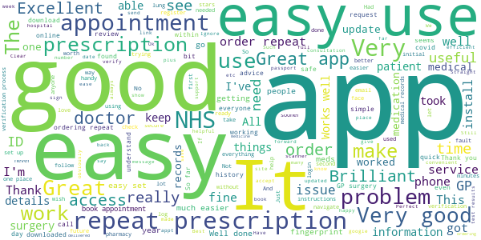
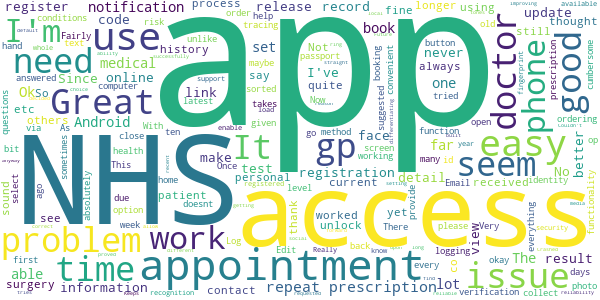
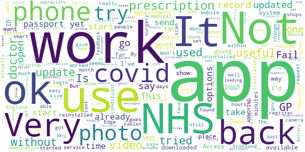
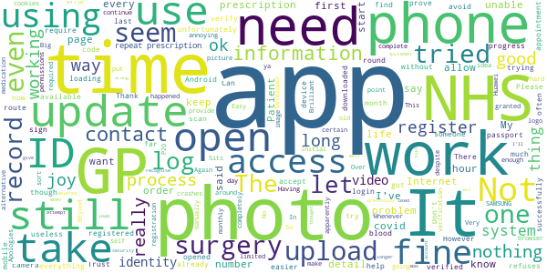
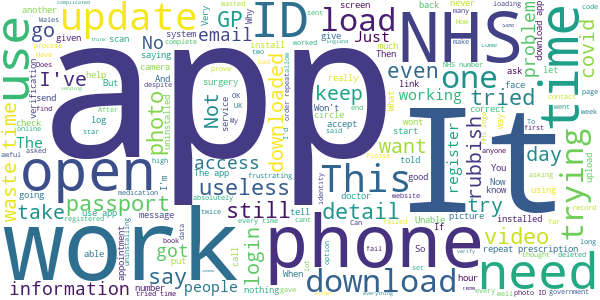

# NHS App
App version ``1.42.1``

Analyzed with [covid-apps-observer](http://github.com/covid-apps-observer) project, version ``0.1``

## App overview
| | |
|-------------------------|-------------------------| 
| **Name**&nbsp;&nbsp;&nbsp;&nbsp;&nbsp;&nbsp;&nbsp;&nbsp;&nbsp;&nbsp;&nbsp;&nbsp;&nbsp;&nbsp;&nbsp;&nbsp;&nbsp;&nbsp;&nbsp;&nbsp;&nbsp;&nbsp;&nbsp;&nbsp;&nbsp;&nbsp;&nbsp;&nbsp;&nbsp;&nbsp;&nbsp;&nbsp;&nbsp;&nbsp;&nbsp;&nbsp;&nbsp;&nbsp;&nbsp;&nbsp;  | NHS App |
| **Unique identifier** | com.nhs.online.nhsonline |
| **Link to Google Play** | [https://play.google.com/store/apps/details?id=com.nhs.online.nhsonline](https://play.google.com/store/apps/details?id=com.nhs.online.nhsonline) |
| **Summary**  | Access NHS services in England |
| **Privacy policy** | [https://www.nhs.uk/using-the-nhs/nhs-services/the-nhs-app/privacy/](https://www.nhs.uk/using-the-nhs/nhs-services/the-nhs-app/privacy/) |
| **Latest version** | 1.42.1 |
| **Last update** | 2020-12-08 09:43:59 |
| **Recent changes** | Improvements:   • You will now be asked if you want to enable notifications when you log in to the app for the first time, or if you have not already enabled them • When logged in, your homepage now contains our most popular services • We have moved Messages from &quot;More&quot; into the bottom navigation menu • If you have detailed record access and you are registered at an EMIS surgery, you can now view documents and letters uploaded by your GP |
| **Installs**  | 1,000,000+ |
| **Category** | Medical |
| **First release** | Dec 31, 2018 |
| **Size**  | 58M |
| **Supported Android version**  | 5.0 and up |

### Description
> <b>This is not the NHS COVID-19 app. To download the NHS COVID-19 contact tracing app, go to covid19.nhs.uk</b>
 Owned and run by the NHS, the NHS App is a simple and secure way to access a range of NHS services on your smartphone or tablet.
 To use the NHS App you must be aged 13 and over and registered with a GP surgery in England.
 You can also access NHS App services from the browser on your desktop or laptop computer. Go to www.nhs.uk/app
 Use the NHS App to:
 •	get advice about coronavirus
 •	order your repeat prescriptions
 •	book and manage appointments at your GP surgery
 •	get health information and advice
 •	view your health record securely
 •	register your organ donation decision
 •	find out how the NHS uses your data
 If your GP surgery or hospital offers other services in the NHS App, you may be able to:
 •	message your GP surgery, doctor or health professional online
 •	consult a GP or health professional through an online form and get a reply
 •	access health services on behalf of someone you care for
 •	view your hospital and other healthcare appointments
 •	view useful links your doctor or health professional has shared with you
 •	view and manage your care plans
 Get advice about coronavirus 
 ---------------------------------------
 Get information about coronavirus and find out what to do if you think you have it.
 Order repeat prescriptions 
 -----------------------------------
 See your available medicines, request a new repeat prescription and choose a pharmacy for your prescriptions to be sent to.
 Book appointments
 --------------------------
 Search for, book and cancel appointments at your GP surgery. See details of your upcoming and past appointments.
 Get health advice
 -----------------------------
 Search trusted NHS information and advice on hundreds of conditions and treatments. You can also answer questions to get instant advice or medical help near you. 
 View your health record
 ----------------------------------
 Securely access your GP health record, to see information like your allergies and your current and past medicines. If your GP surgery has given you access to your detailed medical record, you can also see information like test results and details of your consultations. 
 Register your organ donation decision
 --------------------------------------------------
 Choose to donate some or all of your organs and check your registered decision.
 Find out how the NHS uses your data
 -------------------------------------------------
 Choose if data from your health records is shared for research and planning.
 Keeping your data secure
 ---------------------------------
 After you download the app, you will need to set up an NHS login and prove who you are. The app then securely connects to information from your GP surgery. 
 If your Android device supports fingerprint detection, you can use it to log in to the NHS App each time, instead of using a password and security code.

### User interface
The developers of the app provide the following screenshots in the Google play store.
| | | |
|:-------------------------:|:-------------------------:|:-------------------------:|
 |   |   |   | 
 |   |   |   | 
 |   |   |   | 
 |   |   |   | 
 |   |   |   | 
 |   |   |   | 

## Development team
In the following we report the main information provided by the development team in the Google play store.

| | |
|-------------------------|-------------------------|
| **Developer**  | NHS Digital |
| **Website**  | [https://www.nhs.uk/using-the-nhs/nhs-services/the-nhs-app/help/](https://www.nhs.uk/using-the-nhs/nhs-services/the-nhs-app/help/) |
| **Email** | nhsapp@nhs.net |
| **Physical address**  | - |
| **Other developed apps**  | [https://play.google.com/store/apps/developer?id=NHS+Digital](https://play.google.com/store/apps/developer?id=NHS+Digital) |

## Android support

| | |
|-------------------------|-------------------------|
| **Declared target Android version**  | Android10, version 10 (API level 29) |
| **Effective target Android version**  | Android10, version 10 (API level 29) |
| **Minimum supported Android version**  | Lollipop, version 5.0 (API level 21) |
| **Maximum target Android version**  | - |

The larger the difference between the minimum and maximum supported Android versions, the better. A larger difference means a wider audience. For example, old phones have a very low Android version, so a high minimum supported Android version means that the app cannot be used by users with old phones, thus leading to accessibility problems. 

## Requested permissions

In the following we report the complete list of the permissions requested by the app. 

| **Permission** | **Protection level** | **Description** | 
|-------------------------|-------------------------|-------------------------|
 **android.permission ACCESS_FINE_LOCATION** | :warning:**Dangerous** | Allows an app to access precise location. 
 **android.permission ACCESS_NETWORK_STATE** | Normal | Allows applications to access information about networks. 
 **android.permission CAMERA** | :warning:**Dangerous** | Required to be able to access the camera device. 
 **android.permission INTERNET** | Normal | Allows applications to open network sockets. 
 **android.permission MODIFY_AUDIO_SETTINGS** | Normal | Allows an application to modify global audio settings. 
 **android.permission NFC** | Normal | Allows applications to perform I/O operations over NFC. 
 **android.permission READ_EXTERNAL_STORAGE** | :warning:**Dangerous** | Allows an application to read from external storage. 
 **android.permission READ_PHONE_STATE** | :warning:**Dangerous** | Allows read only access to phone state, including the phone number of the device, current cellular network information, the status of any ongoing calls, and a list of any PhoneAccounts registered on the device. 
 **android.permission RECORD_AUDIO** | :warning:**Dangerous** | Allows an application to record audio. 
 **android.permission USE_FINGERPRINT** | Normal | This constant was deprecated in API level 28. Applications should request USE_BIOMETRIC instead 
 **android.permission WAKE_LOCK** | Normal | Allows using PowerManager WakeLocks to keep processor from sleeping or screen from dimming. 
 **android.permission WRITE_EXTERNAL_STORAGE** | :warning:**Dangerous** | Allows an application to write to external storage. 
 **com.google.android.c2dm.permission RECEIVE** | - | - 
 **com.google.android.finsky.permission BIND_GET_INSTALL_REFERRER_SERVICE** | - | - 
 **org.fidoalliance.uaf.permissions FIDO_CLIENT** | - | - 

## Mentioned servers

| **Server** | **Registrant** | **Registrant country** | **Creation date** | 
|-------------------------|-------------------------|-------------------------|-------------------------|
 | googlesyndication.com | Google LLC | :us: US | 2003-01-21 06:17:24 |
 | google.com | Google LLC | :us: US | 1997-09-15 04:00:00 |
 | app-measurement.com | Google LLC | :us: US | 2015-06-19 20:13:31 |

## Security analysis 

Below we report the main security warnings raised by our execution of the [Androwarn](https://github.com/maaaaz/androwarn) security analysis tool.

**Connection interfaces exfiltration**
> - This application reads details about the currently active data network 

**Telephony services abuse**
> - This application makes phone calls 

**Suspicious connection establishment**
> - This application opens a Socket and connects it to the remote address '; port is out of range' on the 'N/A' port  
> - This application opens a Socket and connects it to the remote address 'Lc/b/b/a/a;->w(Ljava/lang/String;)Ljava/lang/StringBuilder;' on the 'N/A' port  
> - This application opens a Socket and connects it to the remote address 'Ljava/net/Proxy;->type()Ljava/net/Proxy$Type;' on the 'N/A' port  
> - This application opens a Socket and connects it to the remote address 'timeout' on the 'N/A' port  

**Code execution**
> - This application loads a native library: 'DocumentCropper' 
> - This application loads a native library: 'Integrity' 
> - This application loads a native library: 'Liveness' 
> - This application loads a native library: 'Ocr' 
> - This application loads a native library: 'Preflight' 
> - This application loads a native library: 'Quality' 
> - This application loads a native library: 'gnustl_shared' 
> - This application loads a native library: 'lept' 
> - This application loads a native library: 'opencv_java3' 
> - This application loads a native library: 'tensorflow_inference' 
> - This application loads a native library: 'tensorflow_jni' 
> - This application loads a native library: 'tess' 

## User ratings and reviews

Below we provide information about how end users are reacting to the app in terms of ratings and reviews in the Google Play store.

### Ratings

The NHS App app has been installed by more than **1000000** times. At this time, **5545** rated the app and its average score is **3.3931777**. Below we show the distribution of the ratings across the usual star-based rating of Google Play

:star::star::star::star::star:: 2589

:star::star::star::star:: 647

:star::star::star:: 318

:star::star:: 338

:star:: 1653

### Reviews 

#### 5-star reviews

> Sleep Pays  :date: __2020-12-12 11:29:03__

> Very efficient way of ordering medicine  :date: __2020-12-12 10:54:41__

> It has been easy to follow the instructions and my order was delivered without any delay. Very happy with the services  :date: __2020-12-11 12:53:46__

> Awesomeness!!!  :date: __2020-12-10 20:06:56__

> Great app  :date: __2020-12-09 16:34:58__

> Good  :date: __2020-12-09 15:33:25__

> Great 💯  :date: __2020-12-09 13:05:56__

> I like the app, but as yet I can't book appointments at my GP, or get results online, which I'd like to see developed in the future.  :date: __2020-12-09 12:16:52__

> Great app. All my history, medication and bookings in my control. Order prescriptions. View my medical notes. Brilliant ⭐⭐⭐⭐⭐  :date: __2020-12-09 01:29:49__

> Good clear text and questions  :date: __2020-12-09 00:04:32__

#### 4-star reviews

> No problems setting up and getting identity sorted. Crashed a few times upon logging in with the most recent update, but worked after a few tries.  :date: __2020-12-10 11:24:25__

> Good so far, local gp don't allow online history  :date: __2020-12-09 21:24:33__

> Great app. Keeps improving.  :date: __2020-12-09 01:34:38__

> So far, this app had proved reliable. As long as you have the correct registration details to hand, it's straight forward to set up and I have successfully requested and received a repeat prescription. Future reliability yet to be decided.  :date: __2020-12-04 17:04:27__

> Easy to use  :date: __2020-12-02 04:57:07__

> Couldn't find anyway to select a notification sound of my choice. Needs the ability to select a different notification sound other than the default. With so many notifications from social media, texts, emails etc, it needs a differentiating notification. Many of my other apps make use of the built in ring tones and sounds. There is no reason why this app shouldn't do the same.  :date: __2020-12-01 23:39:41__

> Issue with accepting conditions of use now resolved. Now able to access the app with no problem 🙂👍  :date: __2020-11-23 13:49:56__

> Great app for ordering repeat prescriptions, not tried to book appointment as yet.  :date: __2020-11-20 18:38:40__

> Easy to use, shame the historic medical history has to be answered every time you need to contact your GP  :date: __2020-11-20 09:28:33__

> Second time lucky, first time I installed the app, I got the unresponsive white screen others are reporting. So I uninstalled it and reinstalled the app and all seems fine now, the proving of my identity worked fine too.  :date: __2020-11-18 22:19:44__

#### 3-star reviews

> Is there an NHS app for Scotland. I tried to register using the app but it does not recognise the information because I reside in Scotland not England.  :date: __2020-12-11 15:24:06__

> Not used yet  :date: __2020-12-10 12:24:17__

> Having trouble verifing my I. D, try to take a video but it takes me to files not video. Already messaged about this but none of advice worked. Very frustrating as it also kicks me off the site so have to log back in all the time.  :date: __2020-12-08 17:31:23__

> My GP and Physio already use other platforms, so this really isnt that useful .... Prob will be ok once active systems start to work with it  :date: __2020-12-08 03:01:06__

> The app is fine when it works but on more than three occasions have had to chace up my electronic prescription as not recieved by pharmacy. Leaving me very low or without medication and stressed having to contact my GP for paper script at a time they are asking people not to attend if necessary.  :date: __2020-12-07 17:18:37__

> GREAT  :date: __2020-12-06 13:00:17__

> Easeof navigation and records  :date: __2020-12-04 23:38:44__

> Rubbish Won't let me prove my identity. Uploaded photos of Driving Licence and Passport. But doesn't like my video of the four numbers. Won't work with Microsoft Edge plus camera nor from my mobile phone. I already have the covid app and I try and support the NHS as best I can. But surely my taxes pay for better than this?? :( EDIT finally registered usin an old browser. At least developer responded quickly. 😀  :date: __2020-11-30 12:05:58__

> I can only partly review the app because my surgery are not currently registering people for their online service so I can't really use the app. Very frustrating as the other options are driving to my doctors and posting a request or sending in a request by post. Which with covid being a thing seems absolutely bonkers. I may as well send a telegram or carrier pigeon.  :date: __2020-11-25 11:28:05__

> Just ran an update. When I try to "Continue with NHS login", I just get a blank white page that goes nowhere. Updated review. Completely uninstalled app and reinstalled. This worked. Can login again. Upgraded the rating a couple of stars but can't give it more as it didn't work straight after the upgrade. I had used the app to describe symptoms and got a doctor call back within 36 hours from my local surgery. Was easy to use and resulted in a prescription that I could collect within hours.  :date: __2020-11-16 21:42:18__

#### 2-star reviews

> Currently refuses to open on my device. Sits on the opening screen with the round 'loading' thing going and just doesn't open. Please sort it out.  :date: __2020-12-13 14:59:51__

> System online for GP surgeries is more effective and easier to use.  :date: __2020-12-13 11:03:34__

> Still can't book appointmemts  :date: __2020-12-11 07:53:30__

> Trying to prove my identity with this app was a nightmare. Whenever I got to the point to upload an image, for sending photo id, to take a photo or upload a video, nothing happened when i tapped the camera icon! Seems certain random aspects of things on PHE/NHS apps don't seem to work on a Huawei P20! In the end i had to complete the registration process using an old SAMSUNG phone! BEyond that, everything seems fine.  :date: __2020-12-09 14:45:05__

> Still can't organise a repeat prescription on this app really annoying 👎  :date: __2020-12-04 10:24:14__

> Basic software! temperamental - it crashes often, which is rather annoying. Reflects how bad the healthcare system is, unfortunately. We expect much, much more & we should be getting it!! The app is nothing special, no features to help patients be informed & take action regarding our own health. My advice is to avoid the app. Use ya Internet browser to access your records via systmonline (sign up required). "C'mon developers where's ya spunk? Whats soo hard? (not me...) Get with the program!"  :date: __2020-12-03 11:31:34__

> Cannot even get onto the app. I need to provide evidence that I am who I say am, and when I upload documents it just closes and logs me out.  :date: __2020-12-01 23:16:24__

> Not good. Won't let me order a repeat prescription as it says I have no medication available. I have 5 medications permanently on prescription!  :date: __2020-11-28 22:14:00__

> Really buggy, on trying to upload any evidance whether photo or from gallery, the app forgets what its doint and gos back to login page.  :date: __2020-11-25 08:46:10__

> Unhappy being forced to accept cookies, even if you choose not to have certain cookies the app will not allow you to continue without agreeing to accept all of them  :date: __2020-11-20 12:13:49__

#### 1-star reviews

> To complete to set up  :date: __2020-12-12 13:01:23__

> Useless When I am asked to take video the app will not continue what a waste of time  :date: __2020-12-11 18:36:47__

> I tried 4 times to register. Each time the facial recognition did not work. It's too difficult. Wasted my time.  :date: __2020-12-11 17:37:31__

> Pending is not loading  :date: __2020-12-11 17:25:02__

> Still can't login  :date: __2020-12-11 16:13:05__

> Buffering continuously for me!  :date: __2020-12-11 15:28:08__

> Shocking app. I had to abandon the registering part of the app due to a connection issue. When I tried to complete the registration part I had to go through the whole rigmarole. I thought the NHS would have been a lot more professional developing this app. I had only installed the app about ten minutes before uninstalling.  :date: __2020-12-11 14:28:39__

> Doesn't open camera /video despite being given permission. Dev: read the review. The app doesn't open phone camera. No problem registering.  :date: __2020-12-11 10:03:49__

> Won't work on my Galaxy S4 (10/10/20). Just followed prompt to update app (11/12/20) AND IT STILL DOESN'T WORK....!!  :date: __2020-12-10 16:37:35__

> Requires a photo or video. Intrusive and no good for anyone with even mild Scopohobia. Deleted.  :date: __2020-12-10 14:25:48__

