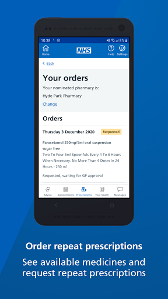
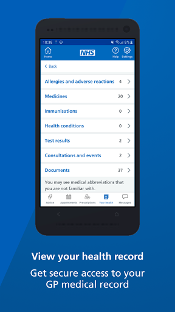
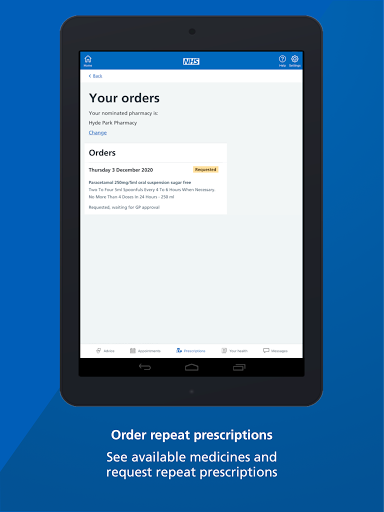
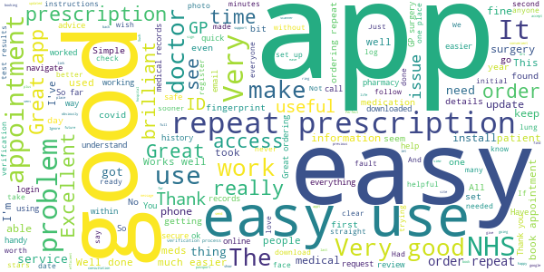
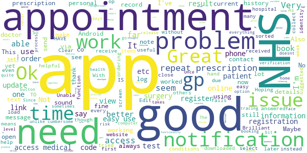
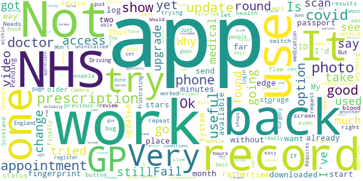
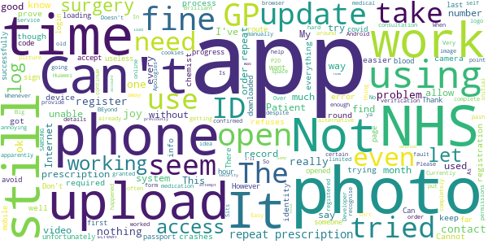
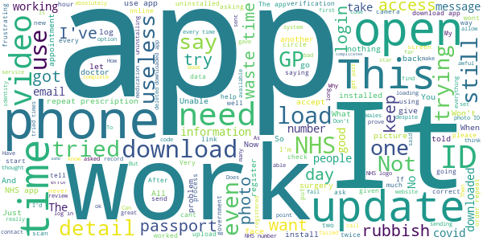

# NHS App
App version ``1.43.0``

Analyzed with [covid-apps-observer](http://github.com/covid-apps-observer) project, version ``0.1``

## App overview
| | |
|-------------------------|-------------------------| 
| **Name**&nbsp;&nbsp;&nbsp;&nbsp;&nbsp;&nbsp;&nbsp;&nbsp;&nbsp;&nbsp;&nbsp;&nbsp;&nbsp;&nbsp;&nbsp;&nbsp;&nbsp;&nbsp;&nbsp;&nbsp;&nbsp;&nbsp;&nbsp;&nbsp;&nbsp;&nbsp;&nbsp;&nbsp;&nbsp;&nbsp;&nbsp;&nbsp;&nbsp;&nbsp;&nbsp;&nbsp;&nbsp;&nbsp;&nbsp;&nbsp;  | NHS App |
| **Unique identifier** | com.nhs.online.nhsonline |
| **Link to Google Play** | [https://play.google.com/store/apps/details?id=com.nhs.online.nhsonline](https://play.google.com/store/apps/details?id=com.nhs.online.nhsonline) |
| **Summary**  | Access NHS services in England |
| **Privacy policy** | [https://www.nhs.uk/using-the-nhs/nhs-services/the-nhs-app/privacy/](https://www.nhs.uk/using-the-nhs/nhs-services/the-nhs-app/privacy/) |
| **Latest version** | 1.43.0 |
| **Last update** | 2020-12-18 10:07:49 |
| **Recent changes** | Improvements  We have made some changes to make unread messages more visible Bug fixes, and various performance, stability and accessibility enhancements |
| **Installs**  | 1,000,000+ |
| **Category** | Medical |
| **First release** | Dec 31, 2018 |
| **Size**  | 58M |
| **Supported Android version**  | 5.0 and up |

### Description
> <b>This is not the NHS COVID-19 app. To download the NHS COVID-19 contact tracing app, go to covid19.nhs.uk</b>
 Owned and run by the NHS, the NHS App is a simple and secure way to access a range of NHS services on your smartphone or tablet.
 To use the NHS App you must be aged 13 and over and registered with a GP surgery in England.
 You can also access NHS App services from the browser on your desktop or laptop computer. Go to www.nhs.uk/app
 Use the NHS App to:
 •	get advice about coronavirus
 •	order your repeat prescriptions
 •	book and manage appointments at your GP surgery
 •	get health information and advice
 •	view your health record securely
 •	register your organ donation decision
 •	find out how the NHS uses your data
 If your GP surgery or hospital offers other services in the NHS App, you may be able to:
 •	message your GP surgery, doctor or health professional online
 •	consult a GP or health professional through an online form and get a reply
 •	access health services on behalf of someone you care for
 •	view your hospital and other healthcare appointments
 •	view useful links your doctor or health professional has shared with you
 •	view and manage your care plans
 Get advice about coronavirus 
 ---------------------------------------
 Get information about coronavirus and find out what to do if you think you have it.
 Order repeat prescriptions 
 -----------------------------------
 See your available medicines, request a new repeat prescription and choose a pharmacy for your prescriptions to be sent to.
 Book appointments
 --------------------------
 Search for, book and cancel appointments at your GP surgery. See details of your upcoming and past appointments.
 Get health advice
 -----------------------------
 Search trusted NHS information and advice on hundreds of conditions and treatments. You can also answer questions to get instant advice or medical help near you. 
 View your health record
 ----------------------------------
 Securely access your GP health record, to see information like your allergies and your current and past medicines. If your GP surgery has given you access to your detailed medical record, you can also see information like test results and details of your consultations. 
 Register your organ donation decision
 --------------------------------------------------
 Choose to donate some or all of your organs and check your registered decision.
 Find out how the NHS uses your data
 -------------------------------------------------
 Choose if data from your health records is shared for research and planning.
 Keeping your data secure
 ---------------------------------
 After you download the app, you will need to set up an NHS login and prove who you are. The app then securely connects to information from your GP surgery. 
 If your Android device supports fingerprint detection, you can use it to log in to the NHS App each time, instead of using a password and security code.

### User interface
The developers of the app provide the following screenshots in the Google play store.
| | | |
|:-------------------------:|:-------------------------:|:-------------------------:|
 |   |   |   | 
 |   |   |   | 
 |   |   |   | 
 |   |   |   | 
 |   |   |   | 
 |   |   |   | 

## Development team
In the following we report the main information provided by the development team in the Google play store.

| | |
|-------------------------|-------------------------|
| **Developer**  | NHS Digital |
| **Website**  | [https://www.nhs.uk/using-the-nhs/nhs-services/the-nhs-app/help/](https://www.nhs.uk/using-the-nhs/nhs-services/the-nhs-app/help/) |
| **Email** | nhsapp@nhs.net |
| **Physical address**  | - |
| **Other developed apps**  | [https://play.google.com/store/apps/developer?id=NHS+Digital](https://play.google.com/store/apps/developer?id=NHS+Digital) |

## Android support

| | |
|-------------------------|-------------------------|
| **Declared target Android version**  | Android10, version 10 (API level 29) |
| **Effective target Android version**  | Android10, version 10 (API level 29) |
| **Minimum supported Android version**  | Lollipop, version 5.0 (API level 21) |
| **Maximum target Android version**  | - |

The larger the difference between the minimum and maximum supported Android versions, the better. A larger difference means a wider audience. For example, old phones have a very low Android version, so a high minimum supported Android version means that the app cannot be used by users with old phones, thus leading to accessibility problems. 

## Requested permissions

In the following we report the complete list of the permissions requested by the app. 

| **Permission** | **Protection level** | **Description** | 
|-------------------------|-------------------------|-------------------------|
 **android.permission ACCESS_FINE_LOCATION** | :warning:**Dangerous** | Allows an app to access precise location. 
 **android.permission ACCESS_NETWORK_STATE** | Normal | Allows applications to access information about networks. 
 **android.permission CAMERA** | :warning:**Dangerous** | Required to be able to access the camera device. 
 **android.permission INTERNET** | Normal | Allows applications to open network sockets. 
 **android.permission MODIFY_AUDIO_SETTINGS** | Normal | Allows an application to modify global audio settings. 
 **android.permission NFC** | Normal | Allows applications to perform I/O operations over NFC. 
 **android.permission READ_EXTERNAL_STORAGE** | :warning:**Dangerous** | Allows an application to read from external storage. 
 **android.permission READ_PHONE_STATE** | :warning:**Dangerous** | Allows read only access to phone state, including the phone number of the device, current cellular network information, the status of any ongoing calls, and a list of any PhoneAccounts registered on the device. 
 **android.permission RECORD_AUDIO** | :warning:**Dangerous** | Allows an application to record audio. 
 **android.permission USE_FINGERPRINT** | Normal | This constant was deprecated in API level 28. Applications should request USE_BIOMETRIC instead 
 **android.permission WAKE_LOCK** | Normal | Allows using PowerManager WakeLocks to keep processor from sleeping or screen from dimming. 
 **android.permission WRITE_EXTERNAL_STORAGE** | :warning:**Dangerous** | Allows an application to write to external storage. 
 **com.google.android.c2dm.permission RECEIVE** | - | - 
 **com.google.android.finsky.permission BIND_GET_INSTALL_REFERRER_SERVICE** | - | - 
 **org.fidoalliance.uaf.permissions FIDO_CLIENT** | - | - 

## Mentioned servers

| **Server** | **Registrant** | **Registrant country** | **Creation date** | 
|-------------------------|-------------------------|-------------------------|-------------------------|
 | googlesyndication.com | Google LLC | :us: US | 2003-01-21 06:17:24 |
 | google.com | Google LLC | :us: US | 1997-09-15 04:00:00 |
 | app-measurement.com | Google LLC | :us: US | 2015-06-19 20:13:31 |

## Security analysis 

Below we report the main security warnings raised by our execution of the [Androwarn](https://github.com/maaaaz/androwarn) security analysis tool.

**Connection interfaces exfiltration**
> - This application reads details about the currently active data network 

**Telephony services abuse**
> - This application makes phone calls 

**Suspicious connection establishment**
> - This application opens a Socket and connects it to the remote address '; port is out of range' on the 'N/A' port  
> - This application opens a Socket and connects it to the remote address 'Lc/b/b/a/a;->w(Ljava/lang/String;)Ljava/lang/StringBuilder;' on the 'N/A' port  
> - This application opens a Socket and connects it to the remote address 'Ljava/net/Proxy;->type()Ljava/net/Proxy$Type;' on the 'N/A' port  
> - This application opens a Socket and connects it to the remote address 'timeout' on the 'N/A' port  

**Code execution**
> - This application loads a native library: 'DocumentCropper' 
> - This application loads a native library: 'Integrity' 
> - This application loads a native library: 'Liveness' 
> - This application loads a native library: 'Ocr' 
> - This application loads a native library: 'Preflight' 
> - This application loads a native library: 'Quality' 
> - This application loads a native library: 'gnustl_shared' 
> - This application loads a native library: 'lept' 
> - This application loads a native library: 'opencv_java3' 
> - This application loads a native library: 'tensorflow_inference' 
> - This application loads a native library: 'tensorflow_jni' 
> - This application loads a native library: 'tess' 

## User ratings and reviews

Below we provide information about how end users are reacting to the app in terms of ratings and reviews in the Google Play store.

### Ratings

The NHS App app has been installed by more than **1000000** times. At this time, **5633** rated the app and its average score is **3.4485815**. Below we show the distribution of the ratings across the usual star-based rating of Google Play

:star::star::star::star::star:: 2668

:star::star::star::star:: 689

:star::star::star:: 369

:star::star:: 319

:star:: 1588

### Reviews 

#### 5-star reviews

> Have been able to acsess things  :date: __2020-12-20 10:42:12__

> Hard to use  :date: __2020-12-20 10:30:01__

> Really easy to use  :date: __2020-12-19 21:55:51__

> Great thanks easy to use  :date: __2020-12-19 18:25:09__

> Superb  :date: __2020-12-19 09:02:34__

> No problems, very useful app.  :date: __2020-12-19 00:18:54__

> Amazing  :date: __2020-12-18 22:33:36__

> Excellent  :date: __2020-12-18 16:07:45__

> Simple and useful  :date: __2020-12-18 01:59:46__

> I find it ok only thing is can't book appointment thanks  :date: __2020-12-17 19:02:07__

#### 4-star reviews

> Clear information  :date: __2020-12-19 21:29:17__

> Very good Very useful  :date: __2020-12-19 15:04:27__

> Notifications setup fails on Huawei P40 Pro. Says "Notifications error" even though notifications are working and enabled. Maybe lack of GMS. Not a problem to me though. Otherwise Ok.  :date: __2020-12-18 13:28:42__

> no problems so far, but would like to have access to medical history notes etc.  :date: __2020-12-15 12:11:29__

> MICHAEL POPOWSKI THIS APP IS VERY VERY GOOD. \*\*\*\**BUT WHY DO I HAVE TO UP DATE IT & HOW OFTEN ?.  :date: __2020-12-14 12:46:58__

> It's ok  :date: __2020-12-13 20:31:44__

> No problems setting up and getting identity sorted. Crashed a few times upon logging in with the most recent update, but worked after a few tries.  :date: __2020-12-10 11:24:25__

> Good so far, local gp don't allow online history  :date: __2020-12-09 21:24:33__

> Great app. Keeps improving.  :date: __2020-12-09 01:34:38__

> So far, this app had proved reliable. As long as you have the correct registration details to hand, it's straight forward to set up and I have successfully requested and received a repeat prescription. Future reliability yet to be decided.  :date: __2020-12-04 17:04:27__

#### 3-star reviews

> Followed advice & deleted 2 older apps to free up storage. Tried again. It is still in a "Pending" status. All my other apps work, the only one trying to update is NHS. It's NHS update Got a recommendation to upgrade the app but all you see is the "washing machine" going round, and round, and round..... still in a pending state and you cannot go back and use the previous version. Wanted to check a medical appointment but now can't. Does not look like this upgrade release has been fully tested!!  :date: __2020-12-18 16:47:56__

> Needs more details Why I can't see my health records like blood test results or scan results or even what is the problem that I suffer Please put that in the App That's right of our rights as patients,  :date: __2020-12-18 12:33:42__

> I have not used it much yet don't know how good it is.  :date: __2020-12-17 17:40:41__

> Generally the app is very good but I've found one "flaw" and one bug Bug: If you try to re-enable fingerprint access, after it has apparently been turned off due to "a change" on my device, the app crashes as soon as I slide the "enable fingerprint" switch. Flaw: pressing the back button brings up the option to log out, rather than just take me back a screen as is more normal. Fix is to reinstall the app. Samsung S7 edge.  :date: __2020-12-17 01:53:09__

> Finally let me log in but no records, repeat prescriptions or anything show. I can't book a GP appointment. My GP records don't show my personal changes in records.  :date: __2020-12-15 16:39:50__

> Is there an NHS app for Scotland. I tried to register using the app but it does not recognise the information because I reside in Scotland not England.  :date: __2020-12-11 15:24:06__

> Not used yet  :date: __2020-12-10 12:24:17__

> Having trouble verifing my I. D, try to take a video but it takes me to files not video. Already messaged about this but none of advice worked. Very frustrating as it also kicks me off the site so have to log back in all the time.  :date: __2020-12-08 17:31:23__

> My GP and Physio already use other platforms, so this really isnt that useful .... Prob will be ok once active systems start to work with it  :date: __2020-12-08 03:01:06__

> The app is fine when it works but on more than three occasions have had to chace up my electronic prescription as not recieved by pharmacy. Leaving me very low or without medication and stressed having to contact my GP for paper script at a time they are asking people not to attend if necessary.  :date: __2020-12-07 17:18:37__

#### 2-star reviews

> The consultation form asks like 50 unrelevant questions before you can actually submit consultation form. This app was much better when I used it few months ago.  :date: __2020-12-16 21:48:56__

> Cannot find out how to order repeat prescription  :date: __2020-12-16 18:59:17__

> After settling into using the app for Months, suddenly without reason or warning my online delivery pharmacist was changed to a "collect only" service from a village chemist miles away. The restoration of normal service was a pain in the ass & only possible by re registration on my chosen chemist's website. It seems to have begun, though its not confirmed. As an interim, prescriptions will be delivered to a chemist shop nearer my home. Why mess about like this!?? Is the app or NHS at fault?  :date: __2020-12-15 22:29:00__

> Currently refuses to open on my device. Sits on the opening screen with the round 'loading' thing going and just doesn't open. Please sort it out.  :date: __2020-12-13 14:59:51__

> System online for GP surgeries is more effective and easier to use.  :date: __2020-12-13 11:03:34__

> Still can't book appointmemts  :date: __2020-12-11 07:53:30__

> Trying to prove my identity with this app was a nightmare. Whenever I got to the point to upload an image, for sending photo id, to take a photo or upload a video, nothing happened when i tapped the camera icon! Seems certain random aspects of things on PHE/NHS apps don't seem to work on a Huawei P20! In the end i had to complete the registration process using an old SAMSUNG phone! BEyond that, everything seems fine.  :date: __2020-12-09 14:45:05__

> Still can't organise a repeat prescription on this app really annoying 👎  :date: __2020-12-04 10:24:14__

> Basic software! temperamental - it crashes often, which is rather annoying. Reflects how bad the healthcare system is, unfortunately. We expect much, much more & we should be getting it!! The app is nothing special, no features to help patients be informed & take action regarding our own health. My advice is to avoid the app. Use ya Internet browser to access your records via systmonline (sign up required). "C'mon developers where's ya spunk? Whats soo hard? (not me...) Get with the program!"  :date: __2020-12-03 11:31:34__

> Cannot even get onto the app. I need to provide evidence that I am who I say am, and when I upload documents it just closes and logs me out.  :date: __2020-12-01 23:16:24__

#### 1-star reviews

> I cant get the app to work as all it does is loading sign and did that for about 5 minutes so removed it  :date: __2020-12-20 09:43:23__

> I have a Huawei p40 Pro. After installing the app l get a notification that l must upgrade. If you try a message states upgrade no longer available. At that point you cannot log in. Thus everything stops hence total failure  :date: __2020-12-19 10:30:36__

> Not seen a doctor this year. They all sitting at home.  :date: __2020-12-19 06:20:01__

> Cant even download the app to order my repeat prescription  :date: __2020-12-18 20:31:28__

> Can not prove my identity as it won't show my camera the app is no good to me if I can't access the things I need  :date: __2020-12-17 15:53:12__

> Can't register because it won't open the camera and won't accept a video. All permissions are granted, still won't work. Someone told me to activate Bluetooth for it to work (pretty random), so I activated BT, Wifi, data, NFC, hotspot, GPS, granted every possible authorisation, still won't open the camera.  :date: __2020-12-17 14:24:05__

> Worst app I've ever used.  :date: __2020-12-17 12:01:07__

> The app was working great until it updated now when I try to log in all I get is that there is an internet connection error. My internet is fine and I just can't log in.  :date: __2020-12-16 18:35:37__

> i have been trying for 3 days to get my details logged in 1st it wouldn't accept my license picture once i eventually got past that i had to get details from my doctors surgery then again the app wont accept them i still haven't managed to get this app to work which is not good as i have only 3 days of epilepsy meds left  :date: __2020-12-15 16:34:01__

> Won't log in! Requested SMS code 5 times now to register mobile number, but get nothing. Another example of poor NHS management!  :date: __2020-12-15 10:07:25__

