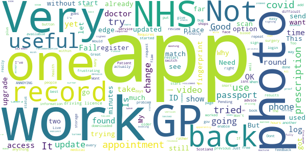

# NHS App
App version ``1.44.0``

Analyzed with [covid-apps-observer](http://github.com/covid-apps-observer) project, version ``0.1``

## App overview
| | |
|-------------------------|-------------------------| 
| **Name**&nbsp;&nbsp;&nbsp;&nbsp;&nbsp;&nbsp;&nbsp;&nbsp;&nbsp;&nbsp;&nbsp;&nbsp;&nbsp;&nbsp;&nbsp;&nbsp;&nbsp;&nbsp;&nbsp;&nbsp;&nbsp;&nbsp;&nbsp;&nbsp;&nbsp;&nbsp;&nbsp;&nbsp;&nbsp;&nbsp;&nbsp;&nbsp;&nbsp;&nbsp;&nbsp;&nbsp;&nbsp;&nbsp;&nbsp;&nbsp;  | NHS App |
| **Unique identifier** | com.nhs.online.nhsonline |
| **Link to Google Play** | [https://play.google.com/store/apps/details?id=com.nhs.online.nhsonline](https://play.google.com/store/apps/details?id=com.nhs.online.nhsonline) |
| **Summary**  | Access NHS services in England |
| **Privacy policy** | [https://www.nhs.uk/using-the-nhs/nhs-services/the-nhs-app/privacy/](https://www.nhs.uk/using-the-nhs/nhs-services/the-nhs-app/privacy/) |
| **Latest version** | 1.44.0 |
| **Last update** | 2021-01-15 16:17:56 |
| **Recent changes** | Bug fixes, and various performance, stability and accessibility enhancements. |
| **Installs**  | 1,000,000+ |
| **Category** | Medical |
| **First release** | Dec 31, 2018 |
| **Size**  | 56M |
| **Supported Android version**  | 5.0 and up |

### Description
> <b>This is not the NHS COVID-19 app. To download the NHS COVID-19 contact tracing app, go to covid19.nhs.uk</b>
 Owned and run by the NHS, the NHS App is a simple and secure way to access a range of NHS services on your smartphone or tablet.
 To use the NHS App you must be aged 13 and over and registered with a GP surgery in England.
 You can also access NHS App services from the browser on your desktop or laptop computer. Go to www.nhs.uk/app
 Use the NHS App to:
 •	get advice about coronavirus
 •	order your repeat prescriptions
 •	book and manage appointments at your GP surgery
 •	get health information and advice
 •	view your health record securely
 •	register your organ donation decision
 •	find out how the NHS uses your data
 If your GP surgery or hospital offers other services in the NHS App, you may be able to:
 •	message your GP surgery, doctor or health professional online
 •	consult a GP or health professional through an online form and get a reply
 •	access health services on behalf of someone you care for
 •	view your hospital and other healthcare appointments
 •	view useful links your doctor or health professional has shared with you
 •	view and manage your care plans
 Get advice about coronavirus 
 ---------------------------------------
 Get information about coronavirus and find out what to do if you think you have it.
 Order repeat prescriptions 
 -----------------------------------
 See your available medicines, request a new repeat prescription and choose a pharmacy for your prescriptions to be sent to.
 Book appointments
 --------------------------
 Search for, book and cancel appointments at your GP surgery. See details of your upcoming and past appointments.
 Get health advice
 -----------------------------
 Search trusted NHS information and advice on hundreds of conditions and treatments. You can also answer questions to get instant advice or medical help near you. 
 View your health record
 ----------------------------------
 Securely access your GP health record, to see information like your allergies and your current and past medicines. If your GP surgery has given you access to your detailed medical record, you can also see information like test results and details of your consultations. 
 Register your organ donation decision
 --------------------------------------------------
 Choose to donate some or all of your organs and check your registered decision.
 Find out how the NHS uses your data
 -------------------------------------------------
 Choose if data from your health records is shared for research and planning.
 Keeping your data secure
 ---------------------------------
 After you download the app, you will need to set up an NHS login and prove who you are. The app then securely connects to information from your GP surgery. 
 If your Android device supports fingerprint detection, you can use it to log in to the NHS App each time, instead of using a password and security code.

### User interface
The developers of the app provide the following screenshots in the Google play store.
| | | |
|:-------------------------:|:-------------------------:|:-------------------------:|
 |   |   |   | 
 |   |   |   | 
 |   |   |   | 
 |   |   |   | 
 |   |   |   | 
 |   |   |   | 

## Development team
In the following we report the main information provided by the development team in the Google play store.

| | |
|-------------------------|-------------------------|
| **Developer**  | NHS Digital |
| **Website**  | [https://www.nhs.uk/using-the-nhs/nhs-services/the-nhs-app/help/](https://www.nhs.uk/using-the-nhs/nhs-services/the-nhs-app/help/) |
| **Email** | nhsapp@nhs.net |
| **Physical address**  | - |
| **Other developed apps**  | [https://play.google.com/store/apps/developer?id=NHS+Digital](https://play.google.com/store/apps/developer?id=NHS+Digital) |

## Android support

| | |
|-------------------------|-------------------------|
| **Declared target Android version**  | Android10, version 10 (API level 29) |
| **Effective target Android version**  | Android10, version 10 (API level 29) |
| **Minimum supported Android version**  | Lollipop, version 5.0 (API level 21) |
| **Maximum target Android version**  | - |

The larger the difference between the minimum and maximum supported Android versions, the better. A larger difference means a wider audience. For example, old phones have a very low Android version, so a high minimum supported Android version means that the app cannot be used by users with old phones, thus leading to accessibility problems. 

## Requested permissions

In the following we report the complete list of the permissions requested by the app. 

| **Permission** | **Protection level** | **Description** | 
|-------------------------|-------------------------|-------------------------|
 **android.permission ACCESS_FINE_LOCATION** | :warning:**Dangerous** | Allows an app to access precise location. 
 **android.permission ACCESS_NETWORK_STATE** | Normal | Allows applications to access information about networks. 
 **android.permission CAMERA** | :warning:**Dangerous** | Required to be able to access the camera device. 
 **android.permission INTERNET** | Normal | Allows applications to open network sockets. 
 **android.permission MODIFY_AUDIO_SETTINGS** | Normal | Allows an application to modify global audio settings. 
 **android.permission NFC** | Normal | Allows applications to perform I/O operations over NFC. 
 **android.permission READ_EXTERNAL_STORAGE** | :warning:**Dangerous** | Allows an application to read from external storage. 
 **android.permission READ_PHONE_STATE** | :warning:**Dangerous** | Allows read only access to phone state, including the phone number of the device, current cellular network information, the status of any ongoing calls, and a list of any PhoneAccounts registered on the device. 
 **android.permission RECORD_AUDIO** | :warning:**Dangerous** | Allows an application to record audio. 
 **android.permission USE_FINGERPRINT** | Normal | This constant was deprecated in API level 28. Applications should request USE_BIOMETRIC instead 
 **android.permission WAKE_LOCK** | Normal | Allows using PowerManager WakeLocks to keep processor from sleeping or screen from dimming. 
 **android.permission WRITE_EXTERNAL_STORAGE** | :warning:**Dangerous** | Allows an application to write to external storage. 
 **com.google.android.c2dm.permission RECEIVE** | - | - 
 **com.google.android.finsky.permission BIND_GET_INSTALL_REFERRER_SERVICE** | - | - 
 **org.fidoalliance.uaf.permissions FIDO_CLIENT** | - | - 

## Mentioned servers

| **Server** | **Registrant** | **Registrant country** | **Creation date** | 
|-------------------------|-------------------------|-------------------------|-------------------------|
 | googlesyndication.com | Google LLC | :us: US | 2003-01-21 06:17:24 |
 | google.com | Google LLC | :us: US | 1997-09-15 04:00:00 |
 | app-measurement.com | Google LLC | :us: US | 2015-06-19 20:13:31 |

## Security analysis 

Below we report the main security warnings raised by our execution of the [Androwarn](https://github.com/maaaaz/androwarn) security analysis tool.

**Connection interfaces exfiltration**
> - This application reads details about the currently active data network 

**Telephony services abuse**
> - This application makes phone calls 

**Suspicious connection establishment**
> - This application opens a Socket and connects it to the remote address '; port is out of range' on the 'N/A' port  
> - This application opens a Socket and connects it to the remote address 'Lc/b/b/a/a;->w(Ljava/lang/String;)Ljava/lang/StringBuilder;' on the 'N/A' port  
> - This application opens a Socket and connects it to the remote address 'Ljava/net/Proxy;->type()Ljava/net/Proxy$Type;' on the 'N/A' port  
> - This application opens a Socket and connects it to the remote address 'timeout' on the 'N/A' port  

**Code execution**
> - This application loads a native library: 'DocumentCropper' 
> - This application loads a native library: 'Integrity' 
> - This application loads a native library: 'Liveness' 
> - This application loads a native library: 'Ocr' 
> - This application loads a native library: 'Preflight' 
> - This application loads a native library: 'Quality' 
> - This application loads a native library: 'gnustl_shared' 
> - This application loads a native library: 'lept' 
> - This application loads a native library: 'opencv_java3' 
> - This application loads a native library: 'tensorflow_inference' 
> - This application loads a native library: 'tensorflow_jni' 
> - This application loads a native library: 'tess' 

## User ratings and reviews

Below we provide information about how end users are reacting to the app in terms of ratings and reviews in the Google Play store.

### Ratings

The NHS App app has been installed by more than **1000000** times. At this time, **5919** rated the app and its average score is **3.6414142**. Below we show the distribution of the ratings across the usual star-based rating of Google Play

:star::star::star::star::star:: 3040

:star::star::star::star:: 797

:star::star::star:: 408

:star::star:: 269

:star:: 1405

### Reviews 

#### 5-star reviews

> Easy to use, easy to read, plain English text.  :date: __2021-01-29 21:29:32__

> NHS GOOD APP  :date: __2021-01-29 11:23:32__

> Saves so much time and unnecessary phone calls and travelling. Works very well .  :date: __2021-01-28 22:45:30__

> Don't be put off, by tricky registration, it has to verify its you. Brilliant App. All in one go to area for everything NHS. I love it and use it more often than my GP one. You can order medicines and leave messages for your GP. Brilliant Thanks 😊 👍  :date: __2021-01-28 22:17:22__

> Just the job thank you  :date: __2021-01-28 18:37:56__

> It keeps you up to date with what's happening about coronvirus  :date: __2021-01-27 20:40:01__

> Good centralised information, useful, easy to authenticate.  :date: __2021-01-27 10:46:00__

> Does what is required  :date: __2021-01-26 23:12:40__

> Simple to use and convenient 🙂  :date: __2021-01-26 13:34:41__

> Easy to navigate and us  :date: __2021-01-25 23:20:40__

#### 4-star reviews

> Easy to use  :date: __2021-01-29 05:06:48__

> Good  :date: __2021-01-28 10:24:42__

> Registration wasn't completely straightforward but having jumped through all the necessary hoops (good to know the security is very high level) it all seems to work nicely and will save calls and maybe even visits to our surgery.  :date: __2021-01-28 08:48:42__

> Good app to view medication and appointments etc and to send message to your GP would be great if you could view up and coming hospital consultant appointments also  :date: __2021-01-27 14:01:14__

> It was quite a fiddly process to register but the app is very good and it saves me time when I need to order a repeat prescription or use eConsult.  :date: __2021-01-26 12:43:38__

> After an initial problem with my photograph, I used my Driving license and it worked fine 🙂  :date: __2021-01-23 15:25:13__

> After settling into using the app for Months, suddenly without reason or warning my online delivery pharmacist was changed to a "collect only" service from a village chemist miles away. I blamed the app at first but it was the chemist who had moved to new premises. The app still works pretty well although i still have no access to my medical records. Overall I am happy  :date: __2021-01-23 07:10:51__

> Very good so far  :date: __2021-01-20 14:47:58__

> Overall I like the app but am unable to change my nominated Pharmacy or even see which one it is nominated.  :date: __2021-01-20 10:17:56__

> Usually have no issues. One or two problems have occurred but were sorted quickly. I use it to order repeat prescriptions. Have not used it for anything else. Edit: have also used it to make contact with my gp and asked questions. It's useful if it's not a serious issue that needs face to face appointments.  :date: __2021-01-18 02:08:09__

#### 3-star reviews

> Great app very useful just wish I could make an appointment on this app here  :date: __2021-01-29 16:59:16__

> Very difficult if you don't have passport or driving licence  :date: __2021-01-24 20:37:05__

> When GP appointment booking is going to restart?  :date: __2021-01-22 17:20:42__

> Good updated information as needed.  :date: __2021-01-18 17:04:45__

> "we could not change your fingerprint setting". But every other app can.  :date: __2021-01-15 21:22:44__

> Too many screens, log in is not the easiest.  :date: __2021-01-14 17:09:57__

> Gps need to sign up to this then it will work  :date: __2021-01-06 09:27:43__

> I found the process of signing up easy, I'm now free to order repeat prescription as required, but when I tried to signed the wife up oh my how many times have I tried and failed just won't accept photo and video match up. Gave up now she won't let me try again  :date: __2021-01-04 22:10:35__

> There one problem with trying register with this the photo ID proof has to be a driving licence or passport and for those that don't have one these it become difficult indeed.  :date: __2020-12-31 01:30:11__

> Useful app  :date: __2020-12-23 12:39:05__

#### 2-star reviews

> Not very good.  :date: __2021-01-27 20:33:06__

> Needs more info  :date: __2021-01-27 09:44:26__

> Crashes when viewing consultation notes on health record.  :date: __2021-01-26 09:10:54__

> This app was working fine last week. This week it is continually asking me to provide ID when I try to read appointment or anything else.This I did on first joining. Very disappointing and frustrating, especially at this time when we need less contact.  :date: __2021-01-25 18:29:30__

> Very slow to update this app  :date: __2021-01-23 15:34:40__

> It will not verify my id. I need to video myself but the link goes to video files and not the video recorder.  :date: __2021-01-21 13:47:28__

> When setting up identification it will not accept my video, saying the file is a type it cannot accept.  :date: __2021-01-20 19:49:51__

> registered with my nhs number and then asked to provide photo evidence to prove who i am. chos passport and then followed the prompts. App failed to open my camera. Took a pic and uploaded it then prompted to take a video yet again app failed to open my camera. Like all other nhs it systems this app fails on every level  :date: __2021-01-19 18:30:53__

> Tried to use on my phone,to login for first time but couldn't get past the box to type in the code number sent to me in a text message. Wouldn't allow me to type numbers in the box...finally managed to copy as paste number..to then get stuck, trying to upload a video for security . Losing the will to live  :date: __2021-01-18 15:18:23__

> Fed up with this app needing to be updated every few months and needing me to delete other apps to do it. I t annoys me that I then have to reinstall the other apps  :date: __2021-01-15 16:29:29__

#### 1-star reviews

> Pretty poor really can't upload video to gain full access..Constantly tryed to gain access.. Waste of time... U installed  :date: __2021-01-29 16:41:33__

> The log in took over four hours to complete. It will not load on my laptop. Once everything is up loaded on to a smart phone. you log in to check perscriptions all you get is an error message. I still do not know if they have been ordered and they have just ran out, so now still have to ring to find out. the phone charges are now over forty pounds. A complete waste of time and money !!!!!!!!  :date: __2021-01-28 20:43:08__

> Trying to register won't accept password  :date: __2021-01-28 17:44:04__

> Won't let me update, meaning I can't use the app anymore  :date: __2021-01-28 11:28:23__

> Spent ages trying to login app doesn't recognise me. Has confirmed my email.  :date: __2021-01-28 10:41:08__

> Tried to use, haven't got any photo ID and my GP doesn't use an online booking system anymore so can't verify ID  :date: __2021-01-27 15:18:49__

> Simple after failing registration delete the app, pick up a phone ,enter the code number your doctor has given you ,when answered follow any instructions, when you get a human tell them what you want, The address on a driving licence is not necessarly where you live ,it is where DVLA can contact you , my son has had 5 addresses this year (rentals) he does not change his driving licence every few months  :date: __2021-01-27 12:13:36__

> One big rubbish. Can't connect to GP. And even login 👎  :date: __2021-01-26 17:41:12__

> how can you upload your test results you have had for a covid test from a test site you booked on nhs App know were to add you results 🤔  :date: __2021-01-26 16:34:11__

> My registration failed. You did not pass our checks because some of the details on your NHS record are not the same as the details on your photo I.D. This must be the postal address ,the surgery hold 2, my postal address of my house in manchester and my sons place in Southport, as I stay in Southport 95% of my time I registered at a local GP, the ID process seems unable to cope with this which is not exactly an unusual life choice for a pensioner , I have other apps that work fine  :date: __2021-01-26 15:48:23__

