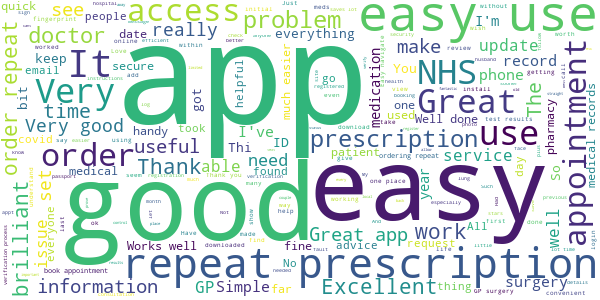
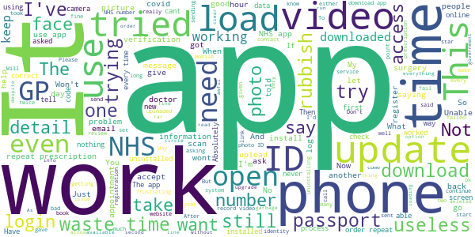

# NHS App
App version ``1.44.0``

Analyzed with [covid-apps-observer](http://github.com/covid-apps-observer) project, version ``0.1``

## App overview
| | |
|-------------------------|-------------------------| 
| **Name**&nbsp;&nbsp;&nbsp;&nbsp;&nbsp;&nbsp;&nbsp;&nbsp;&nbsp;&nbsp;&nbsp;&nbsp;&nbsp;&nbsp;&nbsp;&nbsp;&nbsp;&nbsp;&nbsp;&nbsp;&nbsp;&nbsp;&nbsp;&nbsp;&nbsp;&nbsp;&nbsp;&nbsp;&nbsp;&nbsp;&nbsp;&nbsp;&nbsp;&nbsp;&nbsp;&nbsp;&nbsp;&nbsp;&nbsp;&nbsp;  | NHS App |
| **Unique identifier** | com.nhs.online.nhsonline |
| **Link to Google Play** | [https://play.google.com/store/apps/details?id=com.nhs.online.nhsonline](https://play.google.com/store/apps/details?id=com.nhs.online.nhsonline) |
| **Summary**  | Access NHS services in England |
| **Privacy policy** | [https://www.nhs.uk/using-the-nhs/nhs-services/the-nhs-app/privacy/](https://www.nhs.uk/using-the-nhs/nhs-services/the-nhs-app/privacy/) |
| **Latest version** | 1.44.0 |
| **Last update** | 2021-01-15 16:17:56 |
| **Recent changes** | Bug fixes, and various performance, stability and accessibility enhancements. |
| **Installs**  | 1,000,000+ |
| **Category** | Medical |
| **First release** | Dec 31, 2018 |
| **Size**  | 56M |
| **Supported Android version**  | 5.0 and up |

### Description
> <b>This is not the NHS COVID-19 app. To download the NHS COVID-19 contact tracing app, go to covid19.nhs.uk</b>
 Owned and run by the NHS, the NHS App is a simple and secure way to access a range of NHS services on your smartphone or tablet.
 To use the NHS App you must be aged 13 and over and registered with a GP surgery in England.
 You can also access NHS App services from the browser on your desktop or laptop computer. Go to www.nhs.uk/app
 Use the NHS App to:
 •	get advice about coronavirus
 •	order your repeat prescriptions
 •	book and manage appointments at your GP surgery
 •	get health information and advice
 •	view your health record securely
 •	register your organ donation decision
 •	find out how the NHS uses your data
 If your GP surgery or hospital offers other services in the NHS App, you may be able to:
 •	message your GP surgery, doctor or health professional online
 •	consult a GP or health professional through an online form and get a reply
 •	access health services on behalf of someone you care for
 •	view your hospital and other healthcare appointments
 •	view useful links your doctor or health professional has shared with you
 •	view and manage your care plans
 Get advice about coronavirus 
 ---------------------------------------
 Get information about coronavirus and find out what to do if you think you have it.
 Order repeat prescriptions 
 -----------------------------------
 See your available medicines, request a new repeat prescription and choose a pharmacy for your prescriptions to be sent to.
 Book appointments
 --------------------------
 Search for, book and cancel appointments at your GP surgery. See details of your upcoming and past appointments.
 Get health advice
 -----------------------------
 Search trusted NHS information and advice on hundreds of conditions and treatments. You can also answer questions to get instant advice or medical help near you. 
 View your health record
 ----------------------------------
 Securely access your GP health record, to see information like your allergies and your current and past medicines. If your GP surgery has given you access to your detailed medical record, you can also see information like test results and details of your consultations. 
 Register your organ donation decision
 --------------------------------------------------
 Choose to donate some or all of your organs and check your registered decision.
 Find out how the NHS uses your data
 -------------------------------------------------
 Choose if data from your health records is shared for research and planning.
 Keeping your data secure
 ---------------------------------
 After you download the app, you will need to set up an NHS login and prove who you are. The app then securely connects to information from your GP surgery. 
 If your Android device supports fingerprint detection, you can use it to log in to the NHS App each time, instead of using a password and security code.

### User interface
The developers of the app provide the following screenshots in the Google play store.
| | | |
|:-------------------------:|:-------------------------:|:-------------------------:|
 |   |   |   | 
 |   |   |   | 
 |   |   |   | 
 |   |   |   | 
 |   |   |   | 
 |   |   |   | 

## Development team
In the following we report the main information provided by the development team in the Google play store.

| | |
|-------------------------|-------------------------|
| **Developer**  | NHS Digital |
| **Website**  | [https://www.nhs.uk/using-the-nhs/nhs-services/the-nhs-app/help/](https://www.nhs.uk/using-the-nhs/nhs-services/the-nhs-app/help/) |
| **Email** | nhsapp@nhs.net |
| **Physical address**  | - |
| **Other developed apps**  | [https://play.google.com/store/apps/developer?id=NHS+Digital](https://play.google.com/store/apps/developer?id=NHS+Digital) |

## Android support

| | |
|-------------------------|-------------------------|
| **Declared target Android version**  | Android10, version 10 (API level 29) |
| **Effective target Android version**  | Android10, version 10 (API level 29) |
| **Minimum supported Android version**  | Lollipop, version 5.0 (API level 21) |
| **Maximum target Android version**  | - |

The larger the difference between the minimum and maximum supported Android versions, the better. A larger difference means a wider audience. For example, old phones have a very low Android version, so a high minimum supported Android version means that the app cannot be used by users with old phones, thus leading to accessibility problems. 

## Requested permissions

In the following we report the complete list of the permissions requested by the app. 

| **Permission** | **Protection level** | **Description** | 
|-------------------------|-------------------------|-------------------------|
 **android.permission ACCESS_FINE_LOCATION** | :warning:**Dangerous** | Allows an app to access precise location. 
 **android.permission ACCESS_NETWORK_STATE** | Normal | Allows applications to access information about networks. 
 **android.permission CAMERA** | :warning:**Dangerous** | Required to be able to access the camera device. 
 **android.permission INTERNET** | Normal | Allows applications to open network sockets. 
 **android.permission MODIFY_AUDIO_SETTINGS** | Normal | Allows an application to modify global audio settings. 
 **android.permission NFC** | Normal | Allows applications to perform I/O operations over NFC. 
 **android.permission READ_EXTERNAL_STORAGE** | :warning:**Dangerous** | Allows an application to read from external storage. 
 **android.permission READ_PHONE_STATE** | :warning:**Dangerous** | Allows read only access to phone state, including the phone number of the device, current cellular network information, the status of any ongoing calls, and a list of any PhoneAccounts registered on the device. 
 **android.permission RECORD_AUDIO** | :warning:**Dangerous** | Allows an application to record audio. 
 **android.permission USE_FINGERPRINT** | Normal | This constant was deprecated in API level 28. Applications should request USE_BIOMETRIC instead 
 **android.permission WAKE_LOCK** | Normal | Allows using PowerManager WakeLocks to keep processor from sleeping or screen from dimming. 
 **android.permission WRITE_EXTERNAL_STORAGE** | :warning:**Dangerous** | Allows an application to write to external storage. 
 **com.google.android.c2dm.permission RECEIVE** | - | - 
 **com.google.android.finsky.permission BIND_GET_INSTALL_REFERRER_SERVICE** | - | - 
 **org.fidoalliance.uaf.permissions FIDO_CLIENT** | - | - 

## Mentioned servers

| **Server** | **Registrant** | **Registrant country** | **Creation date** | 
|-------------------------|-------------------------|-------------------------|-------------------------|
 | googlesyndication.com | Google LLC | :us: US | 2003-01-21 06:17:24 |
 | google.com | Google LLC | :us: US | 1997-09-15 04:00:00 |
 | app-measurement.com | Google LLC | :us: US | 2015-06-19 20:13:31 |

## Security analysis 

Below we report the main security warnings raised by our execution of the [Androwarn](https://github.com/maaaaz/androwarn) security analysis tool.

**Connection interfaces exfiltration**
> - This application reads details about the currently active data network 

**Telephony services abuse**
> - This application makes phone calls 

**Suspicious connection establishment**
> - This application opens a Socket and connects it to the remote address '; port is out of range' on the 'N/A' port  
> - This application opens a Socket and connects it to the remote address 'Lc/b/b/a/a;->w(Ljava/lang/String;)Ljava/lang/StringBuilder;' on the 'N/A' port  
> - This application opens a Socket and connects it to the remote address 'Ljava/net/Proxy;->type()Ljava/net/Proxy$Type;' on the 'N/A' port  
> - This application opens a Socket and connects it to the remote address 'timeout' on the 'N/A' port  

**Code execution**
> - This application loads a native library: 'DocumentCropper' 
> - This application loads a native library: 'Integrity' 
> - This application loads a native library: 'Liveness' 
> - This application loads a native library: 'Ocr' 
> - This application loads a native library: 'Preflight' 
> - This application loads a native library: 'Quality' 
> - This application loads a native library: 'gnustl_shared' 
> - This application loads a native library: 'lept' 
> - This application loads a native library: 'opencv_java3' 
> - This application loads a native library: 'tensorflow_inference' 
> - This application loads a native library: 'tensorflow_jni' 
> - This application loads a native library: 'tess' 

## User ratings and reviews

Below we provide information about how end users are reacting to the app in terms of ratings and reviews in the Google Play store.

### Ratings

The NHS App app has been installed by more than **1000000** times. At this time, **5919** rated the app and its average score is **3.6414142**. Below we show the distribution of the ratings across the usual star-based rating of Google Play

:star::star::star::star::star:: 3040

:star::star::star::star:: 797

:star::star::star:: 408

:star::star:: 269

:star:: 1405

### Reviews 

#### 5-star reviews

> Scary thi king what we would do without them ××××××  :date: __2021-01-23 10:40:02__

> Very good  :date: __2021-01-22 19:33:08__

> Works well. Good beginning but I believe it should give me complete access to MY medical records both gp and hospital.  :date: __2021-01-22 18:51:30__

> I like this app. I've used a couple of time and each time I've been messenger back promptly with good advice. It took a little to sign-up but once is done I only need to use my finger print to access all my information. As well as view my record live, as soon as the doctor update it.  :date: __2021-01-22 18:10:46__

> Easy to use, self explanatory, clearly labelled tabs for different uses - just open it and familiarise yourself with it. Handy to have to be in control of your own health.  :date: __2021-01-22 16:52:04__

> Easy to do. Great for making appointment, repeat prescriptions, looking at your records and lots more stuff.  :date: __2021-01-22 15:03:16__

> Easy to use and set up  :date: __2021-01-22 13:22:35__

> Simple to use! Easy to see your appointments and to order your prescriptions.  :date: __2021-01-22 07:34:20__

> Use this app to order repeat prescription every month very good  :date: __2021-01-21 21:58:47__

> Works great  :date: __2021-01-21 18:07:06__

#### 4-star reviews

> After settling into using the app for Months, suddenly without reason or warning my online delivery pharmacist was changed to a "collect only" service from a village chemist miles away. I blamed the app at first but it was the chemist who had moved to new premises. The app still works pretty well although i still have no access to my medical records. Overall I am happy  :date: __2021-01-23 07:10:51__

> Good app to view medication and appointments etc and to send message to your GP  :date: __2021-01-22 12:13:02__

> Very good so far  :date: __2021-01-20 14:47:58__

> Overall I like the app but am unable to change my nominated Pharmacy or even see which one it is nominated.  :date: __2021-01-20 10:17:56__

> Usually have no issues. One or two problems have occurred but were sorted quickly. I use it to order repeat prescriptions. Have not used it for anything else. Edit: have also used it to make contact with my gp and asked questions. It's useful if it's not a serious issue that needs face to face appointments.  :date: __2021-01-18 02:08:09__

> Although I had some initial problems with system registration I now find the app a very useful single point of access to medical advice, prescription reordering, making GP appointments and access to my records.  :date: __2021-01-15 21:52:12__

> Great App, I think it could be improved by the addition of a screen that shows your NHS number as a QR code or barcode. Then if I had to go to a surgery or mass vaccination I could just scan my barcode when I check in.  :date: __2021-01-15 12:08:50__

> Handy quick and simple access to prescription ordering and nhs information.  :date: __2021-01-08 16:54:15__

> Worked well for me. Better than holding on the phone  :date: __2021-01-08 16:26:55__

> Waiting for my id to be checked says takes upto 2 hours buts its been 10, need to order a prescription since i can no longer email my GP, ref: CID2001  :date: __2021-01-08 11:12:51__

#### 3-star reviews

> When GP appointment booking is going to restart?  :date: __2021-01-22 17:20:42__

> Good updated information as needed.  :date: __2021-01-18 17:04:45__

> "we could not change your fingerprint setting". But every other app can.  :date: __2021-01-15 21:22:44__

> Too many screens, log in is not the easiest.  :date: __2021-01-14 17:09:57__

> Gps need to sign up to this then it will work  :date: __2021-01-06 09:27:43__

> I found the process of signing up easy, I'm now free to order repeat prescription as required, but when I tried to signed the wife up oh my how many times have I tried and failed just won't accept photo and video match up. Gave up now she won't let me try again  :date: __2021-01-04 22:10:35__

> There one problem with trying register with this the photo ID proof has to be a driving licence or passport and for those that don't have one these it become difficult indeed.  :date: __2020-12-31 01:30:11__

> Useful app  :date: __2020-12-23 12:39:05__

> Followed advice & deleted 2 older apps to free up storage. Tried again. It is still in a "Pending" status. All my other apps work, the only one trying to update is NHS. It's NHS update Got a recommendation to upgrade the app but all you see is the "washing machine" going round, and round, and round..... still in a pending state and you cannot go back and use the previous version. Wanted to check a medical appointment but now can't. Does not look like this upgrade release has been fully tested!!  :date: __2020-12-18 16:47:56__

> Needs more details Why I can't see my health records like blood test results or scan results or even what is the problem that I suffer Please put that in the App That's right of our rights as patients,  :date: __2020-12-18 12:33:42__

#### 2-star reviews

> It will not verify my id. I need to video myself but the link goes to video files and not the video recorder.  :date: __2021-01-21 13:47:28__

> When setting up identification it will not accept my video, saying the file is a type it cannot accept.  :date: __2021-01-20 19:49:51__

> registered with my nhs number and then asked to provide photo evidence to prove who i am. chos passport and then followed the prompts. App failed to open my camera. Took a pic and uploaded it then prompted to take a video yet again app failed to open my camera. Like all other nhs it systems this app fails on every level  :date: __2021-01-19 18:30:53__

> Tried to use on my phone,to login for first time but couldn't get past the box to type in the code number sent to me in a text message. Wouldn't allow me to type numbers in the box...finally managed to copy as paste number..to then get stuck, trying to upload a video for security . Losing the will to live  :date: __2021-01-18 15:18:23__

> Fed up with this app needing to be updated every few months and needing me to delete other apps to do it. I t annoys me that I then have to reinstall the other apps  :date: __2021-01-15 16:29:29__

> Pretty poor really can't upload video to gain full access..  :date: __2021-01-10 14:22:22__

> Currently occupying unnecessary space on my phone. Doesn't seem to work. Keep getting error message / call 111. Cannot see my info or order a repeat prescription. When it worked albeit briefly, it was great. Used to be convenient and work so well now it's just disappointing.  :date: __2021-01-09 10:03:30__

> Slow to upload required pic and info  :date: __2021-01-05 12:18:26__

> Can't get past photo upload  :date: __2021-01-03 11:45:49__

> Not working on my phone  :date: __2020-12-31 01:25:35__

#### 1-star reviews

> Absolutely impossible to verify identity. First time was emailed to say corners weren't visible even though they were. Second time when I chased for a response after waiting 3 days, it was failed for no clear reason and I had the message to start again. The app itself takes ages to load.  :date: __2021-01-22 23:53:00__

> I have been able to create a login but i am unable to get the ID verified on my Honor 10. I am unable to open the camera from the app but i have managed to upload the photo and video for verification twice. The uploaded number verification video do not play in the app and i can only hear the audio and the video player box shows only the play icon.  :date: __2021-01-22 14:28:42__

> The ID verification is rubbish. The image I provided was perfectly clear and I still got a message saying they couldn't read my name. The app is completely useless without the verification so I've uninstalled.  :date: __2021-01-21 21:05:37__

> Don't work Not opening  :date: __2021-01-21 18:07:20__

> Useless is unable to recognise i have uploaded my id just goes round in a circle waste of time developers fix this flaw  :date: __2021-01-21 12:15:12__

> So awkward to register. Don't like the idea of having to upload a video of saying the 4 digit code they send. No point in doing it cos the video doesn't show, it just shows a video play icon with my voice in the background, and so was no longer able to continue with registration. I guess I'll just have to continue ringing my GP n waste their time ordering future repeat prescriptions over the phone rather than online.  :date: __2021-01-20 20:27:41__

> Doesnt even open app.  :date: __2021-01-19 23:16:24__

> It isn't possible to prove my ID. I've tried three times, each time I've taken a new picture of my passport, each time I've checked carefully and it's as it should be, clear, and easy to read. Each time I've been told the photo isn't readable. Update: I tried logging a call as you've asked, twice. Neither reply answered my question, or addressed the fact that I've already uploaded a photo exactly as I'm supposed to.  :date: __2021-01-19 16:24:23__

> so far I have been unable to log onto this app. Various problems with it for the last 3 hours of trying. First on my phone, it keeps asking for a six number passwoird which I caanot access without first coming out of thew NHS App. Once back in another number is sent. Ridiculous. I tried on my tablet, and got as far as the video which it will not take or accept. Absloute rubbish app. Please note in your answer, this was for me and me and not my wife.  :date: __2021-01-18 13:32:22__

> Just wont load. Have installed abd uninstalled thus app several times and it just whirs round and round when i try and open it on my phone  :date: __2021-01-17 17:10:37__

