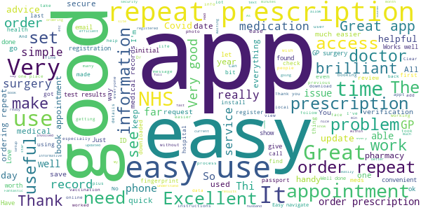
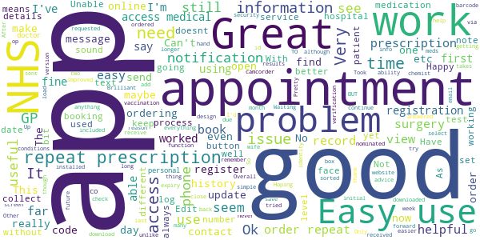
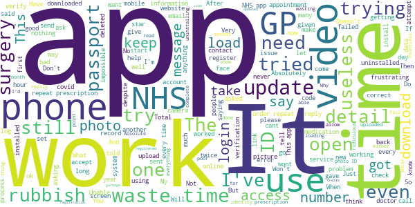

# NHS App
App version ``1.45.0``

Analyzed with [covid-apps-observer](http://github.com/covid-apps-observer) project, version ``0.1``

## App overview
| | |
|-------------------------|-------------------------| 
| **Name**                                          | NHS App |
| **Unique identifier** | com.nhs.online.nhsonline |
| **Link to Google Play** | [https://play.google.com/store/apps/details?id=com.nhs.online.nhsonline](https://play.google.com/store/apps/details?id=com.nhs.online.nhsonline) |
| **Summary**  | Access NHS services in England |
| **Privacy policy** | [https://www.nhs.uk/using-the-nhs/nhs-services/the-nhs-app/privacy/](https://www.nhs.uk/using-the-nhs/nhs-services/the-nhs-app/privacy/) |
| **Latest version** | 1.45.0 |
| **Last update** | 2021-02-05 10:21:45 |
| **Recent changes** | Bug fixes, and various performance, stability and accessibility enhancements. |
| **Installs**  | 1,000,000+ |
| **Category** | Medical |
| **First release** | Dec 31, 2018 |
| **Size**  | 56M |
| **Supported Android version**  | 5.0 and up |

### Description
> <b>This is not the NHS COVID-19 app. To download the NHS COVID-19 contact tracing app, go to covid19.nhs.uk</b>
 Owned and run by the NHS, the NHS App is a simple and secure way to access a range of NHS services on your smartphone or tablet.
 To use the NHS App you must be aged 13 and over and registered with a GP surgery in England.
 You can also access NHS App services from the browser on your desktop or laptop computer. Go to www.nhs.uk/app
 Use the NHS App to:
 •	get advice about coronavirus
 •	order your repeat prescriptions
 •	book and manage appointments at your GP surgery
 •	get health information and advice
 •	view your health record securely
 •	register your organ donation decision
 •	find out how the NHS uses your data
 If your GP surgery or hospital offers other services in the NHS App, you may be able to:
 •	message your GP surgery, doctor or health professional online
 •	consult a GP or health professional through an online form and get a reply
 •	access health services on behalf of someone you care for
 •	view your hospital and other healthcare appointments
 •	view useful links your doctor or health professional has shared with you
 •	view and manage your care plans
 Get advice about coronavirus 
 ---------------------------------------
 Get information about coronavirus and find out what to do if you think you have it.
 Order repeat prescriptions 
 -----------------------------------
 See your available medicines, request a new repeat prescription and choose a pharmacy for your prescriptions to be sent to.
 Book appointments
 --------------------------
 Search for, book and cancel appointments at your GP surgery. See details of your upcoming and past appointments.
 Get health advice
 -----------------------------
 Search trusted NHS information and advice on hundreds of conditions and treatments. You can also answer questions to get instant advice or medical help near you. 
 View your health record
 ----------------------------------
 Securely access your GP health record, to see information like your allergies and your current and past medicines. If your GP surgery has given you access to your detailed medical record, you can also see information like test results and details of your consultations. 
 Register your organ donation decision
 --------------------------------------------------
 Choose to donate some or all of your organs and check your registered decision.
 Find out how the NHS uses your data
 -------------------------------------------------
 Choose if data from your health records is shared for research and planning.
 Keeping your data secure
 ---------------------------------
 After you download the app, you will need to set up an NHS login and prove who you are. The app then securely connects to information from your GP surgery. 
 If your Android device supports fingerprint detection, you can use it to log in to the NHS App each time, instead of using a password and security code.

### User interface
The developers of the app provide the following screenshots in the Google play store.
| | | |
|:-------------------------:|:-------------------------:|:-------------------------:|
 |   |   |   | 
 |   |   |   | 
 |   |   |   | 
 |   |   |   | 
 |   |   |   | 
 |   |   |   | 

## Development team
In the following we report the main information provided by the development team in the Google play store.

| | |
|-------------------------|-------------------------|
| **Developer**  | NHS Digital |
| **Website**  | [https://www.nhs.uk/using-the-nhs/nhs-services/the-nhs-app/help/](https://www.nhs.uk/using-the-nhs/nhs-services/the-nhs-app/help/) |
| **Email** | nhsapp@nhs.net |
| **Physical address**  | - |
| **Other developed apps**  | [https://play.google.com/store/apps/developer?id=NHS+Digital](https://play.google.com/store/apps/developer?id=NHS+Digital) |

## Android support

| | |
|-------------------------|-------------------------|
| **Declared target Android version**  | Android10, version 10 (API level 29) |
| **Effective target Android version**  | Android10, version 10 (API level 29) |
| **Minimum supported Android version**  | Lollipop, version 5.0 (API level 21) |
| **Maximum target Android version**  | - |

The larger the difference between the minimum and maximum supported Android versions, the better. A larger difference means a wider audience. For example, old phones have a very low Android version, so a high minimum supported Android version means that the app cannot be used by users with old phones, thus leading to accessibility problems. 

## Requested permissions

In the following we report the complete list of the permissions requested by the app. 

| **Permission** | **Protection level** | **Description** | 
|-------------------------|-------------------------|-------------------------|
 **android.permission ACCESS_FINE_LOCATION** | :warning:**Dangerous** | Allows an app to access precise location. 
 **android.permission ACCESS_NETWORK_STATE** | Normal | Allows applications to access information about networks. 
 **android.permission CAMERA** | :warning:**Dangerous** | Required to be able to access the camera device. 
 **android.permission INTERNET** | Normal | Allows applications to open network sockets. 
 **android.permission MODIFY_AUDIO_SETTINGS** | Normal | Allows an application to modify global audio settings. 
 **android.permission NFC** | Normal | Allows applications to perform I/O operations over NFC. 
 **android.permission READ_EXTERNAL_STORAGE** | :warning:**Dangerous** | Allows an application to read from external storage. 
 **android.permission READ_PHONE_STATE** | :warning:**Dangerous** | Allows read only access to phone state, including the phone number of the device, current cellular network information, the status of any ongoing calls, and a list of any PhoneAccounts registered on the device. 
 **android.permission RECORD_AUDIO** | :warning:**Dangerous** | Allows an application to record audio. 
 **android.permission USE_FINGERPRINT** | Normal | This constant was deprecated in API level 28. Applications should request USE_BIOMETRIC instead 
 **android.permission WAKE_LOCK** | Normal | Allows using PowerManager WakeLocks to keep processor from sleeping or screen from dimming. 
 **android.permission WRITE_EXTERNAL_STORAGE** | :warning:**Dangerous** | Allows an application to write to external storage. 
 **com.google.android.c2dm.permission RECEIVE** | - | - 
 **com.google.android.finsky.permission BIND_GET_INSTALL_REFERRER_SERVICE** | - | - 
 **org.fidoalliance.uaf.permissions FIDO_CLIENT** | - | - 

## Mentioned servers

| **Server** | **Registrant** | **Registrant country** | **Creation date** | 
|-------------------------|-------------------------|-------------------------|-------------------------|
 | googlesyndication.com | Google LLC | :us: US | 2003-01-21 06:17:24 |
 | google.com | Google LLC | :us: US | 1997-09-15 04:00:00 |
 | app-measurement.com | Google LLC | :us: US | 2015-06-19 20:13:31 |

## Security analysis 

Below we report the main security warnings raised by our execution of the [Androwarn](https://github.com/maaaaz/androwarn) security analysis tool.

**Connection interfaces exfiltration**
> - This application reads details about the currently active data network 

**Telephony services abuse**
> - This application makes phone calls 

**Suspicious connection establishment**
> - This application opens a Socket and connects it to the remote address '; port is out of range' on the 'N/A' port  
> - This application opens a Socket and connects it to the remote address 'Lc/b/b/a/a;->w(Ljava/lang/String;)Ljava/lang/StringBuilder;' on the 'N/A' port  
> - This application opens a Socket and connects it to the remote address 'Ljava/net/Proxy;->type()Ljava/net/Proxy$Type;' on the 'N/A' port  
> - This application opens a Socket and connects it to the remote address 'timeout' on the 'N/A' port  

**Code execution**
> - This application loads a native library: 'DocumentCropper' 
> - This application loads a native library: 'Integrity' 
> - This application loads a native library: 'Liveness' 
> - This application loads a native library: 'Ocr' 
> - This application loads a native library: 'Preflight' 
> - This application loads a native library: 'Quality' 
> - This application loads a native library: 'gnustl_shared' 
> - This application loads a native library: 'lept' 
> - This application loads a native library: 'opencv_java3' 
> - This application loads a native library: 'tensorflow_inference' 
> - This application loads a native library: 'tensorflow_jni' 
> - This application loads a native library: 'tess' 

## User ratings and reviews

Below we provide information about how end users are reacting to the app in terms of ratings and reviews in the Google Play store.

### Ratings

The NHS App app has been installed by more than **1000000** times. At this time, **6190** rated the app and its average score is **3.772655**. Below we show the distribution of the ratings across the usual star-based rating of Google Play

:star::star::star::star::star:: 3435

:star::star::star::star:: 836

:star::star::star:: 305

:star::star:: 305

:star:: 1309

### Reviews 

#### 5-star reviews

> Always 😆  :date: __2021-02-13 06:59:47__

> So far so good.  :date: __2021-02-12 16:17:01__

> Easy to use. Good for advice on what to do, what to expect and how to treat/self manage.  :date: __2021-02-12 14:47:55__

> Good  :date: __2021-02-12 09:57:23__

> Good  :date: __2021-02-12 01:33:14__

> Found it easy to register. Very good so far.  :date: __2021-02-12 00:33:50__

> Simple to use. Clear uncluttered screens. Clear uncomplicated instructions. Effective stress buster!  :date: __2021-02-11 14:48:13__

> So useful for ordering prescriptions and booking appointments  :date: __2021-02-11 14:10:38__

> All my records are accessible including details of my Covid-19 vaccine. A faff to setup as it needs documents uploaded but worth it.  :date: __2021-02-11 08:44:19__

> Complex to set up (as it should be: protects your healthcare data) but extremely useful once done. Some of the limitations lie with the surgeries and hospitals enabling sharing rather than the app.  :date: __2021-02-10 14:25:20__

#### 4-star reviews

> Seems Ok Seting up your NHS access on a laptop or tsblet to avoid fiddling atound with a phone. Some typical design problems. The back button on the phone should have the same function as the back button on the page as you could easily log out. The scroll nars are too thin, particlarily on the desktop version. Date of birth doesnt tab from box to box. Doese anybody who designs these things ever use them!  :date: __2021-02-12 13:16:29__

> Works for me now.  :date: __2021-02-11 19:51:43__

> Seems yo work well  :date: __2021-02-11 13:00:02__

> Easy to use and gives access to my information plus the ability to order repeat prescriptions. Would like to see vaccination status shown going forward.  :date: __2021-02-10 18:25:18__

> Easy to download. Very helpful for accessing NHS number. Hopefully will make my life easier in future. Potentially a very useful timesaving tool.  :date: __2021-02-07 12:48:27__

> Very simple and easy to use  :date: __2021-02-06 09:02:29__

> Good but hard to register still stuck on wife's doctors practice could not supply I'd information. As requested by app  :date: __2021-02-05 17:44:32__

> Can't complete registration. Can't open camcorder. Edit...... No works.had to register with different device  :date: __2021-02-05 13:26:29__

> I find it very helpful and easy to use. The drawbacks is that I can't download the app into my wife phone even after trying over twenty times at different times of the day  :date: __2021-02-05 13:03:58__

> Great app, my only criticism would be is still receiving security codes after ticking to 'remember this device'  :date: __2021-02-04 19:31:45__

#### 3-star reviews

> Tried to update the app and it won't work. Uninstalled the original to start again and that won't load. Is there a problem I a ready had the app on my phone and have been using it satisfactorily for months. It was only when I was asked to update it and it wouldn't let me use it until I did, that I had problems with it. My phone is up to date and has plenty of storage and memory. It is the app which has the problem. It was fine until the update.  :date: __2021-02-12 02:53:10__

> Not the best app I've ever attempted to use, insists on telling me there's a problem with my connection, strangely everything else on my phone works! Of course UK gov can't be their fault now can it. Could be a very good app with a bit of knowledgeable input  :date: __2021-02-09 14:18:03__

> The log in took over four hours to complete. It will not load on my laptop. Once everything is up loaded on to a smart phone. you log in to check perscriptions all you get is an error message. I still do not know if they have been ordered and they have just ran out, so now still have to ring to find out. the phone charges are now over forty pounds. A complete waste of time and money !!!!!!!! I now have no error messages so all is working at the moment, fingers crossed up the star rating .  :date: __2021-02-03 16:12:08__

> The app has been freezing for last few days. I have sent a report but its still doing it  :date: __2021-02-02 18:35:20__

> I have asked for the confirmation email to start but had no email sent to me, must of tried 30 times now  :date: __2021-02-01 15:42:12__

> Great app very useful just wish I could make an appointment on this app here  :date: __2021-01-29 16:59:16__

> Very difficult if you don't have passport or driving licence  :date: __2021-01-24 20:37:05__

> When GP appointment booking is going to restart?  :date: __2021-01-22 17:20:42__

> Good updated information as needed.  :date: __2021-01-18 17:04:45__

> "we could not change your fingerprint setting". But every other app can.  :date: __2021-01-15 21:22:44__

#### 2-star reviews

> Tried to use this to connect without having to go via the surgery but it just says "Sorry - we cannot connect you to your GP surgery" and prompts me to sign up to online services via the surgery (who, when I called them, could not find the information required by the app) This error occured even though I got the verification email saying the surgery has approved it. Currently awaiting a response to the query I raised via link provided.  :date: __2021-02-12 12:42:09__

> Internet connection error! I have been through all of the validation process and had a message of confirmation from my surgery, but every time I try to use the app I get a message saying Internet connection error. There is no issue with my Internet but I cannot use the app.  :date: __2021-02-11 18:48:49__

> Takes to long to fill out  :date: __2021-02-08 13:02:28__

> Not very user friendly. History deleted without any notice.  :date: __2021-02-08 01:40:38__

> App is great concept...but varification to set it up is a nightmare! Confirming your ID is a problem at the point when you have to do a video and talk 4 secure numbers given to you. The start video now does not find video function and you have no search options as it retainsand goes auto to the galley from when you took a photo of your chosen ID to send.  :date: __2021-02-06 15:12:32__

> Disappointed, took a couple of attempts to originally set up, also it the issue of out of date medical records, last entry was for a vaccination in 2013, no mention of the bowel cancer I was diagnosed and treated for in 2019.  :date: __2021-02-06 11:14:26__

> It keeps wanting updates it seems...each time I come to use it...a bit of a bore  :date: __2021-02-04 10:29:07__

> It won't accept any video verification even on my huawei 2019!  :date: __2021-02-02 19:11:58__

> Tried 12times to dwn load video with numbas n no replys won't take it, infuriating,,!!! Tried writings numbas!!! Nooooope  :date: __2021-02-01 18:46:24__

> needs to update nhs calls on appointments you have done through app for medical advice please  :date: __2021-01-31 22:46:33__

#### 1-star reviews

> The prove ID is a nightmare to get through, once through ordering prescriptions seems to work but that's about it. Looking up GP surgery records doesn't work, can't access them. Booking appointment isn't available,  :date: __2021-02-13 11:26:00__

> Useless, damn thing won't accept my records.  :date: __2021-02-12 22:06:11__

> It could be a very useful app, if only worked! Have tried for months and months to verify my identify. When you need to proceed with uploading your ID or recording the video, it doesn't allow you to select the camera. I have sent several feedbacks and nothing has changed. Have read the troubleshooting guide when there is nothing to troubleshoot as it's clearly a bug. I give up!!!  :date: __2021-02-12 21:39:27__

> Video upload not working  :date: __2021-02-12 16:23:15__

> Impossible to verify your I. D! Absolute waste of time.  :date: __2021-02-12 15:16:49__

> Rubbish. Awful sign up process, finicky, inefficient, time wasting. Just like the NHS.  :date: __2021-02-12 12:25:46__

> I installed the app alongside the coronovirus contact tracing app. My coronavirus jab invitation arrived by post and when my local hospital offered me a jab from unused daily stock, they called my landline. What is the point of this app?  :date: __2021-02-12 00:42:41__

> Totally useless for me, I followed the instructions and verified my ID no problem, I cannot however get past the screen that connects to my surgery as they want me to 'present myself at the surgery with 2 forms of ID' - really? in the situation we are in now? - So a complete waste of my time, when all I intended to do was ease the pressure on the NHS. I will probably do what I have always done when it comes to accessing NHS services - give up. I am after all 68 and still soldiering on.  :date: __2021-02-11 21:49:26__

> Wasted too much time on this, Cannot confirm my ID to get full functionality as the video option won't open when required , all the permissions are set correctly. Unusable app, Pointless, only one thing worse than a bad app, a bad app that doesn't work. Should be zero stars and would be if it were an option...  :date: __2021-02-11 20:57:18__

> 11/2/2021 Absolute rubbish! This app does NOT work. Aged in my 70's and with the assistance of my son, I spent 2 and a half hours and failed miserably to successfully confirm I.D using the scan function or video function. After having issues with my normal pharmacy access, I expected the NHS app to end my problems. This app has wasted my time and caused great upset. I won't be recommending this app.  :date: __2021-02-11 17:31:15__

