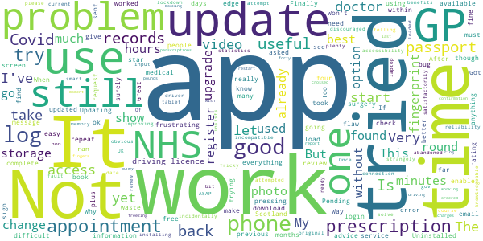

# NHS App
App version ``1.45.0``

Analyzed with [covid-apps-observer](http://github.com/covid-apps-observer) project, version ``0.1``

## App overview
| | |
|-------------------------|-------------------------| 
| **Name**&nbsp;&nbsp;&nbsp;&nbsp;&nbsp;&nbsp;&nbsp;&nbsp;&nbsp;&nbsp;&nbsp;&nbsp;&nbsp;&nbsp;&nbsp;&nbsp;&nbsp;&nbsp;&nbsp;&nbsp;&nbsp;&nbsp;&nbsp;&nbsp;&nbsp;&nbsp;&nbsp;&nbsp;&nbsp;&nbsp;&nbsp;&nbsp;&nbsp;&nbsp;&nbsp;&nbsp;&nbsp;&nbsp;&nbsp;&nbsp;  | NHS App |
| **Unique identifier** | com.nhs.online.nhsonline |
| **Link to Google Play** | [https://play.google.com/store/apps/details?id=com.nhs.online.nhsonline](https://play.google.com/store/apps/details?id=com.nhs.online.nhsonline) |
| **Summary**  | Access NHS services in England |
| **Privacy policy** | [https://www.nhs.uk/using-the-nhs/nhs-services/the-nhs-app/privacy/](https://www.nhs.uk/using-the-nhs/nhs-services/the-nhs-app/privacy/) |
| **Latest version** | 1.45.0 |
| **Last update** | 2021-02-05 10:21:45 |
| **Recent changes** | Bug fixes, and various performance, stability and accessibility enhancements. |
| **Installs**  | 1,000,000+ |
| **Category** | Medical |
| **First release** | Dec 31, 2018 |
| **Size**  | 56M |
| **Supported Android version**  | 5.0 and up |

### Description
> <b>This is not the NHS COVID-19 app. To download the NHS COVID-19 contact tracing app, go to covid19.nhs.uk</b>
 Owned and run by the NHS, the NHS App is a simple and secure way to access a range of NHS services on your smartphone or tablet.
 To use the NHS App you must be aged 13 and over and registered with a GP surgery in England.
 You can also access NHS App services from the browser on your desktop or laptop computer. Go to www.nhs.uk/app
 Use the NHS App to:
 •	get advice about coronavirus
 •	order your repeat prescriptions
 •	book and manage appointments at your GP surgery
 •	get health information and advice
 •	view your health record securely
 •	register your organ donation decision
 •	find out how the NHS uses your data
 If your GP surgery or hospital offers other services in the NHS App, you may be able to:
 •	message your GP surgery, doctor or health professional online
 •	consult a GP or health professional through an online form and get a reply
 •	access health services on behalf of someone you care for
 •	view your hospital and other healthcare appointments
 •	view useful links your doctor or health professional has shared with you
 •	view and manage your care plans
 Get advice about coronavirus 
 ---------------------------------------
 Get information about coronavirus and find out what to do if you think you have it.
 Order repeat prescriptions 
 -----------------------------------
 See your available medicines, request a new repeat prescription and choose a pharmacy for your prescriptions to be sent to.
 Book appointments
 --------------------------
 Search for, book and cancel appointments at your GP surgery. See details of your upcoming and past appointments.
 Get health advice
 -----------------------------
 Search trusted NHS information and advice on hundreds of conditions and treatments. You can also answer questions to get instant advice or medical help near you. 
 View your health record
 ----------------------------------
 Securely access your GP health record, to see information like your allergies and your current and past medicines. If your GP surgery has given you access to your detailed medical record, you can also see information like test results and details of your consultations. 
 Register your organ donation decision
 --------------------------------------------------
 Choose to donate some or all of your organs and check your registered decision.
 Find out how the NHS uses your data
 -------------------------------------------------
 Choose if data from your health records is shared for research and planning.
 Keeping your data secure
 ---------------------------------
 After you download the app, you will need to set up an NHS login and prove who you are. The app then securely connects to information from your GP surgery. 
 If your Android device supports fingerprint detection, you can use it to log in to the NHS App each time, instead of using a password and security code.

### User interface
The developers of the app provide the following screenshots in the Google play store.
| | | |
|:-------------------------:|:-------------------------:|:-------------------------:|
 |   |   |   | 
 |   |   |   | 
 |   |   |   | 
 |   |   |   | 
 |   |   |   | 
 |   |   |   | 

## Development team
In the following we report the main information provided by the development team in the Google play store.

| | |
|-------------------------|-------------------------|
| **Developer**  | NHS Digital |
| **Website**  | [https://www.nhs.uk/using-the-nhs/nhs-services/the-nhs-app/help/](https://www.nhs.uk/using-the-nhs/nhs-services/the-nhs-app/help/) |
| **Email** | nhsapp@nhs.net |
| **Physical address**  | - |
| **Other developed apps**  | [https://play.google.com/store/apps/developer?id=NHS+Digital](https://play.google.com/store/apps/developer?id=NHS+Digital) |

## Android support

| | |
|-------------------------|-------------------------|
| **Declared target Android version**  | Android10, version 10 (API level 29) |
| **Effective target Android version**  | Android10, version 10 (API level 29) |
| **Minimum supported Android version**  | Lollipop, version 5.0 (API level 21) |
| **Maximum target Android version**  | - |

The larger the difference between the minimum and maximum supported Android versions, the better. A larger difference means a wider audience. For example, old phones have a very low Android version, so a high minimum supported Android version means that the app cannot be used by users with old phones, thus leading to accessibility problems. 

## Requested permissions

In the following we report the complete list of the permissions requested by the app. 

| **Permission** | **Protection level** | **Description** | 
|-------------------------|-------------------------|-------------------------|
 **android.permission ACCESS_FINE_LOCATION** | :warning:**Dangerous** | Allows an app to access precise location. 
 **android.permission ACCESS_NETWORK_STATE** | Normal | Allows applications to access information about networks. 
 **android.permission CAMERA** | :warning:**Dangerous** | Required to be able to access the camera device. 
 **android.permission INTERNET** | Normal | Allows applications to open network sockets. 
 **android.permission MODIFY_AUDIO_SETTINGS** | Normal | Allows an application to modify global audio settings. 
 **android.permission NFC** | Normal | Allows applications to perform I/O operations over NFC. 
 **android.permission READ_EXTERNAL_STORAGE** | :warning:**Dangerous** | Allows an application to read from external storage. 
 **android.permission READ_PHONE_STATE** | :warning:**Dangerous** | Allows read only access to phone state, including the phone number of the device, current cellular network information, the status of any ongoing calls, and a list of any PhoneAccounts registered on the device. 
 **android.permission RECORD_AUDIO** | :warning:**Dangerous** | Allows an application to record audio. 
 **android.permission USE_FINGERPRINT** | Normal | This constant was deprecated in API level 28. Applications should request USE_BIOMETRIC instead 
 **android.permission WAKE_LOCK** | Normal | Allows using PowerManager WakeLocks to keep processor from sleeping or screen from dimming. 
 **android.permission WRITE_EXTERNAL_STORAGE** | :warning:**Dangerous** | Allows an application to write to external storage. 
 **com.google.android.c2dm.permission RECEIVE** | - | - 
 **com.google.android.finsky.permission BIND_GET_INSTALL_REFERRER_SERVICE** | - | - 
 **org.fidoalliance.uaf.permissions FIDO_CLIENT** | - | - 

## Mentioned servers

| **Server** | **Registrant** | **Registrant country** | **Creation date** | 
|-------------------------|-------------------------|-------------------------|-------------------------|
 | googlesyndication.com | Google LLC | :us: US | 2003-01-21 06:17:24 |
 | google.com | Google LLC | :us: US | 1997-09-15 04:00:00 |
 | app-measurement.com | Google LLC | :us: US | 2015-06-19 20:13:31 |

## Security analysis 

Below we report the main security warnings raised by our execution of the [Androwarn](https://github.com/maaaaz/androwarn) security analysis tool.

**Connection interfaces exfiltration**
> - This application reads details about the currently active data network 

**Telephony services abuse**
> - This application makes phone calls 

**Suspicious connection establishment**
> - This application opens a Socket and connects it to the remote address '; port is out of range' on the 'N/A' port  
> - This application opens a Socket and connects it to the remote address 'Lc/b/b/a/a;->w(Ljava/lang/String;)Ljava/lang/StringBuilder;' on the 'N/A' port  
> - This application opens a Socket and connects it to the remote address 'Ljava/net/Proxy;->type()Ljava/net/Proxy$Type;' on the 'N/A' port  
> - This application opens a Socket and connects it to the remote address 'timeout' on the 'N/A' port  

**Code execution**
> - This application loads a native library: 'DocumentCropper' 
> - This application loads a native library: 'Integrity' 
> - This application loads a native library: 'Liveness' 
> - This application loads a native library: 'Ocr' 
> - This application loads a native library: 'Preflight' 
> - This application loads a native library: 'Quality' 
> - This application loads a native library: 'gnustl_shared' 
> - This application loads a native library: 'lept' 
> - This application loads a native library: 'opencv_java3' 
> - This application loads a native library: 'tensorflow_inference' 
> - This application loads a native library: 'tensorflow_jni' 
> - This application loads a native library: 'tess' 

## User ratings and reviews

Below we provide information about how end users are reacting to the app in terms of ratings and reviews in the Google Play store.

### Ratings

The NHS App app has been installed by more than **1000000** times. At this time, **6190** rated the app and its average score is **3.772655**. Below we show the distribution of the ratings across the usual star-based rating of Google Play

:star::star::star::star::star:: 3435

:star::star::star::star:: 836

:star::star::star:: 305

:star::star:: 305

:star:: 1309

### Reviews 

#### 5-star reviews

> Easy to use  :date: __2021-02-06 15:43:05__

> So easy to re-order my prescriptions  :date: __2021-02-06 13:42:27__

> Easy to use  :date: __2021-02-06 13:37:34__

> Great app. Saves keep pestering your Dr.  :date: __2021-02-06 12:48:52__

> Trusted accurate  :date: __2021-02-06 11:32:49__

> So much better than speaking to a stroppy person on reception  :date: __2021-02-06 09:31:48__

> The app is easy to use and navigate  :date: __2021-02-05 23:38:27__

> Very easy to use  :date: __2021-02-05 20:07:13__

> Makes sense, everybody should down load it  :date: __2021-02-05 20:00:44__

> Its good  :date: __2021-02-05 17:23:17__

#### 4-star reviews

> Very simple and easy to use  :date: __2021-02-06 09:02:29__

> Good but hard to register still stuck on wife's doctors practice could not supply I'd information. As requested by app  :date: __2021-02-05 17:44:32__

> Can't complete registration. Can't open camcorder. Edit...... No works.had to register with different device  :date: __2021-02-05 13:26:29__

> I find it very helpful and easy to use. The drawbacks is that I can't download the app into my wife phone even after trying over twenty times at different times of the day  :date: __2021-02-05 13:03:58__

> Great app, my only criticism would be is still receiving security codes after ticking to 'remember this device'  :date: __2021-02-04 19:31:45__

> Up until the last month I have not had any issues. However I ordered several medications and one if them was not included. I suspected that I mustn't have selected it and reordered it, however on checking I saw that the app had still not sent the orser through and I had to try again. This time it was ordered. This however means that I have had to continue using a 28 day expiry medication past its expiry!  :date: __2021-02-04 13:51:10__

> Took a while to set up but that was expected as information is private. Easy to use and easy access if information  :date: __2021-02-01 22:31:04__

> Works fine  :date: __2021-02-01 10:12:00__

> Very useful app. Much easier to order a repeat prescription  :date: __2021-01-30 22:53:07__

> Easy to use  :date: __2021-01-29 05:06:48__

#### 3-star reviews

> The log in took over four hours to complete. It will not load on my laptop. Once everything is up loaded on to a smart phone. you log in to check perscriptions all you get is an error message. I still do not know if they have been ordered and they have just ran out, so now still have to ring to find out. the phone charges are now over forty pounds. A complete waste of time and money !!!!!!!! I now have no error messages so all is working at the moment, fingers crossed up the star rating .  :date: __2021-02-03 16:12:08__

> The app has been freezing for last few days. I have sent a report but its still doing it  :date: __2021-02-02 18:35:20__

> I have asked for the confirmation email to start but had no email sent to me, must of tried 30 times now  :date: __2021-02-01 15:42:12__

> Great app very useful just wish I could make an appointment on this app here  :date: __2021-01-29 16:59:16__

> Very difficult if you don't have passport or driving licence  :date: __2021-01-24 20:37:05__

> When GP appointment booking is going to restart?  :date: __2021-01-22 17:20:42__

> Good updated information as needed.  :date: __2021-01-18 17:04:45__

> "we could not change your fingerprint setting". But every other app can.  :date: __2021-01-15 21:22:44__

> Too many screens, log in is not the easiest.  :date: __2021-01-14 17:09:57__

> Gps need to sign up to this then it will work  :date: __2021-01-06 09:27:43__

#### 2-star reviews

> App is great concept...but varification to set it up is a nightmare! Confirming your ID is a problem at the point when you have to do a video and talk 4 secure numbers given to you. The start video now does not find video function and you have no search options as it retainsand goes auto to the galley from when you took a photo of your chosen ID to send.  :date: __2021-02-06 15:12:32__

> Disappointed, took a couple of attempts to originally set up, also it the issue of out of date medical records, last entry was for a vaccination in 2013, no mention of the bowel cancer I was diagnosed and treated for in 2019.  :date: __2021-02-06 11:14:26__

> It keeps wanting updates it seems...each time I come to use it...a bit of a bore  :date: __2021-02-04 10:29:07__

> It won't accept any video verification even on my huawei 2019!  :date: __2021-02-02 19:11:58__

> Tried 12times to dwn load video with numbas n no replys won't take it, infuriating,,!!! Tried writings numbas!!! Nooooope  :date: __2021-02-01 18:46:24__

> needs to update nhs calls on appointments you have done through app for medical advice please  :date: __2021-01-31 22:46:33__

> After finaly managing to pass security and log in ,I am celebrating this huge milestone with members of my bubble,we are having a meal ,party poppers, balloons and a firework display in the garden later ,the retina scan and DNA sample were a bit over the top!  :date: __2021-01-31 14:52:00__

> So far unable to access any information from my health record and the surgery can offer no advice. Next to useless app.  :date: __2021-01-31 11:35:15__

> Registration was a fairly clumsy mess - I really don't know why you can't use my already verified tax ID. Anyway, now that I am verified I cannot close the app properly. as it won't log out. I will probably delete it and use the web based version on my computer  :date: __2021-01-31 10:38:37__

> Not very good.  :date: __2021-01-27 20:33:06__

#### 1-star reviews

> Hangs, doesn't want to start. Can't get past the first blue screen.  :date: __2021-02-06 19:23:07__

> 06.02.21 - after multiple attempts I have finally managed to register. Why on earth this app couldn't use the gov.uk verify service I don't know. Having registered I find that my local GP practice is still in the 19th century and I can't do anything:-( Very bad registration procedure. App fails to connect to my (Android 10) phone camera to take a picture of my ID, then does so to scan my face but the image recognition is pants. I am binning this as an utter waste of time and taxpayers money.  :date: __2021-02-06 19:12:16__

> Frustrating  :date: __2021-02-06 16:40:09__

> Less use than a chocolate teapot. At least you can eat that. Litrally nothing works.. No prescriptions(error). No bookings just phone no. No access to my records. I presume the purpose of this app was to tick a box to say the nhs has an app. Well done Chaps Stirling achievement. I hope you don't mind if I don't clap for this one :(  :date: __2021-02-06 09:26:10__

> Could not register as video upload does not work. They admit this and ask you to keep on trying. Don't waste your time unless you have hours to spare. Their response suggests spending more time messing about with your phone settings . They have not trialled this sufficiently to make it readily usable to Android users.  :date: __2021-02-06 00:15:42__

> This is a waste of time, takes forever to complete and I get a response that I am not registered to any GP Service which is nonsense because I have been with my GP for the last 50 years, absolutely a waste of time  :date: __2021-02-05 17:35:24__

> Unable to get vaccine  :date: __2021-02-05 15:41:11__

> The selection says "View your GP health record" yet it literally only shows what medication you've had. That's it. Pointless.  :date: __2021-02-05 06:54:52__

> Waste of time. It won't recognise any of my details  :date: __2021-02-04 22:50:34__

> If you are doing the complete logging in on just a mobile there's issues. When your are sent a confirmation number it disappears almost immediately from top of frame . If you then go to incoming messages to get the number, you cannot then get back to the nhs screen. More time should be allowed for users, particularly the elderly.  :date: __2021-02-04 19:17:52__

