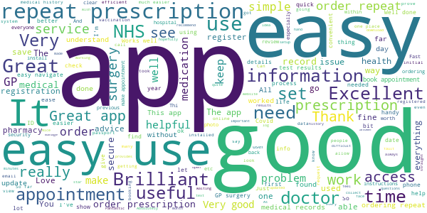
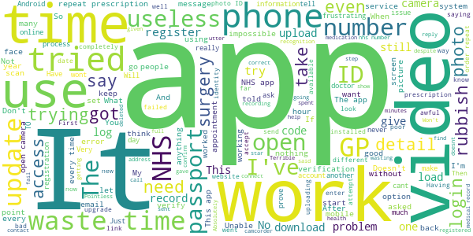

# NHS App
App version ``1.46.0``

Analyzed with [covid-apps-observer](http://github.com/covid-apps-observer) project, version ``0.1``

## App overview
| | |
|-------------------------|-------------------------| 
| **Name**&nbsp;&nbsp;&nbsp;&nbsp;&nbsp;&nbsp;&nbsp;&nbsp;&nbsp;&nbsp;&nbsp;&nbsp;&nbsp;&nbsp;&nbsp;&nbsp;&nbsp;&nbsp;&nbsp;&nbsp;&nbsp;&nbsp;&nbsp;&nbsp;&nbsp;&nbsp;&nbsp;&nbsp;&nbsp;&nbsp;&nbsp;&nbsp;&nbsp;&nbsp;&nbsp;&nbsp;&nbsp;&nbsp;&nbsp;&nbsp;  | NHS App |
| **Unique identifier** | com.nhs.online.nhsonline |
| **Link to Google Play** | [https://play.google.com/store/apps/details?id=com.nhs.online.nhsonline](https://play.google.com/store/apps/details?id=com.nhs.online.nhsonline) |
| **Summary**  | Access NHS services in England |
| **Privacy policy** | [https://www.nhs.uk/using-the-nhs/nhs-services/the-nhs-app/privacy/](https://www.nhs.uk/using-the-nhs/nhs-services/the-nhs-app/privacy/) |
| **Latest version** | 1.46.0 |
| **Last update** | 2021-02-25 17:29:36 |
| **Recent changes** | Bug fixes, and various performance, stability and accessibility enhancements. |
| **Installs**  | 1,000,000+ |
| **Category** | Medical |
| **First release** | Dec 31, 2018 |
| **Size**  | 56M |
| **Supported Android version**  | 5.0 and up |

### Description
> <b>This is not the NHS COVID-19 app. To download the NHS COVID-19 contact tracing app, go to covid19.nhs.uk</b>
 Owned and run by the NHS, the NHS App is a simple and secure way to access a range of NHS services on your smartphone or tablet.
 To use the NHS App you must be aged 13 and over and registered with a GP surgery in England.
 You can also access NHS App services from the browser on your desktop or laptop computer. Go to www.nhs.uk/app
 Use the NHS App to:
 •	get advice about coronavirus
 •	order your repeat prescriptions
 •	book and manage appointments at your GP surgery
 •	get health information and advice
 •	view your health record securely
 •	register your organ donation decision
 •	find out how the NHS uses your data
 If your GP surgery or hospital offers other services in the NHS App, you may be able to:
 •	message your GP surgery, doctor or health professional online
 •	consult a GP or health professional through an online form and get a reply
 •	access health services on behalf of someone you care for
 •	view your hospital and other healthcare appointments
 •	view useful links your doctor or health professional has shared with you
 •	view and manage your care plans
 Get advice about coronavirus 
 ---------------------------------------
 Get information about coronavirus and find out what to do if you think you have it.
 Order repeat prescriptions 
 -----------------------------------
 See your available medicines, request a new repeat prescription and choose a pharmacy for your prescriptions to be sent to.
 Book appointments
 --------------------------
 Search for, book and cancel appointments at your GP surgery. See details of your upcoming and past appointments.
 Get health advice
 -----------------------------
 Search trusted NHS information and advice on hundreds of conditions and treatments. You can also answer questions to get instant advice or medical help near you. 
 View your health record
 ----------------------------------
 Securely access your GP health record, to see information like your allergies and your current and past medicines. If your GP surgery has given you access to your detailed medical record, you can also see information like test results and details of your consultations. 
 Register your organ donation decision
 --------------------------------------------------
 Choose to donate some or all of your organs and check your registered decision.
 Find out how the NHS uses your data
 -------------------------------------------------
 Choose if data from your health records is shared for research and planning.
 Keeping your data secure
 ---------------------------------
 After you download the app, you will need to set up an NHS login and prove who you are. The app then securely connects to information from your GP surgery. 
 If your Android device supports fingerprint detection, you can use it to log in to the NHS App each time, instead of using a password and security code.

### User interface
The developers of the app provide the following screenshots in the Google play store.
| | | |
|:-------------------------:|:-------------------------:|:-------------------------:|
 |   |   |   | 
 |   |   |   | 
 |   |   |   | 
 |   |   |   | 
 |   |   |   | 
 |   |   |   | 

## Development team
In the following we report the main information provided by the development team in the Google play store.

| | |
|-------------------------|-------------------------|
| **Developer**  | NHS Digital |
| **Website**  | [https://www.nhs.uk/using-the-nhs/nhs-services/the-nhs-app/help/](https://www.nhs.uk/using-the-nhs/nhs-services/the-nhs-app/help/) |
| **Email** | nhsapp@nhs.net |
| **Physical address**  | - |
| **Other developed apps**  | [https://play.google.com/store/apps/developer?id=NHS+Digital](https://play.google.com/store/apps/developer?id=NHS+Digital) |

## Android support

| | |
|-------------------------|-------------------------|
| **Declared target Android version**  | Android10, version 10 (API level 29) |
| **Effective target Android version**  | Android10, version 10 (API level 29) |
| **Minimum supported Android version**  | Lollipop, version 5.0 (API level 21) |
| **Maximum target Android version**  | - |

The larger the difference between the minimum and maximum supported Android versions, the better. A larger difference means a wider audience. For example, old phones have a very low Android version, so a high minimum supported Android version means that the app cannot be used by users with old phones, thus leading to accessibility problems. 

## Requested permissions

In the following we report the complete list of the permissions requested by the app. 

| **Permission** | **Protection level** | **Description** | 
|-------------------------|-------------------------|-------------------------|
 **android.permission ACCESS_FINE_LOCATION** | :warning:**Dangerous** | Allows an app to access precise location. 
 **android.permission ACCESS_NETWORK_STATE** | Normal | Allows applications to access information about networks. 
 **android.permission CAMERA** | :warning:**Dangerous** | Required to be able to access the camera device. 
 **android.permission INTERNET** | Normal | Allows applications to open network sockets. 
 **android.permission MODIFY_AUDIO_SETTINGS** | Normal | Allows an application to modify global audio settings. 
 **android.permission NFC** | Normal | Allows applications to perform I/O operations over NFC. 
 **android.permission READ_EXTERNAL_STORAGE** | :warning:**Dangerous** | Allows an application to read from external storage. 
 **android.permission READ_PHONE_STATE** | :warning:**Dangerous** | Allows read only access to phone state, including the phone number of the device, current cellular network information, the status of any ongoing calls, and a list of any PhoneAccounts registered on the device. 
 **android.permission RECORD_AUDIO** | :warning:**Dangerous** | Allows an application to record audio. 
 **android.permission USE_FINGERPRINT** | Normal | This constant was deprecated in API level 28. Applications should request USE_BIOMETRIC instead 
 **android.permission WAKE_LOCK** | Normal | Allows using PowerManager WakeLocks to keep processor from sleeping or screen from dimming. 
 **android.permission WRITE_EXTERNAL_STORAGE** | :warning:**Dangerous** | Allows an application to write to external storage. 
 **com.google.android.c2dm.permission RECEIVE** | - | - 
 **com.google.android.finsky.permission BIND_GET_INSTALL_REFERRER_SERVICE** | - | - 
 **org.fidoalliance.uaf.permissions FIDO_CLIENT** | - | - 

## Mentioned servers

| **Server** | **Registrant** | **Registrant country** | **Creation date** | 
|-------------------------|-------------------------|-------------------------|-------------------------|
 | googlesyndication.com | Google LLC | :us: US | 2003-01-21 06:17:24 |
 | google.com | Google LLC | :us: US | 1997-09-15 04:00:00 |
 | app-measurement.com | Google LLC | :us: US | 2015-06-19 20:13:31 |

## Security analysis 

Below we report the main security warnings raised by our execution of the [Androwarn](https://github.com/maaaaz/androwarn) security analysis tool.

**Connection interfaces exfiltration**
> - This application reads details about the currently active data network 

**Telephony services abuse**
> - This application makes phone calls 

**Suspicious connection establishment**
> - This application opens a Socket and connects it to the remote address '; port is out of range' on the 'N/A' port  
> - This application opens a Socket and connects it to the remote address 'Lc/b/b/a/a;->w(Ljava/lang/String;)Ljava/lang/StringBuilder;' on the 'N/A' port  
> - This application opens a Socket and connects it to the remote address 'Ljava/net/Proxy;->type()Ljava/net/Proxy$Type;' on the 'N/A' port  
> - This application opens a Socket and connects it to the remote address 'timeout' on the 'N/A' port  

**Code execution**
> - This application loads a native library: 'DocumentCropper' 
> - This application loads a native library: 'Integrity' 
> - This application loads a native library: 'Liveness' 
> - This application loads a native library: 'Ocr' 
> - This application loads a native library: 'Preflight' 
> - This application loads a native library: 'Quality' 
> - This application loads a native library: 'gnustl_shared' 
> - This application loads a native library: 'lept' 
> - This application loads a native library: 'opencv_java3' 
> - This application loads a native library: 'tensorflow_inference' 
> - This application loads a native library: 'tensorflow_jni' 
> - This application loads a native library: 'tess' 

## User ratings and reviews

Below we provide information about how end users are reacting to the app in terms of ratings and reviews in the Google Play store.

### Ratings

The NHS App app has been installed by more than **1000000** times. At this time, **6514** rated the app and its average score is **3.7331288**. Below we show the distribution of the ratings across the usual star-based rating of Google Play

:star::star::star::star::star:: 3588

:star::star::star::star:: 809

:star::star::star:: 319

:star::star:: 389

:star:: 1409

### Reviews 

#### 5-star reviews

> Great app - saves having to visit surgery to request/collect repeat prescriptions!  :date: __2021-03-06 12:37:19__

> Good  :date: __2021-03-06 02:03:49__

> Great, easy to use once it has been set up. Has my appointments and prescriptions, brilliant no struggling with the surgery online system, that was rubbish long winded and not user friendly.  :date: __2021-03-05 18:15:24__

> It keeps getting bettet  :date: __2021-03-05 16:11:49__

> Helps me discover how to help myself  :date: __2021-03-05 15:11:44__

> The app has worked really well for me. Easy to set up and use. It has helped me manage my health and the convenience of ordering prescriptions is great.  :date: __2021-03-05 10:46:35__

> Easy to use & has everything you need in one place. Allows medical staff to notify it's patients if needed.  :date: __2021-03-04 19:21:44__

> Fast, efficient, safe.  :date: __2021-03-04 12:33:46__

> Very convenient  :date: __2021-03-04 10:41:45__

> This app is great, kudos to the NHS for putting out such a highly functional and really easy to setup app. It's super useful being able to organise appointments, reorder prescriptions and see my medical records all in this secure app. Brill.  :date: __2021-03-04 00:13:44__

#### 4-star reviews

> Much easier to use than Patient Access plus you can add other personal information too.  :date: __2021-03-06 11:41:15__

> A bit clunky but it does actually do what you would expect it to do. For example, you can see your test results in detail and ordering a repeat prescription is easy.  :date: __2021-03-06 11:13:41__

> I was surprised it worked! Was shocked when the scanning confirmed my identity! Just for those two features it deserves a good review. One day my GP will stop asking me to fax letters to them.  :date: __2021-03-05 23:17:43__

> After a long yet seemingly secure registration app is functioning. Would like to lock app with pin in future update. The use camera icon did not work for me during registration. I had to leave app, take id picture, return to app a retrieve photo from gallery. Looks to be a really useful app as it evolves.  :date: __2021-03-04 01:23:38__

> Easy to use once it is set up  :date: __2021-03-01 12:28:07__

> Good, seems to do everything pretty well. One complaint I have is that you have to get a security code via SMS, but like many people I have very poor mobile reception where I live which makes the registration rather hit or miss - I do wish apps and services in general provided an alternative means of 2FA.  :date: __2021-02-28 16:11:07__

> Installation and verification of identity were fairly straightforward. Verification of identity involved several steps and was quite convoluted but it all followed through and was logical. I am reassured that such rigorous steps are required to access such sensitive personal data. I have yet to make substantial use of the app so I can't comment on that yet.  :date: __2021-02-25 19:17:41__

> Very useful to have at hand  :date: __2021-02-25 18:59:25__

> Very good service  :date: __2021-02-25 10:43:57__

> Seems to do most things I need.  :date: __2021-02-24 23:02:38__

#### 3-star reviews

> My husband and I both have the app. His shows "Consultations and Events" including the fact that he has had one vaccination but mine does not have this option. How can I get this?  :date: __2021-03-05 18:14:31__

> Finally able to register on my tablet by using URL supplied by support. The now registered app works on my phone using the same credentials. Note that the Airmid app still works fine and allows notes to be edited into your medical record.  :date: __2021-03-05 11:51:32__

> So I have the app and can see my meds and allergies, but not my medical records. The GP has given me two codes - one an "ODS" code (?) but I'm blowed if I can see where to enter them. Help! I've sought and obtained my GP's permission to accesss my records and had an email from them to confirm, but nothing has changed on the app. What do I do now?  :date: __2021-03-02 10:51:16__

> The back button should return to the previous page rather than prompt to log you out on any screen you press it. Would also be nice if it used the Android 10 biometric API, to allow other login types than just finger print.  :date: __2021-02-26 16:46:25__

> It's got better, but still run by people who REALLY don't understand CUSTOMERS. They understand 'following their view of "the rules"'. ||| So \*\*\*\*\*\** complicated with so much jargon that I couldn't even install it. Complete and utter fail. Written by civil servants?  :date: __2021-02-25 02:19:17__

> Very nice service  :date: __2021-02-23 21:29:38__

> It's working thank you  :date: __2021-02-23 18:31:33__

> Tricky to register on this if you are a non-driver without a current passport (and who needs to renew a passport in a lockdown?). I've yet to make this work. I was discouraged by this and abandoned a previous attempt, but still pressing on for now this time. And, incidentally, though I can download this to my tablet, the Covid NHS one is incompatible. The benefits to all in better accessibility must be obvious, surely? Way to go with improving the reliability of your statistics!  :date: __2021-02-20 00:45:31__

> Tried to update the app and it won't work. Uninstalled the original to start again and that won't load. Is there a problem I a ready had the app on my phone and have been using it satisfactorily for months. It was only when I was asked to update it and it wouldn't let me use it until I did, that I had problems with it. My phone is up to date and has plenty of storage and memory. It is the app which has the problem. It was fine until the update.  :date: __2021-02-12 02:53:10__

> Not the best app I've ever attempted to use, insists on telling me there's a problem with my connection, strangely everything else on my phone works! Of course UK gov can't be their fault now can it. Could be a very good app with a bit of knowledgeable input  :date: __2021-02-09 14:18:03__

#### 2-star reviews

> I try to order my repeat prescriptions on this app, but every month it tells me that it needs a review. So I have to submit paper requests. There is no text box available in the repeat prescriptions section except for the ones that are not being reviewed.  :date: __2021-03-06 11:41:13__

> The app keeps cutting off when in middle of my medical records.  :date: __2021-03-03 21:39:57__

> Sometjmes hitty missy  :date: __2021-03-03 19:45:38__

> Despitw saving settings have to keep getting verification code  :date: __2021-03-03 11:38:51__

> I am at present trying to initiate this app on my android. I have reset my password about 4 times as it fails to recognise it - - Each time I use the same one which is usually not allowed but seems to cause no problem here. At least I did get to the code sending. each time so it is accepted. It seems I am now stuck in a never ending groundhog day of retrieving the code but finding the app reset in the meantime so I have to start again .and of course the code doesn't work. I tried on my computer but because I don't have a web cam - - - I finally did it on my phone - -now waiting for email confirmation. I may amend the star rating if I manage to actually get started and use the service - - - -  :date: __2021-03-02 18:49:46__

> Didn't have the registration problems reported by others, that all worked (if a bit long-drawn-out). But the app itself is flaky; it keeps freezing with an unresponsive screen. I have to close & re-open it, often several times, before I can get to the screen I want (has been reported via the app, but no response). And it's selective in what it shows, for example it doesn't show my Covid vaccination appointments but (after the 1st one) does record the fact of the vaccination. If this is going to be the vehicle for "vaccination passports", it needs to be more reliable. UPDATE: Following developer response asking me to raise a support ticket, I have now done that. Note I had already done this, having raised the issue directly from within the app, but have had no response. But I'll do it again, more in hope than with any confidence that anything will change.  :date: __2021-03-02 14:15:02__

> Great when it works, but get error messages more than access. Very hard to depend on, works one day and not the next.  :date: __2021-03-02 13:35:13__

> I see that I'm not the only one having troubles with this app, It will be very helpful for me and for many others with chronic illnesses to be able to see results to check progress or not and show to our GPs it was suggested to me to download it but has got me anywhere and only stress me more.  :date: __2021-02-28 20:10:43__

> I have spent a long time trying to register. Each time I get so far and then have to go back to start. Eventually I successfully uploaded a picture of my driving license but the scanning confirmation did not work so I tried the alternative video confirmation which appears to not work at all ( confirmed by another reviewer) and I cant get back to the scanning option to try that again. I appear to be completely stuck , what can I try.  :date: __2021-02-26 19:02:52__

> After several attempts to verify my identity it finally accepted me , I'm disappointed that my GP records are not accessible only appointments and prescriptions which I usually do through the patient access app , waste of space . There is no summary at all .  :date: __2021-02-26 10:05:50__

#### 1-star reviews

> Gave up after trying to download for over 3 hours . I am based in the UK using my hone wi fi system on a UK number I was trying to download from the Google store. My device settings are fin it's only this app that doesn't work  :date: __2021-03-05 19:32:10__

> Horrendous experience with this app, never allowed me to get a repeat prescription which I have been told is because its opioid based, so what is the point to the app? None left for days in agony because of no meds.  :date: __2021-03-05 13:43:59__

> Doesnt load  :date: __2021-03-05 10:39:09__

> Can't prove who I am because my photo is different from license because lockdown.  :date: __2021-03-05 09:57:46__

> Logging on and proving your identity is so unworkable I never got a chance to try the app  :date: __2021-03-04 20:32:45__

> Why does it ask for a video, which it then refuses? The system is hopeless. Won't be able to use it for proof of vaccination.  :date: __2021-03-04 16:19:49__

> Typical government app. Much too complicated to register and prove id, having submitted photo of passport it then wanted a video of me speaking 4 numbers but failed to open camera. I will go back to ringing surgery every month for repeat prescriptions. I've been using Patient Access app for years with no problems  :date: __2021-03-04 15:05:08__

> Will not install on my phone  :date: __2021-03-04 12:02:24__

> Wouldn't even download properly  :date: __2021-03-04 10:34:45__

> After contacting my GP practice (I was number 14 in the queue which meant a 30-min wait before getting through) they emailed a linkage key with the practice ODS code & account number: These are needed to login if you don't have a current photo ID. So I now have access to the app's services. Having jumped through hoops to get in, I find that most of my medical records are missing: 5 decades' worth! This isn't right. I am so angry. Seems like I have even more hoops to jump through!  :date: __2021-03-04 10:09:52__

