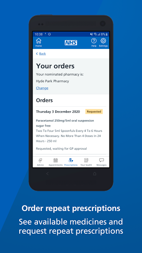
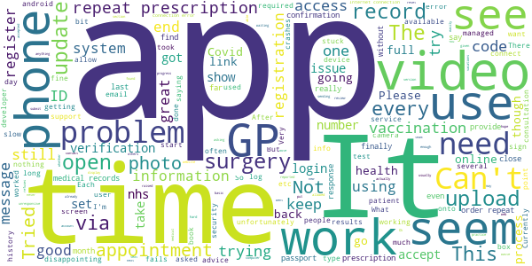

# NHS App
App version ``1.46.0``

Analyzed with [covid-apps-observer](http://github.com/covid-apps-observer) project, version ``0.1``

## App overview
| | |
|-------------------------|-------------------------| 
| **Name**                                          | NHS App |
| **Unique identifier** | com.nhs.online.nhsonline |
| **Link to Google Play** | [https://play.google.com/store/apps/details?id=com.nhs.online.nhsonline](https://play.google.com/store/apps/details?id=com.nhs.online.nhsonline) |
| **Summary**  | Access NHS services in England |
| **Privacy policy** | [https://www.nhs.uk/using-the-nhs/nhs-services/the-nhs-app/privacy/](https://www.nhs.uk/using-the-nhs/nhs-services/the-nhs-app/privacy/) |
| **Latest version** | 1.46.0 |
| **Last update** | 2021-02-25 17:29:36 |
| **Recent changes** | Bug fixes, and various performance, stability and accessibility enhancements. |
| **Installs**  | 1,000,000+ |
| **Category** | Medical |
| **First release** | Dec 31, 2018 |
| **Size**  | 56M |
| **Supported Android version**  | 5.0 and up |

### Description
> <b>This is not the NHS COVID-19 app. To download the NHS COVID-19 contact tracing app, go to covid19.nhs.uk</b>
 Owned and run by the NHS, the NHS App is a simple and secure way to access a range of NHS services on your smartphone or tablet.
 To use the NHS App you must be aged 13 and over and registered with a GP surgery in England.
 You can also access NHS App services from the browser on your desktop or laptop computer. Go to www.nhs.uk/app
 Use the NHS App to:
 •	get advice about coronavirus
 •	order your repeat prescriptions
 •	book and manage appointments at your GP surgery
 •	get health information and advice
 •	view your health record securely
 •	register your organ donation decision
 •	find out how the NHS uses your data
 If your GP surgery or hospital offers other services in the NHS App, you may be able to:
 •	message your GP surgery, doctor or health professional online
 •	consult a GP or health professional through an online form and get a reply
 •	access health services on behalf of someone you care for
 •	view your hospital and other healthcare appointments
 •	view useful links your doctor or health professional has shared with you
 •	view and manage your care plans
 Get advice about coronavirus 
 ---------------------------------------
 Get information about coronavirus and find out what to do if you think you have it.
 Order repeat prescriptions 
 -----------------------------------
 See your available medicines, request a new repeat prescription and choose a pharmacy for your prescriptions to be sent to.
 Book appointments
 --------------------------
 Search for, book and cancel appointments at your GP surgery. See details of your upcoming and past appointments.
 Get health advice
 -----------------------------
 Search trusted NHS information and advice on hundreds of conditions and treatments. You can also answer questions to get instant advice or medical help near you. 
 View your health record
 ----------------------------------
 Securely access your GP health record, to see information like your allergies and your current and past medicines. If your GP surgery has given you access to your detailed medical record, you can also see information like test results and details of your consultations. 
 Register your organ donation decision
 --------------------------------------------------
 Choose to donate some or all of your organs and check your registered decision.
 Find out how the NHS uses your data
 -------------------------------------------------
 Choose if data from your health records is shared for research and planning.
 Keeping your data secure
 ---------------------------------
 After you download the app, you will need to set up an NHS login and prove who you are. The app then securely connects to information from your GP surgery. 
 If your Android device supports fingerprint detection, you can use it to log in to the NHS App each time, instead of using a password and security code.

### User interface
The developers of the app provide the following screenshots in the Google play store.
| | | |
|:-------------------------:|:-------------------------:|:-------------------------:|
 |   |   |   | 
 |   |   |   | 
 |   |   |   | 
 |   |   |   | 
 |   |   |   | 
 |   |   |   | 

## Development team
In the following we report the main information provided by the development team in the Google play store.

| | |
|-------------------------|-------------------------|
| **Developer**  | NHS Digital |
| **Website**  | [https://www.nhs.uk/using-the-nhs/nhs-services/the-nhs-app/help/](https://www.nhs.uk/using-the-nhs/nhs-services/the-nhs-app/help/) |
| **Email** | nhsapp@nhs.net |
| **Physical address**  | - |
| **Other developed apps**  | [https://play.google.com/store/apps/developer?id=NHS+Digital](https://play.google.com/store/apps/developer?id=NHS+Digital) |

## Android support

| | |
|-------------------------|-------------------------|
| **Declared target Android version**  | Android10, version 10 (API level 29) |
| **Effective target Android version**  | Android10, version 10 (API level 29) |
| **Minimum supported Android version**  | Lollipop, version 5.0 (API level 21) |
| **Maximum target Android version**  | - |

The larger the difference between the minimum and maximum supported Android versions, the better. A larger difference means a wider audience. For example, old phones have a very low Android version, so a high minimum supported Android version means that the app cannot be used by users with old phones, thus leading to accessibility problems. 

## Requested permissions

In the following we report the complete list of the permissions requested by the app. 

| **Permission** | **Protection level** | **Description** | 
|-------------------------|-------------------------|-------------------------|
 **android.permission ACCESS_FINE_LOCATION** | :warning:**Dangerous** | Allows an app to access precise location. 
 **android.permission ACCESS_NETWORK_STATE** | Normal | Allows applications to access information about networks. 
 **android.permission CAMERA** | :warning:**Dangerous** | Required to be able to access the camera device. 
 **android.permission INTERNET** | Normal | Allows applications to open network sockets. 
 **android.permission MODIFY_AUDIO_SETTINGS** | Normal | Allows an application to modify global audio settings. 
 **android.permission NFC** | Normal | Allows applications to perform I/O operations over NFC. 
 **android.permission READ_EXTERNAL_STORAGE** | :warning:**Dangerous** | Allows an application to read from external storage. 
 **android.permission READ_PHONE_STATE** | :warning:**Dangerous** | Allows read only access to phone state, including the phone number of the device, current cellular network information, the status of any ongoing calls, and a list of any PhoneAccounts registered on the device. 
 **android.permission RECORD_AUDIO** | :warning:**Dangerous** | Allows an application to record audio. 
 **android.permission USE_FINGERPRINT** | Normal | This constant was deprecated in API level 28. Applications should request USE_BIOMETRIC instead 
 **android.permission WAKE_LOCK** | Normal | Allows using PowerManager WakeLocks to keep processor from sleeping or screen from dimming. 
 **android.permission WRITE_EXTERNAL_STORAGE** | :warning:**Dangerous** | Allows an application to write to external storage. 
 **com.google.android.c2dm.permission RECEIVE** | - | - 
 **com.google.android.finsky.permission BIND_GET_INSTALL_REFERRER_SERVICE** | - | - 
 **org.fidoalliance.uaf.permissions FIDO_CLIENT** | - | - 

## Mentioned servers

| **Server** | **Registrant** | **Registrant country** | **Creation date** | 
|-------------------------|-------------------------|-------------------------|-------------------------|
 | googlesyndication.com | Google LLC | :us: US | 2003-01-21 06:17:24 |
 | google.com | Google LLC | :us: US | 1997-09-15 04:00:00 |
 | app-measurement.com | Google LLC | :us: US | 2015-06-19 20:13:31 |

## Security analysis 

Below we report the main security warnings raised by our execution of the [Androwarn](https://github.com/maaaaz/androwarn) security analysis tool.

**Connection interfaces exfiltration**
> - This application reads details about the currently active data network 

**Telephony services abuse**
> - This application makes phone calls 

**Suspicious connection establishment**
> - This application opens a Socket and connects it to the remote address '; port is out of range' on the 'N/A' port  
> - This application opens a Socket and connects it to the remote address 'Lc/b/b/a/a;->w(Ljava/lang/String;)Ljava/lang/StringBuilder;' on the 'N/A' port  
> - This application opens a Socket and connects it to the remote address 'Ljava/net/Proxy;->type()Ljava/net/Proxy$Type;' on the 'N/A' port  
> - This application opens a Socket and connects it to the remote address 'timeout' on the 'N/A' port  

**Code execution**
> - This application loads a native library: 'DocumentCropper' 
> - This application loads a native library: 'Integrity' 
> - This application loads a native library: 'Liveness' 
> - This application loads a native library: 'Ocr' 
> - This application loads a native library: 'Preflight' 
> - This application loads a native library: 'Quality' 
> - This application loads a native library: 'gnustl_shared' 
> - This application loads a native library: 'lept' 
> - This application loads a native library: 'opencv_java3' 
> - This application loads a native library: 'tensorflow_inference' 
> - This application loads a native library: 'tensorflow_jni' 
> - This application loads a native library: 'tess' 

## User ratings and reviews

Below we provide information about how end users are reacting to the app in terms of ratings and reviews in the Google Play store.

### Ratings

The NHS App app has been installed by more than **1000000** times. At this time, **6514** rated the app and its average score is **3.7331288**. Below we show the distribution of the ratings across the usual star-based rating of Google Play

:star::star::star::star::star:: 3588

:star::star::star::star:: 809

:star::star::star:: 319

:star::star:: 389

:star:: 1409

### Reviews 

#### 5-star reviews

> Easy to use. Efficient way to deal with medical issues. Answers many questions one may have without the need of a consultation.  :date: __2021-03-20 18:56:36__

> Good  :date: __2021-03-20 13:10:44__

> Brilliant app ...no need to phone up n wait to be answered...and can choose any doctor you like ...lovely receptionists and staff ...lovely doctors too....keep up the good work 😊  :date: __2021-03-20 08:29:44__

> So far all is working fine. The set up process is abit lengthy but I feel assured that the security of the app is adequate for my protectio. Plenty of useful options available.  :date: __2021-03-19 04:09:24__

> Easy to use and helpful  :date: __2021-03-18 16:22:05__

> Very good  :date: __2021-03-18 10:22:52__

> Absolutely no issues here. The app works fine, the sign up and proving who I was worked perfectly. Love the way it links to my GP surgery to get additional info.. shame it cannot link to my Dentist as it cannot see a hospital referral they made under the NHS for me. Otherwise really impressed, good features and a very useful app if you are health conscious. Glad I found and installed it. Give it a slightly better and less clinical look and you'd have a real winner.  :date: __2021-03-18 06:46:19__

> Really good.  :date: __2021-03-17 21:31:25__

> Excellent very helpful  :date: __2021-03-17 19:30:30__

> Excellent  :date: __2021-03-16 21:43:41__

#### 4-star reviews

> A very good app if you need to get information on your medication medicall history and very good if you need to apply for personal independence payment for dwp needs a better menu but its good  :date: __2021-03-18 23:44:53__

> It's quick and easy to sign up and the verification took less than 10 minutes. It has a few good sources of information and NHS 111 advice integrated into the app. The fact that I can amend my nominated pharmacy, organ donation decision etc is great. I also appreciate that I can see my prescriptions and any messages. The app also has a familiar NHS website look and feel which reinforces the trust in the application and services provided. It also takes identity theft very seriously.  :date: __2021-03-18 23:42:56__

> I have just downloaded it today and fortunately didn't have any issues. I think the concept is good and hopefully will improve in time and as it's used more.  :date: __2021-03-18 12:19:46__

> Asks me to update app I have been trying to do this for 2 days every time it gets to 100% it goes back to pending and just keeps restarting the update  :date: __2021-03-18 07:41:06__

> Excellent level of security to set up. Simple to use once activated. Like it to arrange appointments and order prescriptions  :date: __2021-03-16 16:07:23__

> Often go in loops when willing in information, but generally a good app that's nice and freshly designed.  :date: __2021-03-15 17:36:24__

> Good  :date: __2021-03-15 16:58:39__

> Was a bit tricky to initially get set up but now I have I love it. Makes my life so much easier.  :date: __2021-03-14 09:08:59__

> Good  :date: __2021-03-13 10:44:15__

> Missing a simple comments box!  :date: __2021-03-10 16:17:00__

#### 3-star reviews

> Been mostly easy to use. Booking (covid jab) appointments though, it is just incapable of doing at the moment. Frustrating. Since you're told to not contact your surgery regarding the jab.  :date: __2021-03-20 11:27:13__

> I don't have any form of photo id which means I'm unable to prove who I am hence I can't use the app, how do I prove who I am without id  :date: __2021-03-18 23:59:51__

> Doesn't seem to include scotland  :date: __2021-03-18 13:27:32__

> Every time I go on to order my medication it tries to update.....not always successfully. If it will not, I cannot access the app. Grr,!  :date: __2021-03-18 11:36:14__

> I am unable to identify if my covid 19 Astra Zenica 2 doses has been recorded. In my medical record as I may need to use it for travel purposes..  :date: __2021-03-17 17:44:29__

> Needs some work. I have hospital, referral appointments in the next few months but the list of my hospital appointments don't show on the app it says 'no refferals'  :date: __2021-03-17 11:37:49__

> proving ID seems very very extensive hate to be such a cynic but what are the guarantees that the App is secure in itself Public Sector sourced computer progs don't have a good track record  :date: __2021-03-17 10:52:26__

> If I could make appointments would give it five  :date: __2021-03-15 08:30:41__

> It's a great app, except I cant seem to access any services, ask for advice or make any appointments with my GP, the service is always unavailable.  :date: __2021-03-11 15:45:48__

> Exceeding difficult to load identity and no ability to save and return later  :date: __2021-03-07 20:29:33__

#### 2-star reviews

> Disappointing that you have to do all verification again when get a new device  :date: __2021-03-13 17:09:23__

> It's a very slow app and I have to login every time I open the app. I think it would be good if the app saved the login information so every time I open the app I dont need to login.  :date: __2021-03-11 12:37:22__

> it needs expanding by customer services now passing messages onto the relevant people in the nhs + all GP practices in uk should now sign up to online booking for GP appointments now  :date: __2021-03-10 11:34:48__

> Downloaded the app and went through all the registration process no problem. Got onto repeat prescription part to get a prescription but still waiting to hear whether I can have prescription that I have asked for. Would have been quicker to phone the surgery and get them. What a waste of my time going through the set up process only to find the app doesn't work ☹☹  :date: __2021-03-09 11:34:54__

> I thought I would be able to record my covid lateral flow tests via the app but I can't so and had to set up online account to do so. Seems limited in what it makes available .. I also though it would show my covid vaccine appointment details but nothing shows.  :date: __2021-03-07 15:11:06__

> Hi, I have the app on my phone for several months. I was told to upload a new version which I did and it hasn't worked since then Paul It says pop's something went wrong our end  :date: __2021-03-06 16:21:11__

> I try to order my repeat prescriptions on this app, but every month it tells me that it needs a review. So I have to submit paper requests. There is no text box available in the repeat prescriptions section except for the ones that are not being reviewed.  :date: __2021-03-06 11:41:13__

> The app keeps cutting off when in middle of my medical records.  :date: __2021-03-03 21:39:57__

> Sometjmes hitty missy  :date: __2021-03-03 19:45:38__

> Despitw saving settings have to keep getting verification code  :date: __2021-03-03 11:38:51__

#### 1-star reviews

> Doesn't open.  :date: __2021-03-21 10:49:08__

> Unless I'm not using it correctly I'm not sure of the benefit  :date: __2021-03-20 20:44:40__

> The app won't open at all. I have uninstalled and reinstalled it but all I get is a blue screen and a buffer circle going round when I click on the icon.  :date: __2021-03-20 15:42:03__

> Awful service never get tablets on time  :date: __2021-03-20 08:59:59__

> Update update update every time I use this app  :date: __2021-03-19 14:46:53__

> Took ages to get it working but it is ok to use noe  :date: __2021-03-19 07:15:36__

> I can't figure out how to save a shortcut to my PC. I could use it on my mobile, but everytime it sends me a 6 digit security code I have to click out of the registration process to go to my Messages to get the code.  :date: __2021-03-18 21:59:03__

> Numerous attempts to prove identity resulted in failure for a variety of reasons. Eventually I gave up. Life is too short to be faffing around with something so flaky.  :date: __2021-03-18 17:48:43__

> Good  :date: __2021-03-18 11:45:02__

> Misleading. This is an NHS England app. It should be labelled as such, of no use to those of us in the provinces. Stop wasting our time.  :date: __2021-03-18 09:51:49__

