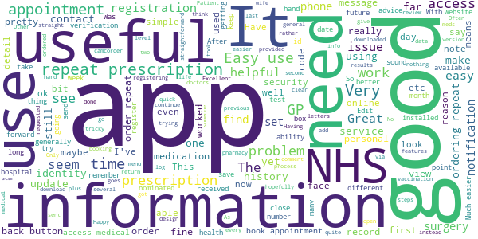
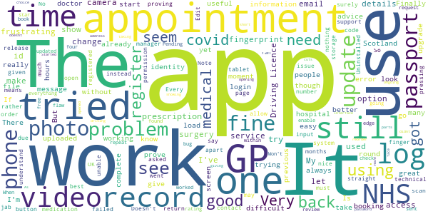

# NHS App
App version ``1.46.0``

Analyzed with [covid-apps-observer](http://github.com/covid-apps-observer) project, version ``0.1``

## App overview
| | |
|-------------------------|-------------------------| 
| **Name**&nbsp;&nbsp;&nbsp;&nbsp;&nbsp;&nbsp;&nbsp;&nbsp;&nbsp;&nbsp;&nbsp;&nbsp;&nbsp;&nbsp;&nbsp;&nbsp;&nbsp;&nbsp;&nbsp;&nbsp;&nbsp;&nbsp;&nbsp;&nbsp;&nbsp;&nbsp;&nbsp;&nbsp;&nbsp;&nbsp;&nbsp;&nbsp;&nbsp;&nbsp;&nbsp;&nbsp;&nbsp;&nbsp;&nbsp;&nbsp;  | NHS App |
| **Unique identifier** | com.nhs.online.nhsonline |
| **Link to Google Play** | [https://play.google.com/store/apps/details?id=com.nhs.online.nhsonline](https://play.google.com/store/apps/details?id=com.nhs.online.nhsonline) |
| **Summary**  | Access NHS services in England |
| **Privacy policy** | [https://www.nhs.uk/using-the-nhs/nhs-services/the-nhs-app/privacy/](https://www.nhs.uk/using-the-nhs/nhs-services/the-nhs-app/privacy/) |
| **Latest version** | 1.46.0 |
| **Last update** | 2021-02-25 17:29:36 |
| **Recent changes** | Bug fixes, and various performance, stability and accessibility enhancements. |
| **Installs**  | 1,000,000+ |
| **Category** | Medical |
| **First release** | Dec 31, 2018 |
| **Size**  | 56M |
| **Supported Android version**  | 5.0 and up |

### Description
> <b>This is not the NHS COVID-19 app. To download the NHS COVID-19 contact tracing app, go to covid19.nhs.uk</b>
 Owned and run by the NHS, the NHS App is a simple and secure way to access a range of NHS services on your smartphone or tablet.
 To use the NHS App you must be aged 13 and over and registered with a GP surgery in England.
 You can also access NHS App services from the browser on your desktop or laptop computer. Go to www.nhs.uk/app
 Use the NHS App to:
 •	get advice about coronavirus
 •	order your repeat prescriptions
 •	book and manage appointments at your GP surgery
 •	get health information and advice
 •	view your health record securely
 •	register your organ donation decision
 •	find out how the NHS uses your data
 If your GP surgery or hospital offers other services in the NHS App, you may be able to:
 •	message your GP surgery, doctor or health professional online
 •	consult a GP or health professional through an online form and get a reply
 •	access health services on behalf of someone you care for
 •	view your hospital and other healthcare appointments
 •	view useful links your doctor or health professional has shared with you
 •	view and manage your care plans
 Get advice about coronavirus 
 ---------------------------------------
 Get information about coronavirus and find out what to do if you think you have it.
 Order repeat prescriptions 
 -----------------------------------
 See your available medicines, request a new repeat prescription and choose a pharmacy for your prescriptions to be sent to.
 Book appointments
 --------------------------
 Search for, book and cancel appointments at your GP surgery. See details of your upcoming and past appointments.
 Get health advice
 -----------------------------
 Search trusted NHS information and advice on hundreds of conditions and treatments. You can also answer questions to get instant advice or medical help near you. 
 View your health record
 ----------------------------------
 Securely access your GP health record, to see information like your allergies and your current and past medicines. If your GP surgery has given you access to your detailed medical record, you can also see information like test results and details of your consultations. 
 Register your organ donation decision
 --------------------------------------------------
 Choose to donate some or all of your organs and check your registered decision.
 Find out how the NHS uses your data
 -------------------------------------------------
 Choose if data from your health records is shared for research and planning.
 Keeping your data secure
 ---------------------------------
 After you download the app, you will need to set up an NHS login and prove who you are. The app then securely connects to information from your GP surgery. 
 If your Android device supports fingerprint detection, you can use it to log in to the NHS App each time, instead of using a password and security code.

### User interface
The developers of the app provide the following screenshots in the Google play store.
| | | |
|:-------------------------:|:-------------------------:|:-------------------------:|
 |   |   |   | 
 |   |   |   | 
 |   |   |   | 
 |   |   |   | 
 |   |   |   | 
 |   |   |   | 

## Development team
In the following we report the main information provided by the development team in the Google play store.

| | |
|-------------------------|-------------------------|
| **Developer**  | NHS Digital |
| **Website**  | [https://www.nhs.uk/using-the-nhs/nhs-services/the-nhs-app/help/](https://www.nhs.uk/using-the-nhs/nhs-services/the-nhs-app/help/) |
| **Email** | nhsapp@nhs.net |
| **Physical address**  | - |
| **Other developed apps**  | [https://play.google.com/store/apps/developer?id=NHS+Digital](https://play.google.com/store/apps/developer?id=NHS+Digital) |

## Android support

| | |
|-------------------------|-------------------------|
| **Declared target Android version**  | Android10, version 10 (API level 29) |
| **Effective target Android version**  | Android10, version 10 (API level 29) |
| **Minimum supported Android version**  | Lollipop, version 5.0 (API level 21) |
| **Maximum target Android version**  | - |

The larger the difference between the minimum and maximum supported Android versions, the better. A larger difference means a wider audience. For example, old phones have a very low Android version, so a high minimum supported Android version means that the app cannot be used by users with old phones, thus leading to accessibility problems. 

## Requested permissions

In the following we report the complete list of the permissions requested by the app. 

| **Permission** | **Protection level** | **Description** | 
|-------------------------|-------------------------|-------------------------|
 **android.permission ACCESS_FINE_LOCATION** | :warning:**Dangerous** | Allows an app to access precise location. 
 **android.permission ACCESS_NETWORK_STATE** | Normal | Allows applications to access information about networks. 
 **android.permission CAMERA** | :warning:**Dangerous** | Required to be able to access the camera device. 
 **android.permission INTERNET** | Normal | Allows applications to open network sockets. 
 **android.permission MODIFY_AUDIO_SETTINGS** | Normal | Allows an application to modify global audio settings. 
 **android.permission NFC** | Normal | Allows applications to perform I/O operations over NFC. 
 **android.permission READ_EXTERNAL_STORAGE** | :warning:**Dangerous** | Allows an application to read from external storage. 
 **android.permission READ_PHONE_STATE** | :warning:**Dangerous** | Allows read only access to phone state, including the phone number of the device, current cellular network information, the status of any ongoing calls, and a list of any PhoneAccounts registered on the device. 
 **android.permission RECORD_AUDIO** | :warning:**Dangerous** | Allows an application to record audio. 
 **android.permission USE_FINGERPRINT** | Normal | This constant was deprecated in API level 28. Applications should request USE_BIOMETRIC instead 
 **android.permission WAKE_LOCK** | Normal | Allows using PowerManager WakeLocks to keep processor from sleeping or screen from dimming. 
 **android.permission WRITE_EXTERNAL_STORAGE** | :warning:**Dangerous** | Allows an application to write to external storage. 
 **com.google.android.c2dm.permission RECEIVE** | - | - 
 **com.google.android.finsky.permission BIND_GET_INSTALL_REFERRER_SERVICE** | - | - 
 **org.fidoalliance.uaf.permissions FIDO_CLIENT** | - | - 

## Mentioned servers

| **Server** | **Registrant** | **Registrant country** | **Creation date** | 
|-------------------------|-------------------------|-------------------------|-------------------------|
 | googlesyndication.com | Google LLC | :us: US | 2003-01-21 06:17:24 |
 | google.com | Google LLC | :us: US | 1997-09-15 04:00:00 |
 | app-measurement.com | Google LLC | :us: US | 2015-06-19 20:13:31 |

## Security analysis 

Below we report the main security warnings raised by our execution of the [Androwarn](https://github.com/maaaaz/androwarn) security analysis tool.

**Connection interfaces exfiltration**
> - This application reads details about the currently active data network 

**Telephony services abuse**
> - This application makes phone calls 

**Suspicious connection establishment**
> - This application opens a Socket and connects it to the remote address '; port is out of range' on the 'N/A' port  
> - This application opens a Socket and connects it to the remote address 'Lc/b/b/a/a;->w(Ljava/lang/String;)Ljava/lang/StringBuilder;' on the 'N/A' port  
> - This application opens a Socket and connects it to the remote address 'Ljava/net/Proxy;->type()Ljava/net/Proxy$Type;' on the 'N/A' port  
> - This application opens a Socket and connects it to the remote address 'timeout' on the 'N/A' port  

**Code execution**
> - This application loads a native library: 'DocumentCropper' 
> - This application loads a native library: 'Integrity' 
> - This application loads a native library: 'Liveness' 
> - This application loads a native library: 'Ocr' 
> - This application loads a native library: 'Preflight' 
> - This application loads a native library: 'Quality' 
> - This application loads a native library: 'gnustl_shared' 
> - This application loads a native library: 'lept' 
> - This application loads a native library: 'opencv_java3' 
> - This application loads a native library: 'tensorflow_inference' 
> - This application loads a native library: 'tensorflow_jni' 
> - This application loads a native library: 'tess' 

## User ratings and reviews

Below we provide information about how end users are reacting to the app in terms of ratings and reviews in the Google Play store.

### Ratings

The NHS App app has been installed by more than **1000000** times. At this time, **6514** rated the app and its average score is **3.7331288**. Below we show the distribution of the ratings across the usual star-based rating of Google Play

:star::star::star::star::star:: 3588

:star::star::star::star:: 809

:star::star::star:: 319

:star::star:: 389

:star:: 1409

### Reviews 

#### 5-star reviews

> Easy to use and convenient too.  :date: __2021-02-27 10:29:10__

> Best app on the Web.. Make sure.... Don't stand aside.  :date: __2021-02-27 09:31:16__

> This app is great I use it to order my prescriptions every month and to book appointments. I have also communicated with the GP and had fast responses. And it keeps getting better.  :date: __2021-02-27 07:59:27__

> Great for ordering prescription's  :date: __2021-02-26 15:57:05__

> Great survive  :date: __2021-02-26 11:38:17__

> Works perfectly well. I created my log in info on their website first which was very easy to do so when opening this app for the first time it was plain sailing. Information in the app is useful, recommended.  :date: __2021-02-26 11:24:13__

> Excellent NHS App.  :date: __2021-02-25 23:01:59__

> It makes life easier.  :date: __2021-02-25 20:58:00__

> Brilliant and easy  :date: __2021-02-25 16:04:09__

> Great app for my needs.  :date: __2021-02-25 12:43:03__

#### 4-star reviews

> Installation and verification of identity were fairly straightforward. Verification of identity involved several steps and was quite convoluted but it all followed through and was logical. I am reassured that such rigorous steps are required to access such sensitive personal data. I have yet to make substantial use of the app so I can't comment on that yet.  :date: __2021-02-25 19:17:41__

> Very useful to have at hand  :date: __2021-02-25 18:59:25__

> Very good service  :date: __2021-02-25 10:43:57__

> Seems to do most things I need.  :date: __2021-02-24 23:02:38__

> Works for me. Has all my record's up to date.  :date: __2021-02-23 11:12:27__

> Been using this NHS app for a long time. Great for booking appointments and ordering repeat prescriptions. I've not had any of the problems other users have mentioned. With more features and refinement this will be a 5 star app IMHO.  :date: __2021-02-21 10:22:32__

> Great App easy to access and use. Good interface and likage  :date: __2021-02-19 21:20:35__

> Helpful and good service  :date: __2021-02-19 17:22:31__

> Happy to use tge app. it very easy to follow considering I am not a techno..  :date: __2021-02-16 23:12:16__

> Whe I first installed it I I remember it being a bit tricky at first to get set up ... but now it's done I find it really useful ... I've managed to book appointments and order meds ... I can also see if a meds request has been actioned and see my appointment history ... I am going to try and add my 8yr olds profile to mine which will also prove really helpful if it wotks  :date: __2021-02-16 12:51:56__

#### 3-star reviews

> The back button should return to the previous page rather than prompt to log you out on any screen you press it. Would also be nice if it used the Android 10 biometric API, to allow other login types than just finger print.  :date: __2021-02-26 16:46:25__

> So I have the app and can see my meds and allergies, but not my medical records. The GP has given me two codes - one an "ODS" code (?) but I'm blowed if I can see where to enter them. Help!  :date: __2021-02-25 14:14:24__

> It's got better, but still run by people who REALLY don't understand CUSTOMERS. They understand 'following their view of "the rules"'. ||| So \*\*\*\*\*\** complicated with so much jargon that I couldn't even install it. Complete and utter fail. Written by civil servants?  :date: __2021-02-25 02:19:17__

> Very nice service  :date: __2021-02-23 21:29:38__

> It's working thank you  :date: __2021-02-23 18:31:33__

> Tricky to register on this if you are a non-driver without a current passport (and who needs to renew a passport in a lockdown?). I've yet to make this work. I was discouraged by this and abandoned a previous attempt, but still pressing on for now this time. And, incidentally, though I can download this to my tablet, the Covid NHS one is incompatible. The benefits to all in better accessibility must be obvious, surely? Way to go with improving the reliability of your statistics!  :date: __2021-02-20 00:45:31__

> Tried to update the app and it won't work. Uninstalled the original to start again and that won't load. Is there a problem I a ready had the app on my phone and have been using it satisfactorily for months. It was only when I was asked to update it and it wouldn't let me use it until I did, that I had problems with it. My phone is up to date and has plenty of storage and memory. It is the app which has the problem. It was fine until the update.  :date: __2021-02-12 02:53:10__

> Not the best app I've ever attempted to use, insists on telling me there's a problem with my connection, strangely everything else on my phone works! Of course UK gov can't be their fault now can it. Could be a very good app with a bit of knowledgeable input  :date: __2021-02-09 14:18:03__

> The log in took over four hours to complete. It will not load on my laptop. Once everything is up loaded on to a smart phone. you log in to check perscriptions all you get is an error message. I still do not know if they have been ordered and they have just ran out, so now still have to ring to find out. the phone charges are now over forty pounds. A complete waste of time and money !!!!!!!! I now have no error messages so all is working at the moment, fingers crossed up the star rating .  :date: __2021-02-03 16:12:08__

> The app has been freezing for last few days. I have sent a report but its still doing it  :date: __2021-02-02 18:35:20__

#### 2-star reviews

> I have spent a long time trying to register. Each time I get so far and then have to go back to start. Eventually I successfully uploaded a picture of my driving license but the scanning confirmation did not work so I tried the alternative video confirmation which appears to not work at all ( confirmed by another reviewer) and I cant get back to the scanning option to try that again. I appear to be completely stuck , what can I try.  :date: __2021-02-26 19:02:52__

> After several attempts to verify my identity it finally accepted me , I'm disappointed that my GP records are not accessible only appointments and prescriptions which I usually do through the patient access app , waste of space . There is no summary at all .  :date: __2021-02-26 10:05:50__

> For such an important app it is amazing how often it fails.  :date: __2021-02-25 00:35:18__

> Does not work on some smart phones not compatable  :date: __2021-02-23 08:26:57__

> Its ok but far to many security issues with it trying to set it up such as taking photos of your passport or driving license picture then uploading it and then it scans your face to see if they match it's only a android app not MI5  :date: __2021-02-23 06:24:22__

> Might work if it would connect to my surgery, but it won't.  :date: __2021-02-22 18:35:35__

> Since last update, hangs in medical records, unresponsive. Have to close app!  :date: __2021-02-17 15:00:21__

> Can't add my GP  :date: __2021-02-14 06:07:28__

> Tried to use this to connect without having to go via the surgery but it just says "Sorry - we cannot connect you to your GP surgery" and prompts me to sign up to online services via the surgery (who, when I called them, could not find the information required by the app) This error occured even though I got the verification email saying the surgery has approved it. Currently awaiting a response to the query I raised via link provided.  :date: __2021-02-12 12:42:09__

> Internet connection error! I have been through all of the validation process and had a message of confirmation from my surgery, but every time I try to use the app I get a message saying Internet connection error. There is no issue with my Internet but I cannot use the app.  :date: __2021-02-11 18:48:49__

#### 1-star reviews

> I thought that I must have mistakenly tried to rob the Bank of England, after uploading a photo I.D, giving my date of birth, a password, entering an emailed code, I gave up after being asked to take a video of myself quoting 4 numbers. Ridiculous!!  :date: __2021-02-26 20:48:27__

> Utter rubbish, says to get a code from doctors but there's no where to enter it. My doctor's has issued me with details but can't see anything as nowhere to enter anything so can't see any of the stuff I want to  :date: __2021-02-25 21:27:47__

> Can not open to use on my android tablet  :date: __2021-02-25 17:55:33__

> Requires Android version 8 or above! Should make this clearer. Many elderly people have older operating systems. Similar problem for Test and Trace. DOESN'T HELP IF I NEED TO SHOW THE APP TO CONFIRM VACCINATION AND/OR A NEGATIVE COVID TEST GAIN ENTRY TO AN EVENT BY SHOWING MY MOBILE  :date: __2021-02-25 14:48:33__

> this app was a waste of my time cant get to confirm ur identity as it wont let you yse the camera waste of my time and memory space so only got one star in the end i deleted the app as it not going what it is supposed to wate of time i wouldn't recommend downloading this app  :date: __2021-02-25 08:52:11__

> Rubbish  :date: __2021-02-25 08:26:44__

> Appalling. I cannot get the app to open the camera and YES I HAVE GIVEN ALL OF THE CORRECT PERMISSIONS TO THE APO AND TO CHROME. AND I HAVE LOOKED AT THE COMMON PROBLEMS.  :date: __2021-02-24 19:59:17__

> Have spent hours trying to to get this to work. Fails every time it tries to connect to surgery.  :date: __2021-02-24 17:25:26__

> everytime I log in the app makes me relink my surgery  :date: __2021-02-24 15:05:01__

> This is one of the most frustrating, unfriendly Apps I've ever come across. The very people likely to be most in need of it - elderly, poorly - will find it impossible to access., as I have found.  :date: __2021-02-24 14:58:52__

