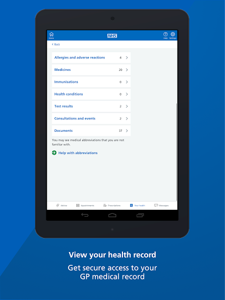
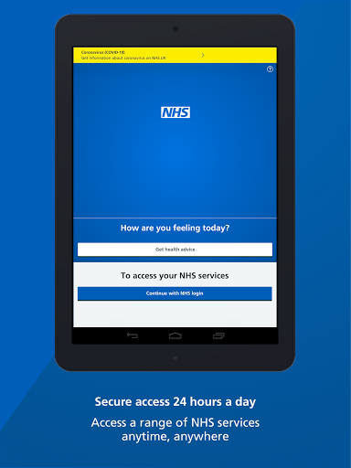

# NHS App
App version ``1.46.0``

Analyzed with [covid-apps-observer](http://github.com/covid-apps-observer) project, version ``0.1``

## App overview
| | |
|-------------------------|-------------------------| 
| **Name**                                          | NHS App |
| **Unique identifier** | com.nhs.online.nhsonline |
| **Link to Google Play** | [https://play.google.com/store/apps/details?id=com.nhs.online.nhsonline](https://play.google.com/store/apps/details?id=com.nhs.online.nhsonline) |
| **Summary**  | Access NHS services in England |
| **Privacy policy** | [https://www.nhs.uk/using-the-nhs/nhs-services/the-nhs-app/privacy/](https://www.nhs.uk/using-the-nhs/nhs-services/the-nhs-app/privacy/) |
| **Latest version** | 1.46.0 |
| **Last update** | 2021-02-25 17:29:36 |
| **Recent changes** | Bug fixes, and various performance, stability and accessibility enhancements. |
| **Installs**  | 1,000,000+ |
| **Category** | Medical |
| **First release** | Dec 31, 2018 |
| **Size**  | 56M |
| **Supported Android version**  | 5.0 and up |

### Description
> <b>This is not the NHS COVID-19 app. To download the NHS COVID-19 contact tracing app, go to covid19.nhs.uk</b>
 Owned and run by the NHS, the NHS App is a simple and secure way to access a range of NHS services on your smartphone or tablet.
 To use the NHS App you must be aged 13 and over and registered with a GP surgery in England.
 You can also access NHS App services from the browser on your desktop or laptop computer. Go to www.nhs.uk/app
 Use the NHS App to:
 •	get advice about coronavirus
 •	order your repeat prescriptions
 •	book and manage appointments at your GP surgery
 •	get health information and advice
 •	view your health record securely
 •	register your organ donation decision
 •	find out how the NHS uses your data
 If your GP surgery or hospital offers other services in the NHS App, you may be able to:
 •	message your GP surgery, doctor or health professional online
 •	consult a GP or health professional through an online form and get a reply
 •	access health services on behalf of someone you care for
 •	view your hospital and other healthcare appointments
 •	view useful links your doctor or health professional has shared with you
 •	view and manage your care plans
 Get advice about coronavirus 
 ---------------------------------------
 Get information about coronavirus and find out what to do if you think you have it.
 Order repeat prescriptions 
 -----------------------------------
 See your available medicines, request a new repeat prescription and choose a pharmacy for your prescriptions to be sent to.
 Book appointments
 --------------------------
 Search for, book and cancel appointments at your GP surgery. See details of your upcoming and past appointments.
 Get health advice
 -----------------------------
 Search trusted NHS information and advice on hundreds of conditions and treatments. You can also answer questions to get instant advice or medical help near you. 
 View your health record
 ----------------------------------
 Securely access your GP health record, to see information like your allergies and your current and past medicines. If your GP surgery has given you access to your detailed medical record, you can also see information like test results and details of your consultations. 
 Register your organ donation decision
 --------------------------------------------------
 Choose to donate some or all of your organs and check your registered decision.
 Find out how the NHS uses your data
 -------------------------------------------------
 Choose if data from your health records is shared for research and planning.
 Keeping your data secure
 ---------------------------------
 After you download the app, you will need to set up an NHS login and prove who you are. The app then securely connects to information from your GP surgery. 
 If your Android device supports fingerprint detection, you can use it to log in to the NHS App each time, instead of using a password and security code.

### User interface
The developers of the app provide the following screenshots in the Google play store.
| | | |
|:-------------------------:|:-------------------------:|:-------------------------:|
 |   |   |   | 
 |   |   |   | 
 |   |   |   | 
 |   |   |   | 
 |   |   |   | 
 |   |   |   | 

## Development team
In the following we report the main information provided by the development team in the Google play store.

| | |
|-------------------------|-------------------------|
| **Developer**  | NHS Digital |
| **Website**  | [https://www.nhs.uk/using-the-nhs/nhs-services/the-nhs-app/help/](https://www.nhs.uk/using-the-nhs/nhs-services/the-nhs-app/help/) |
| **Email** | nhsapp@nhs.net |
| **Physical address**  | - |
| **Other developed apps**  | [https://play.google.com/store/apps/developer?id=NHS+Digital](https://play.google.com/store/apps/developer?id=NHS+Digital) |

## Android support

| | |
|-------------------------|-------------------------|
| **Declared target Android version**  | Android10, version 10 (API level 29) |
| **Effective target Android version**  | Android10, version 10 (API level 29) |
| **Minimum supported Android version**  | Lollipop, version 5.0 (API level 21) |
| **Maximum target Android version**  | - |

The larger the difference between the minimum and maximum supported Android versions, the better. A larger difference means a wider audience. For example, old phones have a very low Android version, so a high minimum supported Android version means that the app cannot be used by users with old phones, thus leading to accessibility problems. 

## Requested permissions

In the following we report the complete list of the permissions requested by the app. 

| **Permission** | **Protection level** | **Description** | 
|-------------------------|-------------------------|-------------------------|
 **android.permission ACCESS_FINE_LOCATION** | :warning:**Dangerous** | Allows an app to access precise location. 
 **android.permission ACCESS_NETWORK_STATE** | Normal | Allows applications to access information about networks. 
 **android.permission CAMERA** | :warning:**Dangerous** | Required to be able to access the camera device. 
 **android.permission INTERNET** | Normal | Allows applications to open network sockets. 
 **android.permission MODIFY_AUDIO_SETTINGS** | Normal | Allows an application to modify global audio settings. 
 **android.permission NFC** | Normal | Allows applications to perform I/O operations over NFC. 
 **android.permission READ_EXTERNAL_STORAGE** | :warning:**Dangerous** | Allows an application to read from external storage. 
 **android.permission READ_PHONE_STATE** | :warning:**Dangerous** | Allows read only access to phone state, including the phone number of the device, current cellular network information, the status of any ongoing calls, and a list of any PhoneAccounts registered on the device. 
 **android.permission RECORD_AUDIO** | :warning:**Dangerous** | Allows an application to record audio. 
 **android.permission USE_FINGERPRINT** | Normal | This constant was deprecated in API level 28. Applications should request USE_BIOMETRIC instead 
 **android.permission WAKE_LOCK** | Normal | Allows using PowerManager WakeLocks to keep processor from sleeping or screen from dimming. 
 **android.permission WRITE_EXTERNAL_STORAGE** | :warning:**Dangerous** | Allows an application to write to external storage. 
 **com.google.android.c2dm.permission RECEIVE** | - | - 
 **com.google.android.finsky.permission BIND_GET_INSTALL_REFERRER_SERVICE** | - | - 
 **org.fidoalliance.uaf.permissions FIDO_CLIENT** | - | - 

## Mentioned servers

| **Server** | **Registrant** | **Registrant country** | **Creation date** | 
|-------------------------|-------------------------|-------------------------|-------------------------|
 | googlesyndication.com | Google LLC | :us: US | 2003-01-21 06:17:24 |
 | google.com | Google LLC | :us: US | 1997-09-15 04:00:00 |
 | app-measurement.com | Google LLC | :us: US | 2015-06-19 20:13:31 |

## Security analysis 

Below we report the main security warnings raised by our execution of the [Androwarn](https://github.com/maaaaz/androwarn) security analysis tool.

**Connection interfaces exfiltration**
> - This application reads details about the currently active data network 

**Telephony services abuse**
> - This application makes phone calls 

**Suspicious connection establishment**
> - This application opens a Socket and connects it to the remote address '; port is out of range' on the 'N/A' port  
> - This application opens a Socket and connects it to the remote address 'Lc/b/b/a/a;->w(Ljava/lang/String;)Ljava/lang/StringBuilder;' on the 'N/A' port  
> - This application opens a Socket and connects it to the remote address 'Ljava/net/Proxy;->type()Ljava/net/Proxy$Type;' on the 'N/A' port  
> - This application opens a Socket and connects it to the remote address 'timeout' on the 'N/A' port  

**Code execution**
> - This application loads a native library: 'DocumentCropper' 
> - This application loads a native library: 'Integrity' 
> - This application loads a native library: 'Liveness' 
> - This application loads a native library: 'Ocr' 
> - This application loads a native library: 'Preflight' 
> - This application loads a native library: 'Quality' 
> - This application loads a native library: 'gnustl_shared' 
> - This application loads a native library: 'lept' 
> - This application loads a native library: 'opencv_java3' 
> - This application loads a native library: 'tensorflow_inference' 
> - This application loads a native library: 'tensorflow_jni' 
> - This application loads a native library: 'tess' 

## User ratings and reviews

Below we provide information about how end users are reacting to the app in terms of ratings and reviews in the Google Play store.

### Ratings

The NHS App app has been installed by more than **1000000** times. At this time, **6514** rated the app and its average score is **3.7331288**. Below we show the distribution of the ratings across the usual star-based rating of Google Play

:star::star::star::star::star:: 3588

:star::star::star::star:: 809

:star::star::star:: 319

:star::star:: 389

:star:: 1409

### Reviews 

#### 5-star reviews

> Brilliant, highly recommend 👌  :date: __2021-03-27 16:24:30__

> I died waiting, poisoned 😖  :date: __2021-03-27 13:22:38__

> Excellent  :date: __2021-03-27 11:14:03__

> I had absolutely no reaction to my first jab. I don't feel convinced that I am protected Has any research been done to find whether people who have antibodies have more reaction?  :date: __2021-03-27 09:32:25__

> Keep up the good work NHS great app  :date: __2021-03-26 09:29:35__

> Love ease of ordering repeat prescriptions  :date: __2021-03-25 23:58:44__

> Excellent  :date: __2021-03-25 19:31:14__

> Great app  :date: __2021-03-25 08:36:54__

> Easy-going  :date: __2021-03-25 00:41:14__

> Its very good  :date: __2021-03-24 22:53:28__

#### 4-star reviews

> Excellent  :date: __2021-03-28 10:29:57__

> Going through the process of entering the information was pretty clear, getting face recognition was a bit hit&miss, on the 5th scan I got that eureka feeling, it seems that your face needs to fill the egg shaped border  :date: __2021-03-28 09:59:17__

> Unlike the first review, I found it very easy to install. A very useful app.  :date: __2021-03-26 10:04:31__

> I received an invitation from my GP to use the app. I had no problems whatsoever installing and registering but, having done so, I have to say I was somewhat disappointed. The main reason I installed it was for the ability to book an appointment online; however, it just told me there were no appointments available to book online and I should contact my GP surgery instead! I'll give it the benefit of doubt - maybe something isn't configured correctly at my GP's surgery... The second reason was (out of curiosity) to be able to view my health records. This seemed to be nothing more than a list of prescriptions I've had over the previous years - being generally fit and healthy, there wasn't a great deal of info here! If you have more complex health issues, then maybe this app will be useful; personally I can't see any point in it. Finally, a note to the developers - please fix the action of the BACK button. Having it set to exit the app rather than return to the previous menu is counterintuitive and extremely frustrating!  :date: __2021-03-25 01:54:10__

> Have only just started using it this week. I didn't have any issues registering and so far it looks like it will be helpful for arranging appointment and seeing history of medications prescribed. I have yet to try ordering repeat prescriptions but if saves me having to telephone the prescription hub each month it will be worth it for that alone.  :date: __2021-03-23 11:30:06__

> A very good app if you need to get information on your medication medicall history and very good if you need to apply for personal independence payment for dwp needs a better menu but its good  :date: __2021-03-18 23:44:53__

> It's quick and easy to sign up and the verification took less than 10 minutes. It has a few good sources of information and NHS 111 advice integrated into the app. The fact that I can amend my nominated pharmacy, organ donation decision etc is great. I also appreciate that I can see my prescriptions and any messages. The app also has a familiar NHS website look and feel which reinforces the trust in the application and services provided. It also takes identity theft very seriously.  :date: __2021-03-18 23:42:56__

> I have just downloaded it today and fortunately didn't have any issues. I think the concept is good and hopefully will improve in time and as it's used more.  :date: __2021-03-18 12:19:46__

> Asks me to update app I have been trying to do this for 2 days every time it gets to 100% it goes back to pending and just keeps restarting the update  :date: __2021-03-18 07:41:06__

> Excellent level of security to set up. Simple to use once activated. Like it to arrange appointments and order prescriptions  :date: __2021-03-16 16:07:23__

#### 3-star reviews

> Ongoing log in problems. Always have to input email address & password. No short cuts. Option to change to fingerprint doesnt work  :date: __2021-03-28 09:47:13__

> The app is still showing an error when trying to see or reorder prescriptions?  :date: __2021-03-27 14:00:55__

> The parts I can use seem OK, but I am having problems proving my identity. Have tried using Driving Licence - photo uploaded fine, but face scan failed 3 times. Tried again using video, but instead of the app opening the camera, it opens a file manager. Started again, but this time with Passport - photo uploaded fine, app didnt give me the choice of scan or video, it went straight to video. As before, a file manager opened instead of the camera interface. I have given up for the moment.  :date: __2021-03-26 09:59:12__

> It looks a good app apart from when taking a photo of the passport and after giving permission for the app to use the camera it then does nothing. The video clip does not work either for the same reason. Apart from that it looks fine.  :date: __2021-03-25 17:00:17__

> Anyone know why this app won't open? ??  :date: __2021-03-24 17:40:19__

> NHS. Results  :date: __2021-03-23 23:22:37__

> Needs to be faster  :date: __2021-03-23 15:36:44__

> Got the app working so not to bad after all.  :date: __2021-03-21 18:53:03__

> Been mostly easy to use. Booking (covid jab) appointments though, it is just incapable of doing at the moment. Frustrating. Since you're told to not contact your surgery regarding the jab.  :date: __2021-03-20 11:27:13__

> I don't have any form of photo id which means I'm unable to prove who I am hence I can't use the app, how do I prove who I am without id  :date: __2021-03-18 23:59:51__

#### 2-star reviews

> It's clearly work in progress, so I do hope to see increased functionally progressively being delivered through the App starting with my full medical records. Specifically I want to see my recent blood test results and my full vaccination records (tetanus etc, Covid-19 etc). I was shown this today at the vax centre on an iPhone, but mine is Android and I cannot see this information.  :date: __2021-03-27 14:14:27__

> Ok  :date: __2021-03-26 15:47:27__

> The app has my full medial records which is great, but the hospital referring user journey is poor. firstly it didnt notify me there was a referral, secondly, when I found it by chance, it allowed me to go through to the end, but then said the app couldnt book and that i have goto a website. whats the point of the app then ? The website asked for an access code which I have never been given. This is a bigger problem than just the app. Would be happy to be an end to end user tester.  :date: __2021-03-26 12:38:53__

> It used to be good. You could book appointments easily and so on a great way to keep in contact with you doctors..... unfortunately now it is only for vacations.... yes it is a priority but people still people get issues that aren't virus related! Please put it back to what it was with a section for vacations  :date: __2021-03-26 08:47:19__

> Can't link to GP - either using link or manual registration- system not recognising account linkage key obtained via Patient Access. Please advise  :date: __2021-03-25 22:54:16__

> I managed to register and get through the verification easily enough. Unfortunately though, I can only see my basic health info and despite being on the phone to my GP's practice manager for 20 mins going through the instructions for their system supplied by the support team, it refuses to display any of the enhanced 'coded' information such as test results and vaccination history. I'm hoping a follow-up email to the support team may get us further.  :date: __2021-03-24 22:53:37__

> Disappointing that you have to do all verification again when get a new device  :date: __2021-03-13 17:09:23__

> It's a very slow app and I have to login every time I open the app. I think it would be good if the app saved the login information so every time I open the app I dont need to login.  :date: __2021-03-11 12:37:22__

> it needs expanding by customer services now passing messages onto the relevant people in the nhs + all GP practices in uk should now sign up to online booking for GP appointments now  :date: __2021-03-10 11:34:48__

> Downloaded the app and went through all the registration process no problem. Got onto repeat prescription part to get a prescription but still waiting to hear whether I can have prescription that I have asked for. Would have been quicker to phone the surgery and get them. What a waste of my time going through the set up process only to find the app doesn't work ☹☹  :date: __2021-03-09 11:34:54__

#### 1-star reviews

> Useless. Apparently a passport is no good to prove my identity.  :date: __2021-03-28 12:43:28__

> I can login fine but when it comes in to proving my identity, it just logs me out. I can't get past the I.D, I'll take a picture of it and when I press the tick to let it identify anything it just logs me back out. I've given up on it now.  :date: __2021-03-27 16:12:48__

> Can't see a point to this. App for the sake of having an app. My repeat meds aren't there, 9000 questions that are 100% irrelevant when using the econsult, took forever.  :date: __2021-03-27 13:43:32__

> Will not download because of the covid app  :date: __2021-03-26 23:08:33__

> Impossible to register  :date: __2021-03-26 22:48:01__

> Got threw all checks every time won't let me link my gp  :date: __2021-03-26 19:15:28__

> Just said pending tried again another day but the same  :date: __2021-03-26 18:16:51__

> The open camcorder option does not work so I can't verify my ID. Very buggy.  :date: __2021-03-26 14:09:43__

> Tedious. Avoid like the plague. Local GP online services so much better. This app is a pain to set up. Providing proof of ID is virtually impossible. Have tried several times on different devices, really can't be bothered to try again. Believe me, we all have better things to do with our time. Even in lockdown.  :date: __2021-03-26 12:54:41__

> Only an out of date prescription listed. Says you can't get an appointment. So what use is it??  :date: __2021-03-26 11:49:28__

