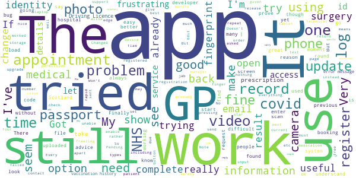
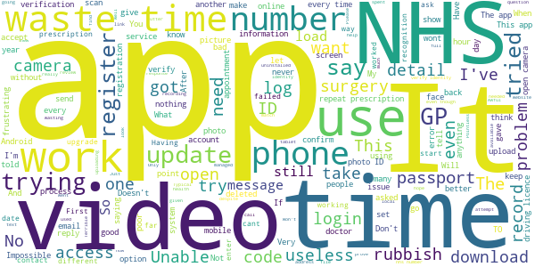

# NHS App
App version ``1.48.2``

Analyzed with [covid-apps-observer](http://github.com/covid-apps-observer) project, version ``0.1``

## App overview
| | |
|-------------------------|-------------------------| 
| **Name**&nbsp;&nbsp;&nbsp;&nbsp;&nbsp;&nbsp;&nbsp;&nbsp;&nbsp;&nbsp;&nbsp;&nbsp;&nbsp;&nbsp;&nbsp;&nbsp;&nbsp;&nbsp;&nbsp;&nbsp;&nbsp;&nbsp;&nbsp;&nbsp;&nbsp;&nbsp;&nbsp;&nbsp;&nbsp;&nbsp;&nbsp;&nbsp;&nbsp;&nbsp;&nbsp;&nbsp;&nbsp;&nbsp;&nbsp;&nbsp;  | NHS App |
| **Unique identifier** | com.nhs.online.nhsonline |
| **Link to Google Play** | [https://play.google.com/store/apps/details?id=com.nhs.online.nhsonline](https://play.google.com/store/apps/details?id=com.nhs.online.nhsonline) |
| **Summary**  | Access NHS services in England |
| **Privacy policy** | [https://www.nhs.uk/using-the-nhs/nhs-services/the-nhs-app/privacy/](https://www.nhs.uk/using-the-nhs/nhs-services/the-nhs-app/privacy/) |
| **Latest version** | 1.48.2 |
| **Last update** | 2021-03-30 14:29:22 |
| **Recent changes** | Improvements:  • We have renamed &quot;Settings&quot; to &quot;More&quot; and updated the icon • Bug fixes, and various performance, stability and accessibility enhancements |
| **Installs**  | 1,000,000+ |
| **Category** | Medical |
| **First release** | Dec 31, 2018 |
| **Size**  | 56M |
| **Supported Android version**  | 5.0 and up |

### Description
> <b>This is not the NHS COVID-19 app. To download the NHS COVID-19 contact tracing app, go to covid19.nhs.uk</b>
 Owned and run by the NHS, the NHS App is a simple and secure way to access a range of NHS services on your smartphone or tablet.
 To use the NHS App you must be aged 13 and over and registered with a GP surgery in England.
 You can also access NHS App services from the browser on your desktop or laptop computer. Go to www.nhs.uk/app
 Use the NHS App to:
 •	get advice about coronavirus
 •	order your repeat prescriptions
 •	book and manage appointments at your GP surgery
 •	get health information and advice
 •	view your health record securely
 •	register your organ donation decision
 •	find out how the NHS uses your data
 If your GP surgery or hospital offers other services in the NHS App, you may be able to:
 •	message your GP surgery, doctor or health professional online
 •	consult a GP or health professional through an online form and get a reply
 •	access health services on behalf of someone you care for
 •	view your hospital and other healthcare appointments
 •	view useful links your doctor or health professional has shared with you
 •	view and manage your care plans
 Get advice about coronavirus 
 ---------------------------------------
 Get information about coronavirus and find out what to do if you think you have it.
 Order repeat prescriptions 
 -----------------------------------
 See your available medicines, request a new repeat prescription and choose a pharmacy for your prescriptions to be sent to.
 Book appointments
 --------------------------
 Search for, book and cancel appointments at your GP surgery. See details of your upcoming and past appointments.
 Get health advice
 -----------------------------
 Search trusted NHS information and advice on hundreds of conditions and treatments. You can also answer questions to get instant advice or medical help near you. 
 View your health record
 ----------------------------------
 Securely access your GP health record, to see information like your allergies and your current and past medicines. If your GP surgery has given you access to your detailed medical record, you can also see information like test results and details of your consultations. 
 Register your organ donation decision
 --------------------------------------------------
 Choose to donate some or all of your organs and check your registered decision.
 Find out how the NHS uses your data
 -------------------------------------------------
 Choose if data from your health records is shared for research and planning.
 Keeping your data secure
 ---------------------------------
 After you download the app, you will need to set up an NHS login and prove who you are. The app then securely connects to information from your GP surgery. 
 If your Android device supports fingerprint detection, you can use it to log in to the NHS App each time, instead of using a password and security code.

### User interface
The developers of the app provide the following screenshots in the Google play store.
| | | |
|:-------------------------:|:-------------------------:|:-------------------------:|
 |   |   |   | 
 |   |   |   | 
 |   |   |   | 
 |   |   |   | 
 |   |   |   | 
 |   |   |   | 

## Development team
In the following we report the main information provided by the development team in the Google play store.

| | |
|-------------------------|-------------------------|
| **Developer**  | NHS Digital |
| **Website**  | [https://www.nhs.uk/using-the-nhs/nhs-services/the-nhs-app/help/](https://www.nhs.uk/using-the-nhs/nhs-services/the-nhs-app/help/) |
| **Email** | nhsapp@nhs.net |
| **Physical address**  | - |
| **Other developed apps**  | [https://play.google.com/store/apps/developer?id=NHS+Digital](https://play.google.com/store/apps/developer?id=NHS+Digital) |

## Android support

| | |
|-------------------------|-------------------------|
| **Declared target Android version**  | Android10, version 10 (API level 29) |
| **Effective target Android version**  | Android10, version 10 (API level 29) |
| **Minimum supported Android version**  | Lollipop, version 5.0 (API level 21) |
| **Maximum target Android version**  | - |

The larger the difference between the minimum and maximum supported Android versions, the better. A larger difference means a wider audience. For example, old phones have a very low Android version, so a high minimum supported Android version means that the app cannot be used by users with old phones, thus leading to accessibility problems. 

## Requested permissions

In the following we report the complete list of the permissions requested by the app. 

| **Permission** | **Protection level** | **Description** | 
|-------------------------|-------------------------|-------------------------|
 **android.permission ACCESS_FINE_LOCATION** | :warning:**Dangerous** | Allows an app to access precise location. 
 **android.permission ACCESS_NETWORK_STATE** | Normal | Allows applications to access information about networks. 
 **android.permission CAMERA** | :warning:**Dangerous** | Required to be able to access the camera device. 
 **android.permission INTERNET** | Normal | Allows applications to open network sockets. 
 **android.permission MODIFY_AUDIO_SETTINGS** | Normal | Allows an application to modify global audio settings. 
 **android.permission NFC** | Normal | Allows applications to perform I/O operations over NFC. 
 **android.permission READ_EXTERNAL_STORAGE** | :warning:**Dangerous** | Allows an application to read from external storage. 
 **android.permission READ_PHONE_STATE** | :warning:**Dangerous** | Allows read only access to phone state, including the phone number of the device, current cellular network information, the status of any ongoing calls, and a list of any PhoneAccounts registered on the device. 
 **android.permission RECORD_AUDIO** | :warning:**Dangerous** | Allows an application to record audio. 
 **android.permission USE_FINGERPRINT** | Normal | This constant was deprecated in API level 28. Applications should request USE_BIOMETRIC instead 
 **android.permission WAKE_LOCK** | Normal | Allows using PowerManager WakeLocks to keep processor from sleeping or screen from dimming. 
 **android.permission WRITE_EXTERNAL_STORAGE** | :warning:**Dangerous** | Allows an application to write to external storage. 
 **com.google.android.c2dm.permission RECEIVE** | - | - 
 **com.google.android.finsky.permission BIND_GET_INSTALL_REFERRER_SERVICE** | - | - 
 **org.fidoalliance.uaf.permissions FIDO_CLIENT** | - | - 

## Mentioned servers

| **Server** | **Registrant** | **Registrant country** | **Creation date** | 
|-------------------------|-------------------------|-------------------------|-------------------------|
 | googlesyndication.com | Google LLC | :us: US | 2003-01-21 06:17:24 |
 | google.com | Google LLC | :us: US | 1997-09-15 04:00:00 |
 | app-measurement.com | Google LLC | :us: US | 2015-06-19 20:13:31 |

## Security analysis 

Below we report the main security warnings raised by our execution of the [Androwarn](https://github.com/maaaaz/androwarn) security analysis tool.

**Connection interfaces exfiltration**
> - This application reads details about the currently active data network 

**Telephony services abuse**
> - This application makes phone calls 

**Suspicious connection establishment**
> - This application opens a Socket and connects it to the remote address '; port is out of range' on the 'N/A' port  
> - This application opens a Socket and connects it to the remote address 'Lc/b/b/a/a;->w(Ljava/lang/String;)Ljava/lang/StringBuilder;' on the 'N/A' port  
> - This application opens a Socket and connects it to the remote address 'Ljava/net/Proxy;->type()Ljava/net/Proxy$Type;' on the 'N/A' port  
> - This application opens a Socket and connects it to the remote address 'timeout' on the 'N/A' port  

**Code execution**
> - This application loads a native library: 'DocumentCropper' 
> - This application loads a native library: 'Integrity' 
> - This application loads a native library: 'Liveness' 
> - This application loads a native library: 'Ocr' 
> - This application loads a native library: 'Preflight' 
> - This application loads a native library: 'Quality' 
> - This application loads a native library: 'gnustl_shared' 
> - This application loads a native library: 'lept' 
> - This application loads a native library: 'opencv_java3' 
> - This application loads a native library: 'tensorflow_inference' 
> - This application loads a native library: 'tensorflow_jni' 
> - This application loads a native library: 'tess' 

## User ratings and reviews

Below we provide information about how end users are reacting to the app in terms of ratings and reviews in the Google Play store.

### Ratings

The NHS App app has been installed by more than **1000000** times. At this time, **7075** rated the app and its average score is **3.6239555**. Below we show the distribution of the ratings across the usual star-based rating of Google Play

:star::star::star::star::star:: 3657

:star::star::star::star:: 916

:star::star::star:: 433

:star::star:: 325

:star:: 1744

### Reviews 

#### 5-star reviews

> Excellent  :date: __2021-04-11 21:06:58__

> Installed app and had it up and running in 10 minutes, very easy if you read and make note of what the app needs. I now have access to all my medical records, I can now request repeat prescriptions or gp appointments via the app, it keeps track of any and all Covid tests and results, it also shows when I've been vaccinated and if I've received both... It works better than my Gps app..  :date: __2021-04-10 23:59:41__

> Installed and registration validated within five minutes. No issues that I can see.  :date: __2021-04-10 18:15:48__

> Problem initially experienced resolved, simple - the app only caters for one email address per patient , no shared address so applied a different address for self and problem solved. Not sure why identity is by email and password as opposed to NHS number plus password which appears more logical but all is well that ends well.  :date: __2021-04-09 12:57:31__

> Brilliant app  :date: __2021-04-08 23:29:49__

> Great app for accessing NHS documents prescriptions ect. And very secure too  :date: __2021-04-08 11:41:07__

> Simple to use, and great for getting medical information and ordering repeat prescriptions.  :date: __2021-04-07 23:15:58__

> Good security with this app.  :date: __2021-04-07 17:42:06__

> Brilliant and easy to use, feels secure login with fingerprint and all round really good feel, one suggestion would be to be able to have a "Dark Mode" for accessibility for people who have visual stress issues  :date: __2021-04-07 15:56:18__

> Can get test results, get a consultation, book medication, see upcoming appointments, immunisation dates visible including covid. Login with fingerprint. Cannot understand negative reviews.  :date: __2021-04-06 20:58:11__

#### 4-star reviews

> Easy  :date: __2021-04-10 22:59:45__

> Good for quick repeat orders for myself. But please can you add a feature to let us add our children to the app  :date: __2021-04-08 11:43:13__

> Great except for finger print difficulties  :date: __2021-04-06 12:21:45__

> Been using this app for a year now. Had some minor issues setting it up but I got through it. Been using it just to.order repeat prescriptions which is great. Much more convenient for me.  :date: __2021-04-06 09:19:07__

> OK  :date: __2021-03-31 23:58:31__

> It's good but should have section to virtually hold the GHIC travel health card. Could also hold Covid 19 vaccination status, test status, that can be used in conjunction with airlines and other countries proof of vaccination.  :date: __2021-03-31 02:02:53__

> I had a few problems getting it set up to start with but I honestly think that was user error. I find the app easy to use and useful to book appointments with my GP and order repeat prescriptions. My GP used to text me reminders of appointments and that has stopped so that would be good functionality to add to the app.  :date: __2021-03-30 01:50:18__

> Excellent  :date: __2021-03-28 10:29:57__

> Going through the process of entering the information was pretty clear, getting face recognition was a bit hit&miss, on the 5th scan I got that eureka feeling, it seems that your face needs to fill the egg shaped border  :date: __2021-03-28 09:59:17__

> Unlike the first review, I found it very easy to install. A very useful app.  :date: __2021-03-26 10:04:31__

#### 3-star reviews

> Why not have an option to enter your voluntary covid rapid test result here. Seems so simple. Scan QR code, enter result, carry on with your life. Easy. Update, I've seen your reply. If I can add my rapid test result I can't find where. Pls send specific instructions to the correct page.  :date: __2021-04-12 16:13:56__

> Really needs improvement, it keeps freezing when i try to log in or register my identity  :date: __2021-04-10 12:16:00__

> Bit of a palaver getting set up, but I understand the reasons, and it was all fairly quick in the end. Main reason I installed the app is that my NHS surgery website says that the app shows the patient's vaccination history, including those for Covid. I thought this would be useful, however I can't find any information about my vaccination history, Covid or otherwise. Where is this vaccination history information to be found on the app please?  :date: __2021-04-08 09:42:36__

> Would it be possible to name econsult then have a sub menu Dr/ administration request etc , current system is confusing especially for elderly  :date: __2021-04-03 12:03:14__

> My registration was going well until I encountered the same problem as another reviewer; 'open camcorder' takes me to 'My Files' and not the camera. Tried all the suggested fixes (of no use whatsoever) but it's still the same. I've already reported to the developers but I'm concerned that such an important app has these types of bugs. Changed from 1 to 3 stars as the developers answered immediately ans advised me to complete the registration on a different device (laptop) which worked.  :date: __2021-04-01 17:49:47__

> Trying to set up account and camera will not open - so cannot make the video!  :date: __2021-03-31 16:10:14__

> Very slow lots of error messages  :date: __2021-03-30 01:55:07__

> Ongoing log in problems. Always have to input email address & password. No short cuts. Option to change to fingerprint doesnt work  :date: __2021-03-28 09:47:13__

> The app is still showing an error when trying to see or reorder prescriptions?  :date: __2021-03-27 14:00:55__

> The parts I can use seem OK, but I am having problems proving my identity. Have tried using Driving Licence - photo uploaded fine, but face scan failed 3 times. Tried again using video, but instead of the app opening the camera, it opens a file manager. Started again, but this time with Passport - photo uploaded fine, app didnt give me the choice of scan or video, it went straight to video. As before, a file manager opened instead of the camera interface. I have given up for the moment.  :date: __2021-03-26 09:59:12__

#### 2-star reviews

> Impossible to satisfy requirement for photo of licence or passport. As both documents are covered with a shiny membrane it is impossible to get the glare free image thus app demands.  :date: __2021-04-06 14:56:15__

> Not enough information no health record. And not up to date....  :date: __2021-04-05 12:40:28__

> Basic records about yourself, its ok  :date: __2021-04-02 08:40:05__

> It's clearly work in progress, so I do hope to see increased functionally progressively being delivered through the App starting with my full medical records. Specifically I want to see my recent blood test results and my full vaccination records (tetanus etc, Covid-19 etc). I was shown this today at the vax centre on an iPhone, but mine is Android and I cannot see this information.  :date: __2021-03-27 14:14:27__

> Ok  :date: __2021-03-26 15:47:27__

> The app has my full medial records which is great, but the hospital referring user journey is poor. firstly it didnt notify me there was a referral, secondly, when I found it by chance, it allowed me to go through to the end, but then said the app couldnt book and that i have goto a website. whats the point of the app then ? The website asked for an access code which I have never been given. This is a bigger problem than just the app. Would be happy to be an end to end user tester.  :date: __2021-03-26 12:38:53__

> It used to be good. You could book appointments easily and so on a great way to keep in contact with you doctors..... unfortunately now it is only for vacations.... yes it is a priority but people still people get issues that aren't virus related! Please put it back to what it was with a section for vacations  :date: __2021-03-26 08:47:19__

> Can't link to GP - either using link or manual registration- system not recognising account linkage key obtained via Patient Access. Please advise  :date: __2021-03-25 22:54:16__

> I managed to register and get through the verification easily enough. Unfortunately though, I can only see my basic health info and despite being on the phone to my GP's practice manager for 20 mins going through the instructions for their system supplied by the support team, it refuses to display any of the enhanced 'coded' information such as test results and vaccination history. I'm hoping a follow-up email to the support team may get us further.  :date: __2021-03-24 22:53:37__

> Disappointing that you have to do all verification again when get a new device  :date: __2021-03-13 17:09:23__

#### 1-star reviews

> Camera doesn't open to verify identity.  :date: __2021-04-12 16:10:21__

> I gave up and deleted it...you have to answer question after question, then send a picture of your driving licence, then you have to make a video of yourself...at this point I gave it up as a bad job and deleted my login. Total joke, if you want people to use your apps to make things more efficient then make it easy. Will stick to email and paper, well done NHS up to your usual standard...ie. poor.  :date: __2021-04-12 14:12:51__

> Incredibly invasive app, data mining tons of personal information & probably outsourced and sold to the US. Wants passport details, pictures or photo ID, driving licence, live video recording of your face and voice, phone fingerprint or faceID, email add, phone cell number txt message auth, home address, nhs number, etc etc etc.....All to be able to make a Dr appointment with your GP. NO THANKS. GOV.UK Sites already have a lot of this info already so why another new login and password.  :date: __2021-04-12 14:11:53__

> Still not loaded  :date: __2021-04-12 08:45:35__

> Telling me to update app before I can use it but its pending all the time.  :date: __2021-04-11 07:35:38__

> Total waste of time spent a week an a day trying to verify my video rubbish To reviewer.. Thanks but no thanks.  :date: __2021-04-10 21:44:17__

> Won't open ,  :date: __2021-04-10 10:51:39__

> My phone is too old. Doesn't support my operation system.  :date: __2021-04-10 10:18:48__

> Won't download  :date: __2021-04-10 09:55:19__

> Absolute rubbish!! Cannot verify my Identity despite having a perfectly good photo on my driving licence and a good video!! You cannot register properly at all !! If this is the carry on you have everytime you need to use it then forget it!! I've tried five times to verify my identity quite clearly and the app simply won't accept it. Unless this is improved, to be honest, leave well alone!! I'll try calling my GP instead as this is a total waste of time!! I'm now going to delete the app!!  :date: __2021-04-10 00:33:41__

