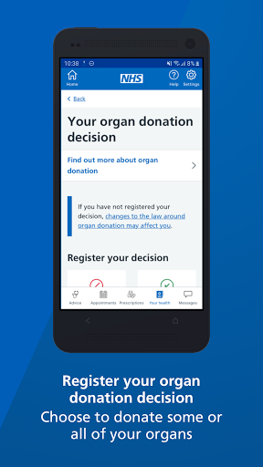

# NHS App
App version ``1.48.7``

Analyzed with [covid-apps-observer](http://github.com/covid-apps-observer) project, version ``0.1``

## App overview
| | |
|-------------------------|-------------------------| 
| **Name**                                          | NHS App |
| **Unique identifier** | com.nhs.online.nhsonline |
| **Link to Google Play** | [https://play.google.com/store/apps/details?id=com.nhs.online.nhsonline](https://play.google.com/store/apps/details?id=com.nhs.online.nhsonline) |
| **Summary**  | Access NHS services in England |
| **Privacy policy** | [https://www.nhs.uk/using-the-nhs/nhs-services/the-nhs-app/privacy/](https://www.nhs.uk/using-the-nhs/nhs-services/the-nhs-app/privacy/) |
| **Latest version** | 1.48.7 |
| **Last update** | 2021-04-13 10:30:09 |
| **Recent changes** | Improvements:  - We have renamed &quot;Settings&quot; to &quot;More&quot; and updated the icon - Bug fixes, and various performance, stability and accessibility enhancements |
| **Installs**  | 1,000,000+ |
| **Category** | Medical |
| **First release** | Dec 31, 2018 |
| **Size**  | 56M |
| **Supported Android version**  | 5.0 and up |

### Description
> <b>This is not the NHS COVID-19 app. To download the NHS COVID-19 contact tracing app, go to covid19.nhs.uk</b>
 Owned and run by the NHS, the NHS App is a simple and secure way to access a range of NHS services on your smartphone or tablet.
 To use the NHS App you must be aged 13 and over and registered with a GP surgery in England.
 You can also access NHS App services from the browser on your desktop or laptop computer. Go to www.nhs.uk/app
 Use the NHS App to:
 •	get advice about coronavirus
 •	order your repeat prescriptions
 •	book and manage appointments at your GP surgery
 •	get health information and advice
 •	view your health record securely
 •	register your organ donation decision
 •	find out how the NHS uses your data
 If your GP surgery or hospital offers other services in the NHS App, you may be able to:
 •	message your GP surgery, doctor or health professional online
 •	consult a GP or health professional through an online form and get a reply
 •	access health services on behalf of someone you care for
 •	view your hospital and other healthcare appointments
 •	view useful links your doctor or health professional has shared with you
 •	view and manage your care plans
 Get advice about coronavirus 
 ---------------------------------------
 Get information about coronavirus and find out what to do if you think you have it.
 Order repeat prescriptions 
 -----------------------------------
 See your available medicines, request a new repeat prescription and choose a pharmacy for your prescriptions to be sent to.
 Book appointments
 --------------------------
 Search for, book and cancel appointments at your GP surgery. See details of your upcoming and past appointments.
 Get health advice
 -----------------------------
 Search trusted NHS information and advice on hundreds of conditions and treatments. You can also answer questions to get instant advice or medical help near you. 
 View your health record
 ----------------------------------
 Securely access your GP health record, to see information like your allergies and your current and past medicines. If your GP surgery has given you access to your detailed medical record, you can also see information like test results and details of your consultations. 
 Register your organ donation decision
 --------------------------------------------------
 Choose to donate some or all of your organs and check your registered decision.
 Find out how the NHS uses your data
 -------------------------------------------------
 Choose if data from your health records is shared for research and planning.
 Keeping your data secure
 ---------------------------------
 After you download the app, you will need to set up an NHS login and prove who you are. The app then securely connects to information from your GP surgery. 
 If your Android device supports fingerprint detection, you can use it to log in to the NHS App each time, instead of using a password and security code.

### User interface
The developers of the app provide the following screenshots in the Google play store.
| | | |
|:-------------------------:|:-------------------------:|:-------------------------:|
 |   |   |   | 
 |   |   |   | 
 |   |   |   | 
 |   |   |   | 
 |   |   |   | 
 |   |   |   | 

## Development team
In the following we report the main information provided by the development team in the Google play store.

| | |
|-------------------------|-------------------------|
| **Developer**  | NHS Digital |
| **Website**  | [https://www.nhs.uk/using-the-nhs/nhs-services/the-nhs-app/help/](https://www.nhs.uk/using-the-nhs/nhs-services/the-nhs-app/help/) |
| **Email** | nhsapp@nhs.net |
| **Physical address**  | - |
| **Other developed apps**  | [https://play.google.com/store/apps/developer?id=NHS+Digital](https://play.google.com/store/apps/developer?id=NHS+Digital) |

## Android support

| | |
|-------------------------|-------------------------|
| **Declared target Android version**  | Pie, version 9 (API level 28) |
| **Effective target Android version**  | Pie, version 9 (API level 28) |
| **Minimum supported Android version**  | Lollipop, version 5.0 (API level 21) |
| **Maximum target Android version**  | - |

The larger the difference between the minimum and maximum supported Android versions, the better. A larger difference means a wider audience. For example, old phones have a very low Android version, so a high minimum supported Android version means that the app cannot be used by users with old phones, thus leading to accessibility problems. 

## Requested permissions

In the following we report the complete list of the permissions requested by the app. 

| **Permission** | **Protection level** | **Description** | 
|-------------------------|-------------------------|-------------------------|
 **android.permission ACCESS_FINE_LOCATION** | :warning:**Dangerous** | Allows an app to access precise location. 
 **android.permission ACCESS_NETWORK_STATE** | Normal | Allows applications to access information about networks. 
 **android.permission CAMERA** | :warning:**Dangerous** | Required to be able to access the camera device. 
 **android.permission INTERNET** | Normal | Allows applications to open network sockets. 
 **android.permission MODIFY_AUDIO_SETTINGS** | Normal | Allows an application to modify global audio settings. 
 **android.permission READ_EXTERNAL_STORAGE** | :warning:**Dangerous** | Allows an application to read from external storage. 
 **android.permission READ_PHONE_STATE** | :warning:**Dangerous** | Allows read only access to phone state, including the phone number of the device, current cellular network information, the status of any ongoing calls, and a list of any PhoneAccounts registered on the device. 
 **android.permission RECORD_AUDIO** | :warning:**Dangerous** | Allows an application to record audio. 
 **android.permission USE_FINGERPRINT** | Normal | This constant was deprecated in API level 28. Applications should request USE_BIOMETRIC instead 
 **android.permission WAKE_LOCK** | Normal | Allows using PowerManager WakeLocks to keep processor from sleeping or screen from dimming. 
 **android.permission WRITE_EXTERNAL_STORAGE** | :warning:**Dangerous** | Allows an application to write to external storage. 
 **com.google.android.c2dm.permission RECEIVE** | - | - 
 **com.google.android.finsky.permission BIND_GET_INSTALL_REFERRER_SERVICE** | - | - 
 **org.fidoalliance.uaf.permissions FIDO_CLIENT** | - | - 

## Mentioned servers

| **Server** | **Registrant** | **Registrant country** | **Creation date** | 
|-------------------------|-------------------------|-------------------------|-------------------------|
 | googlesyndication.com | Google LLC | :us: US | 2003-01-21 06:17:24 |
 | google.com | Google LLC | :us: US | 1997-09-15 04:00:00 |
 | app-measurement.com | Google LLC | :us: US | 2015-06-19 20:13:31 |

## Security analysis 

Below we report the main security warnings raised by our execution of the [Androwarn](https://github.com/maaaaz/androwarn) security analysis tool.

**Connection interfaces exfiltration**
> - This application reads details about the currently active data network 

**Telephony services abuse**
> - This application makes phone calls 

## User ratings and reviews

Below we provide information about how end users are reacting to the app in terms of ratings and reviews in the Google Play store.

### Ratings

The NHS App app has been installed by more than **1000000** times. At this time, **7245** rated the app and its average score is **3.4703448**. Below we show the distribution of the ratings across the usual star-based rating of Google Play

:star::star::star::star::star:: 3429

:star::star::star::star:: 1019

:star::star::star:: 409

:star::star:: 309

:star:: 2079

### Reviews 

#### 5-star reviews

> I've left a review as there are so many negative comments and I found the log in and self identification procedures to be straightforward. From start to finish it took about 20 minutes to download app, provide all the usual details, type in NHS num and send photo of d licence and a facial scan. I received a confirmation of passing all checks 10 minutes later and immediately used app to order and print confirmation of C vaccine status.  :date: __2021-06-28 00:09:48__

> It keeps getting better  :date: __2021-06-27 22:25:15__

> Ticks all the boxes does all that's required  :date: __2021-06-27 20:34:06__

> Feels very secure, and is very useful for ordering my repeat prescription. No waiting, no hassle, very easy to use once you've sorted the slightly complicated registration out.  :date: __2021-06-27 17:45:26__

> V.good.  :date: __2021-06-27 17:32:25__

> Very easy  :date: __2021-06-27 15:22:10__

> Love it buty records are not on there like other people's are?  :date: __2021-06-27 15:18:56__

> Very good  :date: __2021-06-27 11:10:14__

> Easy to use and has useful functionality such as online access to GPs repeat prescriptions, medical records, appointments (when not in a pandemic), vaccination history.  :date: __2021-06-27 10:45:40__

> Does what it says on the tin. Easy to login and navigate. Loaded covid passport quickly.  :date: __2021-06-27 09:57:23__

#### 4-star reviews

> Had no issues registering and access information. Found the fingerprint sensor was a bit iffy, often wouldn't work.  :date: __2021-06-27 18:19:31__

> Very good first impression. I was able to order repeat prescriptions through the app, without having to speak to my GP unnecessarily. Also very helpful to get a greater insight into my health records.  :date: __2021-06-27 12:03:26__

> I'm fairly used to NHS apps and have a digital links with my GP practice, so that probsbly helped, but whatever, signing in/up with this app was a breeze. It found my details, including my vaccination dates and batch references. Now all I need is for the practice to adopt online data!  :date: __2021-06-26 22:37:14__

> It would be useful if we could use this app to report lateral flow test results, including scanning the test bar code, rather more speedily than messing around on the website.  :date: __2021-06-26 17:00:00__

> Visible security code doesn't stay visible long enough on text  :date: __2021-06-26 11:35:55__

> Needed it for covid pass. I needed this for travel. It was easy enough to get for travel BUT the events trials says I don't have one and can't get one until two weeks after second jab. Which I have had. So half works. For me, I only needed the travel. You can't download pass to phone. So always screenshot the qr code and page. You can download pdf or have it emailed to you. Would be good to be able to "store" in app. Like the BA boarding pass . Still 4 stars as it gave me the pass for travel.  :date: __2021-06-25 16:01:48__

> The app installed just fine. No issues with registration or identity check. The app is doing its job. Could have been organized a little better to be easier to navigate but apart from that no complains here.  :date: __2021-06-24 00:08:29__

> Good, but care must be taken with uploads as it didn't like my first attempt at copying passport using phone camera. Had to use my SLR camera, straighten and sharpen image then downloading to phone.  :date: __2021-06-23 13:51:04__

> Easy to set up and download Covid certificates.  :date: __2021-06-23 10:24:10__

> Had not looked at this before as I thought it was the track and trace app - it is not. Dead easy to set up and use - I wonder if some of the negative reviews were about the same app! Has pretty much the same information as the Patient Access web site I have been using. I'd give it 5 stars if it had details about my many hospital visits and operations, but its a start.  :date: __2021-06-23 10:01:33__

#### 3-star reviews

> If you are planning to travel using the vaccination status part of the app you will also find that you need a printed copy. When you do this via receipt of an email which gives you a link to the NHS to then print it off. But the printout does not print your full name, only your first name. It also says on the print "check against the bearer's identity". So you will fail the ID check as the names will not match. (See news reports about airlines refusing boarding due to mismatched documents).  :date: __2021-06-27 11:31:40__

> Ive tried to be able to prove I'm double vaccinated. I KNOW my details required are correct. I've tried not to growl at my phone, when I realised this app has issues. Computer said no! I'll now be using this review as my proof I tried! Stay Safe  :date: __2021-06-27 10:19:39__

> The app won't access my camera despite it being given permission. Had to upload files instead.  :date: __2021-06-26 13:12:35__

> When will a Huawei compatible app be available  :date: __2021-06-26 12:26:31__

> My wife has uploaded it but as we share the same email it won't let me upload  :date: __2021-06-25 15:10:31__

> Overall it was easy to install, setup and use. However while the covid passport for travel works fine the option for events goes to the 'loading' screen but no further, even after waiting more than 20 minutes. Why am I having this issue?  :date: __2021-06-24 22:16:12__

> ID process using the camcorder doesn't work. It opens file explorer instead of the camera  :date: __2021-06-24 22:05:04__

> Can't get video to work on android to confirm identity  :date: __2021-06-24 10:58:46__

> App was ok to download but what happens when the vaccination barcode expires?? Half way through my holiday 😬  :date: __2021-06-22 22:02:33__

> Why can't I log out?  :date: __2021-06-22 16:54:49__

#### 2-star reviews

> How pretty and how cumbersome. It has improved since my last review but is still less useful than the tpp website for repeat prescription. It doesn't show repeats that are currently blocked due to requiring review before reissue. They're hidden in the previous prescription section.  :date: __2021-06-27 23:05:09__

> Kept opening the wrong app to verify identity may not be possible to do if you haven't registered online with your GP.  :date: __2021-06-27 17:36:53__

> Don't drive, never been abroad, don't have an email address!. That's me friared then  :date: __2021-06-26 19:03:54__

> Download was easy but I can't get the video to work so I can properly register. It records the sound but not the picture? What am I doing wrong as have enabled the permissions for it all?!  :date: __2021-06-25 15:04:00__

> Unable to complete verification process as I do have a photo id driving license and I am not prepared to send photographs of my passport. Hence I seem to be limited to a covid pass valid for two days.  :date: __2021-06-25 14:31:34__

> For some reason it appears I do have a Covid pass for travel, but not for domestic events. Confusing and probably defective. EDIT: in response to the dev response -- if that's the case, the UX needs to be clearer. As it stands now, it would seem they are separate entities.  :date: __2021-06-25 14:07:27__

> Can't connect to gp surgery even thought they're telling me they've done it on their end  :date: __2021-06-25 13:30:43__

> I have tried several times to log in to the app but have failed as the confirmation text arrives 2-3 hours later by which time the session has expired and I have to start all over again!  :date: __2021-06-25 10:39:20__

> Doesn't show records for my vacation. It's the only reason I have installed it... yet another NHS app that doesn't do what is supposed to do..  :date: __2021-06-25 00:08:03__

> Codes slow to come, then numbers not correct  :date: __2021-06-24 11:55:39__

#### 1-star reviews

> Fantastic when I first got it everything was OK. However every time the app updates it block's you from accessing it. The aftercare service is terrible. I have sent so many emails and all you get is generated email back. I've even done what you have asked me to do by sending profit of ID and video ID but still no Joy. As part of the GPRD where are my details that I've sent being stored? What's the point replying when it takes you back to the same page. No help what's so ever.  :date: __2021-06-28 00:01:31__

> Design fault no matter what I do I can't prove my identity as when you select upload a picture from your device after you select one it throws you back to the apps login page and you go round in circles as after logging in ya back to the home page.  :date: __2021-06-27 23:02:16__

> Submitted all data as requested. Email back saying data video etc did not check out. No indication of what was actually wrong. Very frustrating. Now trying to get back and reregister. A nightmare. Not impressed and very unhappy. Also they cannot currently help people without a mobile phone otpt a smart phone!  :date: __2021-06-27 21:22:42__

> Absolute rubbish a nightmare to install and even worse to use an absolute wate of millions of pounds of tax payers money  :date: __2021-06-27 20:40:36__

> After many many failed attempts at record a self video clip of myself saying the security number I've given up.  :date: __2021-06-27 20:08:49__

> Not able to log on in Wales. Dose not work. Please reword front page to reflect this. This needs sorting.  :date: __2021-06-27 18:37:27__

> Worked for 1 day. Cannot log in anymore. When I enter my email address, the app says the address is not linked to an account and takes me to the setup screen. When I then enter the same address, the app says this address already has an account attached and sends me to the login screen. I am stuck in a loop.  :date: __2021-06-27 15:49:19__

> AS A 76 YEAR OLD THIS APP IS FAR TO COMPLICATED, YOU HAVE MY NAME, ADDRESS, PHONE NUMBER, E MAIL ADDRESS, MY NATIONAL HEALTH NUMBER, MYDATE OF BIRTH. YOU NOW NEED A PHOTO FROM MY DRIVING LICENCE OR PASSPORT, THEN IN ADDITION YOU ASK FOR A PHOTO OF ME SAYING 4 NUMBERS, WHAT IS THIS ABOUT. I AM NOT ABLE TO SUBMIT PHOTOS ASI DO NOT KNOW HOW TO DO IT, WHAT ELSE CAN I DO TO REGISTER  :date: __2021-06-27 14:20:17__

> Useless  :date: __2021-06-27 13:54:21__

> Doesn't work  :date: __2021-06-27 12:28:57__

