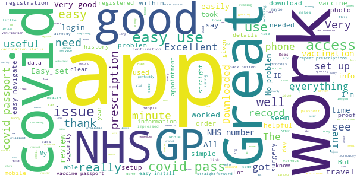

# NHS App
App version ``1.48.7``

Analyzed with [covid-apps-observer](http://github.com/covid-apps-observer) project, version ``0.1``

## App overview
| | |
|-------------------------|-------------------------| 
| **Name**&nbsp;&nbsp;&nbsp;&nbsp;&nbsp;&nbsp;&nbsp;&nbsp;&nbsp;&nbsp;&nbsp;&nbsp;&nbsp;&nbsp;&nbsp;&nbsp;&nbsp;&nbsp;&nbsp;&nbsp;&nbsp;&nbsp;&nbsp;&nbsp;&nbsp;&nbsp;&nbsp;&nbsp;&nbsp;&nbsp;&nbsp;&nbsp;&nbsp;&nbsp;&nbsp;&nbsp;&nbsp;&nbsp;&nbsp;&nbsp;  | NHS App |
| **Unique identifier** | com.nhs.online.nhsonline |
| **Link to Google Play** | [https://play.google.com/store/apps/details?id=com.nhs.online.nhsonline](https://play.google.com/store/apps/details?id=com.nhs.online.nhsonline) |
| **Summary**  | Access NHS services in England |
| **Privacy policy** | [https://www.nhs.uk/using-the-nhs/nhs-services/the-nhs-app/privacy/](https://www.nhs.uk/using-the-nhs/nhs-services/the-nhs-app/privacy/) |
| **Latest version** | 1.48.7 |
| **Last update** | 2021-04-13 10:30:09 |
| **Recent changes** | Improvements:  - We have renamed &quot;Settings&quot; to &quot;More&quot; and updated the icon - Bug fixes, and various performance, stability and accessibility enhancements |
| **Installs**  | 1,000,000+ |
| **Category** | Medical |
| **First release** | Dec 31, 2018 |
| **Size**  | 56M |
| **Supported Android version**  | 5.0 and up |

### Description
> <b>This is not the NHS COVID-19 app. To download the NHS COVID-19 contact tracing app, go to covid19.nhs.uk</b>
 Owned and run by the NHS, the NHS App is a simple and secure way to access a range of NHS services on your smartphone or tablet.
 To use the NHS App you must be aged 13 and over and registered with a GP surgery in England.
 You can also access NHS App services from the browser on your desktop or laptop computer. Go to www.nhs.uk/app
 Use the NHS App to:
 •	get advice about coronavirus
 •	order your repeat prescriptions
 •	book and manage appointments at your GP surgery
 •	get health information and advice
 •	view your health record securely
 •	register your organ donation decision
 •	find out how the NHS uses your data
 If your GP surgery or hospital offers other services in the NHS App, you may be able to:
 •	message your GP surgery, doctor or health professional online
 •	consult a GP or health professional through an online form and get a reply
 •	access health services on behalf of someone you care for
 •	view your hospital and other healthcare appointments
 •	view useful links your doctor or health professional has shared with you
 •	view and manage your care plans
 Get advice about coronavirus 
 ---------------------------------------
 Get information about coronavirus and find out what to do if you think you have it.
 Order repeat prescriptions 
 -----------------------------------
 See your available medicines, request a new repeat prescription and choose a pharmacy for your prescriptions to be sent to.
 Book appointments
 --------------------------
 Search for, book and cancel appointments at your GP surgery. See details of your upcoming and past appointments.
 Get health advice
 -----------------------------
 Search trusted NHS information and advice on hundreds of conditions and treatments. You can also answer questions to get instant advice or medical help near you. 
 View your health record
 ----------------------------------
 Securely access your GP health record, to see information like your allergies and your current and past medicines. If your GP surgery has given you access to your detailed medical record, you can also see information like test results and details of your consultations. 
 Register your organ donation decision
 --------------------------------------------------
 Choose to donate some or all of your organs and check your registered decision.
 Find out how the NHS uses your data
 -------------------------------------------------
 Choose if data from your health records is shared for research and planning.
 Keeping your data secure
 ---------------------------------
 After you download the app, you will need to set up an NHS login and prove who you are. The app then securely connects to information from your GP surgery. 
 If your Android device supports fingerprint detection, you can use it to log in to the NHS App each time, instead of using a password and security code.

### User interface
The developers of the app provide the following screenshots in the Google play store.
| | | |
|:-------------------------:|:-------------------------:|:-------------------------:|
 |   |   |   | 
 |   |   |   | 
 |   |   |   | 
 |   |   |   | 
 |   |   |   | 
 |   |   |   | 

## Development team
In the following we report the main information provided by the development team in the Google play store.

| | |
|-------------------------|-------------------------|
| **Developer**  | NHS Digital |
| **Website**  | [https://www.nhs.uk/using-the-nhs/nhs-services/the-nhs-app/help/](https://www.nhs.uk/using-the-nhs/nhs-services/the-nhs-app/help/) |
| **Email** | nhsapp@nhs.net |
| **Physical address**  | - |
| **Other developed apps**  | [https://play.google.com/store/apps/developer?id=NHS+Digital](https://play.google.com/store/apps/developer?id=NHS+Digital) |

## Android support

| | |
|-------------------------|-------------------------|
| **Declared target Android version**  | Pie, version 9 (API level 28) |
| **Effective target Android version**  | Pie, version 9 (API level 28) |
| **Minimum supported Android version**  | Lollipop, version 5.0 (API level 21) |
| **Maximum target Android version**  | - |

The larger the difference between the minimum and maximum supported Android versions, the better. A larger difference means a wider audience. For example, old phones have a very low Android version, so a high minimum supported Android version means that the app cannot be used by users with old phones, thus leading to accessibility problems. 

## Requested permissions

In the following we report the complete list of the permissions requested by the app. 

| **Permission** | **Protection level** | **Description** | 
|-------------------------|-------------------------|-------------------------|
 **android.permission ACCESS_FINE_LOCATION** | :warning:**Dangerous** | Allows an app to access precise location. 
 **android.permission ACCESS_NETWORK_STATE** | Normal | Allows applications to access information about networks. 
 **android.permission CAMERA** | :warning:**Dangerous** | Required to be able to access the camera device. 
 **android.permission INTERNET** | Normal | Allows applications to open network sockets. 
 **android.permission MODIFY_AUDIO_SETTINGS** | Normal | Allows an application to modify global audio settings. 
 **android.permission READ_EXTERNAL_STORAGE** | :warning:**Dangerous** | Allows an application to read from external storage. 
 **android.permission READ_PHONE_STATE** | :warning:**Dangerous** | Allows read only access to phone state, including the phone number of the device, current cellular network information, the status of any ongoing calls, and a list of any PhoneAccounts registered on the device. 
 **android.permission RECORD_AUDIO** | :warning:**Dangerous** | Allows an application to record audio. 
 **android.permission USE_FINGERPRINT** | Normal | This constant was deprecated in API level 28. Applications should request USE_BIOMETRIC instead 
 **android.permission WAKE_LOCK** | Normal | Allows using PowerManager WakeLocks to keep processor from sleeping or screen from dimming. 
 **android.permission WRITE_EXTERNAL_STORAGE** | :warning:**Dangerous** | Allows an application to write to external storage. 
 **com.google.android.c2dm.permission RECEIVE** | - | - 
 **com.google.android.finsky.permission BIND_GET_INSTALL_REFERRER_SERVICE** | - | - 
 **org.fidoalliance.uaf.permissions FIDO_CLIENT** | - | - 

## Mentioned servers

| **Server** | **Registrant** | **Registrant country** | **Creation date** | 
|-------------------------|-------------------------|-------------------------|-------------------------|
 | googlesyndication.com | Google LLC | :us: US | 2003-01-21 06:17:24 |
 | google.com | Google LLC | :us: US | 1997-09-15 04:00:00 |
 | app-measurement.com | Google LLC | :us: US | 2015-06-19 20:13:31 |

## Security analysis 

Below we report the main security warnings raised by our execution of the [Androwarn](https://github.com/maaaaz/androwarn) security analysis tool.

**Connection interfaces exfiltration**
> - This application reads details about the currently active data network 

**Telephony services abuse**
> - This application makes phone calls 

## User ratings and reviews

Below we provide information about how end users are reacting to the app in terms of ratings and reviews in the Google Play store.

### Ratings

The NHS App app has been installed by more than **1000000** times. At this time, **7245** rated the app and its average score is **3.4703448**. Below we show the distribution of the ratings across the usual star-based rating of Google Play

:star::star::star::star::star:: 3429

:star::star::star::star:: 1019

:star::star::star:: 409

:star::star:: 309

:star:: 2079

### Reviews 

#### 5-star reviews

> Easy to register and use app on Android phone. Has all the info I need including covid vaccination dates. Well done NHS!  :date: __2021-05-13 16:23:53__

> Easy to install and good to show my vaccinations are up to date.  :date: __2021-05-13 03:11:58__

> So easy to use Set up in 5 minutes and now have vaccine record  :date: __2021-05-12 19:58:36__

> Easy to use.  :date: __2021-05-12 14:59:27__

> From download to full access took around 5 minutes, and was pretty smooth. I want to be ready for when Covid vaccination status can be proved via this app (I need to travel for work purposes as soon as practicable).  :date: __2021-05-12 14:42:50__

> Simple and good speed of response even though I did not have me nhs number  :date: __2021-05-12 12:25:12__

> Very easy to use. Great app  :date: __2021-05-12 11:41:40__

> Have registered no problem and have access. Can I use the same app to register my husband? We are elderly and only have one mobile phone  :date: __2021-05-12 11:04:13__

> Easy to navigate. We'll thought out  :date: __2021-05-12 10:48:12__

> Brilliant app and has all my information along with the all important Covid vaccination records  :date: __2021-05-12 09:31:39__

#### 4-star reviews

> I found registering the App surprisingly easy - the security steps were a bit cumbersome but understandable and they worked perfectly. I was able to choose fingerprint login which I tested subsequently and I had no problems with that. I was immediately able to see all my GP records so I can now prove I'm fully vaccinated against Covid19. Hurrah! Well done NHS.  :date: __2021-05-13 10:53:51__

> I found it easy to install and register, except for the taking a photo. The app decided when to take the photo instead of the user, I think it should be the other way round as I had glasses on still reading instructions, whereas the comparisons picture for validation was my driving licence which does not have me wearing glasses. Overall it is early days, I think it is a good thing that the NHS shares the data it has with the patient, afterall it is the patients data, and it engenders trust.  :date: __2021-05-13 10:41:36__

> After getting full access from my GP, I found the records of my two Covid jabs. I'm not sure how could this app be used as a 'vaccine passport'. It's akward. On one page there's my name and DoB. Then I have to click on a link, where among few hundred other records the vaccination records can be found (without any personal details...). If I would like to use this app for travel, it also would be very useful if the number of my 'real' passport would be indicated somewhere.  :date: __2021-05-13 01:54:40__

> Works well for me . But so much hassle to add my husband by proxy access. Thanks to the reply👍I ve got this sorted. Thank you  :date: __2021-05-13 00:34:23__

> Good  :date: __2021-05-13 00:06:21__

> Good for access to records. Please make the Back button actually go back a page and not request exiting the app.  :date: __2021-05-12 18:58:28__

> Took 5 minutes to register. I found it easy. I think having my NHS number probably helped. I cannot see my vaccination status though. Is this because my GP practice is not allowing this information to be shown yet? - thanks for your response. I appreciate my GP practice controls what I can see. Everyone having to individually contact their GP practice to ask for access to their vaccination status, just seems a bit bonkers. Haven't they got enough to do? 🙄🤣  :date: __2021-05-12 13:18:05__

> Surprisingly useful and efficient, I'm glad this app was made. Currently I am having issues on Android where it doesn't load so hopefully that can be fixed soon  :date: __2021-05-12 11:43:32__

> It took me a few minutes to set up as I also have the NHS Covid 19 app and seemed to be directed to that! However, I got there in the end and I think it's very good.  :date: __2021-05-12 10:30:16__

> This is a must if you are interested in your personal health and wellbeing. It gives you access to your medical record, allows you to book appointments and repeat prescriptions. It will soon offer a covid vaccine proof service. Forget those who are in denial. It works.  :date: __2021-05-11 20:12:58__

#### 3-star reviews

> I downloaded the app specifically for my vaccine status but can't find it.  :date: __2021-05-13 14:55:46__

> Still getting to know how good this app is, but so it's doing ok, hence the 3⭐ Hopefully it will be better once we have our vaccine status added, to help enable us to travel further than our back garden!!  :date: __2021-05-13 12:10:14__

> Cant get onto settings to change emails or phone numbers  :date: __2021-05-13 10:48:28__

> Rubbish  :date: __2021-05-12 20:14:57__

> Unsure of the benefit. It's supposed to display my covid vaccination status but I can't see how to find that without displaying my entire medical record.  :date: __2021-05-12 19:07:26__

> Unable to log in, or access my records etc  :date: __2021-05-12 16:55:15__

> OK as far as it went! The app downloaded fine, took my information to install the app. The next step was to prove my identity to gain full access. I uploaded my drivers licence once and my passport three times. Dispite numerous attempts this was as far as I got. The face scanning did not work nor did the video. I had already seen the answer, but thank you. I managed to get further the following day by 1. not wearing glasses and 2. uploading a file previously made and not using the camera.  :date: __2021-05-12 16:41:13__

> Great for repeat prescriptions, but I can't access my records, see booked appointments or proof of my Covid vacinations.  :date: __2021-05-12 10:39:36__

> It's a bit clunky, and the registration process with flashing coloured lights is downright peculiar. Worst bit is that after telling me in the Android app I can use fingerprint or face login it turns out it doesn't support face login on Android and my Pixel 4 only does face login.  :date: __2021-05-12 09:25:22__

> Pretty good app but can't reorder my medication because they have put the date I last ordered them 3 months in advance  :date: __2021-05-11 22:31:50__

#### 2-star reviews

> Everything was fine until I was asked to allow the app access to files and media on my device. I did not tick this box and I then couldn't get to the camera to photograph my passport . Why do you need access to files??  :date: __2021-05-13 17:38:24__

> e-mail address, practice ID, access ID, password (= linkage key), user ID (= account ID), ODS code, another different linkage key, mobile phone number. Date of birth, postcode, NHS number. To find some of this I had to log in to an online account my GP uses, which has its own password, etc. Of course, this app requires its own password. I have received a text message with an "NHS login code." After all that, my GP provides no online access to my medical records.  :date: __2021-05-13 14:07:58__

> Ok  :date: __2021-05-13 13:25:02__

> Very very basic and error messages on some features. Does not link into any useful features like booking appointments or ordering prescriptions. Organ donation section not working, error message. A disapointing app.  :date: __2021-05-13 09:45:47__

> Downloaded it to check me jabs we're on can't access my records haven't got online access for anything have to write to me doctors for permission for it  :date: __2021-05-12 21:05:53__

> Cannot access anything, no appointments, no prescription, no doctors records.. waste of time  :date: __2021-05-12 19:59:05__

> Set up but unable to use as just goes around in circles with error - email sent for support  :date: __2021-05-12 17:18:59__

> Can't register. It says enter your email to set up account. Then a password. It then says password not recognised. Well as I'm not registered it will say this  :date: __2021-05-12 11:36:13__

> Outdated before release . It's 2021 not 1991.. about as good as overpriced contracts carried out by inexperienced developers winging a sales pitch get. Can't book local appointments as it doesn't integrate with system one which is used by our local NHS. You would expect a lot more including video conference with GPs and consultants etc. Sending messages to GP, ability to download your record.. It's basically basic considering how much the developers were paid.  :date: __2021-05-12 11:04:13__

> Dificult to install and manage. Does not appear in my apps, have to go to app store every time I want to use it. Not recommended. Another half baked government project  :date: __2021-05-12 09:47:07__

#### 1-star reviews

> Appears to be broken. Hangs after entering an email addrees. Par for the course for NHS IT I guess.  :date: __2021-05-13 17:55:27__

> AVOID! CAK ON STILTS! AUTOMATED REPLIES THAT DO NOT DEAL WITH ISSUE!! APP REQUIRES REPEATED PROOF OF YOUR IDENTITY AND ITS NOT UNTIL THE FINAL STAGE CUSTOMERS ARE TOLD THAT IT REQUIRES A PHOTO ID OR 3 NUMBERS (NONE OF WHICH MEAN ANYTHING TO AN ORDINARY MORTAL LIKE ME) FATALLY FLAWED. OVER BUREAUCRATIC. UNCUSTOMER FRIENDLY. INFERIOR DESIGN. U N I N S T A L L E D.. .  :date: __2021-05-13 17:39:09__

> Hello TEAM NHS JUST like Geoffrey...11/05/21 FEEDBACK TO YOU...I would prefer additional OPTIONS...1) facial recognition &/or 4 OR 6 DIGIT CODE... currently using 1 X FINGERPRINT ACCESS...(AS I X FINGER ONLY?!!) AS NO OTHER OPTIONS AVAILABLE.... I'M USING ANDROID VERSION 11. GOOD LUCK WITH OFFICIAL UK GOVT NHS COVID VACCINATION STATUS FOR GLOBAL BORDER CONTROL PURPOSES ROLL OUT MON 17/05/21  :date: __2021-05-13 17:26:32__

> Tried installing the app but just got the circle going round and round and it never started so I have deleted it now. Bit worrying if this is the platform for covid vaccine certificates!  :date: __2021-05-13 17:22:59__

> Went through the whole process only to be told at the last hurdle it Only works in England. So much for a United Kingdom. Waste of time.  :date: __2021-05-13 16:40:49__

> Doesn't load  :date: __2021-05-13 15:19:46__

> Cannot update It's always playing up  :date: __2021-05-13 12:32:28__

> Very muddled app layout and incomplete medical information. This is particularly disappointing given that the app developers have taken £ millions from the NHS/Govt to do this work.  :date: __2021-05-13 12:25:51__

> Can't log in. Doesn't recognise my NHS number or my name or address. Everything is correct so useless if you can't get past log in page  :date: __2021-05-13 10:52:54__

> It won't open. It tries to load ad infinitum.  :date: __2021-05-13 10:49:23__

