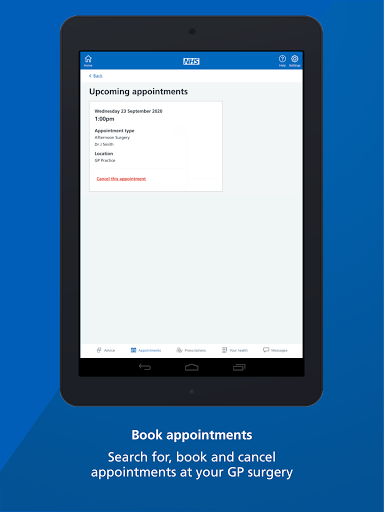

# NHS App
App version ``1.48.7``

Analyzed with [covid-apps-observer](http://github.com/covid-apps-observer) project, version ``0.1``

## App overview
| | |
|-------------------------|-------------------------| 
| **Name**&nbsp;&nbsp;&nbsp;&nbsp;&nbsp;&nbsp;&nbsp;&nbsp;&nbsp;&nbsp;&nbsp;&nbsp;&nbsp;&nbsp;&nbsp;&nbsp;&nbsp;&nbsp;&nbsp;&nbsp;&nbsp;&nbsp;&nbsp;&nbsp;&nbsp;&nbsp;&nbsp;&nbsp;&nbsp;&nbsp;&nbsp;&nbsp;&nbsp;&nbsp;&nbsp;&nbsp;&nbsp;&nbsp;&nbsp;&nbsp;  | NHS App |
| **Unique identifier** | com.nhs.online.nhsonline |
| **Link to Google Play** | [https://play.google.com/store/apps/details?id=com.nhs.online.nhsonline](https://play.google.com/store/apps/details?id=com.nhs.online.nhsonline) |
| **Summary**  | Access NHS services in England |
| **Privacy policy** | [https://www.nhs.uk/using-the-nhs/nhs-services/the-nhs-app/privacy/](https://www.nhs.uk/using-the-nhs/nhs-services/the-nhs-app/privacy/) |
| **Latest version** | 1.48.7 |
| **Last update** | 2021-04-13 10:30:09 |
| **Recent changes** | Improvements:  - We have renamed &quot;Settings&quot; to &quot;More&quot; and updated the icon - Bug fixes, and various performance, stability and accessibility enhancements |
| **Installs**  | 1,000,000+ |
| **Category** | Medical |
| **First release** | Dec 31, 2018 |
| **Size**  | 56M |
| **Supported Android version**  | 5.0 and up |

### Description
> <b>This is not the NHS COVID-19 app. To download the NHS COVID-19 contact tracing app, go to covid19.nhs.uk</b>
 Owned and run by the NHS, the NHS App is a simple and secure way to access a range of NHS services on your smartphone or tablet.
 To use the NHS App you must be aged 13 and over and registered with a GP surgery in England.
 You can also access NHS App services from the browser on your desktop or laptop computer. Go to www.nhs.uk/app
 Use the NHS App to:
 •	get advice about coronavirus
 •	order your repeat prescriptions
 •	book and manage appointments at your GP surgery
 •	get health information and advice
 •	view your health record securely
 •	register your organ donation decision
 •	find out how the NHS uses your data
 If your GP surgery or hospital offers other services in the NHS App, you may be able to:
 •	message your GP surgery, doctor or health professional online
 •	consult a GP or health professional through an online form and get a reply
 •	access health services on behalf of someone you care for
 •	view your hospital and other healthcare appointments
 •	view useful links your doctor or health professional has shared with you
 •	view and manage your care plans
 Get advice about coronavirus 
 ---------------------------------------
 Get information about coronavirus and find out what to do if you think you have it.
 Order repeat prescriptions 
 -----------------------------------
 See your available medicines, request a new repeat prescription and choose a pharmacy for your prescriptions to be sent to.
 Book appointments
 --------------------------
 Search for, book and cancel appointments at your GP surgery. See details of your upcoming and past appointments.
 Get health advice
 -----------------------------
 Search trusted NHS information and advice on hundreds of conditions and treatments. You can also answer questions to get instant advice or medical help near you. 
 View your health record
 ----------------------------------
 Securely access your GP health record, to see information like your allergies and your current and past medicines. If your GP surgery has given you access to your detailed medical record, you can also see information like test results and details of your consultations. 
 Register your organ donation decision
 --------------------------------------------------
 Choose to donate some or all of your organs and check your registered decision.
 Find out how the NHS uses your data
 -------------------------------------------------
 Choose if data from your health records is shared for research and planning.
 Keeping your data secure
 ---------------------------------
 After you download the app, you will need to set up an NHS login and prove who you are. The app then securely connects to information from your GP surgery. 
 If your Android device supports fingerprint detection, you can use it to log in to the NHS App each time, instead of using a password and security code.

### User interface
The developers of the app provide the following screenshots in the Google play store.
| | | |
|:-------------------------:|:-------------------------:|:-------------------------:|
 |   |   |   | 
 |   |   |   | 
 |   |   |   | 
 |   |   |   | 
 |   |   |   | 
 |   |   |   | 

## Development team
In the following we report the main information provided by the development team in the Google play store.

| | |
|-------------------------|-------------------------|
| **Developer**  | NHS Digital |
| **Website**  | [https://www.nhs.uk/using-the-nhs/nhs-services/the-nhs-app/help/](https://www.nhs.uk/using-the-nhs/nhs-services/the-nhs-app/help/) |
| **Email** | nhsapp@nhs.net |
| **Physical address**  | - |
| **Other developed apps**  | [https://play.google.com/store/apps/developer?id=NHS+Digital](https://play.google.com/store/apps/developer?id=NHS+Digital) |

## Android support

| | |
|-------------------------|-------------------------|
| **Declared target Android version**  | Pie, version 9 (API level 28) |
| **Effective target Android version**  | Pie, version 9 (API level 28) |
| **Minimum supported Android version**  | Lollipop, version 5.0 (API level 21) |
| **Maximum target Android version**  | - |

The larger the difference between the minimum and maximum supported Android versions, the better. A larger difference means a wider audience. For example, old phones have a very low Android version, so a high minimum supported Android version means that the app cannot be used by users with old phones, thus leading to accessibility problems. 

## Requested permissions

In the following we report the complete list of the permissions requested by the app. 

| **Permission** | **Protection level** | **Description** | 
|-------------------------|-------------------------|-------------------------|
 **android.permission ACCESS_FINE_LOCATION** | :warning:**Dangerous** | Allows an app to access precise location. 
 **android.permission ACCESS_NETWORK_STATE** | Normal | Allows applications to access information about networks. 
 **android.permission CAMERA** | :warning:**Dangerous** | Required to be able to access the camera device. 
 **android.permission INTERNET** | Normal | Allows applications to open network sockets. 
 **android.permission MODIFY_AUDIO_SETTINGS** | Normal | Allows an application to modify global audio settings. 
 **android.permission READ_EXTERNAL_STORAGE** | :warning:**Dangerous** | Allows an application to read from external storage. 
 **android.permission READ_PHONE_STATE** | :warning:**Dangerous** | Allows read only access to phone state, including the phone number of the device, current cellular network information, the status of any ongoing calls, and a list of any PhoneAccounts registered on the device. 
 **android.permission RECORD_AUDIO** | :warning:**Dangerous** | Allows an application to record audio. 
 **android.permission USE_FINGERPRINT** | Normal | This constant was deprecated in API level 28. Applications should request USE_BIOMETRIC instead 
 **android.permission WAKE_LOCK** | Normal | Allows using PowerManager WakeLocks to keep processor from sleeping or screen from dimming. 
 **android.permission WRITE_EXTERNAL_STORAGE** | :warning:**Dangerous** | Allows an application to write to external storage. 
 **com.google.android.c2dm.permission RECEIVE** | - | - 
 **com.google.android.finsky.permission BIND_GET_INSTALL_REFERRER_SERVICE** | - | - 
 **org.fidoalliance.uaf.permissions FIDO_CLIENT** | - | - 

## Mentioned servers

| **Server** | **Registrant** | **Registrant country** | **Creation date** | 
|-------------------------|-------------------------|-------------------------|-------------------------|
 | googlesyndication.com | Google LLC | :us: US | 2003-01-21 06:17:24 |
 | google.com | Google LLC | :us: US | 1997-09-15 04:00:00 |
 | app-measurement.com | Google LLC | :us: US | 2015-06-19 20:13:31 |

## Security analysis 

Below we report the main security warnings raised by our execution of the [Androwarn](https://github.com/maaaaz/androwarn) security analysis tool.

**Connection interfaces exfiltration**
> - This application reads details about the currently active data network 

**Telephony services abuse**
> - This application makes phone calls 

## User ratings and reviews

Below we provide information about how end users are reacting to the app in terms of ratings and reviews in the Google Play store.

### Ratings

The NHS App app has been installed by more than **1000000** times. At this time, **7245** rated the app and its average score is **3.4703448**. Below we show the distribution of the ratings across the usual star-based rating of Google Play

:star::star::star::star::star:: 3429

:star::star::star::star:: 1019

:star::star::star:: 409

:star::star:: 309

:star:: 2079

### Reviews 

#### 5-star reviews

> Easy to install and use, especially as I'm a technophobe  :date: __2021-05-22 13:50:42__

> I found it easy to install and very user friendly. Considering the complexity that sits behind the app to link with GP practices and other systems I reckon NHS Digital have done a great job. Thanks team and keep up the good work!  :date: __2021-05-22 12:19:01__

> Could not get through passing my details across via a camera on my tablet - the 'oval' did not even pick up my face and i did try 4 times. I appreciats that identity has to be proved in some way, but this just defeated me. I will try again when/if there is a better solution Since my last post, i have successfully dowmloaded the latest version, registered and used the app. It is a good product, and i am happy to have it. Well done all involved!!  :date: __2021-05-22 12:06:37__

> I love this app, can access your repeat prescription, plus much more. Very easy to use.  :date: __2021-05-22 11:20:17__

> Excellent service  :date: __2021-05-22 00:34:19__

> Simple to set up and use. No problems encountered at all.  :date: __2021-05-21 23:34:49__

> You can reorder prescriptions which is great.  :date: __2021-05-21 22:40:49__

> No issues, works fine and confirms that two vaccinations have been had  :date: __2021-05-21 19:20:50__

> TEAM NHS... EXCELLENT WORK ADMINISTRATORS.... WITHIN PROVISION OF 1.OPTIONAL FINGERPRINT ACCESS USING ANDROID VERSION 11. 2. RECEIVED OFFICIAL UK GOVT NHS COVID VAC STATUS PAPER CERTIFICATE ROLLOUT VIA EMAIL REF FOR BORDER CONTROL TRAVEL PURPOSES🚀🛸🪐🌌✈️🌍🌎🌏🗺️ *JUST DOWNLOADED.FRI 21/05. *REF UPDATE:*APP working VERY WELL via 1.MULTIPLE FINGERRINT recognition achieved. 2. NHS APP OVERVIEW HAS CLEAR MEDICAL RECORDS DISPLAY. 👩‍⚕️💉🍾🥇👍🚀ps.. GOOGLE saved STRONG password OPTION also works  :date: __2021-05-21 17:50:54__

> Very good app and from me that means a lot.  :date: __2021-05-21 15:44:02__

#### 4-star reviews

> NHS app finally updated the over envasive security requirements to request the already existing patient data from your GP. A great improvement. The login process needs massive improvement, fingerprint doesn't work or prompt. Will review the app shortly, thx  :date: __2021-05-22 09:53:13__

> Impressive features, I look forward to making use of them to reduce the time I spend trying to get through to my GP's surgery. My biggest gripe is that the app breaks the Android back button. It doesn't take you BACK to the previous page, it tries to log you out of the app every time press use it. To get back, you need to tap a link on the page, also marked "Back". Otherwise I would have given the app 5 stars. It was ironic to have to submit my passport and a video of myself given that anyone who knows my name, date of birth and address can access / alter this information over the phone with my GP's surgery. I suspect that this is more of a problem with my GP's surgery than this app though. I'm also surprised that it's acceptable to restrict full access to the app to people who have paid to have a form of photo ID given the claims made about measures to combat election fraud recently.  :date: __2021-05-21 17:35:03__

> Why does my covid passport have an expiration date? (20/06/21)  :date: __2021-05-21 12:15:17__

> Could someone please tell me how to register a second person . We both use same email . There doesn't seem to be any way to set up new registration using same email .  :date: __2021-05-21 10:39:29__

> Working fine now, registered with local GP online and my records show in the app.  :date: __2021-05-21 10:35:06__

> I have registered ok and I can log in but it didn't ask me to submit a ID photo or my picture? How do I do this?  :date: __2021-05-20 23:05:37__

> I found it easy to install and register, except for the taking a photo. The app decided when to take the photo instead of the user, I think it should be the other way round as I had glasses on still reading instructions, whereas the comparisons picture for validation was my driving licence which does not have me wearing glasses. I think it is a good thing that the NHS shares the data it has with the patient. The only problem I had was trying to check the QR code. Is there a special app to read it or anything you can recommend, because when I tried a QR reader or Scanner against it I just got "gobblygook" text, so I have no idea if the QR code actually works, It would be good to check that it did, before I used it in earnest. Thanks  :date: __2021-05-20 22:58:40__

> Was a bit annoyed at first as it wants an email address to confirm identity - and the mail didnt arrive. Turned out it was somehow being regarxed as spam....duh Followed the reg process - youll need your nhs number - and it was then fine.and in then shows my covid vaccination status, which is actually quite cool  :date: __2021-05-20 19:30:28__

> It's good but should have section to virtually hold the GHIC travel health card. It should also hold Covid 19 vaccination status, test status, that can be used in conjunction with airlines and other countries proof of vaccination. The app should also generate a QR code for vaccine status that is compatible with the EU Digital Green Certificate.  :date: __2021-05-20 17:56:16__

> It works well.  :date: __2021-05-20 17:41:25__

#### 3-star reviews

> Navigation is frustrating, every time I swipe to go back it offers to fog me out. Text on icons at the bottom of screen is too small.  :date: __2021-05-22 12:46:18__

> I have downloaded the app and it's working well. However, I had my second vaccination early in January and it seems that my passport will expire in June of this year. Will I still be able to travel abroad? Denis Tall  :date: __2021-05-22 09:06:49__

> Complex to get into! Got as far as taking a video to prove who I am. Said it was in a format that it couldn't open. I use an Android 9 phone. Can't do anything about it. The app is not user friendly.  :date: __2021-05-21 23:19:36__

> I registered my husband using his phone - no problem! I am now trying to register myself on my phone. I was easily able to upload my ID documents but I am unable to verify my ID with a scanned photograph. The app won't allow me to use the camera function!!!!  :date: __2021-05-21 19:28:29__

> Can't find my passport covid on this app where and how can I find it please  :date: __2021-05-21 10:43:12__

> Cannot find my Covid vaccination status, i have had both doses and only the card given back at the centre.  :date: __2021-05-21 10:05:13__

> I installed the app in my mobile and it worked perfectly. But, when I installed the app in my wife's mobile, it demanded to do a prove who am I, I did the photo of the driving licence and record a small video with numbers , which it didn't go. That's completely stupid and no need to do it . I gave all the details of my wife and nhs number, so no need to make it complicated. My app in my mobile didn't ask me for the prove who am I. It access easily to my health records.  :date: __2021-05-21 09:37:29__

> Hardly works properly always kicking out errors when trying to access it, fingerprint keeps switching itself off. One of the most useless apps I have ever used. I was in A&E at the beginning of the week and it didn't even register. Someone seriously needs to get a grip of this app.  :date: __2021-05-21 08:07:26__

> Oh dear. For a health app, the devs don't seem to have heard of accessibility. The icons at the bottom of the screen are poor anyway so need text. I needed a magnifier to read that text! And then there's the inconsistent way of going "back". Sometimes there is a Back link on-screen, sometimes not. The only thing which seems consistent is that the Android back button doesn't do what you'd want to do. The app seems to be a poor quality copy of an iOS app rather than being fit for purpose on Androi  :date: __2021-05-20 19:33:50__

> I have downloaded app but keeps telling me we are experiencing technical difficulties try again. I've tried many times still no luck Have tried again and it seems to be working. Thank you for responding  :date: __2021-05-20 18:38:46__

#### 2-star reviews

> Impossible to complete the registration process, I gave up after 3 attempts.  :date: __2021-05-22 17:22:09__

> Not for the UK it's for England only.  :date: __2021-05-22 11:49:14__

> Initially it seemed that with Android 5.1 it was impossible to download the app. Hooray! Persistence was rewarded! I managed to download and install the app at my third attempt! But it seems impossible to get past the big blue NHS logo on the first webpage. The app is too big for my limited 'memory' - and won't let me move it to my SD where there is loads of space! Will report further in coming days.  :date: __2021-05-22 10:58:24__

> Why do you need my photo to log on?  :date: __2021-05-22 07:45:03__

> Used to work ok, but since they added the covid19 vaccination pages, I just get an error when I try to access my health records. Until that's fixed, the app does nothing other than prove I've had my cv19 jabs.  :date: __2021-05-22 00:04:35__

> App works OK but cannot log out by going to menu and selecting log out. It takes you back to logging in screen. Ony way is to force close the app. How can an app be released with such an issue.  :date: __2021-05-21 21:45:13__

> I AM STRUGGLING TO GET MY REPEAT PRESCRIPTIONS . UNABLE TO LOGIN VERY FRUSTRATING .... THE CODE IS NOT COMING THROUGH ON MY MOBILE PHONE  :date: __2021-05-21 18:10:37__

> Password requirement means that it is not easy to remember and the app requires it to be input every time it is used even on what I have told it is a trusted device. I am signed up for online prescription ordering but the app says I am not. Get this fixed please.  :date: __2021-05-21 13:16:21__

> Unable to verify identity. Have made two or three attempts to verify my identity, so can't even use the app, which as it is rhe official app for proving one has had the jabs is fairly unhelpful. I uploaded a photo successfully, then tried facial scan but then just got "please wait" for ages before the app chucked me off. Further attempts won't give me facial scan option, only video option and then that comes up as "file not recognised". A NOT splendid way to waste several hours!  :date: __2021-05-21 08:10:02__

> Cannot find NHS records despite repeatedly trying  :date: __2021-05-21 00:45:47__

#### 1-star reviews

> I've tried several times I get to the code and it f???s me of  :date: __2021-05-22 17:19:01__

> Unable to log in with name OR NHS no. Useless...  :date: __2021-05-22 17:17:37__

> Awful. Tried to register twice. Takes me through the whole rigmarole only to say it cannot connect to my GP "having technical issues, please try again later". How many days later should I be trying? Been like this for days. Other half had no issues registering, I'm not so lucky.  :date: __2021-05-22 17:15:26__

> Unable to login! Keep getting the same error message. Uninstalled and reinstalled app twice but still the same! Grrrrr!  :date: __2021-05-22 17:01:27__

> Usless app. As part of the id verification you have to film a video saying a pin. But the app makes it impossible to do it successfully. Tried on multiple devices. Won't start camera successfully, and misidentifies video as photo. Usless.  :date: __2021-05-22 16:23:31__

> It won't accept my details. Saying they are wrong. I'm pretty sure I'm putting my name in correctly 🙄 it's also saying my nhs number is wrong which it isnt  :date: __2021-05-22 15:30:03__

> Abysmal. Would not set up on my mobile. Waste of time. Please ask for your money back. (Apparently, the developer has responded. Unfortunately, their response is not visible to me.) Tried it again. Still does not work with my new up to date Android phone. Will not waste more time.  :date: __2021-05-22 15:03:30__

> Edited: Support now tell me i need to email a URL link to my practice to tell them how to give me access. Thing is my GP practice has no email access for patients - it is phone or Fax ONLY. Hopeless. Par for the course for NHS IT.  :date: __2021-05-22 14:40:55__

> Can't believe how bad this app is. The log on process is unbelievably complex. I realise that it must be secure but the logging on process is far to cumbersone.  :date: __2021-05-22 14:00:18__

> Not compatible with the Android password manager. This forces people to use easy to remember passwords. Goes against NCSC advice!  :date: __2021-05-22 13:57:57__

