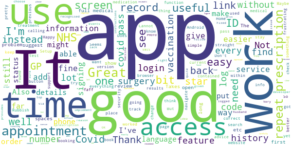
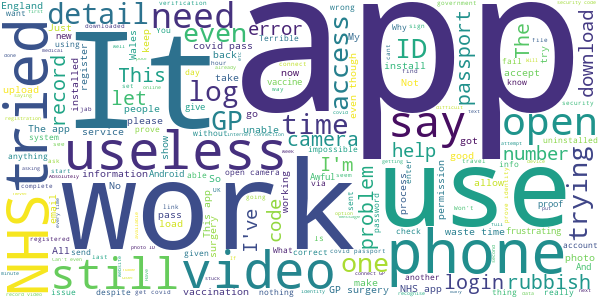

# NHS App
App version ``1.48.7``

Analyzed with [covid-apps-observer](http://github.com/covid-apps-observer) project, version ``0.1``

## App overview
| | |
|-------------------------|-------------------------| 
| **Name**                                          | NHS App |
| **Unique identifier** | com.nhs.online.nhsonline |
| **Link to Google Play** | [https://play.google.com/store/apps/details?id=com.nhs.online.nhsonline](https://play.google.com/store/apps/details?id=com.nhs.online.nhsonline) |
| **Summary**  | Access NHS services in England |
| **Privacy policy** | [https://www.nhs.uk/using-the-nhs/nhs-services/the-nhs-app/privacy/](https://www.nhs.uk/using-the-nhs/nhs-services/the-nhs-app/privacy/) |
| **Latest version** | 1.48.7 |
| **Last update** | 2021-04-13 10:30:09 |
| **Recent changes** | Improvements:  - We have renamed &quot;Settings&quot; to &quot;More&quot; and updated the icon - Bug fixes, and various performance, stability and accessibility enhancements |
| **Installs**  | 1,000,000+ |
| **Category** | Medical |
| **First release** | Dec 31, 2018 |
| **Size**  | 56M |
| **Supported Android version**  | 5.0 and up |

### Description
> <b>This is not the NHS COVID-19 app. To download the NHS COVID-19 contact tracing app, go to covid19.nhs.uk</b>
 Owned and run by the NHS, the NHS App is a simple and secure way to access a range of NHS services on your smartphone or tablet.
 To use the NHS App you must be aged 13 and over and registered with a GP surgery in England.
 You can also access NHS App services from the browser on your desktop or laptop computer. Go to www.nhs.uk/app
 Use the NHS App to:
 •	get advice about coronavirus
 •	order your repeat prescriptions
 •	book and manage appointments at your GP surgery
 •	get health information and advice
 •	view your health record securely
 •	register your organ donation decision
 •	find out how the NHS uses your data
 If your GP surgery or hospital offers other services in the NHS App, you may be able to:
 •	message your GP surgery, doctor or health professional online
 •	consult a GP or health professional through an online form and get a reply
 •	access health services on behalf of someone you care for
 •	view your hospital and other healthcare appointments
 •	view useful links your doctor or health professional has shared with you
 •	view and manage your care plans
 Get advice about coronavirus 
 ---------------------------------------
 Get information about coronavirus and find out what to do if you think you have it.
 Order repeat prescriptions 
 -----------------------------------
 See your available medicines, request a new repeat prescription and choose a pharmacy for your prescriptions to be sent to.
 Book appointments
 --------------------------
 Search for, book and cancel appointments at your GP surgery. See details of your upcoming and past appointments.
 Get health advice
 -----------------------------
 Search trusted NHS information and advice on hundreds of conditions and treatments. You can also answer questions to get instant advice or medical help near you. 
 View your health record
 ----------------------------------
 Securely access your GP health record, to see information like your allergies and your current and past medicines. If your GP surgery has given you access to your detailed medical record, you can also see information like test results and details of your consultations. 
 Register your organ donation decision
 --------------------------------------------------
 Choose to donate some or all of your organs and check your registered decision.
 Find out how the NHS uses your data
 -------------------------------------------------
 Choose if data from your health records is shared for research and planning.
 Keeping your data secure
 ---------------------------------
 After you download the app, you will need to set up an NHS login and prove who you are. The app then securely connects to information from your GP surgery. 
 If your Android device supports fingerprint detection, you can use it to log in to the NHS App each time, instead of using a password and security code.

### User interface
The developers of the app provide the following screenshots in the Google play store.
| | | |
|:-------------------------:|:-------------------------:|:-------------------------:|
 |   |   |   | 
 |   |   |   | 
 |   |   |   | 
 |   |   |   | 
 |   |   |   | 
 |   |   |   | 

## Development team
In the following we report the main information provided by the development team in the Google play store.

| | |
|-------------------------|-------------------------|
| **Developer**  | NHS Digital |
| **Website**  | [https://www.nhs.uk/using-the-nhs/nhs-services/the-nhs-app/help/](https://www.nhs.uk/using-the-nhs/nhs-services/the-nhs-app/help/) |
| **Email** | nhsapp@nhs.net |
| **Physical address**  | - |
| **Other developed apps**  | [https://play.google.com/store/apps/developer?id=NHS+Digital](https://play.google.com/store/apps/developer?id=NHS+Digital) |

## Android support

| | |
|-------------------------|-------------------------|
| **Declared target Android version**  | Pie, version 9 (API level 28) |
| **Effective target Android version**  | Pie, version 9 (API level 28) |
| **Minimum supported Android version**  | Lollipop, version 5.0 (API level 21) |
| **Maximum target Android version**  | - |

The larger the difference between the minimum and maximum supported Android versions, the better. A larger difference means a wider audience. For example, old phones have a very low Android version, so a high minimum supported Android version means that the app cannot be used by users with old phones, thus leading to accessibility problems. 

## Requested permissions

In the following we report the complete list of the permissions requested by the app. 

| **Permission** | **Protection level** | **Description** | 
|-------------------------|-------------------------|-------------------------|
 **android.permission ACCESS_FINE_LOCATION** | :warning:**Dangerous** | Allows an app to access precise location. 
 **android.permission ACCESS_NETWORK_STATE** | Normal | Allows applications to access information about networks. 
 **android.permission CAMERA** | :warning:**Dangerous** | Required to be able to access the camera device. 
 **android.permission INTERNET** | Normal | Allows applications to open network sockets. 
 **android.permission MODIFY_AUDIO_SETTINGS** | Normal | Allows an application to modify global audio settings. 
 **android.permission READ_EXTERNAL_STORAGE** | :warning:**Dangerous** | Allows an application to read from external storage. 
 **android.permission READ_PHONE_STATE** | :warning:**Dangerous** | Allows read only access to phone state, including the phone number of the device, current cellular network information, the status of any ongoing calls, and a list of any PhoneAccounts registered on the device. 
 **android.permission RECORD_AUDIO** | :warning:**Dangerous** | Allows an application to record audio. 
 **android.permission USE_FINGERPRINT** | Normal | This constant was deprecated in API level 28. Applications should request USE_BIOMETRIC instead 
 **android.permission WAKE_LOCK** | Normal | Allows using PowerManager WakeLocks to keep processor from sleeping or screen from dimming. 
 **android.permission WRITE_EXTERNAL_STORAGE** | :warning:**Dangerous** | Allows an application to write to external storage. 
 **com.google.android.c2dm.permission RECEIVE** | - | - 
 **com.google.android.finsky.permission BIND_GET_INSTALL_REFERRER_SERVICE** | - | - 
 **org.fidoalliance.uaf.permissions FIDO_CLIENT** | - | - 

## Mentioned servers

| **Server** | **Registrant** | **Registrant country** | **Creation date** | 
|-------------------------|-------------------------|-------------------------|-------------------------|
 | googlesyndication.com | Google LLC | :us: US | 2003-01-21 06:17:24 |
 | google.com | Google LLC | :us: US | 1997-09-15 04:00:00 |
 | app-measurement.com | Google LLC | :us: US | 2015-06-19 20:13:31 |

## Security analysis 

Below we report the main security warnings raised by our execution of the [Androwarn](https://github.com/maaaaz/androwarn) security analysis tool.

**Connection interfaces exfiltration**
> - This application reads details about the currently active data network 

**Telephony services abuse**
> - This application makes phone calls 

## User ratings and reviews

Below we provide information about how end users are reacting to the app in terms of ratings and reviews in the Google Play store.

### Ratings

The NHS App app has been installed by more than **1000000** times. At this time, **7245** rated the app and its average score is **3.4703448**. Below we show the distribution of the ratings across the usual star-based rating of Google Play

:star::star::star::star::star:: 3429

:star::star::star::star:: 1019

:star::star::star:: 409

:star::star:: 309

:star:: 2079

### Reviews 

#### 5-star reviews

> The Covid vaccination records are perfect. I just wish they could actually be used for something. People who have been vaccinated should have some benefits from doing it! It's perfect for ordering repeat prescriptions too without having to bother my doctor's surgery.  :date: __2021-06-21 10:27:08__

> Great app easy to use  :date: __2021-06-20 14:29:19__

> Takes a bit setting up but once done it works as expected  :date: __2021-06-20 14:24:17__

> I found installation of this app surprisingly easy on both own and wife's phone. What an improvement compared with the previous medical app where I needed photo and driving licence to match. Congratulations! Completely logical and intuitive. Very well done. Result is that I can see all my meds and most important my covid certificate of vaccination. I have no idea why the app appears to have such a low rating. Not at all justified in my opinion. Graham  :date: __2021-06-20 14:01:33__

> Very useful and easy to use.  :date: __2021-06-20 08:47:45__

> Very helpful cannot fault it very accurate keep you safe when going into venue's.  :date: __2021-06-20 08:46:33__

> good  :date: __2021-06-19 21:23:09__

> Easy to setup and use, painless. I don't know what everyone is moaning about! Welcome to the 21st century  :date: __2021-06-19 16:48:02__

> Very thorough and well planned app. Easy to use.  :date: __2021-06-19 16:26:33__

> Everything worked straight forwardly for me. Used my NHS number to register.  :date: __2021-06-19 12:53:11__

#### 4-star reviews

> First impressions: goodish, then became irritated when adding symptoms of vaccination side effects. Each symptom demanded start and end date entry, no 'copy last start & end dates' function, very tiresome. Also, the date validation gets its knickers in a twist because of the yyyy/mm/dd entry format when it tries to validate before you've finished. Probably a US date format issue. Also, you can't re-edit a previously saved record to add missed optional data easily. You have go down another path.  :date: __2021-06-20 12:38:17__

> Works pretty well. I get all the information I need although the process is a but clunky to start with.  :date: __2021-06-20 12:12:37__

> I downloaded the NHS App and followed the instructions while having my NHS number to hand. Installed without any issues on my Xiaomi Mi A2 running Android 10. Logs in with my fingerprint and displays my Covid vaccination status. Does the job.  :date: __2021-06-19 20:28:47__

> Web based App. Very handy. One thing I would like is having the 2FA done via Authenticator instead of SMS.  :date: __2021-06-19 14:19:39__

> Ok first time using this app  :date: __2021-06-19 08:11:10__

> Found it pretty straightforward to get myself onto the system but I am unable to put my husband on. He does not have his own computer or email address so I wish to enlist him through mine. How do I go about this?  :date: __2021-06-18 10:06:33__

> Seems to work.  :date: __2021-06-18 00:42:14__

> Don't know if it's my phone huwaei honor but the open camera function does not work. I had to manually take the photo and the video and upload them that way.  :date: __2021-06-17 21:28:20__

> I had no problems registering. It would be good of the app included an up to date list of those countries that accept it for entry without a test.  :date: __2021-06-17 12:24:04__

> A little clunky but I guess this has to do with the security regimes. All in all a good application, stable and useful.  :date: __2021-06-17 11:37:00__

#### 3-star reviews

> App works for UK🇬🇧 nationals. EU nationals🇪🇺 have issue on opening the camcorder. They can not get Covid 19 status letter. Please fix the issue.  :date: __2021-06-20 18:27:46__

> Frustrating. Got up to the use of the camcorder easily on my phone and then it wouldn't submit. Tried several times (for each try had to log in again & go through adding passport details etc). No luck. Tried on my tablet: Went better as camcorder worked, saw my video, submitted but then nothing happened?? Please advise me how to sort this out? Update; I contacted NHS support and they were very helpful and it finally worked via my tablet so have changed review from 1 to 3 stars  :date: __2021-06-20 16:58:53__

> Could not register via the app. Did not give me the option. Pretty rubbish really. Once I did a work around iand finally set up an account it's fine  :date: __2021-06-20 11:24:31__

> I'm concerned about the other companies, or organisations the app is linked with. Patient Access is mentioned and I want nothing to do with the incompetent people running that. I refuse to share my data when I don't know what'll happen to it. I had to ask Patient Access to remove all my information. Their app stopped working and they couldn't fix it. I do not want my data grabbed or sold. Even by a back door. It seems that you need to be a trained-in-privacy-policy solicitor these days to understand what you're signing up to.  :date: __2021-06-19 23:23:05__

> Good app. Thank you for adding the ability to show covid vaccination status. Account set-up super quick and easy. Quite annoying though that the Android 'back' button terminates the app as opposed to go back a level in the menu hierarchy. I'd expect an Android app to follow Android look and feel and not just a port from iOS.  :date: __2021-06-19 12:20:52__

> It's a bit fiddly to set up. Help screens aren't very helpful. But seems ok now I've got it going  :date: __2021-06-18 21:00:48__

> I'd recommend it but as my wife does not have access to a Smartphone or PC how can I link her into my NHS App? As we will be travelling soon I need to have NHS proof of vacination and I'm having trouble getting this for my wife so just an OK rating at the moment.  :date: __2021-06-17 14:24:55__

> Spent over an hour trying to record a video of me saying the 4 numbers but the camera won't open. All permissions have been given and as other people have said it is very frustrating. Can't find a solution so can't proceed any further. A day later I have managed to get the camcorder to work on a tablet and it was very straight forward. Am now waiting for notification that everything is OK. Shame it wouldn't work on my phone but have now upgraded to 3 stars.  :date: __2021-06-16 23:19:50__

> Will not accept fingerprint.  :date: __2021-06-15 17:29:45__

> Good but. I can't find a record of my upcoming vaccination appointments. I'm sure it was on there a while back  :date: __2021-06-15 11:33:59__

#### 2-star reviews

> Can't use it without being registered with GP  :date: __2021-06-20 19:50:33__

> When you click on appointments and log in with patients know best. Your hospital appointments don't show!  :date: __2021-06-20 10:40:07__

> Would work it keep saying send code don't get it but every time a go on it it I have to but details in over and over can't put my nhs number in it doesn't give you the option  :date: __2021-06-20 09:45:03__

> Easy to register my email, but impossible to prove my identity. It keeps rejecting my videos. The error message is not very useful, as none of the 3 things listed seem to be wrong in my particular case  :date: __2021-06-19 14:21:42__

> Managed to get so far then politely told to sod off as not available in Wales. I didn't realise Wales is a 3rd world country.  :date: __2021-06-19 10:39:00__

> So far, not so good  :date: __2021-06-19 08:20:09__

> I am not sure weather my passport photo got uploaded lam not sure whether my video was uploaded. When I recited the 4 numbers they did not get recorded by my phone camera and I could not hear my recital although my phone audiovisual are working.I got fed up and depressed.  :date: __2021-06-19 00:03:22__

> Very glitchy. Home page will not display properly.  :date: __2021-06-17 11:32:45__

> Worked great till I was asked to take photo and then acess camcorder. Like Tracey very frustrated as tried and tried still cant do it.  :date: __2021-06-16 17:20:09__

> Generally ok, but after writing a long GP request it just dropped it and reported 'technical difficulties,'... Really? Now I have to book an actual appointment and waste a doctor's time. Disappointing.  :date: __2021-06-15 22:57:58__

#### 1-star reviews

> At the min I've given 1 star, it's not accepting my facial recognition its saying that its basically not me... for something that should be simple it certainly is not. Not got the time to be arsing around. App is being Deleted.  :date: __2021-06-21 10:52:58__

> Utterly usless. Following the indetification process I am unable to follow futher steps to obtain my Covid Passport to travel home. The message within the app states "Sorry we cannot connect to your GP". I have also noticed that my NHS number within the app doesn't match the one I have at my practice. Trying to resolve it now seems like a hamster wheel. There is no number to contact or ask for this to be resolved quicker.  :date: __2021-06-21 09:14:10__

> Apparently it needs constant internet access and throws you to an error screen if you ever disconnect. This makes it useless for showing vaccine status since I don't have mobile internet. Other apps at least let you stay in the last screen you opened as long as you don't try to do anything that requires more data, for example with airline apps you can navigate to your boarding passes and show them at boarding even if you have no internet at that time.  :date: __2021-06-21 08:59:45__

> Won't let me get onto the app. Not able to down load have tried for 3 days.  :date: __2021-06-21 07:25:30__

> Cannot book Triage Appointment, shows limit reached, yet never booked one using the app!  :date: __2021-06-21 04:21:16__

> Every time I go on the app it's saying webpage not available. Set everything up no problem now I can't get back on  :date: __2021-06-20 22:37:30__

> Just the same as previous comment. I got to the bit where you have to video yourself saying the requested numbers and it won't take the video, just the sound. Please fix so I can prove my Covid status. The video on my phone works fine, so fault is not this end.  :date: __2021-06-20 22:13:45__

> Useless garbage.  :date: __2021-06-20 21:39:35__

> Can't even register with the app, gets stuck part way through the process. Is very broken and utterly useless as is.  :date: __2021-06-20 20:30:00__

> Will not open just keeps saying stopped, need this app to book a short break to prove totally vaccinated  :date: __2021-06-20 19:12:38__

