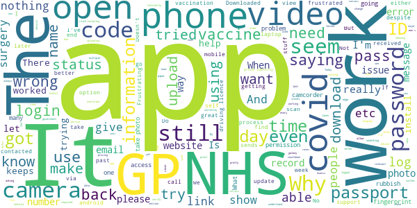

# NHS App
App version ``1.48.7``

Analyzed with [covid-apps-observer](http://github.com/covid-apps-observer) project, version ``0.1``

## App overview
| | |
|-------------------------|-------------------------| 
| **Name**&nbsp;&nbsp;&nbsp;&nbsp;&nbsp;&nbsp;&nbsp;&nbsp;&nbsp;&nbsp;&nbsp;&nbsp;&nbsp;&nbsp;&nbsp;&nbsp;&nbsp;&nbsp;&nbsp;&nbsp;&nbsp;&nbsp;&nbsp;&nbsp;&nbsp;&nbsp;&nbsp;&nbsp;&nbsp;&nbsp;&nbsp;&nbsp;&nbsp;&nbsp;&nbsp;&nbsp;&nbsp;&nbsp;&nbsp;&nbsp;  | NHS App |
| **Unique identifier** | com.nhs.online.nhsonline |
| **Link to Google Play** | [https://play.google.com/store/apps/details?id=com.nhs.online.nhsonline](https://play.google.com/store/apps/details?id=com.nhs.online.nhsonline) |
| **Summary**  | Access NHS services in England |
| **Privacy policy** | [https://www.nhs.uk/using-the-nhs/nhs-services/the-nhs-app/privacy/](https://www.nhs.uk/using-the-nhs/nhs-services/the-nhs-app/privacy/) |
| **Latest version** | 1.48.7 |
| **Last update** | 2021-04-13 10:30:09 |
| **Recent changes** | Improvements:  - We have renamed &quot;Settings&quot; to &quot;More&quot; and updated the icon - Bug fixes, and various performance, stability and accessibility enhancements |
| **Installs**  | 1,000,000+ |
| **Category** | Medical |
| **First release** | Dec 31, 2018 |
| **Size**  | 56M |
| **Supported Android version**  | 5.0 and up |

### Description
> <b>This is not the NHS COVID-19 app. To download the NHS COVID-19 contact tracing app, go to covid19.nhs.uk</b>
 Owned and run by the NHS, the NHS App is a simple and secure way to access a range of NHS services on your smartphone or tablet.
 To use the NHS App you must be aged 13 and over and registered with a GP surgery in England.
 You can also access NHS App services from the browser on your desktop or laptop computer. Go to www.nhs.uk/app
 Use the NHS App to:
 •	get advice about coronavirus
 •	order your repeat prescriptions
 •	book and manage appointments at your GP surgery
 •	get health information and advice
 •	view your health record securely
 •	register your organ donation decision
 •	find out how the NHS uses your data
 If your GP surgery or hospital offers other services in the NHS App, you may be able to:
 •	message your GP surgery, doctor or health professional online
 •	consult a GP or health professional through an online form and get a reply
 •	access health services on behalf of someone you care for
 •	view your hospital and other healthcare appointments
 •	view useful links your doctor or health professional has shared with you
 •	view and manage your care plans
 Get advice about coronavirus 
 ---------------------------------------
 Get information about coronavirus and find out what to do if you think you have it.
 Order repeat prescriptions 
 -----------------------------------
 See your available medicines, request a new repeat prescription and choose a pharmacy for your prescriptions to be sent to.
 Book appointments
 --------------------------
 Search for, book and cancel appointments at your GP surgery. See details of your upcoming and past appointments.
 Get health advice
 -----------------------------
 Search trusted NHS information and advice on hundreds of conditions and treatments. You can also answer questions to get instant advice or medical help near you. 
 View your health record
 ----------------------------------
 Securely access your GP health record, to see information like your allergies and your current and past medicines. If your GP surgery has given you access to your detailed medical record, you can also see information like test results and details of your consultations. 
 Register your organ donation decision
 --------------------------------------------------
 Choose to donate some or all of your organs and check your registered decision.
 Find out how the NHS uses your data
 -------------------------------------------------
 Choose if data from your health records is shared for research and planning.
 Keeping your data secure
 ---------------------------------
 After you download the app, you will need to set up an NHS login and prove who you are. The app then securely connects to information from your GP surgery. 
 If your Android device supports fingerprint detection, you can use it to log in to the NHS App each time, instead of using a password and security code.

### User interface
The developers of the app provide the following screenshots in the Google play store.
| | | |
|:-------------------------:|:-------------------------:|:-------------------------:|
 |   |   |   | 
 |   |   |   | 
 |   |   |   | 
 |   |   |   | 
 |   |   |   | 
 |   |   |   | 

## Development team
In the following we report the main information provided by the development team in the Google play store.

| | |
|-------------------------|-------------------------|
| **Developer**  | NHS Digital |
| **Website**  | [https://www.nhs.uk/using-the-nhs/nhs-services/the-nhs-app/help/](https://www.nhs.uk/using-the-nhs/nhs-services/the-nhs-app/help/) |
| **Email** | nhsapp@nhs.net |
| **Physical address**  | - |
| **Other developed apps**  | [https://play.google.com/store/apps/developer?id=NHS+Digital](https://play.google.com/store/apps/developer?id=NHS+Digital) |

## Android support

| | |
|-------------------------|-------------------------|
| **Declared target Android version**  | Pie, version 9 (API level 28) |
| **Effective target Android version**  | Pie, version 9 (API level 28) |
| **Minimum supported Android version**  | Lollipop, version 5.0 (API level 21) |
| **Maximum target Android version**  | - |

The larger the difference between the minimum and maximum supported Android versions, the better. A larger difference means a wider audience. For example, old phones have a very low Android version, so a high minimum supported Android version means that the app cannot be used by users with old phones, thus leading to accessibility problems. 

## Requested permissions

In the following we report the complete list of the permissions requested by the app. 

| **Permission** | **Protection level** | **Description** | 
|-------------------------|-------------------------|-------------------------|
 **android.permission ACCESS_FINE_LOCATION** | :warning:**Dangerous** | Allows an app to access precise location. 
 **android.permission ACCESS_NETWORK_STATE** | Normal | Allows applications to access information about networks. 
 **android.permission CAMERA** | :warning:**Dangerous** | Required to be able to access the camera device. 
 **android.permission INTERNET** | Normal | Allows applications to open network sockets. 
 **android.permission MODIFY_AUDIO_SETTINGS** | Normal | Allows an application to modify global audio settings. 
 **android.permission READ_EXTERNAL_STORAGE** | :warning:**Dangerous** | Allows an application to read from external storage. 
 **android.permission READ_PHONE_STATE** | :warning:**Dangerous** | Allows read only access to phone state, including the phone number of the device, current cellular network information, the status of any ongoing calls, and a list of any PhoneAccounts registered on the device. 
 **android.permission RECORD_AUDIO** | :warning:**Dangerous** | Allows an application to record audio. 
 **android.permission USE_FINGERPRINT** | Normal | This constant was deprecated in API level 28. Applications should request USE_BIOMETRIC instead 
 **android.permission WAKE_LOCK** | Normal | Allows using PowerManager WakeLocks to keep processor from sleeping or screen from dimming. 
 **android.permission WRITE_EXTERNAL_STORAGE** | :warning:**Dangerous** | Allows an application to write to external storage. 
 **com.google.android.c2dm.permission RECEIVE** | - | - 
 **com.google.android.finsky.permission BIND_GET_INSTALL_REFERRER_SERVICE** | - | - 
 **org.fidoalliance.uaf.permissions FIDO_CLIENT** | - | - 

## Mentioned servers

| **Server** | **Registrant** | **Registrant country** | **Creation date** | 
|-------------------------|-------------------------|-------------------------|-------------------------|
 | googlesyndication.com | Google LLC | :us: US | 2003-01-21 06:17:24 |
 | google.com | Google LLC | :us: US | 1997-09-15 04:00:00 |
 | app-measurement.com | Google LLC | :us: US | 2015-06-19 20:13:31 |

## Security analysis 

Below we report the main security warnings raised by our execution of the [Androwarn](https://github.com/maaaaz/androwarn) security analysis tool.

**Connection interfaces exfiltration**
> - This application reads details about the currently active data network 

**Telephony services abuse**
> - This application makes phone calls 

## User ratings and reviews

Below we provide information about how end users are reacting to the app in terms of ratings and reviews in the Google Play store.

### Ratings

The NHS App app has been installed by more than **1000000** times. At this time, **7245** rated the app and its average score is **3.4703448**. Below we show the distribution of the ratings across the usual star-based rating of Google Play

:star::star::star::star::star:: 3429

:star::star::star::star:: 1019

:star::star::star:: 409

:star::star:: 309

:star:: 2079

### Reviews 

#### 5-star reviews

> It does seem very professional and easy to use.  :date: __2021-05-01 15:33:30__

> Used a coupe of other patient record and booking apps before. This was much easier to register for: all done online, no need to contact the surgery for codes. So far does everything I've needed and worked perfectly.  :date: __2021-05-01 12:59:25__

> Nice one  :date: __2021-04-30 20:27:50__

> Brilliant, easy to set up & loving the use of facial recognition on driving license  :date: __2021-04-30 19:13:33__

> I was very dubious about this app after reading some of the reviews, & experiencing other NHS apps. Strangely enough setup was a dream, couldn't have been easier. It actually seems to work. I hope I haven't spoken too soon. Having not yet used it "in anger" so to speak I can't comment on its functionality, so the star rating is based purely on installation/setup, & therefore could be misleading. It remains to be seen.  :date: __2021-04-30 15:39:45__

> Brilliant App. Easy to install and upload verification. Repeat prescription service at the touch of a button if needed. Very easy to navigate with a link to different conditions and advice at the bottom of the screen too. I certainly recommend downloading and using this app. Saves everyone time which is precious.  :date: __2021-04-30 07:39:05__

> very hard to register, I have been registered with my doctor's surgery for emiss access to request repeat prescriptions, but the form does not seem to have the information asked for to register with the NHS app. A lot of hassle - I would definitely NOT recommend this app.. I have now managed to register, and it is looking promising.  :date: __2021-04-30 05:38:00__

> A good app to have if you want medical help.  :date: __2021-04-29 22:46:22__

> Easy to use  :date: __2021-04-29 22:43:13__

> All set up with no trouble within 5 minutes. Had my NHS number so the process was a breeze. No need for any other proof such as Passport or Driving Licence.  :date: __2021-04-29 21:59:54__

#### 4-star reviews

> Easy to use.  :date: __2021-05-01 17:35:02__

> Was able to sign up easily as already using patient access app so pre cleared on certain information made sign up easy....... Was working now not linking to GP it says manually entered info goes round in circle  :date: __2021-04-30 14:05:57__

> Very clear and easy to use once the ID process has been completed.  :date: __2021-04-30 10:22:24__

> . Good  :date: __2021-04-29 21:19:15__

> Got as far as getting 4 digit code could not open video  :date: __2021-04-29 14:46:28__

> Have had this app for a while and I like it. Having said that, I have only used it to order repeat prescriptions. Haven't needed to use any of the other features yet.  :date: __2021-04-29 14:31:48__

> Good app, but I am unable to see my coronavirus vaccine record, is this the correct app to view this?  :date: __2021-04-29 11:44:48__

> Installed easily ( Huwawei Android 9). Very convenient for repeat prescriptions Can't find vaccination records.  :date: __2021-04-29 09:12:15__

> Took about 45 minutes to set up, but finally did it. The problem was an old mobile phone number, which I needed to change, and I didn't quite understand the instructions. It holds the same information in the same format as Patient Access, which I usually use. I got this because I intend to travel in a couple of months and want to ensure that it shows my CV19 record.(Which is already shown in the GP Immunisation record anyway.) It'll be useful on the move.  :date: __2021-04-28 21:55:11__

> Does what it says.  :date: __2021-04-28 19:48:35__

#### 3-star reviews

> Downloaded mine works perfectly brilliant in fact. Did my wife's but wouldn't connect to her surgery. They are telling me she has to fill out forms to be online with them which seems utter nonsense. Mine connected straight away to my surgery and I'm not electronically registered with them. What's going on?  :date: __2021-04-30 20:15:56__

> Seems great, but I have to complete access by photo ID, which I will do later. Got this for when the travel passport is in force, but how do we operate when my wife and I need this, and she does not have a mobile? How can we set this up so that we have both on the same app?  :date: __2021-04-30 13:28:08__

> Doesn't give you any resent test results I had rests 2 weeks ago and my records are saying no test results available going forward how is this going to work with the vaccine  :date: __2021-04-29 11:38:47__

> Edit to respond: no, pharmacy is not there, anywhere under Prescriptions. Unless it's hidden, but that's my point. And again, GP practice should be a priority, it's essential information, it should be obviously available from the front page. Leaving as 3* Review continued: Please fix the back button issue. Phone back button asks to log out, when obviously what I want is to go back a page whilst browsing the app. Please prioritise these fixes over Matt Hancock's personal Covid passport project.  :date: __2021-04-29 10:36:47__

> It's OK. My address is wrong on it. I registered with a new gp a year ago and it still shows my previous address despite being seen where I live now, at the doctors, local hospital and had Covid vaccinations. Unless I go physically into surgery I cannot alter this, they are busy enough at present without extra things like the above.  :date: __2021-04-29 10:01:52__

> It's annoying the way the app asks if you want to log out whenever you press the 'back' button. In other Android apps the back button just takes you back to the previous screen - it shouldn't try to log you out from the app. If you reply to the question to say yes I do want to log out - it just takes you back to the fingerprint log on screen - which seems rather pointless !!!  :date: __2021-04-28 17:51:32__

> Please fix the back button behaviour. It's confusingly different to normal Android apps. It should go back to the previous screen (as the Back link at the top does), not offer to log out.  :date: __2021-04-28 11:42:12__

> I had difficulty uploading proof of my ID because the camera button on the app does nothing. Had to record photos and video then subsequently upload. Don't know if it's worked yet but but this seems a pretty big flaw  :date: __2021-04-26 18:38:12__

> Quite @  :date: __2021-04-20 14:15:14__

> App was great especially for ordering replacement prescriptions but all of a sudden it states "Sorry, you cannot order or view repeat prescriptions online" please help as I work shifts and its hard enough collecting scripts let alone trying to get to doctors to order a repeat prescription??  :date: __2021-04-18 17:42:43__

#### 2-star reviews

> First impressions aren't great Completed the identity stage but had to wait a few hours for it to confirm my identity 24 hours later, crashed, technical difficulties  :date: __2021-05-01 13:42:11__

> After trying to log in for a week, finally managed to get in. Now most of the options show me a message - something went wrong. P. S. Your app doesn't work the way its intended too.  :date: __2021-05-01 12:52:45__

> Downloaded no problem but asked me to provide proof of identity after going through all the set up. Now got to wait till it allows access ? Had to provide photo I.d via passport or driver licence All family members downloaded same app but not been asked this ? Maybe I am special and my hilarious GP records need clearance for my viewing.  :date: __2021-04-30 23:32:53__

> It's been so difficult to try to get I'd verified my partner did his at same time no issue whatever pute right off  :date: __2021-04-30 14:58:58__

> Have been waiting for 2 days to do Id checks how hard can it be to check me out  :date: __2021-04-30 12:26:58__

> Will not accept Any photo I upload for proof of Id. I have used a photo taken on a 16mp camera that was pin sharp and still the app said it was blurred. How am I supposed to prove my id if the app refuses all photos. Pretty much useless as it is.  :date: __2021-04-30 10:07:29__

> Cant get any further than take photo  :date: __2021-04-29 17:24:56__

> I had a reply from the developer, after saying the app sticks when installing, but it said that it reflects what access my surgery have given me. I never got that far, just tried to install it, and all that happened, a large blue and white NHS logo with a circle in the middle rotating. If this is going to be used for vaccine cirtifications, it's not working for this phone.  :date: __2021-04-29 12:04:23__

> As to be expected after the track and trace fiasco, this app is very much a work in progress. Verifying your ID is nigh impossible and it can be 24 hours or more to find verification has failed for the third or fourth time. If the government are going to introduce vaccination passports for foreign travel they will need an alternative that actually works.  :date: __2021-04-29 07:30:23__

> Hangs with Please Wait message after scanning face  :date: __2021-04-28 15:01:53__

#### 1-star reviews

> Doesn't let you do much before it times you out. Just a web wrapper which expects you to login every minute. Pretty useless.  :date: __2021-05-01 16:18:43__

> Will not register despite several attempts, usual government rubbish site  :date: __2021-05-01 14:57:58__

> Trying to submit the video I'd I have to go to files as the camera option is not working - when I click the link it just give me the camera App information. I have clicked Files, recorded the video (saves as a file, but when I return to the NHS App it has logged me out. When I sign back in and repeat the ID process the Video Number has changed. I've tried on another device where the Camera option worked but when I uploaded the video it says that there was a problem, none was applicable tried 3  :date: __2021-05-01 12:45:44__

> Impossible to open  :date: __2021-05-01 11:13:34__

> My phone will not allow me to download the ap  :date: __2021-04-30 19:20:20__

> Unable to connect  :date: __2021-04-30 18:44:25__

> Judging by the comments, certainly not! I have tried to send a photo of my driving licence on my smartphone and I received no acknowledgement! I was the logged off! Everything else seemed to work (password, NHS number), so has the photo worked?  :date: __2021-04-30 18:17:30__

> Id part what a pain in the rear 3 days and still no further forward  :date: __2021-04-30 17:26:25__

> Rubish  :date: __2021-04-30 14:56:11__

> Terrible x4 Did not accept FOUR yes 4 number codes sent to my mobile.  :date: __2021-04-30 14:33:28__

