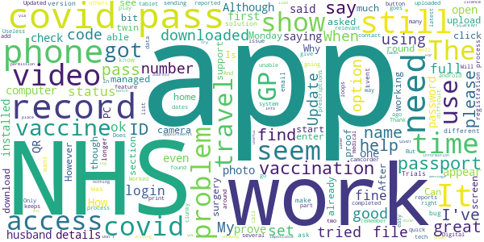

# NHS App
App version ``1.48.7``

Analyzed with [covid-apps-observer](http://github.com/covid-apps-observer) project, version ``0.1``

## App overview
| | |
|-------------------------|-------------------------| 
| **Name**&nbsp;&nbsp;&nbsp;&nbsp;&nbsp;&nbsp;&nbsp;&nbsp;&nbsp;&nbsp;&nbsp;&nbsp;&nbsp;&nbsp;&nbsp;&nbsp;&nbsp;&nbsp;&nbsp;&nbsp;&nbsp;&nbsp;&nbsp;&nbsp;&nbsp;&nbsp;&nbsp;&nbsp;&nbsp;&nbsp;&nbsp;&nbsp;&nbsp;&nbsp;&nbsp;&nbsp;&nbsp;&nbsp;&nbsp;&nbsp;  | NHS App |
| **Unique identifier** | com.nhs.online.nhsonline |
| **Link to Google Play** | [https://play.google.com/store/apps/details?id=com.nhs.online.nhsonline](https://play.google.com/store/apps/details?id=com.nhs.online.nhsonline) |
| **Summary**  | Access NHS services in England |
| **Privacy policy** | [https://www.nhs.uk/using-the-nhs/nhs-services/the-nhs-app/privacy/](https://www.nhs.uk/using-the-nhs/nhs-services/the-nhs-app/privacy/) |
| **Latest version** | 1.48.7 |
| **Last update** | 2021-04-13 10:30:09 |
| **Recent changes** | Improvements:  - We have renamed &quot;Settings&quot; to &quot;More&quot; and updated the icon - Bug fixes, and various performance, stability and accessibility enhancements |
| **Installs**  | 1,000,000+ |
| **Category** | Medical |
| **First release** | Dec 31, 2018 |
| **Size**  | 56M |
| **Supported Android version**  | 5.0 and up |

### Description
> <b>This is not the NHS COVID-19 app. To download the NHS COVID-19 contact tracing app, go to covid19.nhs.uk</b>
 Owned and run by the NHS, the NHS App is a simple and secure way to access a range of NHS services on your smartphone or tablet.
 To use the NHS App you must be aged 13 and over and registered with a GP surgery in England.
 You can also access NHS App services from the browser on your desktop or laptop computer. Go to www.nhs.uk/app
 Use the NHS App to:
 •	get advice about coronavirus
 •	order your repeat prescriptions
 •	book and manage appointments at your GP surgery
 •	get health information and advice
 •	view your health record securely
 •	register your organ donation decision
 •	find out how the NHS uses your data
 If your GP surgery or hospital offers other services in the NHS App, you may be able to:
 •	message your GP surgery, doctor or health professional online
 •	consult a GP or health professional through an online form and get a reply
 •	access health services on behalf of someone you care for
 •	view your hospital and other healthcare appointments
 •	view useful links your doctor or health professional has shared with you
 •	view and manage your care plans
 Get advice about coronavirus 
 ---------------------------------------
 Get information about coronavirus and find out what to do if you think you have it.
 Order repeat prescriptions 
 -----------------------------------
 See your available medicines, request a new repeat prescription and choose a pharmacy for your prescriptions to be sent to.
 Book appointments
 --------------------------
 Search for, book and cancel appointments at your GP surgery. See details of your upcoming and past appointments.
 Get health advice
 -----------------------------
 Search trusted NHS information and advice on hundreds of conditions and treatments. You can also answer questions to get instant advice or medical help near you. 
 View your health record
 ----------------------------------
 Securely access your GP health record, to see information like your allergies and your current and past medicines. If your GP surgery has given you access to your detailed medical record, you can also see information like test results and details of your consultations. 
 Register your organ donation decision
 --------------------------------------------------
 Choose to donate some or all of your organs and check your registered decision.
 Find out how the NHS uses your data
 -------------------------------------------------
 Choose if data from your health records is shared for research and planning.
 Keeping your data secure
 ---------------------------------
 After you download the app, you will need to set up an NHS login and prove who you are. The app then securely connects to information from your GP surgery. 
 If your Android device supports fingerprint detection, you can use it to log in to the NHS App each time, instead of using a password and security code.

### User interface
The developers of the app provide the following screenshots in the Google play store.
| | | |
|:-------------------------:|:-------------------------:|:-------------------------:|
 |   |   |   | 
 |   |   |   | 
 |   |   |   | 
 |   |   |   | 
 |   |   |   | 
 |   |   |   | 

## Development team
In the following we report the main information provided by the development team in the Google play store.

| | |
|-------------------------|-------------------------|
| **Developer**  | NHS Digital |
| **Website**  | [https://www.nhs.uk/using-the-nhs/nhs-services/the-nhs-app/help/](https://www.nhs.uk/using-the-nhs/nhs-services/the-nhs-app/help/) |
| **Email** | nhsapp@nhs.net |
| **Physical address**  | - |
| **Other developed apps**  | [https://play.google.com/store/apps/developer?id=NHS+Digital](https://play.google.com/store/apps/developer?id=NHS+Digital) |

## Android support

| | |
|-------------------------|-------------------------|
| **Declared target Android version**  | Pie, version 9 (API level 28) |
| **Effective target Android version**  | Pie, version 9 (API level 28) |
| **Minimum supported Android version**  | Lollipop, version 5.0 (API level 21) |
| **Maximum target Android version**  | - |

The larger the difference between the minimum and maximum supported Android versions, the better. A larger difference means a wider audience. For example, old phones have a very low Android version, so a high minimum supported Android version means that the app cannot be used by users with old phones, thus leading to accessibility problems. 

## Requested permissions

In the following we report the complete list of the permissions requested by the app. 

| **Permission** | **Protection level** | **Description** | 
|-------------------------|-------------------------|-------------------------|
 **android.permission ACCESS_FINE_LOCATION** | :warning:**Dangerous** | Allows an app to access precise location. 
 **android.permission ACCESS_NETWORK_STATE** | Normal | Allows applications to access information about networks. 
 **android.permission CAMERA** | :warning:**Dangerous** | Required to be able to access the camera device. 
 **android.permission INTERNET** | Normal | Allows applications to open network sockets. 
 **android.permission MODIFY_AUDIO_SETTINGS** | Normal | Allows an application to modify global audio settings. 
 **android.permission READ_EXTERNAL_STORAGE** | :warning:**Dangerous** | Allows an application to read from external storage. 
 **android.permission READ_PHONE_STATE** | :warning:**Dangerous** | Allows read only access to phone state, including the phone number of the device, current cellular network information, the status of any ongoing calls, and a list of any PhoneAccounts registered on the device. 
 **android.permission RECORD_AUDIO** | :warning:**Dangerous** | Allows an application to record audio. 
 **android.permission USE_FINGERPRINT** | Normal | This constant was deprecated in API level 28. Applications should request USE_BIOMETRIC instead 
 **android.permission WAKE_LOCK** | Normal | Allows using PowerManager WakeLocks to keep processor from sleeping or screen from dimming. 
 **android.permission WRITE_EXTERNAL_STORAGE** | :warning:**Dangerous** | Allows an application to write to external storage. 
 **com.google.android.c2dm.permission RECEIVE** | - | - 
 **com.google.android.finsky.permission BIND_GET_INSTALL_REFERRER_SERVICE** | - | - 
 **org.fidoalliance.uaf.permissions FIDO_CLIENT** | - | - 

## Mentioned servers

| **Server** | **Registrant** | **Registrant country** | **Creation date** | 
|-------------------------|-------------------------|-------------------------|-------------------------|
 | googlesyndication.com | Google LLC | :us: US | 2003-01-21 06:17:24 |
 | google.com | Google LLC | :us: US | 1997-09-15 04:00:00 |
 | app-measurement.com | Google LLC | :us: US | 2015-06-19 20:13:31 |

## Security analysis 

Below we report the main security warnings raised by our execution of the [Androwarn](https://github.com/maaaaz/androwarn) security analysis tool.

**Connection interfaces exfiltration**
> - This application reads details about the currently active data network 

**Telephony services abuse**
> - This application makes phone calls 

## User ratings and reviews

Below we provide information about how end users are reacting to the app in terms of ratings and reviews in the Google Play store.

### Ratings

The NHS App app has been installed by more than **1000000** times. At this time, **7245** rated the app and its average score is **3.4703448**. Below we show the distribution of the ratings across the usual star-based rating of Google Play

:star::star::star::star::star:: 3429

:star::star::star::star:: 1019

:star::star::star:: 409

:star::star:: 309

:star:: 2079

### Reviews 

#### 5-star reviews

> Cool  :date: __2021-06-11 12:36:11__

> Good app. Very informative 👏  :date: __2021-06-11 11:26:06__

> Brilliant  :date: __2021-06-11 10:39:47__

> Personally I think this is awesome, if a long time coming. Time to up those stars!  :date: __2021-06-10 20:28:51__

> Downloaded the app just for the purpose of getting a record of my full vaccination. It was tedious and took around 15 minutes to proof my identity but it worked. I received my Covid vaccination certificate in less than 30 minutes since I downloaded the app. Perfect, job done.  :date: __2021-06-10 17:37:17__

> Have only just installed this app but so far so good. The only problem I have is getting the icon installed onto my dashboard.  :date: __2021-06-10 16:23:58__

> After reading all those bad reviews for a few weeks, I was in two minds as to download the app, but finally decided to go for it and found it the easiest app to download! All the information is there and only took 2 minutes to do so. Maybe it was so easy because I linked my GP surgery details to this app and nothing further was required ie no picture upload s, no video clip, no face scans etc...... just need to get in touch with my surgery to allow me to view my medical history  :date: __2021-06-10 01:48:40__

> Very good experience  :date: __2021-06-09 21:58:58__

> Very easy to set up and to quickly get using it. Have your NHS number ready to make it faster. Accurate information and easy to use, very impressed  :date: __2021-06-09 19:04:06__

> They've fixed the issue that wouldn't let you log in. The app is actually quite useful.  :date: __2021-06-09 18:27:17__

#### 4-star reviews

> Easy to set up...just a few minutes. Works perfectly...don't understand all the bad reviews.  :date: __2021-06-10 08:35:18__

> Big improvement from a few months ago..hopefully able to use as vaccine passport for travel  :date: __2021-06-09 16:01:01__

> After initial issues connecting to my GP the app now works, albeit with limited access to information (which my GP can presumably enable). Would benefit from following some basic design standards/ expected behaviours though, e.g. the back button going back a page, as opposed to leaving the app.  :date: __2021-06-08 23:27:18__

> People complaining about verification face scanning - well the scan of my face worked after I tried to copy how I looked in the photo ID that I had uploaded. All went smoothly, and I can now view my record, order repeat prescriptions, view my Covid-19 & flu vaccinations, etc. App is quick and works well on my 3-year old phone, no sign of clunkiness as some have suggested.  :date: __2021-06-07 17:43:42__

> It really good service and thank u nhs for your help  :date: __2021-06-07 17:39:23__

> So far so good all seems to work ok and it knows who I am. Just need to check for vaccine #2 that I've had today.  :date: __2021-06-07 16:04:12__

> Stops downloading at 98% so obviously cannot install, how I'm supposed to show my vaccine status ? Has now installed and working fine, thank you  :date: __2021-06-07 15:31:17__

> So far so good, logged in fine with my existing NHS credentials. Small request. When using the back button on my phone the app offers to log me out rather than just return to the previous screen. Bit annoying.  :date: __2021-06-07 12:48:10__

> App works well up having to upload the camcorder section ,then left in limbo  :date: __2021-06-05 14:56:45__

> I managed to register myself and my wife separately, as didn't realise I would be able to get her linked to mine, with a few problems with proving ID. Works ok, though sometimes seems to have a glitch. I wanted full access, so have contacted my GP. It has been set up from their end, with me also having proxy access to my wife. I am able to get the full proxy access to my wife but no full access for either of us in own accounts. not sure where problem is though.  :date: __2021-06-04 20:27:06__

#### 3-star reviews

> When I get to Open Camcorder to record numbers and face as part of the registration orocess, the app opens my Files application to view photos etc and not the Camcorder / camera app  :date: __2021-06-10 23:28:43__

> OK, but only reason I downloaded was for sharing details for travel. Comes up with "unexpected error" and won't download a pdf file either...... Any pointers?  :date: __2021-06-10 11:44:34__

> I tried to install the app several months ago and gave up after 2 hours because it wouldn't accept either my passport or licence on the scan. However, yesterday, I tried again and was able to import a previous photo of my passport. Much easier than trying to scan it while filling in the form on the same phone. The app looks quite useful now I've done it.  :date: __2021-06-10 10:38:44__

> Difficult to get all Medication put on NHS App.to order repeats.  :date: __2021-06-10 09:19:13__

> Once you get in great but it keeps saying password not right even when you reset and that says it is alright am running out of passwords soon at this rate  :date: __2021-06-09 19:55:19__

> Not sure  :date: __2021-06-08 09:41:24__

> Hi I tried to upload with camcorder but unfortunately camera not on I allowed permission but I don't know why.  :date: __2021-06-07 22:51:17__

> Tried to register for the app. Will not recognise either my NHS number or address details perhaps its because I live I Scotland and this is only for NHS England.  :date: __2021-06-06 12:48:46__

> If you know your NHS number you should be abke to register. The app is essentially only web browser with no extra features.  :date: __2021-06-05 21:26:04__

> Difficult to use. ☹️  :date: __2021-06-04 16:44:40__

#### 2-star reviews

> Would not open the camera or camcorder to verify. Very frustrating. App deleted will try again when the problem has been fixed.  :date: __2021-06-10 21:27:14__

> Log in was a bit long winded. Cannot get full access as the app won't open the camcorder on my phone.  :date: __2021-06-10 14:52:00__

> What is the point of the covid status if it expires on 20th June? Why it expires? I need it for travel after that. Also, cannot see any of my records, apart from a few of my allergies and medicines, despite I have permission several times for the detailed record. This is my record, I am the one should access to it the most.  :date: __2021-06-09 12:38:30__

> Easy app to use until you have to upload your I'd as the camera won't open and can't record a video. And when I come out of it to record the video the numbers have change  :date: __2021-06-08 18:49:37__

> Uploaded video but did not work  :date: __2021-06-08 18:04:07__

> I can no longer log into the app, it comes up with an error and to try again later. It use to work  :date: __2021-06-08 16:39:51__

> Will not update so useless  :date: __2021-06-07 17:27:08__

> It takes 5secs to record a video of me saying four numbers, yet I was never able to upload thanks to the video being too small. After multiple attempts, including a nice long rant, I gave up. Who comes up with this stuff.  :date: __2021-06-07 09:26:29__

> Tried numerous times and keeps saying not recodnised  :date: __2021-06-06 21:43:10__

> Tried to sign up, I've input my mobile number a dozen times, and still waiting for a 6 digit code but no joy.  :date: __2021-06-06 14:17:09__

#### 1-star reviews

> Not robust. Fails to order repeat prescriptions. Fails to supply C19 Vax travel proof. No obvious use as yet. Generic replies from tech support essentially advise not using the NHS app. Update: as you see the generic reply to my review advises against the NHS app rather than offer an app improvement. Down to one star from two.  :date: __2021-06-11 12:09:32__

> a nightmare to log into ...why it correctly shows the last 4 digits of the phone number to send an access code to, previously successfully used, which doesn't arrive this time, but when "re-request" is pressed a few times it locks the user out ...when taking the "change number option" hoping to get a switch it then says it will be up to 24 hrs before a confirmation email will be sent ...still waiting ...what a joke ...private enterprise would be out of business with such a rubbish APP  :date: __2021-06-11 11:49:41__

> During set up it works until I reach the open camcorder part I press open camcorder and it takes me off the app and into my photo albums with no option to get back into the app so I have to go back to the start this has happened 4 times I've just tried another 2 times and the same happens the camcorder wont open I'm not wasting anymore time on it its not worth it.  :date: __2021-06-11 11:19:16__

> Does not open camcorder unable to video to confirm identity.  :date: __2021-06-11 10:48:10__

> Log on then it just keeps asking to log into my GP. Rubbish especially as Government want you to use the Covid passport bit.  :date: __2021-06-11 10:20:18__

> Version 1.51.1 (1.48.7)on android, I can no longer access my gp health records.  :date: __2021-06-11 08:54:09__

> Neither camera nor camcorder function work. Therefore can't verify identity. Therefore useless.  :date: __2021-06-11 00:03:01__

> App will not open the camcorder to record the video, so the app is useless.  :date: __2021-06-10 23:06:49__

> Far too fusy and complicated, simplify it and it may be worthwhile...  :date: __2021-06-10 20:59:05__

> I can't even get past the initial blue NHS screen on my iphone nor my tablet so I haven't got a hope in hell finding my vaccination details.  :date: __2021-06-10 20:17:11__

