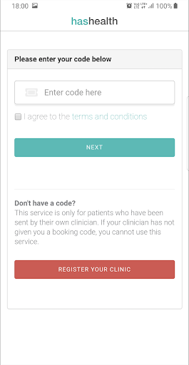
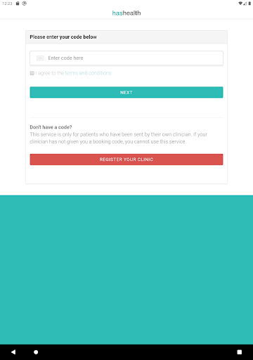

# HasHealth Video Consultations
App version ``1.0.5``

Analyzed with [covid-apps-observer](http://github.com/covid-apps-observer) project, version ``0.1``

## App overview
| | |
|-------------------------|-------------------------| 
| **Name**                                          | HasHealth Video Consultations |
| **Unique identifier** | com.nuasolutions.hse.prod |
| **Link to Google Play** | [https://play.google.com/store/apps/details?id=com.nuasolutions.hse.prod](https://play.google.com/store/apps/details?id=com.nuasolutions.hse.prod) |
| **Summary**  | HasHealth Video Consultations allows patients to see their clinician directly. |
| **Privacy policy** | [https://www.nuahealth.com/site_pages/privacy](https://www.nuahealth.com/site_pages/privacy) |
| **Latest version** | 1.0.5 |
| **Last update** | 2020-12-03 10:39:18 |
| **Recent changes** | - Fixed an issue where clicking Back would cause the user to reenter the Consultation Room - Fixed an issue whereby the user would not enter the app from an appointment link - Fixed an issue whereby turning on the torch would not turn on the correct camera |
| **Installs**  | 1,000+ |
| **Category** | Medical |
| **First release** | Mar 15, 2020 |
| **Size**  | 20M |
| **Supported Android version**  | 4.4 and up |

### Description
> HasHealth is a Video Consultation Service launched in response to Coronavirus / COVID-19 that allows you access to your own Clinician from the comfort of your home, all through our Android App.
 It is a new way to see your own clinician.
 HOW IT WORKS
 1. Contact your local practice / clinic to arrange a video appointment
 2. Receive an email/SMS with your unique link containing your access code
 2. See your own clinician by clicking the link or by entering the code
 FEATURES
 * Live Video Consultations – medical advice from your own clinician using video and audio
 * Available everywhere in the Republic of Ireland - available anytime, anywhere
 * Your data is always safe and 100% confidential. This Service is fully compliant with the General Data Protection Regulation (GDPR).
 Please note, all medical advice is provided by your own Clinician, who has total clinical independence in deciding what they can safely treat and diagnose using this Service.
 You will need a high quality, reliable Internet connection to use the Service.
 This Service is not recommended for medical emergencies or acute medical episodes.
 If the clinician decides it necessary, they may recommend you have an in-clinic appointment or alternatively ask you to contact your local Out of Hours or accident and emergency department as appropriate.
 www.hashealth.com

### User interface
The developers of the app provide the following screenshots in the Google play store.
| | | |
|:-------------------------:|:-------------------------:|:-------------------------:|
 |   |   |   | 
 |  

## Development team
In the following we report the main information provided by the development team in the Google play store.

| | |
|-------------------------|-------------------------|
| **Developer**  | Webdoctor Limited |
| **Website**  | [https://www.nuahealth.com](https://www.nuahealth.com) |
| **Email** | info@nuahealth.com |
| **Physical address**  | - |
| **Other developed apps**  | [https://play.google.com/store/apps/developer?id=Webdoctor+Limited](https://play.google.com/store/apps/developer?id=Webdoctor+Limited) |

## Android support

| | |
|-------------------------|-------------------------|
| **Declared target Android version**  | Pie, version 9 (API level 28) |
| **Effective target Android version**  | Pie, version 9 (API level 28) |
| **Minimum supported Android version**  | KitKat, version 4.4 - 4.4.4 (API level 19) |
| **Maximum target Android version**  | - |

The larger the difference between the minimum and maximum supported Android versions, the better. A larger difference means a wider audience. For example, old phones have a very low Android version, so a high minimum supported Android version means that the app cannot be used by users with old phones, thus leading to accessibility problems. 

## Requested permissions

In the following we report the complete list of the permissions requested by the app. 

| **Permission** | **Protection level** | **Description** | 
|-------------------------|-------------------------|-------------------------|
 **android.permission ACCESS_NETWORK_STATE** | Normal | Allows applications to access information about networks. 
 **android.permission BLUETOOTH** | Normal | Allows applications to connect to paired bluetooth devices. 
 **android.permission BROADCAST_STICKY** | Normal | Allows an application to broadcast sticky intents. 
 **android.permission CALL_PHONE** | :warning:**Dangerous** | Allows an application to initiate a phone call without going through the Dialer user interface for the user to confirm the call. 
 **android.permission CAMERA** | :warning:**Dangerous** | Required to be able to access the camera device. 
 **android.permission INTERNET** | Normal | Allows applications to open network sockets. 
 **android.permission MODIFY_AUDIO_SETTINGS** | Normal | Allows an application to modify global audio settings. 
 **android.permission READ_EXTERNAL_STORAGE** | :warning:**Dangerous** | Allows an application to read from external storage. 
 **android.permission READ_PHONE_STATE** | :warning:**Dangerous** | Allows read only access to phone state, including the phone number of the device, current cellular network information, the status of any ongoing calls, and a list of any PhoneAccounts registered on the device. 
 **android.permission RECORD_AUDIO** | :warning:**Dangerous** | Allows an application to record audio. 
 **android.permission WAKE_LOCK** | Normal | Allows using PowerManager WakeLocks to keep processor from sleeping or screen from dimming. 
 **android.permission WRITE_EXTERNAL_STORAGE** | :warning:**Dangerous** | Allows an application to write to external storage. 
 **com.google.android.c2dm.permission RECEIVE** | - | - 
 **com.google.android.finsky.permission BIND_GET_INSTALL_REFERRER_SERVICE** | - | - 

## Mentioned servers

| **Server** | **Registrant** | **Registrant country** | **Creation date** | 
|-------------------------|-------------------------|-------------------------|-------------------------|
 | googlesyndication.com | Google LLC | :us: US | 2003-01-21 06:17:24 |
 | google.com | Google LLC | :us: US | 1997-09-15 04:00:00 |
 | app-measurement.com | Google LLC | :us: US | 2015-06-19 20:13:31 |
 | logentries.com | Rapid7 | :us: US | 2010-02-08 16:18:32 |
 | hashealth.com | REDACTED FOR GDPR | IE | 2020-01-07 05:32:15 |
 | opentok.com | Domains By Proxy, LLC | :us: US | 2010-09-24 17:14:13 |
 | crashlytics.com | Google LLC | :us: US | 2011-01-21 15:30:40 |
 | googleapis.com | Google LLC | :us: US | 2005-01-25 17:52:26 |
 | googleadservices.com | Google LLC | :us: US | 2003-06-19 16:34:53 |

## Security analysis 

Below we report the main security warnings raised by our execution of the [Androwarn](https://github.com/maaaaz/androwarn) security analysis tool.

**Connection interfaces exfiltration**
> - This application reads details about the currently active data network 
> - This application tries to find out if the currently active data network is metered 

**Telephony services abuse**
> - This application makes phone calls 

**Suspicious connection establishment**
> - This application opens a Socket and connects it to the remote address '' on the 'N/A' port  
> - This application opens a Socket and connects it to the remote address 'Lcom/logentries/net/LogentriesClient;->getPort()I' on the 'Lcom/logentries/net/LogentriesClient;->getPort()I' port  
> - This application opens a Socket and connects it to the remote address 'Ljava/lang/StringBuilder;->toString()Ljava/lang/String;' on the 'N/A' port  
> - This application opens a Socket and connects it to the remote address 'Ljava/net/Proxy;->type()Ljava/net/Proxy$Type;' on the 'N/A' port  
> - This application opens a Socket and connects it to the remote address 'timeout' on the 'N/A' port  

**Code execution**
> - This application loads a native library: 'Ljava/lang/String;->valueOf(Ljava/lang/Object;)Ljava/lang/String;' 
> - This application loads a native library: 'opentok' 

## User ratings and reviews

Below we provide information about how end users are reacting to the app in terms of ratings and reviews in the Google Play store.

### Ratings

The HasHealth Video Consultations app has been installed by more than **1000** times. At this time, **-** rated the app and its average score is **0.0**. Below we show the distribution of the ratings across the usual star-based rating of Google Play

:star::star::star::star::star:: 0

:star::star::star::star:: 0

:star::star::star:: 0

:star::star:: 0

:star:: 0

### Reviews 

#### 5-star reviews

No recent reviews available with 5 stars.

#### 4-star reviews

No recent reviews available with 4 stars.

#### 3-star reviews

No recent reviews available with 3 stars.

#### 2-star reviews

No recent reviews available with 2 stars.

#### 1-star reviews

No recent reviews available with 1 stars.
