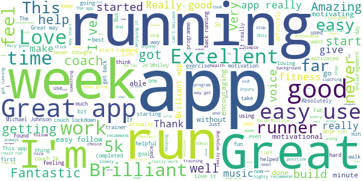
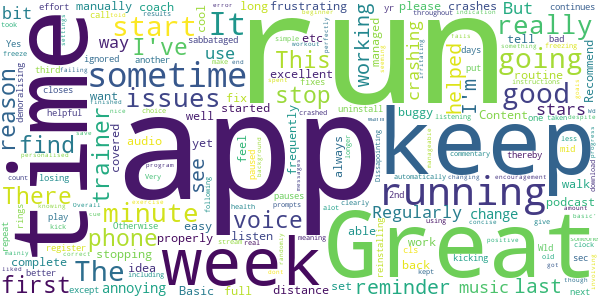

# One You Couch to 5K
App version ``7.4.0``

Analyzed with [covid-apps-observer](http://github.com/covid-apps-observer) project, version ``0.1``

## App overview
| | |
|-------------------------|-------------------------| 
| **Name**&nbsp;&nbsp;&nbsp;&nbsp;&nbsp;&nbsp;&nbsp;&nbsp;&nbsp;&nbsp;&nbsp;&nbsp;&nbsp;&nbsp;&nbsp;&nbsp;&nbsp;&nbsp;&nbsp;&nbsp;&nbsp;&nbsp;&nbsp;&nbsp;&nbsp;&nbsp;&nbsp;&nbsp;&nbsp;&nbsp;&nbsp;&nbsp;&nbsp;&nbsp;&nbsp;&nbsp;&nbsp;&nbsp;&nbsp;&nbsp;  | One You Couch to 5K |
| **Unique identifier** | com.phe.couchto5K |
| **Link to Google Play** | [https://play.google.com/store/apps/details?id=com.phe.couchto5K](https://play.google.com/store/apps/details?id=com.phe.couchto5K) |
| **Summary**  | The FREE Couch to 5K app. We’ll take you from couch to 5k hero in just 9 weeks! |
| **Privacy policy** | [https://www.nhs.uk/oneyou/privacy-policy](https://www.nhs.uk/oneyou/privacy-policy) |
| **Latest version** | 7.4.0 |
| **Last update** | 2020-07-27 12:06:56 |
| **Recent changes** | General bug fixes and maintenance improvements. |
| **Installs**  | 1,000,000+ |
| **Category** | Health & Fitness |
| **First release** | Mar 5, 2016 |
| **Size**  | 132M |
| **Supported Android version**  | 4.4W and up |

### Description
> For the latest official information about what you can and can't do at this time, visit https://www.nhs.uk/conditions/coronavirus-covid-19/ 
 It’s an easy to follow programme known the world over, and perfect for those new to running and need some extra support and motivation along the way.
 The app features a choice of 5 great trainers to support and motivate you at every step of the way, telling you when to run and when to walk, from broadcaster and former Olympian Michael Johnson, comedians Sarah Millican and Sanjeev Kohli, BBC presenter Jo Whiley, and our very own Laura, who have now helped over 2 million people like you start their own running journeys.
 One You Couch to 5K features:
 • A flexible programme that can be completed in as little as 9 weeks, or longer if you want to go at your own pace
 • Easy to follow countdown timer so you can see and well as hear how long you’ve got left of each run
 • Works alongside your preferred music player, automatically 'dipping' the volumes so you can hear the instructions and motivations from your chosen trainer
 • Signals a half-time bell when you get half way, so you know when to head home!
 • Lets you track your progress and awards achievements as you move through the runs
 • Lets you rate how you feel before and after each session to help acknowledge the immediate benefits for doing some physical activity
 • Connects you with likeminded people through the Couch to 5k HealthUnlocked community forums, offering loads of advice, tips and motivations to keep you on you on your fitness journey
 One You is here to help you live more healthily and make the changes that matter most. Millions of people have already got running with the Couch to 5k plan. Now it’s your turn! Download this app, get off the couch and we’ll help you reach your health goals.

### User interface
The developers of the app provide the following screenshots in the Google play store.
| | | |
|:-------------------------:|:-------------------------:|:-------------------------:|
 |   |   |   | 
 |   |   |   | 
 |   |  

## Development team
In the following we report the main information provided by the development team in the Google play store.

| | |
|-------------------------|-------------------------|
| **Developer**  | Public Health England Digital |
| **Website**  | [https://www.nhs.uk/oneyou/moving](https://www.nhs.uk/oneyou/moving) |
| **Email** | oneyou@phe.gov.uk |
| **Physical address**  | - |
| **Other developed apps**  | [https://play.google.com/store/apps/developer?id=Public+Health+England+Digital](https://play.google.com/store/apps/developer?id=Public+Health+England+Digital) |

## Android support

| | |
|-------------------------|-------------------------|
| **Declared target Android version**  | Pie, version 9 (API level 28) |
| **Effective target Android version**  | Pie, version 9 (API level 28) |
| **Minimum supported Android version**  | KitKat W, version 4.4W - 4.4.4W (API level 20) |
| **Maximum target Android version**  | - |

The larger the difference between the minimum and maximum supported Android versions, the better. A larger difference means a wider audience. For example, old phones have a very low Android version, so a high minimum supported Android version means that the app cannot be used by users with old phones, thus leading to accessibility problems. 

## Requested permissions

In the following we report the complete list of the permissions requested by the app. 

| **Permission** | **Protection level** | **Description** | 
|-------------------------|-------------------------|-------------------------|
 **android.permission ACCESS_COARSE_LOCATION** | :warning:**Dangerous** | Allows an app to access approximate location. 
 **android.permission ACCESS_FINE_LOCATION** | :warning:**Dangerous** | Allows an app to access precise location. 
 **android.permission ACCESS_NETWORK_STATE** | Normal | Allows applications to access information about networks. 
 **android.permission BLUETOOTH** | Normal | Allows applications to connect to paired bluetooth devices. 
 **android.permission BLUETOOTH_ADMIN** | Normal | Allows applications to discover and pair bluetooth devices. 
 **android.permission INTERNET** | Normal | Allows applications to open network sockets. 
 **android.permission WAKE_LOCK** | Normal | Allows using PowerManager WakeLocks to keep processor from sleeping or screen from dimming. 
 **android.permission WRITE_EXTERNAL_STORAGE** | :warning:**Dangerous** | Allows an application to write to external storage. 
 **com.android.alarm.permission SET_ALARM** | Normal | Allows an application to broadcast an Intent to set an alarm for the user. 
 **com.google.android.c2dm.permission RECEIVE** | - | - 
 **com.google.android.finsky.permission BIND_GET_INSTALL_REFERRER_SERVICE** | - | - 

## Mentioned servers

| **Server** | **Registrant** | **Registrant country** | **Creation date** | 
|-------------------------|-------------------------|-------------------------|-------------------------|
 | googlesyndication.com | Google LLC | :us: US | 2003-01-21 06:17:24 |
 | google.com | Google LLC | :us: US | 1997-09-15 04:00:00 |
 | google-analytics.com | Google LLC | :us: US | 2005-07-18 19:24:32 |
 | app-measurement.com | Google LLC | :us: US | 2015-06-19 20:13:31 |
 | googletagmanager.com | Google LLC | :us: US | 2011-11-11 23:39:05 |
 | paragon-cc.co.uk | - | - | 2017-04-04 00:00:00 |
 | bbc.co.uk | - | - | 1996-08-01 00:00:00 |
 | df-phe.com | DOGFI.SH Mobile | GB | 2015-06-16 14:57:16 |
 | phedigital.co.uk | - | - | 2018-06-06 00:00:00 |
 | youtube.com | Google LLC | :us: US | 2005-02-15 05:13:12 |
 | crashlytics.com | Google LLC | :us: US | 2011-01-21 15:30:40 |
 | nhs.uk | Department of Health | - | 1996-08-01 00:00:00 |
 | tealiumiq.com | Whois Privacy Service | :us: US | 2011-02-09 18:33:06 |
 | googleapis.com | Google LLC | :us: US | 2005-01-25 17:52:26 |
 | googleadservices.com | Google LLC | :us: US | 2003-06-19 16:34:53 |
 | healthunlocked.com | Everything Unlocked Ltd | GB | 2008-05-04 18:31:28 |

## Security analysis 

Below we report the main security warnings raised by our execution of the [Androwarn](https://github.com/maaaaz/androwarn) security analysis tool.

**Telephony identifiers leakage**
> - This application reads the ISO country code equivalent of the current registered operator's MCC (Mobile Country Code) 
> - This application reads the numeric name (MCC+MNC) of current registered operator 
> - This application reads the operator name 

**Connection interfaces exfiltration**
> - This application reads details about the currently active data network 
> - This application tries to find out if the currently active data network is metered 

**Suspicious connection establishment**
> - This application opens a Socket and connects it to the remote address '' on the 'N/A' port  
> - This application opens a Socket and connects it to the remote address 'Ljava/lang/StringBuilder;->toString()Ljava/lang/String;' on the ': connect, resolve' port  
> - This application opens a Socket and connects it to the remote address 'Ljava/lang/StringBuilder;->toString()Ljava/lang/String;' on the 'N/A' port  
> - This application opens a Socket and connects it to the remote address 'Ljava/net/Proxy;->type()Ljava/net/Proxy$Type;' on the 'N/A' port  
> - This application opens a Socket and connects it to the remote address 'timeout' on the 'N/A' port  

## User ratings and reviews

Below we provide information about how end users are reacting to the app in terms of ratings and reviews in the Google Play store.

### Ratings

The One You Couch to 5K app has been installed by more than **1000000** times. At this time, **28344** rated the app and its average score is **4.744284**. Below we show the distribution of the ratings across the usual star-based rating of Google Play

:star::star::star::star::star:: 23520

:star::star::star::star:: 3559

:star::star::star:: 548

:star::star:: 279

:star:: 438

### Reviews 

#### 5-star reviews

> Brilliant app, I used it during lockdown to get back into running after a long absence. Found the coach really good and just at the times you need it.  :date: __2021-02-13 19:41:00__

> Motivating  :date: __2021-02-13 19:37:55__

> Fantastic, I became a runner with this app. Big recommendation!  :date: __2021-02-13 19:11:19__

> Great introduction for beginner runners  :date: __2021-02-13 18:38:37__

> Good programme , difficult to start but gradually getting easier. We'll planned.  :date: __2021-02-13 13:22:51__

> I find it a great help.  :date: __2021-02-13 11:41:17__

> Used this on 2 occasions after periods of illness to get back to fitness. It's really helpful.  :date: __2021-02-13 11:32:52__

> Fantastic app  :date: __2021-02-13 11:26:14__

> Really good motivation and great build up really helps you get started  :date: __2021-02-13 10:19:57__

> Great app that had really helped us achieve our goal. 👍  :date: __2021-02-13 00:27:13__

#### 4-star reviews

> It really does work to get you going, the structure is helpful. Only complaint would be that the Micheal Johnson coaching option doesn't seem to work  :date: __2021-02-13 13:41:03__

> It works, it really works. Sometimes it doesn't lower background music but it's great  :date: __2021-02-13 13:02:52__

> Chilled way of gaining fitness 👌  :date: __2021-02-13 12:58:02__

> Very good idea for old people who do not want to look stupid running around the streets.  :date: __2021-02-12 17:56:24__

> Occasionally just stops which can mean you miss a prompt, but a great way to get you started.  :date: __2021-02-12 12:32:55__

> This app has got me off the couch and running. I can't fault the concept and I love Sarah Millican in a new way. Unfortunately I had to knock a star off due to a technical fault. Often - nearly every other time I run - the app switches off mid-training,leaving me either running or walking for an extended period without knowing it's happened, and then wasting time trying to restart the app and remember where I was. It doesn't seem to be a connectivity issue as my tracker and Spotify work fine.  :date: __2021-02-12 10:26:19__

> Bit glitchy at times. Have to change my coach everytime I go for a run  :date: __2021-02-11 17:36:10__

> A good gradual increase that's easy to fit in to daily life.  :date: __2021-02-11 13:44:05__

> Disappointed that Sarah Millican stopped working after the first fun but otherwise a great app  :date: __2021-02-11 12:17:40__

> Really helped me feel fitter and keep motivated, doesnt operate too well on my Huawei phone tho  :date: __2021-02-10 20:00:09__

#### 3-star reviews

> Somehow, I managed to have 4 copies going at the same time, out of sync. There was no way to stop them. It shouldn't be possible to start it while a copy is running.  :date: __2021-02-11 13:00:41__

> They need to bring it to wearables/iwatch  :date: __2021-02-11 10:48:34__

> This app is amazing. After 9 intense weeks I am able to run more than 5k. This app is magical. The reason why I'm rating it 3 stars is sometimes the app becomes buggy during some runs like the music won't fade why your coach speaks to you.  :date: __2021-02-07 20:47:20__

> The app is great and really helps teaching you to run. I am not at 5 k yet but I can run for 30 minutes. The only reason I rated 3 is that it bugged quite a bit on week 5 and started taking me through the week 4 routine again. I was also disappointed that the voice over did not change run to run or at least for the last run of the week.  :date: __2021-02-07 11:05:09__

> It would get a 5, but it keeps keeps dropping out if the phone locks or take a photo.  :date: __2021-02-07 09:35:37__

> Content is great, I've just completed my second week and I am progressing. However, app not always reliable. Sometimes complains it cant load audio files and has frozen at times. 5 stars for content, 2 for reliability.  :date: __2021-01-30 18:53:22__

> Keeps crashing but great idea Started ok but since around 15/1/21 the app shuts down sometime in the first 15 minutes. Can leave you warming up for too long or continuing the first run for too long. Only when you notice and restart the app do you find out you're back at the beginning again. Great idea, love Sarah's voice but not much use unless this can be fixed.Now on week 4 and it's do e in twice on two runs. Please fix it. OnePlus6, all up to date  :date: __2021-01-30 15:52:19__

> When the App is working it is fantastic. I've managed to get to wk 3. However keeps crashing and not logging the run.  :date: __2021-01-29 00:22:08__

> Stopping talking to me halfway through !!  :date: __2021-01-28 21:32:47__

> Excellent, basic, but with annoying flaws. I recommend this, but it is so annoying when the app tells you a run is complete, but all record of it is then lost as you haven't manually saved it. Then having reminder alarms to run going off while you're running is just silly. Five starts with a bit more thought in usability.  :date: __2021-01-27 08:02:44__

#### 2-star reviews

> Keeps crashing mid-run. Incredibly irritating.  :date: __2021-02-11 07:47:58__

> In my previous review I gave it a 3 or 4 stars, but now at the end of Week 3 I'm ready to switch to another App. The problem is that it keeps closing whilst I'm running, so I'm not actually running or walking for the time it says to. About the only time I found it didn't close was the first couple of runs when I held the phone in my hand. This latest run, I switched it to Flight to mode to try and avoid notifications confusing it and switched off some of the easy open settings! No good.  :date: __2021-02-10 09:48:59__

> It's a great concept and I enjoy using it for the most part but I am sick and tired of the app crashing mid run. Edit - 8/2/21 still crashes mid run. Absolutely useless!  :date: __2021-02-08 19:00:46__

> Got the app last weekend been out on 2 runs inbetween gym sessions and on both runs the app has just stopped!  :date: __2021-02-07 20:28:50__

> The running schedule is great and I'm really enjoying it. Michael Johnson's audio is motivational without being cheesey. I have an Honor phone so the app shuts down part way through a run, apparently there's nothing the developers can do about this. I have downloaded a free interval timer that does the job and runs successfully in the background without issue, and just use the Couch to 5k app for the schedule and to log my runs.  :date: __2021-02-07 17:33:40__

> The app is fine but doesn't seem to to work with Surface earbuds. The audio sends to pause when connected to wireless earbuds  :date: __2021-02-07 14:15:46__

> The principle is good but I'm now at the end of week 5 and giving up on this app. The app has crashed on me the past 5 or 6 times I've been out for a run which becomes frustrating as you lose your position in your session. It has worked to get me off the couch and I am covering 5k but not running the full 5k yet. The bugs need to be addressed as this is a great app when it works.  :date: __2021-02-05 14:09:09__

> The structure is good for first time runners but the app closes constantly losing the place you're at during your run.. Really not useful for actually tracking progress  :date: __2021-02-03 14:29:24__

> The app closes itself after a short time, so I can't listen to music while using it, I have to keep my phone open and move the timer to where I think it last stopped. Very annoying. It loses my day every time, putting me back to day one.  :date: __2021-01-29 08:26:42__

> Great plan but shocking how much it crashes in the middle of runs. Will delete and try and find a better app that actually works.  :date: __2021-01-27 16:04:25__

#### 1-star reviews

> Keeps cutting out while on runs  :date: __2021-02-13 20:47:15__

> Not fit for purpose - app stops running when phone closes/locks. But if you keep phone unlocked you cannot put the phone in your pocket or armband as you inadvertently press pause/exit etc  :date: __2021-02-11 15:43:16__

> Any tips to prevent this App closing on itself? It keeps happening several times every run  :date: __2021-02-10 19:32:34__

> Boring  :date: __2021-02-10 11:35:11__

> Horrendous app. Completed first run and the app shut itself off 4 times so had to keep restarting, thought it may have just been a glich so stuck with it for the next two runs, done exactly the same thing!! So off putting, concept is good, shame the app doesn't actually follow suit  :date: __2021-02-04 16:37:40__

> Rubbish, finished the run and there is no way to view stats, distance, speed etc. It says couch to 5k but there's no way to check. Of course you could run another app alongside it but after music and this that would be 3 apps running simultaneously, the start running app is well better...sorry Jo  :date: __2021-02-01 20:50:55__

> Frustrating - the app is not saving my runs and not letting me progress to later week runs. I only want this app to do one thing and that is play a series of podcasts and it doesn't do that.  :date: __2021-01-30 12:44:37__

> Keeps cutting out half way through . Deleted it and download again but still does the same  :date: __2021-01-29 19:18:10__

> Plan is good, but app keeps disconnecting  :date: __2021-01-29 16:02:47__

> It's changed. I used it last year and it was brilliant but now it stops during the warm up walk and I end up walking for longer before I realise. Then I have to restart the app, find my place and start again, only for it to repeat. I would love to keep using it as I found it to be really beneficial for me.  :date: __2021-01-27 20:07:49__

