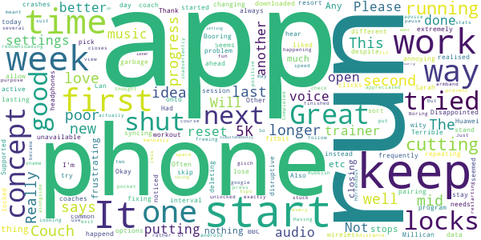

# One You Couch to 5K
App version ``7.4.0``

Analyzed with [covid-apps-observer](http://github.com/covid-apps-observer) project, version ``0.1``

## App overview
| | |
|-------------------------|-------------------------| 
| **Name**&nbsp;&nbsp;&nbsp;&nbsp;&nbsp;&nbsp;&nbsp;&nbsp;&nbsp;&nbsp;&nbsp;&nbsp;&nbsp;&nbsp;&nbsp;&nbsp;&nbsp;&nbsp;&nbsp;&nbsp;&nbsp;&nbsp;&nbsp;&nbsp;&nbsp;&nbsp;&nbsp;&nbsp;&nbsp;&nbsp;&nbsp;&nbsp;&nbsp;&nbsp;&nbsp;&nbsp;&nbsp;&nbsp;&nbsp;&nbsp;  | One You Couch to 5K |
| **Unique identifier** | com.phe.couchto5K |
| **Link to Google Play** | [https://play.google.com/store/apps/details?id=com.phe.couchto5K](https://play.google.com/store/apps/details?id=com.phe.couchto5K) |
| **Summary**  | The FREE Couch to 5K app. We’ll take you from couch to 5k hero in just 9 weeks! |
| **Privacy policy** | [https://www.nhs.uk/oneyou/privacy-policy](https://www.nhs.uk/oneyou/privacy-policy) |
| **Latest version** | 7.4.0 |
| **Last update** | 2020-07-27 12:06:56 |
| **Recent changes** | General bug fixes and maintenance improvements. |
| **Installs**  | 1,000,000+ |
| **Category** | Health & Fitness |
| **First release** | Mar 5, 2016 |
| **Size**  | 132M |
| **Supported Android version**  | 4.4W and up |

### Description
> For the latest official information about what you can and can't do at this time, visit https://www.nhs.uk/conditions/coronavirus-covid-19/ 
 It’s an easy to follow programme known the world over, and perfect for those new to running and need some extra support and motivation along the way.
 The app features a choice of 5 great trainers to support and motivate you at every step of the way, telling you when to run and when to walk, from broadcaster and former Olympian Michael Johnson, comedians Sarah Millican and Sanjeev Kohli, BBC presenter Jo Whiley, and our very own Laura, who have now helped over 2 million people like you start their own running journeys.
 One You Couch to 5K features:
 • A flexible programme that can be completed in as little as 9 weeks, or longer if you want to go at your own pace
 • Easy to follow countdown timer so you can see and well as hear how long you’ve got left of each run
 • Works alongside your preferred music player, automatically 'dipping' the volumes so you can hear the instructions and motivations from your chosen trainer
 • Signals a half-time bell when you get half way, so you know when to head home!
 • Lets you track your progress and awards achievements as you move through the runs
 • Lets you rate how you feel before and after each session to help acknowledge the immediate benefits for doing some physical activity
 • Connects you with likeminded people through the Couch to 5k HealthUnlocked community forums, offering loads of advice, tips and motivations to keep you on you on your fitness journey
 One You is here to help you live more healthily and make the changes that matter most. Millions of people have already got running with the Couch to 5k plan. Now it’s your turn! Download this app, get off the couch and we’ll help you reach your health goals.

### User interface
The developers of the app provide the following screenshots in the Google play store.
| | | |
|:-------------------------:|:-------------------------:|:-------------------------:|
 |   |   |   | 
 |   |   |   | 
 |   |  

## Development team
In the following we report the main information provided by the development team in the Google play store.

| | |
|-------------------------|-------------------------|
| **Developer**  | Public Health England Digital |
| **Website**  | [https://www.nhs.uk/oneyou/moving](https://www.nhs.uk/oneyou/moving) |
| **Email** | oneyou@phe.gov.uk |
| **Physical address**  | - |
| **Other developed apps**  | [https://play.google.com/store/apps/developer?id=Public+Health+England+Digital](https://play.google.com/store/apps/developer?id=Public+Health+England+Digital) |

## Android support

| | |
|-------------------------|-------------------------|
| **Declared target Android version**  | Pie, version 9 (API level 28) |
| **Effective target Android version**  | Pie, version 9 (API level 28) |
| **Minimum supported Android version**  | KitKat W, version 4.4W - 4.4.4W (API level 20) |
| **Maximum target Android version**  | - |

The larger the difference between the minimum and maximum supported Android versions, the better. A larger difference means a wider audience. For example, old phones have a very low Android version, so a high minimum supported Android version means that the app cannot be used by users with old phones, thus leading to accessibility problems. 

## Requested permissions

In the following we report the complete list of the permissions requested by the app. 

| **Permission** | **Protection level** | **Description** | 
|-------------------------|-------------------------|-------------------------|
 **android.permission ACCESS_COARSE_LOCATION** | :warning:**Dangerous** | Allows an app to access approximate location. 
 **android.permission ACCESS_FINE_LOCATION** | :warning:**Dangerous** | Allows an app to access precise location. 
 **android.permission ACCESS_NETWORK_STATE** | Normal | Allows applications to access information about networks. 
 **android.permission BLUETOOTH** | Normal | Allows applications to connect to paired bluetooth devices. 
 **android.permission BLUETOOTH_ADMIN** | Normal | Allows applications to discover and pair bluetooth devices. 
 **android.permission INTERNET** | Normal | Allows applications to open network sockets. 
 **android.permission WAKE_LOCK** | Normal | Allows using PowerManager WakeLocks to keep processor from sleeping or screen from dimming. 
 **android.permission WRITE_EXTERNAL_STORAGE** | :warning:**Dangerous** | Allows an application to write to external storage. 
 **com.android.alarm.permission SET_ALARM** | Normal | Allows an application to broadcast an Intent to set an alarm for the user. 
 **com.google.android.c2dm.permission RECEIVE** | - | - 
 **com.google.android.finsky.permission BIND_GET_INSTALL_REFERRER_SERVICE** | - | - 

## Mentioned servers

| **Server** | **Registrant** | **Registrant country** | **Creation date** | 
|-------------------------|-------------------------|-------------------------|-------------------------|
 | googlesyndication.com | Google LLC | :us: US | 2003-01-21 06:17:24 |
 | google.com | Google LLC | :us: US | 1997-09-15 04:00:00 |
 | google-analytics.com | Google LLC | :us: US | 2005-07-18 19:24:32 |
 | app-measurement.com | Google LLC | :us: US | 2015-06-19 20:13:31 |
 | googletagmanager.com | Google LLC | :us: US | 2011-11-11 23:39:05 |
 | paragon-cc.co.uk | - | - | 2017-04-04 00:00:00 |
 | bbc.co.uk | - | - | 1996-08-01 00:00:00 |
 | df-phe.com | DOGFI.SH Mobile | GB | 2015-06-16 14:57:16 |
 | phedigital.co.uk | - | - | 2018-06-06 00:00:00 |
 | youtube.com | Google LLC | :us: US | 2005-02-15 05:13:12 |
 | crashlytics.com | Google LLC | :us: US | 2011-01-21 15:30:40 |
 | nhs.uk | Department of Health | - | 1996-08-01 00:00:00 |
 | tealiumiq.com | Whois Privacy Service | :us: US | 2011-02-09 18:33:06 |
 | googleapis.com | Google LLC | :us: US | 2005-01-25 17:52:26 |
 | googleadservices.com | Google LLC | :us: US | 2003-06-19 16:34:53 |
 | healthunlocked.com | Everything Unlocked Ltd | GB | 2008-05-04 18:31:28 |

## Security analysis 

Below we report the main security warnings raised by our execution of the [Androwarn](https://github.com/maaaaz/androwarn) security analysis tool.

**Telephony identifiers leakage**
> - This application reads the ISO country code equivalent of the current registered operator's MCC (Mobile Country Code) 
> - This application reads the numeric name (MCC+MNC) of current registered operator 
> - This application reads the operator name 

**Connection interfaces exfiltration**
> - This application reads details about the currently active data network 
> - This application tries to find out if the currently active data network is metered 

**Suspicious connection establishment**
> - This application opens a Socket and connects it to the remote address '' on the 'N/A' port  
> - This application opens a Socket and connects it to the remote address 'Ljava/lang/StringBuilder;->toString()Ljava/lang/String;' on the ': connect, resolve' port  
> - This application opens a Socket and connects it to the remote address 'Ljava/lang/StringBuilder;->toString()Ljava/lang/String;' on the 'N/A' port  
> - This application opens a Socket and connects it to the remote address 'Ljava/net/Proxy;->type()Ljava/net/Proxy$Type;' on the 'N/A' port  
> - This application opens a Socket and connects it to the remote address 'timeout' on the 'N/A' port  

## User ratings and reviews

Below we provide information about how end users are reacting to the app in terms of ratings and reviews in the Google Play store.

### Ratings

The One You Couch to 5K app has been installed by more than **1000000** times. At this time, **28344** rated the app and its average score is **4.744284**. Below we show the distribution of the ratings across the usual star-based rating of Google Play

:star::star::star::star::star:: 23520

:star::star::star::star:: 3559

:star::star::star:: 548

:star::star:: 279

:star:: 438

### Reviews 

#### 5-star reviews

> I've just finished run 1week 2 Joe Wiley is very encouraging.  :date: __2020-11-23 10:42:22__

> This works!! I've never been a jogger.  :date: __2020-11-23 10:18:17__

> Great App  :date: __2020-11-23 09:37:41__

> Excellent, very motivating, love running with Jo Whiley!  :date: __2020-11-23 08:13:19__

> Its been great for me to be able to be guided as someone who is an original couch potato that has never ran before! I liked how i could choose a trainer to talk me through it who i felt i could relate to.  :date: __2020-11-23 06:27:37__

> Never been into running before but this is a really good way to get started  :date: __2020-11-23 00:01:43__

> Great ap, helps make steady progress.  :date: __2020-11-22 22:10:17__

> 10/10 haven't done any physical exercise in years...Helping me slowly getting back in shape.  :date: __2020-11-22 20:34:42__

> Never thought I would be able to run 30 mins so made up and feel great 👍  :date: __2020-11-22 20:31:12__

> Turning a 57 year old fatty into a slightly more healthy fella.  :date: __2020-11-22 19:38:25__

#### 4-star reviews

> Needs an option to keep the screen on.  :date: __2020-11-22 23:56:51__

> Good app although some help with preparing for week one could be helpful for those new to exercise. Update. Amazing. I did it and can now run 5k.  :date: __2020-11-22 20:59:56__

> Good, but makes me reset the trainer each time  :date: __2020-11-21 22:47:51__

> Great. Would be even better if each run was coached independently instead of the commentary being repeated each week.  :date: __2020-11-21 21:25:40__

> Amaze balls  :date: __2020-11-21 14:24:48__

> It motivates but would like more encouragement and also on week 9 Michael Johnson said goodbye to me 3 times. Would like individual commentary for individual runs not the same spiel for evry run in a week.  :date: __2020-11-20 23:39:22__

> Love it, running with Michael Johnson 😍, perfect. The app builds you up and never pushes you further than you are able. I was coming back to running after a bout of Sciatica and working stupid hours in lockdown impacted on my running, i.e. I did none! Am now happily running for 30 minutes again 😀, and got my running mojo back.  :date: __2020-11-20 17:04:05__

> Very good  :date: __2020-11-20 12:40:06__

> Jo Keeps me on track  :date: __2020-11-19 12:14:08__

> Great motivation to get active and build fitness.  :date: __2020-11-19 10:56:51__

#### 3-star reviews

> The program itself is great and I'm really enjoying it but the app keeps crashing. I have to keep restarting it which is frustrating when I'm trying to get into a rythmn and flow with my running.  :date: __2020-11-23 01:09:53__

> Jo is off putting talking nonsense and making you think its time to stop running, twice now she's ruined my run. So annoying! Only talk when it's time to stop.  :date: __2020-11-22 20:43:51__

> Its great but app keeps on stopping when im using it.  :date: __2020-11-21 16:50:05__

> App is good for workouts and motivation but it does keep crashing  :date: __2020-11-20 17:38:08__

> Great app but the annoying bell half way needs to be removed.  :date: __2020-11-18 03:18:07__

> It's a fantastic app, really encourages me to get out and I love how clever it is to interact with your music. However the only problem is it crashes 3-4 times each run so I end up walking or running much longer than intended  :date: __2020-11-17 11:43:00__

> I absolutely LOVE the actual guide - it has given me the ability to run, which is something I never thought I'd be able to do. 5/5 However, the app itself is incredibly frustrating. Sometimes when I trybto save my runs it just starts them from the beginning, which is inconvenient. Every time I start a new week the app tells me my selected trainer is 'unavailable', and I have to choose a new one. I've cycled through all options now and none of them work for longer than a week! Frustrating  :date: __2020-11-16 14:36:44__

> Very good when it doesn't crash. So annoying when the app crashes half way through a run.  :date: __2020-11-15 20:59:51__

> App closes randomly during the run  :date: __2020-11-15 17:20:26__

> Like the programme, but am finding that when I put my phone in my running pouch/waste belt it seems to pause itself so I have to keep taking it out and I eitherende up running or walking too long! I've tried switching my screen off but somehow it keeps pausing unless I hold my phone which is not desirable when running!  :date: __2020-11-12 20:37:54__

#### 2-star reviews

> Pretty much the shonkiest app out there, crashes 2/3 times per run and has failed to log the last 3 runs. The principle is fine, the execution is very poor.  :date: __2020-11-16 18:05:34__

> The apps only purpose is to ensure you get a clear instruction to run, or to stop running and walk. I've had to reinstall twice before week 8 because the trainer became mute. My music dips, but that's it.  :date: __2020-11-15 20:34:45__

> Resert a session to start randomly  :date: __2020-11-13 20:18:17__

> Keeps stopping and going back to the beginning... Shame  :date: __2020-11-13 13:30:55__

> I have the app installed on my Huawei P10 and although I have adjusted the settings as recommended, the app often closes mid run. I also completed up to week 7 with Michael Johnson but now an error message appears and prevents this audio. Since installing the app back in July, I have had to uninstall and then reinstall because of these reoccurring issues.  :date: __2020-11-13 11:34:03__

> Idea is great, just finished 2nd run, same as 1st app reset numerous times.  :date: __2020-11-11 20:57:57__

> Unfortunately the app kept crashing making it incredibly difficult to use however the features of it seemed very promising.  :date: __2020-11-11 10:04:38__

> Keeps crashing on the journey. Spotify plays perfectly and the one you app turns it's self off  :date: __2020-11-09 19:48:10__

> Great idea. You had very high hopes of my fitness for the first run but I've kept at it, occasionally walking a running part until I could do it. End of week 4 now and twice your app has crashed while I was running. If I were walking it would be less of an issue but it isn't great when I am about to collapse before I realise I should have stopped running a while ago! Stop the crashing and I'll up you to 4 stars, give me a warm up so I don't damage my ankles again and I'll go up to 5.  :date: __2020-11-09 14:29:34__

> I've used this app in the past and it does the job well. BUT the audio is shocking. Can't hear what they're saying over my music,so am basically guessing I'm stopping and starting in right place!  :date: __2020-10-28 22:09:07__

#### 1-star reviews

> Dia, continually cuts out. R u b b I s h.  :date: __2020-11-16 17:13:44__

> The coach narration/alarms and stuff don't work. Tried listening with music and nothing. Tried without nothing. Not good. Since my last review I still can't hear a damn thing. Got a different app  :date: __2020-11-13 10:50:14__

> Didn't really use it  :date: __2020-11-12 11:10:10__

> What is that name!? (:  :date: __2020-11-12 09:48:11__

> Utterly rubbish, app closes every time I am on the run phase.  :date: __2020-11-11 19:14:31__

> The app doesn't work. It starts your workout then stops after 3 minutes. There you are thinking you have done s good job and it hasn't been doing anything. Pointless app. If I could give no stars I would.  :date: __2020-11-10 22:22:50__

> How am I supposed to run 5k?! I'm 4 stone overweight and can't even run upstairs. This is for Olympic athletes not ordinary out of shape people! And how am I supposed to afford trainers and gym gear when I'm out of work due to the coronavirus? Do an app that helps people lose weight not kill themselves running marathons.  :date: __2020-11-09 13:57:36__

> Broken and frustrating app, works for 5-10 mins then it stops and closes the app with out warning. I've double checked the settings on my phone to make sure it's set right but still doesn't work. Plenty of other apps that do C25k I'll try them  :date: __2020-11-07 12:10:51__

> Terrifible experience. Used it for the first time, built up the confidence to go out and the app kept crashing or the audio didn't come over the music. It was raining so I couldn't keep getting my phone out to restart it so after about 30 minutes (in which time I had only got about a quarter of the way through due to keep stopping to re-boot the app) I gave up and went home. Unfortunately it seems all the one star reviews are for the same thing so it must be a common problem.  :date: __2020-11-02 19:27:29__

> Really wanted to love this app as it's really clean and well designed, but I just can't get voice instructions to work. The music dips but there's no voice, so you have to keep looking at your phone. Not sure if I'm missing something or if this is the design of the app (or just a bug on my phone, Pixel 3).  :date: __2020-11-01 19:08:23__

