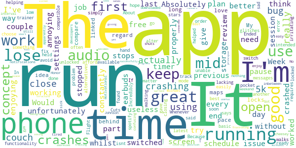

# One You Couch to 5K
App version ``7.4.0``

Analyzed with [covid-apps-observer](http://github.com/covid-apps-observer) project, version ``0.1``

## App overview
| | |
|-------------------------|-------------------------| 
| **Name**&nbsp;&nbsp;&nbsp;&nbsp;&nbsp;&nbsp;&nbsp;&nbsp;&nbsp;&nbsp;&nbsp;&nbsp;&nbsp;&nbsp;&nbsp;&nbsp;&nbsp;&nbsp;&nbsp;&nbsp;&nbsp;&nbsp;&nbsp;&nbsp;&nbsp;&nbsp;&nbsp;&nbsp;&nbsp;&nbsp;&nbsp;&nbsp;&nbsp;&nbsp;&nbsp;&nbsp;&nbsp;&nbsp;&nbsp;&nbsp;  | One You Couch to 5K |
| **Unique identifier** | com.phe.couchto5K |
| **Link to Google Play** | [https://play.google.com/store/apps/details?id=com.phe.couchto5K](https://play.google.com/store/apps/details?id=com.phe.couchto5K) |
| **Summary**  | The FREE Couch to 5K app. We’ll take you from couch to 5k hero in just 9 weeks! |
| **Privacy policy** | [https://www.nhs.uk/oneyou/privacy-policy](https://www.nhs.uk/oneyou/privacy-policy) |
| **Latest version** | 7.4.0 |
| **Last update** | 2020-07-27 12:06:56 |
| **Recent changes** | General bug fixes and maintenance improvements. |
| **Installs**  | 1,000,000+ |
| **Category** | Health & Fitness |
| **First release** | Mar 5, 2016 |
| **Size**  | 132M |
| **Supported Android version**  | 4.4W and up |

### Description
> For the latest official information about what you can and can't do at this time, visit https://www.nhs.uk/conditions/coronavirus-covid-19/ 
 It’s an easy to follow programme known the world over, and perfect for those new to running and need some extra support and motivation along the way.
 The app features a choice of 5 great trainers to support and motivate you at every step of the way, telling you when to run and when to walk, from broadcaster and former Olympian Michael Johnson, comedians Sarah Millican and Sanjeev Kohli, BBC presenter Jo Whiley, and our very own Laura, who have now helped over 2 million people like you start their own running journeys.
 One You Couch to 5K features:
 • A flexible programme that can be completed in as little as 9 weeks, or longer if you want to go at your own pace
 • Easy to follow countdown timer so you can see and well as hear how long you’ve got left of each run
 • Works alongside your preferred music player, automatically 'dipping' the volumes so you can hear the instructions and motivations from your chosen trainer
 • Signals a half-time bell when you get half way, so you know when to head home!
 • Lets you track your progress and awards achievements as you move through the runs
 • Lets you rate how you feel before and after each session to help acknowledge the immediate benefits for doing some physical activity
 • Connects you with likeminded people through the Couch to 5k HealthUnlocked community forums, offering loads of advice, tips and motivations to keep you on you on your fitness journey
 One You is here to help you live more healthily and make the changes that matter most. Millions of people have already got running with the Couch to 5k plan. Now it’s your turn! Download this app, get off the couch and we’ll help you reach your health goals.

### User interface
The developers of the app provide the following screenshots in the Google play store.
| | | |
|:-------------------------:|:-------------------------:|:-------------------------:|
 |   |   |   | 
 |   |   |   | 
 |   |  

## Development team
In the following we report the main information provided by the development team in the Google play store.

| | |
|-------------------------|-------------------------|
| **Developer**  | Public Health England Digital |
| **Website**  | [https://www.nhs.uk/oneyou/moving](https://www.nhs.uk/oneyou/moving) |
| **Email** | oneyou@phe.gov.uk |
| **Physical address**  | - |
| **Other developed apps**  | [https://play.google.com/store/apps/developer?id=Public+Health+England+Digital](https://play.google.com/store/apps/developer?id=Public+Health+England+Digital) |

## Android support

| | |
|-------------------------|-------------------------|
| **Declared target Android version**  | Pie, version 9 (API level 28) |
| **Effective target Android version**  | Pie, version 9 (API level 28) |
| **Minimum supported Android version**  | KitKat W, version 4.4W - 4.4.4W (API level 20) |
| **Maximum target Android version**  | - |

The larger the difference between the minimum and maximum supported Android versions, the better. A larger difference means a wider audience. For example, old phones have a very low Android version, so a high minimum supported Android version means that the app cannot be used by users with old phones, thus leading to accessibility problems. 

## Requested permissions

In the following we report the complete list of the permissions requested by the app. 

| **Permission** | **Protection level** | **Description** | 
|-------------------------|-------------------------|-------------------------|
 **android.permission ACCESS_COARSE_LOCATION** | :warning:**Dangerous** | Allows an app to access approximate location. 
 **android.permission ACCESS_FINE_LOCATION** | :warning:**Dangerous** | Allows an app to access precise location. 
 **android.permission ACCESS_NETWORK_STATE** | Normal | Allows applications to access information about networks. 
 **android.permission BLUETOOTH** | Normal | Allows applications to connect to paired bluetooth devices. 
 **android.permission BLUETOOTH_ADMIN** | Normal | Allows applications to discover and pair bluetooth devices. 
 **android.permission INTERNET** | Normal | Allows applications to open network sockets. 
 **android.permission WAKE_LOCK** | Normal | Allows using PowerManager WakeLocks to keep processor from sleeping or screen from dimming. 
 **android.permission WRITE_EXTERNAL_STORAGE** | :warning:**Dangerous** | Allows an application to write to external storage. 
 **com.android.alarm.permission SET_ALARM** | Normal | Allows an application to broadcast an Intent to set an alarm for the user. 
 **com.google.android.c2dm.permission RECEIVE** | - | - 
 **com.google.android.finsky.permission BIND_GET_INSTALL_REFERRER_SERVICE** | - | - 

## Mentioned servers

| **Server** | **Registrant** | **Registrant country** | **Creation date** | 
|-------------------------|-------------------------|-------------------------|-------------------------|
 | googlesyndication.com | Google LLC | :us: US | 2003-01-21 06:17:24 |
 | google.com | Google LLC | :us: US | 1997-09-15 04:00:00 |
 | google-analytics.com | Google LLC | :us: US | 2005-07-18 19:24:32 |
 | app-measurement.com | Google LLC | :us: US | 2015-06-19 20:13:31 |
 | googletagmanager.com | Google LLC | :us: US | 2011-11-11 23:39:05 |
 | paragon-cc.co.uk | - | - | 2017-04-04 00:00:00 |
 | bbc.co.uk | - | - | 1996-08-01 00:00:00 |
 | df-phe.com | DOGFI.SH Mobile | GB | 2015-06-16 14:57:16 |
 | phedigital.co.uk | - | - | 2018-06-06 00:00:00 |
 | youtube.com | Google LLC | :us: US | 2005-02-15 05:13:12 |
 | crashlytics.com | Google LLC | :us: US | 2011-01-21 15:30:40 |
 | nhs.uk | Department of Health | - | 1996-08-01 00:00:00 |
 | tealiumiq.com | Whois Privacy Service | :us: US | 2011-02-09 18:33:06 |
 | googleapis.com | Google LLC | :us: US | 2005-01-25 17:52:26 |
 | googleadservices.com | Google LLC | :us: US | 2003-06-19 16:34:53 |
 | healthunlocked.com | Everything Unlocked Ltd | GB | 2008-05-04 18:31:28 |

## Security analysis 

Below we report the main security warnings raised by our execution of the [Androwarn](https://github.com/maaaaz/androwarn) security analysis tool.

**Telephony identifiers leakage**
> - This application reads the ISO country code equivalent of the current registered operator's MCC (Mobile Country Code) 
> - This application reads the numeric name (MCC+MNC) of current registered operator 
> - This application reads the operator name 

**Connection interfaces exfiltration**
> - This application reads details about the currently active data network 
> - This application tries to find out if the currently active data network is metered 

**Suspicious connection establishment**
> - This application opens a Socket and connects it to the remote address '' on the 'N/A' port  
> - This application opens a Socket and connects it to the remote address 'Ljava/lang/StringBuilder;->toString()Ljava/lang/String;' on the ': connect, resolve' port  
> - This application opens a Socket and connects it to the remote address 'Ljava/lang/StringBuilder;->toString()Ljava/lang/String;' on the 'N/A' port  
> - This application opens a Socket and connects it to the remote address 'Ljava/net/Proxy;->type()Ljava/net/Proxy$Type;' on the 'N/A' port  
> - This application opens a Socket and connects it to the remote address 'timeout' on the 'N/A' port  

## User ratings and reviews

Below we provide information about how end users are reacting to the app in terms of ratings and reviews in the Google Play store.

### Ratings

The One You Couch to 5K app has been installed by more than **1000000** times. At this time, **28344** rated the app and its average score is **4.744284**. Below we show the distribution of the ratings across the usual star-based rating of Google Play

:star::star::star::star::star:: 23520

:star::star::star::star:: 3559

:star::star::star:: 548

:star::star:: 279

:star:: 438

### Reviews 

#### 5-star reviews

> I can run for 30 mins! Great app great program!!  :date: __2021-01-23 12:28:52__

> Really useful tool, great development week on week. Sarah is a great coach. She keeps me going.  :date: __2021-01-23 11:22:19__

> Think it's great lots of encouragement and it's a great way of keeping fit, meeting people and achieving your goals  :date: __2021-01-23 10:40:39__

> Brilliant app, I'm not a strong runner so started couch to 5K to set myself a challenge and I am amazed at how far I have come from struggling in week 1 not able to run for more than a couple of minutes to now running for 30 minutes without stopping, I recommend it to everybody who wants to improve their fitness and have been recommending it to all my family and friends!  :date: __2021-01-23 00:42:23__

> Easy to use app. Having Sarah in my ear encourages me to get through the run. The gradual progression works well for my level of fitness.  :date: __2021-01-23 00:25:38__

> Great. Love the app. Very clear UI, easy to use and very happy with Jo as my trainer. For a DJ she has an uncanny habit of crashing the break thoug. But I guess I can't blame her for that - it's not her hand on the needle. 😁  :date: __2021-01-22 22:36:08__

> Want to get fit  :date: __2021-01-22 21:18:44__

> I am amazed at how I have come on in only a few days  :date: __2021-01-22 20:50:08__

> Really motivational. Music tracks great and i love how the sound adapts to when the talking starts.  :date: __2021-01-22 18:40:53__

> So easy to use.  :date: __2021-01-22 17:33:24__

#### 4-star reviews

> It certainly got me up to 5k so it can be done! It wasn't easy in parts and some days went better than others but keep going and you'll get there and achieve your goal of running 5k and looking like a red sweaty mess.  :date: __2021-01-22 19:23:12__

> Good verbal direction and encouragement but nothing visual to show what you've done, like, route, distance, steps, etc.  :date: __2021-01-22 12:50:45__

> Finding thr app helpful - I've just completed my 5th run but on 2 of my runs the app has just stopped so I've kept walking or running for longer than necessary - exhausting!  :date: __2021-01-21 19:08:30__

> A motivator  :date: __2021-01-21 16:08:47__

> The app is brilliant and motivating, the only thing is the app does cut out every now and then.  :date: __2021-01-21 15:24:18__

> Great app, gets straight into walking then running for 60 seconds at a time on day 1  :date: __2021-01-21 08:58:49__

> Excellent  :date: __2021-01-20 22:21:01__

> Good, love Michael, but sometimes the time isn't working accurately  :date: __2021-01-20 15:27:31__

> Easy to follow, encouraging and iv enjoyed my experience so far  :date: __2021-01-20 12:13:45__

> I was surprised how helpful I found it. It fades my Spotify in and out to remind me when to run and walk... I am building up speed and stamina and look forward to the run.  :date: __2021-01-19 23:41:23__

#### 3-star reviews

> Keeps asking me to reassign a trainer. Other than that..when I do have a trainer it works well, motivating...etc etc all good very encouraging..  :date: __2021-01-19 19:16:51__

> App is great to start running but as soon as my screen turns off the app stops counting time.  :date: __2021-01-18 11:50:52__

> Great but it doesn't save my repeat runs only the 1st run I ever did on that run. I have done about 4 runs on week 3 and it still shows only the 1st run I did 4 months ago! I am having to use other apps like Strava or my fitness watch to see my history. This seems like a very basic thing to fix?!  :date: __2021-01-15 20:59:59__

> Very glitchy. Closes randomly even with recommended settings  :date: __2021-01-14 18:02:02__

> It got me through the program. Did often crash during the run leaving me with no voice guidance to stop. So some runs went on extra long! This happened repeatedly on the final 3 runs so I'm nearly at 10k distances now.  :date: __2021-01-13 19:01:34__

> Clear guidance and great for anyone who does little or no exercise to get started! I've put 3 stars because the app kept freezing.... Had to switch to a different app but if you don't have this problem then I'd recommend it!  :date: __2021-01-12 22:33:41__

> Yes it's good  :date: __2021-01-12 17:27:00__

> It is a brill app and has successfully managed to get me to run 5k However the app sometimes stops working and shuts down on you. Helpful to set a timer in background just in case.  :date: __2021-01-12 01:11:28__

> Good but would like more encouragement !  :date: __2021-01-11 20:02:30__

> Timing seems out compared to my device. Seems to pause if not constantly open  :date: __2021-01-10 13:16:12__

#### 2-star reviews

> Keeps out half way through the run.  :date: __2021-01-22 19:14:51__

> The timer stops working or lags when your screen goes black and I ended up walking much more in the beginning as a warm up than I should have done and was running for much longer than I should have been. Therefore, even though the concept is great, it really didn't work as I didn't have any structure to follow in the end and might as well just run at my own pace.  :date: __2021-01-20 00:23:14__

> Keeps shutting down on honor 10 even after settings change  :date: __2021-01-10 14:09:52__

> I started using this app again but it'd cut out on me several times and had to use a stopwatch instead and no progress logged  :date: __2021-01-05 12:04:53__

> I like the app and love my coach Michael Johnson. But it stops mid run on EVERY SINGLE RUN, rendering itself useless. Very very frustrating. It would also be good if the coach pep talks varied from run to run (rather than week to week) in the early weeks.  :date: __2020-12-30 22:17:12__

> I had heard good things about this app, unfortunately the app cuts off quite frequently and this is really disheartening when you are in the middle of a run. If they get this bug fixed then I would give it 5 stars.  :date: __2020-12-27 21:06:48__

> The app is a great idea and well thought out. Having a coach is nice and I like that it has a reminder feature. However, the app consistantly crashes at least twice during a run. Not so bad when you are on a walking session, but particularly annoying when you are running. I have set the recommended power settings for my phone but it still crashes. Also it often asks me to reset the trainer as the audio is not available or my phone is out of memory (not true).So nice idea if it worked properly.  :date: __2020-12-09 12:26:39__

> I was really pleased with this app however on week two it lost all of the sound (the instructions) which quite frankly makes it useless. I have uninstalled and reinstalled multiple times but it hasn't made the slightest bit of difference. A real shame!  :date: __2020-12-08 14:46:07__

> I love the guides running, however the app simply doesn't work properly. I have changed the settings to manage manually multiple times yet it always stops mid run. Whenever you reopen the app, you have to start the run all over again. Please fix this, it's a real pity.  :date: __2020-12-06 15:49:04__

> Lovely app but the sound would not work. Had to run holding the phone so I could see the instructions. I have a Pixel 3 and wonder if this is the reason it doesn't work properly. Would really like to be able to use this app fully!  :date: __2020-12-02 09:31:02__

#### 1-star reviews

> App always stops  :date: __2021-01-22 17:18:29__

> Stopped working correctly - it freezes when I start it up. It used to be fine, but the minute I press go, it goes for 1 second then stops. Audio stops, timer stops, it just won't work. Not sure if there's been an update which has messed it up but my phone (Google pixel 3) is up to date. Please fix it, this is my running lifeline  :date: __2021-01-21 00:05:01__

> Keeps closing down. Each time Im outside running it stays on for a bit. I think when the Internet connection goes down slightly it just shuts completely and I have to start all over again! So annoying! Does anyone know a better app here? Or is it something tthat Im not doing right?? It shouldn't be so hard... :(  :date: __2021-01-20 20:12:39__

> Awful, had to reset it 3 times over the first two runs I did. I've had to guess Whereabout I was in tbe run. I've uninstalled and now going to try a different app.  :date: __2021-01-13 18:23:18__

> Can't be arsed.which is an indicator of how boring it is  :date: __2021-01-13 15:07:16__

> Very dissapointed my second schedule run and it keeps freezing 😣 11 01.2020 no change app keeps stopping  :date: __2021-01-11 21:51:01__

> Not impressed, the timer wasn't accurate in the slightest. Supposed to start with 60 run and 90 second walk alternating but the app simply couldn't keep time. I ran 2 and a half miles in around 24 minutes and the app said there was still 17 minutes left of running. It was only supposed to be a 20 minute run. Not great when you're a beginner trying to get fit.  :date: __2021-01-11 18:14:43__

> Never been able to do it as it crashes all the time as soon as I go in to the app.  :date: __2021-01-10 21:37:09__

> It crashes every single time 😩 sometimes it'll last 5 mins before it crashes, sometimes its only a minute. Not good when you're running and don't realise it's happened, which happened to me 😂 a bit useless really, and can see I'm not the only one. PLEASE FIX THIS as Apple users don't seem to have the same problems!  :date: __2021-01-10 12:56:56__

> Kept crashing!, didn't even get half way through first session, it had stopped working 3 times  :date: __2021-01-07 14:43:07__

