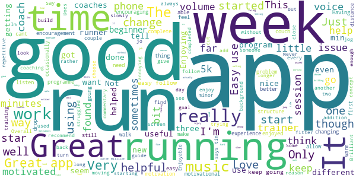

# One You Couch to 5K
App version ``7.4.0``

Analyzed with [covid-apps-observer](http://github.com/covid-apps-observer) project, version ``0.1``

## App overview
| | |
|-------------------------|-------------------------| 
| **Name**                                          | One You Couch to 5K |
| **Unique identifier** | com.phe.couchto5K |
| **Link to Google Play** | [https://play.google.com/store/apps/details?id=com.phe.couchto5K](https://play.google.com/store/apps/details?id=com.phe.couchto5K) |
| **Summary**  | The FREE Couch to 5K app. We’ll take you from couch to 5k hero in just 9 weeks! |
| **Privacy policy** | [https://www.nhs.uk/oneyou/privacy-policy](https://www.nhs.uk/oneyou/privacy-policy) |
| **Latest version** | 7.4.0 |
| **Last update** | 2020-07-27 12:06:56 |
| **Recent changes** | General bug fixes and maintenance improvements. |
| **Installs**  | 1,000,000+ |
| **Category** | Health & Fitness |
| **First release** | Mar 5, 2016 |
| **Size**  | 132M |
| **Supported Android version**  | 4.4W and up |

### Description
> For the latest official information about what you can and can't do at this time, visit https://www.nhs.uk/conditions/coronavirus-covid-19/ 
 It’s an easy to follow programme known the world over, and perfect for those new to running and need some extra support and motivation along the way.
 The app features a choice of 5 great trainers to support and motivate you at every step of the way, telling you when to run and when to walk, from broadcaster and former Olympian Michael Johnson, comedians Sarah Millican and Sanjeev Kohli, BBC presenter Jo Whiley, and our very own Laura, who have now helped over 2 million people like you start their own running journeys.
 One You Couch to 5K features:
 • A flexible programme that can be completed in as little as 9 weeks, or longer if you want to go at your own pace
 • Easy to follow countdown timer so you can see and well as hear how long you’ve got left of each run
 • Works alongside your preferred music player, automatically 'dipping' the volumes so you can hear the instructions and motivations from your chosen trainer
 • Signals a half-time bell when you get half way, so you know when to head home!
 • Lets you track your progress and awards achievements as you move through the runs
 • Lets you rate how you feel before and after each session to help acknowledge the immediate benefits for doing some physical activity
 • Connects you with likeminded people through the Couch to 5k HealthUnlocked community forums, offering loads of advice, tips and motivations to keep you on you on your fitness journey
 One You is here to help you live more healthily and make the changes that matter most. Millions of people have already got running with the Couch to 5k plan. Now it’s your turn! Download this app, get off the couch and we’ll help you reach your health goals.

### User interface
The developers of the app provide the following screenshots in the Google play store.
| | | |
|:-------------------------:|:-------------------------:|:-------------------------:|
 |   |   |   | 
 |   |   |   | 
 |   |  

## Development team
In the following we report the main information provided by the development team in the Google play store.

| | |
|-------------------------|-------------------------|
| **Developer**  | Public Health England Digital |
| **Website**  | [https://www.nhs.uk/oneyou/moving](https://www.nhs.uk/oneyou/moving) |
| **Email** | oneyou@phe.gov.uk |
| **Physical address**  | - |
| **Other developed apps**  | [https://play.google.com/store/apps/developer?id=Public+Health+England+Digital](https://play.google.com/store/apps/developer?id=Public+Health+England+Digital) |

## Android support

| | |
|-------------------------|-------------------------|
| **Declared target Android version**  | Pie, version 9 (API level 28) |
| **Effective target Android version**  | Pie, version 9 (API level 28) |
| **Minimum supported Android version**  | KitKat W, version 4.4W - 4.4.4W (API level 20) |
| **Maximum target Android version**  | - |

The larger the difference between the minimum and maximum supported Android versions, the better. A larger difference means a wider audience. For example, old phones have a very low Android version, so a high minimum supported Android version means that the app cannot be used by users with old phones, thus leading to accessibility problems. 

## Requested permissions

In the following we report the complete list of the permissions requested by the app. 

| **Permission** | **Protection level** | **Description** | 
|-------------------------|-------------------------|-------------------------|
 **android.permission ACCESS_COARSE_LOCATION** | :warning:**Dangerous** | Allows an app to access approximate location. 
 **android.permission ACCESS_FINE_LOCATION** | :warning:**Dangerous** | Allows an app to access precise location. 
 **android.permission ACCESS_NETWORK_STATE** | Normal | Allows applications to access information about networks. 
 **android.permission BLUETOOTH** | Normal | Allows applications to connect to paired bluetooth devices. 
 **android.permission BLUETOOTH_ADMIN** | Normal | Allows applications to discover and pair bluetooth devices. 
 **android.permission INTERNET** | Normal | Allows applications to open network sockets. 
 **android.permission WAKE_LOCK** | Normal | Allows using PowerManager WakeLocks to keep processor from sleeping or screen from dimming. 
 **android.permission WRITE_EXTERNAL_STORAGE** | :warning:**Dangerous** | Allows an application to write to external storage. 
 **com.android.alarm.permission SET_ALARM** | Normal | Allows an application to broadcast an Intent to set an alarm for the user. 
 **com.google.android.c2dm.permission RECEIVE** | - | - 
 **com.google.android.finsky.permission BIND_GET_INSTALL_REFERRER_SERVICE** | - | - 

## Mentioned servers

| **Server** | **Registrant** | **Registrant country** | **Creation date** | 
|-------------------------|-------------------------|-------------------------|-------------------------|
 | googlesyndication.com | Google LLC | :us: US | 2003-01-21 06:17:24 |
 | google.com | Google LLC | :us: US | 1997-09-15 04:00:00 |
 | google-analytics.com | Google LLC | :us: US | 2005-07-18 19:24:32 |
 | app-measurement.com | Google LLC | :us: US | 2015-06-19 20:13:31 |
 | googletagmanager.com | Google LLC | :us: US | 2011-11-11 23:39:05 |
 | paragon-cc.co.uk | - | - | 2017-04-04 00:00:00 |
 | bbc.co.uk | - | - | 1996-08-01 00:00:00 |
 | df-phe.com | DOGFI.SH Mobile | GB | 2015-06-16 14:57:16 |
 | phedigital.co.uk | - | - | 2018-06-06 00:00:00 |
 | youtube.com | Google LLC | :us: US | 2005-02-15 05:13:12 |
 | crashlytics.com | Google LLC | :us: US | 2011-01-21 15:30:40 |
 | nhs.uk | Department of Health | - | 1996-08-01 00:00:00 |
 | tealiumiq.com | Whois Privacy Service | :us: US | 2011-02-09 18:33:06 |
 | googleapis.com | Google LLC | :us: US | 2005-01-25 17:52:26 |
 | googleadservices.com | Google LLC | :us: US | 2003-06-19 16:34:53 |
 | healthunlocked.com | Everything Unlocked Ltd | GB | 2008-05-04 18:31:28 |

## Security analysis 

Below we report the main security warnings raised by our execution of the [Androwarn](https://github.com/maaaaz/androwarn) security analysis tool.

**Telephony identifiers leakage**
> - This application reads the ISO country code equivalent of the current registered operator's MCC (Mobile Country Code) 
> - This application reads the numeric name (MCC+MNC) of current registered operator 
> - This application reads the operator name 

**Connection interfaces exfiltration**
> - This application reads details about the currently active data network 
> - This application tries to find out if the currently active data network is metered 

**Suspicious connection establishment**
> - This application opens a Socket and connects it to the remote address '' on the 'N/A' port  
> - This application opens a Socket and connects it to the remote address 'Ljava/lang/StringBuilder;->toString()Ljava/lang/String;' on the ': connect, resolve' port  
> - This application opens a Socket and connects it to the remote address 'Ljava/lang/StringBuilder;->toString()Ljava/lang/String;' on the 'N/A' port  
> - This application opens a Socket and connects it to the remote address 'Ljava/net/Proxy;->type()Ljava/net/Proxy$Type;' on the 'N/A' port  
> - This application opens a Socket and connects it to the remote address 'timeout' on the 'N/A' port  

## User ratings and reviews

Below we provide information about how end users are reacting to the app in terms of ratings and reviews in the Google Play store.

### Ratings

The One You Couch to 5K app has been installed by more than **1000000** times. At this time, **28344** rated the app and its average score is **4.744284**. Below we show the distribution of the ratings across the usual star-based rating of Google Play

:star::star::star::star::star:: 23520

:star::star::star::star:: 3559

:star::star::star:: 548

:star::star:: 279

:star:: 438

### Reviews 

#### 5-star reviews

> Encouraging, inspiring, motivating, like it 😃  :date: __2021-01-03 14:50:14__

> Great, easy to follow, great encouragement when feeling that's it! Just need to continue it but will probably use week 9 when I run.  :date: __2021-01-03 14:46:31__

> Gave me a structured training programme to get started  :date: __2021-01-03 13:54:57__

> Very clear, simple and achievable program. Even if it doesn't seem so when the new. goals are looming.  :date: __2021-01-03 12:51:32__

> I'm finding this a really comfortable way to train, With a good play list in the back ground 😊  :date: __2021-01-03 11:36:44__

> Did this over the lockdown. Excellent, helped me build up stamina and endurance. I can now run for 30 minutes and have continued to run. Worked for me would highly recommend.  :date: __2021-01-03 10:21:53__

> The app has been great, easy to use. The training program is being used for the second time around, getting back from injury gently. I'm 70 next year, so it's great to have a plan that has worked before.  :date: __2021-01-03 10:17:32__

> Given me a sense of achievement 👌  :date: __2021-01-03 08:04:42__

> I've actually started running! Really good app  :date: __2021-01-02 23:35:37__

> Fantastic, easy to follow app which improves your fitness really gradually. Has made me feel so much better in such a short time.  :date: __2021-01-02 20:39:40__

#### 4-star reviews

> Would be better if the app had a report on your runs.  :date: __2021-01-03 10:48:07__

> Good clear instructions with positive comments and tips.  :date: __2021-01-01 19:42:29__

> Hard work but fun to an worth it.  :date: __2021-01-01 18:49:53__

> No way to save data or map your run, it's just literally audio guide nothing more.  :date: __2021-01-01 08:56:16__

> Great app, last run wouldn't let me complete though.  :date: __2021-01-01 00:20:44__

> Really helped motivate me and achieve a goal.  :date: __2020-12-31 16:02:09__

> Excellent App, got me back in the habit of running gradually so I almost enjoy it now, I've never stuck to running this long so I'm pleased I've now pushed through and made it habit to include in my weekly fitness. The voice over trainers didn't always work so I had to swap them about a bit but it was still fine.  :date: __2020-12-31 14:48:18__

> Postive  :date: __2020-12-31 10:59:13__

> Please give advise in how to use with own music.  :date: __2020-12-30 20:58:29__

> I have done a lot of running regular 10 miles and half marathons. Running was always something that I could pick back up easily. I had a hip replacement and 4 year lay off. I still did other things, i.e. walking football. After my 60th birthday I decided to throw caution to the wind and start again with a 5K. I struggled and walked most of it. A friend recommended Ct5k and I love the feeling of achieving little targets and building on them. It's hard but can' wait to hit that 5k target.  :date: __2020-12-30 19:58:29__

#### 3-star reviews

> It seems to bounce out of the app when I am running. So I have to keep logging in. Not sure if it is because it is so cold or because I have my music on. Or both. I have only completed day two. I am living Sarah telling me what to do. 😂  :date: __2021-01-03 10:26:06__

> Crashed half way through a run. Took me a while to realise  :date: __2021-01-02 10:42:13__

> It's a good app, but it does crash every single time the screen goes blank unfortunately.. I was running for a lot longer than a minute thinking to myself this feels even longer than it usually does 😂 although I did manage it so quite pleased with myself... However as previous people have said it it is a little disheartening, in the end I took to running with my phone unlocked which wasn't ideal, may use my fitbit instead from now on.  :date: __2021-01-01 23:43:03__

> It was successful in that it got me running, however I frequently lost connection part way through.  :date: __2020-12-30 09:54:20__

> Enjoyed the podcast. This means I can listen to my own playlist. But I cannot see how the run went (data such as speed, distance etc) using the app, which would be useful.  :date: __2020-12-28 12:32:28__

> Loved it, then my knees didn't..I will give it another go when I feel my legs, knees are stronger..so, speed walking to it rather than running...  :date: __2020-12-22 18:24:23__

> Really good, being able to choose a voice that comfort and motivates you really helps - especially with children. Only issues we have found are that it very often closest he app part way through a run, which is irritating when you're waiting for instruction and that sometimes it doesn't seem to save runs so my son struggles with following his progress  :date: __2020-12-22 14:38:54__

> More comentry during run and walk sessions like countdown would be good  :date: __2020-12-17 16:08:08__

> Starts off well but it's so frustrating that it crashes or stops working mid run!  :date: __2020-12-13 18:44:52__

> Good but it shuts down when running  :date: __2020-12-12 18:11:11__

#### 2-star reviews

> I like the app and love my coach Michael Johnson. But it stops mid run on EVERY SINGLE RUN, rendering itself useless. Very very frustrating. It would also be good if the coach pep talks varied from run to run (rather than week to week) in the early weeks.  :date: __2020-12-30 22:17:12__

> I had heard good things about this app, unfortunately the app cuts off quite frequently and this is really disheartening when you are in the middle of a run. If they get this bug fixed then I would give it 5 stars.  :date: __2020-12-27 21:06:48__

> The app is a great idea and well thought out. Having a coach is nice and I like that it has a reminder feature. However, the app consistantly crashes at least twice during a run. Not so bad when you are on a walking session, but particularly annoying when you are running. I have set the recommended power settings for my phone but it still crashes. Also it often asks me to reset the trainer as the audio is not available or my phone is out of memory (not true).So nice idea if it worked properly.  :date: __2020-12-09 12:26:39__

> I was really pleased with this app however on week two it lost all of the sound (the instructions) which quite frankly makes it useless. I have uninstalled and reinstalled multiple times but it hasn't made the slightest bit of difference. A real shame!  :date: __2020-12-08 14:46:07__

> I love the guides running, however the app simply doesn't work properly. I have changed the settings to manage manually multiple times yet it always stops mid run. Whenever you reopen the app, you have to start the run all over again. Please fix this, it's a real pity.  :date: __2020-12-06 15:49:04__

> Lovely app but the sound would not work. Had to run holding the phone so I could see the instructions. I have a Pixel 3 and wonder if this is the reason it doesn't work properly. Would really like to be able to use this app fully!  :date: __2020-12-02 09:31:02__

> Keeps restarting so. I. Have to stop and go back to where I was in the work out  :date: __2020-11-30 23:10:00__

> Make sure you have a stopwatch as this app constantly crashes.  :date: __2020-11-30 07:30:07__

> The app keeps stopping mid run. If it did not do this is would be brilliant.  :date: __2020-11-30 00:39:33__

> The programme is great and the app worked brilliantly over the summer when I first used it. I'm not doing the programme again at a faster speed and I'm having problems with the app asking me to reset the trainer because I'm out of memory (not true) and resets the trainer every time I go out. Please can you review for bugs. Also this time there must have been an update as the podcast no longer stops the background audio when the trainer comes on. This is annoying as I miss patches from the audio.  :date: __2020-11-28 10:59:00__

#### 1-star reviews

> Very dissapointed my second schedule run and it keeps freezing 😣  :date: __2020-12-30 18:56:35__

> Cannot make run in background No matter what, I cannot get this app to work unless its the only thing I have running. I have given it every permission and it still cuts out. Very disappointing  :date: __2020-12-27 08:55:05__

> Decided to start running again, but wanted to start from scratch so downloaded this. One run in and it paused itself throughout. I ended up counting my way through it and ignoring the app.  :date: __2020-12-21 14:21:02__

> Terrible why do I have to have some "celebrity" talking to me. I just want to complete the programme on my own. Why is there no option to turn the voice off. Usual bbc rubbish.  :date: __2020-12-15 00:09:57__

> Constantly crashes  :date: __2020-12-10 08:08:26__

> Keeps turning off, need to restart app. Does not work with my Spotify.  :date: __2020-12-10 07:37:08__

> Doesn't work for me on android using Spotify. I get the first couple of directions, then silence.  :date: __2020-12-09 10:59:33__

> I used this app on my Huawei P10 Lite and it worked amazing. I'm about half way through the 9 week programme and I got a new phone for my birthday, a P30 Pro, and it doesn't work. In the help section it doesn't list my phone or it's EMUI so it doesn't look like it's compatible with the newer versions. Hopefully they will update the app at some point. It's so disappointing.  :date: __2020-12-04 20:46:44__

> app keeps crashing mid run. waste of time  :date: __2020-12-02 20:12:29__

> Very good when it doesn't crash. So annoying when the app crashes half way through a run. It never completes a run now. At least I do.  :date: __2020-11-30 20:00:50__

