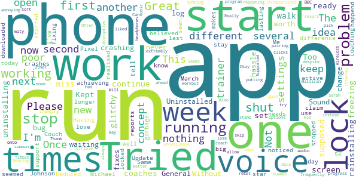

# One You Couch to 5K
App version ``7.6.0``

Analyzed with [covid-apps-observer](http://github.com/covid-apps-observer) project, version ``0.1``

## App overview
| | |
|-------------------------|-------------------------| 
| **Name**&nbsp;&nbsp;&nbsp;&nbsp;&nbsp;&nbsp;&nbsp;&nbsp;&nbsp;&nbsp;&nbsp;&nbsp;&nbsp;&nbsp;&nbsp;&nbsp;&nbsp;&nbsp;&nbsp;&nbsp;&nbsp;&nbsp;&nbsp;&nbsp;&nbsp;&nbsp;&nbsp;&nbsp;&nbsp;&nbsp;&nbsp;&nbsp;&nbsp;&nbsp;&nbsp;&nbsp;&nbsp;&nbsp;&nbsp;&nbsp;  | One You Couch to 5K |
| **Unique identifier** | com.phe.couchto5K |
| **Link to Google Play** | [https://play.google.com/store/apps/details?id=com.phe.couchto5K](https://play.google.com/store/apps/details?id=com.phe.couchto5K) |
| **Summary**  | The FREE Couch to 5K app. We’ll take you from couch to 5k hero in just 9 weeks! |
| **Privacy policy** | [https://www.nhs.uk/oneyou/privacy-policy](https://www.nhs.uk/oneyou/privacy-policy) |
| **Latest version** | 7.6.0 |
| **Last update** | 2021-02-17 11:16:53 |
| **Recent changes** | General bug fixes and maintenance improvements. |
| **Installs**  | 1,000,000+ |
| **Category** | Health & Fitness |
| **First release** | Mar 5, 2016 |
| **Size**  | 136M |
| **Supported Android version**  | 5.0 and up |

### Description
> For the latest official information about what you can and can't do at this time, visit https://www.nhs.uk/conditions/coronavirus-covid-19/ 
 It’s an easy to follow programme known the world over, and perfect for those new to running and need some extra support and motivation along the way.
 The app features a choice of 5 great trainers to support and motivate you at every step of the way, telling you when to run and when to walk, from broadcaster and former Olympian Michael Johnson, comedians Sarah Millican and Sanjeev Kohli, BBC presenter Jo Whiley, and our very own Laura, who have now helped over 2 million people like you start their own running journeys.
 One You Couch to 5K features:
 • A flexible programme that can be completed in as little as 9 weeks, or longer if you want to go at your own pace
 • Easy to follow countdown timer so you can see and well as hear how long you’ve got left of each run
 • Works alongside your preferred music player, automatically 'dipping' the volumes so you can hear the instructions and motivations from your chosen trainer
 • Signals a half-time bell when you get half way, so you know when to head home!
 • Lets you track your progress and awards achievements as you move through the runs
 • Lets you rate how you feel before and after each session to help acknowledge the immediate benefits for doing some physical activity
 • Connects you with likeminded people through the Couch to 5k HealthUnlocked community forums, offering loads of advice, tips and motivations to keep you on you on your fitness journey
 One You is here to help you live more healthily and make the changes that matter most. Millions of people have already got running with the Couch to 5k plan. Now it’s your turn! Download this app, get off the couch and we’ll help you reach your health goals.

### User interface
The developers of the app provide the following screenshots in the Google play store.
| | | |
|:-------------------------:|:-------------------------:|:-------------------------:|
 |   |   |   | 
 |   |   |   | 
 |   |  

## Development team
In the following we report the main information provided by the development team in the Google play store.

| | |
|-------------------------|-------------------------|
| **Developer**  | Public Health England Digital |
| **Website**  | [https://www.nhs.uk/oneyou/moving](https://www.nhs.uk/oneyou/moving) |
| **Email** | oneyou@phe.gov.uk |
| **Physical address**  | - |
| **Other developed apps**  | [https://play.google.com/store/apps/developer?id=Public+Health+England+Digital](https://play.google.com/store/apps/developer?id=Public+Health+England+Digital) |

## Android support

| | |
|-------------------------|-------------------------|
| **Declared target Android version**  | Pie, version 9 (API level 28) |
| **Effective target Android version**  | Pie, version 9 (API level 28) |
| **Minimum supported Android version**  | KitKat W, version 4.4W - 4.4.4W (API level 20) |
| **Maximum target Android version**  | - |

The larger the difference between the minimum and maximum supported Android versions, the better. A larger difference means a wider audience. For example, old phones have a very low Android version, so a high minimum supported Android version means that the app cannot be used by users with old phones, thus leading to accessibility problems. 

## Requested permissions

In the following we report the complete list of the permissions requested by the app. 

| **Permission** | **Protection level** | **Description** | 
|-------------------------|-------------------------|-------------------------|
 **android.permission ACCESS_COARSE_LOCATION** | :warning:**Dangerous** | Allows an app to access approximate location. 
 **android.permission ACCESS_FINE_LOCATION** | :warning:**Dangerous** | Allows an app to access precise location. 
 **android.permission ACCESS_NETWORK_STATE** | Normal | Allows applications to access information about networks. 
 **android.permission BLUETOOTH** | Normal | Allows applications to connect to paired bluetooth devices. 
 **android.permission BLUETOOTH_ADMIN** | Normal | Allows applications to discover and pair bluetooth devices. 
 **android.permission INTERNET** | Normal | Allows applications to open network sockets. 
 **android.permission WAKE_LOCK** | Normal | Allows using PowerManager WakeLocks to keep processor from sleeping or screen from dimming. 
 **android.permission WRITE_EXTERNAL_STORAGE** | :warning:**Dangerous** | Allows an application to write to external storage. 
 **com.android.alarm.permission SET_ALARM** | Normal | Allows an application to broadcast an Intent to set an alarm for the user. 
 **com.google.android.c2dm.permission RECEIVE** | - | - 
 **com.google.android.finsky.permission BIND_GET_INSTALL_REFERRER_SERVICE** | - | - 

## Mentioned servers

| **Server** | **Registrant** | **Registrant country** | **Creation date** | 
|-------------------------|-------------------------|-------------------------|-------------------------|
 | googlesyndication.com | Google LLC | :us: US | 2003-01-21 06:17:24 |
 | google.com | Google LLC | :us: US | 1997-09-15 04:00:00 |
 | google-analytics.com | Google LLC | :us: US | 2005-07-18 19:24:32 |
 | app-measurement.com | Google LLC | :us: US | 2015-06-19 20:13:31 |
 | googletagmanager.com | Google LLC | :us: US | 2011-11-11 23:39:05 |
 | paragon-cc.co.uk | - | - | 2017-04-04 00:00:00 |
 | bbc.co.uk | - | - | 1996-08-01 00:00:00 |
 | df-phe.com | DOGFI.SH Mobile | GB | 2015-06-16 14:57:16 |
 | phedigital.co.uk | - | - | 2018-06-06 00:00:00 |
 | youtube.com | Google LLC | :us: US | 2005-02-15 05:13:12 |
 | crashlytics.com | Google LLC | :us: US | 2011-01-21 15:30:40 |
 | nhs.uk | Department of Health | - | 1996-08-01 00:00:00 |
 | tealiumiq.com | Whois Privacy Service | :us: US | 2011-02-09 18:33:06 |
 | googleapis.com | Google LLC | :us: US | 2005-01-25 17:52:26 |
 | googleadservices.com | Google LLC | :us: US | 2003-06-19 16:34:53 |
 | healthunlocked.com | Everything Unlocked Ltd | GB | 2008-05-04 18:31:28 |

## Security analysis 

Below we report the main security warnings raised by our execution of the [Androwarn](https://github.com/maaaaz/androwarn) security analysis tool.

**Telephony identifiers leakage**
> - This application reads the ISO country code equivalent of the current registered operator's MCC (Mobile Country Code) 
> - This application reads the numeric name (MCC+MNC) of current registered operator 
> - This application reads the operator name 

**Connection interfaces exfiltration**
> - This application reads details about the currently active data network 
> - This application tries to find out if the currently active data network is metered 

**Suspicious connection establishment**
> - This application opens a Socket and connects it to the remote address '' on the 'N/A' port  
> - This application opens a Socket and connects it to the remote address 'Ljava/lang/StringBuilder;->toString()Ljava/lang/String;' on the ': connect, resolve' port  
> - This application opens a Socket and connects it to the remote address 'Ljava/lang/StringBuilder;->toString()Ljava/lang/String;' on the 'N/A' port  
> - This application opens a Socket and connects it to the remote address 'Ljava/net/Proxy;->type()Ljava/net/Proxy$Type;' on the 'N/A' port  
> - This application opens a Socket and connects it to the remote address 'timeout' on the 'N/A' port  

## User ratings and reviews

Below we provide information about how end users are reacting to the app in terms of ratings and reviews in the Google Play store.

### Ratings

The One You Couch to 5K app has been installed by more than **1000000** times. At this time, **32600** rated the app and its average score is **4.7457576**. Below we show the distribution of the ratings across the usual star-based rating of Google Play

:star::star::star::star::star:: 26892

:star::star::star::star:: 4268

:star::star::star:: 740

:star::star:: 266

:star:: 434

### Reviews 

#### 5-star reviews

> I didn't expect to complete this programme as I've never really been a runner. However, with a little perseverance, the course gave me the tips and encouragement I needed to succeed.  :date: __2021-03-28 14:54:00__

> Love this app, supports you through the whole experience and motivates you.  :date: __2021-03-28 14:45:25__

> Amazing app if you're a novice at running like me! I also have back and joint issues but this app has helped me to start slowly and not rush  :date: __2021-03-28 14:17:20__

> Very well planned yup lead you to success. Go for it!  :date: __2021-03-28 12:31:48__

> Very smooth progression, goid voice support  :date: __2021-03-28 12:08:33__

> Has certainly got me motivated.  :date: __2021-03-28 11:03:55__

> Unbelievable. I am NOT a runner but started this during lockdown like many others. I am currently on week 4 and am amazed that I cam actually run! A very well thought out app. Brilliant  :date: __2021-03-28 10:34:19__

> Absolutely loved this app. I've haven't ran for a long while and really wanted to ease myself back into it again, this app was fantastic in helping me gain the confidence to run again. These step by step challenges are brilliant and give you a sense of achievement.  :date: __2021-03-28 01:33:41__

> Excellent and easy to use  :date: __2021-03-28 00:42:49__

> Happy with it, I started running with the NHS c25k podcast and was pleased to see coach Laura was still an option 😊 Now years later, I'm restarting safely after an injury, I'm enjoying training "with" Jo Wiley and my own playlists. I've done 5 runs so far using the app + Spotify + Strava and nothing crashed  :date: __2021-03-27 23:21:19__

#### 4-star reviews

> Good app to help get you off your feet, however in my case struggles to work in background when phone is locked.  :date: __2021-03-27 16:14:49__

> Couple of bugs but absolutely fantastic app!  :date: __2021-03-26 18:10:00__

> This app is really good, I like the fact that the announcements play over my own music so I can pick what I like to listen to. I would give it 5* but some of my runs haven't saved.  :date: __2021-03-26 17:12:40__

> Helps to get you running but cuts out sometimes.  :date: __2021-03-26 17:08:51__

> It's a brilliant app, only criticism is maybe the trainer could let you know where you're at a little bit more often on the longer runs and could put a bit more of the trainer's personality into it.  :date: __2021-03-26 16:22:25__

> Really motivational and easy to use  :date: __2021-03-26 15:59:24__

> Keeps you going  :date: __2021-03-26 13:07:45__

> Like it but it doesnt tell you how many calories you have burnt and doeant show you the map of your run  :date: __2021-03-25 21:52:15__

> Having started again after an injury in week 3, I have now done the first 2 weeks 3 times and have found the app kept stopping in the week 1 runs. It happen multiple times in each run and would need to be restarted and skipped through each time (which meant I had to keep track of which walk or run I was up to) which I found very annoying. It seemed to sort itself for week 2 though and the first week 3 run which is as far as I've got so far. Otherwise I am pleased with the app.  :date: __2021-03-25 21:33:44__

> Great build up to running for beginners!  :date: __2021-03-25 16:07:32__

#### 3-star reviews

> Good but difficult to link music to.  :date: __2021-03-28 03:39:18__

> This app works well in encouraging you but after a while the repetition gets to you and you no longer feel motivated to complete it.  :date: __2021-03-27 13:35:26__

> Great but only available in English. I'd like a Welsh version please  :date: __2021-03-25 14:04:26__

> I really like this app, it's simple with no ads and costs nothing. Only give it three stars because each time I have used it ther are glitches in wk 1 which is extremely frustrating. I wouldnt discourage downloading it and giving it a go, I used run 1, wk 1, 3 times instead of risking the glitch in run 2 and 3. Hoping they will fix this ,  :date: __2021-03-25 10:40:59__

> App not reliable and keeps crashing partway through the run.  :date: __2021-03-21 23:46:56__

> The app is great, enjoy working with it. Not happy that I lost ALL data when I had to reset my phone.  :date: __2021-03-18 14:51:41__

> This is my third run sabbataged by this app. The app just stops, time pauses or just closes itself. :( it's not all bad as it's helped me get to week 7, but its so frustrating, please fix these issues and when your phone rings the app continues to play, I ignored a call and it paused itself. Yes another run I have to repeat.  :date: __2021-03-14 11:37:22__

> Keeps kicking me out mid run but other than that it's very helpful  :date: __2021-03-13 17:24:32__

> Great app however having some issues in my 2nd week run. The app stops working on my last 90 sec routine thereby losing all the effort I've put in. It's demoralising.  :date: __2021-03-12 20:04:26__

> I did 3 runs but it wouldn't register any run after the first one so I'm uninstall and reinstalling see if that fixes it. Otherwise I like it except u have to manually set yr next reminder after each run. Wld be better if u cls set days u regularly going to run and get a reminder automatically. But easy to use and I like the commentary.  :date: __2021-03-09 19:36:34__

#### 2-star reviews

> Audio and availability of speakers very temperamental  :date: __2021-03-27 21:37:51__

> The concept is good, but you can tell it's a GCSE/A level student's project  :date: __2021-03-25 18:56:53__

> It keeps crashing mid run. Not very helpful!  :date: __2021-03-24 14:55:36__

> Agreeing with a lot of the criticisms already mentioned. Concept is great, but after only installing yesterday I have already encountered multiple problems. It makes my other Apps crash, rendering them unusable. The first run I went on, it paused and when I went back into the App I had to re-start the run again, fast forward and try to guess where I was up to. Also, audio is too quiet against music with no option to adjust. Will try again, but if the problem persists I will be uninstalling.  :date: __2021-03-23 17:58:58__

> Would be a fantastic app if it worked properly! Keeps closing itself, or pausing. On the plus side, I kept running for about 4 minutes before I realised 🤦‍♀️  :date: __2021-03-21 16:02:34__

> Doesn't work! I changed the setting as per their instructions and it doesn't work. It catches up if I unlock the screen, but what's the point of an app if you have to do it all manually?  :date: __2021-03-18 11:10:58__

> My phone locks after however long but unfortunately it pauses the app. Absolutely useless in that regard. Would be better linked to maps to compare previous runs and pace.  :date: __2021-03-13 23:00:12__

> I love the idea behind the app but it's functionality is often lacking  :date: __2021-03-10 20:41:49__

> It does the job helping you keep track of your runs but it is annoying when you choose a trainer and it gives you error messages. If you go basic you cannot afford glitches!!  :date: __2021-03-10 08:51:07__

> Whenever I use something like spotify the run stops i have been on 3 walks now and it thinks I've done 0  :date: __2021-02-26 17:10:23__

#### 1-star reviews

> Kept crashing. I'm waiting for the voice to tell me to stop running and nothing 😡  :date: __2021-03-25 20:59:57__

> Sound not working.  :date: __2021-03-25 10:52:34__

> Not worth the hassle. Once phone locks the app just shuts off. Uninstalled!  :date: __2021-03-24 21:37:40__

> "General bug fixes" is not a change log.  :date: __2021-03-19 08:26:29__

> Once you lock your phone the app stops working.  :date: __2021-03-18 14:25:01__

> Without this app I would never be achieving what I am now. Me, running? I wouldn't have believed it. Having Michael Johnson coaching me makes a big difference. Update March 2021: Same problem as another one - it has stopped working on my Pixel 3 - support claim they don't know about it but I've seen several reports of it now. Reduced to one star as I can't use it  :date: __2021-03-16 23:26:35__

> Great concept - very poor app. The Couch to 5K is a great idea. I downloaded the app last week and started week 1 and all was well. I did my first week 2 run the other day and noticed that the runs seemed to be lasting longer than 90 seconds, I then realised that when my phone locks so does the app. I tried it again on my second week 2 run today and the same happend. This is very poor and the app should stay active when the phone is locked, like other apps do. This needs fixing.  :date: __2021-03-11 14:35:23__

> I love the concept of the app, but it's garbage, crashes frequently mid run. Also there's no way of syncing your data, if you get a new phone you lose your progress.  :date: __2021-03-11 12:19:04__

> Really liked it on my first run but ever since that one I can't get onto the next run. It just says coach unavailable pick new one in settings. It doesn't allow me to do that so I have to reset and keep repeating the first run. Disappointed.  :date: __2021-03-08 15:04:26__

> The audio does not work when i start it, despite changing the settings. Had to resort to putting the times on my fitbit as an interval workout. Seems to be a common problem wity Huawei phones.  :date: __2021-03-03 13:01:02__

