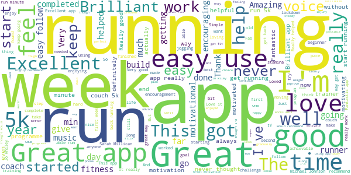
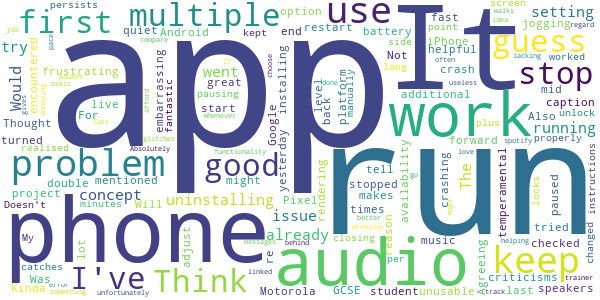

# One You Couch to 5K
App version ``7.6.0``

Analyzed with [covid-apps-observer](http://github.com/covid-apps-observer) project, version ``0.1``

## App overview
| | |
|-------------------------|-------------------------| 
| **Name**&nbsp;&nbsp;&nbsp;&nbsp;&nbsp;&nbsp;&nbsp;&nbsp;&nbsp;&nbsp;&nbsp;&nbsp;&nbsp;&nbsp;&nbsp;&nbsp;&nbsp;&nbsp;&nbsp;&nbsp;&nbsp;&nbsp;&nbsp;&nbsp;&nbsp;&nbsp;&nbsp;&nbsp;&nbsp;&nbsp;&nbsp;&nbsp;&nbsp;&nbsp;&nbsp;&nbsp;&nbsp;&nbsp;&nbsp;&nbsp;  | One You Couch to 5K |
| **Unique identifier** | com.phe.couchto5K |
| **Link to Google Play** | [https://play.google.com/store/apps/details?id=com.phe.couchto5K](https://play.google.com/store/apps/details?id=com.phe.couchto5K) |
| **Summary**  | The FREE Couch to 5K app. We’ll take you from couch to 5k hero in just 9 weeks! |
| **Privacy policy** | [https://www.nhs.uk/oneyou/privacy-policy](https://www.nhs.uk/oneyou/privacy-policy) |
| **Latest version** | 7.6.0 |
| **Last update** | 2021-02-17 11:16:53 |
| **Recent changes** | General bug fixes and maintenance improvements. |
| **Installs**  | 1,000,000+ |
| **Category** | Health & Fitness |
| **First release** | Mar 5, 2016 |
| **Size**  | 136M |
| **Supported Android version**  | 5.0 and up |

### Description
> For the latest official information about what you can and can't do at this time, visit https://www.nhs.uk/conditions/coronavirus-covid-19/ 
 It’s an easy to follow programme known the world over, and perfect for those new to running and need some extra support and motivation along the way.
 The app features a choice of 5 great trainers to support and motivate you at every step of the way, telling you when to run and when to walk, from broadcaster and former Olympian Michael Johnson, comedians Sarah Millican and Sanjeev Kohli, BBC presenter Jo Whiley, and our very own Laura, who have now helped over 2 million people like you start their own running journeys.
 One You Couch to 5K features:
 • A flexible programme that can be completed in as little as 9 weeks, or longer if you want to go at your own pace
 • Easy to follow countdown timer so you can see and well as hear how long you’ve got left of each run
 • Works alongside your preferred music player, automatically 'dipping' the volumes so you can hear the instructions and motivations from your chosen trainer
 • Signals a half-time bell when you get half way, so you know when to head home!
 • Lets you track your progress and awards achievements as you move through the runs
 • Lets you rate how you feel before and after each session to help acknowledge the immediate benefits for doing some physical activity
 • Connects you with likeminded people through the Couch to 5k HealthUnlocked community forums, offering loads of advice, tips and motivations to keep you on you on your fitness journey
 One You is here to help you live more healthily and make the changes that matter most. Millions of people have already got running with the Couch to 5k plan. Now it’s your turn! Download this app, get off the couch and we’ll help you reach your health goals.

### User interface
The developers of the app provide the following screenshots in the Google play store.
| | | |
|:-------------------------:|:-------------------------:|:-------------------------:|
 |   |   |   | 
 |   |   |   | 
 |   |  

## Development team
In the following we report the main information provided by the development team in the Google play store.

| | |
|-------------------------|-------------------------|
| **Developer**  | Public Health England Digital |
| **Website**  | [https://www.nhs.uk/oneyou/moving](https://www.nhs.uk/oneyou/moving) |
| **Email** | oneyou@phe.gov.uk |
| **Physical address**  | - |
| **Other developed apps**  | [https://play.google.com/store/apps/developer?id=Public+Health+England+Digital](https://play.google.com/store/apps/developer?id=Public+Health+England+Digital) |

## Android support

| | |
|-------------------------|-------------------------|
| **Declared target Android version**  | Pie, version 9 (API level 28) |
| **Effective target Android version**  | Pie, version 9 (API level 28) |
| **Minimum supported Android version**  | KitKat W, version 4.4W - 4.4.4W (API level 20) |
| **Maximum target Android version**  | - |

The larger the difference between the minimum and maximum supported Android versions, the better. A larger difference means a wider audience. For example, old phones have a very low Android version, so a high minimum supported Android version means that the app cannot be used by users with old phones, thus leading to accessibility problems. 

## Requested permissions

In the following we report the complete list of the permissions requested by the app. 

| **Permission** | **Protection level** | **Description** | 
|-------------------------|-------------------------|-------------------------|
 **android.permission ACCESS_COARSE_LOCATION** | :warning:**Dangerous** | Allows an app to access approximate location. 
 **android.permission ACCESS_FINE_LOCATION** | :warning:**Dangerous** | Allows an app to access precise location. 
 **android.permission ACCESS_NETWORK_STATE** | Normal | Allows applications to access information about networks. 
 **android.permission BLUETOOTH** | Normal | Allows applications to connect to paired bluetooth devices. 
 **android.permission BLUETOOTH_ADMIN** | Normal | Allows applications to discover and pair bluetooth devices. 
 **android.permission INTERNET** | Normal | Allows applications to open network sockets. 
 **android.permission WAKE_LOCK** | Normal | Allows using PowerManager WakeLocks to keep processor from sleeping or screen from dimming. 
 **android.permission WRITE_EXTERNAL_STORAGE** | :warning:**Dangerous** | Allows an application to write to external storage. 
 **com.android.alarm.permission SET_ALARM** | Normal | Allows an application to broadcast an Intent to set an alarm for the user. 
 **com.google.android.c2dm.permission RECEIVE** | - | - 
 **com.google.android.finsky.permission BIND_GET_INSTALL_REFERRER_SERVICE** | - | - 

## Mentioned servers

| **Server** | **Registrant** | **Registrant country** | **Creation date** | 
|-------------------------|-------------------------|-------------------------|-------------------------|
 | googlesyndication.com | Google LLC | :us: US | 2003-01-21 06:17:24 |
 | google.com | Google LLC | :us: US | 1997-09-15 04:00:00 |
 | google-analytics.com | Google LLC | :us: US | 2005-07-18 19:24:32 |
 | app-measurement.com | Google LLC | :us: US | 2015-06-19 20:13:31 |
 | googletagmanager.com | Google LLC | :us: US | 2011-11-11 23:39:05 |
 | paragon-cc.co.uk | - | - | 2017-04-04 00:00:00 |
 | bbc.co.uk | - | - | 1996-08-01 00:00:00 |
 | df-phe.com | DOGFI.SH Mobile | GB | 2015-06-16 14:57:16 |
 | phedigital.co.uk | - | - | 2018-06-06 00:00:00 |
 | youtube.com | Google LLC | :us: US | 2005-02-15 05:13:12 |
 | crashlytics.com | Google LLC | :us: US | 2011-01-21 15:30:40 |
 | nhs.uk | Department of Health | - | 1996-08-01 00:00:00 |
 | tealiumiq.com | Whois Privacy Service | :us: US | 2011-02-09 18:33:06 |
 | googleapis.com | Google LLC | :us: US | 2005-01-25 17:52:26 |
 | googleadservices.com | Google LLC | :us: US | 2003-06-19 16:34:53 |
 | healthunlocked.com | Everything Unlocked Ltd | GB | 2008-05-04 18:31:28 |

## Security analysis 

Below we report the main security warnings raised by our execution of the [Androwarn](https://github.com/maaaaz/androwarn) security analysis tool.

**Telephony identifiers leakage**
> - This application reads the ISO country code equivalent of the current registered operator's MCC (Mobile Country Code) 
> - This application reads the numeric name (MCC+MNC) of current registered operator 
> - This application reads the operator name 

**Connection interfaces exfiltration**
> - This application reads details about the currently active data network 
> - This application tries to find out if the currently active data network is metered 

**Suspicious connection establishment**
> - This application opens a Socket and connects it to the remote address '' on the 'N/A' port  
> - This application opens a Socket and connects it to the remote address 'Ljava/lang/StringBuilder;->toString()Ljava/lang/String;' on the ': connect, resolve' port  
> - This application opens a Socket and connects it to the remote address 'Ljava/lang/StringBuilder;->toString()Ljava/lang/String;' on the 'N/A' port  
> - This application opens a Socket and connects it to the remote address 'Ljava/net/Proxy;->type()Ljava/net/Proxy$Type;' on the 'N/A' port  
> - This application opens a Socket and connects it to the remote address 'timeout' on the 'N/A' port  

## User ratings and reviews

Below we provide information about how end users are reacting to the app in terms of ratings and reviews in the Google Play store.

### Ratings

The One You Couch to 5K app has been installed by more than **1000000** times. At this time, **32600** rated the app and its average score is **4.7457576**. Below we show the distribution of the ratings across the usual star-based rating of Google Play

:star::star::star::star::star:: 26892

:star::star::star::star:: 4268

:star::star::star:: 740

:star::star:: 266

:star:: 434

### Reviews 

#### 5-star reviews

> Excellent  :date: __2021-04-04 13:43:22__

> I've done this each year since 2014 with 'Laura' and I've also completed 10k for cancer. Love it 5\*\*\*\** from me!  :date: __2021-04-04 12:55:39__

> I like having a voice telling me what to do and giving me encouragement. I wouldn't be able to run without it.  :date: __2021-04-04 12:07:51__

> Really helped me to start running and become confident.  :date: __2021-04-04 11:52:43__

> Got me moving, if you want to pick up your fitness for yourself, give it a go.  :date: __2021-04-04 11:00:28__

> 9 weeks ago I couldn't run to the end of the road.... now I can run 30 mins solid... I'm hooked 😁  :date: __2021-04-04 10:26:03__

> Really good and pushes and encourages you all the way.  :date: __2021-04-04 10:19:45__

> Really helped me. Read the Ronnie O Sullivan book RUNNING and decided to try and get fit and healthy, physically and mentally. This has got me up and running in the park three times a week now.  :date: __2021-04-04 09:01:14__

> Really supportive  :date: __2021-04-04 08:06:45__

> I'd recommend to anyone who wants to get fit and improve their physical and mental well-being! incredibly well designed app, intuitive design and motivating speakers.  :date: __2021-04-04 00:40:57__

#### 4-star reviews

> I really like couch to 5km, i would like it if the comedians were a bit funnier. But generally it's a really good app!  :date: __2021-04-04 13:53:58__

> This is very good. I would have rated excellent if my coach chipped in during the run saying "you're doing great", "keep going", "great work", "you can do this"... that sort of thing... Thank you.  :date: __2021-04-03 11:05:07__

> Really great way to get into running.  :date: __2021-04-03 09:48:44__

> Easy to use, guided training, could be more informative, give you more tips, ideas during the long silences...  :date: __2021-04-03 07:48:04__

> Not sure of I can track distance and would he good set my own pace  :date: __2021-04-02 20:54:08__

> Keeps shutting down during the session, would be 5 stars otherwise  :date: __2021-04-02 12:19:44__

> Just brilliant. Really simple to use. Only issue was needing to restart it as it would 'loose' the downloaded audio.  :date: __2021-04-02 12:02:22__

> Generally good and really helpful for getting back into running. The occasional annoying bug (e.g. not being able to access a particular trainer or the one time when it stopped half way round a run)  :date: __2021-04-02 11:09:53__

> Excellent app, occasional small issues, needs some updating.  :date: __2021-04-01 23:48:23__

> So happy to have this app helping me get healthier  :date: __2021-04-01 20:32:35__

#### 3-star reviews

> Great App, very helpful for the unmotivated. Gently persuasive. Just a shame it's been developed by millennials who have no attention to detail and it means it's quite buggy and has repeated issues with sometimes not loading and often times your chosen narrators dialogue not working. One has to repeatedly switch trainer to get it to work. Let someone who is methodical try to fix it rather than someone with no attention span.  :date: __2021-04-03 14:41:24__

> For some reason the app will tell me to run but not tell me to stop and change to walking....  :date: __2021-03-31 10:23:21__

> Directs you to good play lists for your run but no obvious way to play them in sync with the podcast! Awkward to set up so keeps playing once you've started running and locked your phone. Spent most of my first run getting this right. Reminders don't seem to work. I'm sticking with it as it is a handy way to track how many runs you've done but there really is big room for improvement.  :date: __2021-03-30 16:24:10__

> Can confirm on my Pixel 3 phone runs will only work when Lice Captioning is on. Timer won't count down so cant do runs without it on. Strange  :date: __2021-03-30 14:59:52__

> It's simple but effective although would be better if there were more countdowns and tips on technique.  :date: __2021-03-29 21:28:36__

> App is great, audio sounds good and it's helped me run, but the run just stops constantly (every 2 or 3 runs) and I have to guess how far along I've got. It really takes me out of the run if I have to constantly check if the thing is still going or not (especially on longer runs).  :date: __2021-03-28 19:43:31__

> Good but difficult to link music to.  :date: __2021-03-28 03:39:18__

> This app works well in encouraging you but after a while the repetition gets to you and you no longer feel motivated to complete it.  :date: __2021-03-27 13:35:26__

> Great but only available in English. I'd like a Welsh version please  :date: __2021-03-25 14:04:26__

> I really like this app, it's simple with no ads and costs nothing. Only give it three stars because each time I have used it ther are glitches in wk 1 which is extremely frustrating. I wouldnt discourage downloading it and giving it a go, I used run 1, wk 1, 3 times instead of risking the glitch in run 2 and 3. Hoping they will fix this ,  :date: __2021-03-25 10:40:59__

#### 2-star reviews

> Was good the first few uses, but the last 3 runs the app has stopped multiple times so I have to restart the run or just guess when to stop jogging, it's very frustrating. I've double checked my settings and they're how they should be. Think I will end up uninstalling.  :date: __2021-03-29 13:25:48__

> For some reason, on a Pixel phone, the audio will only work when live caption is turned on...which then uses additional battery. Thought it might be an issue with the app, but tried it on an iPhone and a Motorola running Android 8, no problems there at all. Kinda embarrassing that Google's phones are having such an issue on their own app platform.  :date: __2021-03-28 19:54:24__

> Audio and availability of speakers very temperamental  :date: __2021-03-27 21:37:51__

> The concept is good, but you can tell it's a GCSE/A level student's project  :date: __2021-03-25 18:56:53__

> It keeps crashing mid run. Not very helpful!  :date: __2021-03-24 14:55:36__

> Agreeing with a lot of the criticisms already mentioned. Concept is great, but after only installing yesterday I have already encountered multiple problems. It makes my other Apps crash, rendering them unusable. The first run I went on, it paused and when I went back into the App I had to re-start the run again, fast forward and try to guess where I was up to. Also, audio is too quiet against music with no option to adjust. Will try again, but if the problem persists I will be uninstalling.  :date: __2021-03-23 17:58:58__

> Would be a fantastic app if it worked properly! Keeps closing itself, or pausing. On the plus side, I kept running for about 4 minutes before I realised 🤦‍♀️  :date: __2021-03-21 16:02:34__

> Doesn't work! I changed the setting as per their instructions and it doesn't work. It catches up if I unlock the screen, but what's the point of an app if you have to do it all manually?  :date: __2021-03-18 11:10:58__

> My phone locks after however long but unfortunately it pauses the app. Absolutely useless in that regard. Would be better linked to maps to compare previous runs and pace.  :date: __2021-03-13 23:00:12__

> I love the idea behind the app but it's functionality is often lacking  :date: __2021-03-10 20:41:49__

#### 1-star reviews

> Tried to set up app and cannot get any further than ready continue screen  :date: __2021-03-31 19:01:42__

> Keeps freezing while out running and miss times when supposed to stop and walk. Tried several times uninstalling and reinstalling and tried all the different voice coaches but same problem.  :date: __2021-03-31 16:26:44__

> Too glitchy  :date: __2021-03-29 21:30:35__

> Kept crashing. I'm waiting for the voice to tell me to stop running and nothing 😡  :date: __2021-03-25 20:59:57__

> Sound not working.  :date: __2021-03-25 10:52:34__

> Not worth the hassle. Once phone locks the app just shuts off. Uninstalled!  :date: __2021-03-24 21:37:40__

> "General bug fixes" is not a change log.  :date: __2021-03-19 08:26:29__

> Once you lock your phone the app stops working.  :date: __2021-03-18 14:25:01__

> Without this app I would never be achieving what I am now. Me, running? I wouldn't have believed it. Having Michael Johnson coaching me makes a big difference. Update March 2021: Same problem as another one - it has stopped working on my Pixel 3 - support claim they don't know about it but I've seen several reports of it now. Reduced to one star as I can't use it  :date: __2021-03-16 23:26:35__

> Great concept - very poor app. The Couch to 5K is a great idea. I downloaded the app last week and started week 1 and all was well. I did my first week 2 run the other day and noticed that the runs seemed to be lasting longer than 90 seconds, I then realised that when my phone locks so does the app. I tried it again on my second week 2 run today and the same happend. This is very poor and the app should stay active when the phone is locked, like other apps do. This needs fixing.  :date: __2021-03-11 14:35:23__

