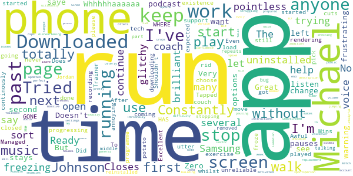

# One You Couch to 5K
App version ``7.6.1``

Analyzed with [covid-apps-observer](http://github.com/covid-apps-observer) project, version ``0.1``

## App overview
| | |
|-------------------------|-------------------------| 
| **Name**&nbsp;&nbsp;&nbsp;&nbsp;&nbsp;&nbsp;&nbsp;&nbsp;&nbsp;&nbsp;&nbsp;&nbsp;&nbsp;&nbsp;&nbsp;&nbsp;&nbsp;&nbsp;&nbsp;&nbsp;&nbsp;&nbsp;&nbsp;&nbsp;&nbsp;&nbsp;&nbsp;&nbsp;&nbsp;&nbsp;&nbsp;&nbsp;&nbsp;&nbsp;&nbsp;&nbsp;&nbsp;&nbsp;&nbsp;&nbsp;  | One You Couch to 5K |
| **Unique identifier** | com.phe.couchto5K |
| **Link to Google Play** | [https://play.google.com/store/apps/details?id=com.phe.couchto5K](https://play.google.com/store/apps/details?id=com.phe.couchto5K) |
| **Summary**  | The FREE Couch to 5K app. We’ll take you from couch to 5k hero in just 9 weeks! |
| **Privacy policy** | [https://www.nhs.uk/oneyou/privacy-policy](https://www.nhs.uk/oneyou/privacy-policy) |
| **Latest version** | 7.6.1 |
| **Last update** | 2021-03-29 19:15:26 |
| **Recent changes** | This release contain improvements to the design and layout with a few additions including tips and animations. |
| **Installs**  | 1,000,000+ |
| **Category** | Health & Fitness |
| **First release** | Mar 5, 2016 |
| **Size**  | 27M |
| **Supported Android version**  | 5.0 and up |

### Description
> It’s an easy to follow programme known the world over, and perfect for those new to running and need some extra support and motivation along the way.
 The app features a choice of 4 great trainers to support and motivate you at every step of the way, telling you when to run and when to walk, from comedians Sarah Millican and Sanjeev Kohli, BBC presenter Jo Whiley, and our very own Laura, who have now helped over 2 million people like you start their own running journeys.
 Couch to 5K features:
 • A flexible programme that can be completed in as little as 9 weeks, or longer if you want to go at your own pace
 • Easy to follow countdown timer so you can see and well as hear how long you’ve got left of each run
 • Works alongside your preferred music player, automatically 'dipping' the volumes so you can hear the instructions and motivations from your chosen trainer
 • Offers timely tips and motivations to keep you on your fitness journey
 • Signals a half-time bell when you get half way, so you know when to head home!
 • Lets you track your progress and awards achievements as you move through the runs
 • Connects you with likeminded people through the Couch to 5k HealthUnlocked community forums and Facebook groups. 
 Millions of people have already got running with theCouch to 5k plan, now it’s your turn!
 Download this app, get off the couch and we’ll help you reach your health goals.

### User interface
The developers of the app provide the following screenshots in the Google play store.
| | | |
|:-------------------------:|:-------------------------:|:-------------------------:|
 |   |   |   | 
 |   |   |   | 
 |   |  

## Development team
In the following we report the main information provided by the development team in the Google play store.

| | |
|-------------------------|-------------------------|
| **Developer**  | Public Health England Digital |
| **Website**  | [https://www.nhs.uk/oneyou/moving](https://www.nhs.uk/oneyou/moving) |
| **Email** | oneyou@phe.gov.uk |
| **Physical address**  | - |
| **Other developed apps**  | [https://play.google.com/store/apps/developer?id=Public+Health+England+Digital](https://play.google.com/store/apps/developer?id=Public+Health+England+Digital) |

## Android support

| | |
|-------------------------|-------------------------|
| **Declared target Android version**  | Android10, version 10 (API level 29) |
| **Effective target Android version**  | Android10, version 10 (API level 29) |
| **Minimum supported Android version**  | Lollipop, version 5.0 (API level 21) |
| **Maximum target Android version**  | - |

The larger the difference between the minimum and maximum supported Android versions, the better. A larger difference means a wider audience. For example, old phones have a very low Android version, so a high minimum supported Android version means that the app cannot be used by users with old phones, thus leading to accessibility problems. 

## Requested permissions

In the following we report the complete list of the permissions requested by the app. 

| **Permission** | **Protection level** | **Description** | 
|-------------------------|-------------------------|-------------------------|
 **android.permission ACCESS_COARSE_LOCATION** | :warning:**Dangerous** | Allows an app to access approximate location. 
 **android.permission ACCESS_NETWORK_STATE** | Normal | Allows applications to access information about networks. 
 **android.permission BLUETOOTH** | Normal | Allows applications to connect to paired bluetooth devices. 
 **android.permission BLUETOOTH_ADMIN** | Normal | Allows applications to discover and pair bluetooth devices. 
 **android.permission INTERNET** | Normal | Allows applications to open network sockets. 
 **android.permission WAKE_LOCK** | Normal | Allows using PowerManager WakeLocks to keep processor from sleeping or screen from dimming. 
 **android.permission WRITE_EXTERNAL_STORAGE** | :warning:**Dangerous** | Allows an application to write to external storage. 
 **com.android.alarm.permission SET_ALARM** | Normal | Allows an application to broadcast an Intent to set an alarm for the user. 
 **com.google.android.finsky.permission BIND_GET_INSTALL_REFERRER_SERVICE** | - | - 

## Mentioned servers

| **Server** | **Registrant** | **Registrant country** | **Creation date** | 
|-------------------------|-------------------------|-------------------------|-------------------------|
 | adobe.com | Adobe Inc. | :us: US | 1986-11-17 05:00:00 |
 | googlesyndication.com | Google LLC | :us: US | 2003-01-21 06:17:24 |
 | google.com | Google LLC | :us: US | 1997-09-15 04:00:00 |
 | google-analytics.com | Google LLC | :us: US | 2005-07-18 19:24:32 |
 | app-measurement.com | Google LLC | :us: US | 2015-06-19 20:13:31 |
 | googletagmanager.com | Google LLC | :us: US | 2011-11-11 23:39:05 |
 | paragon-cc.co.uk | - | - | 2017-04-04 00:00:00 |
 | bbc.co.uk | - | - | 1996-08-01 00:00:00 |
 | df-phe.com | DOGFI.SH Mobile | GB | 2015-06-16 14:57:16 |
 | phedigital.co.uk | - | - | 2018-06-06 00:00:00 |
 | youtube.com | Google LLC | :us: US | 2005-02-15 05:13:12 |
 | crashlytics.com | Google LLC | :us: US | 2011-01-21 15:30:40 |
 | tealiumiq.com | Whois Privacy Service | :us: US | 2011-02-09 18:33:06 |
 | googleapis.com | Google LLC | :us: US | 2005-01-25 17:52:26 |
 | googleadservices.com | Google LLC | :us: US | 2003-06-19 16:34:53 |
 | nhs.uk | Department of Health | - | 1996-08-01 00:00:00 |
 | healthunlocked.com | Everything Unlocked Ltd | GB | 2008-05-04 18:31:28 |

## Security analysis 

Below we report the main security warnings raised by our execution of the [Androwarn](https://github.com/maaaaz/androwarn) security analysis tool.

**Telephony identifiers leakage**
> - This application reads the ISO country code equivalent of the current registered operator's MCC (Mobile Country Code) 
> - This application reads the MCC+MNC of the provider of the SIM 
> - This application reads the numeric name (MCC+MNC) of current registered operator 
> - This application reads the operator name 

**Connection interfaces exfiltration**
> - This application reads details about the currently active data network 
> - This application tries to find out if the currently active data network is metered 

**Suspicious connection establishment**
> - This application opens a Socket and connects it to the remote address ' returned no addresses for  ; port is out of range' on the 'N/A' port  
> - This application opens a Socket and connects it to the remote address '' on the 'N/A' port  
> - This application opens a Socket and connects it to the remote address 'Ljava/lang/StringBuilder;->toString()Ljava/lang/String;' on the 'N/A' port  
> - This application opens a Socket and connects it to the remote address 'Ljava/net/Proxy;->type()Ljava/net/Proxy$Type;' on the 'N/A' port  
> - This application opens a Socket and connects it to the remote address 'timeout' on the 'N/A' port  

## User ratings and reviews

Below we provide information about how end users are reacting to the app in terms of ratings and reviews in the Google Play store.

### Ratings

The One You Couch to 5K app has been installed by more than **1000000** times. At this time, **33534** rated the app and its average score is **4.7511835**. Below we show the distribution of the ratings across the usual star-based rating of Google Play

:star::star::star::star::star:: 27691

:star::star::star::star:: 4415

:star::star::star:: 734

:star::star:: 317

:star:: 377

### Reviews 

#### 5-star reviews

> Excellent, I love the encouragement. Thank you  :date: __2021-04-12 14:22:43__

> Does exactly what it states, great introduction to running  :date: __2021-04-12 14:11:05__

> Got me from couch to 5k gradually and supportively.  :date: __2021-04-12 12:21:10__

> Brilliant, lots of tips and encouragement  :date: __2021-04-12 11:44:11__

> Great app that gradually builds your running time over a number of weeks. When I first started running I didn't think I would get to the end but "trust in the process" and you'll get there too.  :date: __2021-04-12 11:25:16__

> I swear by it. Amazing!  :date: __2021-04-12 09:40:54__

> Amazing to work from helped my confidence in many ways and my fitness level  :date: __2021-04-11 22:13:54__

> 😁  :date: __2021-04-11 21:42:07__

> Great! Easy to use and for someone who hates running, I have found this a great way to build my strength and stamina and keep myself motivated.  :date: __2021-04-11 20:31:42__

> App keeps crashing. THts only problem. Changed the settings & Al that  :date: __2021-04-11 20:16:19__

#### 4-star reviews

> Does what it says  :date: __2021-04-12 17:39:50__

> Great app to motivate the most novice of runners like me!! Once I worked out the settings to stop the app turning off in the background it really is fab!  :date: __2021-04-12 10:38:32__

> It is really good, before using this app, I didn't have any interest in running, however every time I start a day, it crashes my phone either half way through or at the end which then won't save the progress. And it also causes my Phone to power off which is really off putting.  :date: __2021-04-11 22:18:25__

> I do love this app, its very inspiring. Although I would like more talking during running periods to keep me going.  :date: __2021-04-11 09:33:48__

> This app worked to get me running from nothing to 30mins non stop.  :date: __2021-04-10 13:49:14__

> Great app for apple phones but unfortunately I'm still having problems on my android although I've followed your recommendations.  :date: __2021-04-10 08:40:22__

> So far, so good. It seems to be working. Just completed week 3 and I am still alive 😀  :date: __2021-04-08 10:43:55__

> Great way to start for complete novice.  :date: __2021-04-08 00:19:01__

> Great introduction to running  :date: __2021-04-07 10:53:58__

> Fantastic app, easy to use. Only problem is with the app shutting down on the 5 minute cool down walk so that i can't save the run once finished.  :date: __2021-04-06 20:26:42__

#### 3-star reviews

> Like the app, super easy and helps push you to the goal. However, it is highly irritating that certain people haven't recorded every run so you find yourself swapping around.  :date: __2021-04-11 23:14:11__

> This app has given up on me at week 7 Run 3!!!!!! Help!!!!! What can I do to solve this issue?  :date: __2021-04-11 19:54:32__

> It is Good but suffers many bugs. Overall, I am finding it a great app. But the bugs are annoying. Almost every time I start a run the audio doesn't work and I have to back out and restart. Or often the audio will not pause if you tell it to, even continuing to play after you close the run (only stopping when the app is completely closed) If they could fix the audio bugs out, this would be a perfect app for couch to 5k.  :date: __2021-04-11 12:37:21__

> Quite motivational but let down by the glitches. It sometimes stops unexpectedly. Overall getting me there 🙂  :date: __2021-04-10 10:11:02__

> Amazing app, but recent relaunch needs urgent fixes. When you start a run of you navigate away from the app (to change music or whatever) it takes you out of the run and you have to start it again. Big flaw, please fix asap please. Also sad Michael Johnson will leave as a coach. Legend.  :date: __2021-04-09 20:26:11__

> No map of run on android phone  :date: __2021-04-09 15:13:17__

> Very good guided workout. i actually went through with it. It surprised me. Important though: PLEASE please please add a button option to turn off that infernally loud sound that happens when you reach half of your run because for autistic people it's extremely painful and turning the volume down makes me unable to properly understand what the trainer is saying. Thank you kindly. Be accessible.  :date: __2021-04-08 11:36:12__

> Great App, very helpful for the unmotivated. Gently persuasive. Just a shame it's been developed by millennials who have no attention to detail and it means it's quite buggy and has repeated issues with sometimes not loading and often times your chosen narrators dialogue not working. One has to repeatedly switch trainer to get it to work. Let someone who is methodical try to fix it rather than someone with no attention span.  :date: __2021-04-03 14:41:24__

> For some reason the app will tell me to run but not tell me to stop and change to walking....  :date: __2021-03-31 10:23:21__

> Directs you to good play lists for your run but no obvious way to play them in sync with the podcast! Awkward to set up so keeps playing once you've started running and locked your phone. Spent most of my first run getting this right. Reminders don't seem to work. I'm sticking with it as it is a handy way to track how many runs you've done but there really is big room for improvement.  :date: __2021-03-30 16:24:10__

#### 2-star reviews

> Just started week 2 and the app keeps stopping mid-run.....really annoying when you need it for your run/walk timings  :date: __2021-04-12 11:00:30__

> Unfortunately even after changing settings on my phone, the app would just stop whilst on my run. Sometimes twice. I now have to listen to the poscasts.  :date: __2021-04-10 21:11:12__

> Was good the first few uses, but the last 3 runs the app has stopped multiple times so I have to restart the run or just guess when to stop jogging, it's very frustrating. I've double checked my settings and they're how they should be. Think I will end up uninstalling.  :date: __2021-03-29 13:25:48__

> For some reason, on a Pixel phone, the audio will only work when live caption is turned on...which then uses additional battery. Thought it might be an issue with the app, but tried it on an iPhone and a Motorola running Android 8, no problems there at all. Kinda embarrassing that Google's phones are having such an issue on their own app platform.  :date: __2021-03-28 19:54:24__

> Audio and availability of speakers very temperamental  :date: __2021-03-27 21:37:51__

> The concept is good, but you can tell it's a GCSE/A level student's project  :date: __2021-03-25 18:56:53__

> It keeps crashing mid run. Not very helpful!  :date: __2021-03-24 14:55:36__

> Agreeing with a lot of the criticisms already mentioned. Concept is great, but after only installing yesterday I have already encountered multiple problems. It makes my other Apps crash, rendering them unusable. The first run I went on, it paused and when I went back into the App I had to re-start the run again, fast forward and try to guess where I was up to. Also, audio is too quiet against music with no option to adjust. Will try again, but if the problem persists I will be uninstalling.  :date: __2021-03-23 17:58:58__

> Would be a fantastic app if it worked properly! Keeps closing itself, or pausing. On the plus side, I kept running for about 4 minutes before I realised 🤦‍♀️  :date: __2021-03-21 16:02:34__

> Doesn't work! I changed the setting as per their instructions and it doesn't work. It catches up if I unlock the screen, but what's the point of an app if you have to do it all manually?  :date: __2021-03-18 11:10:58__

#### 1-star reviews

> Utterly unhelpful for building confidence. Drops a massive difficulty spike in week five and offers no help for anyone struggling to keep up. Will ultimately leave anyone who can't match the pace unmotivated. A dismal and disheartening app.  :date: __2021-04-12 00:58:42__

> No audio description in the run which makes it pretty unusable and pointless. My music volume dips but there is no voiceover. Constantly checking the phone doesn't exactly work when trying to run. The timer is also very glitchy and keeps pausing and jumping. Bit of a shambles and so disappointing as so many people say it's a brilliant app (when it works)  :date: __2021-04-09 11:36:40__

> Couldn't open it on my phone ?  :date: __2021-04-06 18:19:47__

> Tried to set up app and cannot get any further than ready continue screen  :date: __2021-03-31 19:01:42__

> Keeps freezing while out running and miss times when supposed to stop and walk. Tried several times uninstalling and reinstalling and tried all the different voice coaches but same problem.  :date: __2021-03-31 16:26:44__

> Too glitchy  :date: __2021-03-29 21:30:35__

> Kept crashing. I'm waiting for the voice to tell me to stop running and nothing 😡  :date: __2021-03-25 20:59:57__

> Sound not working.  :date: __2021-03-25 10:52:34__

> Not worth the hassle. Once phone locks the app just shuts off. Uninstalled!  :date: __2021-03-24 21:37:40__

> "General bug fixes" is not a change log.  :date: __2021-03-19 08:26:29__

