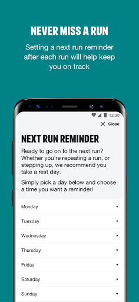
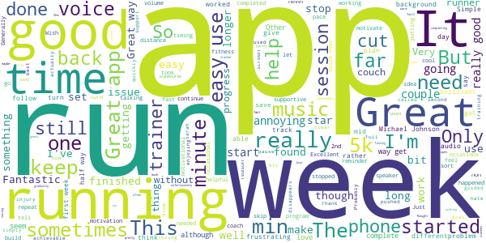
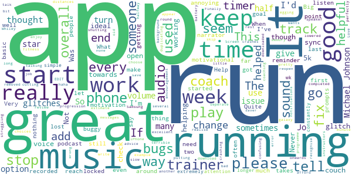

# One You Couch to 5K
App version ``7.6.1``

Analyzed with [covid-apps-observer](http://github.com/covid-apps-observer) project, version ``0.1``

## App overview
| | |
|-------------------------|-------------------------| 
| **Name**                                          | One You Couch to 5K |
| **Unique identifier** | com.phe.couchto5K |
| **Link to Google Play** | [https://play.google.com/store/apps/details?id=com.phe.couchto5K](https://play.google.com/store/apps/details?id=com.phe.couchto5K) |
| **Summary**  | The FREE Couch to 5K app. We’ll take you from couch to 5k hero in just 9 weeks! |
| **Privacy policy** | [https://www.nhs.uk/oneyou/privacy-policy](https://www.nhs.uk/oneyou/privacy-policy) |
| **Latest version** | 7.6.1 |
| **Last update** | 2021-03-29 19:15:26 |
| **Recent changes** | This release contain improvements to the design and layout with a few additions including tips and animations. |
| **Installs**  | 1,000,000+ |
| **Category** | Health & Fitness |
| **First release** | Mar 5, 2016 |
| **Size**  | 27M |
| **Supported Android version**  | 5.0 and up |

### Description
> It’s an easy to follow programme known the world over, and perfect for those new to running and need some extra support and motivation along the way.
 The app features a choice of 4 great trainers to support and motivate you at every step of the way, telling you when to run and when to walk, from comedians Sarah Millican and Sanjeev Kohli, BBC presenter Jo Whiley, and our very own Laura, who have now helped over 2 million people like you start their own running journeys.
 Couch to 5K features:
 • A flexible programme that can be completed in as little as 9 weeks, or longer if you want to go at your own pace
 • Easy to follow countdown timer so you can see and well as hear how long you’ve got left of each run
 • Works alongside your preferred music player, automatically 'dipping' the volumes so you can hear the instructions and motivations from your chosen trainer
 • Offers timely tips and motivations to keep you on your fitness journey
 • Signals a half-time bell when you get half way, so you know when to head home!
 • Lets you track your progress and awards achievements as you move through the runs
 • Connects you with likeminded people through the Couch to 5k HealthUnlocked community forums and Facebook groups. 
 Millions of people have already got running with theCouch to 5k plan, now it’s your turn!
 Download this app, get off the couch and we’ll help you reach your health goals.

### User interface
The developers of the app provide the following screenshots in the Google play store.
| | | |
|:-------------------------:|:-------------------------:|:-------------------------:|
 |   |   |   | 
 |   |   |   | 
 |   |  

## Development team
In the following we report the main information provided by the development team in the Google play store.

| | |
|-------------------------|-------------------------|
| **Developer**  | Public Health England Digital |
| **Website**  | [https://www.nhs.uk/oneyou/moving](https://www.nhs.uk/oneyou/moving) |
| **Email** | oneyou@phe.gov.uk |
| **Physical address**  | - |
| **Other developed apps**  | [https://play.google.com/store/apps/developer?id=Public+Health+England+Digital](https://play.google.com/store/apps/developer?id=Public+Health+England+Digital) |

## Android support

| | |
|-------------------------|-------------------------|
| **Declared target Android version**  | Android10, version 10 (API level 29) |
| **Effective target Android version**  | Android10, version 10 (API level 29) |
| **Minimum supported Android version**  | Lollipop, version 5.0 (API level 21) |
| **Maximum target Android version**  | - |

The larger the difference between the minimum and maximum supported Android versions, the better. A larger difference means a wider audience. For example, old phones have a very low Android version, so a high minimum supported Android version means that the app cannot be used by users with old phones, thus leading to accessibility problems. 

## Requested permissions

In the following we report the complete list of the permissions requested by the app. 

| **Permission** | **Protection level** | **Description** | 
|-------------------------|-------------------------|-------------------------|
 **android.permission ACCESS_COARSE_LOCATION** | :warning:**Dangerous** | Allows an app to access approximate location. 
 **android.permission ACCESS_NETWORK_STATE** | Normal | Allows applications to access information about networks. 
 **android.permission BLUETOOTH** | Normal | Allows applications to connect to paired bluetooth devices. 
 **android.permission BLUETOOTH_ADMIN** | Normal | Allows applications to discover and pair bluetooth devices. 
 **android.permission INTERNET** | Normal | Allows applications to open network sockets. 
 **android.permission WAKE_LOCK** | Normal | Allows using PowerManager WakeLocks to keep processor from sleeping or screen from dimming. 
 **android.permission WRITE_EXTERNAL_STORAGE** | :warning:**Dangerous** | Allows an application to write to external storage. 
 **com.android.alarm.permission SET_ALARM** | Normal | Allows an application to broadcast an Intent to set an alarm for the user. 
 **com.google.android.finsky.permission BIND_GET_INSTALL_REFERRER_SERVICE** | - | - 

## Mentioned servers

| **Server** | **Registrant** | **Registrant country** | **Creation date** | 
|-------------------------|-------------------------|-------------------------|-------------------------|
 | adobe.com | Adobe Inc. | :us: US | 1986-11-17 05:00:00 |
 | googlesyndication.com | Google LLC | :us: US | 2003-01-21 06:17:24 |
 | google.com | Google LLC | :us: US | 1997-09-15 04:00:00 |
 | google-analytics.com | Google LLC | :us: US | 2005-07-18 19:24:32 |
 | app-measurement.com | Google LLC | :us: US | 2015-06-19 20:13:31 |
 | googletagmanager.com | Google LLC | :us: US | 2011-11-11 23:39:05 |
 | paragon-cc.co.uk | - | - | 2017-04-04 00:00:00 |
 | bbc.co.uk | - | - | 1996-08-01 00:00:00 |
 | df-phe.com | DOGFI.SH Mobile | GB | 2015-06-16 14:57:16 |
 | phedigital.co.uk | - | - | 2018-06-06 00:00:00 |
 | youtube.com | Google LLC | :us: US | 2005-02-15 05:13:12 |
 | crashlytics.com | Google LLC | :us: US | 2011-01-21 15:30:40 |
 | tealiumiq.com | Whois Privacy Service | :us: US | 2011-02-09 18:33:06 |
 | googleapis.com | Google LLC | :us: US | 2005-01-25 17:52:26 |
 | googleadservices.com | Google LLC | :us: US | 2003-06-19 16:34:53 |
 | nhs.uk | Department of Health | - | 1996-08-01 00:00:00 |
 | healthunlocked.com | Everything Unlocked Ltd | GB | 2008-05-04 18:31:28 |

## Security analysis 

Below we report the main security warnings raised by our execution of the [Androwarn](https://github.com/maaaaz/androwarn) security analysis tool.

**Telephony identifiers leakage**
> - This application reads the ISO country code equivalent of the current registered operator's MCC (Mobile Country Code) 
> - This application reads the MCC+MNC of the provider of the SIM 
> - This application reads the numeric name (MCC+MNC) of current registered operator 
> - This application reads the operator name 

**Connection interfaces exfiltration**
> - This application reads details about the currently active data network 
> - This application tries to find out if the currently active data network is metered 

**Suspicious connection establishment**
> - This application opens a Socket and connects it to the remote address ' returned no addresses for  ; port is out of range' on the 'N/A' port  
> - This application opens a Socket and connects it to the remote address '' on the 'N/A' port  
> - This application opens a Socket and connects it to the remote address 'Ljava/lang/StringBuilder;->toString()Ljava/lang/String;' on the 'N/A' port  
> - This application opens a Socket and connects it to the remote address 'Ljava/net/Proxy;->type()Ljava/net/Proxy$Type;' on the 'N/A' port  
> - This application opens a Socket and connects it to the remote address 'timeout' on the 'N/A' port  

## User ratings and reviews

Below we provide information about how end users are reacting to the app in terms of ratings and reviews in the Google Play store.

### Ratings

The One You Couch to 5K app has been installed by more than **1000000** times. At this time, **33534** rated the app and its average score is **4.7511835**. Below we show the distribution of the ratings across the usual star-based rating of Google Play

:star::star::star::star::star:: 27691

:star::star::star::star:: 4415

:star::star::star:: 734

:star::star:: 317

:star:: 377

### Reviews 

#### 5-star reviews

> Never thought I could run 5K, this got me there in manageable chunks. Now running regularly and enjoying the increased fitness.  :date: __2021-05-22 14:25:35__

> Helped me improve fitness 😊  :date: __2021-05-22 13:27:05__

> I never run ever before, thanks to that app I managed to run for 30 minutes without stopping. The app features are really easy to use and give good advice for beginner runners. The coach voices make such a different and it motivates you throughout your progress. I would definitely recommend to use it.  :date: __2021-05-22 12:45:54__

> Good  :date: __2021-05-22 12:11:09__

> It's taken me a long time to start and gett out running, this has been so much better than trying to do it by myself. Thank you Sarah Millican for your help 😊😆😊  :date: __2021-05-22 11:52:09__

> Incredible idea. A simple to follow plan that allows people to begin a journey of fitness that they might've considered impossible prior. I'd recommend it to anyone who is willing and able to attempt, the effort you put in is worth the rewards you get out. App is simple to use, and works incredibly well alongside your own music to seamlessly blend together.  :date: __2021-05-22 11:33:03__

> Does the job and got me off the couch. Week 4 here we come!  :date: __2021-05-22 10:50:08__

> It works... just completed the programme, moving to consolidation. Re used last three weeks after injury  :date: __2021-05-22 10:24:30__

> Just completed the couch to 5k. Feeling over the moon. Can't believe that I, the ultimate couch potato, achieved this. I am a runner now and loving it😊  :date: __2021-05-22 09:27:51__

> Great, hard at first, but by the end I really enjoyed each session  :date: __2021-05-21 23:17:43__

#### 4-star reviews

> Minor issues with automatic music control (often changing the volume too late or for too long) otherwise great way to get into (or back into) running.  :date: __2021-05-22 14:24:01__

> Great app. Very motivational. Only improvement I would suggest, I would love to see it have trackers/music attached to it. Ideally you need 3 apps open at the same time, numerous occasions you get so caught up with one, you lose the others.. nothing more frustrating than completing the run and it not saving on the tracker!  :date: __2021-05-21 09:55:15__

> Loving the app so far, but am finding it's not logging all of my runs- so having to repeat Run 1 of Week 2 again- hoping it's a one-off but mildly frustrating having to go back again!  :date: __2021-05-21 03:48:32__

> When it works it's great but it's much too easy to pause or exit it mid run which is very annoying.  :date: __2021-05-20 23:37:48__

> Like the reminder feature, and Michael Johnson is great!  :date: __2021-05-20 13:21:55__

> So good to have a familiar voice supporting on this journey  :date: __2021-05-19 00:10:57__

> So easy to follow and succeed!  :date: __2021-05-16 22:09:55__

> Easy to use, with our without glasses.  :date: __2021-05-15 08:33:11__

> Great app and really helps build stamina pretty quickly. Would be 5 stars except that it crashes mid session at least once per session (usually during the warm up or 1st run)  :date: __2021-05-14 14:17:50__

> It's good but seems to have a flaw where it doesn't count all my runs. So I have to do 4 runs each "week" {this actually makes it more than a week) for it to count 3! I'm on week 4 now and this has happened in weeks 2,3 and 4. I don't think it happened in week 1. But no-one else in the reviews has complained about this so maybe use just me! I guess it won't hurt I'll just complete the program more gradually than everyone else.  :date: __2021-05-14 12:09:53__

#### 3-star reviews

> Works perfectly on an iPhone, pretty terrible on a Samsung galaxy.  :date: __2021-05-12 03:34:32__

> It's great it tells you what to do but not so great you can't play music in the background, even with the options it gives you, it stops when the speaker starts talking.  :date: __2021-05-01 15:42:44__

> The instructors talk far too much. It's not a podcast.  :date: __2021-04-30 18:14:37__

> Good overall app but it sometimes crashes halfway through a run so you have to make up the rest of your run as an estimate. I am also now struggling to open the app up as I write this review. When the app works it is really good but overall seems a little bit buggy  :date: __2021-04-30 14:51:37__

> Great app to keep you on track running and helping reach goals. Would be 5 star but for the week 6 runs, the first two seem to be round the wrong way and from week 6 onwards, none of the runs save at the end and the app doesn't seem to recognise I've started. So I start the app and go running, then if I go to reopen the app during the run it wants me to start again but the prompts and notifications still sound. So if you do start again you get the prompts duplicating which is confusing!  :date: __2021-04-28 18:54:59__

> It's really helpful, there aren't many options for the trainers. It is slow to download but there are great choices for times. You also get a reminder which is also good for someone like me who has bad memory and no motivation.  :date: __2021-04-27 13:13:17__

> Love Jo Whiley coaching, she is so motivational, but the app turns itself off towards the end of most runs! Screen is locked and it is nothing to do with battery saver  :date: __2021-04-26 21:44:36__

> App has a glitch from week 4. The voice is out of sync with the timer which is really off putting and have to check the timer while running. If I open another app for example to change my music this app stops working and have to start the run again and skip to where I was. Not ideal while running. Would be a great app if it didn't have bugs  :date: __2021-04-18 00:28:38__

> So downloaded this app and used it with music on my old phone. Used Jo as my coach as she sounds sincere. New phone now cant listen to Jo & music- it says "can't use music with this trainer". Use Laura, got my music but no marker for half way through to turn around- guessing. Why is it so random and variable???  :date: __2021-04-17 20:14:29__

> Great Idea! Very basic, app need work. Issues include: Volume of narrator is very low compared to other apps at the same phone volume level so I can't play music while trying to listen to instructions. Silent running for me. Not intuitive and I consistant, on the last day week two second to last run is the only time Sanjeev does not tell me to start running. Pointless celebrity Voices, they all say the exact same thing... What's the point? I genuinely thought they had recorded it for someone.  :date: __2021-04-15 08:23:54__

#### 2-star reviews

> The voice of the coach is not in sync with my music from Spotify. Long periods of time where the coach isn't speaking and the volume dipped during this period. Conversley, the music is at full volume whilst the coach is speaking. This was from week one. Its quite distracting and would like it fixed, else is a good app.  :date: __2021-05-16 00:46:37__

> Brilliant idea, poor execution. The app is crashing, which results in resetting the day/run progress and second instance somehow running in background, still playing comments.  :date: __2021-05-13 14:11:52__

> Is there any settings to stop the app from not working when the phone screen is off?  :date: __2021-04-26 10:30:31__

> This is an excellent programme that gets you running and in much better shape. I have completed the full programme twice now. The biggest flaw is that there is no follow-on plan. So after couch-to-5k I did 5k-to-couch! Update: reducing to 2 stars because regrettably the excellent trainer Michael Johnson is being removed. Update2: thank you for the reply. Please add a trainer like Michael who is minimalist and has gravitas.  :date: __2021-04-23 12:00:39__

> Can confirm on my Pixel 3 phone runs will only work when Lice Captioning is on. Timer won't count down so cant do runs without it on. Strange Even after recent update. Still doing it  :date: __2021-04-21 16:40:03__

> So far I have seen my fitness build using the program however the app is quite buggy. The most annoying bug is that once I have hit start run if I switch to a different app e.g. music player, the audio continues but the timer within the app stops completely meaning at the end of my run I have to skip through the whole process because if I start it again then I get 2 sets of trainer audio at different times.  :date: __2021-04-14 12:23:00__

> The programme is good but I wish there were different versions to listen to for each of the week's three runs...I don't want to hear the same tips three times, especially when they interrupt my podcast! But more annoying is the fact that the app keeps silently crashing which completely messes up the workout.  :date: __2021-04-14 09:16:09__

> Overall the App works OK. But now I'm on the end of week 6 at 25mins of running, the App decided to NOT save that run. In the previous build it automatically prompted to save the run without worrying about losing the run record. Sadly the "new improvements" have broken it. And there is no automatic save prompt. Not great!! Please fix.  :date: __2021-04-13 09:53:37__

> Just started week 2 and the app keeps stopping mid-run.....really annoying when you need it for your run/walk timings  :date: __2021-04-12 11:00:30__

> Unfortunately even after changing settings on my phone, the app would just stop whilst on my run. Sometimes twice. I now have to listen to the poscasts.  :date: __2021-04-10 21:11:12__

#### 1-star reviews

> Downloaded 3 times but app freezing at the "let's get started" page. To tech support to sort it out!  :date: __2021-05-20 21:49:04__

> Did run 1. Tapped on run 2 the next time, but played run 1. Managed to get it to play run 2, but only recording that I've done the first run!  :date: __2021-05-20 00:01:32__

> After downloading the app... the app wouldn't move past the "Ready" screen. Even for me as an utter couch potato expected that I was going have to do some sort of exercise!  :date: __2021-05-18 21:05:43__

> WHERE HAS MICHAEL JOHNSON GONE?!!!  :date: __2021-05-15 11:25:44__

> Closes down when in use very annoying when your trying to run 11/05/2021 still closes down never closed down on my Samsung phone  :date: __2021-05-11 18:59:01__

> Excellent programme to get you running.  :date: __2021-05-10 11:54:58__

> Downloaded several times but can't get past the 'let's get started' page. I have now uninstalled it.  :date: __2021-05-07 17:51:51__

> Does not load past pick your coach  :date: __2021-05-06 13:51:55__

> Shouldn't have got rid of Michael as a Trainer  :date: __2021-05-04 20:08:33__

> I've downloaded the app on my Samsung phone but cannot get past the screen that says choose you coach, it's just froze on that, can anyone help please .  :date: __2021-05-03 13:51:18__

