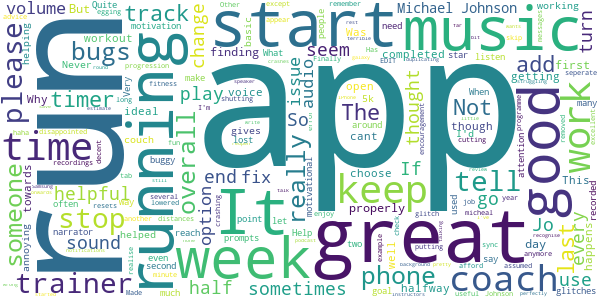

# One You Couch to 5K
App version ``7.6.2``

Analyzed with [covid-apps-observer](http://github.com/covid-apps-observer) project, version ``0.1``

## App overview
| | |
|-------------------------|-------------------------| 
| **Name**                                          | One You Couch to 5K |
| **Unique identifier** | com.phe.couchto5K |
| **Link to Google Play** | [https://play.google.com/store/apps/details?id=com.phe.couchto5K](https://play.google.com/store/apps/details?id=com.phe.couchto5K) |
| **Summary**  | The FREE Couch to 5K app. We’ll take you from couch to 5k hero in just 9 weeks! |
| **Privacy policy** | [https://www.nhs.uk/oneyou/privacy-policy](https://www.nhs.uk/oneyou/privacy-policy) |
| **Latest version** | 7.6.2 |
| **Last update** | 2021-06-10 11:58:51 |
| **Recent changes** | This release contain improvements to the design and layout with a few additions including tips and animations. |
| **Installs**  | 1,000,000+ |
| **Category** | Health & Fitness |
| **First release** | Mar 5, 2016 |
| **Size**  | 27M |
| **Supported Android version**  | 5.0 and up |

### Description
> It’s an easy to follow programme known the world over, and perfect for those new to running and need some extra support and motivation along the way.
 The app features a choice of 4 great trainers to support and motivate you at every step of the way, telling you when to run and when to walk, from comedians Sarah Millican and Sanjeev Kohli, BBC presenter Jo Whiley, and our very own Laura, who have now helped over 2 million people like you start their own running journeys.
 Couch to 5K features:
 • A flexible programme that can be completed in as little as 9 weeks, or longer if you want to go at your own pace
 • Easy to follow countdown timer so you can see and well as hear how long you’ve got left of each run
 • Works alongside your preferred music player, automatically 'dipping' the volumes so you can hear the instructions and motivations from your chosen trainer
 • Offers timely tips and motivations to keep you on your fitness journey
 • Signals a half-time bell when you get half way, so you know when to head home!
 • Lets you track your progress and awards achievements as you move through the runs
 • Connects you with likeminded people through the Couch to 5k HealthUnlocked community forums and Facebook groups. 
 Millions of people have already got running with theCouch to 5k plan, now it’s your turn!
 Download this app, get off the couch and we’ll help you reach your health goals.

### User interface
The developers of the app provide the following screenshots in the Google play store.
| | | |
|:-------------------------:|:-------------------------:|:-------------------------:|
 |   |   |   | 
 |   |   |   | 
 |   |  

## Development team
In the following we report the main information provided by the development team in the Google play store.

| | |
|-------------------------|-------------------------|
| **Developer**  | Public Health England Digital |
| **Website**  | [https://www.nhs.uk/oneyou/moving](https://www.nhs.uk/oneyou/moving) |
| **Email** | oneyou@phe.gov.uk |
| **Physical address**  | - |
| **Other developed apps**  | [https://play.google.com/store/apps/developer?id=Public+Health+England+Digital](https://play.google.com/store/apps/developer?id=Public+Health+England+Digital) |

## Android support

| | |
|-------------------------|-------------------------|
| **Declared target Android version**  | - |
| **Effective target Android version**  | - |
| **Minimum supported Android version**  | Lollipop, version 5.0 (API level 21) |
| **Maximum target Android version**  | - |

The larger the difference between the minimum and maximum supported Android versions, the better. A larger difference means a wider audience. For example, old phones have a very low Android version, so a high minimum supported Android version means that the app cannot be used by users with old phones, thus leading to accessibility problems. 

## Requested permissions

In the following we report the complete list of the permissions requested by the app. 

| **Permission** | **Protection level** | **Description** | 
|-------------------------|-------------------------|-------------------------|
 **android.permission ACCESS_COARSE_LOCATION** | :warning:**Dangerous** | Allows an app to access approximate location. 
 **android.permission ACCESS_NETWORK_STATE** | Normal | Allows applications to access information about networks. 
 **android.permission BLUETOOTH** | Normal | Allows applications to connect to paired bluetooth devices. 
 **android.permission BLUETOOTH_ADMIN** | Normal | Allows applications to discover and pair bluetooth devices. 
 **android.permission INTERNET** | Normal | Allows applications to open network sockets. 
 **android.permission WAKE_LOCK** | Normal | Allows using PowerManager WakeLocks to keep processor from sleeping or screen from dimming. 
 **com.android.alarm.permission SET_ALARM** | Normal | Allows an application to broadcast an Intent to set an alarm for the user. 
 **com.google.android.c2dm.permission RECEIVE** | - | - 
 **com.google.android.finsky.permission BIND_GET_INSTALL_REFERRER_SERVICE** | - | - 

## Mentioned servers

| **Server** | **Registrant** | **Registrant country** | **Creation date** | 
|-------------------------|-------------------------|-------------------------|-------------------------|
 | adobe.com | Adobe Inc. | :us: US | 1986-11-17 05:00:00 |
 | googlesyndication.com | Google LLC | :us: US | 2003-01-21 06:17:24 |
 | google.com | Google LLC | :us: US | 1997-09-15 04:00:00 |
 | google-analytics.com | Google LLC | :us: US | 2005-07-18 19:24:32 |
 | app-measurement.com | Google LLC | :us: US | 2015-06-19 20:13:31 |
 | googletagmanager.com | Google LLC | :us: US | 2011-11-11 23:39:05 |
 | crashlytics.com | Google LLC | :us: US | 2011-01-21 15:30:40 |
 | googleapis.com | Google LLC | :us: US | 2005-01-25 17:52:26 |
 | googleadservices.com | Google LLC | :us: US | 2003-06-19 16:34:53 |
 | phedigital.co.uk | - | - | 2018-06-06 00:00:00 |
 | paragon-cc.co.uk | - | - | 2017-04-04 00:00:00 |
 | youtube.com | Google LLC | :us: US | 2005-02-15 05:13:12 |
 | nhs.uk | Department of Health | - | 1996-08-01 00:00:00 |
 | tealiumiq.com | Whois Privacy Service | :us: US | 2011-02-09 18:33:06 |

## Security analysis 

Below we report the main security warnings raised by our execution of the [Androwarn](https://github.com/maaaaz/androwarn) security analysis tool.

**Telephony identifiers leakage**
> - This application reads the ISO country code equivalent of the current registered operator's MCC (Mobile Country Code) 
> - This application reads the MCC+MNC of the provider of the SIM 
> - This application reads the numeric name (MCC+MNC) of current registered operator 
> - This application reads the operator name 

**Connection interfaces exfiltration**
> - This application reads details about the currently active data network 
> - This application tries to find out if the currently active data network is metered 

**Suspicious connection establishment**
> - This application opens a Socket and connects it to the remote address ' returned no addresses for  ; port is out of range' on the 'N/A' port  
> - This application opens a Socket and connects it to the remote address '' on the 'N/A' port  
> - This application opens a Socket and connects it to the remote address 'Ljava/lang/StringBuilder;->toString()Ljava/lang/String;' on the 'N/A' port  
> - This application opens a Socket and connects it to the remote address 'Ljava/net/Proxy;->type()Ljava/net/Proxy$Type;' on the 'N/A' port  
> - This application opens a Socket and connects it to the remote address 'timeout' on the 'N/A' port  

## User ratings and reviews

Below we provide information about how end users are reacting to the app in terms of ratings and reviews in the Google Play store.

### Ratings

The One You Couch to 5K app has been installed by more than **1000000** times. At this time, **34723** rated the app and its average score is **4.757889**. Below we show the distribution of the ratings across the usual star-based rating of Google Play

:star::star::star::star::star:: 29087

:star::star::star::star:: 4183

:star::star::star:: 677

:star::star:: 239

:star:: 537

### Reviews 

#### 5-star reviews

> Great way to get back into running at 64 after knee ops and tendonopathy's etc and not running for over 6 years. Very gentle runs that increase gradually. Fab and the commentary us great and the feature to use my own music. That was a must.  :date: __2021-06-27 20:38:06__

> Fantastic app. I'm over 40 and in 5 weeks I can run for 20min! Try it, you will be surprised and proud of yourself.  :date: __2021-06-27 19:13:44__

> Very helpful  :date: __2021-06-27 12:02:56__

> Great app to get back running  :date: __2021-06-27 11:27:32__

> easy to use. and shows progress well. also nice to have music and extra tips available.  :date: __2021-06-27 11:18:04__

> Fabulous system that gets you moving in a very graduated gentle way  :date: __2021-06-27 10:58:22__

> Loved every minute!  :date: __2021-06-27 00:52:44__

> Very positive and motivational. Love Sanjeev Kholi's voice keeping me going!  :date: __2021-06-27 00:36:25__

> I really found this incredibly helpful. For me, the increase in pace each week worked just right. However if it hadn't, I always knew I could just redo a previous week. I really recommend this  :date: __2021-06-26 21:07:11__

> Never thought I would be able to run. Thanks to C25K I now can.  :date: __2021-06-26 12:02:36__

#### 4-star reviews

> I have found this app very helpful to get me started running. A friend recommended it and I am making a lot more progress than I had been, increasing my time running in a gradual way. There are links to YouTube videos with other running tips and stretches as well. It would help if the voice reminded you to do your stretches before starting the actual run and at the end too. It is shown in writing on the app, but once your phone is in your running belt, you don't see it!  :date: __2021-06-27 11:34:17__

> Highly recommended Crashed sometimes and run would reset sometimes but the program is extremely well done  :date: __2021-06-26 22:15:33__

> Working for me at 55 yes old  :date: __2021-06-26 13:23:01__

> It's easy to follow and did with a familiar voice. But annoying that the text is repeated on multiple runs on same week so can be confusing where you're up to.  :date: __2021-06-24 15:04:28__

> Good  :date: __2021-06-23 11:29:43__

> Great way to start your 5k journey. Love the coaches, they have really helped motivate me and the whole programme has been designed well. Super for beginners to the running world.  :date: __2021-06-23 07:03:17__

> Something has got me off the settee, can't believe how running can be so hard after not doing any for 25yrs. Sarah will keep me going though.  :date: __2021-06-22 20:15:28__

> The program is really nice. The app however, contains a few bugs. - I have lost some runs on this app. This happens if I open another app after I start my run and send the app to background. My guess is android kills the app, but the sound service stays alive, so I can still listen to what my coach says but the app is not in tracking state. - If you select Jo, on week 3, mid run, it fails to release/grab audio focus on time, which means overlapping sound of audiobook and trainer. Bad experience.  :date: __2021-06-22 17:53:05__

> Of course there could be improvements and it could be intuitive but it's a free app, and for what it is it's great  :date: __2021-06-22 10:42:17__

> Good useful app but crashes on my phone  :date: __2021-06-21 22:18:29__

#### 3-star reviews

> A decent app, well Made except it resets your run if you tab out for more than a few seconds. Not fun if it happens halfway into a workout. Other than that, it's good.  :date: __2021-06-23 18:35:41__

> This app would be great if it didn't keep cutting out several times during your run! I have to add a seperate timer to keep track of how long I'm running for which isn't ideal. The advice & encouragement is helpful though and it's great to realise your progression as the weeks add up.  :date: __2021-06-11 09:38:58__

> Was great but now keeps shutting down towards the end of my run  :date: __2021-06-06 17:15:17__

> App has a glitch from week 4. The voice is out of sync with the timer which is really off putting and have to check the timer while running. If I open another app for example to change my music this app stops working and have to start the run again and skip to where I was. Not ideal while running. Would be a great app if it didn't have bugs. Finally completed the couch to 5k app, really helped me get fitness up  :date: __2021-06-02 21:33:32__

> Never thought I'd be running for these distances & times. Also never thought I'd enjoy running! App programme is excellent & having Michael Johnson egging me on helped haha. EDIT: lowered to 3 stars as you appear to have removed Michael Johnson.  :date: __2021-06-01 12:04:41__

> It does the job helping you keep track of your runs but it is annoying when you choose a trainer and it gives you error messages. If you go basic you cannot afford glitches!!  :date: __2021-05-29 15:26:33__

> Keeps crashing every minute and a half so I can't use it at all.  :date: __2021-05-26 13:53:53__

> Works perfectly on an iPhone, pretty terrible on a Samsung galaxy.  :date: __2021-05-12 03:34:32__

> It's great it tells you what to do but not so great you can't play music in the background, even with the options it gives you, it stops when the speaker starts talking.  :date: __2021-05-01 15:42:44__

> The instructors talk far too much. It's not a podcast.  :date: __2021-04-30 18:14:37__

#### 2-star reviews

> Keeps turning off half way through the run.  :date: __2021-06-23 20:37:51__

> So far on week 3 going into 4 I feel more confidence on finishing each run. I am hopeful that the next few weeks will be as positive on both my mind and body.  :date: __2021-05-25 10:47:42__

> The voice of the coach is not in sync with my music from Spotify. Long periods of time where the coach isn't speaking and the volume dipped during this period. Conversley, the music is at full volume whilst the coach is speaking. This was from week one. Its quite distracting and would like it fixed, else is a good app.  :date: __2021-05-16 00:46:37__

> Brilliant idea, poor execution. The app is crashing, which results in resetting the day/run progress and second instance somehow running in background, still playing comments.  :date: __2021-05-13 14:11:52__

> Is there any settings to stop the app from not working when the phone screen is off?  :date: __2021-04-26 10:30:31__

> This is an excellent programme that gets you running and in much better shape. I have completed the full programme twice now. The biggest flaw is that there is no follow-on plan. So after couch-to-5k I did 5k-to-couch! Update: reducing to 2 stars because regrettably the excellent trainer Michael Johnson is being removed. Update2: thank you for the reply. Please add a trainer like Michael who is minimalist and has gravitas.  :date: __2021-04-23 12:00:39__

> Can confirm on my Pixel 3 phone runs will only work when Lice Captioning is on. Timer won't count down so cant do runs without it on. Strange Even after recent update. Still doing it  :date: __2021-04-21 16:40:03__

> So far I have seen my fitness build using the program however the app is quite buggy. The most annoying bug is that once I have hit start run if I switch to a different app e.g. music player, the audio continues but the timer within the app stops completely meaning at the end of my run I have to skip through the whole process because if I start it again then I get 2 sets of trainer audio at different times.  :date: __2021-04-14 12:23:00__

> The programme is good but I wish there were different versions to listen to for each of the week's three runs...I don't want to hear the same tips three times, especially when they interrupt my podcast! But more annoying is the fact that the app keeps silently crashing which completely messes up the workout.  :date: __2021-04-14 09:16:09__

> Overall the App works OK. But now I'm on the end of week 6 at 25mins of running, the App decided to NOT save that run. In the previous build it automatically prompted to save the run without worrying about losing the run record. Sadly the "new improvements" have broken it. And there is no automatic save prompt. Not great!! Please fix.  :date: __2021-04-13 09:53:37__

#### 1-star reviews

> Everytime I open the app, as soon as I click off it to start my music, the app stops working, goes back to the start screen, but carries on talking as though the app is running?! Tried everything to solve it ans having no luck. Anyone any idea how this can be rectified?!  :date: __2021-06-20 20:59:55__

> The app keeps closing mid session  :date: __2021-06-15 10:45:35__

> App stops working or times out, even when settings are changed. Not just me, it does it on my wifes phone too. Waste of time.  :date: __2021-06-14 21:19:59__

> Constantly stops without warning. Very frustrating app.  :date: __2021-06-10 14:51:43__

> Cannot start  :date: __2021-06-10 08:54:19__

> Michael Johnson has left me. Whhhhhaaaaaa 😭😭😭😭😭😭😭😭😭😭😭😭😭😫😫😫😫😫😭😭😭😢😢😢😢😰😰😰😰🥺🥺🥺🥺🥺😭😭😭😭💩  :date: __2021-06-09 20:05:54__

> Great if you only want to listen to music. But the second you play a podcast it pauses when you start your run. Zero options to change this.  :date: __2021-06-06 11:19:45__

> Doesn't save my runs and stays on first page so I can't see how I'm progressing through the run I.e what's coming up next ? Mins walk/ run  :date: __2021-05-24 15:26:43__

> Awful app that is totally unreliable and continously cuts out whilst in use, rendering its existence totally pointless.  :date: __2021-05-24 13:10:33__

> Downloaded 3 times but app freezing at the "let's get started" page. To tech support to sort it out!  :date: __2021-05-20 21:49:04__

