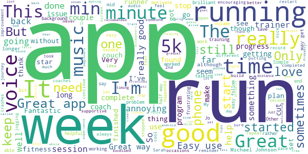
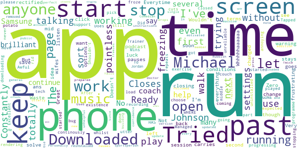

# One You Couch to 5K
App version ``7.6.2``

Analyzed with [covid-apps-observer](http://github.com/covid-apps-observer) project, version ``0.1``

## App overview
| | |
|-------------------------|-------------------------| 
| **Name**                                          | One You Couch to 5K |
| **Unique identifier** | com.phe.couchto5K |
| **Link to Google Play** | [https://play.google.com/store/apps/details?id=com.phe.couchto5K](https://play.google.com/store/apps/details?id=com.phe.couchto5K) |
| **Summary**  | The FREE Couch to 5K app. We’ll take you from couch to 5k hero in just 9 weeks! |
| **Privacy policy** | [https://www.nhs.uk/oneyou/privacy-policy](https://www.nhs.uk/oneyou/privacy-policy) |
| **Latest version** | 7.6.2 |
| **Last update** | 2021-06-10 11:58:51 |
| **Recent changes** | This release contain improvements to the design and layout with a few additions including tips and animations. |
| **Installs**  | 1,000,000+ |
| **Category** | Health & Fitness |
| **First release** | Mar 5, 2016 |
| **Size**  | 27M |
| **Supported Android version**  | 5.0 and up |

### Description
> It’s an easy to follow programme known the world over, and perfect for those new to running and need some extra support and motivation along the way.
 The app features a choice of 4 great trainers to support and motivate you at every step of the way, telling you when to run and when to walk, from comedians Sarah Millican and Sanjeev Kohli, BBC presenter Jo Whiley, and our very own Laura, who have now helped over 2 million people like you start their own running journeys.
 Couch to 5K features:
 • A flexible programme that can be completed in as little as 9 weeks, or longer if you want to go at your own pace
 • Easy to follow countdown timer so you can see and well as hear how long you’ve got left of each run
 • Works alongside your preferred music player, automatically 'dipping' the volumes so you can hear the instructions and motivations from your chosen trainer
 • Offers timely tips and motivations to keep you on your fitness journey
 • Signals a half-time bell when you get half way, so you know when to head home!
 • Lets you track your progress and awards achievements as you move through the runs
 • Connects you with likeminded people through the Couch to 5k HealthUnlocked community forums and Facebook groups. 
 Millions of people have already got running with theCouch to 5k plan, now it’s your turn!
 Download this app, get off the couch and we’ll help you reach your health goals.

### User interface
The developers of the app provide the following screenshots in the Google play store.
| | | |
|:-------------------------:|:-------------------------:|:-------------------------:|
 |   |   |   | 
 |   |   |   | 
 |   |  

## Development team
In the following we report the main information provided by the development team in the Google play store.

| | |
|-------------------------|-------------------------|
| **Developer**  | Public Health England Digital |
| **Website**  | [https://www.nhs.uk/oneyou/moving](https://www.nhs.uk/oneyou/moving) |
| **Email** | oneyou@phe.gov.uk |
| **Physical address**  | - |
| **Other developed apps**  | [https://play.google.com/store/apps/developer?id=Public+Health+England+Digital](https://play.google.com/store/apps/developer?id=Public+Health+England+Digital) |

## Android support

| | |
|-------------------------|-------------------------|
| **Declared target Android version**  | - |
| **Effective target Android version**  | - |
| **Minimum supported Android version**  | Lollipop, version 5.0 (API level 21) |
| **Maximum target Android version**  | - |

The larger the difference between the minimum and maximum supported Android versions, the better. A larger difference means a wider audience. For example, old phones have a very low Android version, so a high minimum supported Android version means that the app cannot be used by users with old phones, thus leading to accessibility problems. 

## Requested permissions

In the following we report the complete list of the permissions requested by the app. 

| **Permission** | **Protection level** | **Description** | 
|-------------------------|-------------------------|-------------------------|
 **android.permission ACCESS_COARSE_LOCATION** | :warning:**Dangerous** | Allows an app to access approximate location. 
 **android.permission ACCESS_NETWORK_STATE** | Normal | Allows applications to access information about networks. 
 **android.permission BLUETOOTH** | Normal | Allows applications to connect to paired bluetooth devices. 
 **android.permission BLUETOOTH_ADMIN** | Normal | Allows applications to discover and pair bluetooth devices. 
 **android.permission INTERNET** | Normal | Allows applications to open network sockets. 
 **android.permission WAKE_LOCK** | Normal | Allows using PowerManager WakeLocks to keep processor from sleeping or screen from dimming. 
 **com.android.alarm.permission SET_ALARM** | Normal | Allows an application to broadcast an Intent to set an alarm for the user. 
 **com.google.android.c2dm.permission RECEIVE** | - | - 
 **com.google.android.finsky.permission BIND_GET_INSTALL_REFERRER_SERVICE** | - | - 

## Mentioned servers

| **Server** | **Registrant** | **Registrant country** | **Creation date** | 
|-------------------------|-------------------------|-------------------------|-------------------------|
 | adobe.com | Adobe Inc. | :us: US | 1986-11-17 05:00:00 |
 | googlesyndication.com | Google LLC | :us: US | 2003-01-21 06:17:24 |
 | google.com | Google LLC | :us: US | 1997-09-15 04:00:00 |
 | google-analytics.com | Google LLC | :us: US | 2005-07-18 19:24:32 |
 | app-measurement.com | Google LLC | :us: US | 2015-06-19 20:13:31 |
 | googletagmanager.com | Google LLC | :us: US | 2011-11-11 23:39:05 |
 | crashlytics.com | Google LLC | :us: US | 2011-01-21 15:30:40 |
 | googleapis.com | Google LLC | :us: US | 2005-01-25 17:52:26 |
 | googleadservices.com | Google LLC | :us: US | 2003-06-19 16:34:53 |
 | phedigital.co.uk | - | - | 2018-06-06 00:00:00 |
 | paragon-cc.co.uk | - | - | 2017-04-04 00:00:00 |
 | youtube.com | Google LLC | :us: US | 2005-02-15 05:13:12 |
 | nhs.uk | Department of Health | - | 1996-08-01 00:00:00 |
 | tealiumiq.com | Whois Privacy Service | :us: US | 2011-02-09 18:33:06 |

## Security analysis 

Below we report the main security warnings raised by our execution of the [Androwarn](https://github.com/maaaaz/androwarn) security analysis tool.

**Telephony identifiers leakage**
> - This application reads the ISO country code equivalent of the current registered operator's MCC (Mobile Country Code) 
> - This application reads the MCC+MNC of the provider of the SIM 
> - This application reads the numeric name (MCC+MNC) of current registered operator 
> - This application reads the operator name 

**Connection interfaces exfiltration**
> - This application reads details about the currently active data network 
> - This application tries to find out if the currently active data network is metered 

**Suspicious connection establishment**
> - This application opens a Socket and connects it to the remote address ' returned no addresses for  ; port is out of range' on the 'N/A' port  
> - This application opens a Socket and connects it to the remote address '' on the 'N/A' port  
> - This application opens a Socket and connects it to the remote address 'Ljava/lang/StringBuilder;->toString()Ljava/lang/String;' on the 'N/A' port  
> - This application opens a Socket and connects it to the remote address 'Ljava/net/Proxy;->type()Ljava/net/Proxy$Type;' on the 'N/A' port  
> - This application opens a Socket and connects it to the remote address 'timeout' on the 'N/A' port  

## User ratings and reviews

Below we provide information about how end users are reacting to the app in terms of ratings and reviews in the Google Play store.

### Ratings

The One You Couch to 5K app has been installed by more than **1000000** times. At this time, **34723** rated the app and its average score is **4.757889**. Below we show the distribution of the ratings across the usual star-based rating of Google Play

:star::star::star::star::star:: 29087

:star::star::star::star:: 4183

:star::star::star:: 677

:star::star:: 239

:star:: 537

### Reviews 

#### 5-star reviews

> It was hard at times, but I feel so good to have completed it.  :date: __2021-07-04 15:20:38__

> Loving it. Surprising myself. If you fail a run just do it again the next time. Completed  :date: __2021-07-04 13:34:26__

> Never would have made it with out the structure and support of this app  :date: __2021-07-04 12:03:23__

> Only issue is sometimes when opening app when running the timer will reset but the original timeline will still run in background I.e. 30 minute run with 5 minuts left open app and it'll start again from 30 minutes but 5 minutes later will say run complete so not too much of an issue  :date: __2021-07-04 11:49:41__

> Excellent  :date: __2021-07-04 11:06:59__

> very good help me alot 🙂👍😊  :date: __2021-07-04 10:42:43__

> Great app and would recommend it  :date: __2021-07-04 10:39:55__

> Nothing has encouraged me more than c25k . Love it  :date: __2021-07-04 09:03:35__

> perfect app  :date: __2021-07-03 23:29:08__

> Fantastic app; have been able to continue my 5k runs due to it  :date: __2021-07-03 17:55:59__

#### 4-star reviews

> The training plan is really good and builds up your fitness more each week. However I have a problem with the app that it keeps crashing several times during my run and I have to restart it.  :date: __2021-07-04 06:59:16__

> love it!!!  :date: __2021-07-03 06:37:18__

> Brilliant free app would be nice if it tracked how far you had ran/walk  :date: __2021-07-01 19:44:27__

> Liking the app and its helping. But the coach's voice volume doesn't always go above the music so can't always hear the instructions. Is there anything I can do to solve this?  :date: __2021-06-30 19:54:08__

> I love Jo Wiley coaching me ❤️❤️❤️  :date: __2021-06-30 18:00:32__

> I went from unmotivated and exhausted after 60 seconds jogging, to jogging for 30 minutes solid. I still don't enjoy 'running' and yet I got to the end of the challenge, so what more can you ask? Only complaint is the references to 5k throughout. It's 30 minutes. I can run 4k in that time and that's not exceptionally bad.  :date: __2021-06-29 08:42:28__

> I have found this app very helpful to get me started running. A friend recommended it and I am making a lot more progress than I had been, increasing my time running in a gradual way. There are links to YouTube videos with other running tips and stretches as well. It would help if the voice reminded you to do your stretches before starting the actual run and at the end too. It is shown in writing on the app, but once your phone is in your running belt, you don't see it!  :date: __2021-06-27 11:34:17__

> Highly recommended Crashed sometimes and run would reset sometimes but the program is extremely well done  :date: __2021-06-26 22:15:33__

> Working for me at 55 yes old  :date: __2021-06-26 13:23:01__

> It's easy to follow and did with a familiar voice. But annoying that the text is repeated on multiple runs on same week so can be confusing where you're up to.  :date: __2021-06-24 15:04:28__

#### 3-star reviews

> Has been very useful, was disappointed that all the recordings assumed it was the first day of each week.  :date: __2021-07-03 17:02:01__

> A good app when it works properly. But have been finding it stops before I have completed the run.  :date: __2021-07-03 14:23:02__

> I remember getting this app last year. Why cant i choose micheal johnson as my coach anymore.  :date: __2021-07-03 02:02:02__

> A decent app, well Made except it resets your run if you tab out for more than a few seconds. Not fun if it happens halfway into a workout. Other than that, it's good.  :date: __2021-06-23 18:35:41__

> This app would be great if it didn't keep cutting out several times during your run! I have to add a seperate timer to keep track of how long I'm running for which isn't ideal. The advice & encouragement is helpful though and it's great to realise your progression as the weeks add up.  :date: __2021-06-11 09:38:58__

> Was great but now keeps shutting down towards the end of my run  :date: __2021-06-06 17:15:17__

> App has a glitch from week 4. The voice is out of sync with the timer which is really off putting and have to check the timer while running. If I open another app for example to change my music this app stops working and have to start the run again and skip to where I was. Not ideal while running. Would be a great app if it didn't have bugs. Finally completed the couch to 5k app, really helped me get fitness up  :date: __2021-06-02 21:33:32__

> Never thought I'd be running for these distances & times. Also never thought I'd enjoy running! App programme is excellent & having Michael Johnson egging me on helped haha. EDIT: lowered to 3 stars as you appear to have removed Michael Johnson.  :date: __2021-06-01 12:04:41__

> It does the job helping you keep track of your runs but it is annoying when you choose a trainer and it gives you error messages. If you go basic you cannot afford glitches!!  :date: __2021-05-29 15:26:33__

> Keeps crashing every minute and a half so I can't use it at all.  :date: __2021-05-26 13:53:53__

#### 2-star reviews

> Has only worked twice for me and that's after I deleted and reinstalled it several times and tried with different trainers. Very glitchy gets stuck after you press play. It is brilliant when it works. I have a Google pixel 3xl so going to try and find another app.  :date: __2021-07-03 14:12:00__

> Good app and a great structure to follow in building up your stamina. However, for some reason after a while runs were no Ionger being recorded.  :date: __2021-06-30 19:09:41__

> Avoid if you have an android. It's very glitchy.  :date: __2021-06-28 22:49:10__

> Keeps turning off half way through the run.  :date: __2021-06-23 20:37:51__

> So far on week 3 going into 4 I feel more confidence on finishing each run. I am hopeful that the next few weeks will be as positive on both my mind and body.  :date: __2021-05-25 10:47:42__

> The voice of the coach is not in sync with my music from Spotify. Long periods of time where the coach isn't speaking and the volume dipped during this period. Conversley, the music is at full volume whilst the coach is speaking. This was from week one. Its quite distracting and would like it fixed, else is a good app.  :date: __2021-05-16 00:46:37__

> Brilliant idea, poor execution. The app is crashing, which results in resetting the day/run progress and second instance somehow running in background, still playing comments.  :date: __2021-05-13 14:11:52__

> Is there any settings to stop the app from not working when the phone screen is off?  :date: __2021-04-26 10:30:31__

> This is an excellent programme that gets you running and in much better shape. I have completed the full programme twice now. The biggest flaw is that there is no follow-on plan. So after couch-to-5k I did 5k-to-couch! Update: reducing to 2 stars because regrettably the excellent trainer Michael Johnson is being removed. Update2: thank you for the reply. Please add a trainer like Michael who is minimalist and has gravitas.  :date: __2021-04-23 12:00:39__

> Can confirm on my Pixel 3 phone runs will only work when Lice Captioning is on. Timer won't count down so cant do runs without it on. Strange Even after recent update. Still doing it  :date: __2021-04-21 16:40:03__

#### 1-star reviews

> Wouldn't let me past terms and conditions  :date: __2021-06-28 08:53:28__

> Everytime I open the app, as soon as I click off it to start my music, the app stops working, goes back to the start screen, but carries on talking as though the app is running?! Tried everything to solve it ans having no luck. Anyone any idea how this can be rectified?!  :date: __2021-06-20 20:59:55__

> The app keeps closing mid session  :date: __2021-06-15 10:45:35__

> App stops working or times out, even when settings are changed. Not just me, it does it on my wifes phone too. Waste of time.  :date: __2021-06-14 21:19:59__

> Constantly stops without warning. Very frustrating app.  :date: __2021-06-10 14:51:43__

> Cannot start  :date: __2021-06-10 08:54:19__

> Michael Johnson has left me. Whhhhhaaaaaa 😭😭😭😭😭😭😭😭😭😭😭😭😭😫😫😫😫😫😭😭😭😢😢😢😢😰😰😰😰🥺🥺🥺🥺🥺😭😭😭😭💩  :date: __2021-06-09 20:05:54__

> Great if you only want to listen to music. But the second you play a podcast it pauses when you start your run. Zero options to change this.  :date: __2021-06-06 11:19:45__

> Doesn't save my runs and stays on first page so I can't see how I'm progressing through the run I.e what's coming up next ? Mins walk/ run  :date: __2021-05-24 15:26:43__

> Awful app that is totally unreliable and continously cuts out whilst in use, rendering its existence totally pointless.  :date: __2021-05-24 13:10:33__

