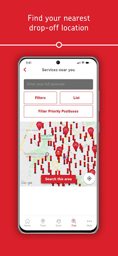
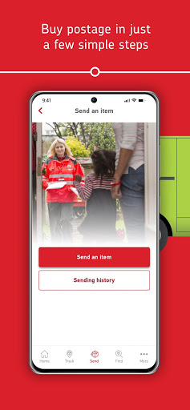
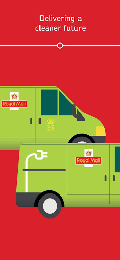
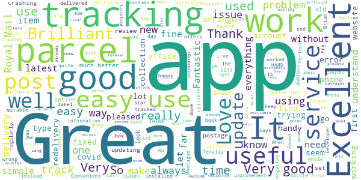
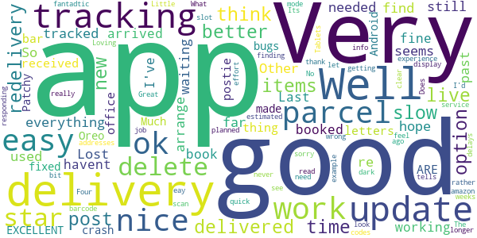
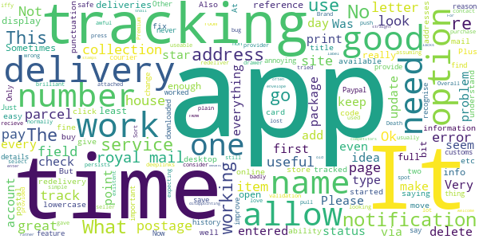
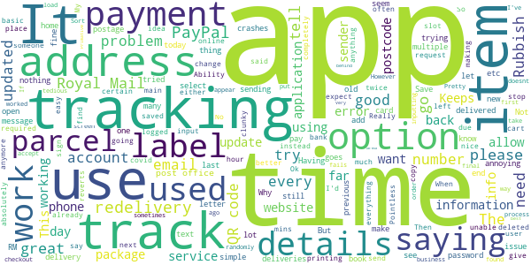
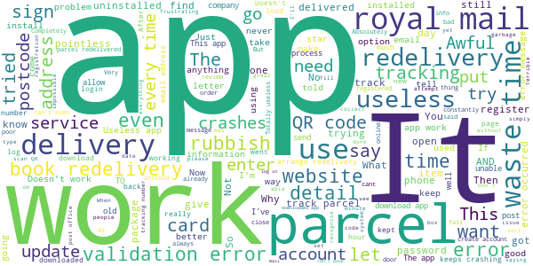

# Royal Mail - Tracking, redelivery, prices
App version ``6.0.1``

Analyzed with [covid-apps-observer](http://github.com/covid-apps-observer) project, version ``0.1``

## App overview
| | |
|-------------------------|-------------------------| 
| **Name**&nbsp;&nbsp;&nbsp;&nbsp;&nbsp;&nbsp;&nbsp;&nbsp;&nbsp;&nbsp;&nbsp;&nbsp;&nbsp;&nbsp;&nbsp;&nbsp;&nbsp;&nbsp;&nbsp;&nbsp;&nbsp;&nbsp;&nbsp;&nbsp;&nbsp;&nbsp;&nbsp;&nbsp;&nbsp;&nbsp;&nbsp;&nbsp;&nbsp;&nbsp;&nbsp;&nbsp;&nbsp;&nbsp;&nbsp;&nbsp;  | Royal Mail - Tracking, redelivery, prices |
| **Unique identifier** | com.royalmail.app.droid |
| **Link to Google Play** | [https://play.google.com/store/apps/details?id=com.royalmail.app.droid](https://play.google.com/store/apps/details?id=com.royalmail.app.droid) |
| **Summary**  | Easily manage your items and track your deliveries |
| **Privacy policy** | [https://www.royalmail.com/privacy-notice](https://www.royalmail.com/privacy-notice) |
| **Latest version** | 6.0.1 |
| **Last update** | 2020-11-19 13:20:27 |
| **Recent changes** | This latest release includes bug fixes and performance updates. |
| **Installs**  | 500,000+ |
| **Category** | Lifestyle |
| **First release** | Sep 4, 2018 |
| **Size**  | 73M |
| **Supported Android version**  | 8.0 and up |

### Description
> 📦📦📦 With the Royal Mail App, you can:
 • Send an item - quickly and easily buy postage in just a few steps. You can print your labels at home or take the QR code on the app to a Royal Mail Customer Service Point/Delivery Office and we’ll print the label for you when you drop off your item.
 • Find your nearest drop off location - Postbox, Parcel Postbox, Post Office branch or Royal Mail Customer Service Point.
 • Track your items – just enter your tracking ID number or scan the barcode to check the progress of your deliveries (available with Royal Mail Tracked and Royal Mail Special Delivery Guaranteed items)
 • Find the size and format of your parcel using the Augmented Reality Parcel Sizer guide. Available with AR supported devices.
 •	Change your delivery options to suit you – You can now change where your parcel is delivered, to a Safeplace or neighbour after it has been sent. (available with Royal Mail Tracked items)
 •	Get proof of postage sent straight to your phone – get that extra peace of mind when dropping of at any of our locations (including our 24/7 Parcel Postboxes)
 • Postcode and address finder – if you’re not sure of a full address, or want to check a postcode, just enter part of the address and we’ll fill in the blanks
 • Find any Post Office locations or Customer Service Point/Delivery Office to print your label or drop off your item, with opening hours, address, map, available services and directions
 • Receive push notifications on your deliveries - never miss a delivery update
 • Save items you are tracking, and add an alias name making them easier to identify 
 • See a photograph of the signature if someone has signed for it, or the Safeplace an item has been delivered to
 • Book a Redelivery – if you’ve missed an item you can easily book a Redelivery to your address, your neighbour’s address or a local Post Office – and specify a delivery day
 • Save postage receipts – simply take a photo of your receipt and store it to the app
 • Track an item on the go - if you have Alexa, you can track your delivery by saying an alias name you have previously assigned to an item

### User interface
The developers of the app provide the following screenshots in the Google play store.
| | | |
|:-------------------------:|:-------------------------:|:-------------------------:|
 |   |   |   | 
 |   |   |   | 
 |  

## Development team
In the following we report the main information provided by the development team in the Google play store.

| | |
|-------------------------|-------------------------|
| **Developer**  | Royal Mail Group |
| **Website**  | [https://www.royalmail.com](https://www.royalmail.com) |
| **Email** | appfeedback@royalmail.com |
| **Physical address**  | - |
| **Other developed apps**  | [https://play.google.com/store/apps/developer?id=Royal+Mail+Group](https://play.google.com/store/apps/developer?id=Royal+Mail+Group) |

## Android support

| | |
|-------------------------|-------------------------|
| **Declared target Android version**  | - |
| **Effective target Android version**  | - |
| **Minimum supported Android version**  | Oreo, version 8.0.0 (API level 26) |
| **Maximum target Android version**  | - |

The larger the difference between the minimum and maximum supported Android versions, the better. A larger difference means a wider audience. For example, old phones have a very low Android version, so a high minimum supported Android version means that the app cannot be used by users with old phones, thus leading to accessibility problems. 

## Requested permissions

In the following we report the complete list of the permissions requested by the app. 

| **Permission** | **Protection level** | **Description** | 
|-------------------------|-------------------------|-------------------------|
 **android.permission ACCESS_FINE_LOCATION** | :warning:**Dangerous** | Allows an app to access precise location. 
 **android.permission ACCESS_NETWORK_STATE** | Normal | Allows applications to access information about networks. 
 **android.permission CAMERA** | :warning:**Dangerous** | Required to be able to access the camera device. 
 **android.permission INTERNET** | Normal | Allows applications to open network sockets. 
 **android.permission RECEIVE_BOOT_COMPLETED** | Normal | Allows an application to receive the Intent.ACTION_BOOT_COMPLETED that is broadcast after the system finishes booting. 
 **android.permission WAKE_LOCK** | Normal | Allows using PowerManager WakeLocks to keep processor from sleeping or screen from dimming. 
 **android.permission WRITE_EXTERNAL_STORAGE** | :warning:**Dangerous** | Allows an application to write to external storage. 
 **com.google.android.c2dm.permission RECEIVE** | - | - 
 **com.royalmail.app.droid.permission MAPS_RECEIVE** | - | - 

## Mentioned servers

| **Server** | **Registrant** | **Registrant country** | **Creation date** | 
|-------------------------|-------------------------|-------------------------|-------------------------|
 | google.com | Google LLC | :us: US | 1997-09-15 04:00:00 |
 | microsoft.com | Microsoft Corporation | :us: US | 1991-05-02 04:00:00 |
 | tealiumiq.com | Whois Privacy Service | :us: US | 2011-02-09 18:33:06 |
 | googleapis.com | Google LLC | :us: US | 2005-01-25 17:52:26 |

## Security analysis 

Below we report the main security warnings raised by our execution of the [Androwarn](https://github.com/maaaaz/androwarn) security analysis tool.

**Telephony identifiers leakage**
> - This application reads the ISO country code equivalent of the current registered operator's MCC (Mobile Country Code) 
> - This application reads the numeric name (MCC+MNC) of current registered operator 
> - This application reads the operator name 

**Connection interfaces exfiltration**
> - This application reads details about the currently active data network 
> - This application tries to find out if the currently active data network is metered 

**Suspicious connection establishment**
> - This application opens a Socket and connects it to the remote address '' on the 'N/A' port  
> - This application opens a Socket and connects it to the remote address 'Ljava/lang/StringBuilder;->toString()Ljava/lang/String;' on the 'N/A' port  
> - This application opens a Socket and connects it to the remote address 'Ljava/net/Proxy;->type()Ljava/net/Proxy$Type;' on the 'N/A' port  
> - This application opens a Socket and connects it to the remote address 'timeout' on the 'N/A' port  

**Code execution**
> - This application loads a native library 
> - This application loads a native library: 'arcore_sdk_jni' 
> - This application loads a native library: 'arsceneview_jni' 
> - This application loads a native library: 'filament-jni' 
> - This application loads a native library: 'mono-native' 
> - This application loads a native library: 'monodroid' 
> - This application loads a native library: 'monosgen-2.0' 
> - This application loads a native library: 'xamarin-app' 
> - This application loads a native library: 'xamarin-debug-app-helper' 

## User ratings and reviews

Below we provide information about how end users are reacting to the app in terms of ratings and reviews in the Google Play store.

### Ratings

The Royal Mail - Tracking, redelivery, prices app has been installed by more than **500000** times. At this time, **2751** rated the app and its average score is **2.0981817**. Below we show the distribution of the ratings across the usual star-based rating of Google Play

:star::star::star::star::star:: 580

:star::star::star::star:: 130

:star::star::star:: 90

:star::star:: 130

:star:: 1821

### Reviews 

#### 5-star reviews

> Very Good App  :date: __2020-11-19 17:14:06__

> Great  :date: __2020-11-16 11:50:10__

> Good  :date: __2020-11-16 01:02:03__

> I THINK IT IS GREAT THANK YOU ROYAL MAIL YOUR DOING A AWESOME HARD JOB STAY SAFE  :date: __2020-11-14 15:10:30__

> Had first requested redelivery.Found difficult to find without app.And in Covid mode extremely lengthy process arranging services like redelivery for inform aged real pergatory!  :date: __2020-11-11 00:14:10__

> \*\*" EDIT\*\** well what a fab turn around with the app.... Over the moon how much better it works now, updates are second to none.... Really pleased with the app now!!! 5* What a joke, trying to make an account up and type in email.. And it doubles the words when trying to spell it out wont let me delete and tracking down 😡 NOT happy with R.M  :date: __2020-11-10 08:48:18__

> Convenient  :date: __2020-11-09 00:02:29__

> 👍☑️  :date: __2020-11-07 22:53:11__

> Love my app, makes tracking etc simple. Clear menus, easy to follow.  :date: __2020-11-06 19:09:15__

> So handy  :date: __2020-11-03 14:20:58__

#### 4-star reviews

> Easy to arrange re-delivery of parcels.  :date: __2020-11-17 21:07:07__

> Well I used app for a redelivery and still waiting for parcel, its 20 past 6, I live in hope. Other than that app seems to be working ok.  :date: __2020-11-07 19:18:29__

> Last few times I've re booked delivery.they havent arrived and had to re book again.  :date: __2020-10-06 14:49:54__

> works fine  :date: __2020-10-04 15:07:40__

> Well I haven't received any thing from you bar letters but I think the post office and the postie's ARE EXCELLENT  :date: __2020-10-03 14:57:01__

> Patchy  :date: __2020-10-01 11:30:23__

> Much better since the bugs that made it crash on Android Oreo were fixed  :date: __2020-09-24 08:35:09__

> Ok  :date: __2020-09-16 00:31:29__

> Very good experience.  :date: __2020-09-15 08:34:59__

> Works well again after update, thank you. Little bit slow responding and the tracking is not planned well but I can live with that.  :date: __2020-09-10 21:05:17__

#### 3-star reviews

> Good app love you can name deliveries, however when you recieve a push notification and pull down your notification drawer usually there isn't enough room to display the full notification so I press on it assuming it will open the app and display the notification in full but it doesn't it just opens the app normally and the notification is lost. Otherwise a great app.  :date: __2020-11-21 09:40:21__

> A bit iffy. Sometimes info is spot on, other times non existent, or plain wrong. Not really good enough for what they consider to be a Premium Brand. Sort yourselves out!  :date: __2020-11-20 11:01:26__

> Overall a very good service  :date: __2020-11-17 17:21:54__

> The first time I used this app it was awful and I gave up, it's now at least useable, but still needs a lot of work  :date: __2020-11-14 13:18:20__

> App is useful by some bug. The tracking pages need looking at badly  :date: __2020-11-13 19:39:37__

> Please allow the option to reference name a parcel/tracking number provided by a seller, even before it has a status attached.  :date: __2020-11-03 15:49:49__

> 3 * because I have tried to get a redelivery for a item and it won't allow me to redeliver keeps saying "validation error if this persists contact the site provider" brilliant idea but whats all that about?  :date: __2020-10-31 15:50:42__

> No collection service option. Was expecting to purchase my postage and select a collection in one simple app. But no, the new parcel collection service doesn't seem to be available as it is on the desktop site. Very disappointing as their competitors make it so easy.  :date: __2020-10-26 21:57:33__

> I don't use snail mail very often so don't buy stamps. For me this app is very welcome since it means not having to go online to buy postage. What it lacks and needs is the ability to print straight to an envelope rather than a label (their old service had this). It would be good if it could store your information so that you do not have to enter it each time. So good start Royal Mail now develop it further  :date: __2020-10-17 17:46:24__

> This app is generally useful but has two flaws. It doesn't remember your name and address, so every single time I print postage for a letter I have to re-type my it. Plus the need for a title when I only know someone's forename and surname is frustrating.  :date: __2020-10-16 14:13:11__

#### 2-star reviews

> Really good idea but be so careful when printing out labels.....the app tends to hold onto the last label bought so you may end up sending the item to the wrong person as I did  :date: __2020-11-17 21:38:40__

> I have received text messages from you saying that my parcel is due today at a certain time, and it's showing me that it has been delivered today, but i don't have any parcel, so can someone tell me what is going on with my parcel please, thanks. Mr. Edmond Cairns. EH65EW  :date: __2020-11-15 03:27:13__

> No tracking updates, no option to saved details, no copy and paste option.  :date: __2020-11-09 13:00:55__

> Keeps saying error messages when performing basic functions. Uninstall!  :date: __2020-11-08 11:50:51__

> This app stresses me out lol  :date: __2020-11-06 12:42:20__

> You should add options for our tracking items where it should be if we're not at home. For example , where should we leave your package? In the shed etc.  :date: __2020-10-31 04:04:45__

> Want too much info and password setting is a joke  :date: __2020-10-30 00:09:31__

> Ok to track parcels, completely useless to alter delivery. Tried it twice so far, both times the request was ignored and I was bombarded with texts and e-mails advising me parcels couldn't be delivered on the day I'd already said to not deliver on. Then had to rebook the already rebooked delivery as the original request had been deleted! The app looks nice and is easy to use. Shame it seems to have absolutely no use other than that.  :date: __2020-10-29 21:08:28__

> Why does RM require one to sign up just for tracking a simple item? I don't see the point of making an account with RM app for such a simple thing. RM needs to change this feature on their app wherein you can track status of an item without having to sign up / log in  :date: __2020-10-27 11:51:31__

> Validation error trying to book redelivery.  :date: __2020-10-26 23:43:57__

#### 1-star reviews

> Added details address password etc etc then get a message "error, sorry we are unable to deal with your request ". No next step or reason why or what to do next.  :date: __2020-11-23 10:16:34__

> Awful waste of time why not just let me simply arrange a re-delivery on the website instead I have to go through account set up on the app only for it not to work!  :date: __2020-11-23 09:56:56__

> Worthless. First off why do I need a app to book a redelivery. Secondly why do I need a app to book a delivery that can't even work.  :date: __2020-11-22 21:30:42__

> Absolutely shocking that an app of this quality has been released by Royal Mail. This would fail as a GCSE Computing project, it is that bad.  :date: __2020-11-22 17:14:12__

> Utter rubbish. Complete waste of time.  :date: __2020-11-22 10:28:18__

> Absolutely Rubbish, constant error message trying to book a redelivery.  :date: __2020-11-21 21:06:47__

> Terrible, wanted to pick up a parcel I missed while at work, went after work the next day since Google and their website said they were open but no. After calling them THE ONLY WAY TO TELL IF THEY WERE OPEN WAS BY DOWNLOADING THE APP SIGHNING UP AND CHECKING THAT WAY. Now I try to get onto the app again it refuses to allow me to do anything unless I go onto the website and scan a QR code. How the hell can royal mail think this is acceptable during covid, update your times on google.  :date: __2020-11-21 20:47:54__

> It's unacceptable to make you download an app to use their redelivery service. The app crashed multiple times and was very slow when trying to sort the redelivery as well so its not fit for purpose. You want people to stay home, well let them organise on the website, or at the very least get some better programmers.  :date: __2020-11-21 16:55:03__

> Don't waste your time. After you register it shows an error and you can't do anything  :date: __2020-11-21 13:57:11__

> Terrible app. No option to scan QR code. Long and pointless registration that you then can't use any of the details from to pull through for delivery and have enter it all again. What a joke!  :date: __2020-11-21 09:42:47__

