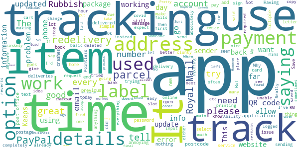

# Royal Mail - Tracking, redelivery, prices
App version ``6.0.2``

Analyzed with [covid-apps-observer](http://github.com/covid-apps-observer) project, version ``0.1``

## App overview
| | |
|-------------------------|-------------------------| 
| **Name**                                          | Royal Mail - Tracking, redelivery, prices |
| **Unique identifier** | com.royalmail.app.droid |
| **Link to Google Play** | [https://play.google.com/store/apps/details?id=com.royalmail.app.droid](https://play.google.com/store/apps/details?id=com.royalmail.app.droid) |
| **Summary**  | Easily manage your items and track your deliveries |
| **Privacy policy** | [https://www.royalmail.com/privacy-notice](https://www.royalmail.com/privacy-notice) |
| **Latest version** | 6.0.2 |
| **Last update** | 2020-12-01 14:59:42 |
| **Recent changes** | This update continues to deliver bug fixes and general performance improvements. |
| **Installs**  | 500,000+ |
| **Category** | Lifestyle |
| **First release** | Sep 4, 2018 |
| **Size**  | 54M |
| **Supported Android version**  | 8.0 and up |

### Description
> 📦📦📦 With the Royal Mail App, you can:
 • Send an item - quickly and easily buy postage in just a few steps. You can print your labels at home or take the QR code on the app to a Royal Mail Customer Service Point/Delivery Office and we’ll print the label for you when you drop off your item.
 • Find your nearest drop off location - Postbox, Parcel Postbox, Post Office branch or Royal Mail Customer Service Point.
 • Track your items – just enter your tracking ID number or scan the barcode to check the progress of your deliveries (available with Royal Mail Tracked and Royal Mail Special Delivery Guaranteed items)
 • Find the size and format of your parcel using the Augmented Reality Parcel Sizer guide. Available with AR supported devices.
 •	Change your delivery options to suit you – You can now change where your parcel is delivered, to a Safeplace or neighbour after it has been sent. (available with Royal Mail Tracked items)
 •	Get proof of postage sent straight to your phone – get that extra peace of mind when dropping of at any of our locations (including our 24/7 Parcel Postboxes)
 • Postcode and address finder – if you’re not sure of a full address, or want to check a postcode, just enter part of the address and we’ll fill in the blanks
 • Find any Post Office locations or Customer Service Point/Delivery Office to print your label or drop off your item, with opening hours, address, map, available services and directions
 • Receive push notifications on your deliveries - never miss a delivery update
 • Save items you are tracking, and add an alias name making them easier to identify 
 • See a photograph of the signature if someone has signed for it, or the Safeplace an item has been delivered to
 • Book a Redelivery – if you’ve missed an item you can easily book a Redelivery to your address, your neighbour’s address or a local Post Office – and specify a delivery day
 • Save postage receipts – simply take a photo of your receipt and store it to the app
 • Track an item on the go - if you have Alexa, you can track your delivery by saying an alias name you have previously assigned to an item

### User interface
The developers of the app provide the following screenshots in the Google play store.
| | | |
|:-------------------------:|:-------------------------:|:-------------------------:|
 |   |   |   | 
 |   |   |   | 
 |  

## Development team
In the following we report the main information provided by the development team in the Google play store.

| | |
|-------------------------|-------------------------|
| **Developer**  | Royal Mail Group |
| **Website**  | [https://www.royalmail.com](https://www.royalmail.com) |
| **Email** | appfeedback@royalmail.com |
| **Physical address**  | - |
| **Other developed apps**  | [https://play.google.com/store/apps/developer?id=Royal+Mail+Group](https://play.google.com/store/apps/developer?id=Royal+Mail+Group) |

## Android support

| | |
|-------------------------|-------------------------|
| **Declared target Android version**  | - |
| **Effective target Android version**  | - |
| **Minimum supported Android version**  | Oreo, version 8.0.0 (API level 26) |
| **Maximum target Android version**  | - |

The larger the difference between the minimum and maximum supported Android versions, the better. A larger difference means a wider audience. For example, old phones have a very low Android version, so a high minimum supported Android version means that the app cannot be used by users with old phones, thus leading to accessibility problems. 

## Requested permissions

In the following we report the complete list of the permissions requested by the app. 

| **Permission** | **Protection level** | **Description** | 
|-------------------------|-------------------------|-------------------------|
 **android.permission ACCESS_FINE_LOCATION** | :warning:**Dangerous** | Allows an app to access precise location. 
 **android.permission ACCESS_NETWORK_STATE** | Normal | Allows applications to access information about networks. 
 **android.permission CAMERA** | :warning:**Dangerous** | Required to be able to access the camera device. 
 **android.permission INTERNET** | Normal | Allows applications to open network sockets. 
 **android.permission RECEIVE_BOOT_COMPLETED** | Normal | Allows an application to receive the Intent.ACTION_BOOT_COMPLETED that is broadcast after the system finishes booting. 
 **android.permission WAKE_LOCK** | Normal | Allows using PowerManager WakeLocks to keep processor from sleeping or screen from dimming. 
 **android.permission WRITE_EXTERNAL_STORAGE** | :warning:**Dangerous** | Allows an application to write to external storage. 
 **com.google.android.c2dm.permission RECEIVE** | - | - 
 **com.royalmail.app.droid.permission MAPS_RECEIVE** | - | - 

## Mentioned servers

| **Server** | **Registrant** | **Registrant country** | **Creation date** | 
|-------------------------|-------------------------|-------------------------|-------------------------|
 | google.com | Google LLC | :us: US | 1997-09-15 04:00:00 |
 | microsoft.com | Microsoft Corporation | :us: US | 1991-05-02 04:00:00 |
 | tealiumiq.com | Whois Privacy Service | :us: US | 2011-02-09 18:33:06 |
 | googleapis.com | Google LLC | :us: US | 2005-01-25 17:52:26 |

## Security analysis 

Below we report the main security warnings raised by our execution of the [Androwarn](https://github.com/maaaaz/androwarn) security analysis tool.

**Telephony identifiers leakage**
> - This application reads the ISO country code equivalent of the current registered operator's MCC (Mobile Country Code) 
> - This application reads the numeric name (MCC+MNC) of current registered operator 
> - This application reads the operator name 

**Connection interfaces exfiltration**
> - This application reads details about the currently active data network 
> - This application tries to find out if the currently active data network is metered 

**Suspicious connection establishment**
> - This application opens a Socket and connects it to the remote address '' on the 'N/A' port  
> - This application opens a Socket and connects it to the remote address 'Ljava/lang/StringBuilder;->toString()Ljava/lang/String;' on the 'N/A' port  
> - This application opens a Socket and connects it to the remote address 'Ljava/net/Proxy;->type()Ljava/net/Proxy$Type;' on the 'N/A' port  
> - This application opens a Socket and connects it to the remote address 'timeout' on the 'N/A' port  

**Code execution**
> - This application loads a native library 
> - This application loads a native library: 'arcore_sdk_jni' 
> - This application loads a native library: 'arsceneview_jni' 
> - This application loads a native library: 'filament-jni' 
> - This application loads a native library: 'mono-native' 
> - This application loads a native library: 'monodroid' 
> - This application loads a native library: 'monosgen-2.0' 
> - This application loads a native library: 'xamarin-app' 
> - This application loads a native library: 'xamarin-debug-app-helper' 

## User ratings and reviews

Below we provide information about how end users are reacting to the app in terms of ratings and reviews in the Google Play store.

### Ratings

The Royal Mail - Tracking, redelivery, prices app has been installed by more than **500000** times. At this time, **2866** rated the app and its average score is **2.1360545**. Below we show the distribution of the ratings across the usual star-based rating of Google Play

:star::star::star::star::star:: 634

:star::star::star::star:: 146

:star::star::star:: 97

:star::star:: 87

:star:: 1902

### Reviews 

#### 5-star reviews

> Very good app and useful too  :date: __2020-12-05 17:36:08__

> Royal mail love you  :date: __2020-12-04 21:37:35__

> Very easy to use, so useful for tracking my items being delivered by royal mail.  :date: __2020-12-04 00:31:21__

> Great app thank you Royal Mail!  :date: __2020-12-03 10:00:38__

> Only ever used the app for tracking but see it does do much more. I was struggling with deleting past delivered items. Contacted support and two days later I had a remedy. Simply involve swiping right and tapping the delete that appears. Swift help.  :date: __2020-11-30 18:53:39__

> It doesn't always seem to work. No doubt I try too use it too early in the proceedings.  :date: __2020-11-27 13:30:33__

> Great app, full of useful information and easy to use.  :date: __2020-11-26 06:52:54__

> 😉🙃  :date: __2020-11-24 06:51:49__

> AP worked perfectly. I've been waiting a long time for this to become available. Already used to arrange collection for about 8 packages now and each one was collected and delivered on time. So it's goodbye Hermes forever.  :date: __2020-11-23 12:51:53__

> Great  :date: __2020-11-16 11:50:10__

#### 4-star reviews

> Excellent app, however few fixes I'd like to see. 1 After you name an item, the tracking number dissappears in the list replaced with the name. 2 allow a gap between the numbers for easier reading ie FE 1234 1234 GB 3 Allow the option to rearrange the list of items.  :date: __2020-12-05 08:29:08__

> Great until last update Used to be able to give my deliveries a meaningful name, but since yesterday's update can't do it anymore. With several deliveries on the go, it makes it difficult to see which is which. Apart from that, it's quite good  :date: __2020-12-03 15:54:52__

> If you face any problems you can't open it just change your phone's language  :date: __2020-12-03 05:39:13__

> Very good 😊. I think.  :date: __2020-11-28 07:46:14__

> Easy to arrange re-delivery of parcels.  :date: __2020-11-17 21:07:07__

> Well I used app for a redelivery and still waiting for parcel, its 20 past 6, I live in hope. Other than that app seems to be working ok.  :date: __2020-11-07 19:18:29__

> Last few times I've re booked delivery.they havent arrived and had to re book again.  :date: __2020-10-06 14:49:54__

> works fine  :date: __2020-10-04 15:07:40__

> Well I haven't received any thing from you bar letters but I think the post office and the postie's ARE EXCELLENT  :date: __2020-10-03 14:57:01__

> Patchy  :date: __2020-10-01 11:30:23__

#### 3-star reviews

> Death to deeplinks!  :date: __2020-11-28 15:17:03__

> Good app love you can name deliveries, however when you recieve a push notification and pull down your notification drawer usually there isn't enough room to display the full notification so I press on it assuming it will open the app and display the notification in full but it doesn't it just opens the app normally and the notification is lost. Otherwise a great app.  :date: __2020-11-21 09:40:21__

> A bit iffy. Sometimes info is spot on, other times non existent, or plain wrong. Not really good enough for what they consider to be a Premium Brand. Sort yourselves out!  :date: __2020-11-20 11:01:26__

> Overall a very good service  :date: __2020-11-17 17:21:54__

> The first time I used this app it was awful and I gave up, it's now at least useable, but still needs a lot of work  :date: __2020-11-14 13:18:20__

> App is useful by some bug. The tracking pages need looking at badly  :date: __2020-11-13 19:39:37__

> Please allow the option to reference name a parcel/tracking number provided by a seller, even before it has a status attached.  :date: __2020-11-03 15:49:49__

> 3 * because I have tried to get a redelivery for a item and it won't allow me to redeliver keeps saying "validation error if this persists contact the site provider" brilliant idea but whats all that about?  :date: __2020-10-31 15:50:42__

> No collection service option. Was expecting to purchase my postage and select a collection in one simple app. But no, the new parcel collection service doesn't seem to be available as it is on the desktop site. Very disappointing as their competitors make it so easy.  :date: __2020-10-26 21:57:33__

> I don't use snail mail very often so don't buy stamps. For me this app is very welcome since it means not having to go online to buy postage. What it lacks and needs is the ability to print straight to an envelope rather than a label (their old service had this). It would be good if it could store your information so that you do not have to enter it each time. So good start Royal Mail now develop it further  :date: __2020-10-17 17:46:24__

#### 2-star reviews

> Rubbish, Rubbish, Rubbish  :date: __2020-11-24 16:56:31__

> Primative at best. Very far behind in the tracking area compared to other tracking apps.  :date: __2020-11-24 03:27:27__

> Really good idea but be so careful when printing out labels.....the app tends to hold onto the last label bought so you may end up sending the item to the wrong person as I did  :date: __2020-11-17 21:38:40__

> I have received text messages from you saying that my parcel is due today at a certain time, and it's showing me that it has been delivered today, but i don't have any parcel, so can someone tell me what is going on with my parcel please, thanks. Mr. Edmond Cairns. EH65EW  :date: __2020-11-15 03:27:13__

> No tracking updates, no option to saved details, no copy and paste option.  :date: __2020-11-09 13:00:55__

> Keeps saying error messages when performing basic functions. Uninstall!  :date: __2020-11-08 11:50:51__

> This app stresses me out lol  :date: __2020-11-06 12:42:20__

> You should add options for our tracking items where it should be if we're not at home. For example , where should we leave your package? In the shed etc.  :date: __2020-10-31 04:04:45__

> Want too much info and password setting is a joke  :date: __2020-10-30 00:09:31__

> Ok to track parcels, completely useless to alter delivery. Tried it twice so far, both times the request was ignored and I was bombarded with texts and e-mails advising me parcels couldn't be delivered on the day I'd already said to not deliver on. Then had to rebook the already rebooked delivery as the original request had been deleted! The app looks nice and is easy to use. Shame it seems to have absolutely no use other than that.  :date: __2020-10-29 21:08:28__

#### 1-star reviews

> Errors out arranging redelivery, useless  :date: __2020-12-05 14:45:56__

> Just plain doesn't work. Try to register and says an error occurred. All details correct and tried several times  :date: __2020-12-05 10:46:47__

> Utterly pointless and worse than a website. Had to enter all my details to register... and then enter them again for the redelivery. Pointless and a waste of 50Mb on my phone. What are you trying to achieve with this?  :date: __2020-12-04 23:38:14__

> Absolute garbage. Have just spent half an hour trying to re-arrange delivery but without success. What is the point of having a QR code printed on the "something for you" card, if, when you scan the code, you are not taken directly to the basic details in the app?! Like other reviewers, I will just have to traipse off to the collection office.  :date: __2020-12-04 21:06:57__

> Very. Confusing  :date: __2020-12-04 18:01:16__

> Terrible service, unreliable.  :date: __2020-12-04 15:24:17__

> Terrible app you can't find out where your items are when they have missed their delivery date, all it says is they have your item. When you try to track the item constantly being asked to verify American pictures over and over again does not help either. Uninstalled.  :date: __2020-12-04 13:55:57__

> My first time using this app and I sent something to America thinking that I'd know where my friends parcel is through out the travel unfortunately it doesn't seem to be updating the tracking  :date: __2020-12-04 12:17:30__

> Uninstalled. Can log in online no problem, but not the with this app.  :date: __2020-12-04 11:43:34__

> Within 10mins had hit the wall of frustration and pointless app Just take your item to a post office which is what I'm going to do tomorrow Uninstall  :date: __2020-12-03 22:14:45__

