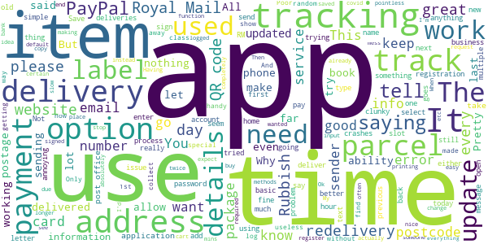

# Royal Mail - Tracking, redelivery, prices
App version ``6.0.3``

Analyzed with [covid-apps-observer](http://github.com/covid-apps-observer) project, version ``0.1``

## App overview
| | |
|-------------------------|-------------------------| 
| **Name**&nbsp;&nbsp;&nbsp;&nbsp;&nbsp;&nbsp;&nbsp;&nbsp;&nbsp;&nbsp;&nbsp;&nbsp;&nbsp;&nbsp;&nbsp;&nbsp;&nbsp;&nbsp;&nbsp;&nbsp;&nbsp;&nbsp;&nbsp;&nbsp;&nbsp;&nbsp;&nbsp;&nbsp;&nbsp;&nbsp;&nbsp;&nbsp;&nbsp;&nbsp;&nbsp;&nbsp;&nbsp;&nbsp;&nbsp;&nbsp;  | Royal Mail - Tracking, redelivery, prices |
| **Unique identifier** | com.royalmail.app.droid |
| **Link to Google Play** | [https://play.google.com/store/apps/details?id=com.royalmail.app.droid](https://play.google.com/store/apps/details?id=com.royalmail.app.droid) |
| **Summary**  | Easily manage your items and track your deliveries |
| **Privacy policy** | [https://www.royalmail.com/privacy-notice](https://www.royalmail.com/privacy-notice) |
| **Latest version** | 6.0.3 |
| **Last update** | 2020-12-07 16:06:20 |
| **Recent changes** | This release contains a range of bug fixes &amp; general performance improvements. |
| **Installs**  | 1,000,000+ |
| **Category** | Lifestyle |
| **First release** | Sep 4, 2018 |
| **Size**  | 54M |
| **Supported Android version**  | 8.0 and up |

### Description
> 📦📦📦 With the Royal Mail App, you can:
 • Send an item - quickly and easily buy postage in just a few steps. You can print your labels at home or take the QR code on the app to a Royal Mail Customer Service Point/Delivery Office and we’ll print the label for you when you drop off your item.
 • Find your nearest drop off location - Postbox, Parcel Postbox, Post Office branch or Royal Mail Customer Service Point.
 • Track your items – just enter your tracking ID number or scan the barcode to check the progress of your deliveries (available with Royal Mail Tracked and Royal Mail Special Delivery Guaranteed items)
 • Find the size and format of your parcel using the Augmented Reality Parcel Sizer guide. Available with AR supported devices.
 •	Change your delivery options to suit you – You can now change where your parcel is delivered, to a Safeplace or neighbour after it has been sent. (available with Royal Mail Tracked items)
 •	Get proof of postage sent straight to your phone – get that extra peace of mind when dropping of at any of our locations (including our 24/7 Parcel Postboxes)
 • Postcode and address finder – if you’re not sure of a full address, or want to check a postcode, just enter part of the address and we’ll fill in the blanks
 • Find any Post Office locations or Customer Service Point/Delivery Office to print your label or drop off your item, with opening hours, address, map, available services and directions
 • Receive push notifications on your deliveries - never miss a delivery update
 • Save items you are tracking, and add an alias name making them easier to identify 
 • See a photograph of the signature if someone has signed for it, or the Safeplace an item has been delivered to
 • Book a Redelivery – if you’ve missed an item you can easily book a Redelivery to your address, your neighbour’s address or a local Post Office – and specify a delivery day
 • Save postage receipts – simply take a photo of your receipt and store it to the app
 • Track an item on the go - if you have Alexa, you can track your delivery by saying an alias name you have previously assigned to an item

### User interface
The developers of the app provide the following screenshots in the Google play store.
| | | |
|:-------------------------:|:-------------------------:|:-------------------------:|
 |   |   |   | 
 |   |   |   | 
 |  

## Development team
In the following we report the main information provided by the development team in the Google play store.

| | |
|-------------------------|-------------------------|
| **Developer**  | Royal Mail Group |
| **Website**  | [https://www.royalmail.com](https://www.royalmail.com) |
| **Email** | appfeedback@royalmail.com |
| **Physical address**  | - |
| **Other developed apps**  | [https://play.google.com/store/apps/developer?id=Royal+Mail+Group](https://play.google.com/store/apps/developer?id=Royal+Mail+Group) |

## Android support

| | |
|-------------------------|-------------------------|
| **Declared target Android version**  | - |
| **Effective target Android version**  | - |
| **Minimum supported Android version**  | Oreo, version 8.0.0 (API level 26) |
| **Maximum target Android version**  | - |

The larger the difference between the minimum and maximum supported Android versions, the better. A larger difference means a wider audience. For example, old phones have a very low Android version, so a high minimum supported Android version means that the app cannot be used by users with old phones, thus leading to accessibility problems. 

## Requested permissions

In the following we report the complete list of the permissions requested by the app. 

| **Permission** | **Protection level** | **Description** | 
|-------------------------|-------------------------|-------------------------|
 **android.permission ACCESS_FINE_LOCATION** | :warning:**Dangerous** | Allows an app to access precise location. 
 **android.permission ACCESS_NETWORK_STATE** | Normal | Allows applications to access information about networks. 
 **android.permission CAMERA** | :warning:**Dangerous** | Required to be able to access the camera device. 
 **android.permission INTERNET** | Normal | Allows applications to open network sockets. 
 **android.permission RECEIVE_BOOT_COMPLETED** | Normal | Allows an application to receive the Intent.ACTION_BOOT_COMPLETED that is broadcast after the system finishes booting. 
 **android.permission WAKE_LOCK** | Normal | Allows using PowerManager WakeLocks to keep processor from sleeping or screen from dimming. 
 **android.permission WRITE_EXTERNAL_STORAGE** | :warning:**Dangerous** | Allows an application to write to external storage. 
 **com.google.android.c2dm.permission RECEIVE** | - | - 
 **com.royalmail.app.droid.permission MAPS_RECEIVE** | - | - 

## Mentioned servers

| **Server** | **Registrant** | **Registrant country** | **Creation date** | 
|-------------------------|-------------------------|-------------------------|-------------------------|
 | google.com | Google LLC | :us: US | 1997-09-15 04:00:00 |
 | microsoft.com | Microsoft Corporation | :us: US | 1991-05-02 04:00:00 |
 | tealiumiq.com | Whois Privacy Service | :us: US | 2011-02-09 18:33:06 |
 | googleapis.com | Google LLC | :us: US | 2005-01-25 17:52:26 |

## Security analysis 

Below we report the main security warnings raised by our execution of the [Androwarn](https://github.com/maaaaz/androwarn) security analysis tool.

**Telephony identifiers leakage**
> - This application reads the ISO country code equivalent of the current registered operator's MCC (Mobile Country Code) 
> - This application reads the numeric name (MCC+MNC) of current registered operator 
> - This application reads the operator name 

**Connection interfaces exfiltration**
> - This application reads details about the currently active data network 
> - This application tries to find out if the currently active data network is metered 

**Suspicious connection establishment**
> - This application opens a Socket and connects it to the remote address '' on the 'N/A' port  
> - This application opens a Socket and connects it to the remote address 'Ljava/lang/StringBuilder;->toString()Ljava/lang/String;' on the 'N/A' port  
> - This application opens a Socket and connects it to the remote address 'Ljava/net/Proxy;->type()Ljava/net/Proxy$Type;' on the 'N/A' port  
> - This application opens a Socket and connects it to the remote address 'timeout' on the 'N/A' port  

**Code execution**
> - This application loads a native library 
> - This application loads a native library: 'arcore_sdk_jni' 
> - This application loads a native library: 'arsceneview_jni' 
> - This application loads a native library: 'filament-jni' 
> - This application loads a native library: 'mono-native' 
> - This application loads a native library: 'monodroid' 
> - This application loads a native library: 'monosgen-2.0' 
> - This application loads a native library: 'xamarin-app' 
> - This application loads a native library: 'xamarin-debug-app-helper' 

## User ratings and reviews

Below we provide information about how end users are reacting to the app in terms of ratings and reviews in the Google Play store.

### Ratings

The Royal Mail - Tracking, redelivery, prices app has been installed by more than **1000000** times. At this time, **2928** rated the app and its average score is **2.2026577**. Below we show the distribution of the ratings across the usual star-based rating of Google Play

:star::star::star::star::star:: 671

:star::star::star::star:: 165

:star::star::star:: 126

:star::star:: 87

:star:: 1879

### Reviews 

#### 5-star reviews

> Very efficient, easy to use and useful. Just what royal mail has always needed.  :date: __2020-12-24 13:34:02__

> Great app!. 👍👍😁 Happy Christmas R.M.❗✝️ 🎁🎁🎁☃️⛄☃️⛄☃️☃️☃️  :date: __2020-12-24 12:29:04__

> Good  :date: __2020-12-19 21:16:58__

> Waiting for delivery  :date: __2020-12-18 05:11:22__

> Great  :date: __2020-12-15 18:30:10__

> So easy and simple to use luv it  :date: __2020-12-14 05:21:23__

> Very useful app to have plenty information and save tracking plus so much more a must have thank u R.M  :date: __2020-12-12 03:47:24__

> Very satisfied might be better if you notified us am or pm delivery. Even a 2 hour slot Thanks Rita Lea  :date: __2020-12-10 08:30:17__

> Fast hard working people  :date: __2020-12-07 18:40:22__

> Very good app and useful too  :date: __2020-12-05 17:36:08__

#### 4-star reviews

> Excellent app easy to use  :date: __2020-12-18 15:14:40__

> I did not spell my email address correctly but when I went in to amend found nowhere to edit my details  :date: __2020-12-17 14:44:41__

> I like the app. Feature request: Address book, and option to set default home address. Unless I have missed it.  :date: __2020-12-17 08:50:28__

> For buying postage, it's almost perfect. I use this to post items that I make for my Etsy page, and it's mostly really good. Will be close to a 5* for that as soon as they include international postage.  :date: __2020-12-08 02:00:45__

> Excellent app, however few fixes I'd like to see. 1 After you name an item, the tracking number dissappears in the list replaced with the name. 2 allow a gap between the numbers for easier reading ie FE 1234 1234 GB 3 Allow the option to rearrange the list of items.  :date: __2020-12-05 08:29:08__

> Great until last update Used to be able to give my deliveries a meaningful name, but since yesterday's update can't do it anymore. With several deliveries on the go, it makes it difficult to see which is which. Apart from that, it's quite good  :date: __2020-12-03 15:54:52__

> If you face any problems you can't open it just change your phone's language  :date: __2020-12-03 05:39:13__

> Very good 😊. I think.  :date: __2020-11-28 07:46:14__

> Easy to arrange re-delivery of parcels.  :date: __2020-11-17 21:07:07__

> Well I used app for a redelivery and still waiting for parcel, its 20 past 6, I live in hope. Other than that app seems to be working ok.  :date: __2020-11-07 19:18:29__

#### 3-star reviews

> Tracking nos are alpha-num and long and I can't copy from my sources. Info seems sketchy. Update... uninstalled as won't accept my password, LIKE SO MANY APPS IT JUST DEFEATS ITSELF. Bah humbug.  :date: __2020-12-25 13:09:29__

> Unresponsive  :date: __2020-12-23 13:30:00__

> My first experience started well, BUT I'd arranged for a parcel to be collected, got the notification confirming tracking ID, & specific day of collection by my USUAL POSTIE. However when the postie turned up, (luckily he had to ring the doorbell as he was also delivering a parcel) he knew nothing about the collection as nothing was logged on his PDA & he couldn't therefore scan it to track. He did however agree to take it & assured me it would be scanned back at the depot. We'll see 🤞  :date: __2020-12-21 14:46:59__

> Great Concept Good Execution annoying gap. Like everything about this app, sending from home is great, but one thing; the need to enter your address, as sender every time is really annoying. Why doesn't it remember my details? Once fixed be good if the box to copy that from sender to the invoice address was default or unnecessary. Once that's fixed including an address book, or the ability to use addresses in your contacts, or those already in my Click and Drop profile would be a great feature.  :date: __2020-12-19 06:33:51__

> The post box app is good in principle but why does it tell people the time the post was collected rather than the time of the next collection, If I were catching a train I would want to know when the next one was, not the time of the one I had missed.  :date: __2020-12-12 18:23:14__

> Death to deeplinks!  :date: __2020-11-28 15:17:03__

> Good app love you can name deliveries, however when you recieve a push notification and pull down your notification drawer usually there isn't enough room to display the full notification so I press on it assuming it will open the app and display the notification in full but it doesn't it just opens the app normally and the notification is lost. Otherwise a great app.  :date: __2020-11-21 09:40:21__

> A bit iffy. Sometimes info is spot on, other times non existent, or plain wrong. Not really good enough for what they consider to be a Premium Brand. Sort yourselves out!  :date: __2020-11-20 11:01:26__

> Overall a very good service  :date: __2020-11-17 17:21:54__

> The first time I used this app it was awful and I gave up, it's now at least useable, but still needs a lot of work  :date: __2020-11-14 13:18:20__

#### 2-star reviews

> This is the results of privatisation in app form. Doesn't even do the basics.  :date: __2020-12-26 16:01:07__

> I installed the app to get an update as to when my delivery would occur. I dont understand why the service is "deliver by 9pm" but you have no tracking ability. It's no wonder why services like heroes are used, as they let you know when they are an hour away, estimated delivery time. I wouldnt use the Royal mail if I have any choice, customers value the ability to know when the parcel will arrive, even if that's a 3 hour time slot.  :date: __2020-12-24 21:04:12__

> Desk top version much better. Why does this app insist on first name and surname when I am sending to a business?  :date: __2020-12-23 12:25:28__

> Pretty rubbish. The QR code takes you to the all, nothing else. You then need to sign up or log in and basically type all of the details from your "Something for you" card. Only then to find out you can't book a next day delivery but you can collect tomorrow. Like I said, it's pretty useless.  :date: __2020-12-22 13:39:50__

> The registration process uses "opt out" for marketing preferences. And tracking of a special delivery just says "out for delivery" Both show just how archaic Royal Mail is. 1st class stamp prices always going up but can't do anything modern nearly as effectively as competition  :date: __2020-12-22 11:26:14__

> Rubbish takes far too long to update, they don't deliver on the day that they said that they would.  :date: __2020-12-22 03:49:45__

> Poor app. Better just to use the website. The QR code just directs you to the app, I expected it to be a unique, secure and handy way to redeliver but no. I don't trust this app either. You can type anything and it will go through without error - random name, random address, made up delivery number. Means if you make a mistake inadvertently your redelivery will be delayed.  :date: __2020-12-18 11:59:14__

> I keep getting notifications saying parcels delivered when I haven't. Finding it irritating now.  :date: __2020-12-17 19:59:31__

> A tracking app that doesn't track, pointless  :date: __2020-12-15 19:18:45__

> All I wanted to do is use the Parcelbox finder. But no, you have to register, putting all your details in - and there's not even a postcode search function for your address. You shouldn't have to register unless you want to actually buy something.  :date: __2020-12-14 12:07:49__

#### 1-star reviews

> App gives false information, stated package was delivered where as it was delivered 2 days later, spent one day contacting royal mail regarding supposed missing package, TIP OF THE DAY, use DHL, DPD, Hermes or Amazon or anyone but Royal mail and this app  :date: __2020-12-28 11:15:41__

> Royal Mail say you have to download this app to search for your nearest parcel postbox (as advertised on TV) - but when you search for one, even with the whole of the UK selected, it reports "sorry, no results found. Try clearing filters". It finds normal letter postboxes ok, but there's clearly a major bug in the app.  :date: __2020-12-27 11:55:16__

> Can't even track Royal Mail own numbers in UK while third party apps can. Pretty pathetic.  :date: __2020-12-27 07:53:49__

> Absolute garbage. Scan the QR code on my something for you card and it just takes you to the page to fill in manually.... What is the point ?  :date: __2020-12-26 20:11:35__

> Tells me i got parcel.arriving...but says nowt i need to pay customs charge..instead i wait for a card through the door .then have to go online and pay then wait another 2 days to get the parcel...surely this app should of alerted me to pay and save a bunch of time . Its poinless really .  :date: __2020-12-26 18:11:06__

> TOO FLIPPING COMPLICATED. iTS COST ME £40 ALREADY & GOT NOTHING FROM IT. cAN'T FIND ANY WAY TO GET MY MONEY BACK.  :date: __2020-12-26 12:02:05__

> I downloaded this to track my parcel, got to OPEN then NOTHING HAPPENS  :date: __2020-12-24 20:17:25__

> Don't want to create an account just want to see parcel drop off points on a map!!!!!  :date: __2020-12-24 00:09:19__

> Forced to install this sh*te because someone didn't deliver a parcel, they usually leave a blank card with no reference number or anything filled in, and run away without knocking the door etc. Need to create an account to use also.  :date: __2020-12-23 21:05:06__

> App worked to book re-delivery 3 days later. This is comment on service. Dont need app but web logon out of date. Thought the 2 / 3 days delay was so that parcel could be delivered with normal post. Royal Mail vans keep passing but 4 days after booked re-delivery day nothing. App can't update tracking info. So who knows? And what's the point. Finding contact method is a pain behind FQA and finally 50 mins wait on phone. Then supposedly delivering into evening but sorting office shut at 1pm  :date: __2020-12-22 21:01:42__

