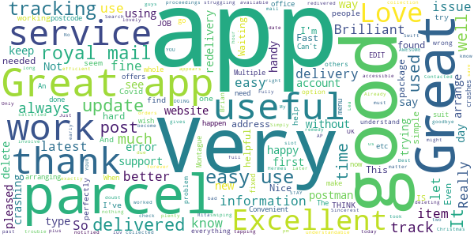
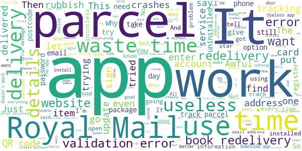

# Royal Mail - Tracking, redelivery, prices
App version ``6.0.4``

Analyzed with [covid-apps-observer](http://github.com/covid-apps-observer) project, version ``0.1``

## App overview
| | |
|-------------------------|-------------------------| 
| **Name**&nbsp;&nbsp;&nbsp;&nbsp;&nbsp;&nbsp;&nbsp;&nbsp;&nbsp;&nbsp;&nbsp;&nbsp;&nbsp;&nbsp;&nbsp;&nbsp;&nbsp;&nbsp;&nbsp;&nbsp;&nbsp;&nbsp;&nbsp;&nbsp;&nbsp;&nbsp;&nbsp;&nbsp;&nbsp;&nbsp;&nbsp;&nbsp;&nbsp;&nbsp;&nbsp;&nbsp;&nbsp;&nbsp;&nbsp;&nbsp;  | Royal Mail - Tracking, redelivery, prices |
| **Unique identifier** | com.royalmail.app.droid |
| **Link to Google Play** | [https://play.google.com/store/apps/details?id=com.royalmail.app.droid](https://play.google.com/store/apps/details?id=com.royalmail.app.droid) |
| **Summary**  | Easily manage your items and track your deliveries |
| **Privacy policy** | [https://www.royalmail.com/privacy-notice](https://www.royalmail.com/privacy-notice) |
| **Latest version** | 6.0.4 |
| **Last update** | 2021-01-07 16:29:12 |
| **Recent changes** | This latest release includes performance updates and bug fixes. |
| **Installs**  | 1,000,000+ |
| **Category** | Lifestyle |
| **First release** | Sep 4, 2018 |
| **Size**  | 54M |
| **Supported Android version**  | 8.0 and up |

### Description
> 📦📦📦 With the Royal Mail App, you can:
 • Send an item - quickly and easily buy postage in just a few steps. You can print your labels at home or take the QR code on the app to a Royal Mail Customer Service Point/Delivery Office and we’ll print the label for you when you drop off your item.
 • Find your nearest drop off location - Postbox, Parcel Postbox, Post Office branch or Royal Mail Customer Service Point.
 • Track your items – just enter your tracking ID number or scan the barcode to check the progress of your deliveries (available with Royal Mail Tracked and Royal Mail Special Delivery Guaranteed items)
 • Find the size and format of your parcel using the Augmented Reality Parcel Sizer guide. Available with AR supported devices.
 •	Change your delivery options to suit you – You can now change where your parcel is delivered, to a Safeplace or neighbour after it has been sent. (available with Royal Mail Tracked items)
 •	Get proof of postage sent straight to your phone – get that extra peace of mind when dropping of at any of our locations (including our 24/7 Parcel Postboxes)
 • Postcode and address finder – if you’re not sure of a full address, or want to check a postcode, just enter part of the address and we’ll fill in the blanks
 • Find any Post Office locations or Customer Service Point/Delivery Office to print your label or drop off your item, with opening hours, address, map, available services and directions
 • Receive push notifications on your deliveries - never miss a delivery update
 • Save items you are tracking, and add an alias name making them easier to identify 
 • See a photograph of the signature if someone has signed for it, or the Safeplace an item has been delivered to
 • Book a Redelivery – if you’ve missed an item you can easily book a Redelivery to your address, your neighbour’s address or a local Post Office – and specify a delivery day
 • Save postage receipts – simply take a photo of your receipt and store it to the app
 • Track an item on the go - if you have Alexa, you can track your delivery by saying an alias name you have previously assigned to an item

### User interface
The developers of the app provide the following screenshots in the Google play store.
| | | |
|:-------------------------:|:-------------------------:|:-------------------------:|
 |   |   |   | 
 |   |   |   | 
 |  

## Development team
In the following we report the main information provided by the development team in the Google play store.

| | |
|-------------------------|-------------------------|
| **Developer**  | Royal Mail Group |
| **Website**  | [https://www.royalmail.com](https://www.royalmail.com) |
| **Email** | appfeedback@royalmail.com |
| **Physical address**  | - |
| **Other developed apps**  | [https://play.google.com/store/apps/developer?id=Royal+Mail+Group](https://play.google.com/store/apps/developer?id=Royal+Mail+Group) |

## Android support

| | |
|-------------------------|-------------------------|
| **Declared target Android version**  | - |
| **Effective target Android version**  | - |
| **Minimum supported Android version**  | Oreo, version 8.0.0 (API level 26) |
| **Maximum target Android version**  | - |

The larger the difference between the minimum and maximum supported Android versions, the better. A larger difference means a wider audience. For example, old phones have a very low Android version, so a high minimum supported Android version means that the app cannot be used by users with old phones, thus leading to accessibility problems. 

## Requested permissions

In the following we report the complete list of the permissions requested by the app. 

| **Permission** | **Protection level** | **Description** | 
|-------------------------|-------------------------|-------------------------|
 **android.permission ACCESS_FINE_LOCATION** | :warning:**Dangerous** | Allows an app to access precise location. 
 **android.permission ACCESS_NETWORK_STATE** | Normal | Allows applications to access information about networks. 
 **android.permission CAMERA** | :warning:**Dangerous** | Required to be able to access the camera device. 
 **android.permission INTERNET** | Normal | Allows applications to open network sockets. 
 **android.permission RECEIVE_BOOT_COMPLETED** | Normal | Allows an application to receive the Intent.ACTION_BOOT_COMPLETED that is broadcast after the system finishes booting. 
 **android.permission WAKE_LOCK** | Normal | Allows using PowerManager WakeLocks to keep processor from sleeping or screen from dimming. 
 **android.permission WRITE_EXTERNAL_STORAGE** | :warning:**Dangerous** | Allows an application to write to external storage. 
 **com.google.android.c2dm.permission RECEIVE** | - | - 
 **com.royalmail.app.droid.permission MAPS_RECEIVE** | - | - 

## Mentioned servers

| **Server** | **Registrant** | **Registrant country** | **Creation date** | 
|-------------------------|-------------------------|-------------------------|-------------------------|
 | google.com | Google LLC | :us: US | 1997-09-15 04:00:00 |
 | microsoft.com | Microsoft Corporation | :us: US | 1991-05-02 04:00:00 |
 | tealiumiq.com | Whois Privacy Service | :us: US | 2011-02-09 18:33:06 |
 | googleapis.com | Google LLC | :us: US | 2005-01-25 17:52:26 |

## Security analysis 

Below we report the main security warnings raised by our execution of the [Androwarn](https://github.com/maaaaz/androwarn) security analysis tool.

**Telephony identifiers leakage**
> - This application reads the ISO country code equivalent of the current registered operator's MCC (Mobile Country Code) 
> - This application reads the numeric name (MCC+MNC) of current registered operator 
> - This application reads the operator name 

**Connection interfaces exfiltration**
> - This application reads details about the currently active data network 
> - This application tries to find out if the currently active data network is metered 

**Suspicious connection establishment**
> - This application opens a Socket and connects it to the remote address '' on the 'N/A' port  
> - This application opens a Socket and connects it to the remote address 'Ljava/lang/StringBuilder;->toString()Ljava/lang/String;' on the 'N/A' port  
> - This application opens a Socket and connects it to the remote address 'Ljava/net/Proxy;->type()Ljava/net/Proxy$Type;' on the 'N/A' port  
> - This application opens a Socket and connects it to the remote address 'timeout' on the 'N/A' port  

**Code execution**
> - This application loads a native library 
> - This application loads a native library: 'arcore_sdk_jni' 
> - This application loads a native library: 'arsceneview_jni' 
> - This application loads a native library: 'filament-jni' 
> - This application loads a native library: 'mono-native' 
> - This application loads a native library: 'monodroid' 
> - This application loads a native library: 'monosgen-2.0' 
> - This application loads a native library: 'xamarin-app' 
> - This application loads a native library: 'xamarin-debug-app-helper' 

## User ratings and reviews

Below we provide information about how end users are reacting to the app in terms of ratings and reviews in the Google Play store.

### Ratings

The Royal Mail - Tracking, redelivery, prices app has been installed by more than **1000000** times. At this time, **3100** rated the app and its average score is **2.6761904**. Below we show the distribution of the ratings across the usual star-based rating of Google Play

:star::star::star::star::star:: 1014

:star::star::star::star:: 206

:star::star::star:: 167

:star::star:: 187

:star:: 1526

### Reviews 

#### 5-star reviews

> Handy  :date: __2021-01-23 03:16:18__

> Best post service  :date: __2021-01-22 00:53:07__

> Good  :date: __2021-01-19 18:03:05__

> Great service and helpful  :date: __2021-01-16 00:30:12__

> My postman is lovely nothing to much trouble for him  :date: __2021-01-14 18:39:42__

> Not bad  :date: __2021-01-14 07:07:23__

> Very good app  :date: __2021-01-11 13:01:21__

> Love it 😊🙏💯🙃❤️  :date: __2021-01-11 07:56:06__

> Very good  :date: __2021-01-08 10:58:23__

> Great app, i can see exactly where my package is and when it will be delivered  :date: __2021-01-06 20:48:15__

#### 4-star reviews

> It's not a bad app for tracking parcels. Just would really like to be able to delete them from my list once they've been delivered. Any chance?  :date: __2021-01-19 16:25:38__

> World's be useful if it allowed you to delete previous tracked items  :date: __2021-01-12 10:14:01__

> This app is useful for tracking when your parcel will arrive.  :date: __2021-01-04 15:45:28__

> Excellent.  :date: __2021-01-03 10:46:40__

> Very good app.clear and well updated  :date: __2020-12-30 13:01:14__

> Excellent app easy to use  :date: __2020-12-18 15:14:40__

> I did not spell my email address correctly but when I went in to amend found nowhere to edit my details  :date: __2020-12-17 14:44:41__

> I like the app. Feature request: Address book, and option to set default home address. Unless I have missed it.  :date: __2020-12-17 08:50:28__

> For buying postage, it's almost perfect. I use this to post items that I make for my Etsy page, and it's mostly really good. Will be close to a 5* for that as soon as they include international postage.  :date: __2020-12-08 02:00:45__

> Excellent app, however few fixes I'd like to see. 1 After you name an item, the tracking number dissappears in the list replaced with the name. 2 allow a gap between the numbers for easier reading ie FE 1234 1234 GB 3 Allow the option to rearrange the list of items.  :date: __2020-12-05 08:29:08__

#### 3-star reviews

> Tracking Don't Update most of the time  :date: __2021-01-21 16:07:13__

> Sorry, an error occurred, can't install it, done the redelivery through site, just uninstalled.....  :date: __2021-01-18 19:42:45__

> Dates incorrectly read as US. Your item was delivered 01 August 2021... When it was delivered 20210108, not 20210801....  :date: __2021-01-08 10:24:06__

> Looking for cost of posting to Europe (Ireland). Can't find on this site!  :date: __2021-01-04 12:19:33__

> Tracking nos are alpha-num and long and I can't copy from my sources. Info seems sketchy. Update... uninstalled as won't accept my password, LIKE SO MANY APPS IT JUST DEFEATS ITSELF. Bah humbug.  :date: __2020-12-25 13:09:29__

> Unresponsive  :date: __2020-12-23 13:30:00__

> My first experience started well, BUT I'd arranged for a parcel to be collected, got the notification confirming tracking ID, & specific day of collection by my USUAL POSTIE. However when the postie turned up, (luckily he had to ring the doorbell as he was also delivering a parcel) he knew nothing about the collection as nothing was logged on his PDA & he couldn't therefore scan it to track. He did however agree to take it & assured me it would be scanned back at the depot. We'll see 🤞  :date: __2020-12-21 14:46:59__

> Great Concept Good Execution annoying gap. Like everything about this app, sending from home is great, but one thing; the need to enter your address, as sender every time is really annoying. Why doesn't it remember my details? Once fixed be good if the box to copy that from sender to the invoice address was default or unnecessary. Once that's fixed including an address book, or the ability to use addresses in your contacts, or those already in my Click and Drop profile would be a great feature.  :date: __2020-12-19 06:33:51__

> The post box app is good in principle but why does it tell people the time the post was collected rather than the time of the next collection, If I were catching a train I would want to know when the next one was, not the time of the one I had missed.  :date: __2020-12-12 18:23:14__

> Death to deeplinks!  :date: __2020-11-28 15:17:03__

#### 2-star reviews

> Gives you no option to talk to a real person in a live chat when you want to find out what's happened to your package you go round and round in circles with the options they give you and end up no better off you would of thought a company as big as royal mail would have that option and more tracking info so far not impressed at all  :date: __2021-01-20 19:59:54__

> App can be good but is limited and annoying. If registered and track items if you are out on delivery it doesn't let you schedule redelivery using details on app.You have to manually enter everything including address to redeliver.  :date: __2021-01-20 17:19:05__

> No landscape support  :date: __2021-01-19 08:30:47__

> Rocky start. Firstly they don't tell you if your previous login from the old app has been carried over so I had to do a forgot password to see if my email is still recognised. Then I wanted to change my password. To do this in a standard way on any app you tapo the three lines to pull down the menu - so far so good, then you tap Account - oh no you don't there isn't one so you fumble about trying the obscure options and get know where. I still haven't found where the Account settings are.  :date: __2021-01-11 12:22:55__

> There is no way to change your password in the app or website settings, seriously?  :date: __2021-01-07 15:06:41__

> Won't let me sign up to track my parcel  :date: __2021-01-06 13:03:10__

> It wasn't very helpful ive been waiting for a while for my items  :date: __2021-01-06 01:16:09__

> A lot of registration effort for nothing you can't do via their website  :date: __2021-01-02 12:25:56__

> This is the results of privatisation in app form. Doesn't even do the basics.  :date: __2020-12-26 16:01:07__

> I installed the app to get an update as to when my delivery would occur. I dont understand why the service is "deliver by 9pm" but you have no tracking ability. It's no wonder why services like heroes are used, as they let you know when they are an hour away, estimated delivery time. I wouldnt use the Royal mail if I have any choice, customers value the ability to know when the parcel will arrive, even if that's a 3 hour time slot.  :date: __2020-12-24 21:04:12__

#### 1-star reviews

> absolutely useless and stressful.  :date: __2021-01-22 16:33:41__

> Utterly useless - doesn't even have an option to open the app!  :date: __2021-01-22 14:09:46__

> Useless, rubbish app! It doesn't recognise your tracking number!  :date: __2021-01-19 18:29:31__

> Should display in the app on the tracking info who the sender is for signed-for items  :date: __2021-01-19 15:14:41__

> Wouldn't accept password. Reset password and it wouldn't accept new password. Waste of time.  :date: __2021-01-19 10:39:42__

> Shocking app  :date: __2021-01-18 16:08:55__

> As an Android programmer myself, I wonder why a new app version doesn't retain my login. It's not difficult 🤪  :date: __2021-01-18 12:01:26__

> Just awful  :date: __2021-01-17 20:58:07__

> Useless tracking. Very vague. No information. Just telling me stuff I already know. "We have it" ect. Useless. Use the website. It's not much better. But it is slightly more information  :date: __2021-01-16 21:01:17__

> The app added a login screen for more pointless data farming and and targeting. Just use the website and delete this app.  :date: __2021-01-14 11:42:13__

