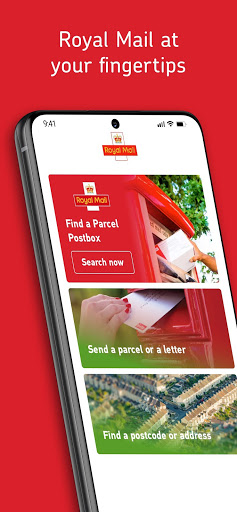
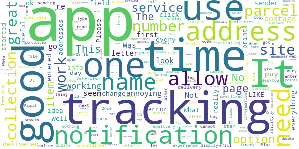
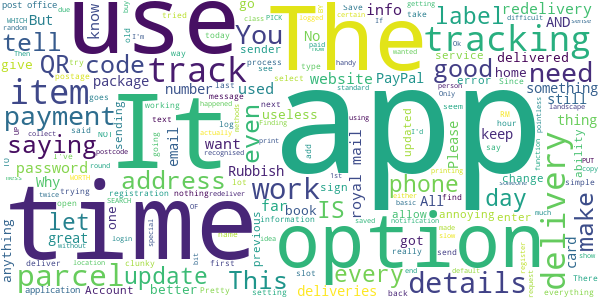
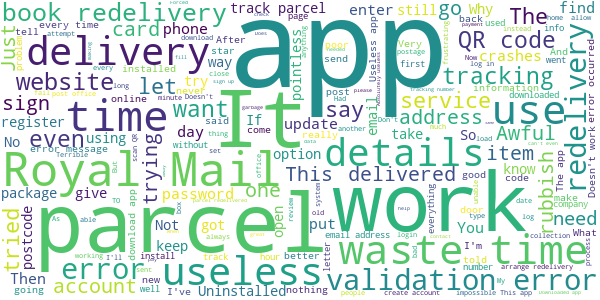

# Royal Mail - Tracking, redelivery, prices
App version ``7.0.3``

Analyzed with [covid-apps-observer](http://github.com/covid-apps-observer) project, version ``0.1``

## App overview
| | |
|-------------------------|-------------------------| 
| **Name**&nbsp;&nbsp;&nbsp;&nbsp;&nbsp;&nbsp;&nbsp;&nbsp;&nbsp;&nbsp;&nbsp;&nbsp;&nbsp;&nbsp;&nbsp;&nbsp;&nbsp;&nbsp;&nbsp;&nbsp;&nbsp;&nbsp;&nbsp;&nbsp;&nbsp;&nbsp;&nbsp;&nbsp;&nbsp;&nbsp;&nbsp;&nbsp;&nbsp;&nbsp;&nbsp;&nbsp;&nbsp;&nbsp;&nbsp;&nbsp;  | Royal Mail - Tracking, redelivery, prices |
| **Unique identifier** | com.royalmail.app.droid |
| **Link to Google Play** | [https://play.google.com/store/apps/details?id=com.royalmail.app.droid](https://play.google.com/store/apps/details?id=com.royalmail.app.droid) |
| **Summary**  | Easily manage your items and track your deliveries |
| **Privacy policy** | [https://www.royalmail.com/privacy-notice](https://www.royalmail.com/privacy-notice) |
| **Latest version** | 7.0.3 |
| **Last update** | 2021-02-09 17:20:30 |
| **Recent changes** | This latest version includes some performance updates and bug fixes. |
| **Installs**  | 1,000,000+ |
| **Category** | Lifestyle |
| **First release** | Sep 4, 2018 |
| **Size**  | 56M |
| **Supported Android version**  | 8.0 and up |

### Description
> 📦📦📦 With the Royal Mail App, you can:
 • Send an item - quickly and easily buy postage in just a few steps. You can print your labels at home or take the QR code on the app to a Royal Mail Customer Service Point/Delivery Office and we’ll print the label for you when you drop off your item.
 • Find your nearest drop off location - Postbox, Parcel Postbox, Post Office branch or Royal Mail Customer Service Point.
 • Track your items – just enter your tracking ID number or scan the barcode to check the progress of your deliveries (available with Royal Mail Tracked and Royal Mail Special Delivery Guaranteed items)
 • Find the size and format of your parcel using the Augmented Reality Parcel Sizer guide. Available with AR supported devices.
 •	Change your delivery options to suit you – You can now change where your parcel is delivered, to a Safeplace or neighbour after it has been sent. (available with Royal Mail Tracked items)
 •	Get proof of postage sent straight to your phone – get that extra peace of mind when dropping of at any of our locations (including our 24/7 Parcel Postboxes)
 • Postcode and address finder – if you’re not sure of a full address, or want to check a postcode, just enter part of the address and we’ll fill in the blanks
 • Find any Post Office locations or Customer Service Point/Delivery Office to print your label or drop off your item, with opening hours, address, map, available services and directions
 • Receive push notifications on your deliveries - never miss a delivery update
 • Save items you are tracking, and add an alias name making them easier to identify 
 • See a photograph of the signature if someone has signed for it, or the Safeplace an item has been delivered to
 • Book a Redelivery – if you’ve missed an item you can easily book a Redelivery to your address, your neighbour’s address or a local Post Office – and specify a delivery day
 • Save postage receipts – simply take a photo of your receipt and store it to the app
 • Track an item on the go - if you have Alexa, you can track your delivery by saying an alias name you have previously assigned to an item

### User interface
The developers of the app provide the following screenshots in the Google play store.
| | | |
|:-------------------------:|:-------------------------:|:-------------------------:|
 |   |   |   | 
 |   |   |   | 
 |  

## Development team
In the following we report the main information provided by the development team in the Google play store.

| | |
|-------------------------|-------------------------|
| **Developer**  | Royal Mail Group |
| **Website**  | [https://www.royalmail.com](https://www.royalmail.com) |
| **Email** | appfeedback@royalmail.com |
| **Physical address**  | - |
| **Other developed apps**  | [https://play.google.com/store/apps/developer?id=Royal+Mail+Group](https://play.google.com/store/apps/developer?id=Royal+Mail+Group) |

## Android support

| | |
|-------------------------|-------------------------|
| **Declared target Android version**  | - |
| **Effective target Android version**  | - |
| **Minimum supported Android version**  | Oreo, version 8.0.0 (API level 26) |
| **Maximum target Android version**  | - |

The larger the difference between the minimum and maximum supported Android versions, the better. A larger difference means a wider audience. For example, old phones have a very low Android version, so a high minimum supported Android version means that the app cannot be used by users with old phones, thus leading to accessibility problems. 

## Requested permissions

In the following we report the complete list of the permissions requested by the app. 

| **Permission** | **Protection level** | **Description** | 
|-------------------------|-------------------------|-------------------------|
 **android.permission ACCESS_FINE_LOCATION** | :warning:**Dangerous** | Allows an app to access precise location. 
 **android.permission ACCESS_NETWORK_STATE** | Normal | Allows applications to access information about networks. 
 **android.permission CAMERA** | :warning:**Dangerous** | Required to be able to access the camera device. 
 **android.permission INTERNET** | Normal | Allows applications to open network sockets. 
 **android.permission WAKE_LOCK** | Normal | Allows using PowerManager WakeLocks to keep processor from sleeping or screen from dimming. 
 **android.permission WRITE_EXTERNAL_STORAGE** | :warning:**Dangerous** | Allows an application to write to external storage. 
 **com.google.android.c2dm.permission RECEIVE** | - | - 
 **com.royalmail.app.droid.permission MAPS_RECEIVE** | - | - 

## Mentioned servers

| **Server** | **Registrant** | **Registrant country** | **Creation date** | 
|-------------------------|-------------------------|-------------------------|-------------------------|
 | google.com | Google LLC | :us: US | 1997-09-15 04:00:00 |
 | microsoft.com | Microsoft Corporation | :us: US | 1991-05-02 04:00:00 |
 | tealiumiq.com | Whois Privacy Service | :us: US | 2011-02-09 18:33:06 |
 | tiqcdn.com | Whois Privacy Service | :us: US | 2012-07-11 23:06:45 |
 | googleapis.com | Google LLC | :us: US | 2005-01-25 17:52:26 |

## Security analysis 

Below we report the main security warnings raised by our execution of the [Androwarn](https://github.com/maaaaz/androwarn) security analysis tool.

**Telephony identifiers leakage**
> - This application reads the ISO country code equivalent of the current registered operator's MCC (Mobile Country Code) 
> - This application reads the numeric name (MCC+MNC) of current registered operator 
> - This application reads the operator name 

**Connection interfaces exfiltration**
> - This application reads details about the currently active data network 
> - This application tries to find out if the currently active data network is metered 

**Suspicious connection establishment**
> - This application opens a Socket and connects it to the remote address '' on the 'N/A' port  
> - This application opens a Socket and connects it to the remote address 'Ljava/lang/StringBuilder;->toString()Ljava/lang/String;' on the 'N/A' port  
> - This application opens a Socket and connects it to the remote address 'Ljava/net/Proxy;->type()Ljava/net/Proxy$Type;' on the 'N/A' port  
> - This application opens a Socket and connects it to the remote address 'timeout' on the 'N/A' port  

**Code execution**
> - This application loads a native library: 'Ljava/lang/String;->valueOf(Ljava/lang/Object;)Ljava/lang/String;' 
> - This application loads a native library: 'arcore_sdk_jni' 
> - This application loads a native library: 'arsceneview_jni' 
> - This application loads a native library: 'filament-jni' 
> - This application loads a native library: 'mono-native' 
> - This application loads a native library: 'monodroid' 
> - This application loads a native library: 'monosgen-2.0' 
> - This application loads a native library: 'xamarin-app' 
> - This application loads a native library: 'xamarin-debug-app-helper' 

## User ratings and reviews

Below we provide information about how end users are reacting to the app in terms of ratings and reviews in the Google Play store.

### Ratings

The Royal Mail - Tracking, redelivery, prices app has been installed by more than **1000000** times. At this time, **3307** rated the app and its average score is **3.0737462**. Below we show the distribution of the ratings across the usual star-based rating of Google Play

:star::star::star::star::star:: 1298

:star::star::star::star:: 351

:star::star::star:: 185

:star::star:: 244

:star:: 1229

### Reviews 

#### 5-star reviews

> Excellent  :date: __2021-02-12 21:15:01__

> Good  :date: __2021-02-12 01:32:27__

> Very good  :date: __2021-02-11 02:25:36__

> Brilliant tracking. Quick & up to date.  :date: __2021-02-10 18:34:09__

> great app  :date: __2021-02-10 16:15:39__

> Easy app to use and track parcels. Does the job.  :date: __2021-02-10 08:39:04__

> Thanks a lot for your tiny help of delivey specially this season winter.  :date: __2021-02-09 10:57:15__

> Really easy app to use. All the information are there, easy to find and fast to find everything. I do not use the website anymore as you can even buy the stamps there...but do not know how it will be in final (I suppose you receive a Pdf On email to print and glue on the parcel/letter). Immediate action when asking to deliver again or to track parcel  :date: __2021-02-07 16:21:18__

> Great 👍👍👍🙂  :date: __2021-02-07 15:32:27__

> This app does work  :date: __2021-02-06 17:10:26__

#### 4-star reviews

> No matter how many updates this app has, it still doesn't work, crashes upon opening everytime. I have been unable to use the app since February 2020 on a Sony Xperia XA1. Sort it out Royal Mail. Update, 13 Feb 2021 decided to try this app again and installed it again, it now works, opens, can login, and view my saved tracking numbers. Let's see how long it works.  :date: __2021-02-13 20:14:54__

> OK..  :date: __2021-02-09 20:35:17__

> Ok  :date: __2021-02-01 14:04:05__

> Improving thanks  :date: __2021-01-23 21:31:53__

> It's not a bad app for tracking parcels. Just would really like to be able to delete them from my list once they've been delivered. Any chance?  :date: __2021-01-19 16:25:38__

> World's be useful if it allowed you to delete previous tracked items  :date: __2021-01-12 10:14:01__

> This app is useful for tracking when your parcel will arrive.  :date: __2021-01-04 15:45:28__

> Excellent.  :date: __2021-01-03 10:46:40__

> Very good app.clear and well updated  :date: __2020-12-30 13:01:14__

> Excellent app easy to use  :date: __2020-12-18 15:14:40__

#### 3-star reviews

> Will not let me do change of address or any other services.  :date: __2021-02-12 14:46:46__

> Claims tubes that meet medium parcel dimensions are too big.  :date: __2021-02-11 22:00:00__

> Everytime I go on the app my session has expired and have to log in quite frustrating  :date: __2021-02-08 08:48:09__

> I use primarily for tracking incoming and outgoing parcels. Cannot edit description when inputting data which leaves me with columns of meaningless numbers until I am eventually allowed to manually edit once RM have clocked the item in system which is very slow and tedious. Unedited numbers are also duplicated in list and shuffled around making even more work! And whatever happened to push notifications? More and more I am having to use third party apps to help with tracking and sanity. 🚛🆘☯️  :date: __2021-02-07 15:31:01__

> When you click on a URL to the tracking number on another app suck as a email, it directs to this app instead of a web page which would be great but it doesn't phase the URL and extract the tracking number then take you directly there.  :date: __2021-02-03 09:34:29__

> Tracking Don't Update most of the time  :date: __2021-01-21 16:07:13__

> Sorry, an error occurred, can't install it, done the redelivery through site, just uninstalled.....  :date: __2021-01-18 19:42:45__

> Dates incorrectly read as US. Your item was delivered 01 August 2021... When it was delivered 20210108, not 20210801....  :date: __2021-01-08 10:24:06__

> Looking for cost of posting to Europe (Ireland). Can't find on this site!  :date: __2021-01-04 12:19:33__

> Tracking nos are alpha-num and long and I can't copy from my sources. Info seems sketchy. Update... uninstalled as won't accept my password, LIKE SO MANY APPS IT JUST DEFEATS ITSELF. Bah humbug.  :date: __2020-12-25 13:09:29__

#### 2-star reviews

> Finding it difficult to use  :date: __2021-02-10 12:14:09__

> Got there eventually but not a straight forward process. Like something from 2010.  :date: __2021-01-29 08:08:07__

> Useless they delivered to my house every day but don't have my address in the app therefore cant even log on or do anything  :date: __2021-01-26 21:24:17__

> Difficult to track things  :date: __2021-01-25 16:16:27__

> Needs quite a bit of work to make it worth having on the phone. It tells you you've had an attempted delivery, but with the same notification you cannot book a redelivery. Makes no sense.  :date: __2021-01-24 11:49:15__

> Gives you no option to talk to a real person in a live chat when you want to find out what's happened to your package you go round and round in circles with the options they give you and end up no better off you would of thought a company as big as royal mail would have that option and more tracking info so far not impressed at all  :date: __2021-01-20 19:59:54__

> App can be good but is limited and annoying. If registered and track items if you are out on delivery it doesn't let you schedule redelivery using details on app.You have to manually enter everything including address to redeliver.  :date: __2021-01-20 17:19:05__

> No landscape support  :date: __2021-01-19 08:30:47__

> Rocky start. Firstly they don't tell you if your previous login from the old app has been carried over so I had to do a forgot password to see if my email is still recognised. Then I wanted to change my password. To do this in a standard way on any app you tapo the three lines to pull down the menu - so far so good, then you tap Account - oh no you don't there isn't one so you fumble about trying the obscure options and get know where. I still haven't found where the Account settings are.  :date: __2021-01-11 12:22:55__

> There is no way to change your password in the app or website settings, seriously?  :date: __2021-01-07 15:06:41__

#### 1-star reviews

> Great App and Worse Service in UK. Maybe behind DPD. Hermes is better.  :date: __2021-02-13 13:26:55__

> The app is great, at giving misinformation, and delivering outlandishly overpromised delivery dates. The actual delivery service is an outdated dinosaur, needs to be wound up. 48 hour deliveries take up to a week, or 3 weeks, or get lost and never turn up. Update: latest package sat in a distribution centre for a week then got returned to the retailer, app still shows it in the distribution centre  :date: __2021-02-12 11:22:17__

> Third try with this app, previous review below. Your request could not be processed due to temporarily server maintenance. Does this app ever work? Previous review: Failed to help on a parcel a coupe of months back, but I thought I'd risk it and try again. No point - this time 'internal server error message'. Fails on the first task of redelivery! Downloaded this to try and get a parcel redelivered and got the same 'sorry an error occured while processing your request' others have.  :date: __2021-02-12 00:32:20__

> Awful  :date: __2021-02-10 16:15:15__

> Need to make the app like DPD and Hermes. Whereby it knows your details and notifys you when you have received a parcel and keeps you up to date when it's arriving. This app is nothing more than a waste of time.  :date: __2021-02-09 11:51:12__

> Royal mail what a joke you are. 1st I have a delivery window attached to my property that allows large parcels to be left in a secure room. So what do I find a Royal mail missed delivery telling me item to big for letter box no large parcel in the delivery window just the card 2nd you get a qr code to arrange a delivery that directs you to a Google app that doesn't work. 3rd you try calling the attached number and wait 2 hours to contact a human with the BS bovine splatter music excuse  :date: __2021-02-08 17:54:05__

> Only wanted to arrange a delivery couldn't figure it out.  :date: __2021-02-08 16:48:11__

> Full of errors stopping you from buying postage  :date: __2021-02-07 23:52:12__

> Rubbish doesn't do anything not fit for purpose  :date: __2021-02-07 10:35:10__

> Wont even log me in! I use the desktop site 20 - 30 times a day so I know what my email and password is but just says error x attempts left. - I wont bother  :date: __2021-02-07 10:30:47__

